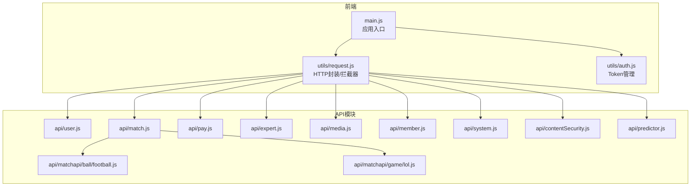
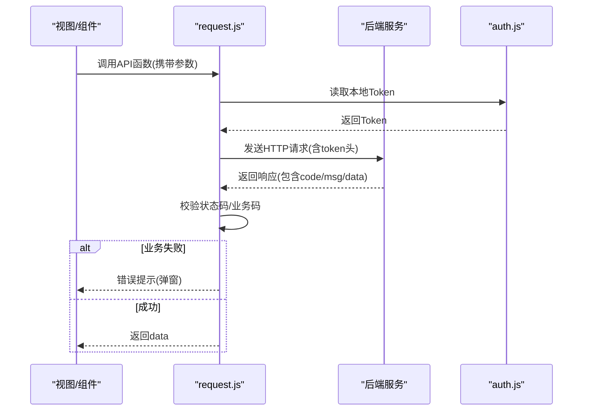

# API参考

<cite>
**本文档引用的文件**
- [request.js](file://src/utils/request.js)
- [auth.js](file://src/utils/auth.js)
- [user.js](file://src/api/user.js)
- [match.js](file://src/api/match.js)
- [pay.js](file://src/api/pay.js)
- [expert.js](file://src/api/expert.js)
- [media.js](file://src/api/media.js)
- [member.js](file://src/api/member.js)
- [system.js](file://src/api/system.js)
- [contentSecurity.js](file://src/api/contentSecurity.js)
- [predictor.js](file://src/api/predictor.js)
- [football.js](file://src/api/matchapi/ball/football.js)
- [lol.js](file://src/api/matchapi/game/lol.js)
- [main.js](file://src/main.js)
- [package.json](file://package.json)
</cite>

## 目录
1. [简介](#简介)
2. [项目结构](#项目结构)
3. [核心组件](#核心组件)
4. [架构总览](#架构总览)
5. [详细组件分析](#详细组件分析)
6. [依赖分析](#依赖分析)
7. [性能考虑](#性能考虑)
8. [故障排查指南](#故障排查指南)
9. [结论](#结论)
10. [附录](#附录)

## 简介
本文件为 Leisu Admin 项目的 API 参考文档，覆盖用户管理、内容管理、体育数据、支付管理、专家系统、媒体管理、成员与系统管理等模块的接口规范。文档提供各接口的 HTTP 方法、URL 路径、请求参数、响应格式、状态码说明、安全机制、版本策略、错误码规范以及使用指南，帮助前后端开发者快速对接。

## 项目结构
- 前端基于 Vue 2.x + Element UI，Axios 作为 HTTP 客户端封装。
- API 请求通过统一拦截器注入 token 并处理通用错误。
- 各业务模块在 src/api 下按功能拆分，例如用户、支付、专家、媒体、成员、系统、内容安全、体育数据等。
- 体育数据按球类与电竞细分目录，便于扩展与维护。

图表来源
- [main.js:1-526](file://src/main.js#L1-L526)
- [request.js:1-130](file://src/utils/request.js#L1-L130)
- [auth.js:1-17](file://src/utils/auth.js#L1-L17)
- [user.js:1-37](file://src/api/user.js#L1-L37)
- [match.js:1-1142](file://src/api/match.js#L1-L1142)
- [pay.js:1-532](file://src/api/pay.js#L1-L532)
- [expert.js:1-677](file://src/api/expert.js#L1-L677)
- [media.js:1-857](file://src/api/media.js#L1-L857)
- [member.js:1-814](file://src/api/member.js#L1-L814)
- [system.js:1-73](file://src/api/system.js#L1-L73)
- [contentSecurity.js:1-115](file://src/api/contentSecurity.js#L1-L115)
- [predictor.js:1-1024](file://src/api/predictor.js#L1-L1024)
- [football.js:1-775](file://src/api/matchapi/ball/football.js#L1-L775)
- [lol.js:1-289](file://src/api/matchapi/game/lol.js#L1-L289)

章节来源
- [main.js:1-526](file://src/main.js#L1-L526)
- [request.js:1-130](file://src/utils/request.js#L1-L130)

## 核心组件
- HTTP 封装与拦截器
  - 基于 Axios 的请求实例，自动注入 token 头部。
  - 统一处理响应状态码与业务错误码，弹窗提示并处理未登录场景。
  - 支持跨域 Cookie、超时时间配置。
- 认证与权限
  - Token 存储于本地存储，键名为固定值；登录成功后写入。
  - 页面级权限校验通过全局指令与工具函数实现。
- 业务 API 模块
  - 按领域拆分，如用户、支付、专家、媒体、成员、系统、内容安全、体育数据等。
  - 体育数据进一步细分为球类与电竞子模块，便于扩展。

章节来源
- [request.js:1-130](file://src/utils/request.js#L1-L130)
- [auth.js:1-17](file://src/utils/auth.js#L1-L17)
- [main.js:492-518](file://src/main.js#L492-L518)

## 架构总览
前端通过统一的 request.js 发起请求，拦截器负责：
- 注入 token 头部
- 统一错误处理与消息提示
- 登录态失效跳转

图表来源
- [request.js:29-68](file://src/utils/request.js#L29-L68)
- [auth.js:5-7](file://src/utils/auth.js#L5-L7)

## 详细组件分析

### 用户管理
- 登录
  - 方法: POST
  - 路径: /v1/admin/user/login
  - 请求体: 登录凭据(JSON)
  - 响应: 包含用户信息与令牌
- 钉钉登录
  - 方法: POST
  - 路径: /v1/admin/user/ding_login
  - 请求体: 钉钉回调参数(JSON)
- 获取当前用户信息
  - 方法: GET
  - 路径: /v1/admin/user/user_info
- 获取验证码
  - 方法: GET
  - 路径: /v1/admin/user/valid_code
- 退出登录
  - 方法: POST
  - 路径: /v1/admin/user/logout

章节来源
- [user.js:1-37](file://src/api/user.js#L1-L37)

### 支付管理
- 支付记录列表
  - 方法: POST
  - 路径: /v1/admin/pay/transaction_list
- 支付订单详情
  - 方法: POST
  - 路径: /v1/admin/pay/transaction_detail
- 手动订单
  - 获取产品列表: GET /v1/admin/pay/products
  - 获取手动订单列表: POST /v1/admin/pay/manual_order_list
  - 创建手动订单: POST /v1/admin/pay/create_manual_order
  - 完成手动订单: POST /v1/admin/pay/complete_manual_order
- 提现管理
  - 提现列表: POST /v1/admin/pay/withdraw_list
  - 提现申请: POST /v1/admin/pay/withdraw_apply
  - 更新提现信息: POST /v1/admin/pay/withdraw_update
  - 签约渠道: POST /v1/admin/pay/sign_channel
  - 批量修改签约渠道: POST /v1/admin/pay/withdraw_update_channel
- 银行卡记录
  - 银行卡列表: POST /v1/admin/pay/bank_list
- 雷速券
  - 用户雷速券: POST /v1/admin/pay/member_coupons
  - 发放批次: POST /v1/admin/pay/create_coupon_batch
  - 雷速券报表: POST /v1/admin/pay/coupons_report
  - 雷速券报表(总): POST /v1/admin/pay/coupons_report_all
  - 雷速券报表v2: POST /v1/admin/pay/coupons_report_v2
- 金币流水
  - 金币流水: POST /v1/admin/pay/coin_tournover
- 内购商品
  - 商品列表: GET /v1/admin/pay/trade_product_list
  - 交易列表: POST /v1/admin/pay/trade_list
  - 交易报表: POST /v1/admin/pay/trade_report
  - 交易榜单: POST /v1/admin/pay/trade_rank
  - VIP购买报表: POST /v1/admin/pay/transaction_vip_report
  - 支付报表: POST /v1/admin/pay/transaction_report
- 厂商与商户
  - 厂商列表: POST /v1/admin/pay/merchant_list
  - 删除厂商: POST /v1/admin/pay/delete_merchant
  - 编辑厂商: POST /v1/admin/pay/save_merchant
  - 厂商订单列表: POST /v1/admin/pay/merchant_order_list
  - 厂商报表: POST /v1/admin/pay/merchant_order_report
- 苹果(IAP)与支付宝退款
  - 苹果掉单处理: POST /v1/admin/pay/iap_finish_trx
  - 苹果历史订单: GET /v1/admin/pay/iap_transaction_history
  - 苹果退款订单: GET /v1/admin/pay/iap_refund_history
  - 支付宝退款: POST /v1/admin/pay/alipay_refund
  - 易宝退款: POST /v1/admin/pay/yop_refund
  - 苹果内购通知: POST /v1/admin/pay/iap_notify
  - 苹果内购通知报表: POST /v1/admin/pay/iap_notify_report
  - 苹果充值黑名单: POST /v1/admin/pay/iap_banned_list
  - 编辑黑名单: POST /v1/admin/pay/save_iap_banned
  - 异常充值记录: POST /v1/admin/pay/abnormal_recharge_list
  - 咪咕订单列表: POST /v1/admin/pay/migu_order_list
- 其他
  - 个人购买商品总计: GET /v1/admin/pay/member_transaction/{uid}
  - 流水类型: GET /v1/admin/pay/bill_type_list
  - 雷速币内购VIP回收: POST /v1/admin/pay/trade_vip_recycle
  - 支付订单-手动到账: POST /v1/admin/pay/complete_transaction

章节来源
- [pay.js:1-532](file://src/api/pay.js#L1-L532)

### 专家系统
- 专家号申请与管理
  - 申请列表: POST /v1/admin/expert/apply_list
  - 通过: POST /v1/admin/expert/pass_apply
  - 拒绝: POST /v1/admin/expert/reject_apply
  - 专家号列表: POST /v1/admin/expert/expert_lists
  - 专家号详情: POST /v1/admin/expert/expert_detail
  - 设置头像: POST /v1/admin/expert/set_avatar
  - 价格: POST /v1/admin/expert/price
  - 封禁隐藏记录: POST /v1/admin/expert/bans_log_list
  - 关注/粉丝: POST /v1/admin/expert/my_subscrip, POST /v1/admin/expert/subscrip_me
  - 比赛列表: POST /v1/admin/expert/match_list
  - 文章列表: POST /v1/admin/expert/article_list
  - 文章详情: GET /v1/admin/expert/article_detail?id={news_id}
  - 更新文章标志: POST /v1/admin/expert/update_article_flag
- 方案与购买
  - 精选方案: POST /v1/admin/expert/picked_by_match
  - 单场比赛购买记录: POST /v1/admin/expert/match_purchase_history
  - 文章购买记录: POST /v1/admin/expert/article_buyer
  - AI文章购买记录: POST /v1/admin/expert/ai_scheme_buyer
- 编辑与报表
  - 专家号编辑: POST /v1/admin/expert/expert_save
  - 编辑竞猜比赛: POST /v1/admin/expert/save_match
  - 文章报表v2: POST /v1/admin/expert/scheme_report_v2
  - 赛事报表: POST /v1/admin/expert/comp_report
  - 禁收列表: GET /v1/admin/expert/block_list
  - 修改审核: POST /v1/admin/expert/profile_update_list
  - 审核通过/拒绝: POST /v1/admin/expert/profile_update_verify, POST /v1/admin/expert/profile_update_reject
  - 批量更新比赛字段: POST /v1/admin/expert/update_match_field
  - 批量退款: POST /v1/admin/expert/refund
  - 消费榜单(卖方/买方): POST /v1/admin/expert/consumer_list, POST /v1/admin/expert/consumer_list_buyer
  - 申诉列表与处理: POST /v1/admin/expert/appeal_list, POST /v1/admin/expert/update_appeal
  - 收益/消费报表与详情: 多个POST接口
- 报表与统计
  - 收益报表V2/V3: POST /v1/admin/expert/income_report_v2, /v1/admin/expert/income_report_v2
  - 收益详情: POST /v1/admin/expert/income_detail
  - 消费报表V2/V3: POST /v1/admin/expert/consume_report_v2, /v1/admin/expert/consume_report_v2
  - 消费详情: POST /v1/admin/expert/consume_detail
  - 申诉报表: 多个POST接口
  - 走势图: POST /v1/admin/expert/trend_chart
  - 统计: POST /v1/admin/expert/statistics
  - 删除/隐藏文章: POST /v1/admin/expert/delete_article, POST /v1/admin/expert/hidden_article
  - 单场比赛精选文章: POST /v1/admin/expert/picked_by_match
  - 异常比赛: POST /v1/admin/expert/abnormal_match_list, POST /v1/admin/expert/abnormal_match_del
  - 全局收益报表V2: POST /v1/admin/expert/globla_income_report_v2
  - AI分析: 列表/详情/创建/删除/报表/排行
  - 预测分布: POST /v1/admin/expert/scheme_distributed, /v1/admin/expert/scheme_distributed_buyer, /v1/admin/expert/scheme_distributed_buyer_report, /v1/admin/expert/scheme_distributed_buyer_rank, /v1/admin/expert/scheme_distributed_match_rank
  - 刷新战绩: POST /v1/admin/expert/refresh_statistics
  - 批量快速修改: POST /v1/admin/expert/expert_update_v2
  - 达人评分: POST /v1/admin/expert/save_expert_score
  - 首购报表: POST /v1/admin/expert/union_trade_report
  - 销售对比: POST /v1/admin/expert/sale_report

章节来源
- [expert.js:1-677](file://src/api/expert.js#L1-L677)

### 媒体管理
- 雷速号申请与管理
  - 申请列表: POST /v1/admin/prediction/apply_list
  - 通过/拒绝: POST /v1/admin/prediction/pass_apply, /v1/admin/prediction/reject_apply
  - 雷速号列表: POST /v1/admin/prediction/prediction_lists
  - 详情: POST /v1/admin/prediction/prediction_detail
  - 头像设置: POST /v1/admin/prediction/set_avatar
  - 排名数据: GET /v1/admin/prediction/rank_data/{sport_id}/{prediction_id}
  - 快速修改: POST /v1/admin/prediction/update_field
- 文章与匹配
  - 文章列表: POST /v1/admin/prediction/article_list
  - 同步文章: POST /v1/admin/prediction/prediction_sync_article_ali
  - 变更审核: POST /v1/admin/prediction/profile_update_list, /v1/admin/prediction/profile_update_verify, /v1/admin/prediction/profile_update_reject
  - 文章隐藏/删除/惩罚: POST /v1/admin/prediction/update_article_flag, /v1/admin/prediction/article_punish
  - 竞猜比赛: POST /v1/admin/prediction/match_list, /v1/admin/prediction/save_match
  - 文章详情: GET /v1/admin/prediction/article_detail/{article_id}
  - 价格列表: POST /v1/admin/prediction/price_list
  - 购买记录: POST /v1/admin/prediction/article_buyer
  - 方案与比例: POST /v1/admin/prediction/match_prediction, POST /v1/admin/prediction/prediction_scale
  - 封禁/隐藏记录: POST /v1/admin/prediction/bans_log_list
  - 命中率: POST /v1/admin/prediction/article_rating
  - 走势图: POST /v1/admin/prediction/trend_chart
  - 关注/粉丝: POST /v1/admin/prediction/my_subscrip, /v1/admin/prediction/subscrip_me
  - 消费榜单(卖方/买方): POST /v1/admin/prediction/consumer_list, /v1/admin/prediction/consumer_list_buyer
  - 单场比赛购买记录: POST /v1/admin/prediction/match_purchase_history
  - 报表: 多个POST接口(方案类型、多串、比赛、赛事、消费对比、收益对比、销售报表V3、申诉报表、全局收益报表V2、刷新战绩、资深体育人、天梯赛季、串关文章、足彩文章、达人评分等)
- 串关与足彩
  - 串关文章: POST /v1/admin/prediction/multibet_list, /v1/admin/prediction/multibet_item_list
  - 串关详情: GET /v1/admin/prediction/multibet_detail/{article_id}
  - 串关隐藏/删除: POST /v1/admin/prediction/hidden_multibet, /v1/admin/prediction/delete_multibet
  - 足彩文章: POST /v1/admin/prediction/zc_prediction_list, /v1/admin/prediction/zc_prediction_detail/{id}
  - 足彩隐藏/删除: POST /v1/admin/prediction/hidden_zc_prediction, /v1/admin/prediction/delete_zc_prediction
- 天梯与赛季
  - 赛季列表/详情/编辑/移除: POST /v1/admin/prediction/ladder_season_list, /v1/admin/prediction/ladder_season_detail?season_id=..., /v1/admin/prediction/ladder_season, /v1/admin/prediction/remove_ladder_season
  - 赛季比赛: GET /v1/admin/prediction/ladder_season_match

章节来源
- [media.js:1-857](file://src/api/media.js#L1-L857)

### 成员与系统管理
- 成员管理
  - 成员列表: POST /v1/admin/member/member_list
  - 详情/手机号: GET /v1/admin/member/get_detail/{uid}, /v1/admin/member/get_phone/{uid}
  - 头像/昵称/手机: POST /v1/admin/member/set_avatar, /v1/admin/member/set_name, /v1/admin/member/set_phone
  - 设备标签: POST /v1/admin/member/devices_tag
  - 封禁/解封/永久封禁: POST /v1/admin/member/ban, /v1/admin/member/unban, /v1/admin/member/permanent_ban
  - 自助解封: POST /v1/admin/member/self_unban
  - 实名认证: POST /v1/admin/member/authentication_list, /v1/admin/member/save_authentication, /v1/admin/member/save_authentication_status
  - 用户组: POST /v1/admin/member/save_member_group
  - 添加用户: POST /v1/admin/member/add_member
  - 封禁记录/报表: POST /v1/admin/member/bans_log_list, /v1/admin/member/bans_report
  - 发送短信: POST /v1/admin/member/send_phone_code
  - 关注/屏蔽/粉丝: POST /v1/admin/group/fan_list, /v1/admin/group/shield_list, /v1/admin/group/follow_list
  - 帖子详情: GET /v1/admin/group/interactive_post_detail/{post_id}
  - 设备登录/注册日志: POST /v1/admin/member/device_login_log, /v1/admin/member/device_register_log
  - 阿里人证: POST /v1/admin/member/verify_ali
  - 敏感词: GET /v1/admin/member/sensitive_word_list, POST /v1/admin/member/add_sensitive_word, POST /v1/admin/member/delete_sensitive_word
  - 运营备注: POST /v1/admin/member/remark_list, POST /v1/admin/member/add_remark
  - 强制下线: POST /v1/admin/member/force_logout
  - 常用地址/设备: GET /v1/admin/member/login_cities?uid=..., GET /v1/admin/member/login_devices?uid=...
  - 删除常用地址/设备: POST /v1/admin/member/delete_city, POST /v1/admin/member/delete_device
  - 申诉/反馈: POST /v1/admin/member/appeal_list, POST /v1/admin/member/update_appeal, POST /v1/admin/member/opinion_list, POST /v1/admin/member/update_opinion
  - 实名认证报表: POST /v1/admin/member/authentication_report
  - 刷新缓存: POST /v1/admin/member/refresh_member_cache
  - 封禁记录导出: POST /v1/admin/member/ban_log_export
  - 注销列表: POST /v1/admin/member/logoff_list
  - 成就统计/挂件: GET /v1/admin/member/honor_stats?uid=..., POST /v1/admin/member/pendant_data, POST /v1/admin/member/get_pendant_list, POST /v1/admin/member/pendant_buyer, POST /v1/admin/member/pendant_buyer_report, POST /v1/admin/member/pendant_all_report
  - 申诉人报表/阿里短信记录: POST /v1/admin/member/appeal_operate_report, POST /v1/admin/member/ali_sms_record
  - 粉丝趋势: POST /v1/admin/member/media_fans_trend, /v1/admin/member/expert_fans_trend, /v1/admin/member/group_fans_trend, POST /v1/admin/member/group_fans_trend_rank
  - 设备封禁: POST /v1/admin/member/banned_devices, POST /v1/admin/member/add_banned_device, POST /v1/admin/member/remove_banned_devices
  - 反馈类型报表: POST /v1/admin/member/opinion_result_report, /v1/admin/member/opinion_user_report
  - 调研: POST /v1/admin/mobile/research_list, POST /v1/admin/mobile/save_research, POST /v1/admin/mobile/research_detail, POST /v1/admin/mobile/research_members, POST /v1/admin/mobile/research_award, POST /v1/admin/mobile/update_research
  - 挂件: POST /v1/admin/member/save_pendant, POST /v1/admin/member/send_pendant, POST /v1/admin/member/update_pendant_stock
  - 加粉: POST /v1/admin/member/add_fans
  - 注册/会员报表: POST /v1/admin/member/new_member_report, /v1/admin/member/new_member_vip_report
  - 用户分组记录: POST /v1/admin/member/member_group_log
  - 用户标识: GET /v1/admin/member/member_tag_msg
  - 修改用户描述: POST /v1/admin/member/set_description
  - 人群包: POST /v1/admin/member/member_segment_list, POST /v1/admin/member/save_member_segment, POST /v1/admin/member/refresh_member_segment, GET /v1/admin/member/member_segment_options, POST /v1/admin/member/get_member_segment_num
  - 随机马甲号: POST /v1/admin/member/fake_uids
  - 举报V2: POST /v1/admin/member/complain_list_v2, POST /v1/admin/member/update_complain_v2
  - 用户变更审核: POST /v1/admin/member/profile_update_list, /v1/admin/member/profile_update_verify, /v1/admin/member/profile_update_reject
  - 审核报表: POST /v1/admin/member/profile_update_report
  - 修改昵称/头像: POST /v1/admin/member/up_name, /v1/admin/member/up_avatar
  - 主队设置: POST /v1/admin/member/up_primarily_team
- 系统用户与权限
  - 获取详情: GET /v1/admin/user/get_detail
  - 用户列表: POST /v1/admin/user/user_list
  - 编辑用户: POST /v1/admin/user/save_user_v2
  - 用户组: GET /v1/admin/user/group_list, POST /v1/admin/user/save_group, POST /v1/admin/user/delete_group
  - 权限: GET /v1/admin/user/permissions_list
  - 删除用户: POST /v1/admin/user/delete_user
  - 操作日志: POST /v1/admin/user/operate_logs
  - 按权限查询用户组: POST /v1/admin/user/groups_by_permission

章节来源
- [member.js:1-814](file://src/api/member.js#L1-L814)
- [system.js:1-73](file://src/api/system.js#L1-L73)

### 内容安全
- 内容审核列表: POST /v1/admin/moderate/moderation
- 二审各类数据: GET /v1/admin/moderate/moderation_second_num
- 内容审核二审列表: POST /v1/admin/moderate/moderation_second
- 不处理二审内容: POST /v1/admin/moderate/ignore_moderation_second
- 处理二审: POST /v1/admin/moderate/handler_moderation_second
- 误判断内容忽略: POST /v1/admin/moderate/ignore_moderation
- 敏感词列表: GET /v1/admin/moderate/sensitive_word_list?type={type}
- 添加敏感词: POST /v1/admin/moderate/add_sensitive_word
- 删除敏感词: POST /v1/admin/moderate/delete_sensitive_word

章节来源
- [contentSecurity.js:1-115](file://src/api/contentSecurity.js#L1-L115)

### 体育数据（足球）
- 比赛/队伍/球员/赛事/荣誉/转会/教练/场馆/国家/阶段/分类/国家等
  - 列表与更新/重置/刷新/荣誉权重/教练履历/裁判执法统计/积分规则/阵容/球员统计/热门赛事/比赛评分/资料库/黑名单位置等
- 竞彩/足彩/北单指数与期号
  - 竞彩期号/指数: GET /v1/admin/match/football/football_jc_issue_list, POST /v1/admin/match/football/football_jc_list
  - 足彩期号/指数: POST /v1/admin/match/football/football_zc_issue_list, POST /v1/admin/match/football/football_zc_list
  - 北单指数: POST /v1/admin/match/football/football_bd_list
  - 北单胜负期号/指数: GET /v1/admin/match/football/bd_sf_issue_list?{sport_id}, POST /v1/admin/match/football/bd_sf_list
- 实时分析与报表
  - 实时分析购买记录: POST /v1/admin/match/football/football_real_time_analytics_purchase
  - 实时分析: GET /v1/admin/match/football/football_real_time_analytics?match_id=...
  - 实时分析报表: POST /v1/admin/match/football/football_real_time_analytics_purchase_report
- 资料库重要/编辑/黑名单位置
  - 重要列表/编辑: GET /v1/admin/match/football/database_important_list, POST /v1/admin/match/football/database_important_save
  - GIF黑名单/编辑: GET /v1/admin/match/football/gif_black_list, POST /v1/admin/match/football/gif_black_save

章节来源
- [football.js:1-775](file://src/api/matchapi/ball/football.js#L1-L775)

### 体育数据（LOL）
- 比赛/队伍/队员/赛事/英雄/天赋/技能/装备/国家/活跃定位/直播详情/更新/重置/刷新/积分榜/最佳/转会/荣誉/统计/排行榜/事件/热门赛事/数据修正/评分等
- 热门赛事: 列表/添加/删除/权重修改
- 数据修正: POST /v1/admin/match/esports/lol/lol_fix_detail
- 评分: GET /v1/admin/match/esports/lol/match_rating?match_id={data}

章节来源
- [lol.js:1-289](file://src/api/matchapi/game/lol.js#L1-L289)

### 比赛公共能力（match.js）
- 推荐与情报
  - 更新推荐状态: POST /v1/admin/match/common/update_picked
  - 动态情报编辑/列表: POST /v1/admin/match/common/save_intelligence, POST /v1/admin/match/common/intelligence_list
  - APP推荐: POST /v1/admin/match/common/update_intelligence_picked
- 指数与视频
  - 指数列表/半场/纳米/必发: POST /v1/admin/match/common/odds_list, /v1/admin/match/common/half_odds, /v1/admin/match/common/nami_odds, /v1/admin/match/common/befair_odds
  - 指数详情: POST /v1/admin/match/common/odds_detail
  - 视频源与直播: POST /v1/admin/match/common/match_video_url, /v1/admin/match/common/match_video_urls, /v1/admin/match/common/match_video_link, /v1/admin/match/common/match_video_links_2, /v1/admin/match/common/match_mlive_links, /v1/admin/match/common/match_video_order, /v1/admin/match/common/live_stream_forbid, /v1/admin/match/common/live_stream_resume, /v1/admin/match/common/live_stream_block_list, /v1/admin/match/common/match_video_user
  - 电竞视频流/解析/多种播放方式/动画视频: POST /v1/admin/match/common/match_esport_video_url, /v1/admin/match/common/match_video_key, /v1/admin/match/common/match_video_keys, /v1/admin/match/common/match_mlive_links
  - 获取推流地址: POST /v1/admin/match/common/get_push_url
- 分析与报表
  - 纳米优劣势: POST /v1/admin/match/common/get_analysis_intelligence, /v1/admin/match/common/analysis_intelligence_list, /v1/admin/match/common/analysis_intelligence_report, /v1/admin/match/common/analysis_intelligence_income_report, /v1/admin/match/common/analysis_intelligence_union_trade_report
- 资料库与节目单
  - H5资料库: POST /v1/admin/match/common/database_h5, /v1/admin/match/common/database_h5_save, /v1/admin/match/common/database_h5_delete
  - 节目单: POST /v1/admin/match/common/save_match_program, /v1/admin/match/common/del_match_program, GET /v1/admin/match/common/match_program_list
- 备注与集锦
  - 编辑备注: POST /v1/admin/match/common/match_save_tips
  - 集锦/录像: POST /v1/admin/match/common/match_video_list, /v1/admin/match/common/match_videotape_list, /v1/admin/match/common/fix_fetch_videos, /v1/admin/match/common/match_video_update, /v1/admin/match/common/save_match_program_coll, /v1/admin/match/common/match_videotape_hidden, /v1/admin/match/common/del_match_program_coll
- 评论与评分
  - 抽屉评分评论: POST /v1/admin/match/common/comment_list
  - 球员评分: POST /v1/admin/match/common/player_comment_list, GET /v1/admin/match/common/player_comment_detail/{id}, POST /v1/admin/match/common/del_log_list, POST /v1/admin/match/common/player_comment_delete, POST /v1/admin/match/common/player_comment_hidden, POST /v1/admin/match/common/like_player_comment, POST /v1/admin/match/common/player_comment_like_detail, POST /v1/admin/match/common/save_player_comment, POST /v1/admin/match/common/create_player_comment
- 流监控与模型销售
  - 流监控: POST /v1/admin/match/common/stream_bit_rate, /v1/admin/match/common/live_up_video_audio_info
  - 模型销售: POST /v1/admin/match/common/match_model_order_list, /v1/admin/match/common/match_model_order_report, /v1/admin/match/common/match_model_order_rank
- 背景与重要比赛
  - 编辑背景: POST /v1/admin/match/common/match_backdrop_save
  - 重要比赛: POST /v1/admin/match/common/important_match_list, POST /v1/admin/match/common/save_important_match
- 单场视频价格与搜索
  - 价格设置: POST /v1/admin/match/common/edit_video_fee
  - 搜索资料库: POST /v1/admin/match/common/search
- 购买记录与报表
  - 直播购买记录/报表: POST /v1/admin/match/common/match_video_order_list, /v1/admin/match/common/match_video_order_report
- 小黄车
  - 详情/编辑/商品/库存/推送/销售记录/报表/打赏记录: 多个POST接口

章节来源
- [match.js:1-1142](file://src/api/match.js#L1-L1142)

### 专家系统（predictor.js）
- 专家号列表与详情: POST /v1/admin/predictor/predictor_lists, /v1/admin/predictor/predictor_detail
- 头像/昵称违规: POST /v1/admin/predictor/set_avatar, /v1/admin/predictor/set_name
- 分组/分成/状态修改: POST /v1/admin/predictor/predictor_save_group, /v1/admin/predictor/predictor_save, /v1/admin/predictor/update_field
- 申请与审核: POST /v1/admin/predictor/apply_list, /v1/admin/predictor/pass_apply, /v1/admin/predictor/reject_apply, /v1/admin/predictor/profile_update_list, /v1/admin/predictor/profile_update_verify, /v1/admin/predictor/profile_update_reject
- 榜单与赛事: POST /v1/admin/predictor/comp_rank_list, /v1/admin/predictor/save_comp_rank, /v1/admin/predictor/del_comp_rank
- 文章与购买: 单关/串关/足彩文章列表与详情、购买记录、删除/隐藏、申诉、异常比赛、竞猜比赛编辑、价格列表、评分与达人评分、榜单、天梯赛季、置顶配置、敏感词、战绩统计与趋势图、推荐订阅配置、刷新、销售对比、全局收益报表V2、热门/速推/主页专家置顶等
- 专家玩法榜: POST /v1/admin/predictor/pt_rank
- 敏感词: GET /v1/admin/predictor/sensitive_word_list?type=..., POST /v1/admin/predictor/add_sensitive_word, POST /v1/admin/predictor/delete_sensitive_word

章节来源
- [predictor.js:1-1024](file://src/api/predictor.js#L1-L1024)

## 依赖分析
- Axios 与 Element UI
  - Axios 用于 HTTP 请求，Element UI 提供 UI 组件与消息提示。
- 加密与工具
  - CryptoJS 用于 AES 解密；pako 用于解压；js-cookie 用于 Cookie 管理。
- 版本与构建
  - Vue 2.6.10、Element UI 2.7.0、Axios 0.18.1 等。

章节来源
- [package.json:37-96](file://package.json#L37-L96)
- [main.js:11-14](file://src/main.js#L11-L14)

## 性能考虑
- 请求超时: 默认 50000ms，可根据网络环境调整。
- 重定向与域名: 提供移动端/PC端域名配置，便于资源加载优化。
- 图片 CDN 前缀: 统一替换与添加前缀，减少跨域与提升加载效率。
- 压缩与解压: 对部分数据采用压缩/解压处理，降低传输体积。

章节来源
- [request.js:22-26](file://src/utils/request.js#L22-L26)
- [main.js:375-441](file://src/main.js#L375-L441)

## 故障排查指南
- 通用错误处理
  - 响应状态码非 200: 统一提示“未知”。
  - 业务错误码非 0: 弹窗显示 code 与 msg。
  - 登录态失效(特定业务码): 清除 Token 并跳转登录页。
- 常见 HTTP 状态码
  - 400/401/403/404/408/500/501/502/503/504/505: 统一提示对应错误信息。
- 建议排查步骤
  - 确认已注入 token 头部。
  - 检查请求参数与路径是否正确。
  - 查看后端返回的业务码与 msg，定位具体问题。
  - 如遇 401/403，检查登录状态与权限。

章节来源
- [request.js:46-127](file://src/utils/request.js#L46-L127)

## 结论
本 API 参考文档梳理了 Leisu Admin 前端侧的统一请求封装、认证机制、以及用户管理、支付管理、专家系统、媒体管理、成员与系统管理、内容安全、体育数据等模块的接口规范。建议在对接时严格遵循请求头、参数格式、分页与批量操作等使用规范，并结合错误码与状态码进行统一处理，确保系统稳定性与一致性。

## 附录
- 安全机制
  - 认证方式: 本地存储 Token，请求时自动注入 token 头部。
  - 权限验证: 页面级权限指令与工具函数配合后端 RBAC。
  - 数据加密: 使用 CryptoJS 进行解密；对部分数据进行压缩/解压。
- 版本管理策略
  - 接口路径以 /v1 开头，具备版本语义；后端需保持向后兼容。
  - 建议在升级时通过灰度与兼容层保证平滑过渡。
- 错误码规范
  - 业务错误码: 由后端返回，前端统一弹窗提示；遇到特定业务码(如登录失效)需清空 Token 并跳转登录。
  - HTTP 状态码: 前端统一映射并提示，便于快速定位问题。
- 使用指南
  - 请求头: 自动注入 token；如需上传文件，注意 Content-Type 与 FormData。
  - 参数格式: JSON；布尔值与数字需明确类型。
  - 分页与批量: 使用分页参数；批量操作建议后端幂等与事务处理。
  - 示例调用: 参考各模块 API 文件中的函数定义与注释，结合拦截器与认证流程。

章节来源
- [auth.js:1-17](file://src/utils/auth.js#L1-L17)
- [request.js:29-68](file://src/utils/request.js#L29-L68)
- [user.js:1-37](file://src/api/user.js#L1-L37)
- [pay.js:1-532](file://src/api/pay.js#L1-L532)
- [expert.js:1-677](file://src/api/expert.js#L1-L677)
- [media.js:1-857](file://src/api/media.js#L1-L857)
- [member.js:1-814](file://src/api/member.js#L1-L814)
- [system.js:1-73](file://src/api/system.js#L1-L73)
- [contentSecurity.js:1-115](file://src/api/contentSecurity.js#L1-L115)
- [predictor.js:1-1024](file://src/api/predictor.js#L1-L1024)
- [match.js:1-1142](file://src/api/match.js#L1-L1142)
- [football.js:1-775](file://src/api/matchapi/ball/football.js#L1-L775)
- [lol.js:1-289](file://src/api/matchapi/game/lol.js#L1-L289)