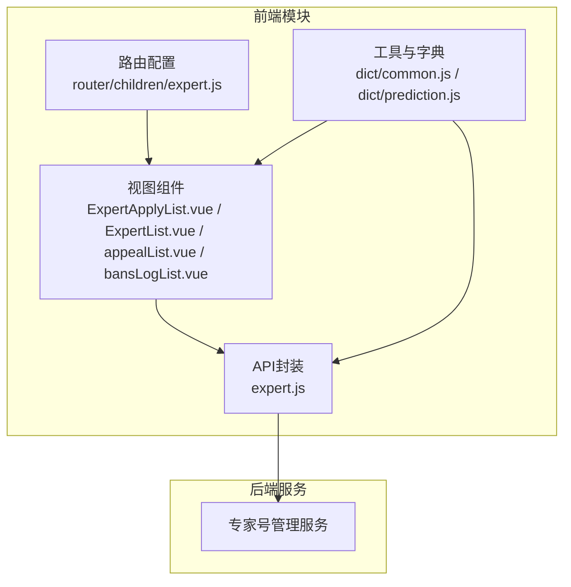
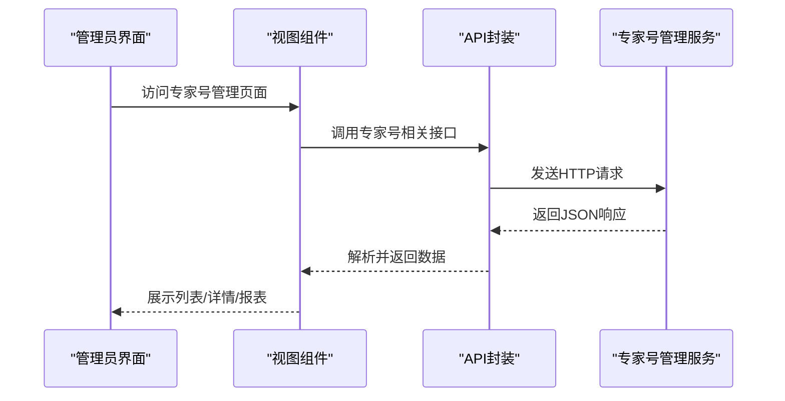
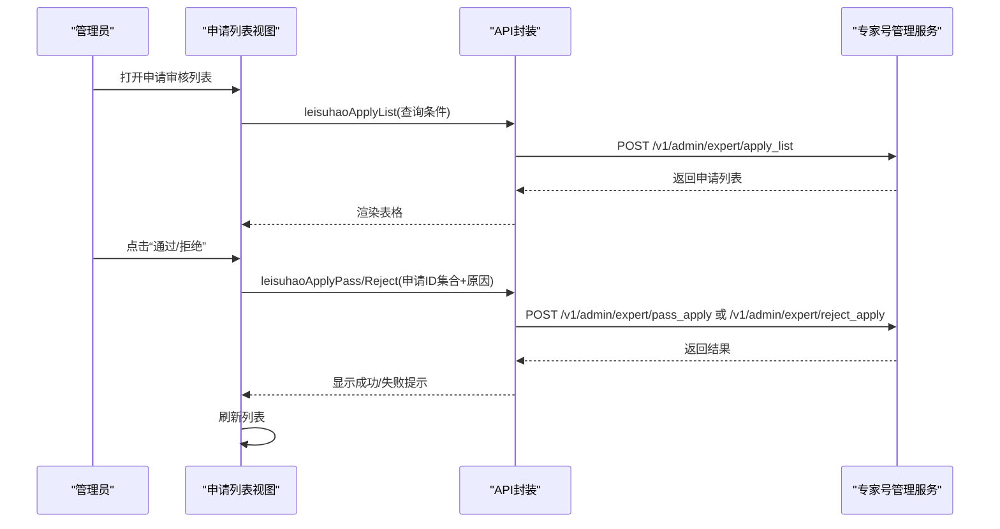
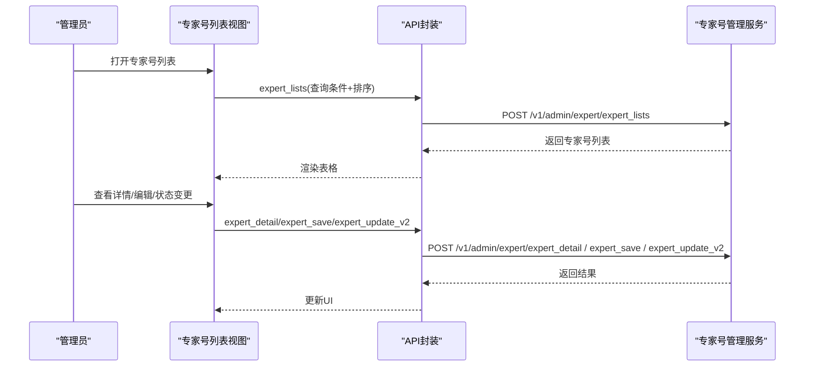
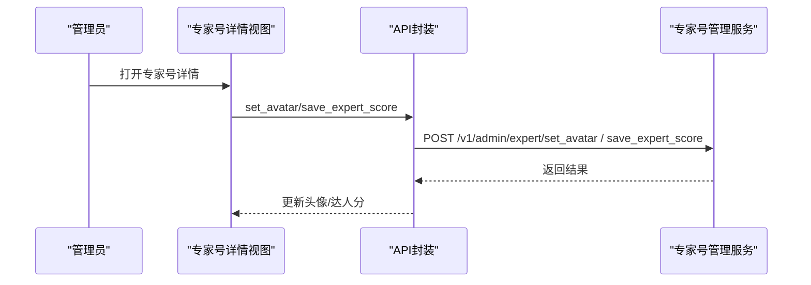
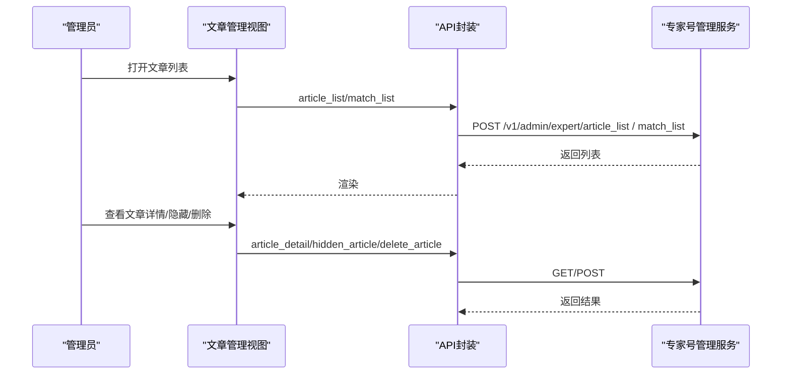
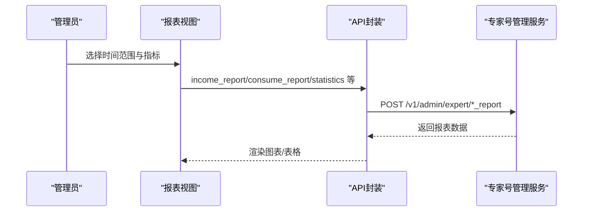
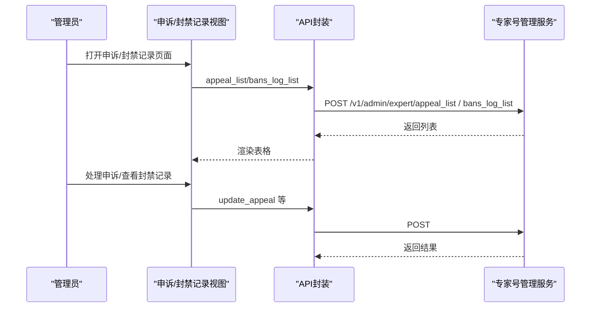
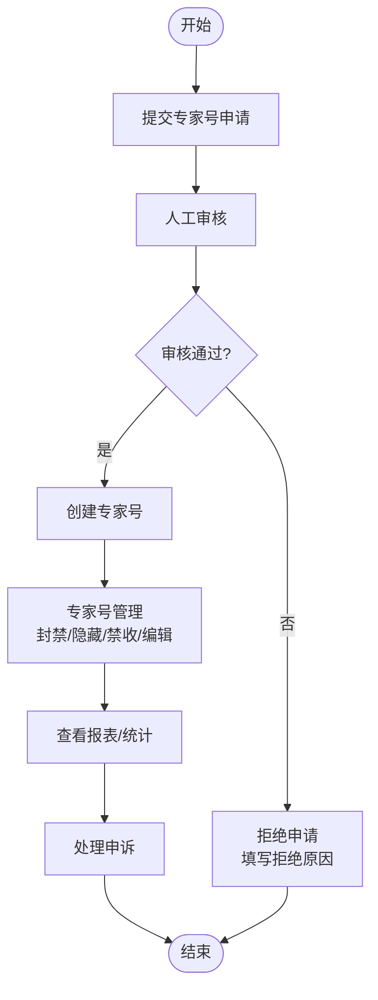
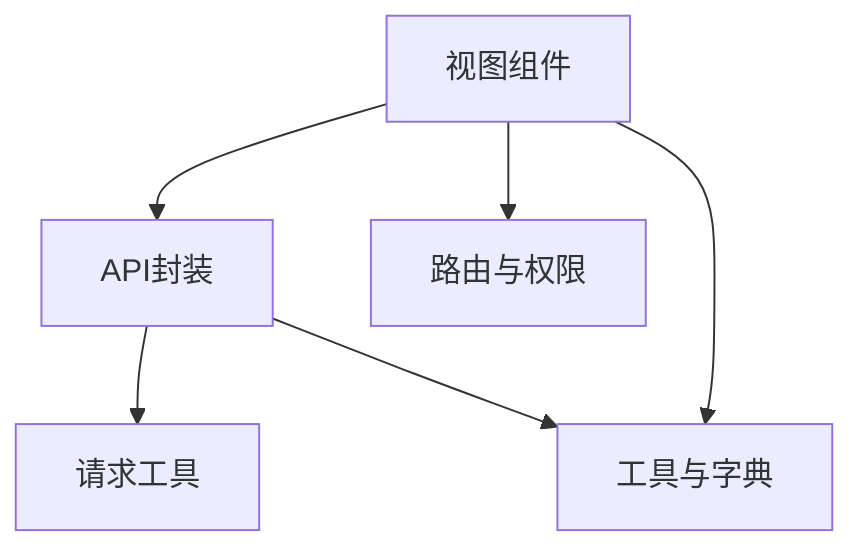

# 专家号管理API

<cite>
**本文档引用的文件**
- [expert.js](file://src/api/expert.js)
- [expert.js](file://src/router/children/expert.js)
- [ExpertApplyList.vue](file://src/views/expert/ExpertApplyList.vue)
- [ExpertList.vue](file://src/views/expert/ExpertList.vue)
- [appealList.vue](file://src/views/expert/appealList.vue)
- [bansLogList.vue](file://src/views/expert/bansLogList.vue)
- [Verify.vue](file://src/views/expert/components/Verify.vue)
- [ycMedia.vue](file://src/views/expert/components/ycMedia.vue)
- [common.js](file://src/utils/dict/common.js)
- [prediction.js](file://src/utils/dict/prediction.js)
</cite>

## 目录
1. [简介](#简介)
2. [项目结构](#项目结构)
3. [核心组件](#核心组件)
4. [架构概览](#架构概览)
5. [详细组件分析](#详细组件分析)
6. [依赖关系分析](#依赖关系分析)
7. [性能考虑](#性能考虑)
8. [故障排除指南](#故障排除指南)
9. [结论](#结论)
10. [附录](#附录)

## 简介
本文件为专家号管理模块的详细API文档，涵盖专家号申请、审核、管理等核心功能的接口规范与业务逻辑说明。文档基于前端API封装与视图组件实现，提供完整的接口调用示例、业务规则解释、数据模型定义与操作流程梳理，帮助开发者快速理解并集成专家号管理相关能力。

## 项目结构
专家号管理模块由以下关键部分组成：
- API封装层：统一管理专家号相关HTTP请求，包含申请、审核、列表查询、详情、头像设置、报表统计、申诉处理、封禁记录等接口。
- 视图组件层：提供专家号申请列表、专家号列表、申诉记录、封禁记录等页面，负责数据展示与交互。
- 路由与权限：定义专家号管理相关路由与角色权限，确保访问控制。
- 工具与字典：提供状态码、操作类型、原因枚举、分组类型等通用配置。

**图表来源**
- [expert.js:1-677](file://src/api/expert.js#L1-L677)
- [expert.js:1-123](file://src/router/children/expert.js#L1-L123)
- [ExpertApplyList.vue:1-487](file://src/views/expert/ExpertApplyList.vue#L1-L487)
- [ExpertList.vue:1-412](file://src/views/expert/ExpertList.vue#L1-L412)
- [appealList.vue:1-295](file://src/views/expert/appealList.vue#L1-L295)
- [bansLogList.vue:1-193](file://src/views/expert/bansLogList.vue#L1-L193)
- [common.js:1-722](file://src/utils/dict/common.js#L1-L722)
- [prediction.js:1-526](file://src/utils/dict/prediction.js#L1-L526)

**章节来源**
- [expert.js:1-677](file://src/api/expert.js#L1-L677)
- [expert.js:1-123](file://src/router/children/expert.js#L1-L123)

## 核心组件
本节概述专家号管理的关键接口与职责：
- 申请与审核
  - 专家号申请列表查询
  - 专家号申请通过
  - 专家号申请拒绝
- 专家号管理
  - 专家号列表查询
  - 专家号详情查询
  - 专家号批量/单个状态变更（封禁/隐藏/禁收）
  - 专家号头像设置
  - 专家号编辑与资料变更审核
- 内容与文章
  - 比赛列表、文章列表、文章详情
  - 文章购买记录、AI分析文章相关接口
  - 文章隐藏/删除
- 报表与统计
  - 收益/消费/战绩/分布等多维度报表
  - 申诉相关报表
- 违规与封禁
  - 封禁记录列表
  - 异常比赛管理
  - 退款处理
- 其他
  - 价格查询、精选方案、购买历史等

**章节来源**
- [expert.js:1-677](file://src/api/expert.js#L1-L677)

## 架构概览
专家号管理的前后端交互采用统一的API封装，视图组件通过调用API完成数据请求与状态更新。路由层控制页面访问权限，工具字典提供状态码与枚举映射，保障一致性与可维护性。

**图表来源**
- [expert.js:1-677](file://src/api/expert.js#L1-L677)
- [ExpertApplyList.vue:318-335](file://src/views/expert/ExpertApplyList.vue#L318-L335)
- [ExpertList.vue:193-205](file://src/views/expert/ExpertList.vue#L193-L205)

## 详细组件分析

### 专家号申请与审核
- 接口职责
  - 申请列表查询：支持按用户ID、申请时间、操作者、会员类型等条件筛选，分页返回申请记录。
  - 申请通过：支持单条或多条批量通过，需提供申请ID集合。
  - 申请拒绝：支持单条或多条批量拒绝，需提供拒绝原因与可选的原图删除标记。
- 关键字段
  - 申请ID、用户信息、预测号名称与头像、简介、特征照片、附件图片、申请原因、文章摘要、状态、操作者、拒绝原因。
- 业务流程
  - 管理员在申请列表中选择状态为“审核中”的记录，点击“通过”或“拒绝”，填写原因并确认。
  - 通过后生成专家号；拒绝后可选择删除服务器原图。
- 示例流程
  - 查询申请列表 -> 选择记录 -> 点击“通过/拒绝” -> 填写原因 -> 提交 -> 成功提示 -> 刷新列表

**图表来源**
- [expert.js:3-25](file://src/api/expert.js#L3-L25)
- [ExpertApplyList.vue:410-468](file://src/views/expert/ExpertApplyList.vue#L410-L468)

**章节来源**
- [expert.js:3-25](file://src/api/expert.js#L3-L25)
- [ExpertApplyList.vue:1-487](file://src/views/expert/ExpertApplyList.vue#L1-L487)
- [Verify.vue:1-18](file://src/views/expert/components/Verify.vue#L1-L18)

### 专家号列表与详情
- 接口职责
  - 专家号列表：支持按专家号名称、分组、用户ID、粉丝数、专家号ID、创建时间等条件查询，支持排序与分页。
  - 专家号详情：获取专家号基础信息、状态、头衔、简介、粉丝数、达人分、最后发布时间等。
  - 专家号编辑：支持修改专家号头像、名称、简介等。
  - 专家号状态变更：支持单个/批量封禁、隐藏、禁止收费等操作，需填写原因。
- 关键字段
  - 专家号ID、创建时间、专家号名称与头像、用户信息、头衔、简介、粉丝数、达人分、最后发布时间、状态（封禁/隐藏/禁收）。
- 业务流程
  - 在专家号列表中筛选/排序，查看详情，必要时进行状态变更或编辑。
  - 批量操作时，先勾选多条记录，再统一执行封禁/隐藏/禁收等操作。

**图表来源**
- [expert.js:28-202](file://src/api/expert.js#L28-L202)
- [ExpertList.vue:193-284](file://src/views/expert/ExpertList.vue#L193-L284)

**章节来源**
- [expert.js:28-202](file://src/api/expert.js#L28-L202)
- [ExpertList.vue:1-412](file://src/views/expert/ExpertList.vue#L1-L412)
- [ycMedia.vue:1-129](file://src/views/expert/components/ycMedia.vue#L1-L129)

### 专家号头像设置与编辑
- 接口职责
  - 设置专家号头像：支持上传并设置专家号头像。
  - 专家号编辑：支持修改专家号名称、简介、头衔等信息。
  - 达人分修改：支持手动调整达人分，并记录原因。
- 关键字段
  - 专家号ID、头像URL、专家号名称、简介、达人分、修改原因。
- 业务流程
  - 在专家号详情中选择“修改达人分”或“头像违规”重置头像，填写原因并提交。

**图表来源**
- [expert.js:45-202](file://src/api/expert.js#L45-L202)
- [ExpertList.vue:264-284](file://src/views/expert/ExpertList.vue#L264-L284)

**章节来源**
- [expert.js:45-202](file://src/api/expert.js#L45-L202)
- [ExpertList.vue:129-200](file://src/views/expert/ExpertList.vue#L129-L200)

### 专家号内容与文章管理
- 接口职责
  - 比赛列表、文章列表、文章详情：支持查询专家号发布的比赛与文章信息。
  - 文章购买记录、AI分析文章购买记录：支持查看文章/AI分析的购买情况。
  - 文章隐藏/删除：支持对文章进行隐藏或删除操作。
- 关键字段
  - 文章ID、标题、内容、发布时间、购买数量、价格、购买者信息。
- 业务流程
  - 在文章列表中查看文章详情，根据需要进行隐藏/删除操作，或查看购买记录。

**图表来源**
- [expert.js:99-122](file://src/api/expert.js#L99-L122)
- [ExpertList.vue:193-205](file://src/views/expert/ExpertList.vue#L193-L205)

**章节来源**
- [expert.js:99-122](file://src/api/expert.js#L99-L122)
- [ExpertList.vue:193-205](file://src/views/expert/ExpertList.vue#L193-L205)

### 专家号报表与统计
- 接口职责
  - 收益/消费/战绩/分布等多维度报表：支持按时间维度查询专家号的收益、消费、战绩与预测分布情况。
  - 申诉相关报表：支持申诉处理人报表、申诉人数报表、重复申诉报表、不处理申诉报表、重复封禁报表、封禁原因报表等。
- 关键字段
  - 时间范围、专家号ID、指标项（收入/支出/命中率/连红等）、报表类型。
- 业务流程
  - 在专家号报表页面选择时间范围与指标，查看对应报表数据。

**图表来源**
- [expert.js:325-437](file://src/api/expert.js#L325-L437)
- [ExpertList.vue:193-205](file://src/views/expert/ExpertList.vue#L193-L205)

**章节来源**
- [expert.js:325-437](file://src/api/expert.js#L325-L437)
- [ExpertList.vue:193-205](file://src/views/expert/ExpertList.vue#L193-L205)

### 专家号申诉与封禁记录
- 申诉记录
  - 接口职责：查询专家号申诉记录，支持按用户ID、专家号ID、申诉ID、操作人ID、创建时间等条件筛选，支持处理状态与加急状态筛选。
  - 关键字段：申诉ID、专家号、用户、操作人、封禁备注、申诉原因、回复、处理状态、是否加急、处理时长、创建/更新时间。
  - 业务流程：查看申诉列表，选择未处理记录进行处理，填写回复并提交。
- 封禁记录
  - 接口职责：查询专家号封禁/隐藏/禁收等操作记录，支持按操作类型筛选。
  - 关键字段：操作时间、专家号、用户、动作（封禁/隐藏/禁收）、粉丝数、最新文章时间、原因、操作者。
  - 业务流程：在封禁记录中查看历史操作，了解专家号状态变更轨迹。

**图表来源**
- [expert.js:299-405](file://src/api/expert.js#L299-L405)
- [appealList.vue:162-179](file://src/views/expert/appealList.vue#L162-L179)
- [bansLogList.vue:155-168](file://src/views/expert/bansLogList.vue#L155-L168)

**章节来源**
- [expert.js:299-405](file://src/api/expert.js#L299-L405)
- [appealList.vue:1-295](file://src/views/expert/appealList.vue#L1-L295)
- [bansLogList.vue:1-193](file://src/views/expert/bansLogList.vue#L1-L193)

### 专家号数据模型与业务规则
- 数据模型（核心字段）
  - 专家号基础信息：专家号ID、专家号名称、头像、简介、头衔、创建/更新/最后发布时间、粉丝数、达人分。
  - 状态字段：封禁（banned）、隐藏（hidden）、禁收（block_fee）、评级（rating）、违规次数（punish_times）。
  - 用户信息：UID、用户分组（group）、备注（remark）。
- 业务规则
  - 申请条件：提交专家号名称、头像、简介、特征照片、附件图片、申请原因、文章摘要等。
  - 审核标准：依据敏感词与内容规范进行审核，状态分为“审核中/通过/未通过”。
  - 等级划分：普通、雷速专家、资深专家、专家解说。
  - 封禁机制：支持封禁、隐藏、禁收、禁发、隐藏文章、删除文章、达人分调整等操作，需填写原因并记录操作日志。
- 字典与枚举
  - 审核状态：审核中、已通过、未通过。
  - 处理状态：未处理、已处理、不处理。
  - 操作类型：封禁、限流、禁收、禁发、隐藏文章、删除文章、修改达人分等。
  - 违规原因：发布联系方式、发布涉政/宗教/毒品信息、广告/网络地址、恶意攻击、发布除指定赛事外内容、大量无意义内容、虚假/夸大宣传、抄袭、与推荐比赛无关、结论与选项不符、含粗俗不雅词汇、涉及金额、引导用户大量跟单等。

**图表来源**
- [prediction.js:10-35](file://src/utils/dict/prediction.js#L10-L35)
- [common.js:377-400](file://src/utils/dict/common.js#L377-L400)

**章节来源**
- [prediction.js:1-526](file://src/utils/dict/prediction.js#L1-L526)
- [common.js:377-400](file://src/utils/dict/common.js#L377-L400)

## 依赖关系分析
- 组件耦合
  - 视图组件依赖API封装进行数据请求，API封装依赖后端服务。
  - 视图组件之间通过路由与权限控制访问，工具字典提供状态码与枚举映射。
- 外部依赖
  - 请求封装：统一的request工具，保证接口风格一致。
  - 权限控制：路由meta中定义角色权限，确保只有具备相应权限的管理员可访问。
  - 字典配置：状态、操作类型、原因等通过工具字典集中管理，便于维护与扩展。

**图表来源**
- [expert.js:1-677](file://src/api/expert.js#L1-L677)
- [expert.js:1-123](file://src/router/children/expert.js#L1-L123)
- [common.js:1-722](file://src/utils/dict/common.js#L1-L722)
- [prediction.js:1-526](file://src/utils/dict/prediction.js#L1-L526)

**章节来源**
- [expert.js:1-677](file://src/api/expert.js#L1-L677)
- [expert.js:1-123](file://src/router/children/expert.js#L1-L123)

## 性能考虑
- 分页与排序：列表查询支持分页与排序，建议合理设置每页大小与排序字段，避免一次性加载过多数据。
- 批量操作：批量封禁/隐藏/禁收可减少多次请求，提升管理效率。
- 缓存策略：对于静态字典与枚举，可在前端缓存以减少重复请求。
- 错误处理：统一的错误处理与提示，避免频繁重试导致的性能损耗。

## 故障排除指南
- 常见问题
  - 申请列表为空：检查查询条件与分页参数，确认状态筛选是否正确。
  - 审核操作失败：确认是否有足够的权限，检查拒绝原因是否填写。
  - 状态变更无效：确认专家号ID与目标状态是否正确，检查原因字段是否必填。
  - 报表数据异常：检查时间范围与指标选择，确认数据是否已生成。
- 排查步骤
  - 检查网络请求状态与返回码。
  - 核对请求参数与接口文档是否一致。
  - 查看控制台错误信息与后端日志。
  - 使用最小化复现步骤定位问题。

**章节来源**
- [ExpertApplyList.vue:410-468](file://src/views/expert/ExpertApplyList.vue#L410-L468)
- [ExpertList.vue:264-284](file://src/views/expert/ExpertList.vue#L264-L284)
- [appealList.vue:162-179](file://src/views/expert/appealList.vue#L162-L179)
- [bansLogList.vue:155-168](file://src/views/expert/bansLogList.vue#L155-L168)

## 结论
专家号管理模块通过统一的API封装与清晰的视图组件分工，实现了从申请审核到专家号管理、内容管理、报表统计与申诉封禁的完整闭环。结合完善的字典与权限控制，能够满足后台管理的多样化需求。建议在实际使用中遵循接口规范与业务规则，确保数据一致性与操作安全性。

## 附录
- 路由与权限
  - 专家号列表、申请审核列表、变更审核列表、申诉记录、操作记录、比赛列表、文章列表、赛事列表、专家号报表、站内信、异常比赛、AI分析、AI分析销售、预测分布购买、天梯赛季等路由均配置了相应的角色权限，确保访问控制。
- 实用工具
  - 审核状态、处理状态、操作类型、违规原因等字典集中管理，便于维护与扩展。

**章节来源**
- [expert.js:1-123](file://src/router/children/expert.js#L1-L123)
- [common.js:377-400](file://src/utils/dict/common.js#L377-L400)
- [prediction.js:10-35](file://src/utils/dict/prediction.js#L10-L35)