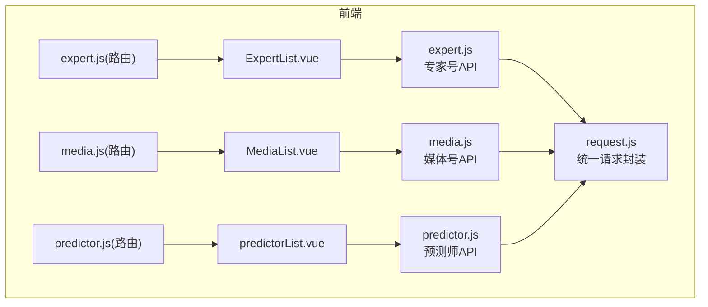
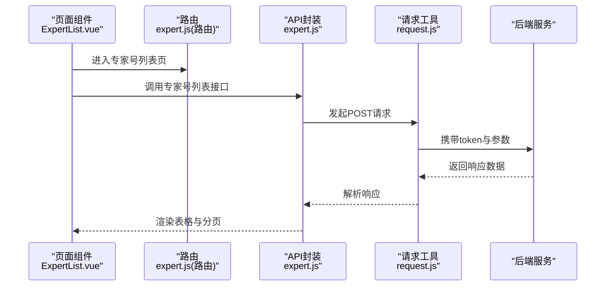
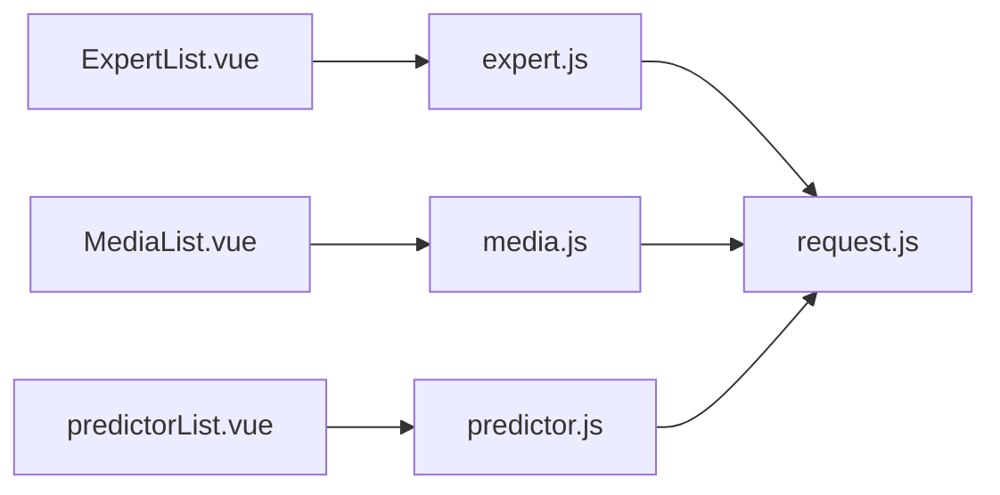

# 专家媒体API

<cite>
**本文引用的文件**
- [expert.js](file://src/api/expert.js)
- [media.js](file://src/api/media.js)
- [predictor.js](file://src/api/predictor.js)
- [expert.js(路由)](file://src/router/children/expert.js)
- [media.js(路由)](file://src/router/children/media.js)
- [predictor.js(路由)](file://src/router/children/predictor.js)
- [ExpertList.vue](file://src/views/expert/ExpertList.vue)
- [MediaList.vue](file://src/views/media/MediaList.vue)
- [predictorList.vue](file://src/views/predictor/predictorList.vue)
- [request.js](file://src/utils/request.js)
</cite>

## 目录
1. [引言](#引言)
2. [项目结构](#项目结构)
3. [核心组件](#核心组件)
4. [架构总览](#架构总览)
5. [详细组件分析](#详细组件分析)
6. [依赖关系分析](#依赖关系分析)
7. [性能考量](#性能考量)
8. [故障排查指南](#故障排查指南)
9. [结论](#结论)
10. [附录](#附录)

## 引言
本文件面向“专家媒体模块”的后端接口与前端集成，系统化梳理专家号、媒体号（雷速号）、预测师（专家号）相关接口的规范与使用方式，覆盖专家认证、内容审核、收益统计、预测管理等场景，并给出调用示例路径与业务规则说明。文档同时解释专家媒体的数据模型、运营流程与关键控制点，帮助开发者与运营人员高效落地。

## 项目结构
专家媒体模块由三部分组成：
- 前端API封装层：分别在 expert.js、media.js、predictor.js 中导出统一的请求方法，对应专家号、媒体号、预测师三类主体。
- 前端页面与路由：路由定义了专家号、媒体号、预测师的菜单与权限点；页面组件负责查询、筛选、批量操作与报表展示。
- 请求工具层：request.js 统一封装 axios 实例、环境变量切换、统一拦截器与错误提示。

图表来源
- [expert.js:1-677](file://src/api/expert.js#L1-L677)
- [media.js:1-857](file://src/api/media.js#L1-L857)
- [predictor.js:1-1024](file://src/api/predictor.js#L1-L1024)
- [expert.js(路由):1-123](file://src/router/children/expert.js#L1-L123)
- [media.js(路由):1-128](file://src/router/children/media.js#L1-L128)
- [predictor.js(路由):1-178](file://src/router/children/predictor.js#L1-L178)
- [ExpertList.vue:1-200](file://src/views/expert/ExpertList.vue#L1-L200)
- [MediaList.vue:1-200](file://src/views/media/MediaList.vue#L1-L200)
- [predictorList.vue:1-200](file://src/views/predictor/predictorList.vue#L1-L200)
- [request.js:1-130](file://src/utils/request.js#L1-L130)

章节来源
- [expert.js:1-677](file://src/api/expert.js#L1-L677)
- [media.js:1-857](file://src/api/media.js#L1-L857)
- [predictor.js:1-1024](file://src/api/predictor.js#L1-L1024)
- [expert.js(路由):1-123](file://src/router/children/expert.js#L1-L123)
- [media.js(路由):1-128](file://src/router/children/media.js#L1-L128)
- [predictor.js(路由):1-178](file://src/router/children/predictor.js#L1-L178)
- [ExpertList.vue:1-200](file://src/views/expert/ExpertList.vue#L1-L200)
- [MediaList.vue:1-200](file://src/views/media/MediaList.vue#L1-L200)
- [predictorList.vue:1-200](file://src/views/predictor/predictorList.vue#L1-L200)
- [request.js:1-130](file://src/utils/request.js#L1-L130)

## 核心组件
- 专家号API（expert.js）
  - 申请与审核：申请列表、通过、拒绝
  - 列表与详情：专家号列表、详情、头像设置
  - 内容管理：文章列表/详情、删除/隐藏文章、AI分析、购买记录
  - 比赛与赛事：比赛列表、保存/编辑比赛、精选方案、异常比赛
  - 收益与报表：文章/消费/收益报表与详情、全局收益、趋势图、战绩统计
  - 变更与申诉：资料变更审核、申诉列表与处理、批量快速修改
  - 其他：禁收列表、订阅、价格、排行榜等
- 媒体号API（media.js）
  - 申请与审核：申请列表、通过、拒绝
  - 列表与详情：媒体号列表、详情、头像设置、排名数据
  - 内容管理：文章列表、同步、删除/隐藏、AI分析、购买记录
  - 比赛与赛事：比赛列表、保存/编辑比赛、精选方案、异常比赛
  - 收益与报表：文章/消费/收益报表、全局收益、趋势图、多维度报表
  - 审核与申诉：审核列表与审核、申诉列表与处理、批量快速修改
  - 其他：禁收列表、订阅、价格、天梯赛季、资深体育人
- 预测师API（predictor.js）
  - 申请与审核：申请列表、通过、拒绝
  - 列表与详情：预测师列表、详情、头像/昵称违规处理、分组与分成
  - 内容管理：单关/串关/足彩文章列表与详情、删除/隐藏、AI分析
  - 比赛与赛事：比赛列表、保存/编辑比赛、榜单赛事、异常比赛
  - 收益与报表：单关/串关/足彩收益与消费报表、趋势图、战绩统计
  - 排行与置顶：命中/连中/返还/玩法榜，首页与比赛页置顶
  - 敏感词与天梯：敏感词列表/增删、天梯赛季管理
  - 其他：禁收禁发列表、订阅推荐配置、评分编辑

章节来源
- [expert.js:1-677](file://src/api/expert.js#L1-L677)
- [media.js:1-857](file://src/api/media.js#L1-L857)
- [predictor.js:1-1024](file://src/api/predictor.js#L1-L1024)

## 架构总览
前端通过各模块API文件发起请求，统一经 request.js 的 axios 实例发送到后端服务。页面组件根据路由加载并调用相应API完成数据查询、批量操作与报表展示。

图表来源
- [ExpertList.vue:1-200](file://src/views/expert/ExpertList.vue#L1-L200)
- [expert.js(路由):1-123](file://src/router/children/expert.js#L1-L123)
- [expert.js:1-677](file://src/api/expert.js#L1-L677)
- [request.js:1-130](file://src/utils/request.js#L1-L130)

章节来源
- [ExpertList.vue:1-200](file://src/views/expert/ExpertList.vue#L1-L200)
- [expert.js(路由):1-123](file://src/router/children/expert.js#L1-L123)
- [expert.js:1-677](file://src/api/expert.js#L1-L677)
- [request.js:1-130](file://src/utils/request.js#L1-L130)

## 详细组件分析

### 专家号管理API
- 申请与审核
  - 申请列表：POST /v1/admin/expert/apply_list
  - 通过：POST /v1/admin/expert/pass_apply
  - 拒绝：POST /v1/admin/expert/reject_apply
- 列表与详情
  - 专家号列表：POST /v1/admin/expert/expert_lists
  - 专家号详情：POST /v1/admin/expert/expert_detail
  - 头像设置：POST /v1/admin/expert/set_avatar
- 内容管理
  - 文章列表：POST /v1/admin/expert/article_list
  - 文章详情：GET /v1/admin/expert/article_detail?id={news_id}
  - 删除/隐藏文章：POST /v1/admin/expert/delete_article / /v1/admin/expert/hidden_article
  - AI分析：AI列表、详情、创建、删除、购买报表、作者报表、赛事报表
- 比赛与赛事
  - 比赛列表：POST /v1/admin/expert/match_list
  - 保存/编辑比赛：POST /v1/admin/expert/save_match
  - 精选方案：POST /v1/admin/expert/picked_by_match
  - 异常比赛：POST /v1/admin/expert/abnormal_match_list / /v1/admin/expert/abnormal_match_del
- 收益与报表
  - 文章/消费/收益报表与详情：POST /v1/admin/expert/scheme_report[_v2] / /v1/admin/expert/consume_report[_v2] / /v1/admin/expert/income_report[_v2] / /v1/admin/expert/consume_detail / /v1/admin/expert/income_detail
  - 全局收益：POST /v1/admin/expert/globla_income_report_v2
  - 趋势图/战绩统计：POST /v1/admin/expert/trend_chart / /v1/admin/expert/statistics
- 变更与申诉
  - 资料变更审核：POST /v1/admin/expert/profile_update_list / /v1/admin/expert/profile_update_verify / /v1/admin/expert/profile_update_reject
  - 申诉列表与处理：POST /v1/admin/expert/appeal_list / /v1/admin/expert/update_appeal
  - 批量快速修改：POST /v1/admin/expert/expert_update_v2
- 其他
  - 禁收列表：GET /v1/admin/expert/block_list
  - 订阅：POST /v1/admin/expert/my_subscrip / /v1/admin/expert/subscrip_me
  - 价格：POST /v1/admin/expert/price
  - 销售对比：POST /v1/admin/expert/sale_report

章节来源
- [expert.js:1-677](file://src/api/expert.js#L1-L677)

### 媒体号（雷速号）管理API
- 申请与审核
  - 申请列表：POST /v1/admin/prediction/apply_list
  - 通过：POST /v1/admin/prediction/pass_apply
  - 拒绝：POST /v1/admin/prediction/reject_apply
- 列表与详情
  - 媒体号列表：POST /v1/admin/prediction/prediction_lists
  - 详情：POST /v1/admin/prediction/prediction_detail
  - 头像设置：POST /v1/admin/prediction/set_avatar
  - 排名数据：GET /v1/admin/prediction/rank_data/{sport_id}/{prediction_id}
- 内容管理
  - 文章列表：POST /v1/admin/prediction/article_list
  - 同步文章：POST /v1/admin/prediction/prediction_sync_article_ali
  - 删除/隐藏：POST /v1/admin/prediction/delete_article / /v1/admin/prediction/hidden_article
  - AI分析：AI列表、详情、创建、删除、购买报表、作者报表、赛事报表
- 比赛与赛事
  - 比赛列表：POST /v1/admin/prediction/match_list
  - 保存/编辑比赛：POST /v1/admin/prediction/save_match
  - 精选方案：POST /v1/admin/prediction/match_articles
  - 异常比赛：POST /v1/admin/prediction/abnormal_match_list / /v1/admin/prediction/abnormal_match_del
- 收益与报表
  - 文章/消费/收益报表：POST /v1/admin/prediction/scheme_type_report / /v1/admin/prediction/scheme_report / /v1/admin/prediction/multibet_report / /v1/admin/prediction/match_report / /v1/admin/prediction/comp_report
  - 全局收益：POST /v1/admin/prediction/globla_income_report_v2
  - 趋势图：POST /v1/admin/prediction/trend_chart
  - 消费对比/收益对比：POST /v1/admin/prediction/diff_pay / /v1/admin/prediction/diff_income
- 审核与申诉
  - 资料变更审核：POST /v1/admin/prediction/profile_update_list / /v1/admin/prediction/profile_update_verify / /v1/admin/prediction/profile_update_reject
  - 申诉列表与处理：POST /v1/admin/prediction/appeal_list / /v1/admin/prediction/update_appeal
  - 批量快速修改：POST /v1/admin/prediction/update_field_v2
- 其他
  - 禁收列表：GET /v1/admin/prediction/block_list
  - 订阅：POST /v1/admin/prediction/my_subscrip / /v1/admin/prediction/subscrip_me
  - 价格：POST /v1/admin/prediction/price_list
  - 天梯赛季：POST /v1/admin/prediction/ladder_season_list / /v1/admin/prediction/ladder_season / /v1/admin/prediction/ladder_season_detail / /v1/admin/prediction/ladder_season_match
  - 资深体育人：POST /v1/admin/prediction/senior_save / GET /v1/admin/prediction/senior_list

章节来源
- [media.js:1-857](file://src/api/media.js#L1-L857)

### 预测师（专家号）管理API
- 申请与审核
  - 申请列表：POST /v1/admin/predictor/apply_list
  - 通过：POST /v1/admin/predictor/pass_apply
  - 拒绝：POST /v1/admin/predictor/reject_apply
- 列表与详情
  - 预测师列表：POST /v1/admin/predictor/predictor_lists
  - 详情：POST /v1/admin/predictor/predictor_detail
  - 头像/昵称违规：POST /v1/admin/predictor/set_avatar / /v1/admin/predictor/set_name
  - 分组与分成：POST /v1/admin/predictor/predictor_save_group
  - 资料修改：POST /v1/admin/predictor/predictor_save
  - 状态修改：POST /v1/admin/predictor/update_field
- 内容管理
  - 单关/串关/足彩文章：POST /v1/admin/predictor/predictor_single_list / /v1/admin/predictor/predictor_multibet_list / /v1/admin/predictor/predictor_lottery_prediction_list
  - 详情：GET /v1/admin/predictor/predictor_single_detail/{id} / /v1/admin/predictor/predictor_multibet_detail/{id} / /v1/admin/predictor/predictor_lottery_prediction_detail/{id}
  - 删除/隐藏：POST /v1/admin/predictor/delete_article / /v1/admin/predictor/hidden_article / /v1/admin/predictor/delete_multibet / /v1/admin/predictor/hidden_multibet / /v1/admin/predictor/delete_lottery_prediction / /v1/admin/predictor/hidden_lottery_prediction
  - AI分析：POST /v1/admin/predictor/ai_prediction_list / /v1/admin/predictor/ai_prediction_detail / /v1/admin/predictor/create_ai_prediction / /v1/admin/predictor/delete_ai
- 比赛与赛事
  - 比赛列表：POST /v1/admin/predictor/match_list
  - 保存/编辑比赛：POST /v1/admin/predictor/save_match
  - 榜单赛事：POST /v1/admin/predictor/comp_rank_list / /v1/admin/predictor/save_comp_rank / /v1/admin/predictor/del_comp_rank
  - 异常比赛：POST /v1/admin/predictor/abnormal_match_list / /v1/admin/predictor/abnormal_match_del
- 收益与报表
  - 单关/串关/足彩收益与消费：POST /v1/admin/predictor/income_detail / /v1/admin/predictor/multibet_income_detail / /v1/admin/predictor/zc_income_detail / /v1/admin/predictor/consume_detail / /v1/admin/predictor/multibet_consume_detail / /v1/admin/predictor/zc_consume_detail
  - 趋势图与战绩：GET /v1/admin/predictor/single_prediction_chart / /v1/admin/predictor/multibet_prediction_chart / GET /v1/admin/predictor/single_prediction_statistic / GET /v1/admin/predictor/multibet_prediction_statistic
- 排行与置顶
  - 命中/连中/返还/玩法榜：POST /v1/admin/predictor/single_accuracy_rank / /v1/admin/predictor/single_streak_rank / /v1/admin/predictor/multibet_streak_rank / /v1/admin/predictor/multibet_return_rank / /v1/admin/predictor/pt_rank
  - 置顶配置：POST /v1/admin/predictor/home_senior_fixed / /v1/admin/predictor/single_fast_fixed / /v1/admin/predictor/multibet_fast_fixed / /v1/admin/predictor/single_match_fast_fixed / /v1/admin/predictor/multibet_match_fast_fixed / /v1/admin/predictor/sub_list_fixed
  - 获取置顶：GET /v1/admin/predictor/get_home_senior_fixed / /v1/admin/predictor/get_single_fast_fixed / /v1/admin/predictor/get_multibet_fast_fixed / /v1/admin/predictor/get_single_match_fast_fixed / /v1/admin/predictor/get_multibet_match_fast_fixed / /v1/admin/predictor/get_sub_list_fixed
- 敏感词与天梯
  - 敏感词：GET /v1/admin/predictor/sensitive_word_list?type=... / POST /v1/admin/predictor/add_sensitive_word / POST /v1/admin/predictor/delete_sensitive_word
  - 天梯赛季：POST /v1/admin/predictor/ladder_season_list / /v1/admin/predictor/ladder_season / /v1/admin/predictor/ladder_season_detail / /v1/admin/predictor/ladder_season_match
- 其他
  - 禁收禁发列表：POST /v1/admin/predictor/block_publish_list
  - 订阅推荐配置：GET /v1/admin/predictor/get_recommend_predictor / POST /v1/admin/predictor/recommend_predictor
  - 评分编辑：POST /v1/admin/predictor/save_predictor_score / /v1/admin/predictor/save_article_score

章节来源
- [predictor.js:1-1024](file://src/api/predictor.js#L1-L1024)

### API调用示例（路径指引）
以下为常见业务场景的调用路径指引（请参考对应源码文件定位具体实现）：
- 专家申请
  - 申请列表：POST /v1/admin/expert/apply_list
  - 通过/拒绝：POST /v1/admin/expert/pass_apply, /v1/admin/expert/reject_apply
  - 参考：[expert.js:3-25](file://src/api/expert.js#L3-L25)
- 内容发布
  - 文章列表：POST /v1/admin/expert/article_list
  - 文章详情：GET /v1/admin/expert/article_detail?id={news_id}
  - 删除/隐藏：POST /v1/admin/expert/delete_article, /v1/admin/expert/hidden_article
  - 参考：[expert.js:98-122](file://src/api/expert.js#L98-L122)
- 收益查询
  - 收益报表/详情：POST /v1/admin/expert/income_report[_v2], /v1/admin/expert/income_detail
  - 消费报表/详情：POST /v1/admin/expert/consume_report[_v2], /v1/admin/expert/consume_detail
  - 参考：[expert.js:324-371](file://src/api/expert.js#L324-L371)
- 预测管理
  - 精选方案：POST /v1/admin/expert/picked_by_match
  - 异常比赛：POST /v1/admin/expert/abnormal_match_list, /v1/admin/expert/abnormal_match_del
  - 参考：[expert.js:468-484](file://src/api/expert.js#L162-L177, file://src/api/expert.js#L468-L484)
- 媒体号管理
  - 申请审核：POST /v1/admin/prediction/apply_list, pass/reject
  - 文章管理：POST /v1/admin/prediction/article_list, delete/hidden
  - 收益报表：POST /v1/admin/prediction/scheme_report, /v1/admin/prediction/income_report_v3
  - 参考：[media.js:288-338](file://src/api/media.js#L12-L36, file://src/api/media.js#L87-L103, file://src/api/media.js#L288-L338)
- 预测师管理
  - 申请审核：POST /v1/admin/predictor/apply_list, pass/reject
  - 文章管理：POST /v1/admin/predictor/predictor_single_list, detail, delete/hidden
  - 收益报表：POST /v1/admin/predictor/income_detail, /v1/admin/predictor/consume_detail
  - 参考：[predictor.js:437-511](file://src/api/predictor.js#L77-L100, file://src/api/predictor.js#L197-L220, file://src/api/predictor.js#L437-L511)

章节来源
- [expert.js:1-677](file://src/api/expert.js#L1-L677)
- [media.js:1-857](file://src/api/media.js#L1-L857)
- [predictor.js:1-1024](file://src/api/predictor.js#L1-L1024)

### 数据模型与业务规则
- 专家号/媒体号/预测师基础信息
  - 包含标识、用户关联、头衔、简介、粉丝数、达人分、最后发布时间、状态（正常/封禁/隐藏）、违规分、评分等字段
- 内容与预测
  - 单关/串关/足彩文章、AI分析、购买记录、命中/连中/返还趋势、精选方案
- 收益与分成
  - 收益/消费报表、全局收益、趋势图、战绩统计、评分编辑
- 审核与合规
  - 申请审核、资料变更审核、申诉处理、敏感词管理、禁收禁发策略
- 运营流程
  - 申请→审核→内容发布→收益统计→异常处理→申诉与评级

章节来源
- [ExpertList.vue:51-118](file://src/views/expert/ExpertList.vue#L51-L118)
- [MediaList.vue:34-120](file://src/views/media/MediaList.vue#L34-L120)
- [predictorList.vue:73-200](file://src/views/predictor/predictorList.vue#L73-L200)

## 依赖关系分析
- 模块耦合
  - 页面组件依赖对应API封装，API封装依赖request.js
  - 路由定义页面与权限点，页面通过API驱动数据流
- 外部依赖
  - axios、Element UI消息提示、环境变量切换（开发/生产/外部/数据平台）

图表来源
- [ExpertList.vue:1-200](file://src/views/expert/ExpertList.vue#L1-L200)
- [MediaList.vue:1-200](file://src/views/media/MediaList.vue#L1-L200)
- [predictorList.vue:1-200](file://src/views/predictor/predictorList.vue#L1-L200)
- [expert.js:1-677](file://src/api/expert.js#L1-L677)
- [media.js:1-857](file://src/api/media.js#L1-L857)
- [predictor.js:1-1024](file://src/api/predictor.js#L1-L1024)
- [request.js:1-130](file://src/utils/request.js#L1-L130)

章节来源
- [ExpertList.vue:1-200](file://src/views/expert/ExpertList.vue#L1-L200)
- [MediaList.vue:1-200](file://src/views/media/MediaList.vue#L1-L200)
- [predictorList.vue:1-200](file://src/views/predictor/predictorList.vue#L1-L200)
- [request.js:1-130](file://src/utils/request.js#L1-L130)

## 性能考量
- 分页与排序：列表接口均支持分页与自定义排序字段，建议按需传参避免一次性拉取过多数据
- 批量操作：提供批量封禁/隐藏/禁收等接口，减少多次交互
- 报表接口：收益/消费/趋势等接口建议限定时间范围，避免大跨度查询
- 图表与榜单：趋势图与排行榜接口建议缓存结果，降低重复计算

## 故障排查指南
- 常见错误
  - 401 未授权：检查 token 是否存在与有效
  - 403 拒绝访问：确认权限点是否具备（如 expert_lists、prediction_lists、predictor_lists 等）
  - 404 接口不存在：核对URL与版本前缀
  - 500 服务器错误：检查请求参数与后端日志
- 统一错误提示
  - request.js 在响应拦截器中统一提示错误信息，便于定位问题

章节来源
- [request.js:46-127](file://src/utils/request.js#L46-L127)

## 结论
专家媒体模块通过清晰的API分层与路由权限体系，实现了专家号、媒体号、预测师的全链路管理能力。结合本文档的接口规范、调用示例与业务规则，可快速完成专家认证、内容审核、收益统计与预测管理等场景的开发与运维工作。

## 附录
- 路由与页面映射
  - 专家号：expert.js(路由) → ExpertList.vue
  - 媒体号：media.js(路由) → MediaList.vue
  - 预测师：predictor.js(路由) → predictorList.vue

章节来源
- [expert.js(路由):1-123](file://src/router/children/expert.js#L1-L123)
- [media.js(路由):1-128](file://src/router/children/media.js#L1-L128)
- [predictor.js(路由):1-178](file://src/router/children/predictor.js#L1-L178)
- [ExpertList.vue:1-200](file://src/views/expert/ExpertList.vue#L1-L200)
- [MediaList.vue:1-200](file://src/views/media/MediaList.vue#L1-L200)
- [predictorList.vue:1-200](file://src/views/predictor/predictorList.vue#L1-L200)