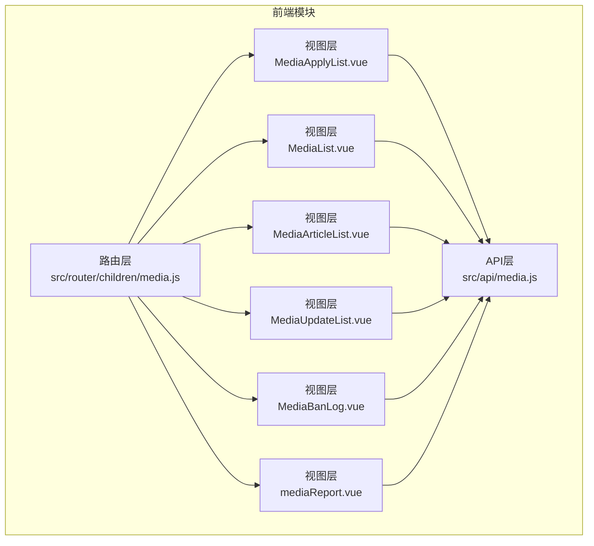
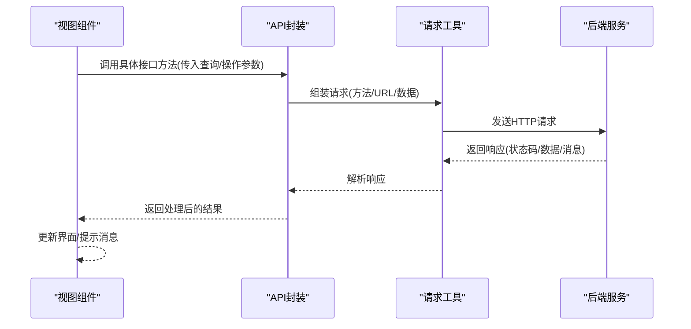
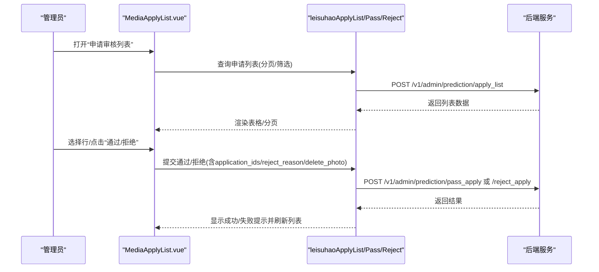
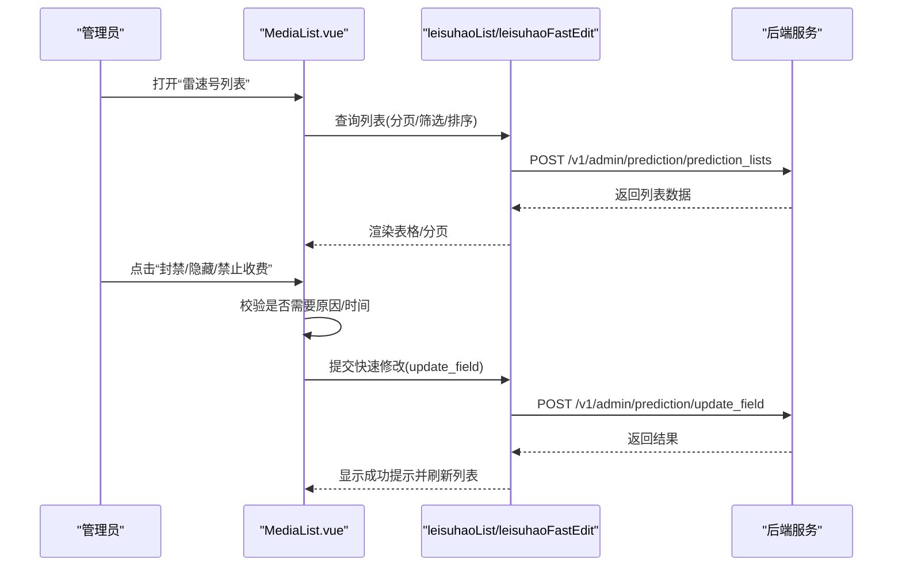
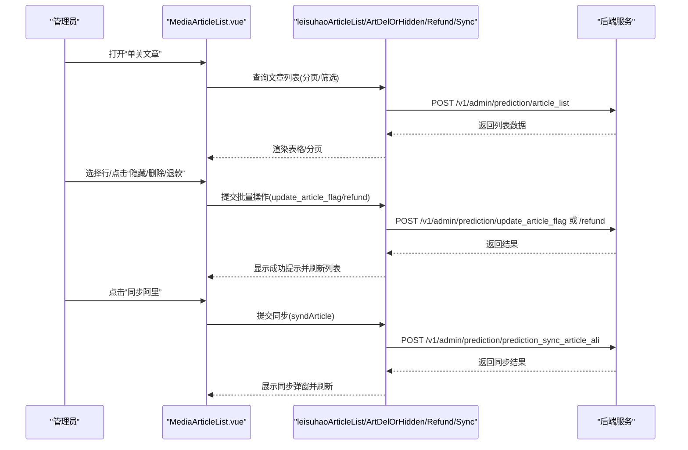
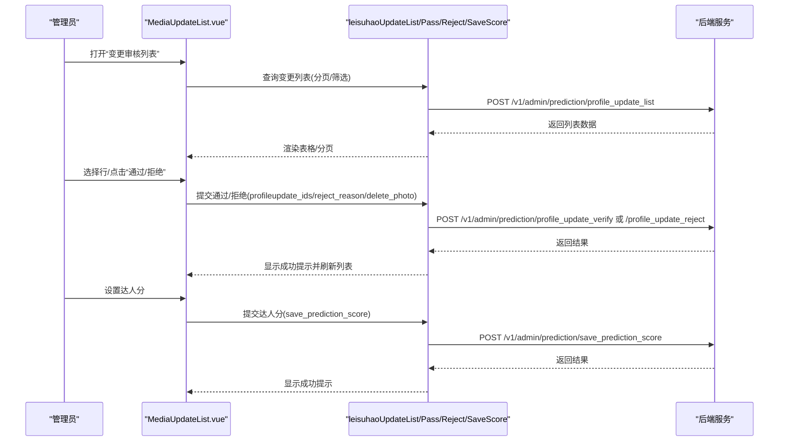
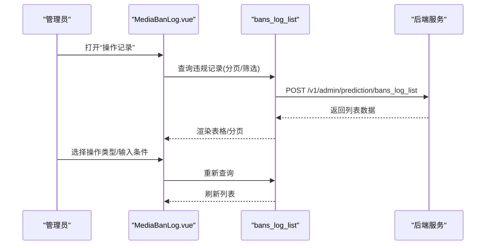
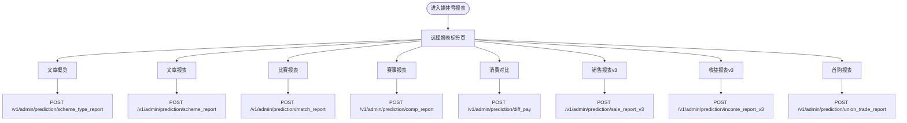
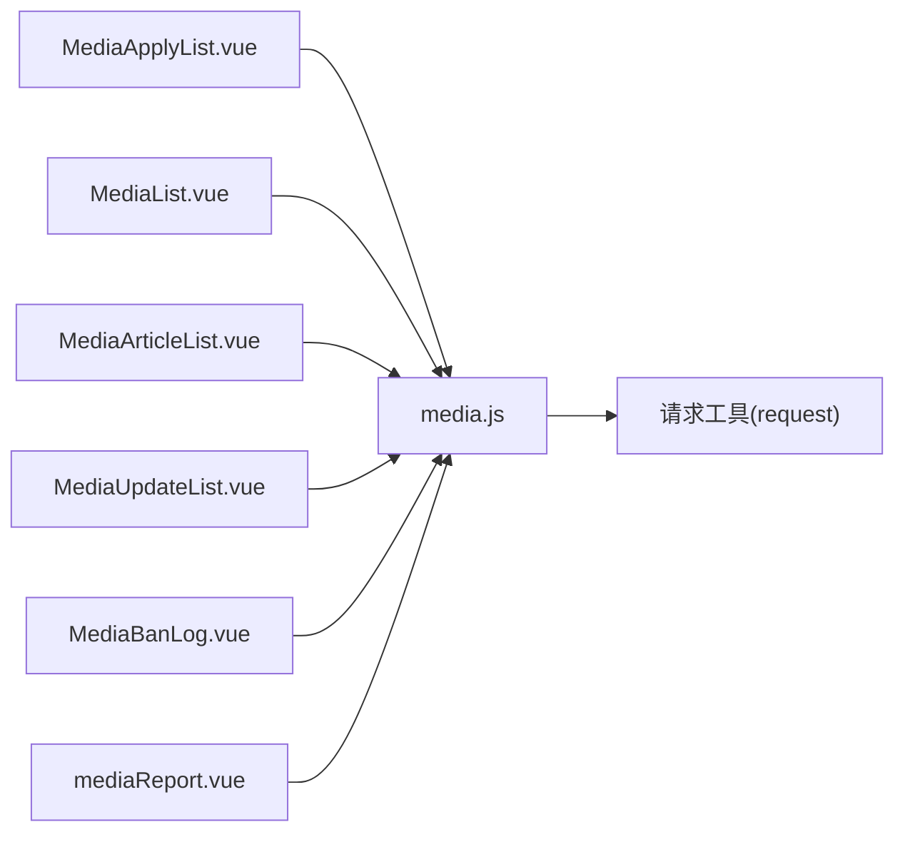

# 媒体号管理API

<cite>
**本文引用的文件**
- [media.js](file://src/api/media.js)
- [media.js](file://src/router/children/media.js)
- [MediaApplyList.vue](file://src/views/media/MediaApplyList.vue)
- [MediaList.vue](file://src/views/media/MediaList.vue)
- [MediaArticleList.vue](file://src/views/media/MediaArticleList.vue)
- [MediaUpdateList.vue](file://src/views/media/MediaUpdateList.vue)
- [MediaBanLog.vue](file://src/views/media/MediaBanLog.vue)
- [mediaReport.vue](file://src/views/media/mediaReport.vue)
</cite>

## 目录
1. [简介](#简介)
2. [项目结构](#项目结构)
3. [核心组件](#核心组件)
4. [架构总览](#架构总览)
5. [详细组件分析](#详细组件分析)
6. [依赖关系分析](#依赖关系分析)
7. [性能考量](#性能考量)
8. [故障排查指南](#故障排查指南)
9. [结论](#结论)
10. [附录](#附录)

## 简介
本文件面向媒体号管理模块，系统性梳理“雷速号”（媒体号）的申请、审核、内容管理、收益统计、违规处理等全流程的API规范与前端实现要点。文档覆盖以下关键能力：
- 媒体号申请与审核：申请列表、批量/单项通过/拒绝、敏感词过滤、图片展示优化
- 媒体号列表管理：封禁/解封、隐藏/取消隐藏、禁止收费/取消禁收、排序与筛选
- 内容管理：文章列表、同步阿里、隐藏/删除、退款、违规处理
- 变更审核：头像/名称等资料变更的审核流程
- 运营报表：文章概览、销售/消费/利润等多维报表
- 违规记录：封禁/隐藏/禁收/警告等操作记录查询

## 项目结构
媒体号管理相关前端模块主要分布在以下位置：
- API层：统一在 [media.js](file://src/api/media.js) 中封装所有媒体号相关接口
- 路由层：在 [media.js](file://src/router/children/media.js) 中注册媒体号管理子路由
- 视图层：各功能页面以Vue组件形式实现，如媒体号列表、申请审核、文章管理、变更审核、违规记录、报表等

图表来源
- [media.js:1-128](file://src/router/children/media.js#L1-L128)
- [media.js:1-857](file://src/api/media.js#L1-L857)

章节来源
- [media.js:1-128](file://src/router/children/media.js#L1-L128)
- [media.js:1-857](file://src/api/media.js#L1-L857)

## 核心组件
- API封装：集中于 [media.js](file://src/api/media.js)，包含媒体号列表、申请审核、文章管理、变更审核、违规记录、报表等接口方法
- 路由注册：在 [media.js](file://src/router/children/media.js) 中注册媒体号管理相关页面
- 视图组件：各页面组件负责UI交互、搜索筛选、批量操作、调用API并渲染结果

章节来源
- [media.js:1-857](file://src/api/media.js#L1-L857)
- [media.js:1-128](file://src/router/children/media.js#L1-L128)

## 架构总览
媒体号管理的前后端交互遵循“视图组件 -> API封装 -> 请求工具”的模式。视图组件通过API封装的方法发起HTTP请求，请求工具统一处理URL、方法、参数与响应。

图表来源
- [media.js:1-857](file://src/api/media.js#L1-L857)

## 详细组件分析

### 媒体号申请与审核
- 功能概述：展示媒体号申请列表，支持按状态筛选、按用户/时间/操作者等条件搜索；支持批量/单项通过或拒绝，并可选择是否删除原图；支持敏感词高亮显示与弹窗查看
- 关键接口
  - 申请列表：POST /v1/admin/prediction/apply_list
  - 申请通过：POST /v1/admin/prediction/pass_apply
  - 申请拒绝：POST /v1/admin/prediction/reject_apply
- 关键参数
  - 列表查询：page、limit、search_field、search_keyword、status
  - 批量通过/拒绝：application_ids（数组）、reject_reason（拒绝时必填）、delete_photo（是否删除原图）
- 前端实现要点
  - 支持图片大图/小图切换，特征照片与附件图片展示
  - 敏感词高亮：从全局状态获取敏感词列表，对名称/简介进行关键词高亮
  - 操作确认：通过/拒绝均需二次确认，拒绝时可勾选删除原图

图表来源
- [MediaApplyList.vue:312-463](file://src/views/media/MediaApplyList.vue#L312-L463)
- [media.js:13-36](file://src/api/media.js#L13-L36)

章节来源
- [MediaApplyList.vue:1-482](file://src/views/media/MediaApplyList.vue#L1-L482)
- [media.js:13-36](file://src/api/media.js#L13-L36)

### 媒体号列表管理
- 功能概述：展示媒体号列表，支持按名称/用户ID/粉丝数/创建时间等条件搜索；支持封禁/解封、隐藏/取消隐藏、禁止收费/取消禁收等快捷操作；支持排序与禁收名单查看
- 关键接口
  - 媒体号列表：POST /v1/admin/prediction/prediction_lists
  - 快速修改字段：POST /v1/admin/prediction/update_field
  - 禁收名单：GET /v1/admin/prediction/block_list
- 关键参数
  - 列表查询：page、limit、orderby_field、search_field、search_keyword、banned
  - 快速修改：prediction_id、modify_field（banned/hidden/block_fee）、modify_keyword（0/1）
- 前端实现要点
  - 快捷操作：根据当前状态自动切换“封禁/解封”、“隐藏/取消隐藏”、“禁止收费/取消禁收”，部分操作需填写原因
  - 禁收名单：支持打开禁收名单弹窗，提交后刷新列表

图表来源
- [MediaList.vue:205-307](file://src/views/media/MediaList.vue#L205-L307)
- [media.js:5-11](file://src/api/media.js#L5-L11)
- [media.js:79-85](file://src/api/media.js#L79-L85)

章节来源
- [MediaList.vue:1-432](file://src/views/media/MediaList.vue#L1-L432)
- [media.js:5-11](file://src/api/media.js#L5-L11)
- [media.js:79-85](file://src/api/media.js#L79-L85)

### 媒体号文章管理
- 功能概述：展示文章列表，支持按用户/文章ID/雷速号ID/比赛/玩法/时间范围等条件搜索；支持隐藏/删除/取消隐藏/取消删除、批量退款、同步阿里、导出Excel等
- 关键接口
  - 文章列表：POST /v1/admin/prediction/article_list
  - 隐藏/删除文章：POST /v1/admin/prediction/update_article_flag
  - 退款：POST /v1/admin/prediction/refund
  - 同步阿里：POST /v1/admin/prediction/prediction_sync_article_ali
  - 文章详情：GET /v1/admin/prediction/article_detail/{article_id}
- 关键参数
  - 列表查询：page、limit、created_at、search_field、search_keyword、sport_id、flag、price、is_ali_sync、orderby_field
  - 批量隐藏/删除：article_id_list（数组）、is_hidden/is_delete（0/1）
  - 退款：article_ids（数组）、del_article（是否同时删除文章）
  - 同步阿里：article_ids（数组）
- 前端实现要点
  - 状态位：flag采用位掩码表示（隐藏/删除/退款），支持多状态组合
  - 批量操作：支持批量隐藏/删除/退款，退款前二次确认
  - 同步结果：弹窗展示同步状态与结果

图表来源
- [MediaArticleList.vue:447-720](file://src/views/media/MediaArticleList.vue#L447-L720)
- [media.js:89-103](file://src/api/media.js#L89-L103)
- [media.js:133-147](file://src/api/media.js#L133-L147)
- [media.js:332-354](file://src/api/media.js#L332-L354)
- [media.js:97-103](file://src/api/media.js#L97-L103)

章节来源
- [MediaArticleList.vue:1-868](file://src/views/media/MediaArticleList.vue#L1-L868)
- [media.js:89-103](file://src/api/media.js#L89-L103)
- [media.js:133-147](file://src/api/media.js#L133-L147)
- [media.js:332-354](file://src/api/media.js#L332-L354)
- [media.js:97-103](file://src/api/media.js#L97-L103)

### 媒体号变更审核
- 功能概述：展示媒体号资料变更（头像/名称等）的审核列表，支持批量/单项通过或拒绝；通过时可设置达人分
- 关键接口
  - 变更列表：POST /v1/admin/prediction/profile_update_list
  - 变更通过：POST /v1/admin/prediction/profile_update_verify
  - 变更拒绝：POST /v1/admin/prediction/profile_update_reject
  - 达人分保存：POST /v1/admin/prediction/save_prediction_score
- 关键参数
  - 列表查询：page、limit、status、search_field、search_keyword
  - 批量通过/拒绝：profileupdate_ids（数组）、reject_reason（拒绝时必填）、delete_photo
  - 达人分：ids（数组）、score
- 前端实现要点
  - 新头像/新名称展示：未改动时显示占位文案
  - 批量操作：支持批量通过/拒绝，拒绝时可勾选删除原图
  - 达人分：通过时可设置达人分，提交后刷新列表

图表来源
- [MediaUpdateList.vue:295-451](file://src/views/media/MediaUpdateList.vue#L295-L451)
- [media.js:106-129](file://src/api/media.js#L106-L129)
- [media.js:793-799](file://src/api/media.js#L793-L799)

章节来源
- [MediaUpdateList.vue:1-470](file://src/views/media/MediaUpdateList.vue#L1-L470)
- [media.js:106-129](file://src/api/media.js#L106-L129)
- [media.js:793-799](file://src/api/media.js#L793-L799)

### 媒体号违规记录
- 功能概述：展示媒体号封禁/隐藏/禁收/警告等操作记录，支持按用户/操作者/时间/雷速号ID等条件搜索；支持按操作类型筛选
- 关键接口
  - 违规记录列表：POST /v1/admin/prediction/bans_log_list
- 关键参数
  - 列表查询：page、limit、search_field、search_keyword、operate_type、action_type
- 前端实现要点
  - 操作类型：支持“全部/封禁/隐藏/禁收/警告”筛选
  - 原因展示：使用美化组件展示ban_extra字段

图表来源
- [MediaBanLog.vue:160-176](file://src/views/media/MediaBanLog.vue#L160-L176)
- [media.js:219-226](file://src/api/media.js#L219-L226)

章节来源
- [MediaBanLog.vue:1-223](file://src/views/media/MediaBanLog.vue#L1-L223)
- [media.js:219-226](file://src/api/media.js#L219-L226)

### 媒体号报表
- 功能概述：提供多种报表视图，包括首购报表、文章概览、文章报表、比赛报表、赛事报表、消费对比、销售报表、消费报表等
- 关键接口
  - 文章概览报表：POST /v1/admin/prediction/scheme_type_report
  - 文章报表：POST /v1/admin/prediction/scheme_report
  - 比赛报表：POST /v1/admin/prediction/match_report
  - 赛事报表：POST /v1/admin/prediction/comp_report
  - 消费对比报表：POST /v1/admin/prediction/diff_pay
  - 销售报表v3：POST /v1/admin/prediction/sale_report_v3
  - 收益报表v3：POST /v1/admin/prediction/income_report_v3
  - 消费报表v3：POST /v1/admin/prediction/consume_report_v3
  - 首购报表：POST /v1/admin/prediction/union_trade_report
- 前端实现要点
  - 标签页切换：根据权限动态选择默认标签页
  - 组件懒加载：报表组件按需加载，减少首屏负担

图表来源
- [mediaReport.vue:4-88](file://src/views/media/mediaReport.vue#L4-L88)
- [media.js:289-330](file://src/api/media.js#L289-L330)
- [media.js:388-394](file://src/api/media.js#L388-L394)
- [media.js:412-418](file://src/api/media.js#L412-L418)
- [media.js:462-468](file://src/api/media.js#L462-L468)

章节来源
- [mediaReport.vue:1-89](file://src/views/media/mediaReport.vue#L1-L89)
- [media.js:289-330](file://src/api/media.js#L289-L330)
- [media.js:388-394](file://src/api/media.js#L388-L394)
- [media.js:412-418](file://src/api/media.js#L412-L418)
- [media.js:462-468](file://src/api/media.js#L462-L468)

## 依赖关系分析
- 组件耦合
  - 视图组件依赖API封装方法，API封装方法依赖请求工具
  - 各页面组件之间相对独立，仅共享通用组件（如搜索、分页、用户/媒体号卡片等）
- 外部依赖
  - Element UI用于表格、分页、对话框等基础组件
  - 自定义组件：搜索组件、分页组件、用户/媒体号卡片、状态标签等

图表来源
- [media.js:1-2](file://src/api/media.js#L1-L2)
- [MediaApplyList.vue:216-217](file://src/views/media/MediaApplyList.vue#L216-L217)
- [MediaList.vue:138-139](file://src/views/media/MediaList.vue#L138-L139)
- [MediaArticleList.vue:323-324](file://src/views/media/MediaArticleList.vue#L323-L324)
- [MediaUpdateList.vue:198-199](file://src/views/media/MediaUpdateList.vue#L198-L199)
- [MediaBanLog.vue:107-108](file://src/views/media/MediaBanLog.vue#L107-L108)
- [mediaReport.vue:50-58](file://src/views/media/mediaReport.vue#L50-L58)

章节来源
- [media.js:1-2](file://src/api/media.js#L1-L2)
- [MediaApplyList.vue:216-217](file://src/views/media/MediaApplyList.vue#L216-L217)
- [MediaList.vue:138-139](file://src/views/media/MediaList.vue#L138-L139)
- [MediaArticleList.vue:323-324](file://src/views/media/MediaArticleList.vue#L323-L324)
- [MediaUpdateList.vue:198-199](file://src/views/media/MediaUpdateList.vue#L198-L199)
- [MediaBanLog.vue:107-108](file://src/views/media/MediaBanLog.vue#L107-L108)
- [mediaReport.vue:50-58](file://src/views/media/mediaReport.vue#L50-L58)

## 性能考量
- 列表分页：统一使用page/limit参数，避免一次性加载过多数据
- 搜索优化：支持时间范围、数值范围、枚举筛选，减少无效请求
- 批量操作：批量通过/拒绝/隐藏/删除/退款可减少多次请求
- 图片展示：支持大图/小图切换，避免一次性加载大图导致卡顿
- 组件懒加载：报表组件按需加载，降低首屏压力

## 故障排查指南
- 常见问题
  - 列表为空：检查搜索条件是否过严，尝试重置筛选
  - 操作失败：确认权限是否具备对应按钮权限；检查必填字段（如拒绝原因、达人分等）
  - 同步失败：检查所选文章是否满足同步条件，查看同步结果弹窗
- 排查步骤
  - 查看网络面板，确认请求URL、方法、参数与返回状态码
  - 检查响应消息，定位具体错误原因
  - 对照接口文档，确认参数与字段是否正确

章节来源
- [MediaApplyList.vue:444-463](file://src/views/media/MediaApplyList.vue#L444-L463)
- [MediaList.vue:279-307](file://src/views/media/MediaList.vue#L279-L307)
- [MediaArticleList.vue:679-706](file://src/views/media/MediaArticleList.vue#L679-L706)

## 结论
媒体号管理模块通过统一的API封装与清晰的视图组件分工，实现了从申请审核、媒体号管理、内容管理到报表统计的完整闭环。前端在交互体验上注重批量操作、筛选与图片展示优化，在权限控制上通过路由与按钮级权限保障安全。后续可在以下方面持续优化：
- 参数校验与默认值：增强前端参数校验，减少无效请求
- 错误提示：统一错误提示样式与文案，提升可读性
- 性能监控：对关键接口增加耗时统计与错误上报

## 附录

### 接口一览（按功能分类）

- 申请与审核
  - 申请列表：POST /v1/admin/prediction/apply_list
  - 申请通过：POST /v1/admin/prediction/pass_apply
  - 申请拒绝：POST /v1/admin/prediction/reject_apply

- 媒体号列表与管理
  - 媒体号列表：POST /v1/admin/prediction/prediction_lists
  - 快速修改字段：POST /v1/admin/prediction/update_field
  - 禁收名单：GET /v1/admin/prediction/block_list

- 文章管理
  - 文章列表：POST /v1/admin/prediction/article_list
  - 隐藏/删除文章：POST /v1/admin/prediction/update_article_flag
  - 退款：POST /v1/admin/prediction/refund
  - 同步阿里：POST /v1/admin/prediction/prediction_sync_article_ali
  - 文章详情：GET /v1/admin/prediction/article_detail/{article_id}

- 变更审核
  - 变更列表：POST /v1/admin/prediction/profile_update_list
  - 变更通过：POST /v1/admin/prediction/profile_update_verify
  - 变更拒绝：POST /v1/admin/prediction/profile_update_reject
  - 达人分保存：POST /v1/admin/prediction/save_prediction_score

- 违规记录
  - 违规记录列表：POST /v1/admin/prediction/bans_log_list

- 报表
  - 文章概览报表：POST /v1/admin/prediction/scheme_type_report
  - 文章报表：POST /v1/admin/prediction/scheme_report
  - 比赛报表：POST /v1/admin/prediction/match_report
  - 赛事报表：POST /v1/admin/prediction/comp_report
  - 消费对比报表：POST /v1/admin/prediction/diff_pay
  - 销售报表v3：POST /v1/admin/prediction/sale_report_v3
  - 收益报表v3：POST /v1/admin/prediction/income_report_v3
  - 消费报表v3：POST /v1/admin/prediction/consume_report_v3
  - 首购报表：POST /v1/admin/prediction/union_trade_report

章节来源
- [media.js:13-36](file://src/api/media.js#L13-L36)
- [media.js:5-11](file://src/api/media.js#L5-L11)
- [media.js:79-85](file://src/api/media.js#L79-L85)
- [media.js:89-103](file://src/api/media.js#L89-L103)
- [media.js:133-147](file://src/api/media.js#L133-L147)
- [media.js:332-354](file://src/api/media.js#L332-L354)
- [media.js:97-103](file://src/api/media.js#L97-L103)
- [media.js:106-129](file://src/api/media.js#L106-L129)
- [media.js:793-799](file://src/api/media.js#L793-L799)
- [media.js:219-226](file://src/api/media.js#L219-L226)
- [media.js:289-330](file://src/api/media.js#L289-L330)
- [media.js:388-394](file://src/api/media.js#L388-L394)
- [media.js:412-418](file://src/api/media.js#L412-L418)
- [media.js:462-468](file://src/api/media.js#L462-L468)
- [media.js:515-521](file://src/api/media.js#L515-L521)