# 预测师管理API

<cite>
**本文引用的文件**
- [predictor.js](file://src/api/predictor.js)
- [request.js](file://src/utils/request.js)
- [predictor.js](file://src/router/children/predictor.js)
- [applyList.vue](file://src/views/predictor/applyList.vue)
- [predictorList.vue](file://src/views/predictor/predictorList.vue)
- [lsPredictor.vue](file://src/views/predictor/components/lsPredictor.vue)
- [predictorReport.vue](file://src/views/predictor/predictorReport.vue)
- [prediction.js](file://src/utils/dict/prediction.js)
- [singleList.vue](file://src/views/predictor/singleList.vue)
- [multibetList.vue](file://src/views/predictor/multibetList.vue)
- [predictionScoreWeekDialog.vue](file://src/views/predictor/components/predictionScoreWeekDialog.vue)
- [accountInfo.vue](file://src/components/leisu/peopleInfo/predictor/components/accountInfo.vue)
</cite>

## 更新摘要
**变更内容**
- 新增预测师周结算得分功能章节
- 更新API函数清单，添加predictor_score_week函数
- 增加周结算得分数据模型说明
- 补充周结算得分业务流程和界面交互

## 目录
1. [简介](#简介)
2. [项目结构](#项目结构)
3. [核心组件](#核心组件)
4. [架构总览](#架构总览)
5. [详细组件分析](#详细组件分析)
6. [依赖关系分析](#依赖关系分析)
7. [性能考量](#性能考量)
8. [故障排查指南](#故障排查指南)
9. [结论](#结论)
10. [附录](#附录)

## 简介
本文件为"预测师管理模块"的完整API文档，覆盖预测师申请、审核、内容管理、榜单与报表、敏感词管理、AI分析与销售、退款与异常处理等核心能力。文档从接口规范、调用示例、业务规则、数据模型与运营流程等维度进行系统化说明，帮助开发者与运营人员快速理解与落地。

**更新** 新增预测师周结算得分功能，支持查看专家预测员的周结算得分数据，包括AI方案得分、战绩得分、胜率得分、返还率得分、发布数得分等详细指标。

## 项目结构
预测师管理模块位于前端工程的API层与视图层，主要由以下部分组成：
- API层：封装预测师相关HTTP请求，统一通过请求拦截器发送token与处理响应。
- 视图层：提供预测师列表、申请列表、内容管理、榜单与报表、敏感词管理等页面组件。
- 字典与规则：提供预测师分组、操作原因、玩法映射、榜单类型等通用配置。

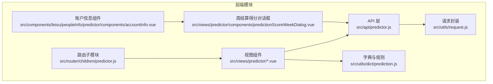

**图表来源**
- [predictor.js:1-1031](file://src/api/predictor.js#L1-L1031)
- [request.js:1-130](file://src/utils/request.js#L1-L130)
- [predictor.js:1-178](file://src/router/children/predictor.js#L1-L178)
- [predictionScoreWeekDialog.vue:1-98](file://src/views/predictor/components/predictionScoreWeekDialog.vue#L1-L98)
- [accountInfo.vue:288-341](file://src/components/leisu/peopleInfo/predictor/components/accountInfo.vue#L288-L341)

**章节来源**
- [predictor.js:1-1031](file://src/api/predictor.js#L1-L1031)
- [request.js:1-130](file://src/utils/request.js#L1-L130)
- [predictor.js:1-178](file://src/router/children/predictor.js#L1-L178)

## 核心组件
- API层：集中导出预测师管理相关接口，包含列表查询、详情、状态变更、内容管理、榜单与报表、敏感词、AI分析与销售、退款与异常处理等。
- 请求封装：基于axios，自动注入token，统一封装错误提示与状态码处理。
- 视图层：提供预测师列表、申请列表、内容管理（单关/串关/足彩）、榜单与报表、敏感词管理等页面。
- 字典与规则：提供预测师分组、操作原因、玩法映射、榜单类型、文章购买来源等配置。
- 周结算得分组件：提供预测师周结算得分的可视化展示，支持详细的数据分析与查看。

**章节来源**
- [predictor.js:1-1031](file://src/api/predictor.js#L1-L1031)
- [request.js:1-130](file://src/utils/request.js#L1-L130)
- [prediction.js:1-526](file://src/utils/dict/prediction.js#L1-L526)
- [predictionScoreWeekDialog.vue:1-98](file://src/views/predictor/components/predictionScoreWeekDialog.vue#L1-L98)

## 架构总览
预测师管理的前后端交互遵循统一的请求封装与路由组织方式：
- 统一通过API层发起HTTP请求，URL前缀为/v1/admin/predictor。
- 请求拦截器自动携带token，响应拦截器统一处理错误与提示。
- 路由子模块定义预测师相关页面权限与入口，页面组件通过API层调用后端接口。

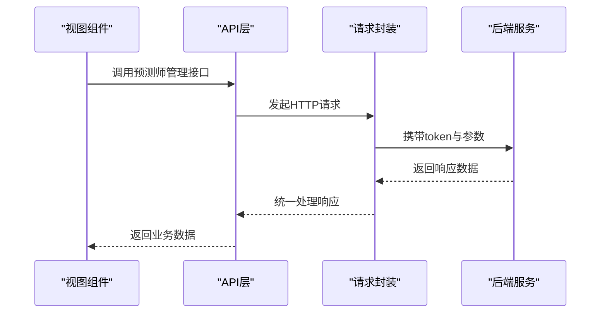

**图表来源**
- [predictor.js:1-1031](file://src/api/predictor.js#L1-L1031)
- [request.js:1-130](file://src/utils/request.js#L1-L130)

## 详细组件分析

### 1. 预测师申请与审核
- 申请列表：支持分页、排序、筛选，展示用户信息、专家号名称、头像、简介、特征照片、附件图片、申请原因、文章、操作者、拒绝原因等。
- 审核操作：支持单条与批量通过/拒绝，通过时可设置头像/昵称/简介评分，拒绝时可设置拒绝原因与限制时长。

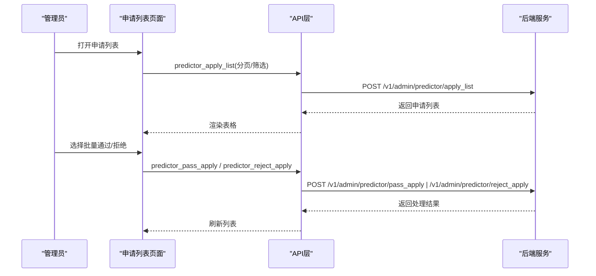

**图表来源**
- [applyList.vue:272-332](file://src/views/predictor/applyList.vue#L272-L332)
- [predictor.js:78-100](file://src/api/predictor.js#L78-L100)

**章节来源**
- [applyList.vue:1-336](file://src/views/predictor/applyList.vue#L1-L336)
- [predictor.js:78-100](file://src/api/predictor.js#L78-L100)

### 2. 预测师列表与状态管理
- 列表查询：支持分页、排序、筛选，展示专家号ID、注册时间、专家号信息、用户信息、简介、粉丝、违规分、达人分、发布数、头衔、运营备注、最后发布时间、更新时间、附加信息等。
- 状态变更：支持封禁/解封、限流/解限、禁收/可收、禁发/可发、违规、批量设置等操作，并可设置违规分数与限制时长。

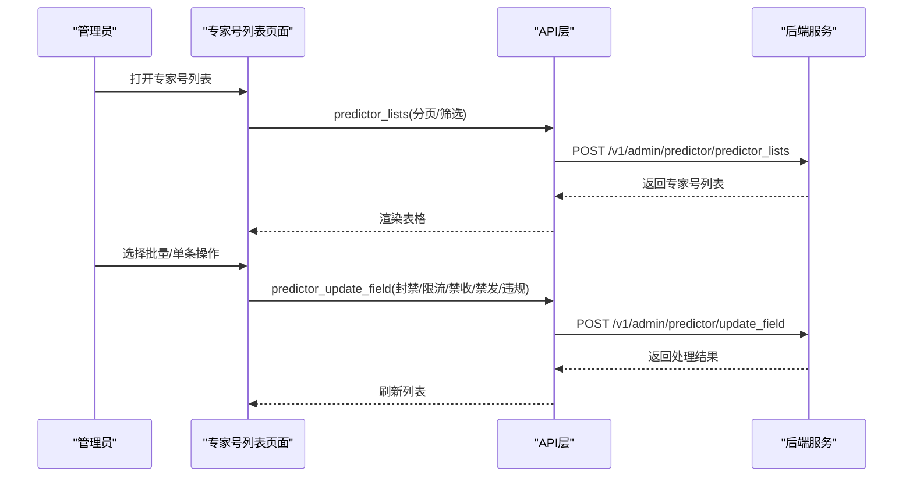

**图表来源**
- [predictorList.vue:366-464](file://src/views/predictor/predictorList.vue#L366-L464)
- [predictor.js:69-76](file://src/api/predictor.js#L69-L76)

**章节来源**
- [predictorList.vue:1-468](file://src/views/predictor/predictorList.vue#L1-L468)
- [predictor.js:69-76](file://src/api/predictor.js#L69-L76)

### 3. 内容管理（单关/串关/足彩）
- 单关文章：支持批量删除/隐藏、批量取消删除/取消隐藏、批量违规、批量退款、批量抽样审核等操作。
- 串关文章：支持批量删除/隐藏、批量取消删除/取消隐藏、批量违规、批量退款、批量抽样审核等操作。
- 足彩文章：支持批量删除/隐藏、批量取消删除/取消隐藏、批量违规、批量退款等操作。
- 文章详情：提供单关/串关/足彩文章详情接口，支持查看详情与状态。

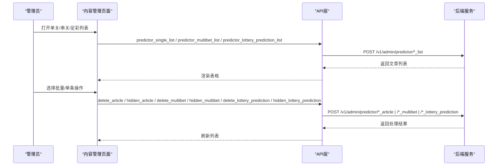

**图表来源**
- [singleList.vue:46-200](file://src/views/predictor/singleList.vue#L46-L200)
- [multibetList.vue:45-200](file://src/views/predictor/multibetList.vue#L45-L200)
- [predictor.js:198-295](file://src/api/predictor.js#L198-L295)

**章节来源**
- [singleList.vue:1-612](file://src/views/predictor/singleList.vue#L1-L612)
- [multibetList.vue:1-608](file://src/views/predictor/multibetList.vue#L1-L608)
- [predictor.js:198-295](file://src/api/predictor.js#L198-L295)

### 4. 榜单与报表
- 榜单类型：连中榜、命中榜、赛事榜、返还榜。
- 报表类型：销售、发布、AI评分、赛事、对比、首购、用户、阅读、成交等。
- 接口：提供榜单查询、报表数据查询等。

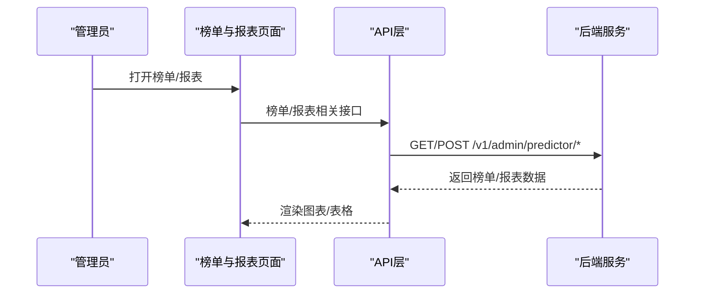

**图表来源**
- [predictorReport.vue:1-124](file://src/views/predictor/predictorReport.vue#L1-L124)
- [predictor.js:424-718](file://src/api/predictor.js#L424-L718)

**章节来源**
- [predictorReport.vue:1-124](file://src/views/predictor/predictorReport.vue#L1-L124)
- [predictor.js:424-718](file://src/api/predictor.js#L424-L718)

### 5. 敏感词管理
- 敏感词列表：支持按类型查询敏感词列表。
- 敏感词操作：支持添加/删除敏感词。

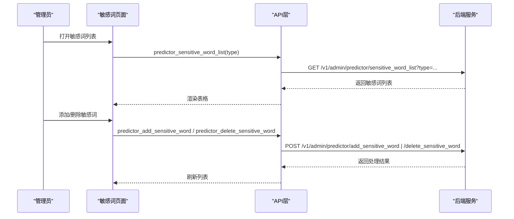

**图表来源**
- [predictor.js:720-742](file://src/api/predictor.js#L720-L742)

**章节来源**
- [predictor.js:720-742](file://src/api/predictor.js#L720-L742)

### 6. AI分析与销售
- AI分析列表：支持查询AI分析文章列表。
- AI分析详情：支持查询AI分析文章详情。
- AI赛程与指数：支持查询AI赛程与指数。
- 删除与创建：支持删除与创建AI分析。
- 销售与购买：支持查询AI分析购买记录与方案分布购买。

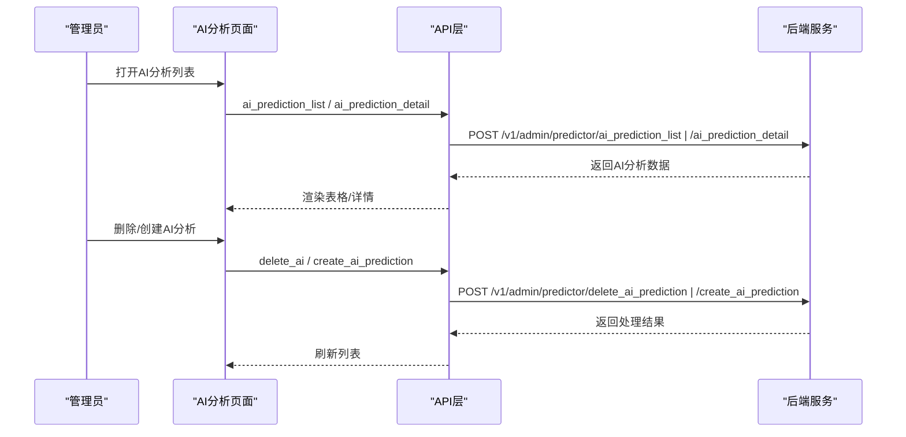

**图表来源**
- [predictor.js:101-148](file://src/api/predictor.js#L101-L148)
- [predictor.js:600-615](file://src/api/predictor.js#L600-L615)

**章节来源**
- [predictor.js:101-148](file://src/api/predictor.js#L101-L148)
- [predictor.js:600-615](file://src/api/predictor.js#L600-L615)

### 7. 退款与异常处理
- 退款：支持对单关/串关文章进行退款操作。
- 异常比赛：支持查询与删除异常比赛。

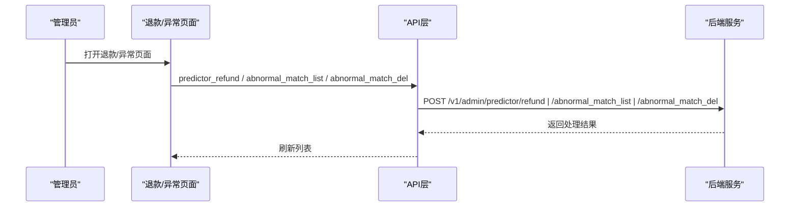

**图表来源**
- [predictor.js:617-632](file://src/api/predictor.js#L617-L632)
- [predictor.js:367-382](file://src/api/predictor.js#L367-L382)

**章节来源**
- [predictor.js:617-632](file://src/api/predictor.js#L617-L632)
- [predictor.js:367-382](file://src/api/predictor.js#L367-L382)

### 8. 预测师周结算得分功能
- 功能概述：提供预测师的周结算得分数据查询与展示，包括AI方案得分、战绩得分、胜率得分、返还率得分、发布数得分等详细指标。
- 数据模型：每个周期包含周期标签、本周达人分、各项得分及对应的详细说明信息。
- 界面交互：通过拖拽对话框展示，支持鼠标悬停查看详细说明。

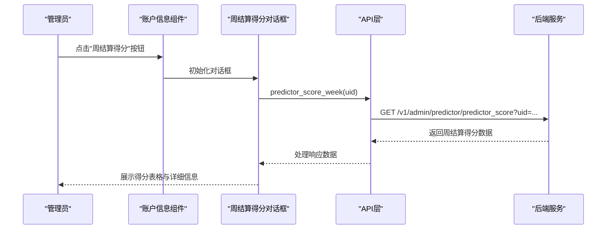

**图表来源**
- [accountInfo.vue:360-365](file://src/components/leisu/peopleInfo/predictor/components/accountInfo.vue#L360-L365)
- [predictionScoreWeekDialog.vue:80-95](file://src/views/predictor/components/predictionScoreWeekDialog.vue#L80-L95)
- [predictor.js:1025-1031](file://src/api/predictor.js#L1025-L1031)

**章节来源**
- [predictionScoreWeekDialog.vue:1-98](file://src/views/predictor/components/predictionScoreWeekDialog.vue#L1-L98)
- [accountInfo.vue:360-365](file://src/components/leisu/peopleInfo/predictor/components/accountInfo.vue#L360-L365)
- [predictor.js:1025-1031](file://src/api/predictor.js#L1025-L1031)

## 依赖关系分析
- API层依赖请求封装，统一处理token与错误提示。
- 视图层依赖API层与字典配置，渲染表格、图表与操作按钮。
- 路由子模块定义页面入口与权限，页面组件通过API层调用后端接口。
- 周结算得分功能依赖专门的对话框组件，通过账户信息组件触发显示。

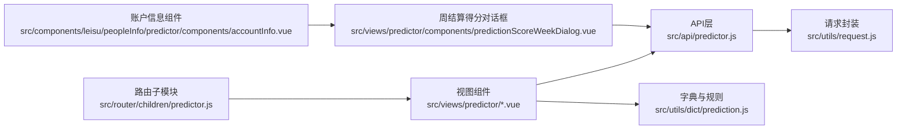

**图表来源**
- [predictor.js:1-1031](file://src/api/predictor.js#L1-L1031)
- [request.js:1-130](file://src/utils/request.js#L1-L130)
- [prediction.js:1-526](file://src/utils/dict/prediction.js#L1-L526)
- [predictor.js:1-178](file://src/router/children/predictor.js#L1-L178)
- [predictionScoreWeekDialog.vue:1-98](file://src/views/predictor/components/predictionScoreWeekDialog.vue#L1-L98)
- [accountInfo.vue:288-341](file://src/components/leisu/peopleInfo/predictor/components/accountInfo.vue#L288-L341)

**章节来源**
- [predictor.js:1-1031](file://src/api/predictor.js#L1-L1031)
- [request.js:1-130](file://src/utils/request.js#L1-L130)
- [prediction.js:1-526](file://src/utils/dict/prediction.js#L1-L526)
- [predictor.js:1-178](file://src/router/children/predictor.js#L1-L178)

## 性能考量
- 列表查询建议合理设置分页与筛选条件，避免一次性加载过多数据。
- 批量操作时注意接口幂等性与错误回滚，确保操作一致性。
- 图表与报表数据建议按需加载，避免频繁请求导致性能下降。
- 对于敏感词与AI分析等高频操作，建议增加缓存策略与防抖处理。
- 周结算得分对话框采用懒加载方式，仅在需要时才发起请求。

## 故障排查指南
- 请求失败：检查token是否有效、网络连接是否正常、后端服务是否可用。
- 权限不足：确认角色权限是否包含对应菜单与操作权限。
- 数据异常：检查筛选条件与排序字段是否正确，必要时清空筛选重试。
- 操作失败：查看返回的错误码与提示信息，根据提示修复参数或联系后端。
- 周结算得分显示异常：检查UID参数是否正确，确认预测师是否存在有效的周结算数据。

**章节来源**
- [request.js:46-127](file://src/utils/request.js#L46-L127)

## 结论
预测师管理模块通过统一的API层与视图层，实现了从申请审核到内容管理、榜单报表、敏感词与AI分析的全链路能力。结合字典与规则配置，能够灵活支撑预测师的运营需求。新增的周结算得分功能进一步完善了预测师管理的监控体系，为运营决策提供了更详细的数据支持。建议在实际使用中关注接口参数校验、批量操作的幂等性与错误回滚，并结合权限控制保障系统的安全性与稳定性。

## 附录

### A. 接口清单与调用示例路径
- 专家号列表：POST /v1/admin/predictor/predictor_lists
  - 示例路径：[predictorList.vue:366-393](file://src/views/predictor/predictorList.vue#L366-L393)
- 禁发禁收列表：POST /v1/admin/predictor/block_publish_list
  - 示例路径：[predictorList.vue:336-364](file://src/views/predictor/predictorList.vue#L336-L364)
- 专家号详情：POST /v1/admin/predictor/predictor_detail
  - 示例路径：[predictorList.vue:366-393](file://src/views/predictor/predictorList.vue#L366-L393)
- 专家号状态修改：POST /v1/admin/predictor/update_field
  - 示例路径：[predictorList.vue:439-464](file://src/views/predictor/predictorList.vue#L439-L464)
- 专家号申请列表：POST /v1/admin/predictor/apply_list
  - 示例路径：[applyList.vue:272-298](file://src/views/predictor/applyList.vue#L272-L298)
- 专家号申请通过：POST /v1/admin/predictor/pass_apply
  - 示例路径：[applyList.vue:314-332](file://src/views/predictor/applyList.vue#L314-L332)
- 专家号申请拒绝：POST /v1/admin/predictor/reject_apply
  - 示例路径：[applyList.vue:314-332](file://src/views/predictor/applyList.vue#L314-L332)
- 单关文章列表：POST /v1/admin/predictor/predictor_single_list
  - 示例路径：[singleList.vue:46-200](file://src/views/predictor/singleList.vue#L46-L200)
- 串关文章列表：POST /v1/admin/predictor/predictor_multibet_list
  - 示例路径：[multibetList.vue:45-200](file://src/views/predictor/multibetList.vue#L45-L200)
- 足彩文章列表：POST /v1/admin/predictor/predictor_lottery_prediction_list
  - 示例路径：[predictor.js:213-220](file://src/api/predictor.js#L213-L220)
- 删除文章：POST /v1/admin/predictor/delete_article
  - 示例路径：[singleList.vue:61-75](file://src/views/predictor/singleList.vue#L61-L75)
- 隐藏文章：POST /v1/admin/predictor/hidden_article
  - 示例路径：[singleList.vue:61-75](file://src/views/predictor/singleList.vue#L61-L75)
- 删除串关文章：POST /v1/admin/predictor/delete_multibet
  - 示例路径：[multibetList.vue:61-75](file://src/views/predictor/multibetList.vue#L61-L75)
- 隐藏串关文章：POST /v1/admin/predictor/hidden_multibet
  - 示例路径：[multibetList.vue:61-75](file://src/views/predictor/multibetList.vue#L61-L75)
- 删除足彩文章：POST /v1/admin/predictor/delete_lottery_prediction
  - 示例路径：[predictor.js:280-287](file://src/api/predictor.js#L280-L287)
- 隐藏足彩文章：POST /v1/admin/predictor/hidden_lottery_prediction
  - 示例路径：[predictor.js:288-295](file://src/api/predictor.js#L288-L295)
- 单关文章详情：GET /v1/admin/predictor/predictor_single_detail/{id}
  - 示例路径：[predictor.js:297-303](file://src/api/predictor.js#L297-L303)
- 串关文章详情：GET /v1/admin/predictor/predictor_multibet_detail/{id}
  - 示例路径：[predictor.js:304-310](file://src/api/predictor.js#L304-L310)
- 足彩文章详情：GET /v1/admin/predictor/predictor_lottery_prediction_detail/{id}
  - 示例路径：[predictor.js:311-317](file://src/api/predictor.js#L311-L317)
- 榜单与报表：GET/POST /v1/admin/predictor/*
  - 示例路径：[predictorReport.vue:1-124](file://src/views/predictor/predictorReport.vue#L1-L124)
- 敏感词列表：GET /v1/admin/predictor/sensitive_word_list?type=...
  - 示例路径：[predictor.js:720-726](file://src/api/predictor.js#L720-L726)
- 添加敏感词：POST /v1/admin/predictor/add_sensitive_word
  - 示例路径：[predictor.js:727-734](file://src/api/predictor.js#L727-L734)
- 删除敏感词：POST /v1/admin/predictor/delete_sensitive_word
  - 示例路径：[predictor.js:735-742](file://src/api/predictor.js#L735-L742)
- AI分析列表：POST /v1/admin/predictor/ai_prediction_list
  - 示例路径：[predictor.js:101-108](file://src/api/predictor.js#L101-L108)
- AI分析详情：POST /v1/admin/predictor/ai_prediction_detail
  - 示例路径：[predictor.js:109-116](file://src/api/predictor.js#L109-L116)
- 删除AI：POST /v1/admin/predictor/delete_ai_prediction
  - 示例路径：[predictor.js:133-140](file://src/api/predictor.js#L133-L140)
- 创建AI：POST /v1/admin/predictor/create_ai_prediction
  - 示例路径：[predictor.js:141-148](file://src/api/predictor.js#L141-L148)
- 退款：POST /v1/admin/predictor/refund
  - 示例路径：[predictor.js:617-624](file://src/api/predictor.js#L617-L624)
- 异常比赛：POST /v1/admin/predictor/abnormal_match_list
  - 示例路径：[predictor.js:367-373](file://src/api/predictor.js#L367-L373)
- 异常比赛删除：POST /v1/admin/predictor/abnormal_match_del
  - 示例路径：[predictor.js:375-382](file://src/api/predictor.js#L375-L382)
- **周结算得分：GET /v1/admin/predictor/predictor_score?uid={uid}**
  - 示例路径：[predictor.js:1025-1031](file://src/api/predictor.js#L1025-L1031)

### B. 业务规则与数据模型要点
- 预测师分组：普通、雷速专家、资深专家、专家解说。
- 操作原因：资料审核与文章审核两类，包含头像/昵称/简介不合规、发布联系方式、涉政/宗教/毒品、广告/网络地址、恶意攻击、发布其他赛事、大量无意义内容、虚假/夸大宣传、抄袭、与推荐比赛无关、结论不符、含粗俗不雅词汇、涉及金额数量、引导用户大量跟单等。
- 玩法映射：支持竞足、竞篮、北单等多种玩法与选项。
- 榜单类型：连中榜、命中榜、赛事榜、返还榜。
- 文章购买来源：正常购买、组合购、直播购买、直播组合购。
- **周结算得分数据模型**：
  - 周期标签（period_label）：如"2024-W01"格式
  - 本周达人分（weekly_score）：当周获得的达人分总数
  - AI方案得分（ai_score）：AI分析方案带来的得分
  - 战绩得分（streak_score）：预测战绩表现带来的得分
  - 胜率得分（win_rate_score）：胜率表现带来的得分
  - 返还率得分（return_rate_score）：返还率表现带来的得分
  - 发布数得分（publish_score）：文章发布数量带来的得分
  - 各项得分的详细说明信息（ai_info、streak_info、win_rate_info、return_rate_info、publish_info）

**章节来源**
- [prediction.js:1-526](file://src/utils/dict/prediction.js#L1-L526)
- [predictionScoreWeekDialog.vue:15-64](file://src/views/predictor/components/predictionScoreWeekDialog.vue#L15-L64)
- [predictor.js:1025-1031](file://src/api/predictor.js#L1025-L1031)