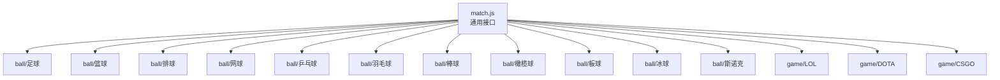
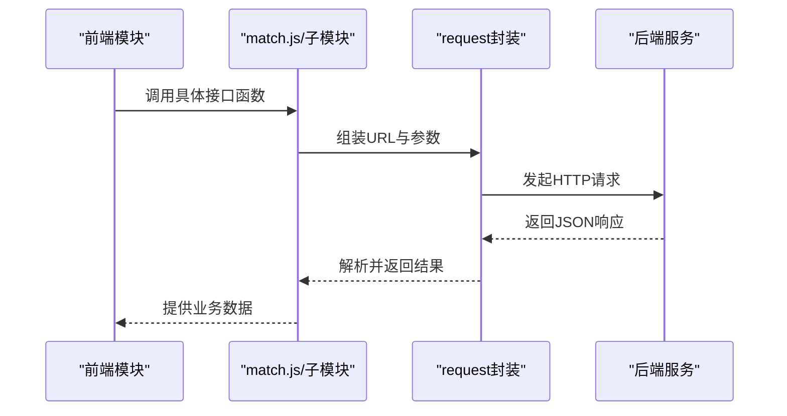
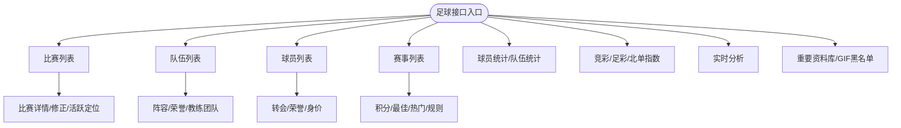
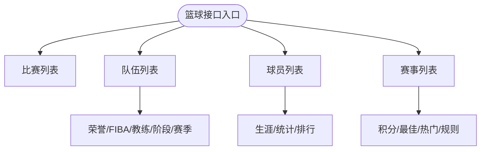
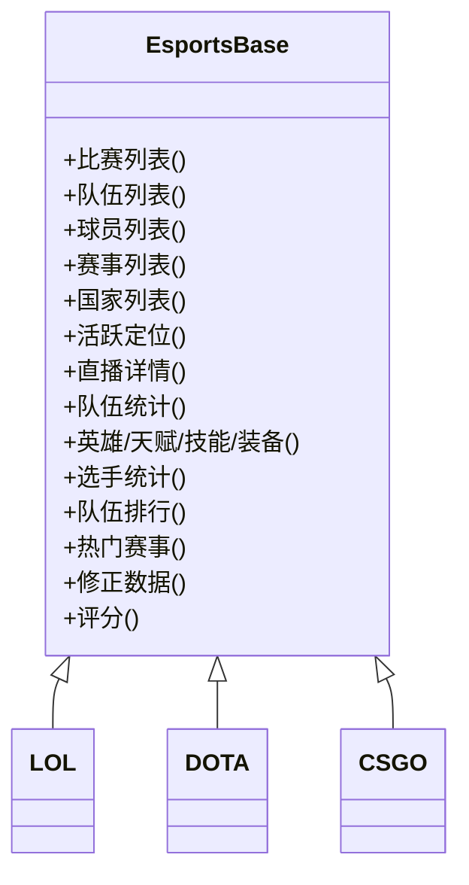
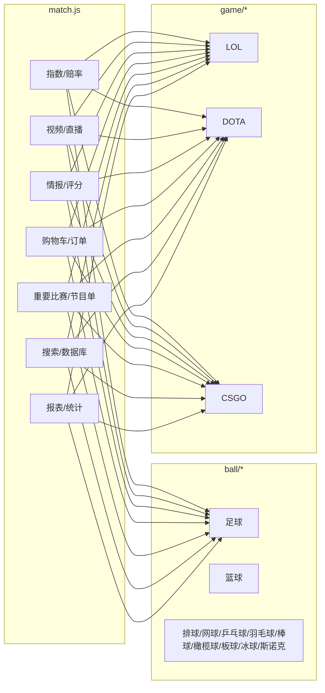

# 体育数据API

<cite>
**本文档引用的文件**
- [src/api/match.js](file://src/api/match.js)
- [src/api/matchapi/ball/football.js](file://src/api/matchapi/ball/football.js)
- [src/api/matchapi/ball/basketball.js](file://src/api/matchapi/ball/basketball.js)
- [src/api/matchapi/ball/volleyball.js](file://src/api/matchapi/ball/volleyball.js)
- [src/api/matchapi/ball/tennis.js](file://src/api/matchapi/ball/tennis.js)
- [src/api/matchapi/ball/pingpong.js](file://src/api/matchapi/ball/pingpong.js)
- [src/api/matchapi/ball/badminton.js](file://src/api/matchapi/ball/badminton.js)
- [src/api/matchapi/ball/baseball.js](file://src/api/matchapi/ball/baseball.js)
- [src/api/matchapi/ball/rugby.js](file://src/api/matchapi/ball/rugby.js)
- [src/api/matchapi/ball/cricket.js](file://src/api/matchapi/ball/cricket.js)
- [src/api/matchapi/ball/puck.js](file://src/api/matchapi/ball/puck.js)
- [src/api/matchapi/ball/snooker.js](file://src/api/matchapi/ball/snooker.js)
- [src/api/matchapi/game/lol.js](file://src/api/matchapi/game/lol.js)
- [src/api/matchapi/game/dota.js](file://src/api/matchapi/game/dota.js)
- [src/api/matchapi/game/csgo.js](file://src/api/matchapi/game/csgo.js)
</cite>

## 目录
1. [简介](#简介)
2. [项目结构](#项目结构)
3. [核心组件](#核心组件)
4. [架构总览](#架构总览)
5. [详细组件分析](#详细组件分析)
6. [依赖关系分析](#依赖关系分析)
7. [性能与实时性考虑](#性能与实时性考虑)
8. [故障排查指南](#故障排查指南)
9. [结论](#结论)
10. [附录：接口清单与调用示例](#附录接口清单与调用示例)

## 简介
本文件面向体育数据模块的API设计与使用，覆盖足球、篮球、电竞（LOL、DOTA、CSGO）等多类体育项目的数据接口规范。内容包括：
- 接口职责与调用方式（HTTP 方法、请求体/查询参数、返回结构）
- 实时数据更新、数据同步与缓存策略建议
- 体育数据模型（比赛、球队、球员、统计数据等）字段说明
- 业务规则（比赛状态、数据来源、更新频率、数据质量）

## 项目结构
体育数据API采用按“体育类型”和“项目类型”分层组织：
- 通用匹配与公共能力：位于 match.js，包含指数、视频、情报、购物车、直播、评分、报表等跨项目通用接口
- 球类项目：matchapi/ball 下的各子模块（足球、篮球、排球、网球、乒乓球、羽毛球、棒球、橄榄球、板球、冰球、斯诺克）
- 电竞项目：matchapi/game 下的各子模块（LOL、DOTA、CSGO）

图表来源
- [src/api/match.js:1-1142](file://src/api/match.js#L1-L1142)
- [src/api/matchapi/ball/football.js:1-775](file://src/api/matchapi/ball/football.js#L1-L775)
- [src/api/matchapi/ball/basketball.js:1-553](file://src/api/matchapi/ball/basketball.js#L1-L553)
- [src/api/matchapi/game/lol.js:1-289](file://src/api/matchapi/game/lol.js#L1-L289)
- [src/api/matchapi/game/dota.js:1-290](file://src/api/matchapi/game/dota.js#L1-L290)
- [src/api/matchapi/game/csgo.js:1-254](file://src/api/matchapi/game/csgo.js#L1-L254)

章节来源
- [src/api/match.js:1-1142](file://src/api/match.js#L1-L1142)

## 核心组件
- 通用匹配与公共能力
  - 指数与赔率：获取/解析/同步指数、半场指数、纳米指数、电竞指数
  - 视频与直播：获取视频源、直播流、解析视频key、在线人数、直播报表
  - 比赛情报与评分：动态情报、推荐状态、评分评论、评分报表
  - 购物车与订单：小黄车商品管理、销售记录与报表
  - 重要比赛与节目单：重要比赛列表、节目单管理
  - 搜索与数据库：资料库搜索、重要资料库管理
  - 拉流配置与域名管理：拉流配置、域名与在线流管理
  - 公共报表：视频购买报表、模型销售报表、实时分析报表等
- 球类项目
  - 足球：比赛/队伍/球员/荣誉/转会/阶段/赛季/积分/教练/场馆/裁判/异常处理/竞彩/足彩/北单/实时分析/热门赛事/评分/身价/队伍权重等
  - 篮球：比赛/队伍/球员/赛事/荣誉/国家/教练/场馆/阶段/赛季/最佳/异常/统计/排名/热门/评分/转会/权重等
  - 其他球类：排球、网球、乒乓球、羽毛球、棒球、橄榄球、板球、冰球、斯诺克，均提供基础列表、活跃/修正、队伍/球员/荣誉/阶段/赛季/积分/国家/场馆/教练/统计/热门/评分/权重等能力
- 电竞项目
  - LOL：比赛/队伍/球员/赛事/英雄/天赋/技能/装备/国家/活跃/直播/队伍/英雄/赛事/选手统计/队伍排行/热门/修正/评分
  - DOTA：比赛/队伍/球员/赛事/英雄/天赋/技能/装备/国家/活跃/直播/队伍/英雄/赛事/选手统计/队伍排行/热门/修正/评分
  - CSGO：比赛/队伍/球员/赛事/国家/地图/武器/阶段/活跃/直播/队伍/英雄/赛事/选手统计/队伍排行/热门/修正/评分

章节来源
- [src/api/match.js:1-1142](file://src/api/match.js#L1-L1142)
- [src/api/matchapi/ball/football.js:1-775](file://src/api/matchapi/ball/football.js#L1-L775)
- [src/api/matchapi/ball/basketball.js:1-553](file://src/api/matchapi/ball/basketball.js#L1-L553)
- [src/api/matchapi/game/lol.js:1-289](file://src/api/matchapi/game/lol.js#L1-L289)
- [src/api/matchapi/game/dota.js:1-290](file://src/api/matchapi/game/dota.js#L1-L290)
- [src/api/matchapi/game/csgo.js:1-254](file://src/api/matchapi/game/csgo.js#L1-L254)

## 架构总览
前端通过统一的请求封装发起HTTP请求，调用后端REST接口；不同体育类型在各自模块中暴露函数，match.js作为聚合入口导出所有子模块接口。

图表来源
- [src/api/match.js:1-1142](file://src/api/match.js#L1-L1142)

## 详细组件分析

### 足球数据API
- 比赛
  - 列表、活跃定位、详情、修正、阶段/赛季/积分/最佳/热门/评分/异常
- 队伍
  - 列表、更新/重置/刷新、阵容、荣誉、教练团队、国家/场馆/教练/裁判/荣誉/权重
- 球员
  - 列表、转会、荣誉、身价、生涯/历史/履历
- 赛事
  - 列表、更新/重置/刷新、阶段/赛季/积分/最佳/热门/规则/异常
- 指数与竞彩
  - 竞彩/足彩/北单期号与指数列表
- 实时分析
  - 实时分析购买记录与报表
- 数据库与黑/白名单
  - 重要资料库、GIF黑名单

图表来源
- [src/api/matchapi/ball/football.js:1-775](file://src/api/matchapi/ball/football.js#L1-L775)

章节来源
- [src/api/matchapi/ball/football.js:1-775](file://src/api/matchapi/ball/football.js#L1-L775)

### 篮球数据API
- 比赛
  - 列表、活跃定位、详情、修正、阶段/赛季/积分/最佳/热门/评分
- 队伍
  - 列表、更新/重置/刷新、荣誉/FIBA/国家/场馆/教练/阶段/赛季/统计/排行/权重
- 球员
  - 列表、转会、荣誉、生涯/统计/排行
- 赛事
  - 列表、更新/重置/刷新、阶段/赛季/积分/最佳/热门/规则/异常

图表来源
- [src/api/matchapi/ball/basketball.js:1-553](file://src/api/matchapi/ball/basketball.js#L1-L553)

章节来源
- [src/api/matchapi/ball/basketball.js:1-553](file://src/api/matchapi/ball/basketball.js#L1-L553)

### 电竞数据API（LOL/DOTA/CSGO）
- 共同能力
  - 比赛/队伍/球员/赛事/国家/活跃/直播/队伍/英雄/赛事/选手统计/队伍排行/热门/修正/评分
- 不同点
  - LOL/DOTA还包含英雄、天赋、技能、装备等专题数据
  - CSGO包含地图、武器等专题数据

图表来源
- [src/api/matchapi/game/lol.js:1-289](file://src/api/matchapi/game/lol.js#L1-L289)
- [src/api/matchapi/game/dota.js:1-290](file://src/api/matchapi/game/dota.js#L1-L290)
- [src/api/matchapi/game/csgo.js:1-254](file://src/api/matchapi/game/csgo.js#L1-L254)

章节来源
- [src/api/matchapi/game/lol.js:1-289](file://src/api/matchapi/game/lol.js#L1-L289)
- [src/api/matchapi/game/dota.js:1-290](file://src/api/matchapi/game/dota.js#L1-L290)
- [src/api/matchapi/game/csgo.js:1-254](file://src/api/matchapi/game/csgo.js#L1-L254)

### 其他球类与非球类项目
- 排球、网球、乒乓球、羽毛球、棒球、橄榄球、板球、冰球、斯诺克等项目均提供：
  - 比赛/队伍/球员/赛事/国家/阶段/赛季/积分/场馆/教练/统计/热门/评分/修正/活跃定位等能力

章节来源
- [src/api/matchapi/ball/volleyball.js:1-147](file://src/api/matchapi/ball/volleyball.js#L1-L147)
- [src/api/matchapi/ball/tennis.js:1-183](file://src/api/matchapi/ball/tennis.js#L1-L183)
- [src/api/matchapi/ball/pingpong.js:1-157](file://src/api/matchapi/ball/pingpong.js#L1-L157)
- [src/api/matchapi/ball/badminton.js:1-156](file://src/api/matchapi/ball/badminton.js#L1-L156)
- [src/api/matchapi/ball/baseball.js:1-165](file://src/api/matchapi/ball/baseball.js#L1-L165)
- [src/api/matchapi/ball/rugby.js:1-202](file://src/api/matchapi/ball/rugby.js#L1-L202)
- [src/api/matchapi/ball/cricket.js:1-201](file://src/api/matchapi/ball/cricket.js#L1-L201)
- [src/api/matchapi/ball/puck.js:1-202](file://src/api/matchapi/ball/puck.js#L1-L202)
- [src/api/matchapi/ball/snooker.js:1-115](file://src/api/matchapi/ball/snooker.js#L1-L115)

## 依赖关系分析
- match.js 导出所有子模块接口，形成统一入口，便于按需导入或全量导入
- 各子模块内部以 request 封装为基础，统一处理HTTP请求
- 通用能力（指数、视频、直播、评分、报表等）在 match.js 中集中管理，避免重复实现

图表来源
- [src/api/match.js:1-1142](file://src/api/match.js#L1-L1142)
- [src/api/matchapi/ball/football.js:1-775](file://src/api/matchapi/ball/football.js#L1-L775)
- [src/api/matchapi/ball/basketball.js:1-553](file://src/api/matchapi/ball/basketball.js#L1-L553)
- [src/api/matchapi/game/lol.js:1-289](file://src/api/matchapi/game/lol.js#L1-L289)
- [src/api/matchapi/game/dota.js:1-290](file://src/api/matchapi/game/dota.js#L1-L290)
- [src/api/matchapi/game/csgo.js:1-254](file://src/api/matchapi/game/csgo.js#L1-L254)

## 性能与实时性考虑
- 实时数据更新
  - 活跃定位接口用于快速定位进行中的比赛，减少无效轮询
  - 指数/视频/直播等高频接口建议结合客户端轮询策略与服务端增量推送
- 数据同步
  - 资料库刷新/重置接口用于批量同步外部数据源，应配合幂等与版本控制
- 缓存策略
  - 列表类接口可采用短时缓存（如1-5分钟），详情/评分类接口可采用更短缓存或按需失效
  - 对于高价值数据（如竞彩/足彩/北单指数），建议服务端缓存并标注过期时间
- 错误与降级
  - 对网络抖动与上游服务不可用场景，建议前端实现指数回退、空数据占位与重试机制

## 故障排查指南
- 常见问题
  - 请求失败：检查URL路径、鉴权头、请求方法是否正确
  - 数据为空：确认筛选条件（如时间范围、赛事/队伍ID）、活跃定位是否正确
  - 指数/视频异常：核对解析流程与key有效期，检查直播源可用性
- 建议流程
  - 打印请求参数与响应状态码
  - 分模块复现：先验证通用接口，再验证具体体育类型接口
  - 结合后端日志定位异常接口与错误码

## 结论
该体育数据API体系以match.js为聚合入口，按球类与电竞类型拆分模块，覆盖从比赛到球队、球员、统计数据的完整链路，并提供指数、视频、直播、评分、报表等运营支撑能力。建议在生产环境中结合活跃定位、缓存与重试策略，保障实时性与稳定性。

## 附录：接口清单与调用示例

### 通用接口（示例）
- 指数与赔率
  - 获取指数列表：POST /v1/admin/match/common/odds_list
  - 获取纳米指数：POST /v1/admin/match/common/nami_odds
  - 获取半场指数：POST /v1/admin/match/common/half_odds
  - 获取电竞纳米指数：POST /v1/admin/match/common/nami_esports_odds
  - 获取指数详情：POST /v1/admin/match/common/odds_detail
- 视频与直播
  - 获取视频源：POST /v1/admin/match/common/match_video_links
  - 获取视频源V2：POST /v1/admin/match/common/match_video_links_2
  - 获取视频多种播放方式key：POST /v1/admin/match/common/match_video_keys
  - 获取直播流黑名单：POST /v1/admin/match/common/live_stream_block_list
  - 获取在线人数：GET /v1/admin/match/common/match_video_user
- 比赛情报与评分
  - 动态情报列表：POST /v1/admin/match/common/intelligence_list
  - 推荐状态更新：POST /v1/admin/match/common/update_picked
  - 评分评论列表：POST /v1/admin/match/common/player_comment_list
  - 评分评论详情：GET /v1/admin/match/common/player_comment_detail/{id}
  - 评分评论点赞：POST /v1/admin/match/common/like_player_comment
- 购物车与订单
  - 小黄车详情：GET /v1/admin/match/common/match_cart_detail?sport_id={}&match_id={}
  - 小黄车商品管理：POST /v1/admin/match/common/match_save_cart_product
  - 销售记录：POST /v1/admin/match/common/match_cart_order_list
  - 销售报表：POST /v1/admin/match/common/match_cart_order_report
- 重要比赛与节目单
  - 重要比赛列表：POST /v1/admin/match/common/important_match_list
  - 节目单管理：POST /v1/admin/match/common/save_match_program
- 搜索与数据库
  - 资料库搜索：POST /v1/admin/match/common/search
  - 重要资料库管理：GET /v1/admin/match/football/database_important_list
- 报表与统计
  - 视频购买报表：POST /v1/admin/match/common/match_video_order_report
  - 实时分析报表：POST /v1/admin/match/football/football_real_time_analytics_purchase_report
  - 模型销售报表：POST /v1/admin/match/common/match_model_order_report

章节来源
- [src/api/match.js:1-1142](file://src/api/match.js#L1-L1142)

### 足球接口（示例）
- 比赛
  - 比赛列表：POST /v1/admin/match/football/football_match_list
  - 比赛详情：POST /v1/admin/match/football/football_match_detail
  - 活跃定位：POST /v1/admin/match/football/football_active_match
  - 修正详情：POST /v1/admin/match/football/football_fix_detail
- 队伍
  - 队伍列表：POST /v1/admin/match/football/football_team_list
  - 更新/重置/刷新：POST /v1/admin/match/football/football_update_team
  - 阵容：POST /v1/admin/match/football/football_team_lineup
  - 荣誉：POST /v1/admin/match/football/football_team_honors
- 球员
  - 球员列表：POST /v1/admin/match/football/football_player_list
  - 转会：POST /v1/admin/match/football/football_transfer_list
  - 荣誉：POST /v1/admin/match/football/football_player_honors
  - 身价：POST /v1/admin/match/football/football_player_market
- 赛事
  - 赛事列表：POST /v1/admin/match/football/football_compe_list
  - 更新/重置/刷新：POST /v1/admin/match/football/football_update_comp
  - 阶段/赛季/积分/最佳/热门：POST /v1/admin/match/football/football_stage_list
- 指数与竞彩
  - 竞彩期号/指数：GET /v1/admin/match/football/football_jc_issue_list
  - 足彩期号/指数：POST /v1/admin/match/football/football_zc_issue_list
  - 北单指数：POST /v1/admin/match/football/football_bd_list
- 实时分析
  - 实时分析购买记录：POST /v1/admin/match/football/football_real_time_analytics_purchase
  - 实时分析：GET /v1/admin/match/football/football_real_time_analytics?match_id={}
- 数据库与黑/白名单
  - 重要资料库：GET /v1/admin/match/football/database_important_list
  - GIF黑名单：GET /v1/admin/match/football/gif_black_list

章节来源
- [src/api/matchapi/ball/football.js:1-775](file://src/api/matchapi/ball/football.js#L1-L775)

### 篮球接口（示例）
- 比赛
  - 比赛列表：POST /v1/admin/match/basketball/basketball_match_list
  - 比赛详情：POST /v1/admin/match/basketball/basketball_match_detail
  - 活跃定位：POST /v1/admin/match/basketball/basketball_active_match
- 队伍
  - 队伍列表：POST /v1/admin/match/basketball/basketball_team_list
  - 更新/重置/刷新：POST /v1/admin/match/basketball/basketball_update_team
  - 荣誉/FIBA/教练/阶段/赛季：POST /v1/admin/match/basketball/basketball_honor_list
- 球员
  - 球员列表：POST /v1/admin/match/basketball/basketball_player_list
  - 转会/生涯/统计/排行：POST /v1/admin/match/basketball/basketball_player_trans
- 赛事
  - 赛事列表：POST /v1/admin/match/basketball/basketball_compe_list
  - 阶段/赛季/积分/最佳/热门：POST /v1/admin/match/basketball/basketball_stage_list
- 指数与统计
  - 竞彩期号/指数：GET /v1/admin/match/basketball/basketball_jc_issue_list
  - 单场统计：GET /v1/admin/match/basketball/basketball_player_stat?match_id={}
- 评分与权重
  - 评分：GET /v1/admin/match/basketball/match_rating?match_id={}
  - 荣誉权重/队伍权重：POST /v1/admin/match/basketball/basketball_update_honor_weight

章节来源
- [src/api/matchapi/ball/basketball.js:1-553](file://src/api/matchapi/ball/basketball.js#L1-L553)

### 电竞接口（示例）
- LOL
  - 比赛/队伍/球员/赛事/国家：POST /v1/admin/match/esports/lol/*
  - 英雄/天赋/技能/装备：POST /v1/admin/match/esports/lol/*
  - 队伍/英雄/赛事/选手统计：POST /v1/admin/match/esports/lol/*
  - 热门赛事/修正/评分：POST /v1/admin/match/esports/lol/*
- DOTA
  - 比赛/队伍/球员/赛事/国家：POST /v1/admin/match/esports/dota/*
  - 英雄/天赋/技能/装备：POST /v1/admin/match/esports/dota/*
  - 队伍/英雄/赛事/选手统计：POST /v1/admin/match/esports/dota/*
  - 热门赛事/修正/评分：POST /v1/admin/match/esports/dota/*
- CSGO
  - 比赛/队伍/球员/赛事/国家/地图/武器/阶段：POST /v1/admin/match/esports/csgo/*
  - 队伍/英雄/赛事/选手统计：POST /v1/admin/match/esports/csgo/*
  - 热门赛事/修正/评分：POST /v1/admin/match/esports/csgo/*

章节来源
- [src/api/matchapi/game/lol.js:1-289](file://src/api/matchapi/game/lol.js#L1-L289)
- [src/api/matchapi/game/dota.js:1-290](file://src/api/matchapi/game/dota.js#L1-L290)
- [src/api/matchapi/game/csgo.js:1-254](file://src/api/matchapi/game/csgo.js#L1-L254)