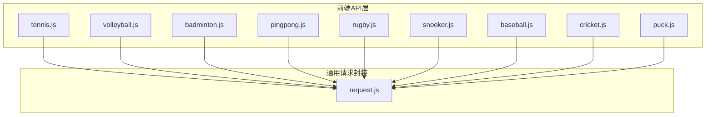
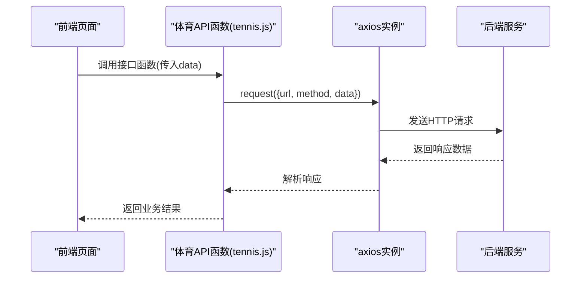
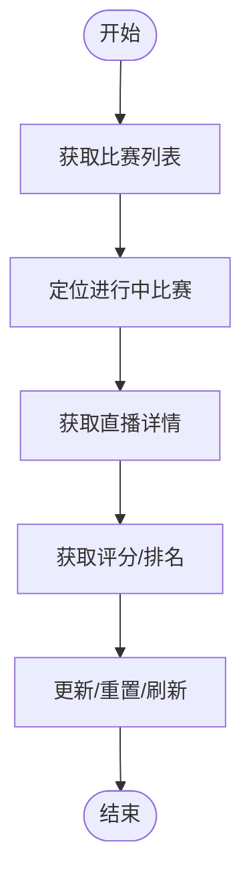
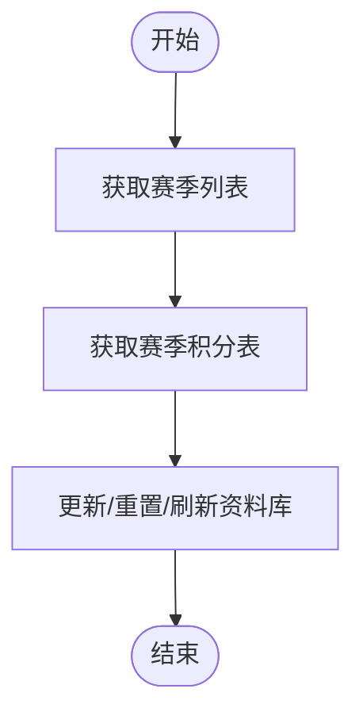
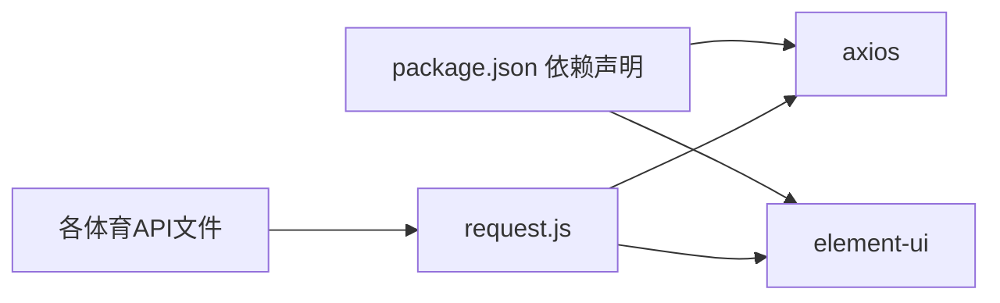

# 其他体育项目API

<cite>
**本文引用的文件**
- [tennis.js](file://src/api/matchapi/ball/tennis.js)
- [volleyball.js](file://src/api/matchapi/ball/volleyball.js)
- [badminton.js](file://src/api/matchapi/ball/badminton.js)
- [pingpong.js](file://src/api/matchapi/ball/pingpong.js)
- [rugby.js](file://src/api/matchapi/ball/rugby.js)
- [baseball.js](file://src/api/matchapi/ball/baseball.js)
- [cricket.js](file://src/api/matchapi/ball/cricket.js)
- [puck.js](file://src/api/matchapi/ball/puck.js)
- [snooker.js](file://src/api/matchapi/ball/snooker.js)
- [request.js](file://src/utils/request.js)
- [package.json](file://package.json)
</cite>

## 目录
1. [简介](#简介)
2. [项目结构](#项目结构)
3. [核心组件](#核心组件)
4. [架构总览](#架构总览)
5. [详细组件分析](#详细组件分析)
6. [依赖关系分析](#依赖关系分析)
7. [性能考量](#性能考量)
8. [故障排查指南](#故障排查指南)
9. [结论](#结论)
10. [附录](#附录)

## 简介
本文件面向“其他体育项目”数据模块，系统化梳理网球、排球、羽毛球、乒乓球、橄榄球、棒球、板球、冰球、斯诺克等体育项目的比赛与数据接口规范。内容覆盖：
- 各项目接口清单与用途说明
- 特色统计数据与业务规则要点
- 统一的调用流程与参数约定
- 数据模型差异与统一管理策略
- 跨项目数据整合与标准化建议

## 项目结构
该模块采用按“体育类型/子模块”分层组织的目录结构，便于扩展与维护。前端通过统一的请求封装向后端发起调用。

**图表来源**
- [tennis.js:1-183](file://src/api/matchapi/ball/tennis.js#L1-L183)
- [volleyball.js:1-147](file://src/api/matchapi/ball/volleyball.js#L1-L147)
- [badminton.js:1-156](file://src/api/matchapi/ball/badminton.js#L1-L156)
- [pingpong.js:1-157](file://src/api/matchapi/ball/pingpong.js#L1-L157)
- [rugby.js:1-202](file://src/api/matchapi/ball/rugby.js#L1-L202)
- [snooker.js:1-115](file://src/api/matchapi/ball/snooker.js#L1-L115)
- [baseball.js:1-165](file://src/api/matchapi/ball/baseball.js#L1-L165)
- [cricket.js:1-201](file://src/api/matchapi/ball/cricket.js#L1-L201)
- [puck.js:1-202](file://src/api/matchapi/ball/puck.js#L1-L202)
- [request.js:1-130](file://src/utils/request.js#L1-L130)

**章节来源**
- [tennis.js:1-183](file://src/api/matchapi/ball/tennis.js#L1-L183)
- [volleyball.js:1-147](file://src/api/matchapi/ball/volleyball.js#L1-L147)
- [badminton.js:1-156](file://src/api/matchapi/ball/badminton.js#L1-L156)
- [pingpong.js:1-157](file://src/api/matchapi/ball/pingpong.js#L1-L157)
- [rugby.js:1-202](file://src/api/matchapi/ball/rugby.js#L1-L202)
- [snooker.js:1-115](file://src/api/matchapi/ball/snooker.js#L1-L115)
- [baseball.js:1-165](file://src/api/matchapi/ball/baseball.js#L1-L165)
- [cricket.js:1-201](file://src/api/matchapi/ball/cricket.js#L1-L201)
- [puck.js:1-202](file://src/api/matchapi/ball/puck.js#L1-L202)
- [request.js:1-130](file://src/utils/request.js#L1-L130)

## 核心组件
- 请求封装：统一设置基础URL、超时、鉴权头、错误提示与响应拦截。
- 体育项目API：每个项目一个文件，导出若干函数，分别对应不同数据域的查询或维护操作。

关键特性
- 基础URL动态切换：根据运行环境自动选择不同后端域名。
- 统一鉴权：在请求头注入token。
- 统一错误提示：对非200状态与业务错误码进行消息提示。
- 超时控制：默认50秒超时，避免长时间阻塞。

**章节来源**
- [request.js:1-130](file://src/utils/request.js#L1-L130)

## 架构总览
前端通过各项目API文件发起HTTP请求，经由统一请求封装完成网络通信与错误处理，最终返回业务数据。

**图表来源**
- [tennis.js:3-11](file://src/api/matchapi/ball/tennis.js#L3-L11)
- [request.js:22-67](file://src/utils/request.js#L22-L67)

## 详细组件分析

### 网球(Tennis)
- 接口范围：比赛列表、队伍列表、赛事列表、进行中定位、修正数据、赛季/阶段/国家/场馆、分类、排名、直播详情、晋级图、评分、更新/重置赛事、刷新资料库、刷新排名等。
- 特色统计与规则：包含戴维斯杯相关排名与发布时间；支持直播详情与评分查询。
- 典型场景：后台管理“赛事-队伍-阶段-排名”的全链路维护。

**图表来源**
- [tennis.js:3-111](file://src/api/matchapi/ball/tennis.js#L3-L111)

**章节来源**
- [tennis.js:1-183](file://src/api/matchapi/ball/tennis.js#L1-L183)

### 排球(Volleyball)
- 接口范围：比赛/国家/赛事/队伍/分类/赛季/积分/进行中定位/修正/直播详情/队伍/赛事/国家更新与重置、刷新资料库。
- 特色统计与规则：提供赛季积分表；支持队伍/国家/赛事的资料库维护。
- 典型场景：联赛/杯赛的队伍与积分管理。

**图表来源**
- [volleyball.js:42-57](file://src/api/matchapi/ball/volleyball.js#L42-L57)

**章节来源**
- [volleyball.js:1-147](file://src/api/matchapi/ball/volleyball.js#L1-L147)

### 羽毛球(Badminton)
- 接口范围：比赛/赛事/国家/队伍/分类/阶段/赛季/进行中定位/积分/修正/场馆等；支持队伍/赛事/国家的更新与重置。
- 特色统计与规则：提供阶段与赛季积分表；支持场馆列表。
- 典型场景：国际赛事的队伍与阶段管理。

**章节来源**
- [badminton.js:1-156](file://src/api/matchapi/ball/badminton.js#L1-L156)

### 乒乓球(Pingpong)
- 接口范围：比赛/国家/赛事/队伍/分类/阶段/赛季/进行中定位/积分/修正/国家/赛事/队伍的更新与重置、刷新资料库。
- 特色统计与规则：提供阶段与赛季积分表。
- 典型场景：国家队与联赛的队伍与积分维护。

**章节来源**
- [pingpong.js:1-157](file://src/api/matchapi/ball/pingpong.js#L1-L157)

### 橄榄球(Rugby)
- 接口范围：比赛/国家/赛事/队伍/分类/阶段/赛季/积分/场馆/进行中定位/修正/直播/人员/队伍/赛事/国家的更新与重置、刷新资料库。
- 特色统计与规则：提供队伍/球员/赛事/国家的全量资料库维护能力。
- 典型场景：国际杯赛的全要素管理。

**章节来源**
- [rugby.js:1-202](file://src/api/matchapi/ball/rugby.js#L1-L202)

### 棒球(Baseball)
- 接口范围：比赛/国家/赛事/队伍/分类/阶段/赛季/积分/场馆/进行中定位/修正/直播/队伍/赛事/国家的更新与重置、刷新资料库。
- 特色统计与规则：提供阶段与赛季积分表。
- 典型场景：职业联赛的队伍与积分管理。

**章节来源**
- [baseball.js:1-165](file://src/api/matchapi/ball/baseball.js#L1-L165)

### 板球(Cricket)
- 接口范围：比赛/国家/赛事/队伍/球员/分类/阶段/赛季/积分/场馆/进行中定位/修正/直播/队伍/球员/赛事/国家的更新与重置、刷新资料库。
- 特色统计与规则：提供队伍/球员/赛事/国家的全量资料库维护能力。
- 典型场景：国际板球赛的全要素管理。

**章节来源**
- [cricket.js:1-201](file://src/api/matchapi/ball/cricket.js#L1-L201)

### 冰球(Puck)
- 接口范围：比赛/国家/赛事/队伍/分类/阶段/赛季/积分/场馆/进行中定位/修正/直播/球员/队伍/球员/赛事/国家的更新与重置、刷新资料库。
- 特色统计与规则：提供队伍/球员/赛事/国家的全量资料库维护能力。
- 典型场景：职业冰球联赛的全要素管理。

**章节来源**
- [puck.js:1-202](file://src/api/matchapi/ball/puck.js#L1-L202)

### 斯诺克(Snooker)
- 接口范围：比赛/进行中定位/修正/赛事/队伍/分类/阶段/赛季；支持赛事与队伍的更新、重置、刷新。
- 特色统计与规则：聚焦赛事与队伍维度的资料库维护。
- 典型场景：职业斯诺克赛事的队伍与赛程管理。

**章节来源**
- [snooker.js:1-115](file://src/api/matchapi/ball/snooker.js#L1-L115)

## 依赖关系分析
- 统一依赖：所有项目API均依赖统一请求封装，确保一致的网络行为与错误处理。
- 外部依赖：axios作为HTTP客户端；Element UI用于消息提示；Vue生态组件库。

**图表来源**
- [package.json:37-96](file://package.json#L37-L96)
- [request.js:1-130](file://src/utils/request.js#L1-L130)

**章节来源**
- [package.json:1-139](file://package.json#L1-L139)
- [request.js:1-130](file://src/utils/request.js#L1-L130)

## 性能考量
- 超时控制：默认50秒，避免长连接阻塞；可根据接口复杂度调整。
- 错误快速反馈：统一拦截器中对常见HTTP错误进行提示，便于快速定位问题。
- 环境隔离：通过环境变量区分不同后端域名，减少跨环境配置成本。

[本节为通用指导，不直接分析具体文件]

## 故障排查指南
- 登录态失效：当返回特定业务错误码时，前端会清除token并跳转登录页。
- 接口不存在：404错误会提示当前请求的URL，便于核对路径。
- 服务器异常：对5xx类错误进行统一提示，建议结合后端日志定位。
- 超时问题：检查网络状况与后端响应时间，必要时提升超时阈值。

**章节来源**
- [request.js:46-127](file://src/utils/request.js#L46-L127)

## 结论
该模块以统一请求封装为核心，围绕各体育项目提供完备的数据查询与维护接口，覆盖从基础数据到特色统计的全链路需求。通过清晰的目录结构与一致的调用规范，便于扩展与维护。建议在后续迭代中持续完善跨项目数据整合与标准化方案，提升多项目协同效率。

[本节为总结性内容，不直接分析具体文件]

## 附录

### 接口调用示例（路径指引）
以下为典型调用路径示例，便于在项目中快速定位与使用：
- 获取网球比赛列表：[tennis.js:3-9](file://src/api/matchapi/ball/tennis.js#L3-L9)
- 获取排球直播详情：[volleyball.js:74-81](file://src/api/matchapi/ball/volleyball.js#L74-L81)
- 获取羽毛球队伍列表：[badminton.js:61-68](file://src/api/matchapi/ball/badminton.js#L61-L68)
- 获取乒乓球国家列表：[pingpong.js:19-26](file://src/api/matchapi/ball/pingpong.js#L19-L26)
- 获取橄榄球阶段列表：[rugby.js:47-54](file://src/api/matchapi/ball/rugby.js#L47-L54)
- 获取棒球队伍列表：[baseball.js:31-38](file://src/api/matchapi/ball/baseball.js#L31-L38)
- 获取板球队伍列表：[cricket.js:44-51](file://src/api/matchapi/ball/cricket.js#L44-L51)
- 获取冰球队伍列表：[puck.js:29-36](file://src/api/matchapi/ball/puck.js#L29-L36)
- 获取斯诺克队伍列表：[snooker.js:59-66](file://src/api/matchapi/ball/snooker.js#L59-L66)

### 统一管理策略与跨项目整合
- 统一命名规范：各项目API函数命名保持一致风格，便于检索与复用。
- 参数约定：统一使用data对象传递查询条件，减少歧义。
- 错误处理：统一拦截器处理业务错误与HTTP错误，保证用户体验一致。
- 扩展建议：引入通用的“项目元数据”抽象，沉淀各项目特有的统计字段与业务规则，形成可配置的“项目模板”，降低重复开发成本。

[本节为通用指导，不直接分析具体文件]