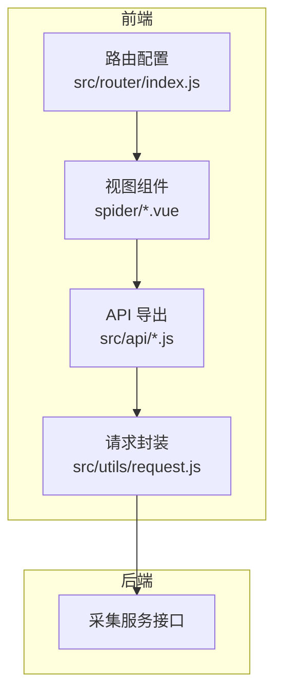
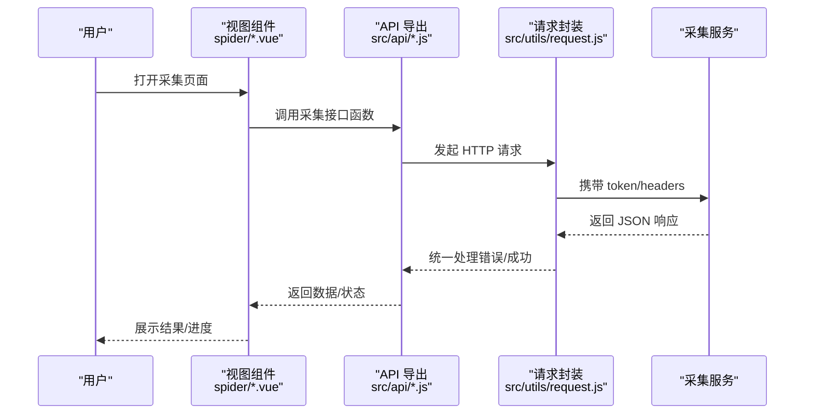
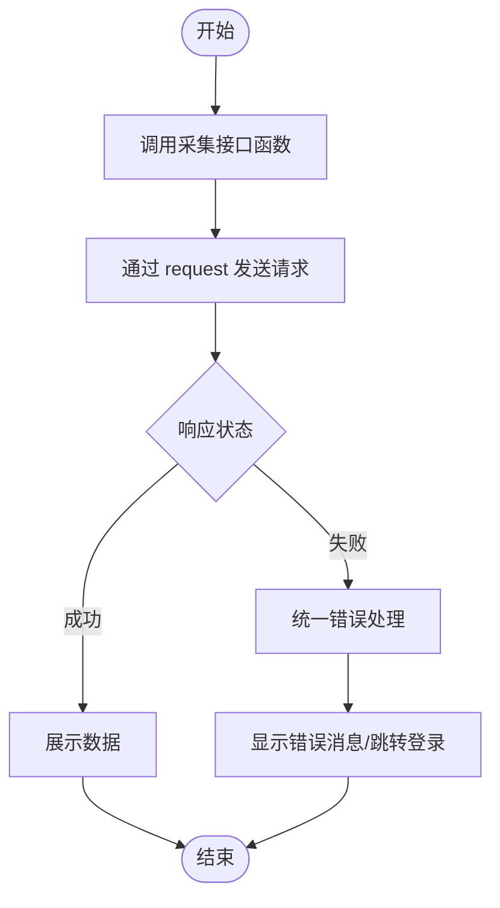
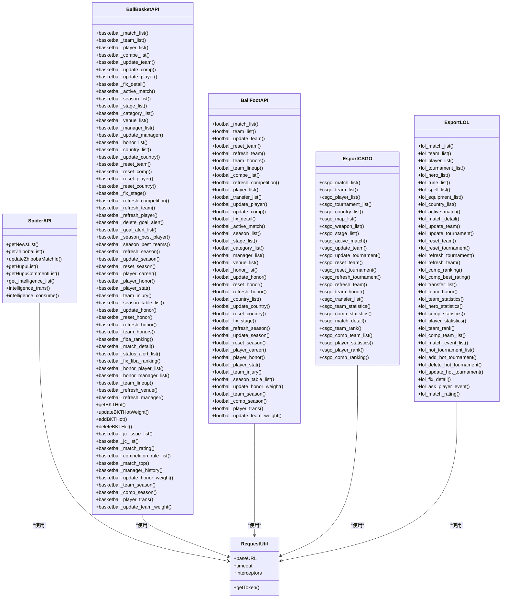
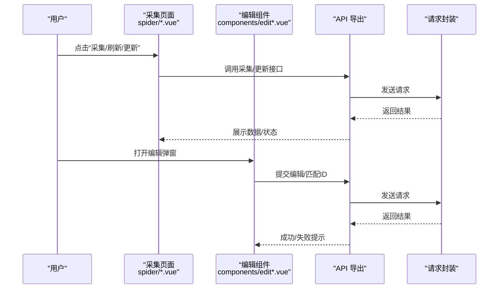
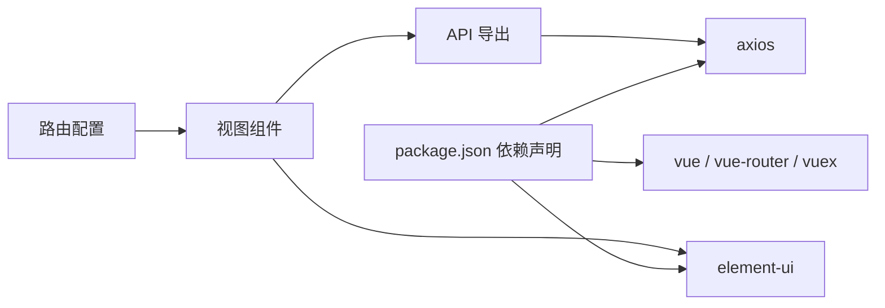

# 数据采集API

<cite>
**本文引用的文件**
- [spider.js](file://src/api/spider.js)
- [request.js](file://src/utils/request.js)
- [basketball.js](file://src/api/matchapi/ball/basketball.js)
- [football.js](file://src/api/matchapi/ball/football.js)
- [csgo.js](file://src/api/matchapi/game/csgo.js)
- [lol.js](file://src/api/matchapi/game/lol.js)
- [hupu_list.vue](file://src/views/spider/hupu_list.vue)
- [zhiboba.vue](file://src/views/spider/zhiboba.vue)
- [news.vue](file://src/views/spider/news.vue)
- [editList.vue](file://src/views/spider/components/editList.vue)
- [editMatchId.vue](file://src/views/spider/components/editMatchId.vue)
- [index.js](file://src/router/index.js)
- [package.json](file://package.json)
</cite>

## 目录
1. [简介](#简介)
2. [项目结构](#项目结构)
3. [核心组件](#核心组件)
4. [架构总览](#架构总览)
5. [详细组件分析](#详细组件分析)
6. [依赖关系分析](#依赖关系分析)
7. [性能与扩展性](#性能与扩展性)
8. [故障排查指南](#故障排查指南)
9. [结论](#结论)
10. [附录：接口清单与调用示例](#附录接口清单与调用示例)

## 简介
本文件面向体育数据自动采集系统，聚焦“数据采集”能力的前端API与交互流程，覆盖以下方面：
- 数据抓取：资讯、虎扑、直播吧等来源的数据采集入口
- 内容解析与清洗：采集后数据的结构化、异常处理与质量控制
- 存储管理：通过统一请求封装对接后端接口，完成数据入库与更新
- 技术实现：基于 Axios 的请求封装、拦截器与环境变量切换
- 实战场景：启动采集任务、监控进度、处理异常数据、管理采集规则（热门赛事、匹配ID等）

## 项目结构
前端采用 Vue 2 + Element UI 架构，数据采集相关能力主要分布在：
- API 层：统一的请求封装与各业务模块接口导出
- 视图层：采集页面与编辑组件，负责用户操作与数据展示
- 路由层：定义采集相关页面的入口路径

图表来源
- [request.js:1-130](file://src/utils/request.js#L1-L130)
- [index.js:1-177](file://src/router/index.js#L1-L177)

章节来源
- [request.js:1-130](file://src/utils/request.js#L1-L130)
- [index.js:1-177](file://src/router/index.js#L1-L177)

## 核心组件
- 请求封装与拦截器
  - 基于 Axios 创建实例，自动注入 token、跨域凭证与超时时间
  - 统一响应处理：错误码提示、未授权跳转、HTTP 状态映射
  - 环境切换：根据当前域名选择不同 BASE_URL（开发/生产/数据站）
- 采集 API 模块
  - spider.js：资讯、直播吧、虎扑、情报采集相关接口
  - matchapi：按球类/电竞划分的体育数据接口（篮球、足球、CSGO、LOL）
- 视图组件
  - spider 页面：采集任务管理、列表查看、编辑弹窗
  - 编辑组件：批量编辑采集规则、匹配ID等

章节来源
- [spider.js:1-62](file://src/api/spider.js#L1-L62)
- [basketball.js:1-553](file://src/api/matchapi/ball/basketball.js#L1-L553)
- [football.js:1-200](file://src/api/matchapi/ball/football.js#L1-L200)
- [csgo.js:1-200](file://src/api/matchapi/game/csgo.js#L1-L200)
- [lol.js:1-289](file://src/api/matchapi/game/lol.js#L1-L289)
- [request.js:1-130](file://src/utils/request.js#L1-L130)

## 架构总览
前端通过 API 模块调用 request 封装，统一发送 HTTP 请求到后端采集服务；视图组件负责触发采集动作与展示结果。

图表来源
- [spider.js:1-62](file://src/api/spider.js#L1-L62)
- [request.js:1-130](file://src/utils/request.js#L1-L130)

## 详细组件分析

### 采集 API 模块（spider.js）
- 功能概览
  - 资讯采集列表、直播吧列表、虎扑列表与评论列表
  - 情报采集、翻译、消费
  - 采集规则管理：更新直播吧比赛ID
- 典型调用链
  - 页面触发 → API 函数 → request 封装 → 后端接口
- 错误处理
  - 统一错误提示与未授权跳转逻辑在 request 中实现

图表来源
- [spider.js:1-62](file://src/api/spider.js#L1-L62)
- [request.js:1-130](file://src/utils/request.js#L1-L130)

章节来源
- [spider.js:1-62](file://src/api/spider.js#L1-L62)
- [request.js:1-130](file://src/utils/request.js#L1-L130)

### 体育数据接口（matchapi）
- 篮球接口
  - 比赛/队伍/球员/赛事/阶段/场馆/荣誉/国家等全量接口
  - 支持刷新、重置、更新、修正、热门赛事管理、评分查询等
- 足球接口
  - 比赛/队伍/球员/赛事/荣誉/教练/场馆等接口
  - 支持定位进行中比赛、修复详情、阶段修正等
- 电竞接口（CSGO/LOL）
  - 比赛/队伍/玩家/赛事/英雄/天赋/技能/装备/国家/地图/武器等
  - 支持刷新/重置/更新/统计/排行/热门赛事管理等

图表来源
- [spider.js:1-62](file://src/api/spider.js#L1-L62)
- [basketball.js:1-553](file://src/api/matchapi/ball/basketball.js#L1-L553)
- [football.js:1-200](file://src/api/matchapi/ball/football.js#L1-L200)
- [csgo.js:1-200](file://src/api/matchapi/game/csgo.js#L1-L200)
- [lol.js:1-289](file://src/api/matchapi/game/lol.js#L1-L289)
- [request.js:1-130](file://src/utils/request.js#L1-L130)

章节来源
- [spider.js:1-62](file://src/api/spider.js#L1-L62)
- [basketball.js:1-553](file://src/api/matchapi/ball/basketball.js#L1-L553)
- [football.js:1-200](file://src/api/matchapi/ball/football.js#L1-L200)
- [csgo.js:1-200](file://src/api/matchapi/game/csgo.js#L1-L200)
- [lol.js:1-289](file://src/api/matchapi/game/lol.js#L1-L289)
- [request.js:1-130](file://src/utils/request.js#L1-L130)

### 视图与编辑组件
- 页面组件
  - 虎扑采集列表、直播吧采集列表、资讯采集页
- 编辑组件
  - 列表编辑、匹配ID编辑弹窗
- 交互流程
  - 用户在页面点击“采集/刷新/更新”等按钮
  - 组件调用对应 API 函数，提交参数并接收返回结果
  - 对异常数据或错误进行提示与回退

图表来源
- [hupu_list.vue](file://src/views/spider/hupu_list.vue)
- [zhiboba.vue](file://src/views/spider/zhiboba.vue)
- [news.vue](file://src/views/spider/news.vue)
- [editList.vue](file://src/views/spider/components/editList.vue)
- [editMatchId.vue](file://src/views/spider/components/editMatchId.vue)
- [spider.js:1-62](file://src/api/spider.js#L1-L62)
- [request.js:1-130](file://src/utils/request.js#L1-L130)

章节来源
- [hupu_list.vue](file://src/views/spider/hupu_list.vue)
- [zhiboba.vue](file://src/views/spider/zhiboba.vue)
- [news.vue](file://src/views/spider/news.vue)
- [editList.vue](file://src/views/spider/components/editList.vue)
- [editMatchId.vue](file://src/views/spider/components/editMatchId.vue)
- [spider.js:1-62](file://src/api/spider.js#L1-L62)
- [request.js:1-130](file://src/utils/request.js#L1-L130)

## 依赖关系分析
- 外部依赖
  - axios：HTTP 客户端
  - element-ui：UI 组件与消息提示
  - vue、vue-router、vuex：前端框架与路由状态
- 内部依赖
  - API 模块依赖 request 封装
  - 视图组件依赖 API 模块与编辑组件
  - 路由配置决定页面入口与权限

图表来源
- [package.json:1-139](file://package.json#L1-L139)
- [request.js:1-130](file://src/utils/request.js#L1-L130)
- [index.js:1-177](file://src/router/index.js#L1-L177)

章节来源
- [package.json:1-139](file://package.json#L1-L139)
- [request.js:1-130](file://src/utils/request.js#L1-L130)
- [index.js:1-177](file://src/router/index.js#L1-L177)

## 性能与扩展性
- 性能优化建议
  - 请求并发控制：对批量采集任务进行分批/节流，避免瞬时高并发导致后端压力
  - 结果缓存：对高频查询（如热门赛事、规则列表）增加本地缓存与失效策略
  - 分页加载：采集列表采用分页/懒加载，减少首屏渲染压力
  - 超时与重试：结合后端限流策略，合理设置超时与指数退避重试
- 扩展性设计
  - API 模块按 sport 类型拆分（球类/电竞），便于新增类型与维护
  - request 封装集中处理 token、环境切换与错误提示，降低重复代码
  - 视图组件通过统一 API 调用，便于接入新采集源或规则

## 故障排查指南
- 常见问题
  - 未授权/登录态失效：请求拦截器检测到特定错误码会清空 token 并跳转登录
  - 接口不存在/404：响应拦截器会提示具体 URL
  - 服务器错误/超时：根据 HTTP 状态码给出明确提示
- 建议排查步骤
  - 检查网络与域名环境（BASE_URL 是否正确）
  - 查看浏览器控制台与后端日志
  - 确认 token 是否过期或被清除
  - 对异常数据进行最小化复现并记录参数

章节来源
- [request.js:1-130](file://src/utils/request.js#L1-L130)

## 结论
该数据采集体系以统一的请求封装为核心，围绕“采集—解析—清洗—存储”的闭环构建了完善的前端 API 与视图交互。通过模块化的接口设计与清晰的错误处理机制，能够稳定支撑多源数据采集与规则管理，并具备良好的扩展性与可维护性。

## 附录：接口清单与调用示例

### 采集接口（spider.js）
- 获取资讯列表
  - 方法：POST
  - 路径：v1/admin/spider/get_news_list
  - 参数：见页面传参
  - 示例路径：[spider.js:3-9](file://src/api/spider.js#L3-L9)
- 获取直播吧列表
  - 方法：POST
  - 路径：v1/admin/spider/get_zhiboba_list
  - 示例路径：[spider.js:10-16](file://src/api/spider.js#L10-L16)
- 更新直播吧比赛ID
  - 方法：POST
  - 路径：v1/admin/spider/update_zhiboba_match_id
  - 示例路径：[spider.js:17-23](file://src/api/spider.js#L17-L23)
- 获取虎扑列表
  - 方法：POST
  - 路径：v1/admin/spider/get_hupu_list
  - 示例路径：[spider.js:24-30](file://src/api/spider.js#L24-L30)
- 获取虎扑评论列表
  - 方法：POST
  - 路径：v1/admin/spider/get_hupu_comment_list
  - 示例路径：[spider.js:31-37](file://src/api/spider.js#L31-L37)
- 获取情报列表
  - 方法：POST
  - 路径：v1/admin/spider/get_intelligence_list
  - 示例路径：[spider.js:39-45](file://src/api/spider.js#L39-L45)
- 情报翻译
  - 方法：POST
  - 路径：v1/admin/spider/intelligence_trans
  - 示例路径：[spider.js:47-53](file://src/api/spider.js#L47-L53)
- 情报消费
  - 方法：POST
  - 路径：v1/admin/spider/intelligence_consume
  - 示例路径：[spider.js:55-61](file://src/api/spider.js#L55-L61)

章节来源
- [spider.js:1-62](file://src/api/spider.js#L1-L62)

### 篮球接口（basketball.js）
- 比赛列表
  - 方法：POST
  - 路径：/v1/admin/match/basketball/basketball_match_list
  - 示例路径：[basketball.js:3-9](file://src/api/matchapi/ball/basketball.js#L3-L9)
- 队伍列表
  - 方法：POST
  - 路径：/v1/admin/match/basketball/basketball_team_list
  - 示例路径：[basketball.js:10-16](file://src/api/matchapi/ball/basketball.js#L10-L16)
- 球员列表
  - 方法：POST
  - 路径：/v1/admin/match/basketball/basketball_player_list
  - 示例路径：[basketball.js:18-25](file://src/api/matchapi/ball/basketball.js#L18-L25)
- 赛事列表
  - 方法：POST
  - 路径：/v1/admin/match/basketball/basketball_compe_list
  - 示例路径：[basketball.js:28-34](file://src/api/matchapi/ball/basketball.js#L28-L34)
- 更新队伍
  - 方法：POST
  - 路径：/v1/admin/match/basketball/basketball_update_team
  - 示例路径：[basketball.js:36-42](file://src/api/matchapi/ball/basketball.js#L36-L42)
- 更新赛事
  - 方法：POST
  - 路径：/v1/admin/match/basketball/basketball_update_comp
  - 示例路径：[basketball.js:44-50](file://src/api/matchapi/ball/basketball.js#L44-L50)
- 更新球员
  - 方法：POST
  - 路径：/v1/admin/match/basketball/basketball_update_player
  - 示例路径：[basketball.js:52-58](file://src/api/matchapi/ball/basketball.js#L52-L58)
- 修正比赛详情
  - 方法：POST
  - 路径：/v1/admin/match/basketball/basketball_fix_detail
  - 示例路径：[basketball.js:60-66](file://src/api/matchapi/ball/basketball.js#L60-L66)
- 定位进行中比赛
  - 方法：POST
  - 路径：/v1/admin/match/basketball/basketball_active_match
  - 示例路径：[basketball.js:68-74](file://src/api/matchapi/ball/basketball.js#L68-L74)
- 赛季列表
  - 方法：POST
  - 路径：/v1/admin/match/basketball/basketball_season_list
  - 示例路径：[basketball.js:77-83](file://src/api/matchapi/ball/basketball.js#L77-L83)
- 阶段列表
  - 方法：POST
  - 路径：/v1/admin/match/basketball/basketball_stage_list
  - 示例路径：[basketball.js:86-92](file://src/api/matchapi/ball/basketball.js#L86-L92)
- 分类列表
  - 方法：GET
  - 路径：/v1/admin/match/basketball/basketball_category_list
  - 示例路径：[basketball.js:95-100](file://src/api/matchapi/ball/basketball.js#L95-L100)
- 场馆列表
  - 方法：POST
  - 路径：/v1/admin/match/basketball/basketball_venue_list
  - 示例路径：[basketball.js:103-109](file://src/api/matchapi/ball/basketball.js#L103-L109)
- 教练列表
  - 方法：POST
  - 路径：/v1/admin/match/basketball/basketball_manager_list
  - 示例路径：[basketball.js:112-118](file://src/api/matchapi/ball/basketball.js#L112-L118)
- 更新教练
  - 方法：POST
  - 路径：/v1/admin/match/basketball/basketball_update_manager
  - 示例路径：[basketball.js:120-126](file://src/api/matchapi/ball/basketball.js#L120-L126)
- 荣誉列表
  - 方法：POST
  - 路径：/v1/admin/match/basketball/basketball_honor_list
  - 示例路径：[basketball.js:128-134](file://src/api/matchapi/ball/basketball.js#L128-L134)
- 国家列表
  - 方法：POST
  - 路径：/v1/admin/match/basketball/basketball_country_list
  - 示例路径：[basketball.js:137-143](file://src/api/matchapi/ball/basketball.js#L137-L143)
- 更新国家
  - 方法：POST
  - 路径：/v1/admin/match/basketball/basketball_update_country
  - 示例路径：[basketball.js:145-151](file://src/api/matchapi/ball/basketball.js#L145-L151)
- 重置队伍
  - 方法：POST
  - 路径：/v1/admin/match/basketball/basketball_reset_team
  - 示例路径：[basketball.js:153-159](file://src/api/matchapi/ball/basketball.js#L153-L159)
- 重置赛事
  - 方法：POST
  - 路径：/v1/admin/match/basketball/basketball_reset_comp
  - 示例路径：[basketball.js:161-167](file://src/api/matchapi/ball/basketball.js#L161-L167)
- 重置球员
  - 方法：POST
  - 路径：/v1/admin/match/basketball/basketball_reset_player
  - 示例路径：[basketball.js:169-175](file://src/api/matchapi/ball/basketball.js#L169-L175)
- 重置国家
  - 方法：POST
  - 路径：/v1/admin/match/basketball/basketball_reset_country
  - 示例路径：[basketball.js:177-183](file://src/api/matchapi/ball/basketball.js#L177-L183)
- 刷新阶段
  - 方法：POST
  - 路径：/v1/admin/match/basketball/basketball_fix_stage
  - 示例路径：[basketball.js:185-191](file://src/api/matchapi/ball/basketball.js#L185-L191)
- 刷新赛事
  - 方法：POST
  - 路径：/v1/admin/match/basketball/basketball_refresh_competition
  - 示例路径：[basketball.js:194-200](file://src/api/matchapi/ball/basketball.js#L194-L200)
- 刷新队伍
  - 方法：POST
  - 路径：/v1/admin/match/basketball/basketball_refresh_team
  - 示例路径：[basketball.js:202-208](file://src/api/matchapi/ball/basketball.js#L202-L208)
- 刷新球员
  - 方法：POST
  - 路径：/v1/admin/match/basketball/basketball_refresh_player
  - 示例路径：[basketball.js:210-216](file://src/api/matchapi/ball/basketball.js#L210-L216)
- 删除异常进球
  - 方法：POST
  - 路径：/v1/admin/match/basketball/basketball_delete_goal_alert
  - 示例路径：[basketball.js:219-225](file://src/api/matchapi/ball/basketball.js#L219-L225)
- 异常进球列表
  - 方法：GET
  - 路径：/v1/admin/match/basketball/basketball_goal_alert_list
  - 示例路径：[basketball.js:227-233](file://src/api/matchapi/ball/basketball.js#L227-L233)
- 赛季最佳球员
  - 方法：POST
  - 路径：/v1/admin/match/basketball/basketball_season_best_player
  - 示例路径：[basketball.js:236-242](file://src/api/matchapi/ball/basketball.js#L236-L242)
- 赛季最佳球队
  - 方法：POST
  - 路径：/v1/admin/match/basketball/basketball_season_best_teams
  - 示例路径：[basketball.js:244-250](file://src/api/matchapi/ball/basketball.js#L244-L250)
- 刷新赛季
  - 方法：POST
  - 路径：/v1/admin/match/basketball/basketball_refresh_season
  - 示例路径：[basketball.js:253-259](file://src/api/matchapi/ball/basketball.js#L253-L259)
- 更新赛季
  - 方法：POST
  - 路径：/v1/admin/match/basketball/basketball_update_season
  - 示例路径：[basketball.js:261-267](file://src/api/matchapi/ball/basketball.js#L261-L267)
- 重置赛季
  - 方法：POST
  - 路径：/v1/admin/match/basketball/basketball_reset_season
  - 示例路径：[basketball.js:269-275](file://src/api/matchapi/ball/basketball.js#L269-L275)
- 球员生涯
  - 方法：POST
  - 路径：/v1/admin/match/basketball/basketball_player_career
  - 示例路径：[basketball.js:277-283](file://src/api/matchapi/ball/basketball.js#L277-L283)
- 球员荣誉
  - 方法：POST
  - 路径：/v1/admin/match/basketball/basketball_player_honor
  - 示例路径：[basketball.js:285-291](file://src/api/matchapi/ball/basketball.js#L285-L291)
- 单场球员统计
  - 方法：GET
  - 路径：/v1/admin/match/basketball/basketball_player_stat?match_id=...
  - 示例路径：[basketball.js:301-306](file://src/api/matchapi/ball/basketball.js#L301-L306)
- 队伍伤残
  - 方法：POST
  - 路径：/v1/admin/match/basketball/basketball_team_injury
  - 示例路径：[basketball.js:308-314](file://src/api/matchapi/ball/basketball.js#L308-L314)
- 赛季排名
  - 方法：POST
  - 路径：/v1/admin/match/basketball/basketball_season_table_list
  - 示例路径：[basketball.js:316-322](file://src/api/matchapi/ball/basketball.js#L316-L322)
- 更新荣誉
  - 方法：POST
  - 路径：/v1/admin/match/basketball/basketball_update_honor
  - 示例路径：[basketball.js:324-330](file://src/api/matchapi/ball/basketball.js#L324-L330)
- 重置荣誉
  - 方法：POST
  - 路径：/v1/admin/match/basketball/basketball_reset_honor
  - 示例路径：[basketball.js:332-338](file://src/api/matchapi/ball/basketball.js#L332-L338)
- 刷新荣誉
  - 方法：POST
  - 路径：/v1/admin/match/basketball/basketball_refresh_honor
  - 示例路径：[basketball.js:340-346](file://src/api/matchapi/ball/basketball.js#L340-L346)
- 队伍荣誉
  - 方法：POST
  - 路径：/v1/admin/match/basketball/basketball_team_honors
  - 示例路径：[basketball.js:349-355](file://src/api/matchapi/ball/basketball.js#L349-L355)
- FIBA 排名
  - 方法：POST
  - 路径：/v1/admin/match/basketball/basketball_fiba_ranking
  - 示例路径：[basketball.js:357-363](file://src/api/matchapi/ball/basketball.js#L357-L363)
- 比赛详情
  - 方法：POST
  - 路径：/v1/admin/match/basketball/basketball_match_detail
  - 示例路径：[basketball.js:365-371](file://src/api/matchapi/ball/basketball.js#L365-L371)
- 状态异常列表
  - 方法：GET
  - 路径：/v1/admin/match/basketball/basketball_status_alert_list
  - 示例路径：[basketball.js:373-378](file://src/api/matchapi/ball/basketball.js#L373-L378)
- 刷新 FIBA 排名
  - 方法：GET
  - 路径：/v1/admin/match/basketball/basketball_fix_fiba_ranking
  - 示例路径：[basketball.js:381-386](file://src/api/matchapi/ball/basketball.js#L381-L386)
- 荣誉球员列表
  - 方法：POST
  - 路径：/v1/admin/match/basketball/basketball_honor_player_list
  - 示例路径：[basketball.js:390-396](file://src/api/matchapi/ball/basketball.js#L390-L396)
- 荣誉教练列表
  - 方法：POST
  - 路径：/v1/admin/match/basketball/basketball_honor_manager_list
  - 示例路径：[basketball.js:399-405](file://src/api/matchapi/ball/basketball.js#L399-L405)
- 队伍阵容
  - 方法：POST
  - 路径：/v1/admin/match/basketball/basketball_team_lineup
  - 示例路径：[basketball.js:409-415](file://src/api/matchapi/ball/basketball.js#L409-L415)
- 刷新场馆
  - 方法：POST
  - 路径：/v1/admin/match/basketball/basketball_refresh_venue
  - 示例路径：[basketball.js:418-424](file://src/api/matchapi/ball/basketball.js#L418-L424)
- 刷新教练
  - 方法：POST
  - 路径：/v1/admin/match/basketball/basketball_refresh_manager
  - 示例路径：[basketball.js:427-433](file://src/api/matchapi/ball/basketball.js#L427-L433)
- 热门赛事列表
  - 方法：POST
  - 路径：/v1/admin/match/basketball/basketball_hot_competition_list
  - 示例路径：[basketball.js:435-441](file://src/api/matchapi/ball/basketball.js#L435-L441)
- 修改热门赛事权重
  - 方法：POST
  - 路径：/v1/admin/match/basketball/basketball_update_hot_competition
  - 示例路径：[basketball.js:444-450](file://src/api/matchapi/ball/basketball.js#L444-L450)
- 添加热门赛事
  - 方法：POST
  - 路径：/v1/admin/match/basketball/basketball_add_hot_competition
  - 示例路径：[basketball.js:452-458](file://src/api/matchapi/ball/basketball.js#L452-L458)
- 移除热门赛事
  - 方法：POST
  - 路径：/v1/admin/match/basketball/basketball_delete_hot_competition
  - 示例路径：[basketball.js:460-466](file://src/api/matchapi/ball/basketball.js#L460-L466)
- 竞彩期号列表
  - 方法：GET
  - 路径：/v1/admin/match/basketball/basketball_jc_issue_list
  - 示例路径：[basketball.js:467-472](file://src/api/matchapi/ball/basketball.js#L467-L472)
- 竞彩指数列表
  - 方法：POST
  - 路径：/v1/admin/match/basketball/basketball_jc_list
  - 示例路径：[basketball.js:474-480](file://src/api/matchapi/ball/basketball.js#L474-L480)
- 比赛评分
  - 方法：GET
  - 路径：/v1/admin/match/basketball/match_rating?match_id=...
  - 示例路径：[basketball.js:482-487](file://src/api/matchapi/ball/basketball.js#L482-L487)
- 赛事规则列表
  - 方法：POST
  - 路径：/v1/admin/match/basketball/basketball_competition_rule_list
  - 示例路径：[basketball.js:489-495](file://src/api/matchapi/ball/basketball.js#L489-L495)
- 比赛 top
  - 方法：POST
  - 路径：/v1/admin/match/basketball/match_top
  - 示例路径：[basketball.js:498-504](file://src/api/matchapi/ball/basketball.js#L498-L504)
- 教练履历
  - 方法：POST
  - 路径：/v1/admin/match/basketball/basketball_manager_history
  - 示例路径：[basketball.js:507-513](file://src/api/matchapi/ball/basketball.js#L507-L513)
- 修改荣誉权重
  - 方法：POST
  - 路径：/v1/admin/match/basketball/basketball_update_honor_weight
  - 示例路径：[basketball.js:515-521](file://src/api/matchapi/ball/basketball.js#L515-L521)
- 队伍赛季
  - 方法：GET
  - 路径：/v1/admin/match/basketball/basketball_team_season?team_id=...
  - 示例路径：[basketball.js:523-528](file://src/api/matchapi/ball/basketball.js#L523-L528)
- 赛事赛季
  - 方法：GET
  - 路径：/v1/admin/match/basketball/basketball_compe_season?comp_id=...
  - 示例路径：[basketball.js:530-535](file://src/api/matchapi/ball/basketball.js#L530-L535)
- 球员转会
  - 方法：POST
  - 路径：/v1/admin/match/basketball/basketball_player_trans
  - 示例路径：[basketball.js:538-544](file://src/api/matchapi/ball/basketball.js#L538-L544)
- 修改队伍权重
  - 方法：POST
  - 路径：/v1/admin/match/basketball/basketball_update_team_weight
  - 示例路径：[basketball.js:546-552](file://src/api/matchapi/ball/basketball.js#L546-L552)

章节来源
- [basketball.js:1-553](file://src/api/matchapi/ball/basketball.js#L1-L553)

### 足球接口（football.js）
- 比赛列表
  - 方法：POST
  - 路径：/v1/admin/match/football/football_match_list
  - 示例路径：[football.js:4-10](file://src/api/matchapi/ball/football.js#L4-L10)
- 队伍列表
  - 方法：POST
  - 路径：/v1/admin/match/football/football_team_list
  - 示例路径：[football.js:12-18](file://src/api/matchapi/ball/football.js#L12-L18)
- 更新队伍
  - 方法：POST
  - 路径：/v1/admin/match/football/football_update_team
  - 示例路径：[football.js:20-26](file://src/api/matchapi/ball/football.js#L20-L26)
- 重置队伍
  - 方法：POST
  - 路径：/v1/admin/match/football/football_reset_team
  - 示例路径：[football.js:28-34](file://src/api/matchapi/ball/football.js#L28-L34)
- 刷新队伍
  - 方法：POST
  - 路径：/v1/admin/match/football/football_refresh_team
  - 示例路径：[football.js:36-42](file://src/api/matchapi/ball/football.js#L36-L42)
- 队伍荣誉
  - 方法：POST
  - 路径：/v1/admin/match/football/football_team_honors
  - 示例路径：[football.js:44-50](file://src/api/matchapi/ball/football.js#L44-L50)
- 队伍阵容
  - 方法：POST
  - 路径：/v1/admin/match/football/football_team_lineup
  - 示例路径：[football.js:52-58](file://src/api/matchapi/ball/football.js#L52-L58)
- 赛事列表
  - 方法：POST
  - 路径：/v1/admin/match/football/football_compe_list
  - 示例路径：[football.js:60-66](file://src/api/matchapi/ball/football.js#L60-L66)
- 刷新赛事
  - 方法：POST
  - 路径：/v1/admin/match/football/football_refresh_competition
  - 示例路径：[football.js:68-74](file://src/api/matchapi/ball/football.js#L68-L74)
- 球员列表
  - 方法：POST
  - 路径：/v1/admin/match/football/football_player_list
  - 示例路径：[football.js:77-83](file://src/api/matchapi/ball/football.js#L77-L83)
- 转会列表
  - 方法：POST
  - 路径：/v1/admin/match/football/football_transfer_list
  - 示例路径：[football.js:86-92](file://src/api/matchapi/ball/football.js#L86-L92)
- 更新球员
  - 方法：POST
  - 路径：/v1/admin/match/football/football_update_player
  - 示例路径：[football.js:95-101](file://src/api/matchapi/ball/football.js#L95-L101)
- 更新赛事
  - 方法：POST
  - 路径：/v1/admin/match/football/football_update_comp
  - 示例路径：[football.js:103-109](file://src/api/matchapi/ball/football.js#L103-L109)
- 修复比赛详情
  - 方法：POST
  - 路径：/v1/admin/match/football/football_fix_detail
  - 示例路径：[football.js:112-118](file://src/api/matchapi/ball/football.js#L112-L118)
- 定位进行中比赛
  - 方法：POST
  - 路径：/v1/admin/match/football/football_active_match
  - 示例路径：[football.js:121-127](file://src/api/matchapi/ball/football.js#L121-L127)
- 赛季列表
  - 方法：POST
  - 路径：/v1/admin/match/football/football_season_list
  - 示例路径：[football.js:130-136](file://src/api/matchapi/ball/football.js#L130-L136)
- 阶段列表
  - 方法：POST
  - 路径：/v1/admin/match/football/football_stage_list
  - 示例路径：[football.js:139-145](file://src/api/matchapi/ball/football.js#L139-L145)
- 分类列表
  - 方法：GET
  - 路径：/v1/admin/match/football/football_category_list
  - 示例路径：[football.js:148-153](file://src/api/matchapi/ball/football.js#L148-L153)
- 教练列表
  - 方法：POST
  - 路径：/v1/admin/match/football/football_manager_list
  - 示例路径：[football.js:156-162](file://src/api/matchapi/ball/football.js#L156-L162)
- 场馆列表
  - 方法：POST
  - 路径：/v1/admin/match/football/football_venue_list
  - 示例路径：[football.js:165-171](file://src/api/matchapi/ball/football.js#L165-L171)
- 球员荣誉
  - 方法：POST
  - 路径：/v1/admin/match/football/football_honor_list
  - 示例路径：[football.js:174-180](file://src/api/matchapi/ball/football.js#L174-L180)
- 更新荣誉
  - 方法：POST
  - 路径：/v1/admin/match/football/football_update_honor
  - 示例路径：[football.js:182-188](file://src/api/matchapi/ball/football.js#L182-L188)
- 重置荣誉
  - 方法：POST
  - 路径：/v1/admin/match/football/football_reset_honor
  - 示例路径：[football.js:190-196](file://src/api/matchapi/ball/football.js#L190-L196)
- 刷新荣誉
  - 方法：POST
  - 路径：/v1/admin/match/football/football_refresh_honor
  - 示例路径：[football.js:199-205](file://src/api/matchapi/ball/football.js#L199-L205)

章节来源
- [football.js:1-200](file://src/api/matchapi/ball/football.js#L1-L200)

### 电竞接口（csgo.js）
- 比赛列表
  - 方法：POST
  - 路径：/v1/admin/match/esports/csgo/csgo_match_list
  - 示例路径：[csgo.js:6-12](file://src/api/matchapi/game/csgo.js#L6-L12)
- 队伍列表
  - 方法：POST
  - 路径：/v1/admin/match/esports/csgo/csgo_team_list
  - 示例路径：[csgo.js:14-20](file://src/api/matchapi/game/csgo.js#L14-L20)
- 球员列表
  - 方法：POST
  - 路径：/v1/admin/match/esports/csgo/csgo_player_list
  - 示例路径：[csgo.js:22-28](file://src/api/matchapi/game/csgo.js#L22-L28)
- 赛事列表
  - 方法：POST
  - 路径：/v1/admin/match/esports/csgo/csgo_tournament_list
  - 示例路径：[csgo.js:30-36](file://src/api/matchapi/game/csgo.js#L30-L36)
- 国家列表
  - 方法：POST
  - 路径：/v1/admin/match/esports/csgo/csgo_country_list
  - 示例路径：[csgo.js:38-44](file://src/api/matchapi/game/csgo.js#L38-L44)
- 地图列表
  - 方法：POST
  - 路径：/v1/admin/match/esports/csgo/csgo_map_list
  - 示例路径：[csgo.js:46-52](file://src/api/matchapi/game/csgo.js#L46-L52)
- 武器列表
  - 方法：POST
  - 路径：/v1/admin/match/esports/csgo/csgo_weapon_list
  - 示例路径：[csgo.js:54-60](file://src/api/matchapi/game/csgo.js#L54-L60)
- 阶段列表
  - 方法：POST
  - 路径：/v1/admin/match/esports/csgo/csgo_stage_list
  - 示例路径：[csgo.js:62-68](file://src/api/matchapi/game/csgo.js#L62-L68)
- 定位进行中比赛
  - 方法：POST
  - 路径：/v1/admin/match/esports/csgo/csgo_active_match
  - 示例路径：[csgo.js:70-76](file://src/api/matchapi/game/csgo.js#L70-L76)
- 更新队伍
  - 方法：POST
  - 路径：/v1/admin/match/esports/csgo/csgo_update_team
  - 示例路径：[csgo.js:78-84](file://src/api/matchapi/game/csgo.js#L78-L84)
- 更新赛事
  - 方法：POST
  - 路径：/v1/admin/match/esports/csgo/csgo_update_tournament
  - 示例路径：[csgo.js:86-92](file://src/api/matchapi/game/csgo.js#L86-L92)
- 重置队伍
  - 方法：POST
  - 路径：/v1/admin/match/esports/csgo/csgo_reset_team
  - 示例路径：[csgo.js:94-100](file://src/api/matchapi/game/csgo.js#L94-L100)
- 重置赛事
  - 方法：POST
  - 路径：/v1/admin/match/esports/csgo/csgo_reset_tournament
  - 示例路径：[csgo.js:102-109](file://src/api/matchapi/game/csgo.js#L102-L109)
- 刷新赛事资料库
  - 方法：POST
  - 路径：/v1/admin/match/esports/csgo/csgo_refresh_tournament
  - 示例路径：[csgo.js:111-117](file://src/api/matchapi/game/csgo.js#L111-L117)
- 刷新队伍资料库
  - 方法：POST
  - 路径：/v1/admin/match/esports/csgo/csgo_refresh_team
  - 示例路径：[csgo.js:119-125](file://src/api/matchapi/game/csgo.js#L119-L125)
- 队伍荣誉
  - 方法：POST
  - 路径：/v1/admin/match/esports/csgo/csgo_team_honor
  - 示例路径：[csgo.js:127-133](file://src/api/matchapi/game/csgo.js#L127-L133)
- 队员转会
  - 方法：POST
  - 路径：/v1/admin/match/esports/csgo/csgo_transfer_list
  - 示例路径：[csgo.js:135-141](file://src/api/matchapi/game/csgo.js#L135-L141)
- 队伍统计
  - 方法：POST
  - 路径：/v1/admin/match/esports/csgo/csgo_team_statistics
  - 示例路径：[csgo.js:143-149](file://src/api/matchapi/game/csgo.js#L143-L149)
- 赛事统计
  - 方法：POST
  - 路径：/v1/admin/match/esports/csgo/csgo_comp_statistics
  - 示例路径：[csgo.js:151-157](file://src/api/matchapi/game/csgo.js#L151-L157)
- 比赛详情
  - 方法：POST
  - 路径：/v1/admin/match/esports/csgo/csgo_match_detail
  - 示例路径：[csgo.js:159-165](file://src/api/matchapi/game/csgo.js#L159-L165)
- 队伍排行
  - 方法：POST
  - 路径：/v1/admin/match/esports/csgo/csgo_team_rank
  - 示例路径：[csgo.js:167-173](file://src/api/matchapi/game/csgo.js#L167-L173)
- 赛事队伍
  - 方法：POST
  - 路径：/v1/admin/match/esports/csgo/csgo_comp_team_list
  - 示例路径：[csgo.js:175-181](file://src/api/matchapi/game/csgo.js#L175-L181)
- 选手统计
  - 方法：POST
  - 路径：/v1/admin/match/esports/csgo/csgo_player_statistics
  - 示例路径：[csgo.js:184-190](file://src/api/matchapi/game/csgo.js#L184-L190)
- 选手排行
  - 方法：POST
  - 路径：/v1/admin/match/esports/csgo/csgo_player_rank
  - 示例路径：[csgo.js:192-198](file://src/api/matchapi/game/csgo.js#L192-L198)
- 赛事积分榜
  - 方法：POST
  - 路径：/v1/admin/match/esports/csgo/csgo_comp_ranking
  - 示例路径：[csgo.js:200-206](file://src/api/matchapi/game/csgo.js#L200-L206)

章节来源
- [csgo.js:1-200](file://src/api/matchapi/game/csgo.js#L1-L200)

### 电竞接口（lol.js）
- 比赛列表
  - 方法：POST
  - 路径：/v1/admin/match/esports/lol/lol_match_list
  - 示例路径：[lol.js:8-12](file://src/api/matchapi/game/lol.js#L8-L12)
- 队伍列表
  - 方法：POST
  - 路径：/v1/admin/match/esports/lol/lol_team_list
  - 示例路径：[lol.js:15-21](file://src/api/matchapi/game/lol.js#L15-L21)
- 球员列表
  - 方法：POST
  - 路径：/v1/admin/match/esports/lol/lol_player_list
  - 示例路径：[lol.js:23-29](file://src/api/matchapi/game/lol.js#L23-L29)
- 赛事列表
  - 方法：POST
  - 路径：/v1/admin/match/esports/lol/lol_tournament_list
  - 示例路径：[lol.js:32-36](file://src/api/matchapi/game/lol.js#L32-L36)
- 英雄列表
  - 方法：POST
  - 路径：/v1/admin/match/esports/lol/lol_hero_list
  - 示例路径：[lol.js:39-45](file://src/api/matchapi/game/lol.js#L39-L45)
- 天赋列表
  - 方法：POST
  - 路径：/v1/admin/match/esports/lol/lol_rune_list
  - 示例路径：[lol.js:48-52](file://src/api/matchapi/game/lol.js#L48-L52)
- 召唤师技能列表
  - 方法：POST
  - 路径：/v1/admin/match/esports/lol/lol_spell_list
  - 示例路径：[lol.js:56-60](file://src/api/matchapi/game/lol.js#L56-L60)
- 装备列表
  - 方法：POST
  - 路径：/v1/admin/match/esports/lol/lol_equipment_list
  - 示例路径：[lol.js:64-68](file://src/api/matchapi/game/lol.js#L64-L68)
- 国家列表
  - 方法：POST
  - 路径：/v1/admin/match/esports/lol/lol_country_list
  - 示例路径：[lol.js:72-76](file://src/api/matchapi/game/lol.js#L72-L76)
- 定位进行中比赛
  - 方法：POST
  - 路径：/v1/admin/match/esports/lol/lol_active_match
  - 示例路径：[lol.js:80-84](file://src/api/matchapi/game/lol.js#L80-L84)
- 比赛详情
  - 方法：POST
  - 路径：/v1/admin/match/esports/lol/lol_match_detail
  - 示例路径：[lol.js:88-92](file://src/api/matchapi/game/lol.js#L88-L92)
- 更新队伍
  - 方法：POST
  - 路径：/v1/admin/match/esports/lol/lol_update_team
  - 示例路径：[lol.js:96-100](file://src/api/matchapi/game/lol.js#L96-L100)
- 更新赛事
  - 方法：POST
  - 路径：/v1/admin/match/esports/lol/lol_update_tournament
  - 示例路径：[lol.js:104-108](file://src/api/matchapi/game/lol.js#L104-L108)
- 重置队伍
  - 方法：POST
  - 路径：/v1/admin/match/esports/lol/lol_reset_team
  - 示例路径：[lol.js:112-116](file://src/api/matchapi/game/lol.js#L112-L116)
- 重置赛事
  - 方法：POST
  - 路径：/v1/admin/match/esports/lol/lol_reset_tournament
  - 示例路径：[lol.js:120-126](file://src/api/matchapi/game/lol.js#L120-L126)
- 刷新赛事资料库
  - 方法：POST
  - 路径：/v1/admin/match/esports/lol/lol_refresh_tournament
  - 示例路径：[lol.js:129-134](file://src/api/matchapi/game/lol.js#L129-L134)
- 刷新队伍资料库
  - 方法：POST
  - 路径：/v1/admin/match/esports/lol/lol_refresh_team
  - 示例路径：[lol.js:138-143](file://src/api/matchapi/game/lol.js#L138-L143)
- 赛事积分榜
  - 方法：POST
  - 路径：/v1/admin/match/esports/lol/lol_comp_ranking
  - 示例路径：[lol.js:147-151](file://src/api/matchapi/game/lol.js#L147-L151)
- 最佳评分
  - 方法：POST
  - 路径：v1/admin/match/esports/lol/lol_comp_best_rating
  - 示例路径：[lol.js:154-160](file://src/api/matchapi/game/lol.js#L154-L160)
- 队员转会列表
  - 方法：POST
  - 路径：/v1/admin/match/esports/lol/lol_transfer_list
  - 示例路径：[lol.js:164-168](file://src/api/matchapi/game/lol.js#L164-L168)
- 队伍荣誉
  - 方法：POST
  - 路径：/v1/admin/match/esports/lol/lol_team_honor
  - 示例路径：[lol.js:171-176](file://src/api/matchapi/game/lol.js#L171-L176)
- 队伍统计
  - 方法：POST
  - 路径：/v1/admin/match/esports/lol/lol_team_statistics
  - 示例路径：[lol.js:179-184](file://src/api/matchapi/game/lol.js#L179-L184)
- 英雄统计
  - 方法：POST
  - 路径：/v1/admin/match/esports/lol/lol_hero_statistics
  - 示例路径：[lol.js:187-192](file://src/api/matchapi/game/lol.js#L187-L192)
- 赛事统计
  - 方法：POST
  - 路径：/v1/admin/match/esports/lol/lol_comp_statistics
  - 示例路径：[lol.js:195-200](file://src/api/matchapi/game/lol.js#L195-L200)
- 选手统计
  - 方法：POST
  - 路径：/v1/admin/match/esports/lol/lol_player_statistics
  - 示例路径：[lol.js:203-208](file://src/api/matchapi/game/lol.js#L203-L208)
- 队伍排行
  - 方法：POST
  - 路径：/v1/admin/match/esports/lol/lol_team_rank
  - 示例路径：[lol.js:212-216](file://src/api/matchapi/game/lol.js#L212-L216)
- 赛事队伍
  - 方法：POST
  - 路径：/v1/admin/match/esports/lol/lol_comp_team_list
  - 示例路径：[lol.js:221-225](file://src/api/matchapi/game/lol.js#L221-L225)
- 单场比赛事件
  - 方法：POST
  - 路径：/v1/admin/match/esports/lol/lol_match_event_list
  - 示例路径：[lol.js:228-233](file://src/api/matchapi/game/lol.js#L228-L233)
- 热门赛事列表
  - 方法：POST
  - 路径：/v1/admin/match/esports/lol/lol_hot_tournament_list
  - 示例路径：[lol.js:237-241](file://src/api/matchapi/game/lol.js#L237-L241)
- 添加热门赛事
  - 方法：POST
  - 路径：/v1/admin/match/esports/lol/lol_add_hot_tournament
  - 示例路径：[lol.js:244-249](file://src/api/matchapi/game/lol.js#L244-L249)
- 移除热门赛事
  - 方法：POST
  - 路径：/v1/admin/match/esports/lol/lol_delete_hot_tournament
  - 示例路径：[lol.js:252-257](file://src/api/matchapi/game/lol.js#L252-L257)
- 修改热门赛事权重
  - 方法：POST
  - 路径：/v1/admin/match/esports/lol/lol_update_hot_tournament
  - 示例路径：[lol.js:260-265](file://src/api/matchapi/game/lol.js#L260-L265)
- 数据修正
  - 方法：POST
  - 路径：/v1/admin/match/esports/lol/lol_fix_detail
  - 示例路径：[lol.js:268-273](file://src/api/matchapi/game/lol.js#L268-L273)
- 选手技术统计
  - 方法：POST
  - 路径：/v1/admin/match/esports/lol/lol_player_tournament_statistic
  - 示例路径：[lol.js:277-281](file://src/api/matchapi/game/lol.js#L277-L281)
- 比赛评分
  - 方法：GET
  - 路径：/v1/admin/match/esports/lol/match_rating?match_id=...
  - 示例路径：[lol.js:284-289](file://src/api/matchapi/game/lol.js#L284-L289)

章节来源
- [lol.js:1-289](file://src/api/matchapi/game/lol.js#L1-L289)

### 请求封装与环境切换（request.js）
- 功能要点
  - 自动注入 token 与跨域凭证
  - 统一超时时间与错误处理
  - 根据域名自动切换 BASE_URL（开发/生产/数据站）
- 关键路径
  - [request.js:1-130](file://src/utils/request.js#L1-L130)

章节来源
- [request.js:1-130](file://src/utils/request.js#L1-L130)

### 页面与路由入口
- 页面入口
  - 虎扑采集列表、直播吧采集列表、资讯采集页
- 路由配置
  - 采集相关页面在路由中注册，便于导航与权限控制
- 关键路径
  - [index.js:1-177](file://src/router/index.js#L1-L177)

章节来源
- [index.js:1-177](file://src/router/index.js#L1-L177)