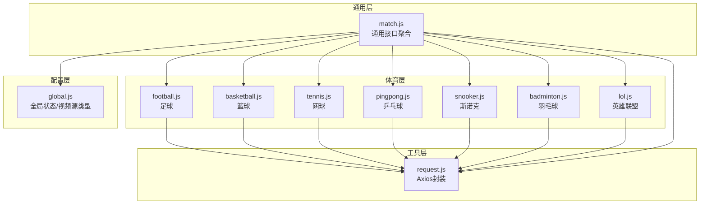
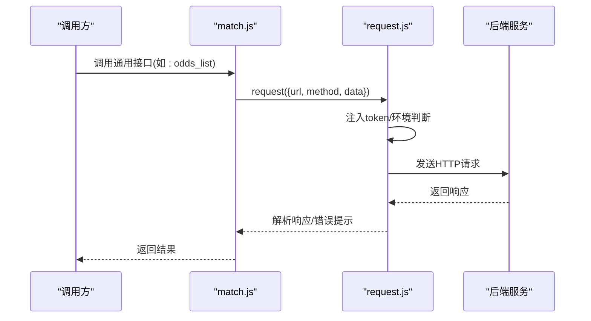
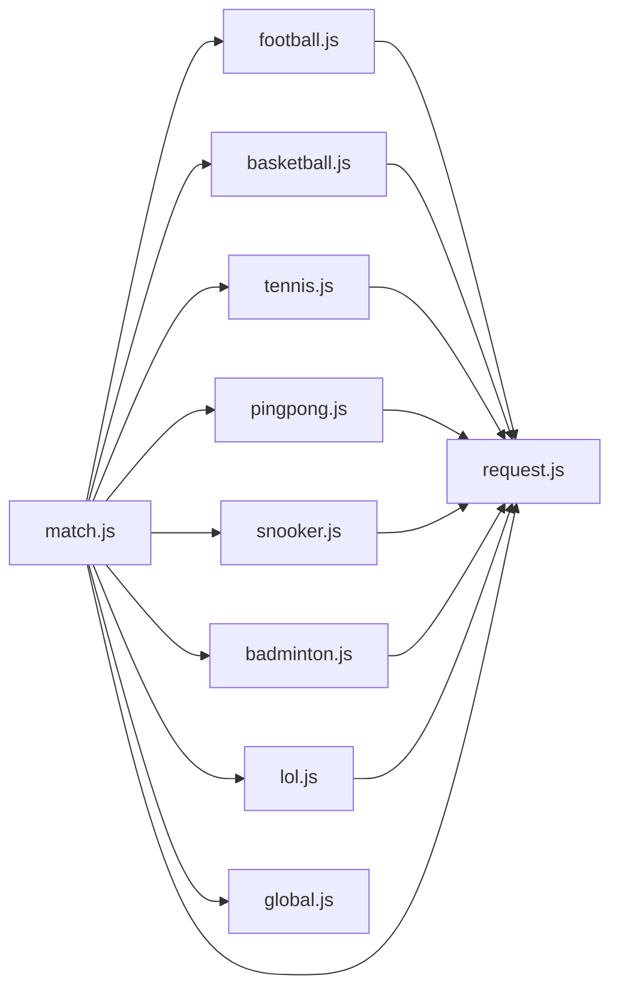
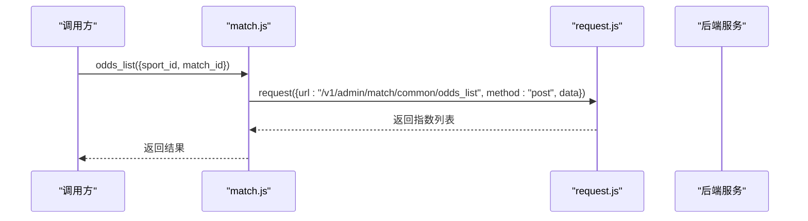
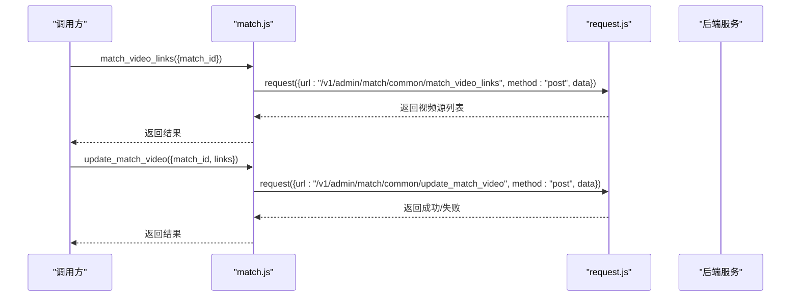
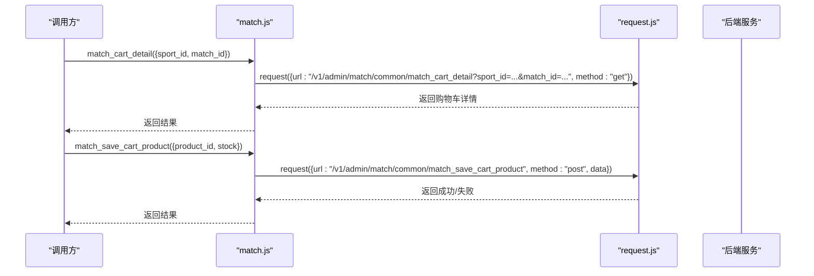
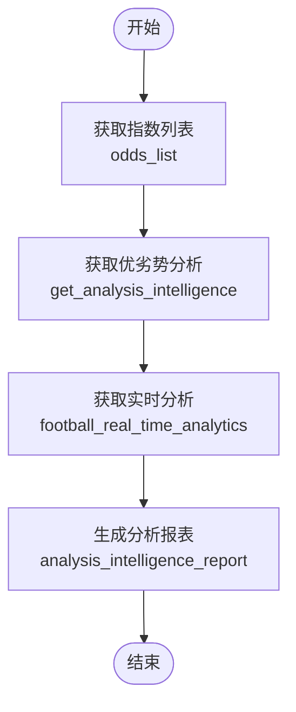

# 比赛通用API

<cite>
**本文档引用的文件**
- [match.js](file://src/api/match.js)
- [request.js](file://src/utils/request.js)
- [global.js](file://src/config/global.js)
- [football.js](file://src/api/matchapi/ball/football.js)
- [basketball.js](file://src/api/matchapi/ball/basketball.js)
- [tennis.js](file://src/api/matchapi/ball/tennis.js)
- [pingpong.js](file://src/api/matchapi/ball/pingpong.js)
- [snooker.js](file://src/api/matchapi/ball/snooker.js)
- [badminton.js](file://src/api/matchapi/ball/badminton.js)
- [lol.js](file://src/api/matchapi/game/lol.js)
</cite>

## 目录
1. [简介](#简介)
2. [项目结构](#项目结构)
3. [核心组件](#核心组件)
4. [架构总览](#架构总览)
5. [详细组件分析](#详细组件分析)
6. [依赖关系分析](#依赖关系分析)
7. [性能与实时性](#性能与实时性)
8. [故障排查指南](#故障排查指南)
9. [结论](#结论)
10. [附录：接口清单与调用示例](#附录接口清单与调用示例)

## 简介
本文件为“比赛通用API”的权威技术文档，覆盖所有体育项目共享的通用比赛数据接口规范，包括但不限于：
- 比赛推荐与智能分析
- 指数管理（含纳米指数、半场指数、电竞指数）
- 视频直播与拉流配置
- 购物车与商品销售
- 数据分析与报表
- 实时状态与异常监控
- 统一管理机制与跨项目共享策略
- 实时性要求与缓存策略

文档面向前端工程师、测试工程师与产品运营，既提供代码级参考，也提供业务流程与调用示例说明。

## 项目结构
该模块采用“通用API聚合 + 项目细分API”的分层设计：
- 通用层：集中导出跨项目通用接口，便于统一调用与维护
- 体育层：按球类/游戏分别提供细分接口，复用通用层能力
- 工具层：统一请求封装与环境变量适配
- 配置层：全局状态与视频源类型映射

图表来源
- [match.js:1-18](file://src/api/match.js#L1-L18)
- [football.js:1-10](file://src/api/matchapi/ball/football.js#L1-L10)
- [basketball.js:1-10](file://src/api/matchapi/ball/basketball.js#L1-L10)
- [tennis.js:1-10](file://src/api/matchapi/ball/tennis.js#L1-L10)
- [pingpong.js:1-10](file://src/api/matchapi/ball/pingpong.js#L1-L10)
- [snooker.js:1-10](file://src/api/matchapi/ball/snooker.js#L1-L10)
- [badminton.js:1-10](file://src/api/matchapi/ball/badminton.js#L1-L10)
- [lol.js:1-10](file://src/api/matchapi/game/lol.js#L1-L10)
- [request.js:1-26](file://src/utils/request.js#L1-L26)
- [global.js:4-77](file://src/config/global.js#L4-L77)

章节来源
- [match.js:1-18](file://src/api/match.js#L1-L18)
- [request.js:1-26](file://src/utils/request.js#L1-L26)
- [global.js:4-77](file://src/config/global.js#L4-L77)

## 核心组件
- 通用接口聚合器：集中导出跨项目通用接口，包含推荐、指数、直播、购物车、分析、置顶、节目单、评论、评分、模型销售、视频价格、搜索等
- 体育专项接口：按项目提供列表、详情、刷新、重置、更新、异常监控、统计、评分等
- 请求封装：自动注入token、环境切换、错误提示与响应拦截
- 全局配置：比赛状态映射、视频源类型映射

章节来源
- [match.js:28-800](file://src/api/match.js#L28-L800)
- [football.js:1-775](file://src/api/matchapi/ball/football.js#L1-L775)
- [basketball.js:1-553](file://src/api/matchapi/ball/basketball.js#L1-L553)
- [request.js:28-127](file://src/utils/request.js#L28-L127)
- [global.js:6-77](file://src/config/global.js#L6-L77)

## 架构总览
通用API通过统一入口导出，各体育项目模块按需扩展；请求层负责环境与认证，配置层提供状态与类型映射。

图表来源
- [match.js:126-141](file://src/api/match.js#L126-L141)
- [request.js:28-68](file://src/utils/request.js#L28-L68)

章节来源
- [match.js:126-141](file://src/api/match.js#L126-L141)
- [request.js:28-68](file://src/utils/request.js#L28-L68)

## 详细组件分析

### 通用接口聚合器（match.js）
- 推荐与智能分析
  - 推荐状态更新：ratingMatch
  - APP推荐更新：ratingApp
  - 动态情报编辑/列表：save_intelligence、intelligence_list
  - 优劣势分析：get_analysis_intelligence、analysis_intelligence_list、analysis_intelligence_report、analysis_intelligence_income_report、analysis_intelligence_union_trade_report
- 指数管理
  - 指数列表：odds_list、half_odds、nami_odds、befair_odds
  - 电竞指数：nami_esports_odds
  - 指数详情：odds_detail
- 直播与视频
  - 直播列表：match_video_url、match_video_urls
  - 视频源管理：match_video_links、match_video_links_V2、match_mlive_links、match_video_order、live_stream_forbid、live_stream_resume、live_stream_block_list
  - 视频解析与多播放方式：match_video_key、match_video_keys
  - 电竞视频：match_esport_video_url
  - 拉流配置：pull_stream_conf_list、add_pull_stream_conf、update_pull_stream_conf、del_pull_stream_conf
  - 在线人数：match_video_user、live_user、live_user_domains、live_stream_online_list
  - 报表：match_video_report
  - 推流地址：get_push_url
- 购物车与商品
  - 购物车详情：match_cart_detail
  - 商品编辑：match_save_cart、match_save_cart_product、match_save_cart_stock
  - 推送与销售：match_push_cart、match_cart_order_list、match_cart_order_report
  - 主播打赏：match_anchor_tip_list
- 模型与节目单
  - 模型销售：match_model_order_list、match_model_order_report、match_model_order_rank
  - 节目单：save_match_program、del_match_program、match_program_list
- 评论与评分
  - 评分评论：userCommentPlayer、playerCommentList、playerCommentDetail、del_log_list、CommendeltList、playerCommentDelete、playerCommentHidden、playerCommentLike、playerCommentLikeDetail、playerCommentSave、playerCreatePlayerComment
- 其他
  - 关注列表：match_my_subscrip、comp_my_subscrip、team_my_subscrip
  - 置顶：match_fixed_list、add_fixed_match、rem_fixed_match
  - 资料库：database_h5、database_h5_save、database_h5_delete
  - 备注：save_tips
  - 集锦/录像：match_video_list、matchVideotapeList、fix_fetch_videos、match_video_update、save_match_program_coll、matchVideotapeHidden、del_match_program_coll
  - 单场视频价格：edit_video_fee
  - 搜索：common_search
  - 购买记录与报表：match_video_order_list、match_video_order_report
  - 华为单场推荐：save_huawei_single

章节来源
- [match.js:28-800](file://src/api/match.js#L28-L800)

### 体育专项接口（以足球为例）
- 列表与详情
  - 比赛列表：football_match_list
  - 队伍/球员/赛事列表：football_team_list、football_player_list、football_compe_list
  - 详情：football_match_detail
- 刷新与重置
  - 队伍/球员/赛事/国家/阶段/荣誉/裁判/场馆等：football_refresh_team、football_refresh_player、football_refresh_competition、football_refresh_country、football_refresh_honor、football_refresh_referee、football_refresh_venue、football_refresh_lineup、football_fix_stage
  - 重置：football_reset_team、football_reset_player、football_reset_comp、football_reset_country、football_reset_honor
  - 更新：football_update_team、football_update_player、football_update_comp、football_update_country、football_update_honor、football_update_referee、football_update_manager、football_update_team_weight
- 统计与评分
  - 阵容：football_team_lineup
  - 球员统计：player_stat、player_stats
  - 评分：football_match_rating
  - 实时分析：football_real_time_analytics、football_real_time_analytics_purchase、football_real_time_report
- 荣誉与排名
  - 荣誉：football_team_honors、football_player_honors、football_honor_list、football_manager_horor、football_manager_history、football_player_honors、football_country_list、football_fifa_ranking、football_club_ranking、football_season_table_list、football_season_best_teams、football_season_best_player、football_season_best_lineup、football_season_best_teams
- 异常监控
  - 进球异常：football_goal_alert_list、football_delete_goal_alert
  - 状态异常：football_status_alert_list
- 竞彩/足彩/北单
  - 竞彩期号/指数：football_jc_issue_list、football_jc_list
  - 足彩期号/指数：football_zc_issue_list、football_zc_list
  - 北单胜负：bd_sf_issue_list、bd_sf_list
- 热门赛事与权重
  - getFBHot、addFBHot、deleteFBHot、updateFBHotWeight
- 资料库与重要
  - database_important_list、database_important_save
  - GIF黑名单：gif_black_list、gif_black_save
  - 球员身价：football_player_market
  - 比赛top：football_match_top
  - 荣誉权重：football_update_honor_weight
  - 赛季/队伍信息：football_team_season、football_compe_season、football_manager_history

章节来源
- [football.js:1-775](file://src/api/matchapi/ball/football.js#L1-L775)

### 体育专项接口（以篮球为例）
- 列表与详情
  - 比赛列表：basketball_match_list
  - 队伍/球员/赛事列表：basketball_team_list、basketball_player_list、basketball_compe_list
  - 详情：basketball_match_detail
- 刷新与重置
  - 刷新：basketball_refresh_team、basketball_refresh_player、basketball_refresh_competition
  - 重置：basketball_reset_team、basketball_reset_player、basketball_reset_comp、basketball_reset_country
  - 更新：basketball_update_team、basketball_update_player、basketball_update_comp、basketball_update_country、basketball_update_honor、basketball_update_manager、basketball_update_team_weight
- 统计与评分
  - 阵容：basketball_team_lineup
  - 球员统计：basketball_player_stat
  - 评分：basketball_match_rating、basketball_competition_rule_list
  - 排名：basketball_season_table_list、basketball_fiba_ranking
- 热门赛事与权重
  - getBKTHot、addBKTHot、deleteBKTHot、updateBKTHotWeight
- 竞彩
  - 竞彩期号/指数：basketball_jc_issue_list、basketball_jc_list
- 资料库与重要
  - database_important_list、database_important_save
  - 荣誉权重：basketball_update_honor_weight
  - 赛季/队伍信息：basketball_team_season、basketball_comp_season、basketball_player_trans

章节来源
- [basketball.js:1-553](file://src/api/matchapi/ball/basketball.js#L1-L553)

### 请求封装（request.js）
- 环境适配：根据域名自动选择BASE_URL与MQTT地址
- 认证：自动注入token头
- 错误处理：统一拦截HTTP状态码与业务code，弹窗提示并处理登出场景
- 超时：默认50秒

章节来源
- [request.js:1-130](file://src/utils/request.js#L1-L130)

### 全局配置（global.js）
- 比赛状态映射：按项目区分（足球/篮球/网球等）的状态枚举与中文名称
- 视频源类型映射：视频地址、网页、微博、秒拍、新浪等类型标识与中文说明

章节来源
- [global.js:6-77](file://src/config/global.js#L6-L77)

## 依赖关系分析
- match.js 导出各体育模块接口，形成统一入口
- 各体育模块依赖 request.js 进行网络请求
- 通用接口与体育接口共同依赖 global.js 的状态/类型映射
- 无循环依赖，耦合度低，便于扩展

图表来源
- [match.js:1-18](file://src/api/match.js#L1-L18)
- [football.js:1-1](file://src/api/matchapi/ball/football.js#L1-L1)
- [basketball.js:1-1](file://src/api/matchapi/ball/basketball.js#L1-L1)
- [tennis.js:1-1](file://src/api/matchapi/ball/tennis.js#L1-L1)
- [pingpong.js:1-1](file://src/api/matchapi/ball/pingpong.js#L1-L1)
- [snooker.js:1-1](file://src/api/matchapi/ball/snooker.js#L1-L1)
- [badminton.js:1-1](file://src/api/matchapi/ball/badminton.js#L1-L1)
- [lol.js:1-1](file://src/api/matchapi/game/lol.js#L1-L1)
- [request.js:1-1](file://src/utils/request.js#L1-L1)
- [global.js:1-1](file://src/config/global.js#L1-L1)

章节来源
- [match.js:1-18](file://src/api/match.js#L1-L18)

## 性能与实时性
- 实时性要求
  - 指数类接口（odds_list、nami_odds、half_odds、nami_esports_odds）建议短周期轮询或订阅推送，确保赔率变化及时反映
  - 直播在线人数与视频源状态接口（live_user、match_video_user、live_stream_online_list）建议高频轮询，保障直播体验
  - 评论与评分接口（playerCommentLike、playerCommentSave）建议采用增量更新策略
- 缓存策略
  - 列表类接口（如match_list、team_list、player_list）可采用本地缓存，结合“最后更新时间”与“变更检测”避免频繁请求
  - 静态配置类（如global.js中的状态映射）可直接在内存中缓存
  - 指数与直播源建议采用“弱缓存+失效时间”策略，结合服务端ETag或Last-Modified
- 错误与降级
  - request.js已内置错误拦截与提示，建议在UI层增加“重试/离线模式”按钮
  - 对于高可用需求，关键接口可采用“双栈回退”（HTTP/WS）

[本节为通用指导，无需章节来源]

## 故障排查指南
- 登录失效
  - 现象：返回code为特定值触发登出
  - 处理：清除token并跳转登录页
- 接口不存在/404
  - 现象：URL拼写错误或路径变更
  - 处理：核对match.js与后端接口定义，确认baseURL与环境变量
- 超时/网络异常
  - 现象：请求超时或断网
  - 处理：增加重试与提示，必要时降级到缓存数据
- 业务错误
  - 现象：业务code非0但非登出
  - 处理：弹窗提示错误码与消息，记录日志便于定位

章节来源
- [request.js:46-127](file://src/utils/request.js#L46-L127)

## 结论
本通用API体系以“统一入口 + 项目细分 + 工具封装 + 配置映射”为核心，覆盖比赛推荐、指数管理、直播视频、购物车、数据分析等关键业务域。通过清晰的职责划分与稳定的请求封装，既能满足快速迭代，又能保证跨项目的数据一致性与可维护性。建议在实际落地中结合业务场景制定缓存与实时性策略，并完善监控与告警体系。

[本节为总结，无需章节来源]

## 附录：接口清单与调用示例

### 通用接口清单（部分）
- 推荐与智能分析
  - ratingMatch(data)
  - ratingApp(data)
  - save_intelligence(data)
  - intelligence_list(data)
  - get_analysis_intelligence(data)
  - analysis_intelligence_list(data)
  - analysis_intelligence_report(data)
  - analysis_intelligence_income_report(data)
  - analysis_intelligence_union_trade_report(data)
- 指数管理
  - odds_list(data)
  - half_odds(data)
  - nami_odds(data)
  - befair_odds(data)
  - nami_esports_odds(data)
  - odds_detail(data)
- 直播与视频
  - match_video_url(data)
  - match_video_urls(data)
  - match_video_links(data)
  - match_video_links_V2(data)
  - match_mlive_links(data)
  - match_video_order(data)
  - live_stream_forbid(data)
  - live_stream_resume(data)
  - live_stream_block_list(data)
  - match_video_key(data)
  - match_video_keys(data)
  - match_esport_video_url(data)
  - pull_stream_conf_list(data)
  - add_pull_stream_conf(data)
  - update_pull_stream_conf(data)
  - del_pull_stream_conf(data)
  - match_video_user()
  - live_user(data)
  - live_user_domains(data)
  - live_stream_online_list(data)
  - match_video_report(data)
  - get_push_url(data)
- 购物车与商品
  - match_cart_detail(data)
  - match_save_cart(data)
  - match_save_cart_product(data)
  - match_save_cart_stock(data)
  - match_push_cart(data)
  - match_cart_order_list(data)
  - match_cart_order_report(data)
  - match_anchor_tip_list(data)
- 模型与节目单
  - match_model_order_list(data)
  - match_model_order_report(data)
  - match_model_order_rank(data)
  - save_match_program(data)
  - del_match_program(data)
  - match_program_list()
- 评论与评分
  - userCommentPlayer(data)
  - playerCommentList(data)
  - playerCommentDetail(id)
  - del_log_list(data)
  - playerCommentDelete(data)
  - playerCommentHidden(data)
  - playerCommentLike(data)
  - playerCommentLikeDetail(data)
  - playerCommentSave(data)
  - playerCreatePlayerComment(data)
- 其他
  - match_my_subscrip(data)
  - comp_my_subscrip(data)
  - team_my_subscrip(data)
  - match_fixed_list(data)
  - add_fixed_match(data)
  - rem_fixed_match(data)
  - database_h5(data)
  - database_h5_save(data)
  - database_h5_delete(data)
  - save_tips(data)
  - match_video_list(data)
  - matchVideotapeList(data)
  - fix_fetch_videos(data)
  - match_video_update(data)
  - save_match_program_coll(data)
  - matchVideotapeHidden(data)
  - del_match_program_coll(data)
  - edit_video_fee(data)
  - common_search(data)
  - match_video_order_list(data)
  - match_video_order_report(data)
  - save_huawei_single(data)

章节来源
- [match.js:28-800](file://src/api/match.js#L28-L800)

### 体育专项接口示例（以足球为例）
- 列表与详情
  - football_match_list(data)
  - football_match_detail(data)
- 刷新与重置
  - football_refresh_team(data)
  - football_refresh_player(data)
  - football_refresh_competition(data)
  - football_reset_team(data)
  - football_update_team(data)
- 统计与评分
  - football_team_lineup(data)
  - player_stat(data)
  - football_match_rating(id)
  - football_real_time_analytics(id)
  - football_real_time_analytics_purchase(data)
- 荣誉与排名
  - football_season_table_list(data)
  - football_fifa_ranking(data)
  - football_club_ranking(data)
- 竞彩/足彩/北单
  - football_jc_issue_list()
  - football_jc_list(data)
  - football_zc_issue_list(data)
  - football_zc_list(data)
  - bd_sf_issue_list(sport_id)
  - bd_sf_list(data)
- 热门赛事
  - getFBHot(data)
  - addFBHot(data)
  - deleteFBHot(data)
  - updateFBHotWeight(data)

章节来源
- [football.js:1-775](file://src/api/matchapi/ball/football.js#L1-L775)

### 体育专项接口示例（以篮球为例）
- 列表与详情
  - basketball_match_list(data)
  - basketball_match_detail(data)
- 刷新与重置
  - basketball_refresh_team(data)
  - basketball_refresh_player(data)
  - basketball_refresh_competition(data)
  - basketball_reset_team(data)
  - basketball_update_team(data)
- 统计与评分
  - basketball_team_lineup(data)
  - basketball_player_stat(id)
  - basketball_match_rating(id)
- 竞彩
  - basketball_jc_issue_list()
  - basketball_jc_list(data)
- 热门赛事
  - getBKTHot(data)
  - addBKTHot(data)
  - deleteBKTHot(data)
  - updateBKTHotWeight(data)

章节来源
- [basketball.js:1-553](file://src/api/matchapi/ball/basketball.js#L1-L553)

### 实际应用场景与调用流程

#### 获取比赛指数

图表来源
- [match.js:126-133](file://src/api/match.js#L126-L133)
- [request.js:28-68](file://src/utils/request.js#L28-L68)

#### 管理直播源

图表来源
- [match.js:232-238](file://src/api/match.js#L232-L238)
- [match.js:184-190](file://src/api/match.js#L184-L190)
- [request.js:28-68](file://src/utils/request.js#L28-L68)

#### 处理购物车

图表来源
- [match.js:56-85](file://src/api/match.js#L56-L85)
- [match.js:71-77](file://src/api/match.js#L71-L77)
- [request.js:28-68](file://src/utils/request.js#L28-L68)

#### 分析比赛数据

图表来源
- [match.js:126-141](file://src/api/match.js#L126-L141)
- [match.js:322-344](file://src/api/match.js#L322-L344)
- [football.js:472-477](file://src/api/matchapi/ball/football.js#L472-L477)

### 跨项目数据共享策略
- 通用接口优先：优先使用match.js提供的通用接口，减少重复开发
- 项目扩展：在matchapi下按项目新增文件，保持命名一致与职责清晰
- 配置复用：通过global.js统一状态与类型映射，避免硬编码
- 请求复用：统一使用request.js，确保认证与环境一致

章节来源
- [match.js:1-18](file://src/api/match.js#L1-L18)
- [global.js:6-77](file://src/config/global.js#L6-L77)
- [request.js:1-26](file://src/utils/request.js#L1-L26)