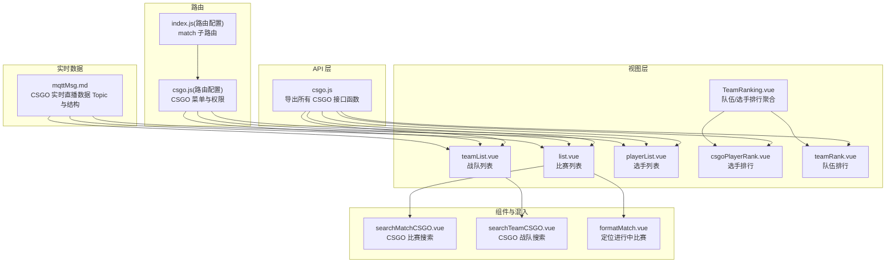
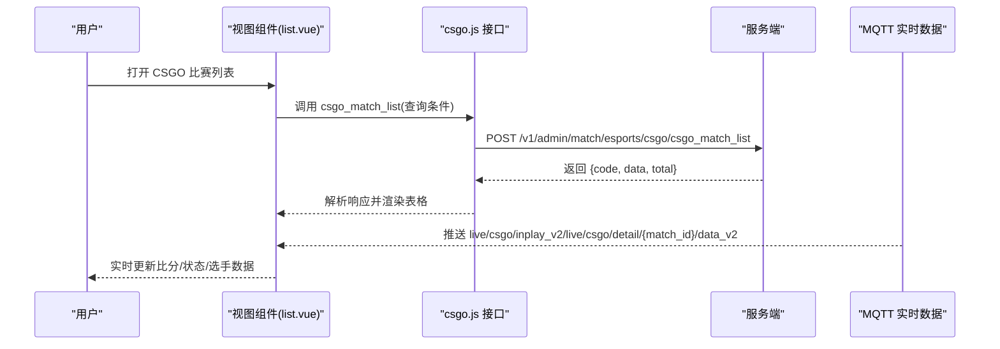
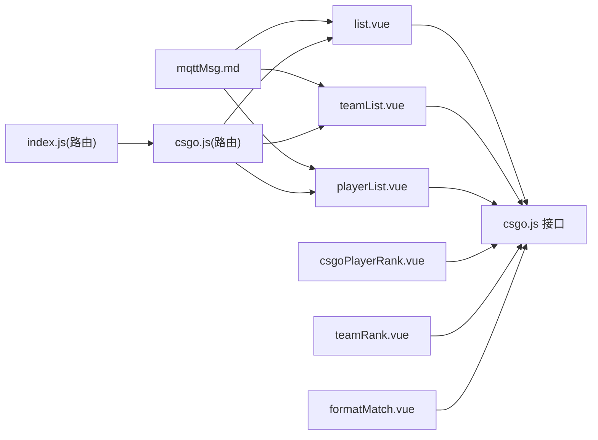

# CSGO API

<cite>
**本文引用的文件**
- [csgo.js](file://src/api/matchapi/game/csgo.js)
- [list.vue](file://src/views/match/csgo/list.vue)
- [teamList.vue](file://src/views/match/csgo/teamList.vue)
- [playerList.vue](file://src/views/match/csgo/playerList.vue)
- [TeamRanking.vue](file://src/views/match/csgo/TeamRanking.vue)
- [csgoPlayerRank.vue](file://src/views/match/components/game/ranking/csgoPlayerRank.vue)
- [teamRank.vue](file://src/views/match/components/game/ranking/teamRank.vue)
- [searchMatchCSGO.vue](file://src/components/leisu/searchResource/searchDependence/searchMatchCSGO.vue)
- [searchTeamCSGO.vue](file://src/components/leisu/searchResource/searchDependence/searchTeamCSGO.vue)
- [formatMatch.vue](file://src/mixins/formatMatch.vue)
- [csgo.js](file://src/router/children/match/children/game/csgo.js)
- [index.js](file://src/router/children/match/index.js)
- [mqttMsg.md](file://public/mqttMsg.md)
</cite>

## 目录
1. [简介](#简介)
2. [项目结构](#项目结构)
3. [核心组件](#核心组件)
4. [架构概览](#架构概览)
5. [详细组件分析](#详细组件分析)
6. [依赖分析](#依赖分析)
7. [性能考虑](#性能考虑)
8. [故障排查指南](#故障排查指南)
9. [结论](#结论)
10. [附录](#附录)

## 简介
本文件为 CSGO 电竞数据模块的完整 API 文档，覆盖比赛、战队、选手、赛事、国家、地图、武器、阶段、直播详情、统计与排行等核心接口，并结合前端视图组件与路由配置，给出请求参数、返回结构、业务含义与典型使用场景。同时对专业术语（如 KAST、ADR、爆头率、经济回合等）进行解释，帮助非技术读者理解数据模型与统计口径。

## 项目结构
CSGO 相关接口集中在 matchapi 游戏模块中，前端视图组件位于 match/csgo 目录，排行榜组件位于 match/components/game/ranking 下，路由配置位于 match 子路由中。

图表来源
- [csgo.js](file://src/api/matchapi/game/csgo.js)
- [list.vue](file://src/views/match/csgo/list.vue)
- [teamList.vue](file://src/views/match/csgo/teamList.vue)
- [playerList.vue](file://src/views/match/csgo/playerList.vue)
- [TeamRanking.vue](file://src/views/match/csgo/TeamRanking.vue)
- [csgoPlayerRank.vue](file://src/views/match/components/game/ranking/csgoPlayerRank.vue)
- [teamRank.vue](file://src/views/match/components/game/ranking/teamRank.vue)
- [searchMatchCSGO.vue](file://src/components/leisu/searchResource/searchDependence/searchMatchCSGO.vue)
- [searchTeamCSGO.vue](file://src/components/leisu/searchResource/searchDependence/searchTeamCSGO.vue)
- [formatMatch.vue](file://src/mixins/formatMatch.vue)
- [csgo.js](file://src/router/children/match/children/game/csgo.js)
- [index.js](file://src/router/children/match/index.js)
- [mqttMsg.md](file://public/mqttMsg.md)

章节来源
- [csgo.js](file://src/api/matchapi/game/csgo.js)
- [list.vue](file://src/views/match/csgo/list.vue)
- [teamList.vue](file://src/views/match/csgo/teamList.vue)
- [playerList.vue](file://src/views/match/csgo/playerList.vue)
- [TeamRanking.vue](file://src/views/match/csgo/TeamRanking.vue)
- [csgoPlayerRank.vue](file://src/views/match/components/game/ranking/csgoPlayerRank.vue)
- [teamRank.vue](file://src/views/match/components/game/ranking/teamRank.vue)
- [searchMatchCSGO.vue](file://src/components/leisu/searchResource/searchDependence/searchMatchCSGO.vue)
- [searchTeamCSGO.vue](file://src/components/leisu/searchResource/searchDependence/searchTeamCSGO.vue)
- [formatMatch.vue](file://src/mixins/formatMatch.vue)
- [csgo.js](file://src/router/children/match/children/game/csgo.js)
- [index.js](file://src/router/children/match/index.js)
- [mqttMsg.md](file://public/mqttMsg.md)

## 核心组件
- API 层：统一导出 CSGO 所有接口函数，便于视图组件按需引入与调用。
- 视图层：提供比赛、战队、选手列表等管理界面，内置分页、搜索、排序、筛选能力。
- 组件与混入：提供搜索依赖组件与“定位进行中比赛”的混入逻辑。
- 路由层：配置 CSGO 菜单项、权限角色与子路由。
- 实时数据：通过 MQTT 主题提供比分页、顶部数据、直播数据等结构化消息。

章节来源
- [csgo.js](file://src/api/matchapi/game/csgo.js)
- [list.vue](file://src/views/match/csgo/list.vue)
- [teamList.vue](file://src/views/match/csgo/teamList.vue)
- [playerList.vue](file://src/views/match/csgo/playerList.vue)
- [TeamRanking.vue](file://src/views/match/csgo/TeamRanking.vue)
- [csgoPlayerRank.vue](file://src/views/match/components/game/ranking/csgoPlayerRank.vue)
- [teamRank.vue](file://src/views/match/components/game/ranking/teamRank.vue)
- [searchMatchCSGO.vue](file://src/components/leisu/searchResource/searchDependence/searchMatchCSGO.vue)
- [searchTeamCSGO.vue](file://src/components/leisu/searchResource/searchDependence/searchTeamCSGO.vue)
- [formatMatch.vue](file://src/mixins/formatMatch.vue)
- [csgo.js](file://src/router/children/match/children/game/csgo.js)
- [index.js](file://src/router/children/match/index.js)
- [mqttMsg.md](file://public/mqttMsg.md)

## 架构概览
CSGO 数据模块采用“接口函数 + 视图组件 + 组件/混入 + 路由 + 实时数据”协同的前端架构。接口函数封装请求方法与端点；视图组件负责展示与交互；组件/混入提供通用能力；路由控制菜单与权限；MQTT 提供实时直播数据。

图表来源
- [list.vue](file://src/views/match/csgo/list.vue)
- [csgo.js](file://src/api/matchapi/game/csgo.js)
- [mqttMsg.md](file://public/mqttMsg.md)

## 详细组件分析

### 比赛列表接口：csgo_match_list
- 请求方式：POST
- 端点：/v1/admin/match/esports/csgo/csgo_match_list
- 使用场景：后台管理 CSGO 比赛列表，支持按时间范围、比赛状态、队伍ID、赛事ID等筛选与分页。
- 典型调用：见 [list.vue](file://src/views/match/csgo/list.vue) 中的 getList 方法。
- 关键参数（依据视图组件构造）：
  - 分页：page、limit
  - 时间范围：match_time（起止时间戳拼接字符串）
  - 排序：orderby_field（如 matchtime_desc、matchid_asc）
  - 搜索：search_field、search_keyword（如 match_id、team_id、competition_id）
- 返回结构（依据视图组件处理）：
  - code=0 表示成功，data 为列表数组，total 为总数。
- 实时联动：通过 MQTT 主题 live/csgo/inplay_v2 与 live/csgo/detail/{match_id}/data_v2 实时更新比分与状态。

章节来源
- [csgo.js](file://src/api/matchapi/game/csgo.js)
- [list.vue](file://src/views/match/csgo/list.vue)
- [searchMatchCSGO.vue](file://src/components/leisu/searchResource/searchDependence/searchMatchCSGO.vue)
- [mqttMsg.md](file://public/mqttMsg.md)

### 战队列表接口：csgo_team_list
- 请求方式：POST
- 端点：/v1/admin/match/esports/csgo/csgo_team_list
- 使用场景：后台管理 CSGO 战队列表，支持按名称、ID、时间筛选与分页。
- 典型调用：见 [teamList.vue](file://src/views/match/csgo/teamList.vue) 中的 getList 方法。
- 关键参数：
  - 分页：page、limit
  - 搜索：search_field、search_keyword（如 name、id、match_time）
- 返回结构：
  - code=0 表示成功，data 为列表数组，total 为总数。
- 常见操作：刷新队伍资料库、更新队伍 Logo、查看队伍荣誉与统计。

章节来源
- [csgo.js](file://src/api/matchapi/game/csgo.js)
- [teamList.vue](file://src/views/match/csgo/teamList.vue)
- [searchTeamCSGO.vue](file://src/components/leisu/searchResource/searchDependence/searchTeamCSGO.vue)

### 选手列表接口：csgo_player_list
- 请求方式：POST
- 端点：/v1/admin/match/esports/csgo/csgo_player_list
- 使用场景：后台管理 CSGO 选手列表，支持按姓名、ID、队伍ID筛选与分页。
- 典型调用：见 [playerList.vue](file://src/views/match/csgo/playerList.vue) 中的 getList 方法。
- 关键参数：
  - 分页：page、limit
  - 搜索：search_field、search_keyword（如 name、id、team_id）
- 返回结构：
  - code=0 表示成功，data 为列表数组，total 为总数。
- 常见操作：查看选手信息、转会列表、统计与排行。

章节来源
- [csgo.js](file://src/api/matchapi/game/csgo.js)
- [playerList.vue](file://src/views/match/csgo/playerList.vue)

### 赛事列表接口：csgo_tournament_list
- 请求方式：POST
- 端点：/v1/admin/match/esports/csgo/csgo_tournament_list
- 使用场景：后台管理 CSGO 赛事列表，支持分页与筛选。
- 常见操作：刷新赛事资料库、更新赛事 Logo、查看赛事队伍与统计。

章节来源
- [csgo.js](file://src/api/matchapi/game/csgo.js)

### 国家列表接口：csgo_country_list
- 请求方式：POST
- 端点：/v1/admin/match/esports/csgo/csgo_country_list
- 使用场景：获取 CSGO 相关国家信息，用于筛选与展示。

章节来源
- [csgo.js](file://src/api/matchapi/game/csgo.js)

### 地图列表接口：csgo_map_list
- 请求方式：POST
- 端点：/v1/admin/match/esports/csgo/csgo_map_list
- 使用场景：获取 CSGO 比赛可用地图列表，用于筛选与统计。

章节来源
- [csgo.js](file://src/api/matchapi/game/csgo.js)

### 武器列表接口：csgo_weapon_list
- 请求方式：POST
- 端点：/v1/admin/match/esports/csgo/csgo_weapon_list
- 使用场景：获取 CSGO 比赛可用武器列表，用于统计与直播详情。

章节来源
- [csgo.js](file://src/api/matchapi/game/csgo.js)

### 比赛阶段列表接口：csgo_stage_list
- 请求方式：POST
- 端点：/v1/admin/match/esports/csgo/csgo_stage_list
- 使用场景：获取 CSGO 比赛阶段定义，用于筛选与统计。

章节来源
- [csgo.js](file://src/api/matchapi/game/csgo.js)

### 定位进行中比赛：csgo_active_match
- 请求方式：POST
- 端点：/v1/admin/match/esports/csgo/csgo_active_match
- 使用场景：快速定位当前进行中的 CSGO 比赛，配合视图组件的“进行中”按钮使用。
- 调用位置：参见 [formatMatch.vue](file://src/mixins/formatMatch.vue) 中的定位逻辑。

章节来源
- [csgo.js](file://src/api/matchapi/game/csgo.js)
- [formatMatch.vue](file://src/mixins/formatMatch.vue)

### 直播详情接口：csgo_match_detail
- 请求方式：POST
- 端点：/v1/admin/match/esports/csgo/csgo_match_detail
- 使用场景：获取某场比赛的直播详情，包含双方阵容、选手数据、经济回合等。
- 实时数据：直播详情 Topic 为 live/csgo/detail/{match_id}/data_v2，字段包含双方队伍、选手统计、武器、头盔、防爆衣、金钱、比分等。

章节来源
- [csgo.js](file://src/api/matchapi/game/csgo.js)
- [mqttMsg.md](file://public/mqttMsg.md)

### 队伍排行榜：csgo_team_rank
- 请求方式：POST
- 端点：/v1/admin/match/esports/csgo/csgo_team_rank
- 使用场景：按地区筛选队伍排名，支持分页加载。
- 视图组件：参见 [teamRank.vue](file://src/views/match/components/game/ranking/teamRank.vue) 与 [TeamRanking.vue](file://src/views/match/csgo/TeamRanking.vue)。

章节来源
- [csgo.js](file://src/api/matchapi/game/csgo.js)
- [teamRank.vue](file://src/views/match/components/game/ranking/teamRank.vue)
- [TeamRanking.vue](file://src/views/match/csgo/TeamRanking.vue)

### 选手排行：csgo_player_rank
- 请求方式：POST
- 端点：/v1/admin/match/esports/csgo/csgo_player_rank
- 使用场景：按时间窗口（全部/近1月/近3月/近6月/近1年）查看选手排行。
- 视图组件：参见 [csgoPlayerRank.vue](file://src/views/match/components/game/ranking/csgoPlayerRank.vue) 与 [TeamRanking.vue](file://src/views/match/csgo/TeamRanking.vue)。

章节来源
- [csgo.js](file://src/api/matchapi/game/csgo.js)
- [csgoPlayerRank.vue](file://src/views/match/components/game/ranking/csgoPlayerRank.vue)
- [TeamRanking.vue](file://src/views/match/csgo/TeamRanking.vue)

### 赛事队伍：csgo_comp_team_list
- 请求方式：POST
- 端点：/v1/admin/match/esports/csgo/csgo_comp_team_list
- 使用场景：获取某个赛事下的参赛队伍列表。

章节来源
- [csgo.js](file://src/api/matchapi/game/csgo.js)

### 赛事统计：csgo_comp_statistics
- 请求方式：POST
- 端点：/v1/admin/match/esports/csgo/csgo_comp_statistics
- 使用场景：获取某个赛事的整体统计信息。

章节来源
- [csgo.js](file://src/api/matchapi/game/csgo.js)

### 队伍统计：csgo_team_statistics
- 请求方式：POST
- 端点：/v1/admin/match/esports/csgo/csgo_team_statistics
- 使用场景：获取某个队伍的统计信息。

章节来源
- [csgo.js](file://src/api/matchapi/game/csgo.js)

### 选手统计：csgo_player_statistics
- 请求方式：POST
- 端点：/v1/admin/match/esports/csgo/csgo_player_statistics
- 使用场景：获取某个选手的统计信息。

章节来源
- [csgo.js](file://src/api/matchapi/game/csgo.js)

### 热门赛事：csgo_hot_tournament_list / 添加/删除/更新权重
- 请求方式：POST
- 端点：
  - /v1/admin/match/esports/csgo/csgo_hot_tournament_list
  - /v1/admin/match/esports/csgo/csgo_add_hot_tournament
  - /v1/admin/match/esports/csgo/csgo_delete_hot_tournament
  - /v1/admin/match/esports/csgo/csgo_update_hot_tournament
- 使用场景：维护首页或专题页的热门赛事列表及其权重。

章节来源
- [csgo.js](file://src/api/matchapi/game/csgo.js)

### 数据修正与评分
- 数据修正：csgo_fix_detail（用于修正某场比赛的数据）
- 评分：csgo_match_rating（GET，通过 match_id 获取评分）

章节来源
- [csgo.js](file://src/api/matchapi/game/csgo.js)

### 评分接口：csgo_match_rating
- 请求方式：GET
- 端点：/v1/admin/match/esports/csgo/match_rating?match_id={match_id}
- 使用场景：获取某场比赛的专家评分与相关统计。

章节来源
- [csgo.js](file://src/api/matchapi/game/csgo.js)

## 依赖分析
- 组件耦合：
  - 视图组件依赖对应接口函数与分页/搜索组件。
  - 排行视图组件依赖 csgo_player_rank 与 team_rank 接口。
  - “定位进行中比赛”依赖 formatMatch 混入与 csgo_active_match。
- 外部依赖：
  - MQTT 主题提供实时直播数据，与比赛详情接口互补。
- 权限与路由：
  - 路由配置声明了 CSGO 相关菜单与权限角色，确保访问控制。

图表来源
- [list.vue](file://src/views/match/csgo/list.vue)
- [teamList.vue](file://src/views/match/csgo/teamList.vue)
- [playerList.vue](file://src/views/match/csgo/playerList.vue)
- [csgoPlayerRank.vue](file://src/views/match/components/game/ranking/csgoPlayerRank.vue)
- [teamRank.vue](file://src/views/match/components/game/ranking/teamRank.vue)
- [formatMatch.vue](file://src/mixins/formatMatch.vue)
- [csgo.js](file://src/api/matchapi/game/csgo.js)
- [csgo.js](file://src/router/children/match/children/game/csgo.js)
- [index.js](file://src/router/children/match/index.js)
- [mqttMsg.md](file://public/mqttMsg.md)

章节来源
- [list.vue](file://src/views/match/csgo/list.vue)
- [teamList.vue](file://src/views/match/csgo/teamList.vue)
- [playerList.vue](file://src/views/match/csgo/playerList.vue)
- [csgoPlayerRank.vue](file://src/views/match/components/game/ranking/csgoPlayerRank.vue)
- [teamRank.vue](file://src/views/match/components/game/ranking/teamRank.vue)
- [formatMatch.vue](file://src/mixins/formatMatch.vue)
- [csgo.js](file://src/api/matchapi/game/csgo.js)
- [csgo.js](file://src/router/children/match/children/game/csgo.js)
- [index.js](file://src/router/children/match/index.js)
- [mqttMsg.md](file://public/mqttMsg.md)

## 性能考虑
- 分页与懒加载：列表组件普遍支持分页与滚动懒加载，减少一次性传输数据量。
- 搜索与筛选：前端构建查询参数并传递给后端，避免无效请求。
- 实时数据：MQTT 主题按需推送，降低轮询成本，提升交互体验。
- 排行榜：按时间窗口切换，避免全量数据重复加载。

## 故障排查指南
- 接口返回异常：
  - 检查请求参数是否正确（分页、时间范围、搜索关键字）。
  - 确认权限角色是否具备相应菜单访问权限。
- 实时数据不更新：
  - 检查 MQTT 连接状态与主题订阅。
  - 确认比赛 ID 与 Topic 是否匹配。
- 定位进行中比赛失败：
  - 确认 csgo_active_match 接口返回的 match_id 是否存在。
  - 检查分页索引计算逻辑。

章节来源
- [list.vue](file://src/views/match/csgo/list.vue)
- [teamList.vue](file://src/views/match/csgo/teamList.vue)
- [playerList.vue](file://src/views/match/csgo/playerList.vue)
- [csgoPlayerRank.vue](file://src/views/match/components/game/ranking/csgoPlayerRank.vue)
- [teamRank.vue](file://src/views/match/components/game/ranking/teamRank.vue)
- [formatMatch.vue](file://src/mixins/formatMatch.vue)
- [mqttMsg.md](file://public/mqttMsg.md)

## 结论
CSGO 电竞数据模块通过统一的接口函数与丰富的视图组件，实现了从比赛、战队、选手到赛事、国家、地图、武器、阶段的全链路管理，并结合实时直播数据与排行榜功能，满足运营与数据分析需求。建议在实际使用中关注参数规范、权限配置与实时数据订阅，以获得最佳体验。

## 附录

### CSGO 专业术语解释
- KAST：每回合参与（击杀/助攻/生存/抢包）比率，衡量选手对回合胜负的综合影响。
- ADR（Average Damage Round）：平均每回合伤害，反映选手输出能力。
- 爆头率：爆头数占总击杀的比例，体现选手精准度。
- 经济回合：指在回合内通过击杀、 bomb defused、defuse kit 等事件获得的经济收益，常用于分析经济节奏。

### 实时数据 Topic 与字段说明
- 比赛页数据更新（live/csgo/inplay_v2）：包含比赛 ID、双方比分、阵营、统计位、当前局、计时器、单局状态等。
- 顶部数据更新（live/csgo/detail/{match_id}/top_v2）：与页数据结构一致，用于顶部展示。
- 直播数据更新（live/csgo/detail/{match_id}/data_v2）：包含双方队伍信息、选手统计、武器、头盔、防爆衣、金钱、比分、地图等。

章节来源
- [mqttMsg.md](file://public/mqttMsg.md)