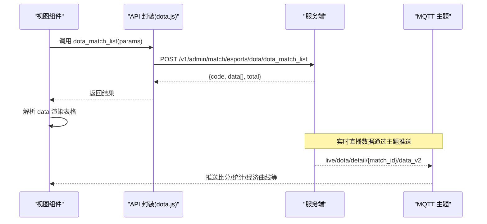
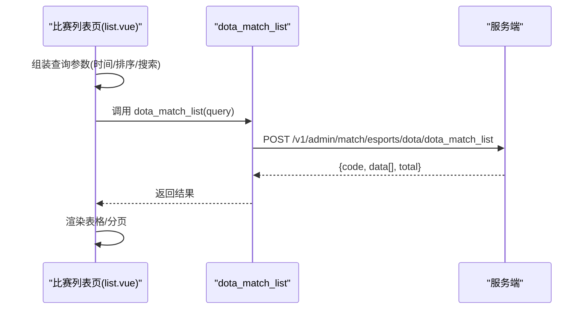
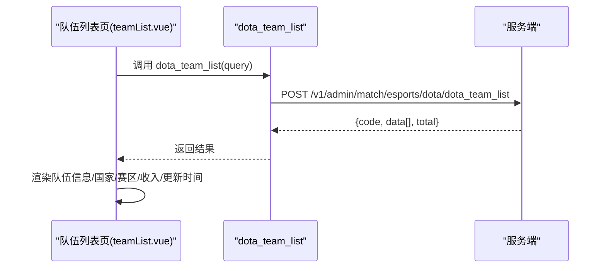
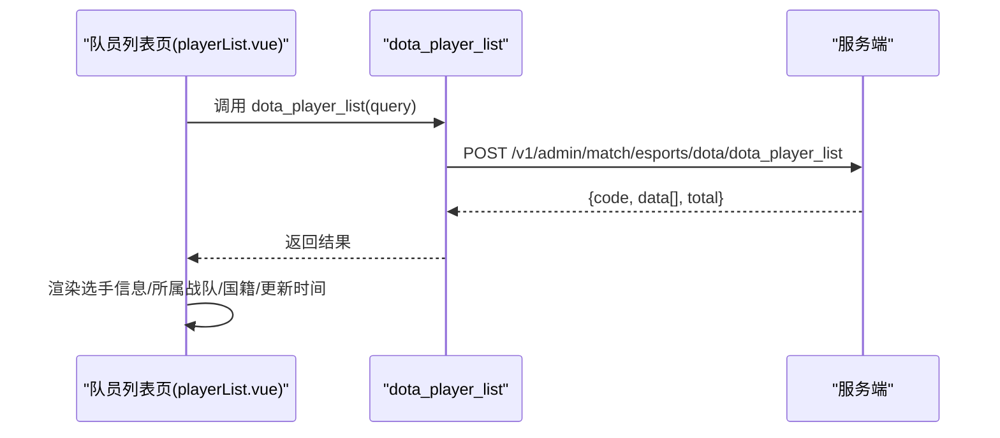
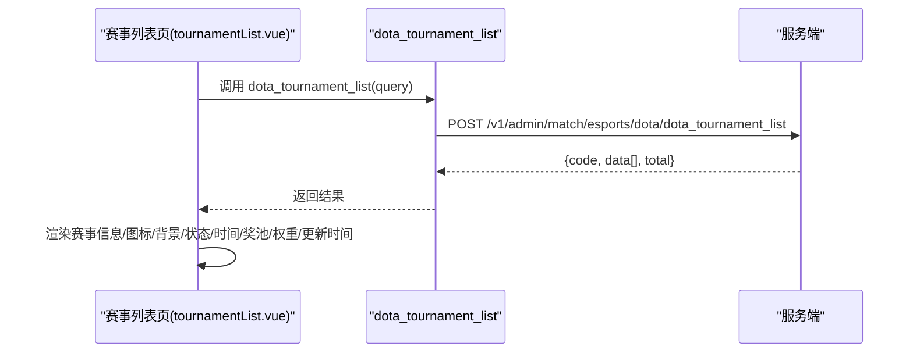
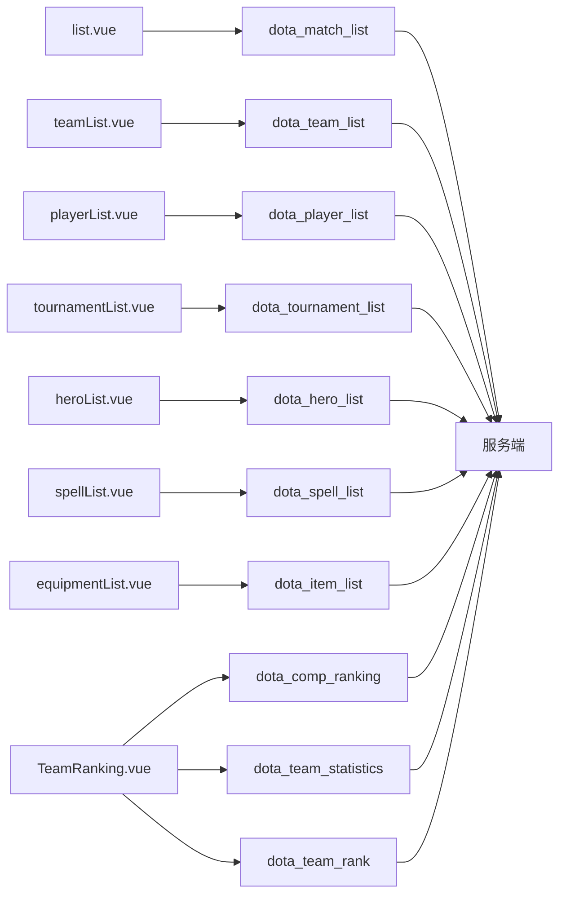

# DOTA2 API

<cite>
**本文引用的文件**
- [dota.js](file://src/api/matchapi/game/dota.js)
- [dota.js](file://src/router/children/match/children/game/dota.js)
- [list.vue](file://src/views/match/dota/list.vue)
- [teamList.vue](file://src/views/match/dota/teamList.vue)
- [playerList.vue](file://src/views/match/dota/playerList.vue)
- [tournamentList.vue](file://src/views/match/dota/tournamentList.vue)
- [heroList.vue](file://src/views/match/dota/heroList.vue)
- [spellList.vue](file://src/views/match/dota/spellList.vue)
- [equipmentList.vue](file://src/views/match/dota/equipmentList.vue)
- [TeamRanking.vue](file://src/views/match/dota/TeamRanking.vue)
- [matchRatingDialog.vue](file://src/components/matchRating/matchRatingDialog.vue)
- [mqttMsg.md](file://public/mqttMsg.md)
</cite>

## 目录
1. [简介](#简介)
2. [项目结构](#项目结构)
3. [核心组件](#核心组件)
4. [架构总览](#架构总览)
5. [详细组件分析](#详细组件分析)
6. [依赖分析](#依赖分析)
7. [性能考虑](#性能考虑)
8. [故障排查指南](#故障排查指南)
9. [结论](#结论)
10. [附录](#附录)

## 简介
本文件为 DOTA2 电竞数据模块的完整 API 文档，覆盖比赛、战队、选手、赛事、英雄、天赋、技能、装备、国家、直播详情、积分榜、统计、转会、热门赛事、数据修正与评分等接口。文档同时解释 DOTA2 专业术语（如 GPM、XPM、K/D/A、补刀等），并梳理数据模型与字段关系，帮助开发者快速集成与扩展。

## 项目结构
DOTA2 相关接口集中在 matchapi 游戏模块中，前端路由统一挂载在“刀塔(DOTA2)”菜单下，各列表页通过对应 API 获取数据并渲染表格。

```mermaid
graph TB
subgraph "前端路由"
R1["/match/DOTA/list<br/>比赛列表"]
R2["/match/DOTA/teamList<br/>队伍列表"]
R3["/match/DOTA/playerList<br/>队员列表"]
R4["/match/DOTA/tournamentList<br/>赛事列表"]
R5["/match/DOTA/heroList<br/>英雄列表"]
R6["/match/DOTA/runeList<br/>英雄天赋列表"]
R7["/match/DOTA/spellList<br/>英雄技能列表"]
R8["/match/DOTA/equipmentList<br/>装备列表"]
R9["/match/DOTA/countryList<br/>国家列表"]
R10["/match/DOTA/TeamRanking<br/>队伍排行"]
end
subgraph "API 层"
A1["dota_match_list"]
A2["dota_team_list"]
A3["dota_player_list"]
A4["dota_tournament_list"]
A5["dota_hero_list"]
A6["dota_rune_list"]
A7["dota_spell_list"]
A8["dota_item_list"]
A9["dota_country_list"]
A10["dota_match_detail"]
A11["dota_comp_ranking"]
A12["dota_team_statistics"]
A13["dota_hero_statistics"]
A14["dota_comp_statistics"]
A15["dota_transfer_list"]
A16["dota_player_statistics"]
A17["dota_comp_team_list"]
A18["dota_team_rank"]
A19["dota_hot_tournament_list"]
A20["dota_add_hot_tournament"]
A21["dota_delete_hot_tournament"]
A22["dota_update_hot_tournament"]
A23["dota_ask_player_event"]
A24["dota_fix_detail"]
A25["dota_match_rating"]
end
R1 --> A1
R2 --> A2
R3 --> A3
R4 --> A4
R5 --> A5
R6 --> A6
R7 --> A7
R8 --> A8
R9 --> A9
R10 --> A11
R10 --> A12
R10 --> A18
```

图表来源
- [dota.js:1-104](file://src/router/children/match/children/game/dota.js#L1-L104)
- [dota.js:1-290](file://src/api/matchapi/game/dota.js#L1-L290)

章节来源
- [dota.js:1-104](file://src/router/children/match/children/game/dota.js#L1-L104)
- [dota.js:1-290](file://src/api/matchapi/game/dota.js#L1-L290)

## 核心组件
- 接口封装层：集中于 matchapi/game/dota.js，导出全部 DOTA2 相关 API 方法，统一请求路径与方法。
- 视图组件层：各列表页负责查询条件构建、分页、排序与筛选，并调用对应 API 获取数据。
- 路由层：统一挂载在“刀塔(DOTA2)”菜单下，按功能划分子路由，权限控制基于角色标识。

章节来源
- [dota.js:1-290](file://src/api/matchapi/game/dota.js#L1-L290)
- [list.vue:116-298](file://src/views/match/dota/list.vue#L116-L298)
- [teamList.vue:133-237](file://src/views/match/dota/teamList.vue#L133-L237)
- [playerList.vue:146-235](file://src/views/match/dota/playerList.vue#L146-L235)
- [tournamentList.vue:161-290](file://src/views/match/dota/tournamentList.vue#L161-L290)
- [heroList.vue:96-161](file://src/views/match/dota/heroList.vue#L96-L161)
- [spellList.vue:105-170](file://src/views/match/dota/spellList.vue#L105-L170)
- [equipmentList.vue:85-150](file://src/views/match/dota/equipmentList.vue#L85-L150)
- [TeamRanking.vue:1-42](file://src/views/match/dota/TeamRanking.vue#L1-L42)

## 架构总览
前端通过 API 层发起请求，后端返回标准响应结构（包含 code、data、total 等），视图组件解析并渲染表格数据；直播与评分等实时数据通过 MQTT 主题订阅。

图表来源
- [dota.js:1-290](file://src/api/matchapi/game/dota.js#L1-L290)
- [mqttMsg.md:2394-2466](file://public/mqttMsg.md#L2394-L2466)

## 详细组件分析

### 比赛列表接口：dota_match_list
- 请求方式：POST
- 请求地址：/v1/admin/match/esports/dota/dota_match_list
- 使用场景：展示 DOTA2 比赛列表，支持按时间范围、状态、队伍、赛事等筛选，支持排序与分页。
- 响应结构：包含 code、data（列表）、total（总数）。
- 关键字段（来自视图组件构建的查询参数）：
  - 分页：page、limit
  - 时间：match_time（起止时间戳拼接字符串）
  - 排序：orderby_field（如 matchtime_desc、matchtime_asc、matchid_desc、matchid_asc）
  - 搜索：search_field、search_keyword（支持 match_id、team_id、competition_id、match_status）

图表来源
- [list.vue:116-298](file://src/views/match/dota/list.vue#L116-L298)
- [dota.js:4-11](file://src/api/matchapi/game/dota.js#L4-L11)

章节来源
- [list.vue:116-298](file://src/views/match/dota/list.vue#L116-L298)
- [dota.js:4-11](file://src/api/matchapi/game/dota.js#L4-L11)

### 队伍列表接口：dota_team_list
- 请求方式：POST
- 请求地址：/v1/admin/match/esports/dota/dota_team_list
- 使用场景：展示队伍列表，支持按名称、ID、时间等筛选；可刷新队伍资料库。
- 响应结构：包含 code、data（列表）、total。
- 关键字段：
  - 分页：page、limit
  - 搜索：search_field、search_keyword（支持 name、id、match_time）

图表来源
- [teamList.vue:133-237](file://src/views/match/dota/teamList.vue#L133-L237)
- [dota.js:12-19](file://src/api/matchapi/game/dota.js#L12-L19)

章节来源
- [teamList.vue:133-237](file://src/views/match/dota/teamList.vue#L133-L237)
- [dota.js:12-19](file://src/api/matchapi/game/dota.js#L12-L19)

### 选手列表接口：dota_player_list
- 请求方式：POST
- 请求地址：/v1/admin/match/esports/dota/dota_player_list
- 使用场景：展示选手列表，支持按姓名、ID、队伍 ID 筛选；可跳转选手信息。
- 响应结构：包含 code、data（列表）、total。
- 关键字段：
  - 分页：page、limit
  - 搜索：search_field、search_keyword（支持 name、id、team_id）

图表来源
- [playerList.vue:146-235](file://src/views/match/dota/playerList.vue#L146-L235)
- [dota.js:20-27](file://src/api/matchapi/game/dota.js#L20-L27)

章节来源
- [playerList.vue:146-235](file://src/views/match/dota/playerList.vue#L146-L235)
- [dota.js:20-27](file://src/api/matchapi/game/dota.js#L20-L27)

### 赛事列表接口：dota_tournament_list
- 请求方式：POST
- 请求地址：/v1/admin/match/esports/dota/dota_tournament_list
- 使用场景：展示赛事列表，支持按 ID、名称、状态、类型、时间等筛选；可刷新赛事资料库、设置热门权重。
- 响应结构：包含 code、data（列表）、total。
- 关键字段：
  - 分页：page、limit
  - 搜索：search_field、search_keyword（支持 id、name、status_id、tier、start_time）

图表来源
- [tournamentList.vue:161-290](file://src/views/match/dota/tournamentList.vue#L161-L290)
- [dota.js:28-35](file://src/api/matchapi/game/dota.js#L28-L35)

章节来源
- [tournamentList.vue:161-290](file://src/views/match/dota/tournamentList.vue#L161-L290)
- [dota.js:28-35](file://src/api/matchapi/game/dota.js#L28-L35)

### 英雄列表接口：dota_hero_list
- 请求方式：POST
- 请求地址：/v1/admin/match/esports/dota/dota_hero_list
- 使用场景：展示英雄列表，支持按 ID、名称筛选。
- 响应结构：包含 code、data（列表）、total。
- 关键字段：
  - 分页：page、limit
  - 搜索：search_field、search_keyword（支持 id、name）

章节来源
- [heroList.vue:96-161](file://src/views/match/dota/heroList.vue#L96-L161)
- [dota.js:36-43](file://src/api/matchapi/game/dota.js#L36-L43)

### 符文列表接口：dota_rune_list
- 请求方式：POST
- 请求地址：/v1/admin/match/esports/dota/dota_rune_list
- 使用场景：展示英雄天赋列表。
- 响应结构：包含 code、data（列表）、total。
- 关键字段：
  - 分页：page、limit
  - 搜索：search_field、search_keyword（支持 id、name）

章节来源
- [dota.js:44-51](file://src/api/matchapi/game/dota.js#L44-L51)

### 技能列表接口：dota_spell_list
- 请求方式：POST
- 请求地址：/v1/admin/match/esports/dota/dota_spell_list
- 使用场景：展示英雄技能列表，支持按 ID、名称筛选。
- 响应结构：包含 code、data（列表）、total。
- 关键字段：
  - 分页：page、limit
  - 搜索：search_field、search_keyword（支持 id、name）

章节来源
- [spellList.vue:105-170](file://src/views/match/dota/spellList.vue#L105-L170)
- [dota.js:52-60](file://src/api/matchapi/game/dota.js#L52-L60)

### 装备列表接口：dota_item_list
- 请求方式：POST
- 请求地址：/v1/admin/match/esports/dota/dota_item_list
- 使用场景：展示装备列表，支持按 ID、名称筛选。
- 响应结构：包含 code、data（列表）、total。
- 关键字段：
  - 分页：page、limit
  - 搜索：search_field、search_keyword（支持 id、name）

章节来源
- [equipmentList.vue:85-150](file://src/views/match/dota/equipmentList.vue#L85-L150)
- [dota.js:60-67](file://src/api/matchapi/game/dota.js#L60-L67)

### 国家列表接口：dota_country_list
- 请求方式：POST
- 请求地址：/v1/admin/match/esports/dota/dota_country_list
- 使用场景：展示国家列表。
- 响应结构：包含 code、data（列表）、total。
- 关键字段：
  - 分页：page、limit
  - 搜索：search_field、search_keyword（支持 id、name）

章节来源
- [dota.js:68-75](file://src/api/matchapi/game/dota.js#L68-L75)

### 进行中定位接口：dota_active_match
- 请求方式：POST
- 请求地址：/v1/admin/match/esports/dota/dota_active_match
- 使用场景：定位正在进行的 DOTA2 比赛。

章节来源
- [dota.js:76-83](file://src/api/matchapi/game/dota.js#L76-L83)

### 资料维护接口
- 更新队伍 logo：dota_update_team
- 更新赛事 logo：dota_update_tournament
- 重置队伍：dota_reset_team
- 重置赛事：dota_reset_tournament
- 刷新赛事资料库：dota_refresh_tournament
- 刷新队伍资料库：dota_refresh_team

章节来源
- [dota.js:84-134](file://src/api/matchapi/game/dota.js#L84-L134)

### 直播详情接口：dota_match_detail
- 请求方式：POST
- 请求地址：/v1/admin/match/esports/dota/dota_match_detail
- 使用场景：获取比赛直播详情（比分、统计、经济曲线、BP 状态等）。
- 关键字段：match_id（来自视图组件传入）。

章节来源
- [dota.js:135-142](file://src/api/matchapi/game/dota.js#L135-L142)

### 积分榜与统计接口
- 积分榜：dota_comp_ranking
- 最佳队伍队员：dota_comp_best_rating
- 队伍荣誉：dota_team_honor
- 队伍统计：dota_team_statistics
- 英雄统计：dota_hero_statistics
- 赛事统计：dota_comp_statistics
- 选手统计：dota_player_statistics
- 赛事队伍：dota_comp_team_list
- 队伍 TI 排行榜：dota_team_rank_ti
- 队伍排行：dota_team_rank

章节来源
- [dota.js:144-232](file://src/api/matchapi/game/dota.js#L144-L232)

### 热门赛事管理接口
- 热门赛事列表：dota_hot_tournament_list
- 添加热门赛事：dota_add_hot_tournament
- 删除热门赛事：dota_delete_hot_tournament
- 修改热门赛事权重：dota_update_hot_tournament

章节来源
- [dota.js:233-264](file://src/api/matchapi/game/dota.js#L233-L264)

### 选手技术统计跳转接口：dota_ask_player_event
- 请求方式：POST
- 请求地址：/v1/admin/match/esports/dota/dota_player_tournament_statistic
- 使用场景：跳转选手技术统计页面。

章节来源
- [dota.js:265-272](file://src/api/matchapi/game/dota.js#L265-L272)

### 数据修正接口：dota_fix_detail
- 请求方式：POST
- 请求地址：/v1/admin/match/esports/dota/dota_fix_detail
- 使用场景：对比赛数据进行修正。

章节来源
- [dota.js:273-280](file://src/api/matchapi/game/dota.js#L273-L280)

### 评分接口：dota_match_rating
- 请求方式：GET
- 请求地址：/v1/admin/match/esports/dota/match_rating?match_id=...
- 使用场景：获取比赛评分数据，用于评分弹窗展示。

章节来源
- [dota.js:281-288](file://src/api/matchapi/game/dota.js#L281-L288)
- [matchRatingDialog.vue:918-934](file://src/components/matchRating/matchRatingDialog.vue#L918-L934)

## 依赖分析
- 视图组件依赖 API 封装：各列表页通过 import 引入对应 API 方法并调用。
- 权限控制：路由 meta 中声明角色标识，用于按钮级权限控制。
- 实时数据：直播详情通过 MQTT 主题推送，与静态列表接口互补。

图表来源
- [list.vue:116-298](file://src/views/match/dota/list.vue#L116-L298)
- [teamList.vue:133-237](file://src/views/match/dota/teamList.vue#L133-L237)
- [playerList.vue:146-235](file://src/views/match/dota/playerList.vue#L146-L235)
- [tournamentList.vue:161-290](file://src/views/match/dota/tournamentList.vue#L161-L290)
- [heroList.vue:96-161](file://src/views/match/dota/heroList.vue#L96-L161)
- [spellList.vue:105-170](file://src/views/match/dota/spellList.vue#L105-L170)
- [equipmentList.vue:85-150](file://src/views/match/dota/equipmentList.vue#L85-L150)
- [TeamRanking.vue:1-42](file://src/views/match/dota/TeamRanking.vue#L1-L42)
- [dota.js:1-290](file://src/api/matchapi/game/dota.js#L1-L290)

## 性能考虑
- 分页与筛选：建议合理设置 page/limit，避免一次性加载过多数据。
- 查询参数：时间范围尽量精确，减少全量扫描。
- 缓存策略：对不频繁变动的数据（如英雄、技能、装备、国家）可在前端缓存，降低请求频次。
- 实时数据：直播详情通过 MQTT 推送，避免轮询带来的压力。

## 故障排查指南
- 接口返回非 0 码：检查请求参数与权限，确认角色标识是否具备访问权限。
- 列表为空：确认搜索条件是否过严，尝试重置查询或放宽时间范围。
- 刷新资料库失败：确认网络连通性与服务端状态，重试或联系运维。
- 评分接口异常：确认 match_id 是否有效，服务端是否支持该比赛的评分数据。

章节来源
- [dota.js:1-290](file://src/api/matchapi/game/dota.js#L1-L290)
- [list.vue:190-208](file://src/views/match/dota/list.vue#L190-L208)
- [teamList.vue:170-186](file://src/views/match/dota/teamList.vue#L170-L186)
- [tournamentList.vue:220-239](file://src/views/match/dota/tournamentList.vue#L220-L239)

## 结论
本模块提供了 DOTA2 电竞数据的全链路接口能力，涵盖基础列表、直播详情、统计排行、热门赛事与数据修正等场景。结合视图组件与权限控制，可快速搭建 DOTA2 数据管理后台。建议在生产环境中配合缓存与合理的分页策略，确保良好的用户体验与系统性能。

## 附录

### DOTA2 专业术语解释
- GPM（Gold Per Minute）：每分钟经济（金币）。
- XPM（Experience Per Minute）：每分钟经验。
- K/D/A：击杀/死亡/助攻。
- 补刀：正补（己方线上补刀）与反补（敌方线上补刀）。
- BP（Ban/Pick）：禁选阶段。
- 肉山：Roshan，击杀获得强力增益。

章节来源
- [mqttMsg.md:2394-2466](file://public/mqttMsg.md#L2394-L2466)
- [matchRatingDialog.vue:570-591](file://src/components/matchRating/matchRatingDialog.vue#L570-L591)

### 数据模型与字段关系（概览）
- 比赛（match）：包含比赛时间、对阵、赛制、状态、更新时间等。
- 队伍（team）：包含队伍 ID、名称、简称、国家、赛区、收入、更新时间等。
- 选手（player）：包含选手 ID、位置、服役状态、所属队伍、国籍、更新时间等。
- 赛事（tournament）：包含赛事 ID、名称、图标、背景、状态、时间、奖池、权重、更新时间等。
- 英雄（hero）、技能（spell）、天赋（rune）、装备（item）、国家（country）：基础字典类数据，供比赛详情与统计使用。
- 直播详情（match_detail）：包含比分、双方阵容、统计、经济/经验曲线、BP 状态、肉山刷新等。

章节来源
- [list.vue:74-110](file://src/views/match/dota/list.vue#L74-L110)
- [teamList.vue:36-126](file://src/views/match/dota/teamList.vue#L36-L126)
- [playerList.vue:58-140](file://src/views/match/dota/playerList.vue#L58-L140)
- [tournamentList.vue:48-154](file://src/views/match/dota/tournamentList.vue#L48-L154)
- [heroList.vue:33-92](file://src/views/match/dota/heroList.vue#L33-L92)
- [spellList.vue:33-101](file://src/views/match/dota/spellList.vue#L33-L101)
- [equipmentList.vue:33-82](file://src/views/match/dota/equipmentList.vue#L33-L82)
- [mqttMsg.md:2394-2466](file://public/mqttMsg.md#L2394-L2466)