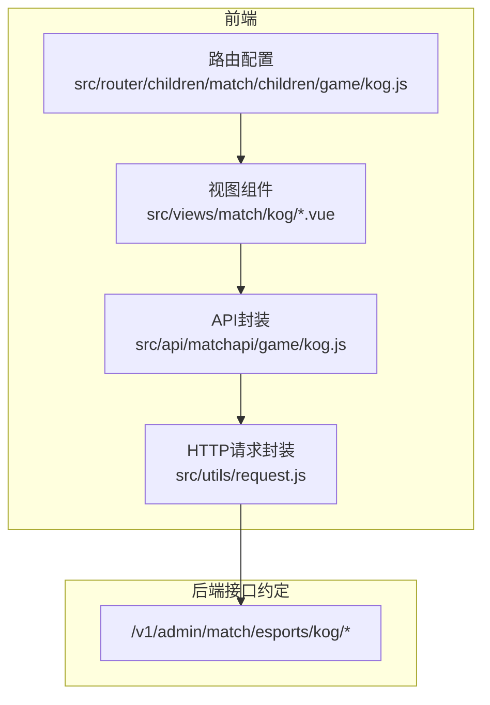
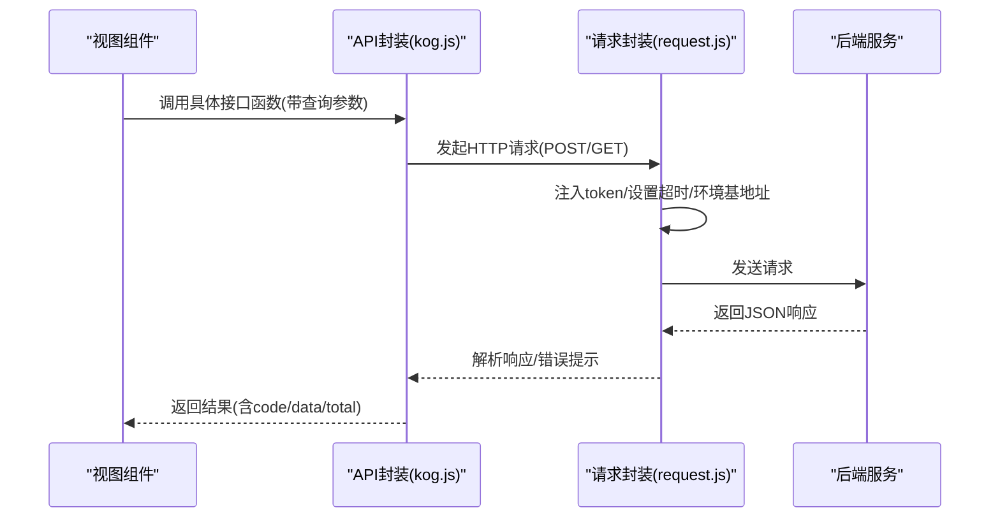
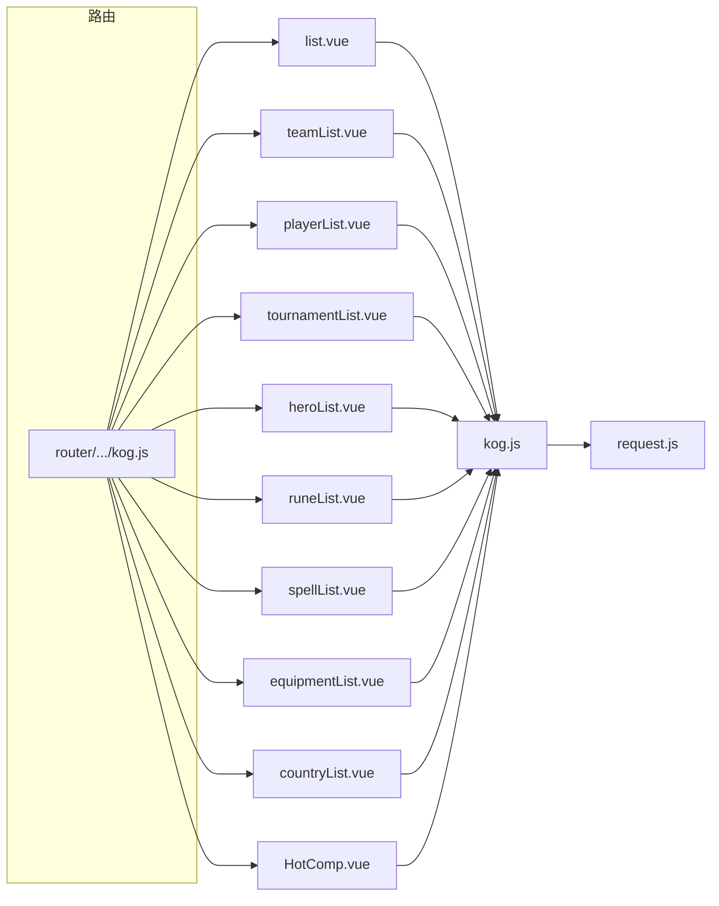
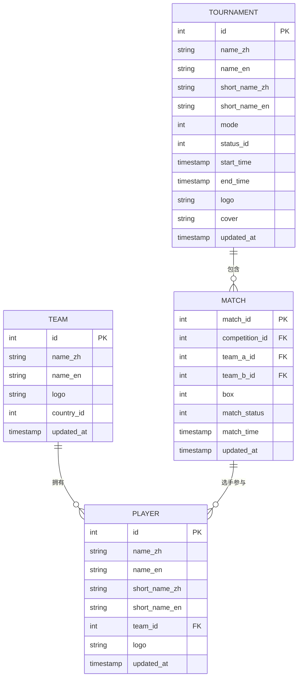

# 王者荣耀API

<cite>
**本文引用的文件**   
- [kog.js](file://src/api/matchapi/game/kog.js)
- [kog.js](file://src/router/children/match/children/game/kog.js)
- [request.js](file://src/utils/request.js)
- [list.vue](file://src/views/match/kog/list.vue)
- [teamList.vue](file://src/views/match/kog/teamList.vue)
- [playerList.vue](file://src/views/match/kog/playerList.vue)
- [tournamentList.vue](file://src/views/match/kog/tournamentList.vue)
- [heroList.vue](file://src/views/match/kog/heroList.vue)
- [runeList.vue](file://src/views/match/kog/runeList.vue)
- [spellList.vue](file://src/views/match/kog/spellList.vue)
- [equipmentList.vue](file://src/views/match/kog/equipmentList.vue)
- [countryList.vue](file://src/views/match/kog/countryList.vue)
- [HotComp.vue](file://src/views/match/kog/HotComp.vue)
</cite>

## 目录
1. [简介](#简介)
2. [项目结构](#项目结构)
3. [核心组件](#核心组件)
4. [架构总览](#架构总览)
5. [详细组件分析](#详细组件分析)
6. [依赖分析](#依赖分析)
7. [性能考虑](#性能考虑)
8. [故障排查指南](#故障排查指南)
9. [结论](#结论)
10. [附录](#附录)

## 简介
本文件为“王者荣耀电竞数据模块”的详细API文档，覆盖与KOG相关的核心接口，包括：
- 比赛列表：kog_match_list
- 战队列表：kog_team_list
- 选手列表：kog_player_list
- 赛事列表：kog_tournament_list
- 英雄列表：kog_hero_list
- 天赋列表：kog_rune_list
- 召唤师技能列表：kog_spell_list
- 装备列表：kog_equipment_list
- 国家列表：kog_country_list
- 进行中比赛定位：kog_active_match
- 队伍/赛事资料更新与重置：kog_update_team、kog_update_tournament、kog_reset_team、kog_reset_tournament
- 资料库刷新：kog_refresh_tournament、kog_refresh_team
- 积分榜：kog_comp_ranking
- 比赛直播详情：kog_match_detail
- 热门赛事管理：kog_hot_tournament_list、kog_add_hot_tournament、kog_delete_hot_tournament、kog_update_hot_tournament
- 数据修正：kog_fix_detail
- 比赛评分查询：kog_match_rating

同时，文档提供各接口的请求参数、返回结构、业务含义、典型使用场景，并对专业术语（如KDA、伤害输出、经济、参团率等）进行解释，帮助读者快速理解并正确使用。

## 项目结构
该模块采用“按游戏分类”的API组织方式，KOG相关接口集中在 matchapi/game/kog.js 中；前端页面组件位于 views/match/kog 下，分别对应不同数据维度的列表页与管理页；路由在 router/children/match/children/game/kog.js 中统一注册。

图表来源
- [kog.js:1-199](file://src/api/matchapi/game/kog.js#L1-L199)
- [kog.js:1-97](file://src/router/children/match/children/game/kog.js#L1-L97)
- [request.js:1-130](file://src/utils/request.js#L1-L130)

章节来源
- [kog.js:1-199](file://src/api/matchapi/game/kog.js#L1-L199)
- [kog.js:1-97](file://src/router/children/match/children/game/kog.js#L1-L97)
- [request.js:1-130](file://src/utils/request.js#L1-L130)

## 核心组件
- API封装层：集中导出所有KOG相关接口函数，统一请求路径与方法。
- 视图组件层：每个列表页负责构建查询条件、调用对应API、渲染表格与分页。
- 路由层：为各页面分配权限与菜单入口。
- 请求封装层：统一封装axios实例、环境变量切换、鉴权头注入、错误提示与响应拦截。

章节来源
- [kog.js:1-199](file://src/api/matchapi/game/kog.js#L1-L199)
- [list.vue:127-308](file://src/views/match/kog/list.vue#L127-L308)
- [teamList.vue:93-191](file://src/views/match/kog/teamList.vue#L93-L191)
- [playerList.vue:117-203](file://src/views/match/kog/playerList.vue#L117-L203)
- [tournamentList.vue:133-247](file://src/views/match/kog/tournamentList.vue#L133-L247)
- [heroList.vue:106-171](file://src/views/match/kog/heroList.vue#L106-L171)
- [runeList.vue:80-145](file://src/views/match/kog/runeList.vue#L80-L145)
- [spellList.vue:85-150](file://src/views/match/kog/spellList.vue#L85-L150)
- [equipmentList.vue:86-151](file://src/views/match/kog/equipmentList.vue#L86-L151)
- [countryList.vue:96-162](file://src/views/match/kog/countryList.vue#L96-L162)
- [HotComp.vue:73-190](file://src/views/match/kog/HotComp.vue#L73-L190)
- [request.js:1-130](file://src/utils/request.js#L1-L130)

## 架构总览
KOG数据模块遵循“视图组件 -> API封装 -> 请求封装 -> 后端接口”的调用链路。请求封装根据运行环境自动选择基础URL，并在请求头注入token，统一处理响应状态码与错误消息。

图表来源
- [kog.js:1-199](file://src/api/matchapi/game/kog.js#L1-L199)
- [request.js:1-130](file://src/utils/request.js#L1-L130)

章节来源
- [kog.js:1-199](file://src/api/matchapi/game/kog.js#L1-L199)
- [request.js:1-130](file://src/utils/request.js#L1-L130)

## 详细组件分析

### 接口总览与调用规范
- 统一请求方式：除评分查询为GET外，其余均为POST。
- 统一鉴权：请求头自动附加token。
- 统一响应：返回包含code、msg、data、total等字段的对象。
- 分页：多数接口支持page、limit分页参数，返回total表示总数。

章节来源
- [kog.js:1-199](file://src/api/matchapi/game/kog.js#L1-L199)
- [request.js:1-130](file://src/utils/request.js#L1-L130)

### 比赛列表 kog_match_list
- 功能：获取KOG比赛列表，支持按时间范围、状态、赛事或队伍ID等条件过滤。
- 典型使用场景：后台管理端查看某日/某赛事/某战队的比赛汇总，支持报表与图表联动。
- 请求参数（示例字段）
  - match_time: 时间范围字符串（秒级时间戳拼接）
  - search_field: 搜索字段（如match_id、team_id、competition_id）
  - search_keyword: 关键词
  - orderby_field: 排序规则（如matchtime_desc）
  - page/limit: 分页
- 返回结构
  - code: 状态码
  - msg: 描述
  - data: 比赛记录数组
  - total: 总数
- 前端调用参考
  - 页面：list.vue
  - 关键逻辑：构建查询对象、调用kog_match_list、处理分页与排序

章节来源
- [kog.js:7-13](file://src/api/matchapi/game/kog.js#L7-L13)
- [list.vue:202-278](file://src/views/match/kog/list.vue#L202-L278)

### 战队列表 kog_team_list
- 功能：获取KOG战队列表，支持按名称、ID、时间等条件过滤。
- 使用场景：管理战队信息、关联赛事、刷新队伍资料。
- 请求参数
  - search_field/search_keyword: 搜索条件
  - page/limit: 分页
- 返回结构
  - code/msg/data/total
- 前端调用参考
  - 页面：teamList.vue
  - 关键逻辑：调用kog_team_list、刷新按钮触发kog_refresh_team

章节来源
- [kog.js:14-21](file://src/api/matchapi/game/kog.js#L14-L21)
- [teamList.vue:145-177](file://src/views/match/kog/teamList.vue#L145-L177)

### 选手列表 kog_player_list
- 功能：获取KOG选手列表，支持按姓名、ID、队伍ID过滤。
- 使用场景：选手档案管理、统计分析、筛选特定选手。
- 请求参数
  - search_field/search_keyword: 搜索条件
  - page/limit: 分页
- 返回结构
  - code/msg/data/total
- 前端调用参考
  - 页面：playerList.vue
  - 关键逻辑：调用kog_player_list、点击队伍名跳转到队伍筛选

章节来源
- [kog.js:22-29](file://src/api/matchapi/game/kog.js#L22-L29)
- [playerList.vue:145-178](file://src/views/match/kog/playerList.vue#L145-L178)

### 赛事列表 kog_tournament_list
- 功能：获取KOG赛事列表，支持按状态、类型、时间等过滤。
- 使用场景：赛事管理、热门赛事维护、刷新赛事资料。
- 请求参数
  - search_field/search_keyword: 搜索条件
  - page/limit: 分页
- 返回结构
  - code/msg/data/total
- 前端调用参考
  - 页面：tournamentList.vue
  - 关键逻辑：调用kog_tournament_list、刷新按钮触发kog_refresh_tournament

章节来源
- [kog.js:30-37](file://src/api/matchapi/game/kog.js#L30-L37)
- [tournamentList.vue:200-232](file://src/views/match/kog/tournamentList.vue#L200-L232)

### 英雄列表 kog_hero_list
- 功能：获取KOG英雄列表，支持按ID/名称过滤。
- 使用场景：英雄管理、统计分析、筛选英雄数据。
- 请求参数
  - search_field/search_keyword: 搜索条件
  - page/limit: 分页
- 返回结构
  - code/msg/data/total
- 前端调用参考
  - 页面：heroList.vue
  - 关键逻辑：调用kog_hero_list

章节来源
- [kog.js:38-45](file://src/api/matchapi/game/kog.js#L38-L45)
- [heroList.vue:134-167](file://src/views/match/kog/heroList.vue#L134-L167)

### 天赋列表 kog_rune_list
- 功能：获取KOG天赋列表，支持按ID/名称过滤。
- 使用场景：天赋管理、统计分析。
- 请求参数
  - search_field/search_keyword: 搜索条件
  - page/limit: 分页
- 返回结构
  - code/msg/data/total
- 前端调用参考
  - 页面：runeList.vue
  - 关键逻辑：调用kog_rune_list

章节来源
- [kog.js:46-53](file://src/api/matchapi/game/kog.js#L46-L53)
- [runeList.vue:108-141](file://src/views/match/kog/runeList.vue#L108-L141)

### 召唤师技能列表 kog_spell_list
- 功能：获取KOG召唤师技能列表，支持按ID/名称过滤。
- 使用场景：技能管理、统计分析。
- 请求参数
  - search_field/search_keyword: 搜索条件
  - page/limit: 分页
- 返回结构
  - code/msg/data/total
- 前端调用参考
  - 页面：spellList.vue
  - 关键逻辑：调用kog_spell_list

章节来源
- [kog.js:54-61](file://src/api/matchapi/game/kog.js#L54-L61)
- [spellList.vue:113-146](file://src/views/match/kog/spellList.vue#L113-L146)

### 装备列表 kog_equipment_list
- 功能：获取KOG装备列表，支持按ID/名称过滤。
- 使用场景：装备管理、统计分析。
- 请求参数
  - search_field/search_keyword: 搜索条件
  - page/limit: 分页
- 返回结构
  - code/msg/data/total
- 前端调用参考
  - 页面：equipmentList.vue
  - 关键逻辑：调用kog_equipment_list

章节来源
- [kog.js:62-69](file://src/api/matchapi/game/kog.js#L62-L69)
- [equipmentList.vue:114-147](file://src/views/match/kog/equipmentList.vue#L114-L147)

### 国家列表 kog_country_list
- 功能：获取KOG国家/地区列表，支持按ID/名称过滤。
- 使用场景：队伍归属地管理、国际化展示。
- 请求参数
  - search_field/search_keyword: 搜索条件
  - page/limit: 分页
- 返回结构
  - code/msg/data/total
- 前端调用参考
  - 页面：countryList.vue
  - 关键逻辑：调用kog_country_list

章节来源
- [kog.js:70-77](file://src/api/matchapi/game/kog.js#L70-L77)
- [countryList.vue:124-158](file://src/views/match/kog/countryList.vue#L124-L158)

### 进行中比赛定位 kog_active_match
- 功能：定位当前正在进行的KOG比赛。
- 使用场景：首页/直播页展示进行中比赛。
- 请求参数：通常无需参数或可传入筛选条件。
- 返回结构：code/msg/data/total

章节来源
- [kog.js:79-86](file://src/api/matchapi/game/kog.js#L79-L86)

### 资料更新与重置
- kog_update_team：更新队伍Logo等资料。
- kog_update_tournament：更新赛事Logo等资料。
- kog_reset_team：重置队伍资料。
- kog_reset_tournament：重置赛事资料。
- 使用场景：资料变更、修复错误数据。

章节来源
- [kog.js:87-136](file://src/api/matchapi/game/kog.js#L87-L136)

### 资料库刷新
- kog_refresh_tournament：刷新赛事资料库。
- kog_refresh_team：刷新队伍资料库。
- 使用场景：同步外部数据源，保证数据新鲜度。

章节来源
- [kog.js:121-136](file://src/api/matchapi/game/kog.js#L121-L136)
- [teamList.vue:122-141](file://src/views/match/kog/teamList.vue#L122-L141)
- [tournamentList.vue:177-196](file://src/views/match/kog/tournamentList.vue#L177-L196)

### 积分榜 kog_comp_ranking
- 功能：获取KOG赛事积分榜。
- 使用场景：排行榜展示、统计分析。
- 请求参数：通常携带赛事ID等筛选条件。
- 返回结构：code/msg/data/total

章节来源
- [kog.js:137-144](file://src/api/matchapi/game/kog.js#L137-L144)

### 比赛直播详情 kog_match_detail
- 功能：获取KOG比赛直播详情。
- 使用场景：直播页展示比赛信息与回放链接。
- 请求参数：通常携带match_id。
- 返回结构：code/msg/data

章节来源
- [kog.js:145-152](file://src/api/matchapi/game/kog.js#L145-L152)

### 热门赛事管理
- kog_hot_tournament_list：获取热门赛事列表。
- kog_add_hot_tournament：新增热门赛事。
- kog_delete_hot_tournament：删除热门赛事。
- kog_update_hot_tournament：更新热门赛事权重。
- 使用场景：运营侧维护热门赛事，提升曝光。
- 前端调用参考：HotComp.vue

章节来源
- [kog.js:153-184](file://src/api/matchapi/game/kog.js#L153-L184)
- [HotComp.vue:100-167](file://src/views/match/kog/HotComp.vue#L100-L167)

### 数据修正 kog_fix_detail
- 功能：对KOG比赛数据进行修正。
- 使用场景：数据异常时的修复流程。
- 请求参数：携带修正所需字段。
- 返回结构：code/msg

章节来源
- [kog.js:185-192](file://src/api/matchapi/game/kog.js#L185-L192)

### 比赛评分查询 kog_match_rating
- 功能：获取指定比赛的评分。
- 请求方式：GET，参数通过URL查询字符串传递。
- 请求参数：match_id（比赛ID）
- 返回结构：code/msg/data

章节来源
- [kog.js:193-199](file://src/api/matchapi/game/kog.js#L193-L199)

## 依赖分析
- 视图组件依赖API封装：各页面通过导入对应API函数发起请求。
- API封装依赖请求封装：统一使用request.js提供的axios实例与拦截器。
- 路由依赖视图组件：路由配置为页面分配权限与菜单入口。
- 错误处理：请求封装统一处理HTTP状态码与业务错误码，弹窗提示。

图表来源
- [kog.js:1-199](file://src/api/matchapi/game/kog.js#L1-L199)
- [request.js:1-130](file://src/utils/request.js#L1-L130)
- [kog.js:1-97](file://src/router/children/match/children/game/kog.js#L1-L97)
- [list.vue:127-308](file://src/views/match/kog/list.vue#L127-L308)
- [teamList.vue:93-191](file://src/views/match/kog/teamList.vue#L93-L191)
- [playerList.vue:117-203](file://src/views/match/kog/playerList.vue#L117-L203)
- [tournamentList.vue:133-247](file://src/views/match/kog/tournamentList.vue#L133-L247)
- [heroList.vue:106-171](file://src/views/match/kog/heroList.vue#L106-L171)
- [runeList.vue:80-145](file://src/views/match/kog/runeList.vue#L80-L145)
- [spellList.vue:85-150](file://src/views/match/kog/spellList.vue#L85-L150)
- [equipmentList.vue:86-151](file://src/views/match/kog/equipmentList.vue#L86-L151)
- [countryList.vue:96-162](file://src/views/match/kog/countryList.vue#L96-L162)
- [HotComp.vue:73-190](file://src/views/match/kog/HotComp.vue#L73-L190)

章节来源
- [kog.js:1-199](file://src/api/matchapi/game/kog.js#L1-L199)
- [request.js:1-130](file://src/utils/request.js#L1-L130)
- [kog.js:1-97](file://src/router/children/match/children/game/kog.js#L1-L97)

## 性能考虑
- 分页与排序：建议合理设置page/limit，避免一次性加载过多数据。
- 查询条件：尽量使用精确字段与关键词，减少后端处理压力。
- 缓存策略：前端可对高频查询结果进行轻量缓存，降低重复请求。
- 超时控制：请求封装设置了较长超时时间，网络不佳时建议优化查询条件或分批请求。
- 图片资源：列表页多处使用图片展示，建议使用懒加载与占位图优化首屏体验。

## 故障排查指南
- 401未授权：检查token是否有效或过期，必要时重新登录。
- 403拒绝访问：确认当前账号是否具备相应角色权限。
- 404接口不存在：核对请求URL与后端接口是否一致。
- 500服务器错误：联系后端排查服务异常。
- 业务错误（code非0）：查看返回msg，按提示修正参数或稍后重试。

章节来源
- [request.js:45-127](file://src/utils/request.js#L45-L127)

## 结论
本API文档系统梳理了KOG电竞数据模块的核心接口与使用方式，结合前端页面组件展示了典型调用流程与参数构造。通过统一的请求封装与权限路由，开发者可以快速集成比赛、战队、选手、赛事、英雄、天赋、技能、装备、国家等数据的增删改查与管理功能，并配合热门赛事与评分查询满足运营与展示需求。

## 附录

### 专业术语解释
- KDA：击杀/死亡/助攻的综合指标，常用于评估选手个人表现。
- 伤害输出：单位时间内对敌方造成的总伤害，体现输出能力。
- 经济：游戏中金币收入与支出的统计，反映资源掌控。
- 参团率：参与击杀的次数占总参团次数的比例，衡量团队协作。

### 数据模型与字段关系（概念性说明）
- 比赛（Match）：包含对阵双方、赛制、时间、状态等。
- 战队（Team）：包含队伍ID、名称、Logo、所属国家等。
- 选手（Player）：包含选手ID、昵称、位置、所属战队等。
- 赛事（Tournament）：包含赛事ID、名称、Logo、封面、状态、时间等。
- 英雄（Hero）、天赋（Rune）、技能（Spell）、装备（Equipment）、国家（Country）：作为基础数据维度，被比赛/选手/战队等实体引用。

