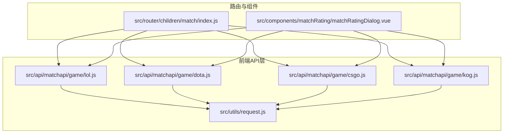
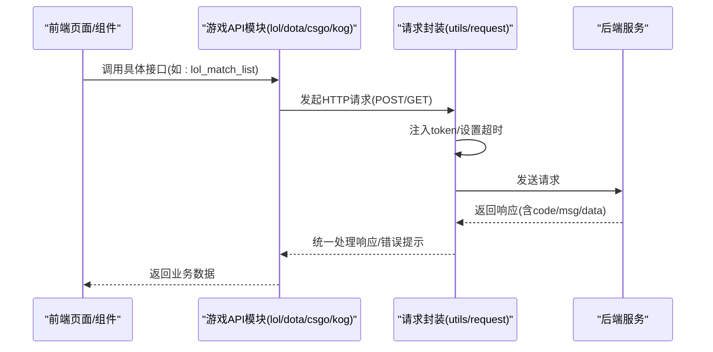
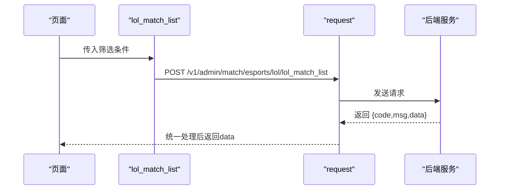
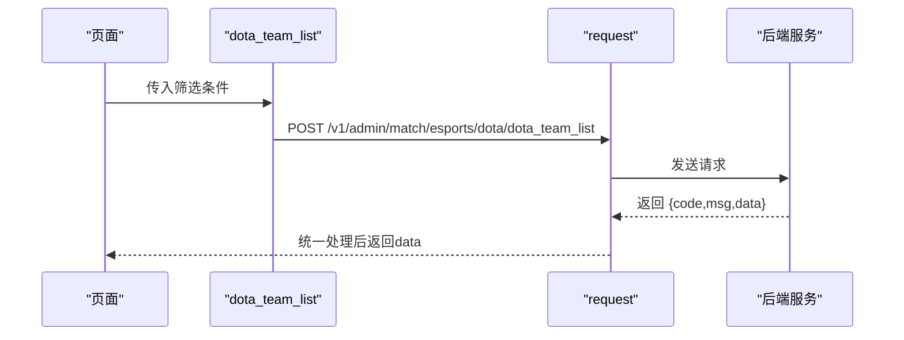
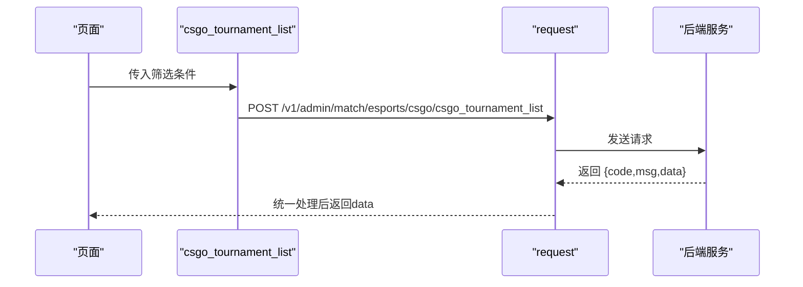
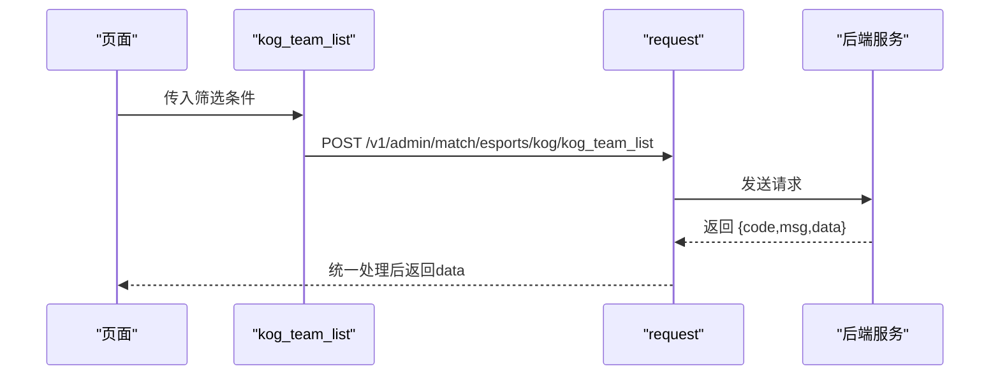
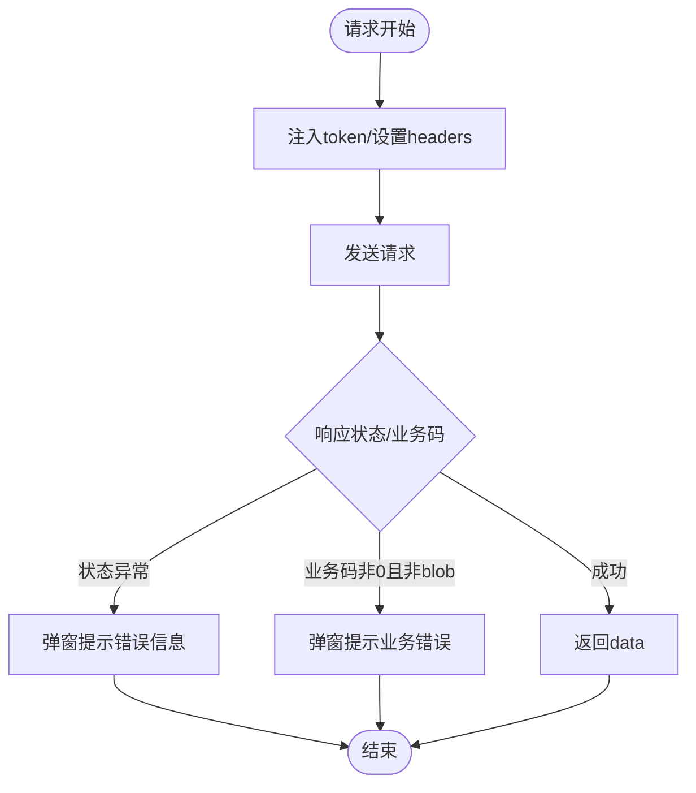
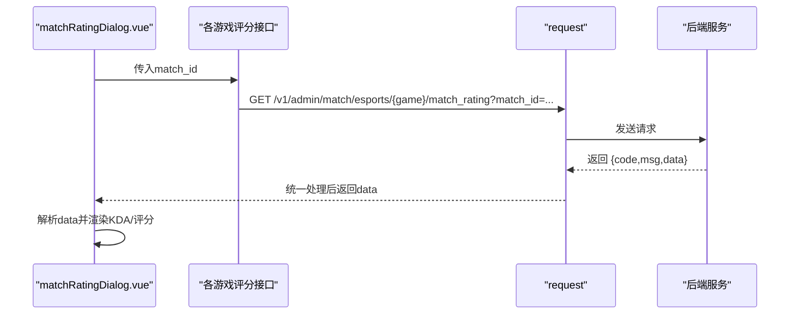

# 电竞数据API

<cite>
**本文引用的文件**
- [src/api/matchapi/game/lol.js](file://src/api/matchapi/game/lol.js)
- [src/api/matchapi/game/dota.js](file://src/api/matchapi/game/dota.js)
- [src/api/matchapi/game/csgo.js](file://src/api/matchapi/game/csgo.js)
- [src/api/matchapi/game/kog.js](file://src/api/matchapi/game/kog.js)
- [src/utils/request.js](file://src/utils/request.js)
- [src/router/children/match/index.js](file://src/router/children/match/index.js)
- [src/components/matchRating/matchRatingDialog.vue](file://src/components/matchRating/matchRatingDialog.vue)
- [package.json](file://package.json)
</cite>

## 目录
1. [简介](#简介)
2. [项目结构](#项目结构)
3. [核心组件](#核心组件)
4. [架构总览](#架构总览)
5. [详细组件分析](#详细组件分析)
6. [依赖分析](#依赖分析)
7. [性能考虑](#性能考虑)
8. [故障排查指南](#故障排查指南)
9. [结论](#结论)
10. [附录](#附录)

## 简介
本文件为“电竞数据模块”的API文档，覆盖英雄联盟（LoL）、DOTA2、CSGO、王者荣耀（KOG）四大主流电竞游戏的数据接口规范。文档从接口定义、参数说明、返回结构、业务规则与数据模型等方面进行系统化梳理，并结合前端路由与组件对典型调用场景进行说明，帮助开发者快速集成与扩展。

## 项目结构
该模块采用按游戏分层的API组织方式，每个游戏在独立文件中导出一组与该游戏相关的数据接口，统一通过通用请求封装进行网络通信。

图表来源
- [src/api/matchapi/game/lol.js:1-289](file://src/api/matchapi/game/lol.js#L1-L289)
- [src/api/matchapi/game/dota.js:1-290](file://src/api/matchapi/game/dota.js#L1-L290)
- [src/api/matchapi/game/csgo.js:1-254](file://src/api/matchapi/game/csgo.js#L1-L254)
- [src/api/matchapi/game/kog.js:1-199](file://src/api/matchapi/game/kog.js#L1-L199)
- [src/utils/request.js:1-130](file://src/utils/request.js#L1-L130)
- [src/router/children/match/index.js:230-276](file://src/router/children/match/index.js#L230-L276)
- [src/components/matchRating/matchRatingDialog.vue:918-934](file://src/components/matchRating/matchRatingDialog.vue#L918-L934)

章节来源
- [src/api/matchapi/game/lol.js:1-289](file://src/api/matchapi/game/lol.js#L1-L289)
- [src/api/matchapi/game/dota.js:1-290](file://src/api/matchapi/game/dota.js#L1-L290)
- [src/api/matchapi/game/csgo.js:1-254](file://src/api/matchapi/game/csgo.js#L1-L254)
- [src/api/matchapi/game/kog.js:1-199](file://src/api/matchapi/game/kog.js#L1-L199)
- [src/utils/request.js:1-130](file://src/utils/request.js#L1-L130)
- [src/router/children/match/index.js:230-276](file://src/router/children/match/index.js#L230-L276)
- [src/components/matchRating/matchRatingDialog.vue:918-934](file://src/components/matchRating/matchRatingDialog.vue#L918-L934)

## 核心组件
- 游戏API模块：分别提供各游戏的“列表/详情/统计/热门赛事/修正/评分”等接口方法，统一通过POST或GET发起请求。
- 请求封装：基于Axios的通用请求实例，自动注入token、设置超时、处理响应状态码与错误提示。
- 路由与权限：匹配路由中声明了各游戏的菜单权限点，确保后台权限控制。
- 评分组件：根据比赛类型动态选择对应游戏的评分接口，渲染KDA/评分等数据。

章节来源
- [src/api/matchapi/game/lol.js:1-289](file://src/api/matchapi/game/lol.js#L1-L289)
- [src/api/matchapi/game/dota.js:1-290](file://src/api/matchapi/game/dota.js#L1-L290)
- [src/api/matchapi/game/csgo.js:1-254](file://src/api/matchapi/game/csgo.js#L1-L254)
- [src/api/matchapi/game/kog.js:1-199](file://src/api/matchapi/game/kog.js#L1-L199)
- [src/utils/request.js:1-130](file://src/utils/request.js#L1-L130)
- [src/router/children/match/index.js:230-276](file://src/router/children/match/index.js#L230-L276)
- [src/components/matchRating/matchRatingDialog.vue:918-934](file://src/components/matchRating/matchRatingDialog.vue#L918-L934)

## 架构总览
下图展示了前端API模块与通用请求封装、路由与组件之间的交互关系：

图表来源
- [src/api/matchapi/game/lol.js:7-13](file://src/api/matchapi/game/lol.js#L7-L13)
- [src/utils/request.js:22-68](file://src/utils/request.js#L22-L68)

## 详细组件分析

### 英雄联盟（LoL）API
- 接口清单（部分）
  - 比赛列表：lol_match_list
  - 队伍列表：lol_team_list
  - 队员列表：lol_player_list
  - 赛事列表：lol_tournament_list
  - 英雄列表：lol_hero_list
  - 天赋列表：lol_rune_list
  - 召唤师技能列表：lol_spell_list
  - 装备列表：lol_equipment_list
  - 国家列表：lol_country_list
  - 进行中比赛定位：lol_active_match
  - 比赛详情：lol_match_detail
  - 更新队伍/赛事：lol_update_team, lol_update_tournament
  - 重置队伍/赛事：lol_reset_team, lol_reset_tournament
  - 刷新资料库：lol_refresh_tournament, lol_refresh_team
  - 积分榜：lol_comp_ranking
  - 最佳评分：lol_comp_best_rating
  - 转会列表：lol_transfer_list
  - 队伍荣誉：lol_team_honor
  - 队伍/英雄/赛事/选手统计：lol_team_statistics, lol_hero_statistics, lol_comp_statistics, lol_player_statistics
  - 队伍排行榜：lol_team_rank
  - 赛事队伍：lol_comp_team_list
  - 单场事件：lol_match_event_list
  - 热门赛事：lol_hot_tournament_list, lol_add_hot_tournament, lol_delete_hot_tournament, lol_update_hot_tournament
  - 数据修正：lol_fix_detail
  - 技术统计跳转：lol_ask_player_event
  - 评分查询：lol_match_rating

- 典型调用流程（以“比赛列表”为例）

图表来源
- [src/api/matchapi/game/lol.js:7-13](file://src/api/matchapi/game/lol.js#L7-L13)
- [src/utils/request.js:22-68](file://src/utils/request.js#L22-L68)

章节来源
- [src/api/matchapi/game/lol.js:1-289](file://src/api/matchapi/game/lol.js#L1-L289)

### DOTA2 API
- 接口清单（部分）
  - 比赛列表：dota_match_list
  - 队伍列表：dota_team_list
  - 队员列表：dota_player_list
  - 赛事列表：dota_tournament_list
  - 英雄列表：dota_hero_list
  - 天赋列表：dota_rune_list
  - 英雄技能列表：dota_spell_list
  - 装备列表：dota_item_list
  - 国家列表：dota_country_list
  - 进行中比赛定位：dota_active_match
  - 更新队伍/赛事：dota_update_team, dota_update_tournament
  - 重置队伍/赛事：dota_reset_team, dota_reset_tournament
  - 刷新资料库：dota_refresh_tournament, dota_refresh_team
  - 比赛详情：dota_match_detail
  - 积分榜：dota_comp_ranking
  - 最佳评分：dota_comp_best_rating
  - 队伍荣誉：dota_team_honor
  - 队伍/英雄/赛事/选手统计：dota_team_statistics, dota_hero_statistics, dota_comp_statistics, dota_player_statistics
  - 转会列表：dota_transfer_list
  - 赛事队伍：dota_comp_team_list
  - TI排行榜：dota_team_rank_ti
  - 队伍排行榜：dota_team_rank
  - 热门赛事：dota_hot_tournament_list, dota_add_hot_tournament, dota_delete_hot_tournament, dota_update_hot_tournament
  - 数据修正：dota_fix_detail
  - 技术统计跳转：dota_ask_player_event
  - 评分查询：dota_match_rating

- 典型调用流程（以“队伍列表”为例）

图表来源
- [src/api/matchapi/game/dota.js:13-19](file://src/api/matchapi/game/dota.js#L13-L19)
- [src/utils/request.js:22-68](file://src/utils/request.js#L22-L68)

章节来源
- [src/api/matchapi/game/dota.js:1-290](file://src/api/matchapi/game/dota.js#L1-L290)

### CSGO API
- 接口清单（部分）
  - 比赛列表：csgo_match_list
  - 队伍列表：csgo_team_list
  - 队员列表：csgo_player_list
  - 赛事列表：csgo_tournament_list
  - 国家列表：csgo_country_list
  - 地图列表：csgo_map_list
  - 枪支列表：csgo_weapon_list
  - 比赛阶段列表：csgo_stage_list
  - 进行中比赛定位：csgo_active_match
  - 更新队伍/赛事：csgo_update_team, csgo_update_tournament
  - 重置队伍/赛事：csgo_reset_team, csgo_reset_tournament
  - 刷新资料库：csgo_refresh_tournament, csgo_refresh_team
  - 队伍荣誉：csgo_team_honor
  - 转会列表：csgo_transfer_list
  - 队伍/赛事统计：csgo_team_statistics, csgo_comp_statistics
  - 比赛详情：csgo_match_detail
  - 队伍排行榜：csgo_team_rank
  - 赛事队伍：csgo_comp_team_list
  - 选手统计/排行：csgo_player_statistics, csgo_player_rank
  - 赛事积分榜：csgo_comp_ranking
  - 热门赛事：csgo_hot_tournament_list, csgo_add_hot_tournament, csgo_delete_hot_tournament, csgo_update_hot_tournament
  - 数据修正：csgo_fix_detail
  - 评分查询：csgo_match_rating

- 典型调用流程（以“赛事列表”为例）

图表来源
- [src/api/matchapi/game/csgo.js:30-36](file://src/api/matchapi/game/csgo.js#L30-L36)
- [src/utils/request.js:22-68](file://src/utils/request.js#L22-L68)

章节来源
- [src/api/matchapi/game/csgo.js:1-254](file://src/api/matchapi/game/csgo.js#L1-L254)

### 王者荣耀（KOG）API
- 接口清单（部分）
  - 比赛列表：kog_match_list
  - 队伍列表：kog_team_list
  - 队员列表：kog_player_list
  - 赛事列表：kog_tournament_list
  - 英雄列表：kog_hero_list
  - 天赋列表：kog_rune_list
  - 召唤师技能列表：kog_spell_list
  - 装备列表：kog_equipment_list
  - 国家列表：kog_country_list
  - 进行中比赛定位：kog_active_match
  - 更新队伍/赛事：kog_update_team, kog_update_tournament
  - 重置队伍/赛事：kog_reset_team, kog_reset_tournament
  - 刷新资料库：kog_refresh_tournament, kog_refresh_team
  - 赛事积分榜：kog_comp_ranking
  - 比赛详情：kog_match_detail
  - 热门赛事：kog_hot_tournament_list, kog_add_hot_tournament, kog_delete_hot_tournament, kog_update_hot_tournament
  - 数据修正：kog_fix_detail
  - 评分查询：kog_match_rating

- 典型调用流程（以“队伍列表”为例）

图表来源
- [src/api/matchapi/game/kog.js:15-21](file://src/api/matchapi/game/kog.js#L15-L21)
- [src/utils/request.js:22-68](file://src/utils/request.js#L22-L68)

章节来源
- [src/api/matchapi/game/kog.js:1-199](file://src/api/matchapi/game/kog.js#L1-L199)

### 通用请求封装（request）
- 功能要点
  - 自动识别环境并设置基础URL（admin-w.leisu.com 或 admin.leisudata.com 或默认）。
  - 自动注入token到请求头。
  - 统一处理响应状态码与业务错误（code非0），并在非blob响应时弹出消息提示。
  - 统一超时时间与跨域凭证。

- 错误处理流程

图表来源
- [src/utils/request.js:22-68](file://src/utils/request.js#L22-L68)

章节来源
- [src/utils/request.js:1-130](file://src/utils/request.js#L1-L130)

### 路由与权限（match子路由）
- 路由中声明了各游戏的菜单权限点，例如：
  - LoL：match_lol_country_list, match_lol_equipment_list, match_lol_spell_list, match_lol_rune_list, match_lol_hero_list, match_lol_player_list, match_lol_team_list, match_lol_match_list, match_lol_tournament_list, match_lol_hot_tournament_list
  - DOTA2：match_dota_country_list, match_dota_item_list, match_dota_spell_list, match_dota_rune_list, match_dota_hero_list, match_dota_player_list, match_dota_team_list, match_dota_match_list, match_dota_tournament_list, match_dota_hot_tournament_list
  - CSGO：match_csgo_tournament_list, match_csgo_match_list, match_csgo_team_list, match_csgo_player_list, match_csgo_map_list, match_csgo_country_list, match_csgo_weapon_list, match_csgo_stage_list, match_csgo_hot_tournament_list
  - 王者荣耀：match_kog_country_list, match_kog_equipment_list, match_kog_spell_list, match_kog_rune_list, match_kog_hero_list, match_kog_player_list, match_kog_team_list, match_kog_match_list, match_kog_tournament_list, match_kog_hot_tournament_list

章节来源
- [src/router/children/match/index.js:230-276](file://src/router/children/match/index.js#L230-L276)

### 评分查询与KDA展示
- 组件逻辑
  - 根据 sport_id 与 game_id 选择对应游戏的评分接口（LoL/Csgo/Dota/KOG）。
  - 将后端返回的评分数据渲染为KDA/评分等字段，用于实时展示。

- 流程示意

图表来源
- [src/components/matchRating/matchRatingDialog.vue:918-934](file://src/components/matchRating/matchRatingDialog.vue#L918-L934)
- [src/api/matchapi/game/lol.js:284-289](file://src/api/matchapi/game/lol.js#L284-L289)
- [src/api/matchapi/game/dota.js:282-288](file://src/api/matchapi/game/dota.js#L282-L288)
- [src/api/matchapi/game/csgo.js:248-253](file://src/api/matchapi/game/csgo.js#L248-L253)
- [src/api/matchapi/game/kog.js:194-199](file://src/api/matchapi/game/kog.js#L194-L199)

章节来源
- [src/components/matchRating/matchRatingDialog.vue:918-934](file://src/components/matchRating/matchRatingDialog.vue#L918-L934)
- [src/api/matchapi/game/lol.js:284-289](file://src/api/matchapi/game/lol.js#L284-L289)
- [src/api/matchapi/game/dota.js:282-288](file://src/api/matchapi/game/dota.js#L282-L288)
- [src/api/matchapi/game/csgo.js:248-253](file://src/api/matchapi/game/csgo.js#L248-L253)
- [src/api/matchapi/game/kog.js:194-199](file://src/api/matchapi/game/kog.js#L194-L199)

## 依赖分析
- Axios版本：0.18.1（来自依赖包）
- 前端运行时环境通过环境变量区分不同域名的基础路径，请求封装自动适配。

章节来源
- [package.json:41](file://package.json#L41)
- [src/utils/request.js:10-20](file://src/utils/request.js#L10-L20)

## 性能考虑
- 请求超时：统一设置为50秒，适合长列表与统计类接口。
- 错误提示：统一弹窗提示，便于快速定位问题。
- 建议
  - 对高频接口增加本地缓存策略。
  - 分页加载与懒加载结合，减少一次性请求量。
  - 对评分与统计接口进行节流/防抖处理。

## 故障排查指南
- 常见HTTP状态码
  - 400：请求错误
  - 401：未授权，请登录
  - 403：拒绝访问
  - 404：接口不存在（检查URL）
  - 408：请求超时
  - 500：服务器内部错误
  - 502/503/504：网关或服务不可用
  - 505：HTTP版本不受支持
- 业务错误
  - 当响应包含业务码非0且非blob时，前端会弹窗提示；请根据msg与code定位问题。
- 登录态
  - 若收到特定业务码，前端会清除token并跳转登录页，请确认登录状态有效。

章节来源
- [src/utils/request.js:46-127](file://src/utils/request.js#L46-L127)

## 结论
本模块以清晰的按游戏分层API设计，配合统一的请求封装与路由权限控制，实现了LoL、DOTA2、CSGO、王者荣耀等主流电竞游戏的数据接口体系。通过评分组件与统计接口，可满足比赛数据、选手数据、战队数据与赛事数据的多场景应用需求。建议在生产环境中结合缓存、分页与鉴权策略进一步优化体验与稳定性。

## 附录

### 接口调用示例（路径指引）
- 获取LoL比赛列表
  - [src/api/matchapi/game/lol.js:7-13](file://src/api/matchapi/game/lol.js#L7-L13)
- 获取DOTA2队伍列表
  - [src/api/matchapi/game/dota.js:13-19](file://src/api/matchapi/game/dota.js#L13-L19)
- 获取CSGO赛事列表
  - [src/api/matchapi/game/csgo.js:30-36](file://src/api/matchapi/game/csgo.js#L30-L36)
- 获取KOG英雄列表
  - [src/api/matchapi/game/kog.js:39-45](file://src/api/matchapi/game/kog.js#L39-L45)
- 查询LoL评分
  - [src/api/matchapi/game/lol.js:284-289](file://src/api/matchapi/game/lol.js#L284-L289)
- 查询CSGO评分
  - [src/api/matchapi/game/csgo.js:248-253](file://src/api/matchapi/game/csgo.js#L248-L253)

### 业务规则与术语说明
- 电竞术语
  - 击杀数（Kills/KDA中的K）、死亡数（Deaths/KDA中的D）、助攻数（Assists/KDA中的A）、经济（Gold）、补刀数（Last Hits）、评分（Rating）等。
- 版本更新与皮肤收集
  - 由于接口主要面向数据查询与管理，版本更新与皮肤收集等业务通常由游戏侧维护；前端可通过英雄/装备/皮肤相关接口同步最新资源。
- 段位系统
  - 不同游戏的段位体系不同，接口提供积分榜/排行榜等聚合结果，具体段位计算与规则以游戏内为准。