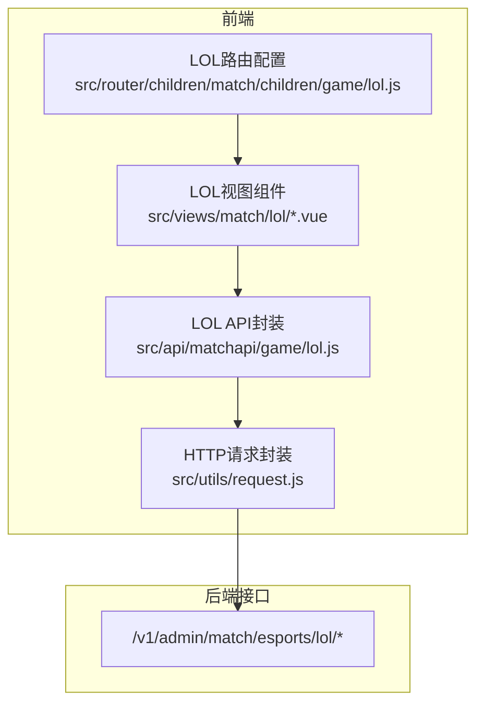
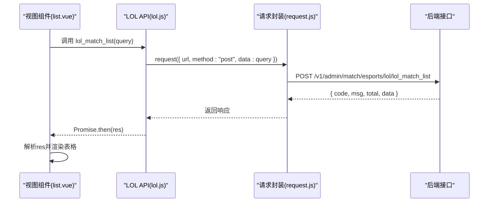
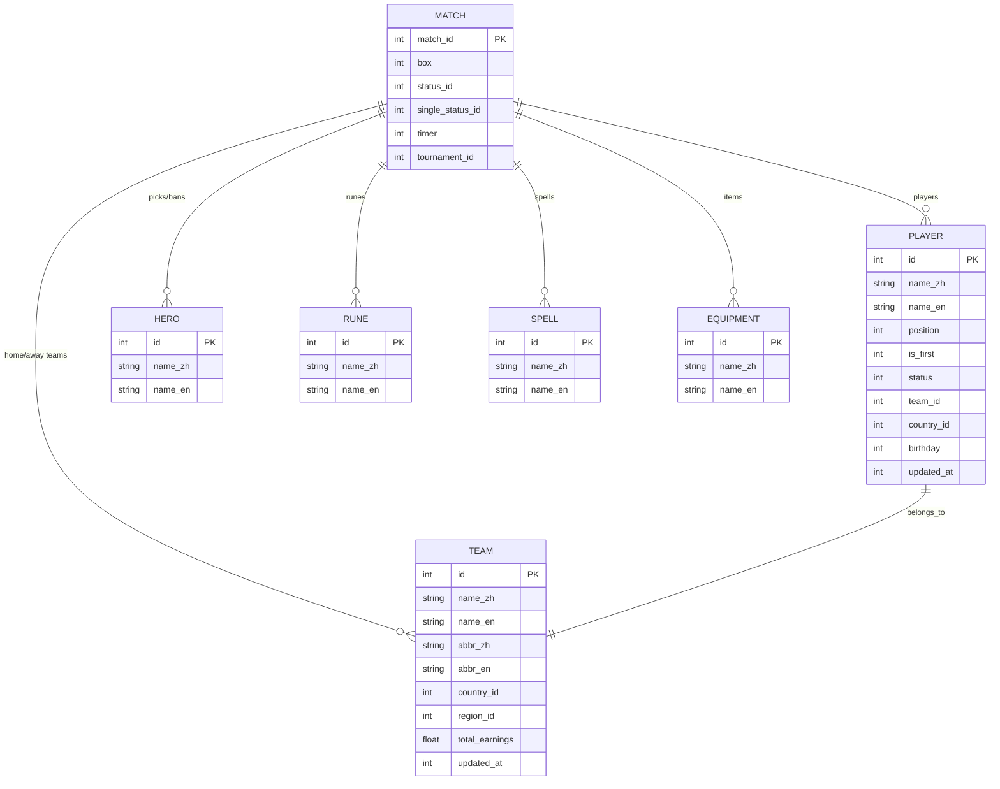
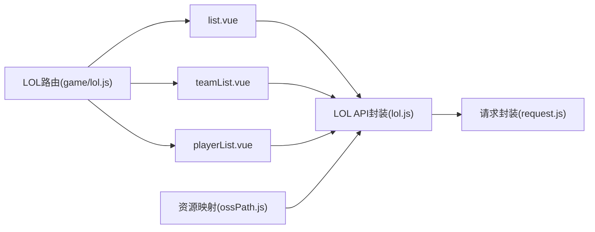

# 英雄联盟API

<cite>
**本文引用的文件**
- [lol.js](file://src/api/matchapi/game/lol.js)
- [request.js](file://src/utils/request.js)
- [list.vue](file://src/views/match/lol/list.vue)
- [teamList.vue](file://src/views/match/lol/teamList.vue)
- [playerList.vue](file://src/views/match/lol/playerList.vue)
- [index.js](file://src/router/children/match/children/game/lol.js)
- [ossPath.js](file://src/utils/dict/ossPath.js)
- [matchRatingDialog.vue](file://src/components/matchRating/matchRatingDialog.vue)
- [mqttMsg.md](file://public/mqttMsg.md)
</cite>

## 目录
1. [简介](#简介)
2. [项目结构](#项目结构)
3. [核心组件](#核心组件)
4. [架构总览](#架构总览)
5. [详细组件分析](#详细组件分析)
6. [依赖分析](#依赖分析)
7. [性能考虑](#性能考虑)
8. [故障排查指南](#故障排查指南)
9. [结论](#结论)
10. [附录](#附录)

## 简介
本文件为英雄联盟电竞数据模块的详细API文档，覆盖LOL相关的核心接口与前端使用方式，包括：
- 比赛列表：lol_match_list
- 队伍列表：lol_team_list
- 选手列表：lol_player_list
- 赛事列表：lol_tournament_list
- 英雄列表：lol_hero_list
- 天赋列表：lol_rune_list
- 召唤师技能列表：lol_spell_list
- 装备列表：lol_equipment_list
- 国家列表：lol_country_list
- 进行中比赛：lol_active_match
- 比赛详情：lol_match_detail
- 更新队伍/赛事：lol_update_team / lol_update_tournament
- 重置队伍/赛事：lol_reset_team / lol_reset_tournament
- 刷新资料库：lol_refresh_tournament / lol_refresh_team
- 积分榜：lol_comp_ranking
- 最佳阵容：lol_comp_best_rating
- 转会列表：lol_transfer_list
- 队伍荣誉：lol_team_honor
- 队伍统计：lol_team_statistics
- 英雄统计：lol_hero_statistics
- 赛事统计：lol_comp_statistics
- 选手统计：lol_player_statistics
- 队伍排行：lol_team_rank
- 赛事队伍：lol_comp_team_list
- 单场事件：lol_match_event_list
- 热门赛事：lol_hot_tournament_list
- 添加热门赛事：lol_add_hot_tournament
- 删除热门赛事：lol_delete_hot_tournament
- 修改热门赛事权重：lol_update_hot_tournament
- 数据修正：lol_fix_detail
- 选手技术统计入口：lol_ask_player_event
- 比赛评分查询：lol_match_rating

同时，文档解释LOL专业术语（如KDA、Gold、CS、参团率等），并梳理数据模型与字段关系，提供调用示例与常见问题排查建议。

## 项目结构
LOL相关API集中在matchapi下的game/lol.js中，统一通过utils/request.js发起HTTP请求；前端视图组件位于views/match/lol目录，路由配置位于router/children/match/children/game/lol.js。

**图表来源**
- [lol.js](file://src/api/matchapi/game/lol.js)
- [request.js](file://src/utils/request.js)
- [index.js](file://src/router/children/match/children/game/lol.js)

**章节来源**
- [lol.js:1-289](file://src/api/matchapi/game/lol.js#L1-L289)
- [request.js:1-130](file://src/utils/request.js#L1-L130)
- [index.js:1-104](file://src/router/children/match/children/game/lol.js#L1-L104)

## 核心组件
- LOL API封装：集中导出所有LOL相关接口方法，统一POST请求路径与参数传递。
- 请求封装：基于axios，自动注入token，统一封装响应与错误处理。
- 视图组件：负责查询条件构建、表格渲染、分页与交互，调用对应API获取数据。
- 路由配置：定义LOL模块菜单、权限角色与页面映射。

**章节来源**
- [lol.js:1-289](file://src/api/matchapi/game/lol.js#L1-L289)
- [request.js:1-130](file://src/utils/request.js#L1-L130)
- [index.js:1-104](file://src/router/children/match/children/game/lol.js#L1-L104)

## 架构总览
LOL数据流从视图组件发起查询，经API封装层，通过HTTP请求到达后端接口，返回标准JSON数据，前端解析并渲染。

**图表来源**
- [list.vue:202-221](file://src/views/match/lol/list.vue#L202-L221)
- [lol.js:7-13](file://src/api/matchapi/game/lol.js#L7-L13)
- [request.js:22-68](file://src/utils/request.js#L22-L68)

## 详细组件分析

### 接口总览与调用规范
- 所有LOL接口均通过POST请求，URL前缀为/v1/admin/match/esports/lol/。
- 参数对象作为data传入，返回结构包含code、msg、total、data等字段。
- 部分接口采用GET请求（如比赛评分查询）。

**章节来源**
- [lol.js:7-289](file://src/api/matchapi/game/lol.js#L7-L289)
- [request.js:22-68](file://src/utils/request.js#L22-L68)

### 比赛列表 lol_match_list
- 功能：按时间范围、状态、赛事ID、队伍ID等条件查询比赛列表。
- 请求参数：分页、排序、搜索字段与关键字、时间范围等。
- 返回：总数total与数据列表，每条记录包含比赛ID、时间、对阵、状态、轮次等。
- 使用场景：后台管理端查看历史与进行中比赛，支持筛选与排序。

**章节来源**
- [list.vue:172-240](file://src/views/match/lol/list.vue#L172-L240)
- [list.vue:202-221](file://src/views/match/lol/list.vue#L202-L221)
- [lol.js:7-13](file://src/api/matchapi/game/lol.js#L7-L13)

### 队伍列表 lol_team_list
- 功能：查询队伍基础信息、所属国家、赛区、收入、更新时间等。
- 请求参数：名称/ID模糊搜索、时间过滤等。
- 使用场景：队伍管理、刷新数据、查看队伍荣誉与统计。

**章节来源**
- [teamList.vue:154-207](file://src/views/match/lol/teamList.vue#L154-L207)
- [lol.js:14-21](file://src/api/matchapi/game/lol.js#L14-L21)

### 选手列表 lol_player_list
- 功能：查询选手基本信息、位置、首发状态、服役状态、所属战队、国籍、生日等。
- 请求参数：姓名/ID/队伍ID搜索。
- 使用场景：选手档案管理、转会追踪、统计分析。

**章节来源**
- [playerList.vue:197-227](file://src/views/match/lol/playerList.vue#L197-L227)
- [lol.js:22-29](file://src/api/matchapi/game/lol.js#L22-L29)

### 赛事列表 lol_tournament_list
- 功能：查询赛事基础信息与状态。
- 使用场景：赛事管理、热门赛事维护、统计分析。

**章节来源**
- [lol.js:30-37](file://src/api/matchapi/game/lol.js#L30-L37)

### 英雄列表 lol_hero_list
- 功能：查询英雄基础信息。
- 使用场景：英雄池管理、统计分析。

**章节来源**
- [lol.js:38-45](file://src/api/matchapi/game/lol.js#L38-L45)

### 天赋列表 lol_rune_list
- 功能：查询天赋信息。
- 使用场景：排位/训练数据标注。

**章节来源**
- [lol.js:46-53](file://src/api/matchapi/game/lol.js#L46-L53)

### 召唤师技能列表 lol_spell_list
- 功能：查询技能信息。
- 使用场景：排位/训练数据标注。

**章节来源**
- [lol.js:54-61](file://src/api/matchapi/game/lol.js#L54-L61)

### 装备列表 lol_equipment_list
- 功能：查询装备信息。
- 使用场景：排位/训练数据标注。

**章节来源**
- [lol.js:62-69](file://src/api/matchapi/game/lol.js#L62-L69)

### 国家列表 lol_country_list
- 功能：查询国家信息。
- 使用场景：队伍/选手国籍归类。

**章节来源**
- [lol.js:70-77](file://src/api/matchapi/game/lol.js#L70-L77)

### 进行中比赛 lol_active_match
- 功能：定位当前进行中的LOL比赛。
- 使用场景：直播/数据面板实时刷新。

**章节来源**
- [lol.js:78-85](file://src/api/matchapi/game/lol.js#L78-L85)

### 比赛详情 lol_match_detail
- 功能：获取比赛直播tab数据。
- 使用场景：直播页数据展示。

**章节来源**
- [lol.js:86-93](file://src/api/matchapi/game/lol.js#L86-L93)

### 更新队伍/赛事 lol_update_team / lol_update_tournament
- 功能：更新队伍/赛事资料。
- 使用场景：资料修正与维护。

**章节来源**
- [lol.js:94-109](file://src/api/matchapi/game/lol.js#L94-L109)

### 重置队伍/赛事 lol_reset_team / lol_reset_tournament
- 功能：重置队伍/赛事状态。
- 使用场景：异常恢复。

**章节来源**
- [lol.js:110-126](file://src/api/matchapi/game/lol.js#L110-L126)

### 刷新资料库 lol_refresh_tournament / lol_refresh_team
- 功能：从上游刷新队伍/赛事资料。
- 使用场景：数据同步。

**章节来源**
- [lol.js:127-144](file://src/api/matchapi/game/lol.js#L127-L144)

### 积分榜 lol_comp_ranking
- 功能：获取赛事积分榜。
- 使用场景：榜单展示。

**章节来源**
- [lol.js:145-160](file://src/api/matchapi/game/lol.js#L145-L160)

### 最佳阵容 lol_comp_best_rating
- 功能：获取最佳阵容。
- 使用场景：最佳回顾。

**章节来源**
- [lol.js:154-160](file://src/api/matchapi/game/lol.js#L154-L160)

### 转会列表 lol_transfer_list
- 功能：获取选手转会列表。
- 使用场景：转会追踪。

**章节来源**
- [lol.js:162-169](file://src/api/matchapi/game/lol.js#L162-L169)

### 队伍荣誉 lol_team_honor
- 功能：获取队伍荣誉。
- 使用场景：荣誉展示。

**章节来源**
- [lol.js:170-177](file://src/api/matchapi/game/lol.js#L170-L177)

### 队伍统计 lol_team_statistics
- 功能：获取队伍统计。
- 使用场景：数据分析。

**章节来源**
- [lol.js:178-185](file://src/api/matchapi/game/lol.js#L178-L185)

### 英雄统计 lol_hero_statistics
- 功能：获取英雄统计。
- 使用场景：英雄分析。

**章节来源**
- [lol.js:186-193](file://src/api/matchapi/game/lol.js#L186-L193)

### 赛事统计 lol_comp_statistics
- 功能：获取赛事统计。
- 使用场景：赛事分析。

**章节来源**
- [lol.js:194-201](file://src/api/matchapi/game/lol.js#L194-L201)

### 选手统计 lol_player_statistics
- 功能：获取选手统计。
- 使用场景：选手分析。

**章节来源**
- [lol.js:202-209](file://src/api/matchapi/game/lol.js#L202-L209)

### 队伍排行 lol_team_rank
- 功能：获取队伍排行。
- 使用场景：排行展示。

**章节来源**
- [lol.js:210-217](file://src/api/matchapi/game/lol.js#L210-L217)

### 赛事队伍 lol_comp_team_list
- 功能：获取赛事队伍。
- 使用场景：赛事队伍管理。

**章节来源**
- [lol.js:219-226](file://src/api/matchapi/game/lol.js#L219-L226)

### 单场事件 lol_match_event_list
- 功能：获取单场比赛事件。
- 使用场景：事件回放。

**章节来源**
- [lol.js:227-234](file://src/api/matchapi/game/lol.js#L227-L234)

### 热门赛事 lol_hot_tournament_list
- 功能：获取热门赛事列表。
- 使用场景：首页推荐。

**章节来源**
- [lol.js:235-242](file://src/api/matchapi/game/lol.js#L235-L242)

### 添加热门赛事 lol_add_hot_tournament
- 功能：添加热门赛事。
- 使用场景：运营维护。

**章节来源**
- [lol.js:243-250](file://src/api/matchapi/game/lol.js#L243-L250)

### 删除热门赛事 lol_delete_hot_tournament
- 功能：删除热门赛事。
- 使用场景：运营维护。

**章节来源**
- [lol.js:251-258](file://src/api/matchapi/game/lol.js#L251-L258)

### 修改热门赛事权重 lol_update_hot_tournament
- 功能：调整热门赛事权重。
- 使用场景：运营维护。

**章节来源**
- [lol.js:259-266](file://src/api/matchapi/game/lol.js#L259-L266)

### 数据修正 lol_fix_detail
- 功能：数据修正。
- 使用场景：异常修正。

**章节来源**
- [lol.js:267-274](file://src/api/matchapi/game/lol.js#L267-L274)

### 选手技术统计入口 lol_ask_player_event
- 功能：跳转选手-技术统计使用。
- 使用场景：选手数据跳转。

**章节来源**
- [lol.js:275-282](file://src/api/matchapi/game/lol.js#L275-L282)

### 比赛评分查询 lol_match_rating
- 功能：获取比赛评分。
- 请求方式：GET，参数为match_id拼接在URL上。
- 使用场景：评分展示。

**章节来源**
- [lol.js:283-289](file://src/api/matchapi/game/lol.js#L283-L289)

### 术语与数据模型

#### 专业术语
- KDA：击杀/死亡/助攻的综合评价指标。
- Gold：经济，通常指游戏内金币。
- CS：补刀数，衡量对线效率。
- 参团率：参与击杀的比率，反映团队协作。

#### 数据模型与字段关系
- 比赛数据：包含双方队伍、比分、状态、局数、计时器、经济/经验曲线、事件等。
- 队伍数据：包含队伍ID、名称、简称、国家、赛区、收入、更新时间等。
- 选手数据：包含选手ID、位置、首发、服役状态、战队、国籍、生日、更新时间等。
- 英雄/天赋/技能/装备：资源型数据，用于标注与统计。

**图表来源**
- [mqttMsg.md:2573-2631](file://public/mqttMsg.md#L2573-L2631)
- [mqttMsg.md:2682-2701](file://public/mqttMsg.md#L2682-L2701)
- [mqttMsg.md:2711-2797](file://public/mqttMsg.md#L2711-L2797)

**章节来源**
- [matchRatingDialog.vue:570-582](file://src/components/matchRating/matchRatingDialog.vue#L570-L582)
- [mqttMsg.md:2573-2798](file://public/mqttMsg.md#L2573-L2798)

## 依赖分析
- API封装与请求封装：所有LOL接口统一通过utils/request.js发起，自动携带token并处理响应。
- 资源模块映射：LOL的资源（天赋、技能、装备）在ossPath.js中定义模块路径，便于前端资源加载与管理。
- 路由与权限：LOL模块路由配置包含多个子页面与角色权限，确保不同角色可访问相应功能。

**图表来源**
- [lol.js:1-289](file://src/api/matchapi/game/lol.js#L1-L289)
- [request.js:1-130](file://src/utils/request.js#L1-L130)
- [index.js:1-104](file://src/router/children/match/children/game/lol.js#L1-L104)
- [ossPath.js:522-583](file://src/utils/dict/ossPath.js#L522-L583)

**章节来源**
- [lol.js:1-289](file://src/api/matchapi/game/lol.js#L1-L289)
- [request.js:1-130](file://src/utils/request.js#L1-L130)
- [index.js:1-104](file://src/router/children/match/children/game/lol.js#L1-L104)
- [ossPath.js:522-583](file://src/utils/dict/ossPath.js#L522-L583)

## 性能考虑
- 分页与排序：前端组件默认支持分页与排序，合理设置limit与orderby_field可减少一次性传输量。
- 时间范围：比赛列表支持时间范围查询，建议缩小时间窗口以提升查询效率。
- 缓存策略：对于静态资源（天赋、技能、装备）可结合ossPath.js的模块映射进行缓存优化。
- 错误处理：请求封装统一处理4xx/5xx状态码与业务错误码，避免重复弹窗影响用户体验。

[本节为通用指导，无需具体文件引用]

## 故障排查指南
- 登录失效：当后端返回特定业务码时，前端会清除token并跳转登录页。
- 接口不存在：404时会提示接口地址，检查URL前缀与方法是否正确。
- 超时与网络异常：根据状态码提示进行重试或检查网络。
- 权限不足：确认角色权限是否包含对应LOL菜单项。

**章节来源**
- [request.js:46-127](file://src/utils/request.js#L46-L127)

## 结论
LOL电竞数据模块通过统一的API封装与请求封装，实现了对比赛、队伍、选手、赛事、资源等全链路数据的管理与展示。前端视图组件配合路由与权限控制，提供了完善的后台管理能力。建议在生产环境中结合分页、时间范围与权限校验，确保接口性能与安全性。

[本节为总结性内容，无需具体文件引用]

## 附录

### 接口调用示例（路径参考）
- 获取比赛列表：调用 [list.vue:202-221](file://src/views/match/lol/list.vue#L202-L221)，内部使用 [lol.js:7-13](file://src/api/matchapi/game/lol.js#L7-L13)。
- 获取队伍列表：调用 [teamList.vue:194-207](file://src/views/match/lol/teamList.vue#L194-L207)，内部使用 [lol.js:14-21](file://src/api/matchapi/game/lol.js#L14-L21)。
- 获取选手列表：调用 [playerList.vue:214-227](file://src/views/match/lol/playerList.vue#L214-L227)，内部使用 [lol.js:22-29](file://src/api/matchapi/game/lol.js#L22-L29)。
- 获取比赛详情：调用 [list.vue:198-201](file://src/views/match/lol/list.vue#L198-L201)，内部使用 [lol.js:86-93](file://src/api/matchapi/game/lol.js#L86-L93)。
- 获取比赛评分：调用 [lol.js:283-289](file://src/api/matchapi/game/lol.js#L283-L289)。

### 术语速查
- KDA：击杀/死亡/助攻
- Gold：经济
- CS：补刀
- 参团率：参与击杀比率

**章节来源**
- [matchRatingDialog.vue:570-582](file://src/components/matchRating/matchRatingDialog.vue#L570-L582)