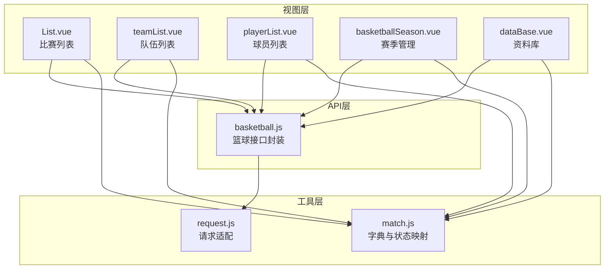
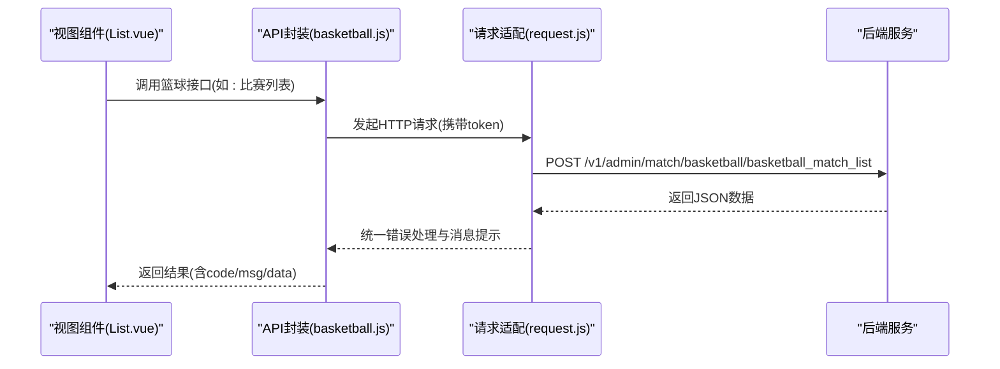
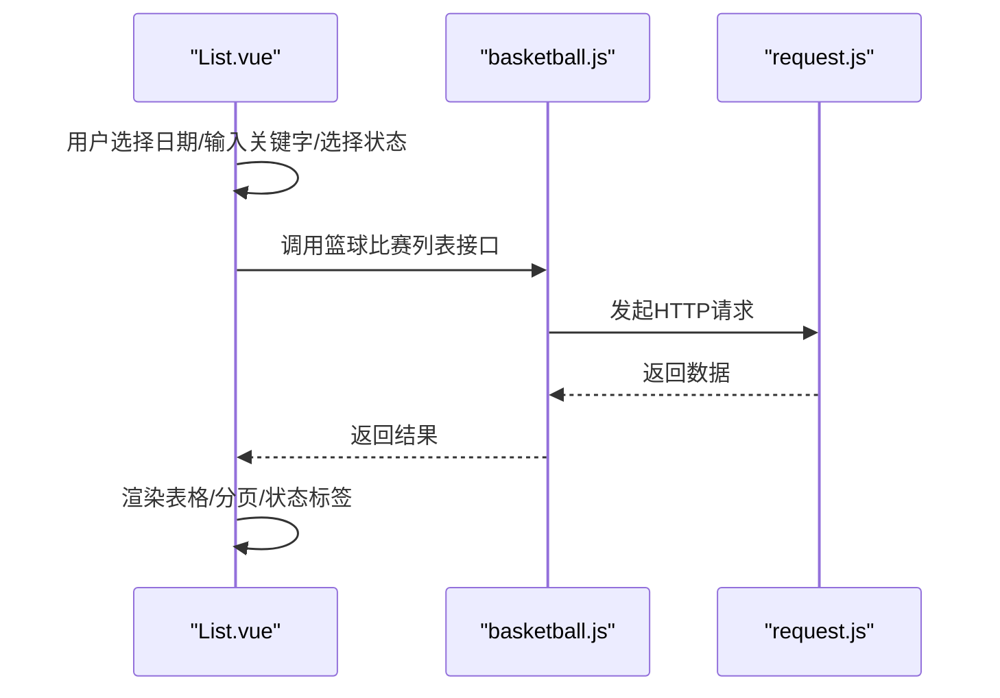
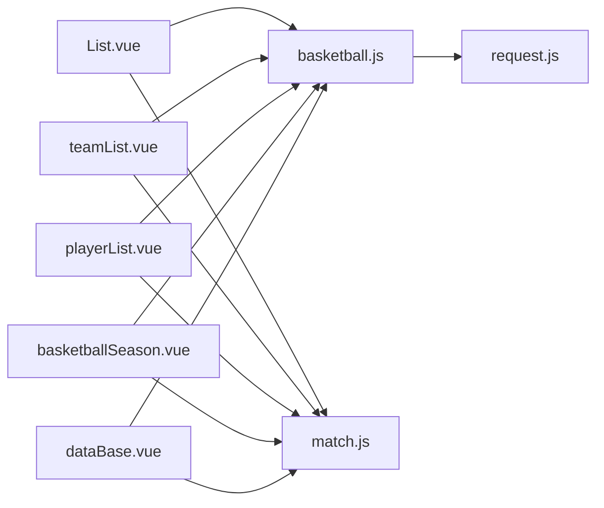

# 篮球数据API

<cite>
**本文档引用的文件**
- [basketball.js](file://src/api/matchapi/ball/basketball.js)
- [request.js](file://src/utils/request.js)
- [match.js](file://src/utils/dict/match.js)
- [List.vue](file://src/views/match/basketball/List.vue)
- [playerList.vue](file://src/views/match/basketball/playerList.vue)
- [teamList.vue](file://src/views/match/basketball/teamList.vue)
- [dataBase.vue](file://src/views/match/basketball/components/databaselist/dataBase.vue)
- [basketballSeason.vue](file://src/views/match/basketball/basketballSeason.vue)
</cite>

## 目录
1. [简介](#简介)
2. [项目结构](#项目结构)
3. [核心组件](#核心组件)
4. [架构总览](#架构总览)
5. [详细组件分析](#详细组件分析)
6. [依赖关系分析](#依赖关系分析)
7. [性能考虑](#性能考虑)
8. [故障排除指南](#故障排除指南)
9. [结论](#结论)
10. [附录](#附录)

## 简介
本文件为篮球数据模块的API文档，覆盖NBA、CBA等各级别联赛的数据管理与展示。文档围绕篮球特有的统计数据（得分、篮板、助攻、抢断、盖帽等）与业务规则（比赛时间、犯规次数、加时赛规则等），提供接口规范、调用示例、数据模型与关系说明，并结合前端视图组件展示典型应用场景。

## 项目结构
篮球数据模块位于前端工程的API与视图层，主要由以下部分组成：
- API封装层：统一导出篮球相关接口方法，便于视图组件按需调用
- 请求适配层：基于Axios封装请求与响应拦截器，自动注入token与错误处理
- 字典与状态映射：提供比赛状态、教练类型、运动分类等字典常量
- 视图组件层：提供比赛列表、队伍列表、球员列表、赛季管理、资料库等功能页面

**图表来源**
- [List.vue:208-351](file://src/views/match/basketball/List.vue#L208-L351)
- [teamList.vue:227-317](file://src/views/match/basketball/teamList.vue#L227-L317)
- [playerList.vue:199-266](file://src/views/match/basketball/playerList.vue#L199-L266)
- [basketballSeason.vue:119-212](file://src/views/match/basketball/basketballSeason.vue#L119-L212)
- [dataBase.vue:51-132](file://src/views/match/basketball/components/databaselist/dataBase.vue#L51-L132)
- [basketball.js:1-553](file://src/api/matchapi/ball/basketball.js#L1-L553)
- [request.js:1-130](file://src/utils/request.js#L1-L130)
- [match.js:68-208](file://src/utils/dict/match.js#L68-L208)

**章节来源**
- [basketball.js:1-553](file://src/api/matchapi/ball/basketball.js#L1-L553)
- [request.js:1-130](file://src/utils/request.js#L1-L130)
- [match.js:68-208](file://src/utils/dict/match.js#L68-L208)

## 核心组件
- 接口封装模块：集中导出篮球相关API，包括比赛、队伍、球员、赛事、教练、荣誉、阶段、国家、赛季、热门赛事、竞彩等接口
- 请求适配模块：统一封装Axios实例，自动注入token、超时控制、错误提示与状态码处理
- 字典与状态映射：提供比赛状态枚举、教练类型、运动分类等常量，支撑视图层渲染与逻辑判断
- 视图组件：提供列表页、详情页、资料库、赛季管理等页面，承载业务场景与交互

**章节来源**
- [basketball.js:1-553](file://src/api/matchapi/ball/basketball.js#L1-L553)
- [request.js:1-130](file://src/utils/request.js#L1-L130)
- [match.js:68-208](file://src/utils/dict/match.js#L68-L208)

## 架构总览
前端通过视图组件调用API封装模块，API模块使用请求适配模块发起HTTP请求；后端返回数据经统一拦截器处理后返回给调用方。字典与状态映射贯穿于视图层，用于状态渲染与业务逻辑判断。

**图表来源**
- [List.vue:330-351](file://src/views/match/basketball/List.vue#L330-L351)
- [basketball.js:3-9](file://src/api/matchapi/ball/basketball.js#L3-L9)
- [request.js:22-68](file://src/utils/request.js#L22-L68)

## 详细组件分析

### 接口封装模块（basketball.js）
- 功能概览：提供篮球数据管理所需的所有接口方法，涵盖列表查询、更新、刷新、重置、异常处理、热门赛事、竞彩、评分、规则、转会等
- 典型接口
  - 比赛：列表、活动比赛、详情、异常列表、评分
  - 队伍：列表、更新、刷新、重置、权重更新
  - 球员：列表、刷新、生涯、荣誉、转会
  - 赛事：列表、更新、刷新、重置、阶段修复、规则列表
  - 赛季：列表、更新、刷新、重置、队伍/球员/荣誉/排名等
  - 教练：列表、更新、刷新、执教履历
  - 荣誉：列表、更新、刷新、重置、权重
  - 国家：列表、更新、刷新、重置
  - 场馆：列表、刷新
  - 热门赛事：列表、更新权重、新增、删除
  - 竞彩：期号、指数列表
- 调用方式：统一通过request模块发起POST或GET请求，自动注入token与错误处理

**章节来源**
- [basketball.js:1-553](file://src/api/matchapi/ball/basketball.js#L1-L553)

### 请求适配模块（request.js）
- 功能概览：创建Axios实例，设置baseURL、超时、跨域、token注入与统一错误处理
- 关键特性
  - 自动注入token到请求头
  - 统一错误提示与状态码处理
  - 环境区分（admin-w.leisu.com、admin.leisudata.com、默认）
  - 超时控制与错误分类提示
- 使用建议：所有API调用均通过该模块，避免重复配置

**章节来源**
- [request.js:1-130](file://src/utils/request.js#L1-L130)

### 字典与状态映射（match.js）
- 功能概览：提供比赛状态、教练类型、运动分类等字典常量，支撑视图层渲染与逻辑判断
- 篮球相关要点
  - 比赛状态：未开赛、第一节、第二节、第三节、第四节、加时、完场、中断、取消、延期、腰斩、待定等
  - 教练类型：主教练、助理教练、总经理、临时主教练等
  - 运动分类：篮球对应 sport_id=2，str="basketball"
- 应用场景：视图组件根据状态字典渲染状态标签、根据教练类型渲染教练角色

**章节来源**
- [match.js:68-208](file://src/utils/dict/match.js#L68-L208)

### 比赛列表视图（List.vue）
- 功能概览：展示篮球比赛列表，支持日期筛选、关键字搜索、状态筛选、热门/全部切换、进行中定位、报表查看等
- 关键流程
  - 初始化：创建时加载列表
  - 查询：支持多字段组合查询（比赛ID、队伍ID、赛事ID、状态等）
  - 排序：支持按比赛时间、状态排序
  - 操作：跳转详情、报表、热门切换、进行中定位
- 数据来源：调用篮球接口封装模块的列表方法，统一处理loading与分页

**图表来源**
- [List.vue:293-351](file://src/views/match/basketball/List.vue#L293-L351)
- [basketball.js:3-9](file://src/api/matchapi/ball/basketball.js#L3-L9)
- [request.js:22-68](file://src/utils/request.js#L22-L68)

**章节来源**
- [List.vue:208-478](file://src/views/match/basketball/List.vue#L208-L478)

### 队伍列表视图（teamList.vue）
- 功能概览：展示队伍列表，支持名称/ID/所属赛事/时间/国家队筛选，可查看教练、国家、所属赛事、场馆、分区等信息，支持刷新与权重更新
- 关键流程
  - 查询：多字段组合查询
  - 刷新：调用刷新接口从源数据拉取最新信息
  - 权重：管理员可修改队伍权重并保存
  - 操作：跳转M站、打开教练信息、打开球员列表、更新队伍信息
- 数据来源：调用队伍相关接口，统一处理loading与分页

**章节来源**
- [teamList.vue:227-386](file://src/views/match/basketball/teamList.vue#L227-L386)

### 球员列表视图（playerList.vue）
- 功能概览：展示球员列表，支持名称/ID/队伍ID筛选，可查看位置、球衣号、惯用手、身高体重、生日、联盟球龄、合同到期、退役/死亡时间等信息，支持刷新与更新
- 关键流程
  - 查询：多字段组合查询
  - 刷新：调用刷新接口从源数据拉取最新信息
  - 操作：打开详情对话框、更新球员信息
- 数据来源：调用球员相关接口，统一处理loading与分页

**章节来源**
- [playerList.vue:199-344](file://src/views/match/basketball/playerList.vue#L199-L344)

### 赛季管理视图（basketballSeason.vue）
- 功能概览：展示篮球赛季列表，支持赛季ID/赛事ID/赛事名称筛选，可查看是否当前赛季、是否有球员/队伍统计、积分榜、开始/结束时间等，支持刷新与编辑
- 关键流程
  - 查询：多字段组合查询
  - 刷新：调用刷新接口从源数据拉取最新信息
  - 编辑：打开更新对话框修改赛季信息
  - 打开：点击赛季进入阶段管理
- 数据来源：调用赛季相关接口，统一处理loading与分页

**章节来源**
- [basketballSeason.vue:119-242](file://src/views/match/basketball/basketballSeason.vue#L119-L242)

### 资料库视图（dataBase.vue）
- 功能概览：展示赛事资料库，包含赛季、排名、最佳球队、最佳球员、动态等标签页，支持根据活动行加载对应数据
- 关键流程
  - 初始化：根据传入行数据加载资料库
  - 标签页：切换标签页时加载对应子组件
  - 数据：通过接口获取赛季年份与对应数据
- 数据来源：调用资料库相关接口，统一处理loading

**章节来源**
- [dataBase.vue:51-134](file://src/views/match/basketball/components/databaselist/dataBase.vue#L51-L134)

## 依赖关系分析
- 视图组件依赖API封装模块：通过导入接口方法发起请求
- API封装模块依赖请求适配模块：统一发起HTTP请求与错误处理
- 视图组件依赖字典与状态映射：用于渲染状态标签、教练类型等
- 组件间耦合度低：通过接口方法解耦，便于扩展与维护

**图表来源**
- [List.vue:208-351](file://src/views/match/basketball/List.vue#L208-L351)
- [teamList.vue:227-317](file://src/views/match/basketball/teamList.vue#L227-L317)
- [playerList.vue:199-266](file://src/views/match/basketball/playerList.vue#L199-L266)
- [basketballSeason.vue:119-212](file://src/views/match/basketball/basketballSeason.vue#L119-L212)
- [dataBase.vue:51-132](file://src/views/match/basketball/components/databaselist/dataBase.vue#L51-L132)
- [basketball.js:1-553](file://src/api/matchapi/ball/basketball.js#L1-L553)
- [request.js:1-130](file://src/utils/request.js#L1-L130)
- [match.js:68-208](file://src/utils/dict/match.js#L68-L208)

**章节来源**
- [basketball.js:1-553](file://src/api/matchapi/ball/basketball.js#L1-L553)
- [request.js:1-130](file://src/utils/request.js#L1-L130)
- [match.js:68-208](file://src/utils/dict/match.js#L68-L208)

## 性能考虑
- 请求超时与错误处理：统一设置超时时间与错误提示，避免阻塞UI
- 分页与懒加载：列表页采用分页加载，减少一次性渲染压力
- 条件查询：支持多字段组合查询，缩小数据范围，提升响应速度
- 状态缓存：字典与状态映射在内存中复用，避免重复计算

## 故障排除指南
- 401未授权：检查token是否有效或过期，必要时重新登录
- 403拒绝访问：确认当前用户权限是否具备相应操作权限
- 404接口不存在：核对请求路径与环境变量配置
- 500服务器错误：联系后端排查服务异常
- 错误提示：统一通过消息提示组件展示错误信息，便于定位问题

**章节来源**
- [request.js:69-126](file://src/utils/request.js#L69-L126)

## 结论
篮球数据模块通过清晰的分层设计与完善的接口封装，实现了对NBA、CBA等各级别联赛数据的高效管理与展示。结合字典与状态映射，视图组件能够准确渲染比赛状态与教练类型等关键信息。建议在后续迭代中持续完善异常处理与性能优化，以提升用户体验与系统稳定性。

## 附录

### 接口调用示例（路径指引）
- 获取比赛列表
  - 路径：[basketball_match_list:3-9](file://src/api/matchapi/ball/basketball.js#L3-L9)
  - 调用：[List.vue:330-351](file://src/views/match/basketball/List.vue#L330-L351)
- 获取队伍列表
  - 路径：[basketball_team_list:11-17](file://src/api/matchapi/ball/basketball.js#L11-L17)
  - 调用：[teamList.vue:300-317](file://src/views/match/basketball/teamList.vue#L300-L317)
- 获取球员列表
  - 路径：[basketball_player_list:18-25](file://src/api/matchapi/ball/basketball.js#L18-L25)
  - 调用：[playerList.vue:249-266](file://src/views/match/basketball/playerList.vue#L249-L266)
- 获取赛季列表
  - 路径：[basketball_season_list:76-83](file://src/api/matchapi/ball/basketball.js#L76-L83)
  - 调用：[basketballSeason.vue:198-212](file://src/views/match/basketball/basketballSeason.vue#L198-L212)
- 获取资料库赛季数据
  - 路径：[basketball_comp_season:530-535](file://src/api/matchapi/ball/basketball.js#L530-L535)
  - 调用：[dataBase.vue:118-131](file://src/views/match/basketball/components/databaselist/dataBase.vue#L118-L131)

### 篮球业务规则与术语
- 比赛时间与状态
  - 状态枚举：未开赛、第一节、第二节、第三节、第四节、加时、完场、中断、取消、延期、腰斩、待定等
  - 参考：[matchTypeStatusName:191-208](file://src/utils/dict/match.js#L191-L208)
- 教练类型
  - 主教练、助理教练、总经理、临时主教练等
  - 参考：[basketballCoachType:584-605](file://src/utils/dict/match.js#L584-L605)
- 篮球特有术语
  - 得分、篮板、助攻、抢断、盖帽等统计字段在接口返回的数据结构中体现，具体字段以接口返回为准

**章节来源**
- [match.js:191-208](file://src/utils/dict/match.js#L191-L208)
- [match.js:584-605](file://src/utils/dict/match.js#L584-L605)