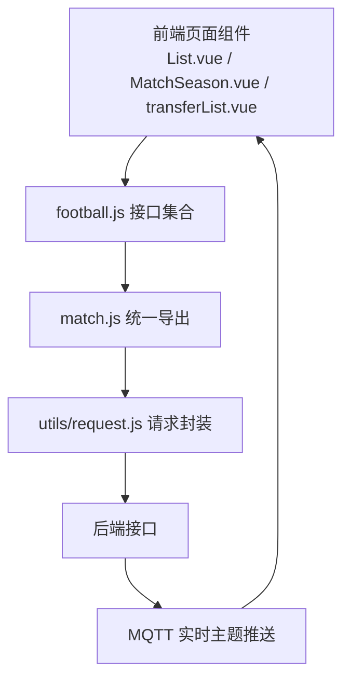
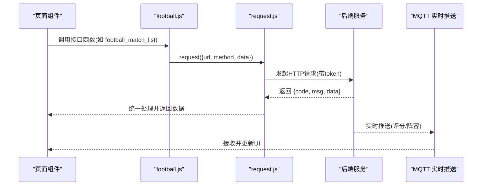
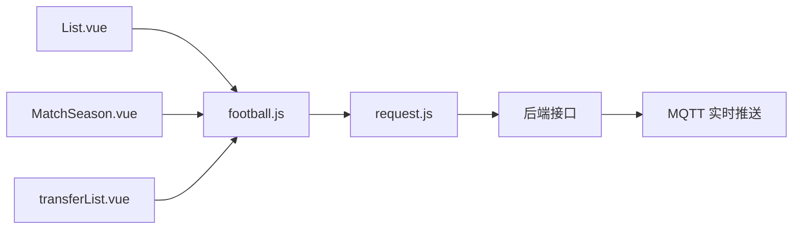

# 足球数据API

<cite>
**本文档引用的文件**
- [src/api/matchapi/ball/football.js](file://src/api/matchapi/ball/football.js)
- [src/api/match.js](file://src/api/match.js)
- [src/utils/request.js](file://src/utils/request.js)
- [src/views/match/football/List.vue](file://src/views/match/football/List.vue)
- [src/views/match/football/MatchSeason.vue](file://src/views/match/football/MatchSeason.vue)
- [src/views/match/football/components/databaselist/dataBase.vue](file://src/views/match/football/components/databaselist/dataBase.vue)
- [src/views/match/football/components/transferList.vue](file://src/views/match/football/components/transferList.vue)
- [public/mqttMsg.md](file://public/mqttMsg.md)
- [src/utils/dict/match.js](file://src/utils/dict/match.js)
</cite>

## 目录
1. [简介](#简介)
2. [项目结构](#项目结构)
3. [核心组件](#核心组件)
4. [架构总览](#架构总览)
5. [详细组件分析](#详细组件分析)
6. [依赖分析](#依赖分析)
7. [性能考虑](#性能考虑)
8. [故障排查指南](#故障排查指南)
9. [结论](#结论)
10. [附录](#附录)

## 简介
本文件为“足球数据模块”的完整API文档，覆盖比赛列表查询、球队信息管理、球员资料维护、联赛赛程安排、积分与排名、转会信息、实时评分与阵容、裁判与场馆、荣誉体系、竞彩指数、以及业务规则与数据模型等。文档以接口清单、调用流程、字段定义、业务规则与可视化图为支撑，帮助开发者快速理解并集成。

## 项目结构
- 接口集中于 matchapi/ball/football.js，统一导出至 match.js，再由各页面组件按需导入使用。
- 请求封装位于 utils/request.js，自动注入token并统一封装响应与错误处理。
- 页面组件通过调用 football.js 中的函数发起请求，如 List.vue 使用比赛列表、MatchSeason.vue 使用赛季列表与刷新、transferList.vue 使用转会列表等。
- 实时数据通过 MQTT 主题推送，如评分与阵容更新，详见 public/mqttMsg.md。

图表来源
- [src/api/matchapi/ball/football.js](file://src/api/matchapi/ball/football.js)
- [src/api/match.js](file://src/api/match.js)
- [src/utils/request.js](file://src/utils/request.js)
- [public/mqttMsg.md](file://public/mqttMsg.md)

章节来源
- [src/api/matchapi/ball/football.js](file://src/api/matchapi/ball/football.js)
- [src/api/match.js](file://src/api/match.js)
- [src/utils/request.js](file://src/utils/request.js)

## 核心组件
- 足球比赛列表查询：football_match_list
- 足球队伍列表与更新：football_team_list、football_update_team、football_reset_team、football_refresh_team、football_team_honors
- 队伍阵容：football_team_lineup、football_refresh_lineup
- 足球赛事列表与刷新：football_compe_list、football_refresh_competition
- 足球队员列表与更新：football_player_list、football_update_player、football_refresh_player
- 足球转会列表：football_transfer_list
- 足球赛季与阶段：football_season_list、football_stage_list、football_refresh_season
- 分类、教练、场馆、荣誉、国家、裁判：football_category_list、football_manager_list、football_venue_list、football_honor_list、football_country_list、football_referee_list
- 赛季积分与最佳：football_season_table_list、football_season_best_teams、football_season_best_player、football_season_best_lineup
- 俱乐部与FIFA排名：football_club_ranking、football_fifa_ranking
- 异常与状态：football_goal_alert_list、football_delete_goal_alert、football_status_alert_list
- 实时分析与报表：football_real_time_analytics、football_real_time_analytics_purchase、football_real_time_report
- 积分规则、刷新：football_competition_rule_list、football_refresh_referee、football_refresh_venue
- 教练与裁判历史：football_update_manager、football_refresh_manager、football_referee_history
- 资料库与重要：database_important_list、database_important_save
- GIF黑名单：gif_black_list、gif_black_save
- 球员身价：football_player_market
- 比赛Top：football_match_top
- 权重与人员：football_update_honor_weight、football_update_team_weight、football_team_person
- 足协/竞彩指数：football_jc_issue_list、football_jc_list、football_zc_issue_list、football_zc_list、football_bd_list、bd_sf_issue_list、bd_sf_list
- 其他：match_lineup、player_stat、player_stats、update_jczq_single_status、football_match_rating

章节来源
- [src/api/matchapi/ball/football.js](file://src/api/matchapi/ball/football.js)

## 架构总览
- 前端通过 football.js 提供的函数发起请求，请求经 utils/request.js 统一拦截与认证。
- 后端返回结构包含 code、msg、data 等通用字段；成功时 code=0。
- 实时数据通过 MQTT 主题 live/football/detail/{match_id}/match_rating 与 live/football/detail/{match_id}/lineup 推送。

图表来源
- [src/api/matchapi/ball/football.js](file://src/api/matchapi/ball/football.js)
- [src/utils/request.js](file://src/utils/request.js)
- [public/mqttMsg.md](file://public/mqttMsg.md)

## 详细组件分析

### 足球比赛数据接口
- 接口清单
  - 比赛列表：football_match_list
  - 进行中定位：football_active_match
  - 比赛详情直播TAB：football_match_detail
  - 比赛评分：football_match_rating
  - 队伍阵容：match_lineup
  - 单场球员统计：player_stat、player_stats
  - 比赛Top：football_match_top
  - 异常进球列表与删除：football_goal_alert_list、football_delete_goal_alert
  - 状态异常列表：football_status_alert_list
  - 更新单关状态：update_jczq_single_status

- 字段要点
  - 比赛时间、半场比分、全场比分、阶段、轮次、座位、中立场、备注、额外数据、删除标记、更新时间等。
  - 重要性标记（如 competition__level）用于筛选“重要”比赛。

- 调用示例路径
  - 获取比赛列表：[src/views/match/football/List.vue](file://src/views/match/football/List.vue)
  - 获取比赛详情直播TAB：[src/api/matchapi/ball/football.js](file://src/api/matchapi/ball/football.js)
  - 获取比赛评分：[src/api/matchapi/ball/football.js](file://src/api/matchapi/ball/football.js)

章节来源
- [src/api/matchapi/ball/football.js](file://src/api/matchapi/ball/football.js)
- [src/views/match/football/List.vue](file://src/views/match/football/List.vue)

### 足球队伍与阵容接口
- 接口清单
  - 队伍列表：football_team_list
  - 更新/重置/刷新队伍：football_update_team、football_reset_team、football_refresh_team
  - 队伍荣誉：football_team_honors
  - 队伍阵容：football_team_lineup、football_refresh_lineup
  - 队伍教练团队：football_team_person
  - 队伍权重：football_update_team_weight
  - 队伍伤残：football_team_injury

- 字段要点
  - 队伍ID、名称、简称、国家、颜色、教练、阵容、身价、平均年龄、阵型、坐标等。
  - 荣誉权重更新：football_update_honor_weight

- 调用示例路径
  - 队伍阵容刷新：[src/api/matchapi/ball/football.js](file://src/api/matchapi/ball/football.js)
  - 资料库队伍Tab：[src/views/match/football/components/databaselist/dataBase.vue](file://src/views/match/football/components/databaselist/dataBase.vue)

章节来源
- [src/api/matchapi/ball/football.js](file://src/api/matchapi/ball/football.js)
- [src/views/match/football/components/databaselist/dataBase.vue](file://src/views/match/football/components/databaselist/dataBase.vue)

### 足球球员与转会接口
- 接口清单
  - 球员列表：football_player_list
  - 更新/重置/刷新球员：football_update_player、football_reset_player、football_refresh_player
  - 球员荣誉：football_player_honors
  - 球员转会：football_player_trans
  - 转会列表：football_transfer_list
  - 球员身价：football_player_market
  - 教练与历史：football_update_manager、football_refresh_manager、football_manager_history
  - 教练荣誉：football_manager_honor

- 字段要点
  - 球员ID、姓名、位置、号码、国籍、年龄、惯用脚、身价、更新时间等。
  - 转会类型（租借/租借结束/转会/退役/选秀/解约/签约/未知）、费用、描述、时间等。

- 调用示例路径
  - 转会列表：[src/views/match/football/components/transferList.vue](file://src/views/match/football/components/transferList.vue)
  - 球员身价：[src/api/matchapi/ball/football.js](file://src/api/matchapi/ball/football.js)

章节来源
- [src/api/matchapi/ball/football.js](file://src/api/matchapi/ball/football.js)
- [src/views/match/football/components/transferList.vue](file://src/views/match/football/components/transferList.vue)

### 足球赛事与赛程接口
- 接口清单
  - 赛事列表：football_compe_list
  - 刷新赛事：football_refresh_competition
  - 赛季列表：football_season_list
  - 阶段列表：football_stage_list
  - 赛季刷新：football_refresh_season
  - 赛季最佳：football_season_best_teams、football_season_best_player、football_season_best_lineup
  - 赛季积分：football_season_table_list
  - 赛季信息：football_compe_season
  - 资料库概览：dataBase.vue

- 字段要点
  - 赛季起止时间、是否含球员/球队/积分统计、规则名称与文本、更新时间等。
  - 资料库包含：概览、赛季、积分榜、最佳球队、最佳球员、最佳阵容、动态。

- 调用示例路径
  - 赛季列表与刷新：[src/views/match/football/MatchSeason.vue](file://src/views/match/football/MatchSeason.vue)
  - 资料库详情：[src/views/match/football/components/databaselist/dataBase.vue](file://src/views/match/football/components/databaselist/dataBase.vue)

章节来源
- [src/api/matchapi/ball/football.js](file://src/api/matchapi/ball/football.js)
- [src/views/match/football/MatchSeason.vue](file://src/views/match/football/MatchSeason.vue)
- [src/views/match/football/components/databaselist/dataBase.vue](file://src/views/match/football/components/databaselist/dataBase.vue)

### 足球排名与荣誉接口
- 接口清单
  - 俱乐部排名：football_club_ranking
  - FIFA排名：football_fifa_ranking
  - 刷新FIFA/俱乐部排名：football_fix_fifa_ranking、football_fix_club_ranking
  - 荣誉列表：football_honor_list、football_honor_team_list、football_honor_player_list
  - 更新/重置/刷新荣誉：football_update_honor、football_reset_honor、football_refresh_honor
  - 荣誉权重：football_update_honor_weight

- 字段要点
  - 排名、积分、胜/平/负/得失球、最佳阵容/球员/球队等。

- 调用示例路径
  - 排名接口：[src/api/matchapi/ball/football.js](file://src/api/matchapi/ball/football.js)

章节来源
- [src/api/matchapi/ball/football.js](file://src/api/matchapi/ball/football.js)

### 足球指数与竞彩接口
- 接口清单
  - 竞彩期号/指数：football_jc_issue_list、football_jc_list
  - 足彩期号/指数：football_zc_issue_list、football_zc_list
  - 北单指数：football_bd_list、bd_sf_issue_list、bd_sf_list

- 字段要点
  - 期号、指数、玩法、状态等。

- 调用示例路径
  - 竞彩/足彩/北单接口：[src/api/matchapi/ball/football.js](file://src/api/matchapi/ball/football.js)

章节来源
- [src/api/matchapi/ball/football.js](file://src/api/matchapi/ball/football.js)

### 实时数据与业务规则
- 实时数据
  - 评分数据：live/football/detail/{match_id}/match_rating
  - 阵容数据：live/football/detail/{match_id}/lineup
  - 数据结构包含主队/客队/裁判/教练/场地/球员/伤停/身价/年龄/阵型/坐标/统计开关等。

- 业务规则
  - 比赛状态映射：未开赛、上半场、中场、下半场、加时、点球、完场、推迟、中断、腰斩、取消、待定等。
  - 重要事件类型：进球、黄牌、红牌、点球、换人、两黄一红、乌龙、VAR、点球大战等。
  - 转会类型枚举：租借、租借结束、转会、退役、选秀、解约、签约、未知等。

- 调用示例路径
  - 实时评分/阵容主题：[public/mqttMsg.md](file://public/mqttMsg.md)
  - 比赛状态映射：[src/utils/dict/match.js](file://src/utils/dict/match.js)
  - 重要事件类型：[src/utils/dict/match.js](file://src/utils/dict/match.js)

章节来源
- [public/mqttMsg.md](file://public/mqttMsg.md)
- [src/utils/dict/match.js](file://src/utils/dict/match.js)

## 依赖分析
- 模块耦合
  - 页面组件仅依赖 football.js 导出的函数，不直接依赖后端接口，便于扩展与维护。
  - football.js 依赖 utils/request.js 进行HTTP请求与认证。
  - 实时数据通过 MQTT 与HTTP接口互补，提升用户体验。

图表来源
- [src/views/match/football/List.vue](file://src/views/match/football/List.vue)
- [src/views/match/football/MatchSeason.vue](file://src/views/match/football/MatchSeason.vue)
- [src/views/match/football/components/transferList.vue](file://src/views/match/football/components/transferList.vue)
- [src/api/matchapi/ball/football.js](file://src/api/matchapi/ball/football.js)
- [src/utils/request.js](file://src/utils/request.js)
- [public/mqttMsg.md](file://public/mqttMsg.md)

章节来源
- [src/views/match/football/List.vue](file://src/views/match/football/List.vue)
- [src/views/match/football/MatchSeason.vue](file://src/views/match/football/MatchSeason.vue)
- [src/views/match/football/components/transferList.vue](file://src/views/match/football/components/transferList.vue)
- [src/api/matchapi/ball/football.js](file://src/api/matchapi/ball/football.js)
- [src/utils/request.js](file://src/utils/request.js)

## 性能考虑
- 请求超时与并发控制：统一在 request.js 中设置超时，避免长时间阻塞。
- 分页与懒加载：列表接口普遍支持分页参数，建议前端按需加载与缓存。
- 实时数据：MQTT推送减少轮询压力，但需注意消息堆积与去重策略。
- 大字段传输：如阵容、评分、统计等，建议按需请求与按Tab切换加载。

## 故障排查指南
- 常见错误码与提示
  - 401 未授权：检查token是否有效或过期。
  - 403 拒绝访问：确认权限与角色。
  - 404 接口不存在：核对URL与环境变量。
  - 500 服务器内部错误：查看后端日志与入参。
- 统一错误处理
  - request.js 对非200状态与非code=0进行提示，便于前端统一展示。
- 实时数据异常
  - 若评分/阵容不更新，检查MQTT连接与主题订阅是否正确。

章节来源
- [src/utils/request.js](file://src/utils/request.js)
- [public/mqttMsg.md](file://public/mqttMsg.md)

## 结论
本API文档系统化梳理了足球数据模块的接口、字段、业务规则与实时数据交互方式。通过清晰的接口命名、统一的请求封装与丰富的调用示例路径，开发者可快速集成比赛、队伍、球员、赛事、排名、荣誉、指数与实时数据等能力。

## 附录

### 接口调用示例路径索引
- 获取比赛列表：[src/views/match/football/List.vue](file://src/views/match/football/List.vue)
- 获取比赛详情直播TAB：[src/api/matchapi/ball/football.js](file://src/api/matchapi/ball/football.js)
- 获取比赛评分：[src/api/matchapi/ball/football.js](file://src/api/matchapi/ball/football.js)
- 队伍阵容刷新：[src/api/matchapi/ball/football.js](file://src/api/matchapi/ball/football.js)
- 资料库详情：[src/views/match/football/components/databaselist/dataBase.vue](file://src/views/match/football/components/databaselist/dataBase.vue)
- 转会列表：[src/views/match/football/components/transferList.vue](file://src/views/match/football/components/transferList.vue)
- 竞彩/足彩/北单接口：[src/api/matchapi/ball/football.js](file://src/api/matchapi/ball/football.js)

### 实时数据主题
- 评分数据：live/football/detail/{match_id}/match_rating
- 阵容数据：live/football/detail/{match_id}/lineup

章节来源
- [src/views/match/football/List.vue](file://src/views/match/football/List.vue)
- [src/views/match/football/components/databaselist/dataBase.vue](file://src/views/match/football/components/databaselist/dataBase.vue)
- [src/views/match/football/components/transferList.vue](file://src/views/match/football/components/transferList.vue)
- [src/api/matchapi/ball/football.js](file://src/api/matchapi/ball/football.js)
- [public/mqttMsg.md](file://public/mqttMsg.md)