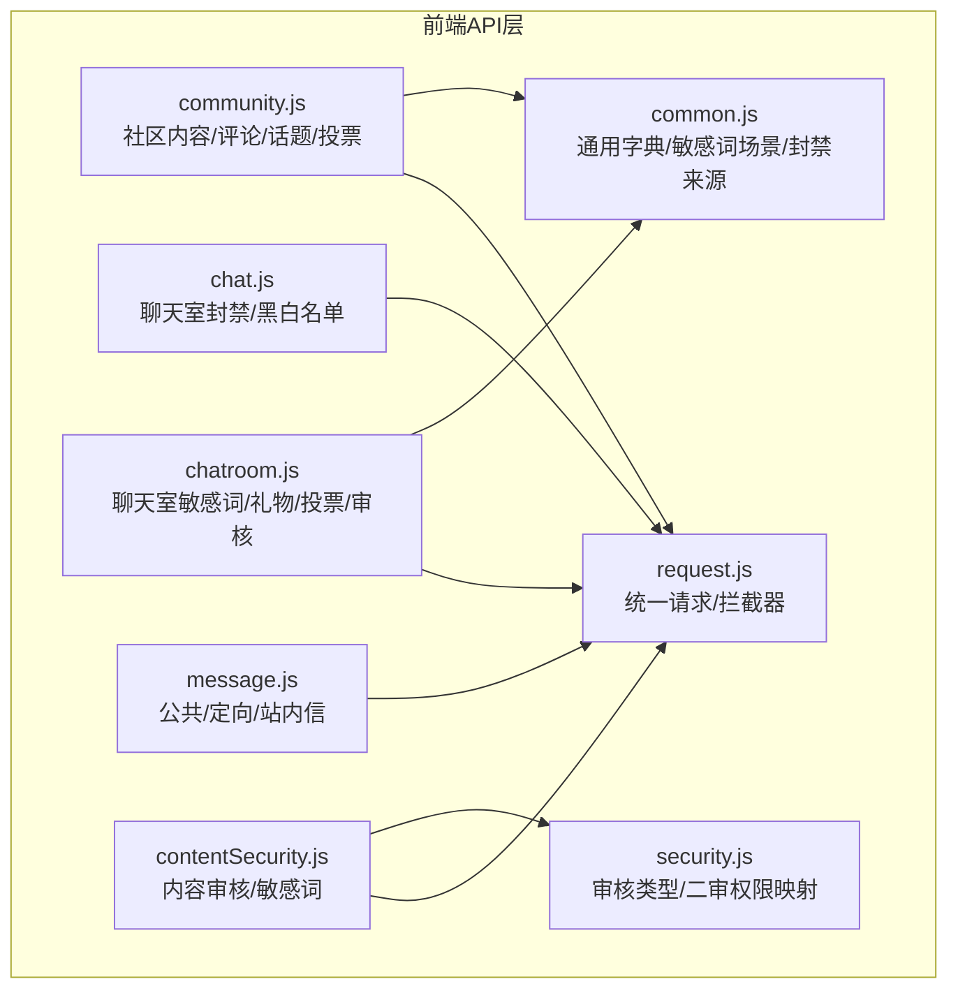
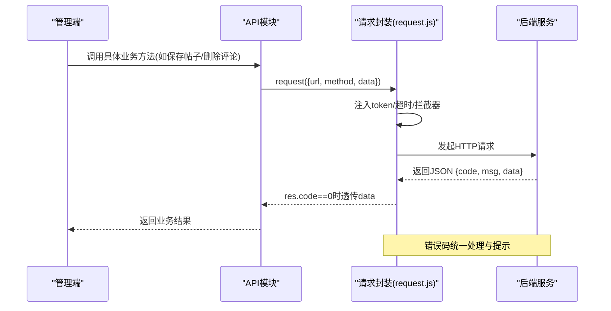
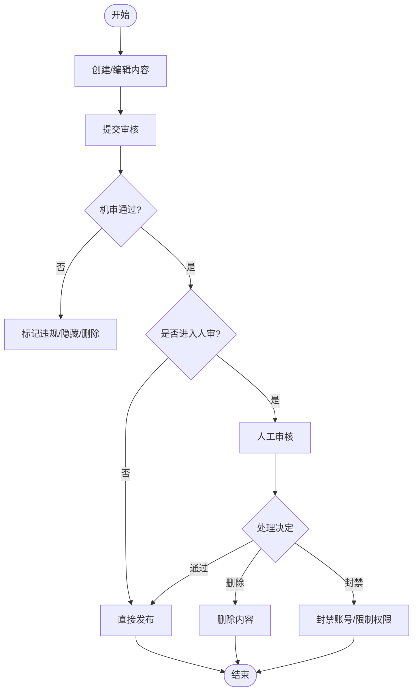
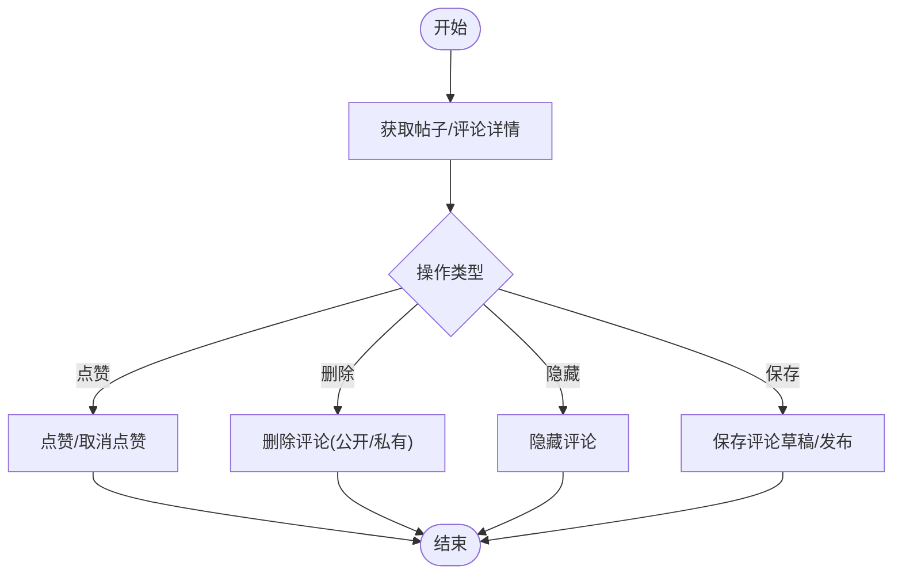
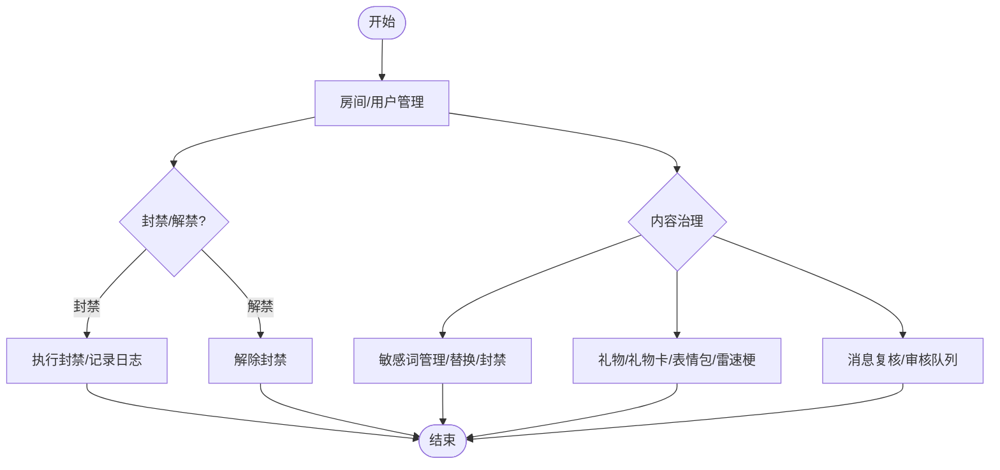
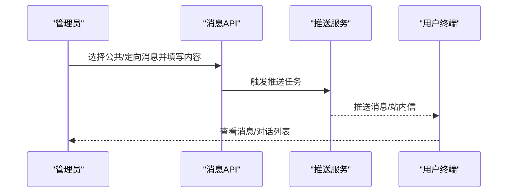
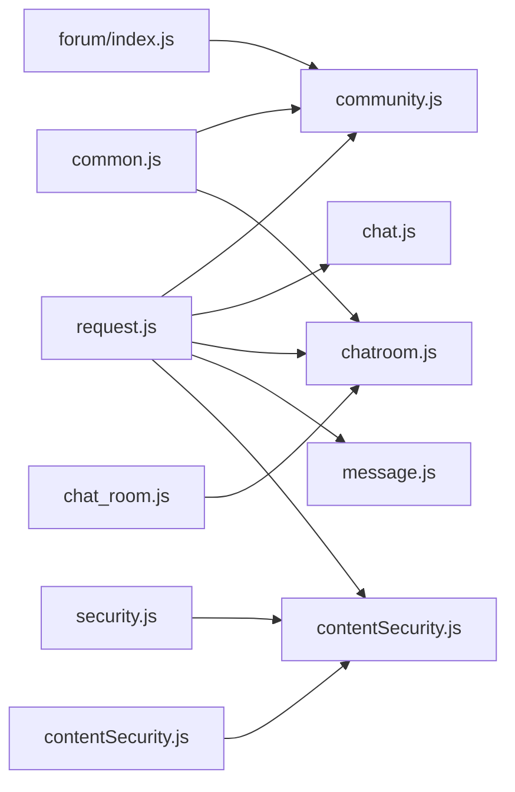

# 内容管理API

<cite>
**本文引用的文件**
- [community.js](file://src/api/community.js)
- [chat.js](file://src/api/chat.js)
- [chatroom.js](file://src/api/chatroom.js)
- [message.js](file://src/api/message.js)
- [contentSecurity.js](file://src/api/contentSecurity.js)
- [request.js](file://src/utils/request.js)
- [security.js](file://src/utils/dict/security.js)
- [common.js](file://src/utils/dict/common.js)
- [forum/index.js](file://src/router/children/forum/index.js)
- [chat_room.js](file://src/router/children/chat_room.js)
- [contentSecurity.js](file://src/router/children/contentSecurity.js)
</cite>

## 目录
1. [简介](#简介)
2. [项目结构](#项目结构)
3. [核心组件](#核心组件)
4. [架构总览](#架构总览)
5. [详细组件分析](#详细组件分析)
6. [依赖关系分析](#依赖关系分析)
7. [性能考量](#性能考量)
8. [故障排查指南](#故障排查指南)
9. [结论](#结论)
10. [附录](#附录)

## 简介
本文件面向内容管理模块，系统化梳理社区内容、聊天消息、聊天室、系统消息及内容安全相关接口的API规范，覆盖内容发布、内容审核、评论管理、消息推送、敏感词治理、封禁与权限控制等能力。文档提供接口调用示例、数据模型说明、业务流程图与常见问题排查建议，帮助开发者快速集成与运维。

## 项目结构
内容管理相关API集中在以下模块：
- 社区内容与评论：community.js
- 聊天室消息与权限：chat.js、chatroom.js
- 系统消息与站内信：message.js
- 内容安全与敏感词：contentSecurity.js
- 请求封装与字典：request.js、security.js、common.js
- 路由导航（角色与菜单）：forum/index.js、chat_room.js、contentSecurity.js

图表来源
- [community.js:1-676](file://src/api/community.js#L1-L676)
- [chat.js:1-72](file://src/api/chat.js#L1-L72)
- [chatroom.js:1-351](file://src/api/chatroom.js#L1-L351)
- [message.js:1-96](file://src/api/message.js#L1-L96)
- [contentSecurity.js:1-115](file://src/api/contentSecurity.js#L1-L115)
- [request.js:1-130](file://src/utils/request.js#L1-L130)
- [security.js:1-23](file://src/utils/dict/security.js#L1-L23)
- [common.js:1-712](file://src/utils/dict/common.js#L1-L712)

章节来源
- [community.js:1-676](file://src/api/community.js#L1-L676)
- [chat.js:1-72](file://src/api/chat.js#L1-L72)
- [chatroom.js:1-351](file://src/api/chatroom.js#L1-L351)
- [message.js:1-96](file://src/api/message.js#L1-L96)
- [contentSecurity.js:1-115](file://src/api/contentSecurity.js#L1-L115)
- [request.js:1-130](file://src/utils/request.js#L1-L130)
- [security.js:1-23](file://src/utils/dict/security.js#L1-L23)
- [common.js:1-712](file://src/utils/dict/common.js#L1-L712)

## 核心组件
- 社区内容与评论
  - 帖子列表、详情、置顶/隐藏/锁定/删除
  - 评论列表、点赞、删除/隐藏、保存评论
  - 圈子/分类管理、热门话题、投票、互动收入、周卡交易与趋势
- 聊天室
  - 封禁/解禁、白/黑名单、举报记录、禁言记录
  - 敏感词、礼物/礼物卡、表情包/雷速梗、投票
  - 审核队列、消息复核、机器人文案
- 系统消息
  - 公共消息、定向消息、站内信收发与会话清理
- 内容安全
  - 机审/人审队列、二审处理、敏感词管理、误判忽略、漏审上报

章节来源
- [community.js:1-676](file://src/api/community.js#L1-L676)
- [chat.js:1-72](file://src/api/chat.js#L1-L72)
- [chatroom.js:1-351](file://src/api/chatroom.js#L1-L351)
- [message.js:1-96](file://src/api/message.js#L1-L96)
- [contentSecurity.js:1-115](file://src/api/contentSecurity.js#L1-L115)

## 架构总览
统一通过请求封装进行HTTP调用，自动注入token并处理响应错误码与提示；路由侧按角色控制菜单与页面访问。

图表来源
- [request.js:1-130](file://src/utils/request.js#L1-L130)
- [community.js:1-676](file://src/api/community.js#L1-L676)
- [chatroom.js:1-351](file://src/api/chatroom.js#L1-L351)
- [message.js:1-96](file://src/api/message.js#L1-L96)
- [contentSecurity.js:1-115](file://src/api/contentSecurity.js#L1-L115)

## 详细组件分析

### 社区内容与评论API
- 列表与详情
  - 帖子列表/详情、V2详情
  - 评论列表、评论详情
  - 圈子/分类/首页置顶/热门推荐
- 发布与管理
  - 保存帖子/保存帖子V2
  - 置顶/隐藏/锁定/删除
  - 修改分类、修改直播时间范围
- 互动与运营
  - 互动用户/可达用户、直播权限增删改
  - 打赏用户、打赏记录、互动收入
  - 点赞详情、投票/投票详情/投票成员
  - 周卡购买/趋势/退款/回收/恢复/榜单
  - 热门话题列表/详情/评论/排序/保存
- 审核与监控
  - 机审/人审队列、举报记录、禁言记录、操作记录
  - 敏感词列表/新增/删除
  - 互动直播/媒体审核/社区监控

接口调用示例（路径参考）
- 获取帖子详情：[get_post_detail:67-80](file://src/api/community.js#L67-L80)
- 保存评论：[save_comment:271-278](file://src/api/community.js#L271-L278)
- 删除评论（公开）：[deleteComment_pub:120-126](file://src/api/community.js#L120-L126)
- 圈子详情：[catalogDetail:613-618](file://src/api/community.js#L613-L618)
- 热门话题保存：[save_topic:488-494](file://src/api/community.js#L488-L494)
- 周卡购买列表：[week_card_purchase_list:496-502](file://src/api/community.js#L496-L502)

章节来源
- [community.js:1-676](file://src/api/community.js#L1-L676)

### 聊天室API
- 基础管理
  - 封禁/解禁、白/黑名单、举报记录、禁言记录
  - 房间历史/用户历史、礼物/礼物卡、表情包/雷速梗
- 审核与内容治理
  - 审核队列、消息复核、敏感词列表/新增/删除
  - 投票列表/详情/删除/保存/成员
- 机器人与运营
  - 机器人分类、文案列表/新增/删除
  - 购买记录与趋势

接口调用示例（路径参考）
- 聊天室封禁：[chatban:3-9](file://src/api/chat.js#L3-L9)
- 聊天室解禁：[chatunban:11-17](file://src/api/chat.js#L11-L17)
- 敏感词列表：[getSensitiveWordList:6-11](file://src/api/chatroom.js#L6-L11)
- 礼物卡列表：[gift_card_list:139-146](file://src/api/chatroom.js#L139-L146)
- 保存礼物卡：[save_gift_card:147-154](file://src/api/chatroom.js#L147-L154)
- 发放礼物卡：[send_gift:155-162](file://src/api/chatroom.js#L155-L162)
- 审核队列：[auditing_list:83-88](file://src/api/chatroom.js#L83-L88)
- 消息复核：[check_msg:109-115](file://src/api/chatroom.js#L109-L115)

章节来源
- [chat.js:1-72](file://src/api/chat.js#L1-L72)
- [chatroom.js:1-351](file://src/api/chatroom.js#L1-L351)

### 系统消息API
- 公共消息
  - 查询/删除/保存公共消息
- 定向消息
  - 查询/删除/保存定向消息
- 站内信
  - 发送站内信、查询对话/消息、删除会话/单条消息
  - 我收到的赞/回复

接口调用示例（路径参考）
- 公共消息列表：[getPublic:3-9](file://src/api/message.js#L3-L9)
- 保存公共消息：[savePublic:17-23](file://src/api/message.js#L17-L23)
- 发送站内信：[send_inbox_msg:47-53](file://src/api/message.js#L47-L53)
- 对话列表：[inbox_dialogs:61-67](file://src/api/message.js#L61-L67)
- 删除会话：[del_msg_room:68-74](file://src/api/message.js#L68-L74)

章节来源
- [message.js:1-96](file://src/api/message.js#L1-L96)

### 内容安全API
- 机审/人审
  - 机审队列、二审队列、二审处理、忽略机审、漏审上报
- 敏感词
  - 敏感词列表、新增、删除

接口调用示例（路径参考）
- 机审队列：[moderate_moderation:29-35](file://src/api/contentSecurity.js#L29-L35)
- 二审队列：[moderate_moderation_second:46-52](file://src/api/contentSecurity.js#L46-L52)
- 二审处理：[moderate_handler_moderation_second:64-70](file://src/api/contentSecurity.js#L64-L70)
- 忽略机审：[moderate_ignore_moderation:73-79](file://src/api/contentSecurity.js#L73-L79)
- 敏感词列表：[moderate_sensitive_word_list:82-87](file://src/api/contentSecurity.js#L82-L87)
- 新增敏感词：[moderate_add_sensitive_word:90-96](file://src/api/contentSecurity.js#L90-L96)
- 删除敏感词：[moderate_delete_sensitive_word:99-105](file://src/api/contentSecurity.js#L99-L105)

章节来源
- [contentSecurity.js:1-115](file://src/api/contentSecurity.js#L1-L115)

### 数据模型与字段定义
- 帖子/评论/话题/投票
  - 字段要点：标识、作者、内容、附件、状态、时间、热度、权限等
  - 参考：帖子详情V2、评论详情、投票详情、热门话题详情
- 聊天室
  - 字段要点：房间、用户、消息、礼物、表情包、敏感词、举报、禁言、审核
- 系统消息
  - 字段要点：类型、目标、内容、附件、发送时间、状态
- 内容安全
  - 字段要点：审核类型、命中规则、处理结果、封禁来源/权限映射

章节来源
- [community.js:67-80](file://src/api/community.js#L67-L80)
- [community.js:279-285](file://src/api/community.js#L279-L285)
- [chatroom.js:210-216](file://src/api/chatroom.js#L210-L216)
- [message.js:47-96](file://src/api/message.js#L47-L96)
- [security.js:1-23](file://src/utils/dict/security.js#L1-L23)
- [common.js:588-611](file://src/utils/dict/common.js#L588-L611)

### 业务流程图

#### 内容发布与审核流程

#### 评论管理流程

#### 聊天室管理流程

#### 系统消息推送流程

## 依赖关系分析
- 统一请求封装
  - 自动注入token、统一错误提示、跨域与超时配置
- 字典与权限
  - 审核类型、二审权限映射、封禁来源、敏感词场景
- 路由与角色
  - 社区/聊天室/内容安全模块均通过路由meta.roles控制访问

图表来源
- [request.js:1-130](file://src/utils/request.js#L1-L130)
- [security.js:1-23](file://src/utils/dict/security.js#L1-L23)
- [common.js:1-712](file://src/utils/dict/common.js#L1-L712)
- [forum/index.js:1-230](file://src/router/children/forum/index.js#L1-L230)
- [chat_room.js:1-90](file://src/router/children/chat_room.js#L1-L90)
- [contentSecurity.js:1-44](file://src/router/children/contentSecurity.js#L1-L44)

章节来源
- [request.js:1-130](file://src/utils/request.js#L1-L130)
- [security.js:1-23](file://src/utils/dict/security.js#L1-L23)
- [common.js:1-712](file://src/utils/dict/common.js#L1-L712)
- [forum/index.js:1-230](file://src/router/children/forum/index.js#L1-L230)
- [chat_room.js:1-90](file://src/router/children/chat_room.js#L1-L90)
- [contentSecurity.js:1-44](file://src/router/children/contentSecurity.js#L1-L44)

## 性能考量
- 请求超时与并发
  - 统一超时配置，避免长时间阻塞；对批量操作建议分页/节流
- 错误码与提示
  - 后端返回非成功码时统一提示，前端避免重复请求
- 附件与富文本
  - 上传附件建议采用分片/断点续传策略，减少失败重试成本

## 故障排查指南
- 常见错误码与提示
  - 统一在请求拦截器中处理，出现异常时检查网络状态与后端日志
- 权限不足
  - 检查路由角色配置与用户权限，确保具备对应操作权限
- 审核异常
  - 机审/人审队列为空或处理不及时，检查队列状态与人工处理时效

章节来源
- [request.js:46-127](file://src/utils/request.js#L46-L127)
- [forum/index.js:165-229](file://src/router/children/forum/index.js#L165-L229)
- [chat_room.js:67-89](file://src/router/children/chat_room.js#L67-L89)
- [contentSecurity.js:32-44](file://src/router/children/contentSecurity.js#L32-L44)

## 结论
内容管理API围绕“社区内容/评论”、“聊天室/消息”、“系统消息”、“内容安全”四大领域构建，配合统一请求封装与字典权限体系，形成可扩展、可审计的内容治理能力。建议在生产环境中结合业务场景完善埋点与告警，并持续优化审核与敏感词策略。

## 附录

### 接口调用示例（路径参考）
- 社区
  - 保存帖子：[savePost:142-148](file://src/api/community.js#L142-L148)
  - 删除评论（公开）：[deleteComment_pub:120-126](file://src/api/community.js#L120-L126)
  - 圈子保存：[saveGroupCatalog:620-626](file://src/api/community.js#L620-L626)
  - 热门话题保存：[save_topic:488-494](file://src/api/community.js#L488-L494)
  - 周卡退款：[weekcard_refund:512-518](file://src/api/community.js#L512-L518)
- 聊天室
  - 聊天室封禁：[chatban:3-9](file://src/api/chat.js#L3-L9)
  - 敏感词列表：[getSensitiveWordList:6-11](file://src/api/chatroom.js#L6-L11)
  - 礼物卡发放：[send_gift:155-162](file://src/api/chatroom.js#L155-L162)
  - 审核队列：[auditing_list:83-88](file://src/api/chatroom.js#L83-L88)
- 系统消息
  - 发送站内信：[send_inbox_msg:47-53](file://src/api/message.js#L47-L53)
  - 删除会话：[del_msg_room:68-74](file://src/api/message.js#L68-L74)
- 内容安全
  - 机审队列：[moderate_moderation:29-35](file://src/api/contentSecurity.js#L29-L35)
  - 敏感词新增：[moderate_add_sensitive_word:90-96](file://src/api/contentSecurity.js#L90-L96)