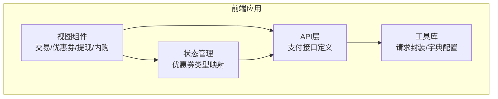
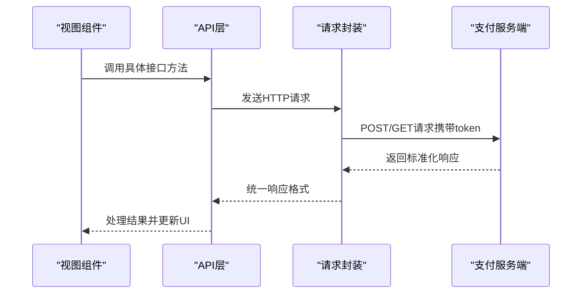
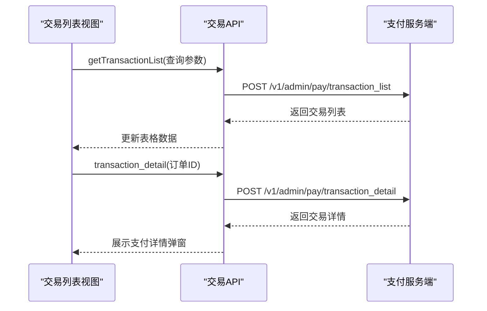
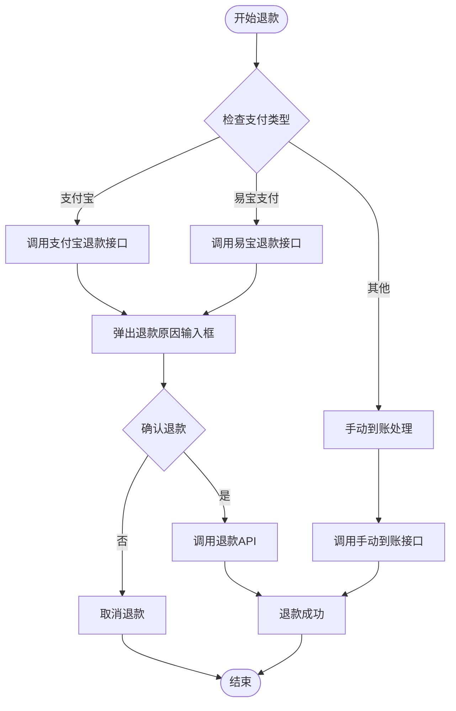
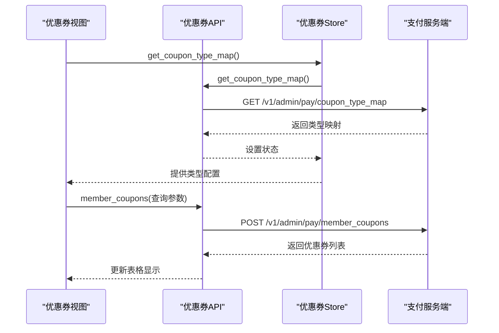
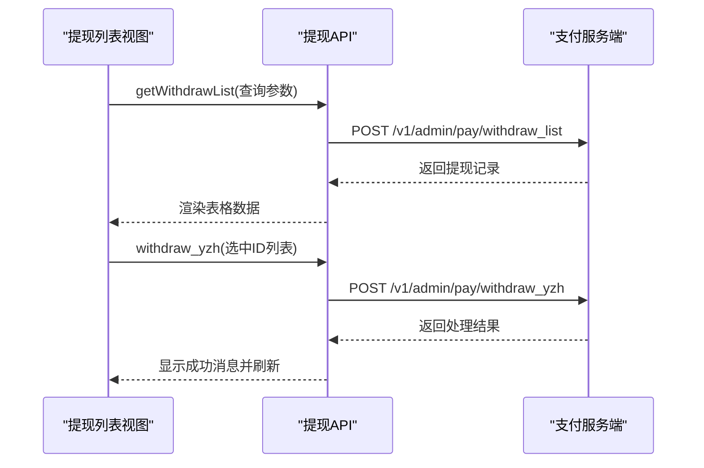
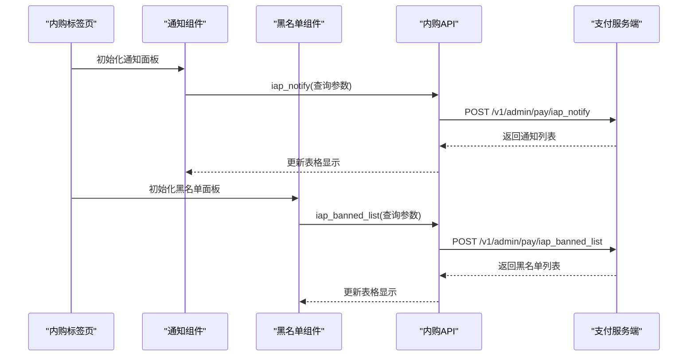
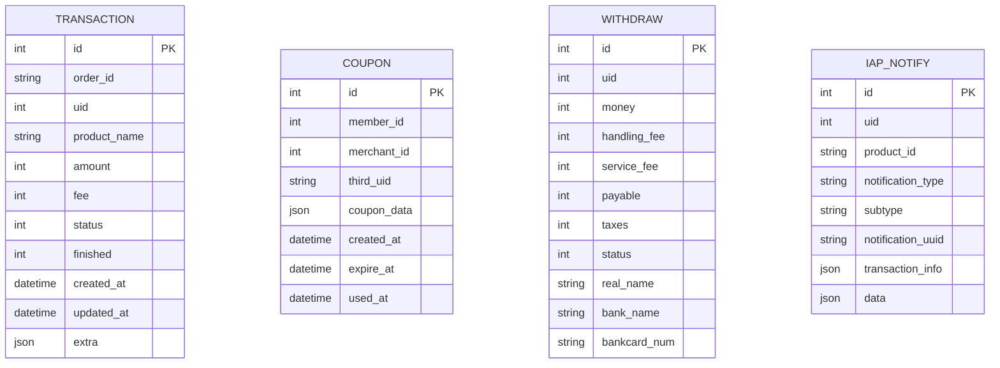
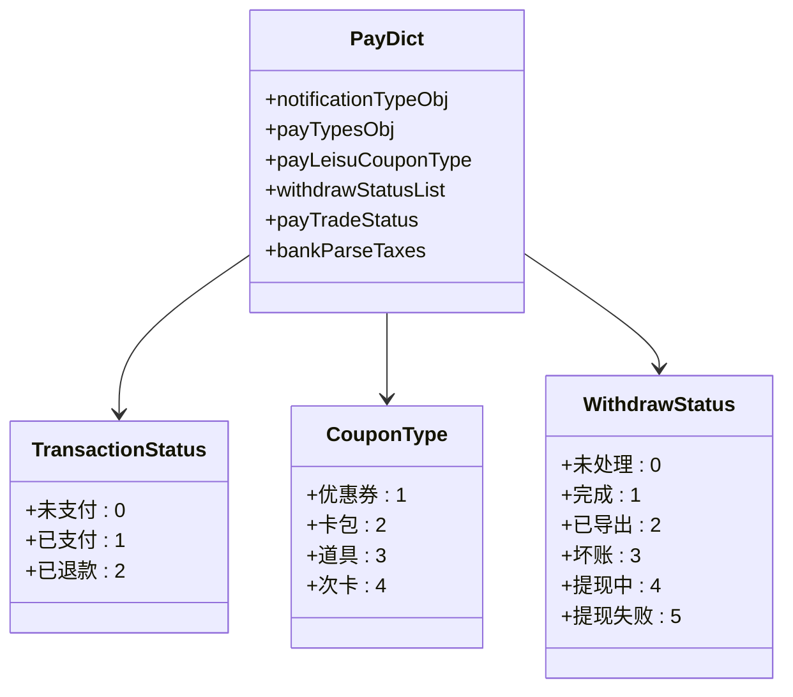

# 支付管理API

<cite>
**本文档引用的文件**
- [支付API定义](file://src/api/pay.js)
- [支付字典配置](file://src/utils/dict/pay.js)
- [请求封装与拦截器](file://src/utils/request.js)
- [支付Store模块](file://src/store/modules/pay.js)
- [交易记录列表视图](file://src/views/pay/transactionlist.vue)
- [优惠券管理视图](file://src/views/pay/leisu_coupon.vue)
- [提现列表视图](file://src/views/pay/withdraw_list.vue)
- [苹果内购通知视图](file://src/views/pay/iapNotifyTab.vue)
- [苹果内购通知组件](file://src/components/leisu/peopleInfo/shopping/components/oders/iapNotify.vue)
- [苹果内购黑名单组件](file://src/components/leisu/peopleInfo/shopping/components/oders/iapBlack.vue)
</cite>

## 目录
1. [简介](#简介)
2. [项目结构](#项目结构)
3. [核心组件](#核心组件)
4. [架构概览](#架构概览)
5. [详细组件分析](#详细组件分析)
6. [依赖关系分析](#依赖关系分析)
7. [性能考虑](#性能考虑)
8. [故障排除指南](#故障排除指南)
9. [结论](#结论)

## 简介
本文件为支付管理模块的详细API文档，涵盖交易记录查询、退款处理、苹果内购管理、优惠券管理等核心功能。文档基于前端源码分析，提供接口规范、调用示例、安全机制说明以及最佳实践指导。

## 项目结构
支付管理相关代码主要分布在以下位置：
- API层：统一在 `src/api/pay.js` 中定义所有支付相关接口
- 视图层：交易记录、优惠券、提现、苹果内购等功能对应的Vue组件
- 工具层：请求封装、字典配置、状态映射等
- 状态管理：优惠券类型映射的Vuex模块

**图表来源**
- [支付API定义:1-532](file://src/api/pay.js#L1-L532)
- [支付Store模块:1-33](file://src/store/modules/pay.js#L1-L33)
- [请求封装与拦截器:1-130](file://src/utils/request.js#L1-L130)

**章节来源**
- [支付API定义:1-532](file://src/api/pay.js#L1-L532)
- [支付Store模块:1-33](file://src/store/modules/pay.js#L1-L33)
- [请求封装与拦截器:1-130](file://src/utils/request.js#L1-L130)

## 核心组件
本模块包含以下核心功能组件：
- 交易记录管理：支持查询、退款、手动到账等操作
- 优惠券管理：支持发放、批量发放、使用统计等
- 提现管理：支持多渠道提现、批量签约、状态管理
- 苹果内购管理：支持通知监控、黑名单管理、异常充值处理

**章节来源**
- [交易记录列表视图:1-307](file://src/views/pay/transactionlist.vue#L1-L307)
- [优惠券管理视图:1-395](file://src/views/pay/leisu_coupon.vue#L1-L395)
- [提现列表视图:1-530](file://src/views/pay/withdraw_list.vue#L1-L530)

## 架构概览
支付模块采用前后端分离架构，前端通过统一的API层进行接口调用，使用Axios进行HTTP请求，并通过拦截器统一处理认证、错误和响应格式。

**图表来源**
- [支付API定义:1-532](file://src/api/pay.js#L1-L532)
- [请求封装与拦截器:22-68](file://src/utils/request.js#L22-L68)

## 详细组件分析

### 交易记录查询与管理

#### 接口规范
- **交易记录列表查询**
  - 方法：POST
  - 路径：`/v1/admin/pay/transaction_list`
  - 请求参数：分页、排序、过滤条件
  - 响应格式：标准响应对象，包含数据数组和总数

- **交易详情查询**
  - 方法：POST
  - 路径：`/v1/admin/pay/transaction_detail`
  - 请求参数：订单ID、支付类型
  - 响应格式：标准响应对象，包含交易详情

- **手动到账处理**
  - 方法：POST
  - 路径：`/v1/admin/pay/complete_transaction`
  - 请求参数：交易ID
  - 响应格式：标准响应对象

**图表来源**
- [交易记录列表视图:253-270](file://src/views/pay/transactionlist.vue#L253-L270)
- [支付API定义:3-17](file://src/api/pay.js#L3-L17)

**章节来源**
- [支付API定义:3-17](file://src/api/pay.js#L3-L17)
- [交易记录列表视图:138-270](file://src/views/pay/transactionlist.vue#L138-L270)

#### 退款处理流程
系统支持多种支付方式的退款处理：

**图表来源**
- [交易记录列表视图:287-303](file://src/views/pay/transactionlist.vue#L287-L303)
- [支付API定义:453-459](file://src/api/pay.js#L453-L459)

**章节来源**
- [交易记录列表视图:199-303](file://src/views/pay/transactionlist.vue#L199-L303)
- [支付API定义:453-459](file://src/api/pay.js#L453-L459)

### 优惠券管理

#### 接口规范
- **用户优惠券查询**
  - 方法：POST
  - 路径：`/v1/admin/pay/member_coupons`
  - 请求参数：用户ID、优惠券类型、状态等
  - 响应格式：标准响应对象，包含优惠券列表

- **批量发放优惠券**
  - 方法：POST
  - 路径：`/v1/admin/pay/create_coupon_batch`
  - 请求参数：用户列表、优惠券配置
  - 响应格式：标准响应对象

- **道具卡管理**
  - 删除道具卡：`/v1/admin/pay/delete_prop`
  - 创建互动道具：`/v1/admin/pay/create_interact_prop`

**图表来源**
- [优惠券管理视图:345-356](file://src/views/pay/leisu_coupon.vue#L345-L356)
- [支付Store模块:14-25](file://src/store/modules/pay.js#L14-L25)
- [支付API定义:95-109](file://src/api/pay.js#L95-L109)

**章节来源**
- [支付API定义:95-109](file://src/api/pay.js#L95-L109)
- [支付Store模块:1-33](file://src/store/modules/pay.js#L1-L33)
- [优惠券管理视图:193-356](file://src/views/pay/leisu_coupon.vue#L193-L356)

### 提现管理

#### 接口规范
- **提现列表查询**
  - 方法：POST
  - 路径：`/v1/admin/pay/withdraw_list`
  - 请求参数：分页、状态、渠道等
  - 响应格式：标准响应对象

- **批量提现处理**
  - 云账户提现：`/v1/admin/pay/withdraw_yzh`
  - 身边云提现：`/v1/admin/pay/withdraw_sby`

- **批量签约**
  - 方法：POST
  - 路径：`/v1/admin/pay/sign_channel`
  - 请求参数：用户ID列表、签约渠道

**图表来源**
- [提现列表视图:376-398](file://src/views/pay/withdraw_list.vue#L376-L398)
- [支付API定义:275-281](file://src/api/pay.js#L275-L281)

**章节来源**
- [支付API定义:46-93](file://src/api/pay.js#L46-L93)
- [提现列表视图:271-526](file://src/views/pay/withdraw_list.vue#L271-L526)

### 苹果内购管理

#### 接口规范
- **内购通知查询**
  - 方法：POST
  - 路径：`/v1/admin/pay/iap_notify`
  - 请求参数：用户ID、商品ID、通知类型等

- **内购历史查询**
  - 方法：GET
  - 路径：`/v1/admin/pay/iap_transaction_history`
  - 请求参数：查询条件

- **退款历史查询**
  - 方法：GET
  - 路径：`/v1/admin/pay/iap_refund_history`
  - 请求参数：查询条件

- **黑名单管理**
  - 添加/删除黑名单：`/v1/admin/pay/save_iap_banned`
  - 黑名单列表：`/v1/admin/pay/iap_banned_list`

**图表来源**
- [苹果内购通知视图:1-37](file://src/views/pay/iapNotifyTab.vue#L1-L37)
- [苹果内购通知组件:179-187](file://src/components/leisu/peopleInfo/shopping/components/oders/iapNotify.vue#L179-L187)
- [苹果内购黑名单组件:154-162](file://src/components/leisu/peopleInfo/shopping/components/oders/iapBlack.vue#L154-L162)

**章节来源**
- [支付API定义:439-491](file://src/api/pay.js#L439-L491)
- [苹果内购通知组件:96-188](file://src/components/leisu/peopleInfo/shopping/components/oders/iapNotify.vue#L96-L188)
- [苹果内购黑名单组件:83-206](file://src/components/leisu/peopleInfo/shopping/components/oders/iapBlack.vue#L83-L206)

## 依赖关系分析

### 数据模型与状态映射

### 支付状态与字典配置

系统通过统一的字典配置管理各种状态和类型映射：

**图表来源**
- [支付字典配置:1-114](file://src/utils/dict/pay.js#L1-L114)

**章节来源**
- [支付字典配置:1-114](file://src/utils/dict/pay.js#L1-L114)

## 性能考虑
- **请求缓存策略**：优惠券类型映射通过localStorage缓存，减少重复请求
- **分页加载**：所有列表接口均支持分页，避免一次性加载大量数据
- **按需渲染**：表格组件支持动态高度计算，提升大数据量下的渲染性能
- **批量操作优化**：提现列表支持批量选择和批量处理，提高操作效率

## 故障排除指南

### 常见问题与解决方案

#### 认证相关问题
- **401未授权**：检查token是否正确设置，重新登录获取新token
- **403拒绝访问**：确认用户权限，检查角色是否具备相应操作权限

#### 接口调用问题
- **404接口不存在**：检查API路径是否正确，确认服务端接口是否存在
- **500服务器错误**：查看服务端日志，检查请求参数格式

#### 业务逻辑问题
- **退款失败**：检查订单状态是否为已支付，确认支付方式支持退款
- **提现异常**：核对银行信息完整性，确认用户已签约对应渠道

**章节来源**
- [请求封装与拦截器:69-126](file://src/utils/request.js#L69-L126)

## 结论
支付管理模块提供了完整的支付生态管理能力，包括交易管理、优惠券运营、提现处理和苹果内购监控等功能。通过统一的API设计和完善的错误处理机制，确保了系统的稳定性和可维护性。建议在实际使用中重点关注接口参数校验、权限控制和异常处理，以确保支付业务的安全可靠运行。