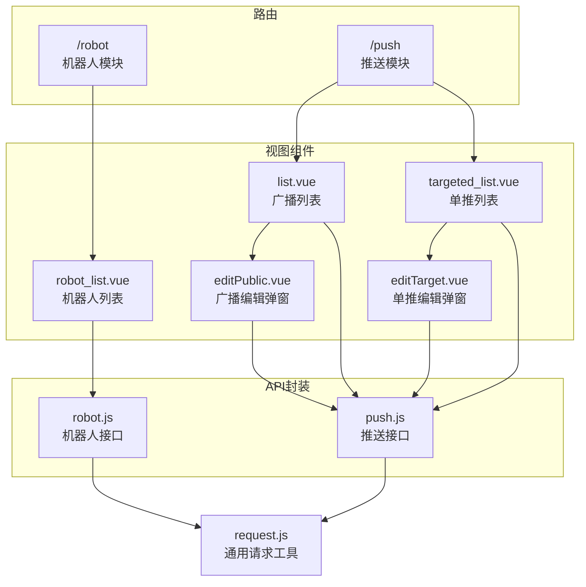
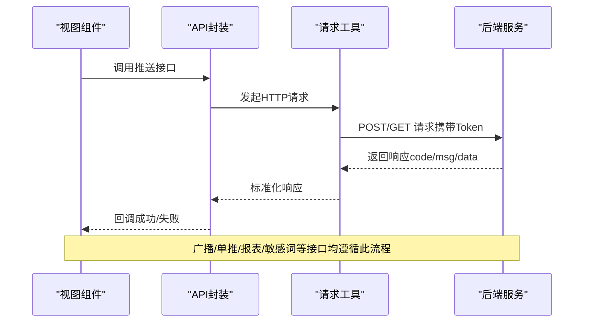
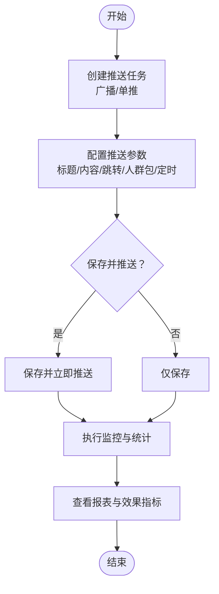
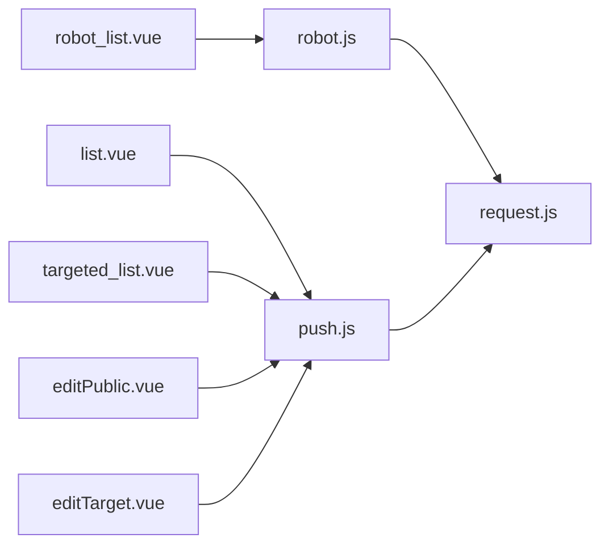

# 机器人推送API

<cite>
**本文引用的文件**
- [src/api/robot.js](file://src/api/robot.js)
- [src/api/push.js](file://src/api/push.js)
- [src/router/children/robot.js](file://src/router/children/robot.js)
- [src/router/children/push.js](file://src/router/children/push.js)
- [src/utils/request.js](file://src/utils/request.js)
- [src/views/robot/robot_list.vue](file://src/views/robot/robot_list.vue)
- [src/views/push/list.vue](file://src/views/push/list.vue)
- [src/views/push/targeted_list.vue](file://src/views/push/targeted_list.vue)
- [src/views/push/components/editPublic.vue](file://src/views/push/components/editPublic.vue)
- [src/views/push/components/editTarget.vue](file://src/views/push/components/editTarget.vue)
- [src/utils/tool.js](file://src/utils/tool.js)
</cite>

## 目录
1. [简介](#简介)
2. [项目结构](#项目结构)
3. [核心组件](#核心组件)
4. [架构总览](#架构总览)
5. [详细组件分析](#详细组件分析)
6. [依赖关系分析](#依赖关系分析)
7. [性能考量](#性能考量)
8. [故障排查指南](#故障排查指南)
9. [结论](#结论)
10. [附录](#附录)

## 简介
本文件面向“机器人推送模块”的后端接口与前端调用，系统性梳理以下能力：
- 机器人管理：机器人列表、编辑、比赛/预测号文章创建、选项查询等
- 推送管理：广播推送、单推、推送报表、敏感词管理等
- 信息管理：推送任务创建、编辑、执行、效果追踪与统计
- 数据模型：机器人信息、推送任务、推送记录、信息内容等字段说明
- 业务流程：任务创建、执行监控、结果统计、效果分析

本API文档以仓库现有代码为依据，结合前端页面与API封装，提供接口规范、调用示例路径与实现要点。

## 项目结构
围绕机器人与推送功能，前端采用“路由分组 + API封装 + 视图组件”的组织方式：
- 路由分组：在子路由中分别挂载“机器人”和“推送”模块
- API封装：统一在API层定义请求方法，复用通用请求工具
- 视图组件：负责搜索、表格、弹窗、报表等交互逻辑

图表来源
- [src/router/children/robot.js:1-33](file://src/router/children/robot.js#L1-L33)
- [src/router/children/push.js:1-32](file://src/router/children/push.js#L1-L32)
- [src/api/robot.js:1-51](file://src/api/robot.js#L1-L51)
- [src/api/push.js:1-94](file://src/api/push.js#L1-L94)
- [src/utils/request.js:1-130](file://src/utils/request.js#L1-L130)
- [src/views/robot/robot_list.vue:1-234](file://src/views/robot/robot_list.vue#L1-L234)
- [src/views/push/list.vue:1-343](file://src/views/push/list.vue#L1-L343)
- [src/views/push/targeted_list.vue:1-318](file://src/views/push/targeted_list.vue#L1-L318)
- [src/views/push/components/editPublic.vue:1-466](file://src/views/push/components/editPublic.vue#L1-L466)
- [src/views/push/components/editTarget.vue:1-349](file://src/views/push/components/editTarget.vue#L1-L349)

章节来源
- [src/router/children/robot.js:1-33](file://src/router/children/robot.js#L1-L33)
- [src/router/children/push.js:1-32](file://src/router/children/push.js#L1-L32)

## 核心组件
- 机器人接口封装（robot.js）
  - 列表查询、保存、选项查询、文章创建等
- 推送接口封装（push.js）
  - 广播/单推列表、详情、保存、执行、报表、敏感词管理
- 通用请求工具（request.js）
  - 统一设置基础URL、Token、超时、错误处理
- 视图组件
  - 机器人列表、广播列表、单推列表、编辑弹窗、报表弹窗

章节来源
- [src/api/robot.js:1-51](file://src/api/robot.js#L1-L51)
- [src/api/push.js:1-94](file://src/api/push.js#L1-L94)
- [src/utils/request.js:1-130](file://src/utils/request.js#L1-L130)
- [src/views/robot/robot_list.vue:1-234](file://src/views/robot/robot_list.vue#L1-L234)
- [src/views/push/list.vue:1-343](file://src/views/push/list.vue#L1-L343)
- [src/views/push/targeted_list.vue:1-318](file://src/views/push/targeted_list.vue#L1-L318)
- [src/views/push/components/editPublic.vue:1-466](file://src/views/push/components/editPublic.vue#L1-L466)
- [src/views/push/components/editTarget.vue:1-349](file://src/views/push/components/editTarget.vue#L1-L349)

## 架构总览
下图展示从前端到后端的关键交互链路，包括广播与单推两种推送模式：

图表来源
- [src/api/push.js:1-94](file://src/api/push.js#L1-L94)
- [src/utils/request.js:1-130](file://src/utils/request.js#L1-L130)
- [src/views/push/list.vue:238-287](file://src/views/push/list.vue#L238-L287)
- [src/views/push/targeted_list.vue:221-268](file://src/views/push/targeted_list.vue#L221-L268)

## 详细组件分析

### 机器人管理API
- 接口概览
  - 获取机器人列表
  - 保存机器人
  - 比赛/预测号选项
  - 创建雷速号文章
  - 预测号方案选项
  - 创建预测号文章

- 关键实现点
  - 使用统一请求工具发起POST请求
  - 列表查询支持分页与搜索条件
  - 文章创建支持不同类型（雷速号/预测号）

- 调用示例路径
  - 列表查询：[robot_list:4-10](file://src/api/robot.js#L4-L10)
  - 保存机器人：[save_robot:12-18](file://src/api/robot.js#L12-L18)
  - 雷速号选项：[prediction_options:20-26](file://src/api/robot.js#L20-L26)
  - 创建雷速号文章：[create_prediction:28-34](file://src/api/robot.js#L28-L34)
  - 预测号选项：[scheme_options:36-42](file://src/api/robot.js#L36-L42)
  - 创建预测号文章：[create_scheme:44-50](file://src/api/robot.js#L44-L50)

- 前端使用示例路径
  - 机器人列表页触发查询与分页：[robot_list.vue:167-181](file://src/views/robot/robot_list.vue#L167-L181)

章节来源
- [src/api/robot.js:1-51](file://src/api/robot.js#L1-L51)
- [src/views/robot/robot_list.vue:167-181](file://src/views/robot/robot_list.vue#L167-L181)

### 推送管理API
- 接口概览
  - 广播列表、详情、保存、执行
  - 单推列表、详情、保存、执行
  - 推送报表
  - 敏感词列表、新增、删除

- 关键实现点
  - 广播与单推共享跳转组件，但参数结构略有差异
  - 广播支持“人群包”规则项，单推针对指定用户
  - 定时推送字段统一按秒处理
  - 透传与通知两类推送方式

- 调用示例路径
  - 广播列表：[getPushList:3-9](file://src/api/push.js#L3-L9)
  - 广播详情：[getPushItem:17-22](file://src/api/push.js#L17-L22)
  - 广播保存：[savePush:29-35](file://src/api/push.js#L29-L35)
  - 广播执行：[doPush:43-49](file://src/api/push.js#L43-L49)
  - 单推列表：[getTargetedPushList:10-16](file://src/api/push.js#L10-L16)
  - 单推详情：[getTargetedPushItem:23-28](file://src/api/push.js#L23-L28)
  - 单推保存：[saveTargetedPush:36-42](file://src/api/push.js#L36-L42)
  - 单推执行：[doTargetedPush:50-56](file://src/api/push.js#L50-L56)
  - 推送报表：[pushReport:57-63](file://src/api/push.js#L57-L63)
  - 敏感词列表：[push_sensitive_word_list:73-78](file://src/api/push.js#L73-L78)
  - 敏感词新增：[push_add_sensitive_word:80-86](file://src/api/push.js#L80-L86)
  - 敏感词删除：[push_delete_sensitive_word:88-94](file://src/api/push.js#L88-L94)

- 前端使用示例路径
  - 广播列表页：查询、执行、导出、报表弹窗
    - 查询与分页：[list.vue:289-322](file://src/views/push/list.vue#L289-L322)
    - 执行推送：[list.vue:238-287](file://src/views/push/list.vue#L238-L287)
    - 编辑弹窗：[editPublic.vue:231-325](file://src/views/push/components/editPublic.vue#L231-L325)
  - 单推列表页：查询、执行、用户选择
    - 查询与筛选：[targeted_list.vue:275-291](file://src/views/push/targeted_list.vue#L275-L291)
    - 执行推送：[targeted_list.vue:221-268](file://src/views/push/targeted_list.vue#L221-L268)
    - 编辑弹窗：[editTarget.vue:199-251](file://src/views/push/components/editTarget.vue#L199-L251)

- 通用请求工具
  - 统一设置基础URL、Token、超时与错误提示
  - 错误码标准化处理与消息提示

章节来源
- [src/api/push.js:1-94](file://src/api/push.js#L1-L94)
- [src/views/push/list.vue:238-322](file://src/views/push/list.vue#L238-L322)
- [src/views/push/targeted_list.vue:221-291](file://src/views/push/targeted_list.vue#L221-L291)
- [src/views/push/components/editPublic.vue:231-420](file://src/views/push/components/editPublic.vue#L231-L420)
- [src/views/push/components/editTarget.vue:199-341](file://src/views/push/components/editTarget.vue#L199-L341)
- [src/utils/request.js:1-130](file://src/utils/request.js#L1-L130)

### 数据模型与字段说明
- 机器人信息（简要）
  - 字段示例：id、用户信息、雷速号/预测号媒体信息、战绩、收益等
  - 来源：列表页字段映射与渲染

- 推送任务（广播/单推）
  - 广播
    - 字段示例：推送ID、方式（通知/透传）、消息ID、创建时间、推送行为、额外数据、标题、内容、是否推送、定时推送、操作者、人群包规则项等
    - 来源：[list.vue:37-142](file://src/views/push/list.vue#L37-L142)
  - 单推
    - 字段示例：推送ID、用户、方式、消息ID、创建时间、推送行为、标题/内容（通知）、操作者、是否推送等
    - 来源：[targeted_list.vue:34-116](file://src/views/push/targeted_list.vue#L34-L116)

- 推送记录与效果追踪
  - 字段示例：IOS展示/点击/打开率、消息ID、标题、内容等
  - 来源：[list.vue:80-98](file://src/views/push/list.vue#L80-L98)、[targeted_list.vue:49-97](file://src/views/push/targeted_list.vue#L49-L97)

- 信息内容（文章）
  - 字段示例：标题、内容、封面、类型、附加参数等
  - 来源：编辑弹窗中“资讯”类型的参数传递与保存

章节来源
- [src/views/push/list.vue:37-142](file://src/views/push/list.vue#L37-L142)
- [src/views/push/targeted_list.vue:34-116](file://src/views/push/targeted_list.vue#L34-L116)

### 业务流程与自动化
- 任务创建
  - 广播：选择跳转类型、填写标题/内容、选择人群包、设置定时推送、保存或直接推送
  - 单推：选择用户、选择跳转类型、填写标题/内容、设置保留时间、保存
- 任务执行
  - 支持单条执行与重复执行，执行前二次确认
- 结果统计与效果分析
  - 展示IOS指标（展示/点击/打开率），支持报表弹窗查看明细
- 自动化与敏感词
  - 提供敏感词列表、批量新增、删除接口，便于内容安全自动化

图表来源
- [src/views/push/components/editPublic.vue:344-420](file://src/views/push/components/editPublic.vue#L344-L420)
- [src/views/push/components/editTarget.vue:296-341](file://src/views/push/components/editTarget.vue#L296-L341)
- [src/views/push/list.vue:238-287](file://src/views/push/list.vue#L238-L287)
- [src/views/push/targeted_list.vue:221-268](file://src/views/push/targeted_list.vue#L221-L268)

## 依赖关系分析
- 模块耦合
  - 视图组件依赖API封装；API封装依赖通用请求工具
  - 广播与单推编辑组件共享跳转组件，但参数结构不同
- 外部依赖
  - Axios（通过请求工具封装）
  - Element UI（消息提示、表格、弹窗等）
- 潜在风险
  - 错误码与消息提示集中处理，避免重复逻辑
  - 定时推送字段单位统一为秒，避免前后端不一致

图表来源
- [src/views/robot/robot_list.vue:102-109](file://src/views/robot/robot_list.vue#L102-L109)
- [src/views/push/list.vue:164-168](file://src/views/push/list.vue#L164-L168)
- [src/views/push/targeted_list.vue:127-132](file://src/views/push/targeted_list.vue#L127-L132)
- [src/views/push/components/editPublic.vue:156-163](file://src/views/push/components/editPublic.vue#L156-L163)
- [src/views/push/components/editTarget.vue:152-157](file://src/views/push/components/editTarget.vue#L152-L157)
- [src/api/robot.js:1-51](file://src/api/robot.js#L1-L51)
- [src/api/push.js:1-94](file://src/api/push.js#L1-L94)
- [src/utils/request.js:1-130](file://src/utils/request.js#L1-L130)

## 性能考量
- 请求超时与并发
  - 工具层设置超时，建议在前端控制并发数量，避免频繁请求导致阻塞
- 分页与搜索
  - 列表查询支持分页与排序条件，建议合理设置每页大小与排序字段
- 图片上传
  - 编辑弹窗支持图片上传，注意上传进度与失败重试策略
- 报表与大字段
  - 报表弹窗涉及较多字段与计算，建议前端做节流与缓存

## 故障排查指南
- 常见错误码与提示
  - 登录失效：收到特定错误码时会触发重新登录
  - 参数校验失败：接口返回错误码与消息，前端统一提示
  - 服务器异常：根据状态码输出对应提示
- 建议排查步骤
  - 检查Token是否正确注入
  - 校验请求参数与字段类型（如定时推送单位）
  - 查看网络面板与后端日志定位问题

章节来源
- [src/utils/request.js:46-127](file://src/utils/request.js#L46-L127)

## 结论
本API文档基于现有代码梳理了机器人与推送模块的接口规范、数据模型与业务流程。通过统一的请求工具与清晰的视图组件分工，实现了广播与单推的完整生命周期管理，并提供了报表与敏感词等辅助能力。建议在后续迭代中补充更完善的字段说明与错误码文档，以提升对接效率与稳定性。

## 附录

### 接口一览与调用示例路径
- 机器人
  - 列表查询：[robot_list:4-10](file://src/api/robot.js#L4-L10)
  - 保存机器人：[save_robot:12-18](file://src/api/robot.js#L12-L18)
  - 雷速号选项：[prediction_options:20-26](file://src/api/robot.js#L20-L26)
  - 创建雷速号文章：[create_prediction:28-34](file://src/api/robot.js#L28-L34)
  - 预测号选项：[scheme_options:36-42](file://src/api/robot.js#L36-L42)
  - 创建预测号文章：[create_scheme:44-50](file://src/api/robot.js#L44-L50)
- 推送
  - 广播列表：[getPushList:3-9](file://src/api/push.js#L3-L9)
  - 广播详情：[getPushItem:17-22](file://src/api/push.js#L17-L22)
  - 广播保存：[savePush:29-35](file://src/api/push.js#L29-L35)
  - 广播执行：[doPush:43-49](file://src/api/push.js#L43-L49)
  - 单推列表：[getTargetedPushList:10-16](file://src/api/push.js#L10-L16)
  - 单推详情：[getTargetedPushItem:23-28](file://src/api/push.js#L23-L28)
  - 单推保存：[saveTargetedPush:36-42](file://src/api/push.js#L36-L42)
  - 单推执行：[doTargetedPush:50-56](file://src/api/push.js#L50-L56)
  - 推送报表：[pushReport:57-63](file://src/api/push.js#L57-L63)
  - 敏感词列表：[push_sensitive_word_list:73-78](file://src/api/push.js#L73-L78)
  - 敏感词新增：[push_add_sensitive_word:80-86](file://src/api/push.js#L80-L86)
  - 敏感词删除：[push_delete_sensitive_word:88-94](file://src/api/push.js#L88-L94)

### 前端使用示例路径
- 机器人列表页：[robot_list.vue:167-181](file://src/views/robot/robot_list.vue#L167-L181)
- 广播列表页：[list.vue:289-322](file://src/views/push/list.vue#L289-L322)
- 单推列表页：[targeted_list.vue:275-291](file://src/views/push/targeted_list.vue#L275-L291)
- 广播编辑弹窗：[editPublic.vue:231-420](file://src/views/push/components/editPublic.vue#L231-L420)
- 单推编辑弹窗：[editTarget.vue:199-341](file://src/views/push/components/editTarget.vue#L199-L341)