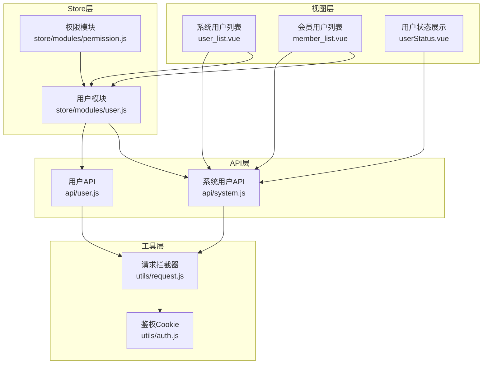
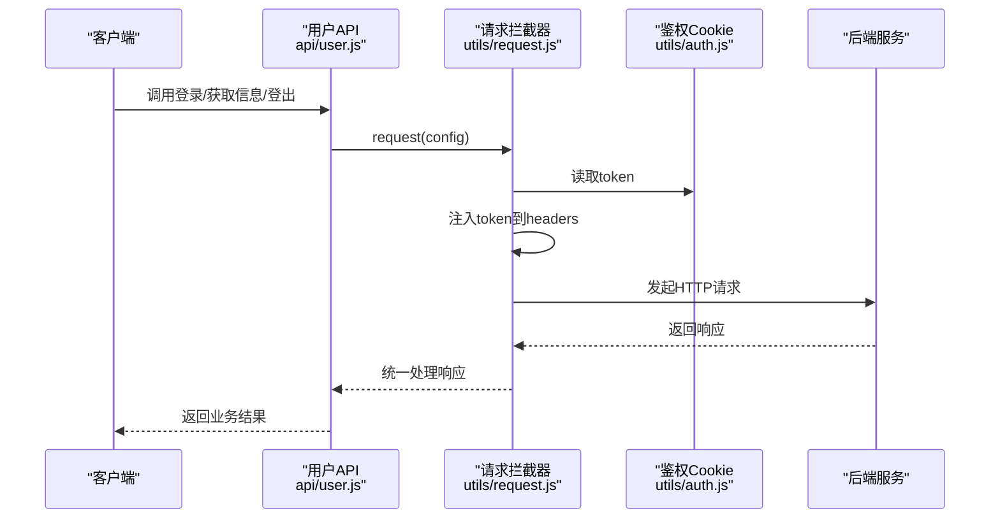
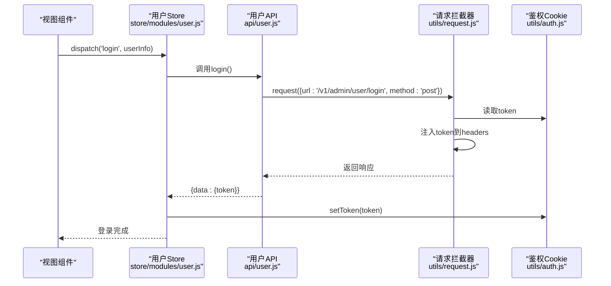
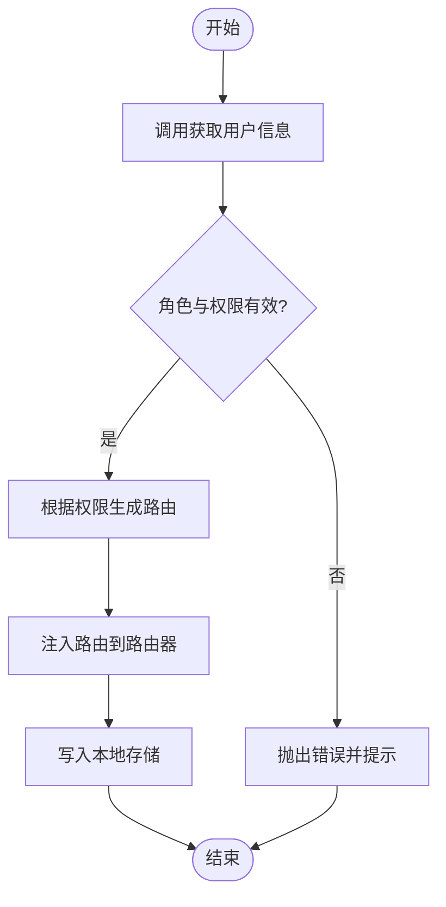
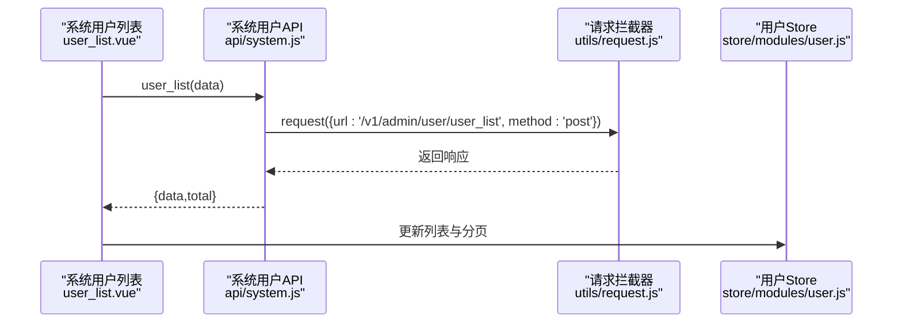
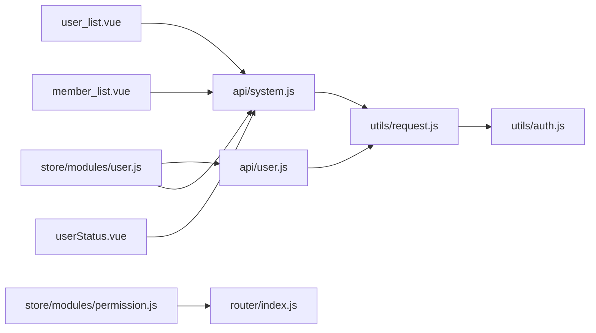

# 用户管理API

<cite>
**本文档引用的文件**
- [src/api/user.js](file://src/api/user.js)
- [src/api/system.js](file://src/api/system.js)
- [src/store/modules/user.js](file://src/store/modules/user.js)
- [src/store/modules/permission.js](file://src/store/modules/permission.js)
- [src/utils/request.js](file://src/utils/request.js)
- [src/utils/auth.js](file://src/utils/auth.js)
- [src/views/system/user_list.vue](file://src/views/system/user_list.vue)
- [src/views/member/list.vue](file://src/views/member/list.vue)
- [src/views/member/components/userStatus.vue](file://src/views/member/components/userStatus.vue)
- [src/router/index.js](file://src/router/index.js)
- [src/utils/dict/user.js](file://src/utils/dict/user.js)
</cite>

## 目录
1. [简介](#简介)
2. [项目结构](#项目结构)
3. [核心组件](#核心组件)
4. [架构总览](#架构总览)
5. [详细组件分析](#详细组件分析)
6. [依赖关系分析](#依赖关系分析)
7. [性能考虑](#性能考虑)
8. [故障排查指南](#故障排查指南)
9. [结论](#结论)
10. [附录](#附录)

## 简介
本文件面向后端与前端开发者，系统化梳理用户管理模块的API规范与实现细节，覆盖登录、用户信息获取、用户列表查询、用户状态管理等能力，并说明权限验证机制、数据模型与最佳实践。文档同时提供接口调用示例与常见问题排查建议，帮助快速集成与稳定运行。

## 项目结构
用户管理相关代码主要分布在以下层次：
- API层：封装对后端接口的调用，统一请求与响应处理
- Store层：集中管理用户态、权限、路由等状态
- 视图层：系统用户管理与会员用户管理界面
- 工具层：请求拦截器、鉴权Cookie、字典配置等

图表来源
- [src/views/system/user_list.vue:112-245](file://src/views/system/user_list.vue#L112-L245)
- [src/views/member/list.vue:248-520](file://src/views/member/list.vue#L248-L520)
- [src/views/member/components/userStatus.vue:72-119](file://src/views/member/components/userStatus.vue#L72-L119)
- [src/store/modules/user.js:1-542](file://src/store/modules/user.js#L1-L542)
- [src/store/modules/permission.js:1-66](file://src/store/modules/permission.js#L1-L66)
- [src/api/user.js:1-37](file://src/api/user.js#L1-L37)
- [src/api/system.js:1-73](file://src/api/system.js#L1-L73)
- [src/utils/request.js:1-130](file://src/utils/request.js#L1-L130)
- [src/utils/auth.js:1-17](file://src/utils/auth.js#L1-L17)

章节来源
- [src/api/user.js:1-37](file://src/api/user.js#L1-L37)
- [src/api/system.js:1-73](file://src/api/system.js#L1-L73)
- [src/store/modules/user.js:1-542](file://src/store/modules/user.js#L1-L542)
- [src/store/modules/permission.js:1-66](file://src/store/modules/permission.js#L1-L66)
- [src/utils/request.js:1-130](file://src/utils/request.js#L1-L130)
- [src/utils/auth.js:1-17](file://src/utils/auth.js#L1-L17)
- [src/views/system/user_list.vue:112-245](file://src/views/system/user_list.vue#L112-L245)
- [src/views/member/list.vue:248-520](file://src/views/member/list.vue#L248-L520)
- [src/views/member/components/userStatus.vue:72-119](file://src/views/member/components/userStatus.vue#L72-L119)

## 核心组件
- 用户API模块：封装登录、钉钉登录、获取用户信息、验证码、登出等接口
- 系统用户API模块：封装后台系统用户列表、详情、保存、删除、用户组、权限等接口
- 用户Store模块：负责登录态维护、用户信息拉取、权限路由生成、状态持久化
- 权限Store模块：根据用户权限过滤异步路由，生成可访问路由表
- 请求拦截器：统一注入token、错误提示、跨域配置、超时控制
- 鉴权Cookie：token存储与读取
- 视图组件：系统用户列表、会员用户列表、用户状态展示

章节来源
- [src/api/user.js:1-37](file://src/api/user.js#L1-L37)
- [src/api/system.js:1-73](file://src/api/system.js#L1-L73)
- [src/store/modules/user.js:1-542](file://src/store/modules/user.js#L1-L542)
- [src/store/modules/permission.js:1-66](file://src/store/modules/permission.js#L1-L66)
- [src/utils/request.js:1-130](file://src/utils/request.js#L1-L130)
- [src/utils/auth.js:1-17](file://src/utils/auth.js#L1-L17)
- [src/views/system/user_list.vue:112-245](file://src/views/system/user_list.vue#L112-L245)
- [src/views/member/list.vue:248-520](file://src/views/member/list.vue#L248-L520)
- [src/views/member/components/userStatus.vue:72-119](file://src/views/member/components/userStatus.vue#L72-L119)

## 架构总览
用户管理模块采用前后端分离架构，前端通过API层发起HTTP请求，经由请求拦截器统一注入token并处理响应；Store层负责状态管理与权限路由生成；视图层基于组件化实现用户列表与状态展示。

图表来源
- [src/api/user.js:1-37](file://src/api/user.js#L1-L37)
- [src/utils/request.js:1-130](file://src/utils/request.js#L1-L130)
- [src/utils/auth.js:1-17](file://src/utils/auth.js#L1-L17)

## 详细组件分析

### 登录与会话管理
- 登录接口
  - 方法：POST
  - 路径：/v1/admin/user/login
  - 请求体：包含用户名、密码、uuid、验证码等字段
  - 响应：包含token
- 钉钉登录接口
  - 方法：POST
  - 路径：/v1/admin/user/ding_login
  - 请求体：钉钉相关参数
  - 响应：包含token
- 获取用户信息接口
  - 方法：GET
  - 路径：/v1/admin/user/user_info
  - 查询参数：token（从Cookie或Header携带）
  - 响应：用户基础信息、角色、权限列表等
- 获取验证码接口
  - 方法：GET
  - 路径：/v1/admin/user/valid_code
  - 响应：图形验证码
- 登出接口
  - 方法：POST
  - 路径：/v1/admin/user/logout
  - 响应：成功状态

图表来源
- [src/store/modules/user.js:139-170](file://src/store/modules/user.js#L139-L170)
- [src/api/user.js:3-9](file://src/api/user.js#L3-L9)
- [src/utils/request.js:28-43](file://src/utils/request.js#L28-L43)
- [src/utils/auth.js:5-12](file://src/utils/auth.js#L5-L12)

章节来源
- [src/api/user.js:1-37](file://src/api/user.js#L1-L37)
- [src/store/modules/user.js:139-170](file://src/store/modules/user.js#L139-L170)
- [src/utils/request.js:28-43](file://src/utils/request.js#L28-L43)
- [src/utils/auth.js:5-12](file://src/utils/auth.js#L5-L12)

### 用户信息与权限
- 用户信息获取流程
  - Store在登录后调用获取用户信息接口
  - 校验返回的角色与权限列表
  - 动态生成路由并写入本地存储
- 权限路由生成
  - 根据用户权限过滤异步路由表
  - 生成可访问路由并注入到路由器

图表来源
- [src/store/modules/user.js:172-336](file://src/store/modules/user.js#L172-L336)
- [src/store/modules/permission.js:49-57](file://src/store/modules/permission.js#L49-L57)

章节来源
- [src/store/modules/user.js:172-336](file://src/store/modules/user.js#L172-L336)
- [src/store/modules/permission.js:1-66](file://src/store/modules/permission.js#L1-L66)

### 系统用户管理
- 用户列表查询
  - 方法：POST
  - 路径：/v1/admin/user/user_list
  - 请求体：分页参数、搜索条件、排序条件
  - 响应：用户列表、总数
- 用户详情
  - 方法：GET
  - 路径：/v1/admin/user/get_detail
  - 查询参数：用户ID
  - 响应：用户详情
- 保存用户
  - 方法：POST
  - 路径：/v1/admin/user/save_user_v2
  - 请求体：用户信息
  - 响应：保存结果
- 删除用户
  - 方法：POST
  - 路径：/v1/admin/user/delete_user
  - 请求体：用户ID
  - 响应：删除结果
- 用户组管理
  - 获取用户组列表：GET /v1/admin/user/group_list
  - 保存用户组：POST /v1/admin/user/save_group
  - 删除用户组：POST /v1/admin/user/delete_group
- 权限管理
  - 获取权限列表：GET /v1/admin/user/permissions_list
  - 拥有某权限的用户组：POST /v1/admin/user/groups_by_permission
- 操作日志
  - 获取后台操作记录：POST /v1/admin/user/operate_logs

图表来源
- [src/views/system/user_list.vue:158-198](file://src/views/system/user_list.vue#L158-L198)
- [src/api/system.js:12-18](file://src/api/system.js#L12-L18)
- [src/utils/request.js:45-68](file://src/utils/request.js#L45-L68)

章节来源
- [src/api/system.js:1-73](file://src/api/system.js#L1-L73)
- [src/views/system/user_list.vue:112-245](file://src/views/system/user_list.vue#L112-L245)

### 会员用户管理
- 会员用户列表查询
  - 方法：POST
  - 路径：/v1/admin/member/member_list
  - 请求体：分页参数、搜索条件、排序条件
  - 响应：用户列表、总数
- 用户状态展示
  - 组件：userStatus.vue
  - 展示等级、封禁状态、开通身份等状态标记

章节来源
- [src/views/member/list.vue:248-520](file://src/views/member/list.vue#L248-L520)
- [src/views/member/components/userStatus.vue:72-119](file://src/views/member/components/userStatus.vue#L72-L119)

### 数据模型与字段定义
- 用户基础信息
  - 字段：id、name、real_name、email、last_login、created_at、status、banned、group_id、group_name、unionid、avatar、introduction
- 角色与权限
  - 字段：roles（含id、name、description、permission_list）、permission_list（权限点数组）
- 用户分组
  - 字段：group_id、group_name、abbr、color、type、name
- 用户状态
  - 字段：status、banned、level、extra（如封禁时长、原因等）

章节来源
- [src/store/modules/user.js:13-76](file://src/store/modules/user.js#L13-L76)
- [src/utils/dict/user.js:1-245](file://src/utils/dict/user.js#L1-L245)

### 权限验证机制
- Token注入
  - 请求拦截器在请求前从localStorage读取token并注入到headers
- 未授权处理
  - 当后端返回特定code时，前端清除token并跳转登录页
- 路由级权限
  - 根据用户权限过滤异步路由，仅显示可访问页面
- 页面级权限
  - 视图层通过权限判断控制按钮与操作项显示

章节来源
- [src/utils/request.js:28-43](file://src/utils/request.js#L28-L43)
- [src/utils/request.js:55-65](file://src/utils/request.js#L55-L65)
- [src/store/modules/permission.js:8-14](file://src/store/modules/permission.js#L8-L14)
- [src/store/modules/permission.js:21-35](file://src/store/modules/permission.js#L21-L35)

### 最佳实践
- 密码安全
  - 前端不存储明文密码；登录成功后仅持有token
- 会话管理
  - 使用localStorage存储token；登出时清理token与路由
- 安全防护
  - 统一通过请求拦截器注入token；对401/403进行友好提示
  - 对异常响应进行统一提示，避免泄露敏感信息

章节来源
- [src/utils/auth.js:1-17](file://src/utils/auth.js#L1-L17)
- [src/store/modules/user.js:338-358](file://src/store/modules/user.js#L338-L358)
- [src/utils/request.js:69-127](file://src/utils/request.js#L69-L127)

## 依赖关系分析
- 视图组件依赖API模块与Store模块
- Store模块依赖API模块与路由模块
- API模块依赖请求拦截器与环境变量
- 请求拦截器依赖鉴权Cookie与Element UI消息提示

图表来源
- [src/views/system/user_list.vue:112-245](file://src/views/system/user_list.vue#L112-L245)
- [src/views/member/list.vue:248-520](file://src/views/member/list.vue#L248-L520)
- [src/views/member/components/userStatus.vue:72-119](file://src/views/member/components/userStatus.vue#L72-L119)
- [src/store/modules/user.js:1-542](file://src/store/modules/user.js#L1-L542)
- [src/store/modules/permission.js:1-66](file://src/store/modules/permission.js#L1-L66)
- [src/api/user.js:1-37](file://src/api/user.js#L1-L37)
- [src/api/system.js:1-73](file://src/api/system.js#L1-L73)
- [src/utils/request.js:1-130](file://src/utils/request.js#L1-L130)
- [src/utils/auth.js:1-17](file://src/utils/auth.js#L1-L17)
- [src/router/index.js:1-177](file://src/router/index.js#L1-L177)

章节来源
- [src/router/index.js:1-177](file://src/router/index.js#L1-L177)

## 性能考虑
- 分页查询：列表接口均支持分页参数，建议前端按需加载，避免一次性请求过多数据
- 排序与搜索：合理使用排序与搜索条件，减少后端压力
- 路由懒加载：异步路由按需加载，降低首屏体积
- 缓存策略：对用户标签、产品列表等静态数据进行本地缓存，提升交互体验

## 故障排查指南
- 登录失败
  - 检查用户名与密码是否正确
  - 确认验证码是否有效
  - 查看后端返回的错误码与消息
- 未授权/401
  - 清理浏览器localStorage中的token
  - 重新登录并确认token注入成功
- 列表为空或数据不更新
  - 检查分页参数与搜索条件
  - 确认权限是否足够查看目标数据
- 路由无法访问
  - 检查用户权限列表是否包含对应路由meta.roles
  - 确认权限路由生成逻辑是否执行

章节来源
- [src/utils/request.js:69-127](file://src/utils/request.js#L69-L127)
- [src/store/modules/user.js:338-358](file://src/store/modules/user.js#L338-L358)
- [src/store/modules/permission.js:8-14](file://src/store/modules/permission.js#L8-L14)

## 结论
用户管理模块通过清晰的分层设计实现了登录、信息获取、列表查询与状态管理等核心功能。借助统一的请求拦截器与权限路由机制，系统在安全性与可维护性方面具备良好基础。建议在实际接入时严格遵循接口规范与最佳实践，确保系统的稳定性与扩展性。

## 附录
- 环境变量
  - 基础URL：根据部署域名选择不同环境的BASE_API
  - MQTT地址：根据部署域名选择不同环境的BASE_MQTT
- 常见状态码
  - 0：成功
  - 201000：需要重新登录
  - 其他：后端自定义错误码，前端统一提示

章节来源
- [src/utils/request.js:5-26](file://src/utils/request.js#L5-L26)