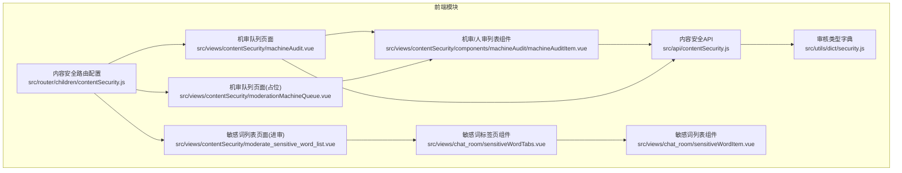
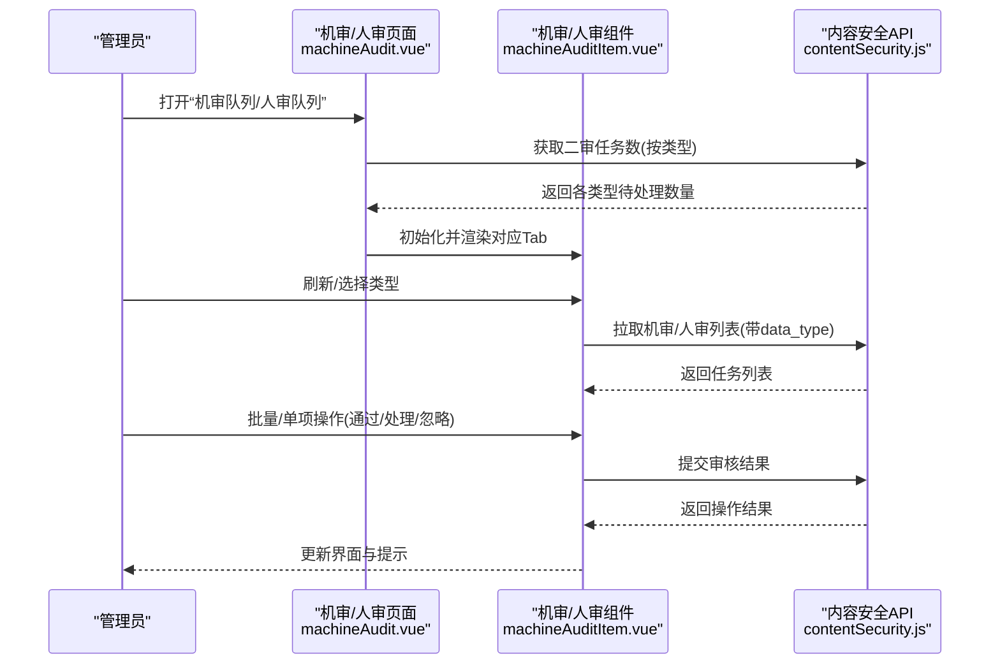
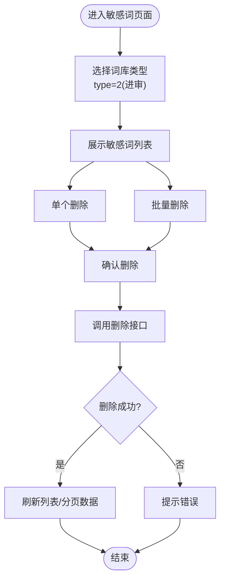
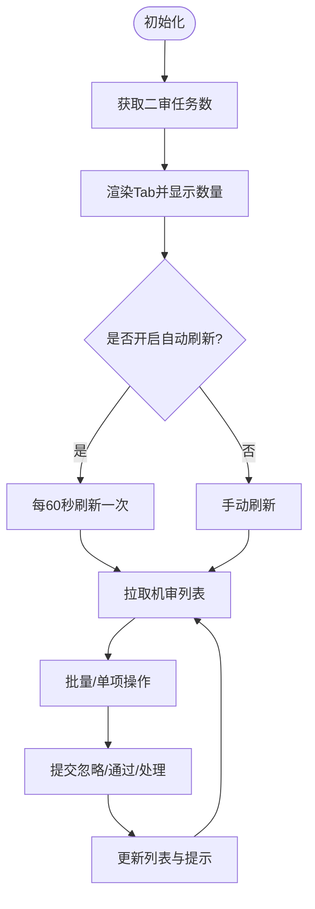
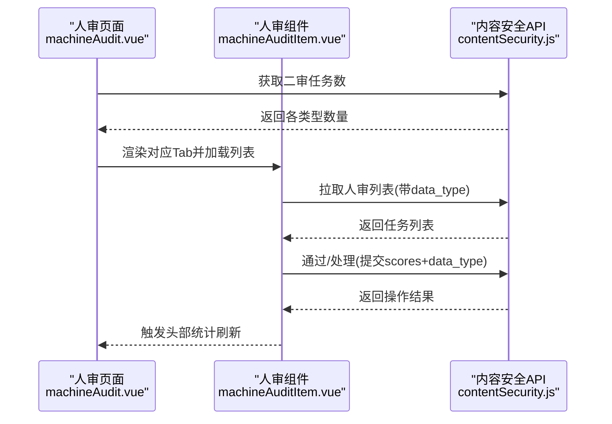
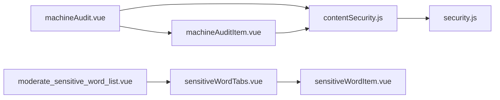

# 内容安全API

<cite>
**本文引用的文件**
- [src/api/contentSecurity.js](file://src/api/contentSecurity.js)
- [src/router/children/contentSecurity.js](file://src/router/children/contentSecurity.js)
- [src/views/contentSecurity/machineAudit.vue](file://src/views/contentSecurity/machineAudit.vue)
- [src/views/contentSecurity/moderationMachineQueue.vue](file://src/views/contentSecurity/moderationMachineQueue.vue)
- [src/views/contentSecurity/components/machineAudit/machineAuditItem.vue](file://src/views/contentSecurity/components/machineAudit/machineAuditItem.vue)
- [src/views/contentSecurity/moderate_sensitive_word_list.vue](file://src/views/contentSecurity/moderate_sensitive_word_list.vue)
- [src/views/chat_room/sensitiveWordTabs.vue](file://src/views/chat_room/sensitiveWordTabs.vue)
- [src/views/chat_room/sensitiveWordItem.vue](file://src/views/chat_room/sensitiveWordItem.vue)
- [src/utils/dict/security.js](file://src/utils/dict/security.js)
</cite>

## 目录
1. [简介](#简介)
2. [项目结构](#项目结构)
3. [核心组件](#核心组件)
4. [架构总览](#架构总览)
5. [详细组件分析](#详细组件分析)
6. [依赖关系分析](#依赖关系分析)
7. [性能考量](#性能考量)
8. [故障排查指南](#故障排查指南)
9. [结论](#结论)
10. [附录](#附录)

## 简介
本文件面向内容安全模块的前后端对接，系统化梳理“内容审核、敏感词管理、机器审核、人工审核”等能力的API规范与前端集成方式。重点覆盖：
- 内容审核接口：审核任务创建（机审队列）、审核状态查询（二审队列）、审核结果提交（忽略/通过/处理）等。
- 敏感词管理接口：敏感词列表查询、敏感词添加/编辑、敏感词删除等。
- 机器审核接口：AI审核结果获取、审核队列管理、二次上报等。
- 人工审核接口：审核任务分配、审核进度跟踪、审核质量评估等。
- 合规管理：审核标准制定、审核流程规范、审核数据保护等。

## 项目结构
内容安全功能在前端采用按模块组织的页面与API封装，主要涉及：
- API封装：统一在内容安全API模块中定义HTTP请求方法。
- 页面路由：内容安全菜单下包含机审队列、人审队列、敏感词管理、操作记录等页面。
- 组件化：机审/人审列表以可复用组件形式承载，支持多业务场景切换与本地分页。



图表来源
- [src/router/children/contentSecurity.js:1-44](file://src/router/children/contentSecurity.js#L1-L44)
- [src/views/contentSecurity/machineAudit.vue:1-164](file://src/views/contentSecurity/machineAudit.vue#L1-L164)
- [src/views/contentSecurity/moderationMachineQueue.vue:1-21](file://src/views/contentSecurity/moderationMachineQueue.vue#L1-L21)
- [src/views/contentSecurity/components/machineAudit/machineAuditItem.vue:1-608](file://src/views/contentSecurity/components/machineAudit/machineAuditItem.vue#L1-L608)
- [src/views/contentSecurity/moderate_sensitive_word_list.vue:1-22](file://src/views/contentSecurity/moderate_sensitive_word_list.vue#L1-L22)
- [src/views/chat_room/sensitiveWordTabs.vue:1-50](file://src/views/chat_room/sensitiveWordTabs.vue#L1-L50)
- [src/views/chat_room/sensitiveWordItem.vue:196-232](file://src/views/chat_room/sensitiveWordItem.vue#L196-L232)
- [src/utils/dict/security.js:1-23](file://src/utils/dict/security.js#L1-L23)

章节来源
- [src/router/children/contentSecurity.js:1-44](file://src/router/children/contentSecurity.js#L1-L44)
- [src/views/contentSecurity/machineAudit.vue:1-164](file://src/views/contentSecurity/machineAudit.vue#L1-L164)
- [src/views/contentSecurity/moderationMachineQueue.vue:1-21](file://src/views/contentSecurity/moderationMachineQueue.vue#L1-L21)
- [src/views/contentSecurity/components/machineAudit/machineAuditItem.vue:1-608](file://src/views/contentSecurity/components/machineAudit/machineAuditItem.vue#L1-L608)
- [src/views/contentSecurity/moderate_sensitive_word_list.vue:1-22](file://src/views/contentSecurity/moderate_sensitive_word_list.vue#L1-L22)
- [src/views/chat_room/sensitiveWordTabs.vue:1-50](file://src/views/chat_room/sensitiveWordTabs.vue#L1-L50)
- [src/views/chat_room/sensitiveWordItem.vue:196-232](file://src/views/chat_room/sensitiveWordItem.vue#L196-L232)
- [src/utils/dict/security.js:1-23](file://src/utils/dict/security.js#L1-L23)

## 核心组件
- 内容安全API封装：集中定义机审/人审/敏感词相关接口方法，便于统一调用与维护。
- 机审/人审列表组件：负责渲染不同业务类型的审核任务，支持批量操作、查看详情、导出等。
- 审核类型字典：统一映射审核类型与页面标签，支撑机审/人审Tab动态生成与计数同步。
- 敏感词管理组件：提供敏感词分类查看、新增/删除、批量操作等能力。

章节来源
- [src/api/contentSecurity.js:1-115](file://src/api/contentSecurity.js#L1-L115)
- [src/views/contentSecurity/components/machineAudit/machineAuditItem.vue:210-608](file://src/views/contentSecurity/components/machineAudit/machineAuditItem.vue#L210-L608)
- [src/utils/dict/security.js:1-23](file://src/utils/dict/security.js#L1-L23)
- [src/views/chat_room/sensitiveWordTabs.vue:11-50](file://src/views/chat_room/sensitiveWordTabs.vue#L11-L50)

## 架构总览
内容安全模块从前端到后端的关键交互路径如下：
- 机审队列：页面加载时拉取二审任务总数，定时刷新；点击Tab进入对应类型列表，调用机审/人审接口获取数据。
- 人审队列：页面根据审核类型字典生成Tab，实时展示各类型待处理数量，支持手动刷新与自动刷新。
- 敏感词管理：页面通过标签页切换不同词库类型，组件内部封装增删查逻辑并调用对应接口。



图表来源
- [src/views/contentSecurity/machineAudit.vue:63-160](file://src/views/contentSecurity/machineAudit.vue#L63-L160)
- [src/views/contentSecurity/components/machineAudit/machineAuditItem.vue:553-604](file://src/views/contentSecurity/components/machineAudit/machineAuditItem.vue#L553-L604)
- [src/api/contentSecurity.js:28-80](file://src/api/contentSecurity.js#L28-L80)

## 详细组件分析

### 内容审核接口（机审/人审）
- 接口概览
  - 机审队列：获取聊天室类机审任务列表。
  - 人审队列：按data_type筛选获取对应业务类型的人审任务列表。
  - 二审任务数：按审核类型返回待处理数量，用于页面Tab角标显示。
  - 忽略/通过/处理：对机审或人审任务进行批量或单项操作，提交scores或scores数组。

- 请求与响应要点
  - 机审列表：POST /v1/admin/moderate/moderation
  - 人审列表：POST /v1/admin/moderate/moderation_second（需携带data_type）
  - 二审任务数：GET /v1/admin/moderate/moderation_second_num
  - 忽略机审：POST /v1/admin/moderate/ignore_moderation（scores）
  - 人审通过：POST /v1/admin/moderate/ignore_moderation_second（scores + data_type）
  - 人审处理：POST /v1/admin/moderate/handler_moderation_second（scores + data_type）

- 关键字段说明
  - scores：数组，元素包含id与业务主键（如post_id、chat_id等），以及针对机审的ignore字段（1有效/0误判）。
  - data_type：业务类型标识，来自审核类型字典。
  - item_detail：任务详情，包含标题、内容、附件、扩展参数等。
  - extra：敏感词、模型名、触发原因等辅助信息。

- 操作流程图（忽略/通过/处理）
```mermaid
flowchart TD
Start(["开始"]) --> ChooseOp{"选择操作类型"}
ChooseOp --> |忽略(机审)| BuildIgnore["构造scores数组<br/>包含id与业务主键"]
ChooseOp --> |通过(人审)| BuildPass["构造scores数组<br/>包含id与业务主键"]
ChooseOp --> |处理(人审)| OpenDialog["打开处理对话框<br/>收集处理意见/封禁建议"]
BuildIgnore --> CallIgnore["调用忽略接口"]
BuildPass --> CallPass["调用通过接口"]
OpenDialog --> CallHandle["调用处理接口"]
CallIgnore --> Done(["完成"])
CallPass --> Done
CallHandle --> Done
```

图表来源
- [src/views/contentSecurity/components/machineAudit/machineAuditItem.vue:414-530](file://src/views/contentSecurity/components/machineAudit/machineAuditItem.vue#L414-L530)
- [src/api/contentSecurity.js:28-80](file://src/api/contentSecurity.js#L28-L80)

章节来源
- [src/api/contentSecurity.js:28-80](file://src/api/contentSecurity.js#L28-L80)
- [src/views/contentSecurity/components/machineAudit/machineAuditItem.vue:553-604](file://src/views/contentSecurity/components/machineAudit/machineAuditItem.vue#L553-L604)
- [src/views/contentSecurity/machineAudit.vue:133-160](file://src/views/contentSecurity/machineAudit.vue#L133-L160)

### 敏感词管理接口
- 接口概览
  - 查询敏感词列表：GET /v1/admin/moderate/sensitive_word_list?type=2
  - 添加敏感词：POST /v1/admin/moderate/add_sensitive_word
  - 删除敏感词：POST /v1/admin/moderate/delete_sensitive_word

- 页面与组件
  - 进审敏感词页面：通过标签页组件切换“进审敏感词”，内部使用敏感词列表组件承载增删查逻辑。
  - 敏感词标签页：支持多种来源（chat_room、predictor、post、moderate），默认“进审敏感词”激活值为2。
  - 单词删除/批量删除：弹窗确认后调用删除接口，成功后刷新视图数据。

- 数据流图（删除流程）


图表来源
- [src/views/contentSecurity/moderate_sensitive_word_list.vue:1-22](file://src/views/contentSecurity/moderate_sensitive_word_list.vue#L1-L22)
- [src/views/chat_room/sensitiveWordTabs.vue:19-47](file://src/views/chat_room/sensitiveWordTabs.vue#L19-L47)
- [src/views/chat_room/sensitiveWordItem.vue:200-232](file://src/views/chat_room/sensitiveWordItem.vue#L200-L232)
- [src/api/contentSecurity.js:81-105](file://src/api/contentSecurity.js#L81-L105)

章节来源
- [src/views/contentSecurity/moderate_sensitive_word_list.vue:1-22](file://src/views/contentSecurity/moderate_sensitive_word_list.vue#L1-L22)
- [src/views/chat_room/sensitiveWordTabs.vue:19-47](file://src/views/chat_room/sensitiveWordTabs.vue#L19-L47)
- [src/views/chat_room/sensitiveWordItem.vue:200-232](file://src/views/chat_room/sensitiveWordItem.vue#L200-L232)
- [src/api/contentSecurity.js:81-105](file://src/api/contentSecurity.js#L81-L105)

### 机器审核接口（机审队列）
- 功能概述
  - 机审队列页面：仅展示聊天室类机审任务，支持批量有效/误判、导出Excel等。
  - 自动刷新：开启后每60秒轮询刷新任务数与列表。
  - 本地分页：列表按每页15条本地分页，翻页不请求接口。

- 关键交互
  - 列表获取：POST /v1/admin/moderate/moderation（聊天室类）
  - 批量有效/误判：POST /v1/admin/moderate/ignore_moderation（scores）
  - 导出Excel：前端组装字段后导出。

- 机审页面流程图


图表来源
- [src/views/contentSecurity/moderationMachineQueue.vue:1-21](file://src/views/contentSecurity/moderationMachineQueue.vue#L1-L21)
- [src/views/contentSecurity/components/machineAudit/machineAuditItem.vue:414-530](file://src/views/contentSecurity/components/machineAudit/machineAuditItem.vue#L414-L530)
- [src/api/contentSecurity.js:28-80](file://src/api/contentSecurity.js#L28-L80)

章节来源
- [src/views/contentSecurity/moderationMachineQueue.vue:1-21](file://src/views/contentSecurity/moderationMachineQueue.vue#L1-L21)
- [src/views/contentSecurity/components/machineAudit/machineAuditItem.vue:414-530](file://src/views/contentSecurity/components/machineAudit/machineAuditItem.vue#L414-L530)
- [src/api/contentSecurity.js:28-80](file://src/api/contentSecurity.js#L28-L80)

### 人工审核接口（人审队列）
- 功能概述
  - 人审队列页面：根据审核类型字典生成Tab，实时显示各类型待处理数量。
  - 支持手动/自动刷新，Tab标题动态更新未处理数。
  - 人审操作：通过/处理（打开处理对话框），处理完成后刷新头部统计。

- 关键交互
  - 二审任务数：GET /v1/admin/moderate/moderation_second_num
  - 人审列表：POST /v1/admin/moderate/moderation_second（data_type）
  - 人审通过：POST /v1/admin/moderate/ignore_moderation_second（scores + data_type）
  - 人审处理：POST /v1/admin/moderate/handler_moderation_second（scores + data_type）

- 人审页面序列图


图表来源
- [src/views/contentSecurity/machineAudit.vue:63-160](file://src/views/contentSecurity/machineAudit.vue#L63-L160)
- [src/views/contentSecurity/components/machineAudit/machineAuditItem.vue:553-604](file://src/views/contentSecurity/components/machineAudit/machineAuditItem.vue#L553-L604)
- [src/api/contentSecurity.js:28-80](file://src/api/contentSecurity.js#L28-L80)

章节来源
- [src/views/contentSecurity/machineAudit.vue:63-160](file://src/views/contentSecurity/machineAudit.vue#L63-L160)
- [src/views/contentSecurity/components/machineAudit/machineAuditItem.vue:553-604](file://src/views/contentSecurity/components/machineAudit/machineAuditItem.vue#L553-L604)
- [src/api/contentSecurity.js:28-80](file://src/api/contentSecurity.js#L28-L80)

## 依赖关系分析
- 组件耦合
  - 机审/人审页面依赖机审组件，组件内部再依赖内容安全API。
  - 审核类型字典被机审页面与组件共享，用于Tab生成与计数同步。
  - 敏感词页面依赖标签页组件与列表组件，后者封装具体增删逻辑。

- 外部依赖
  - API封装统一使用请求工具发起HTTP请求，返回Promise以便组件处理。
  - 字典模块提供审核类型映射，避免硬编码。



图表来源
- [src/views/contentSecurity/machineAudit.vue:43-162](file://src/views/contentSecurity/machineAudit.vue#L43-L162)
- [src/views/contentSecurity/components/machineAudit/machineAuditItem.vue:210-608](file://src/views/contentSecurity/components/machineAudit/machineAuditItem.vue#L210-L608)
- [src/api/contentSecurity.js:1-115](file://src/api/contentSecurity.js#L1-L115)
- [src/utils/dict/security.js:1-23](file://src/utils/dict/security.js#L1-L23)
- [src/views/contentSecurity/moderate_sensitive_word_list.vue:10-21](file://src/views/contentSecurity/moderate_sensitive_word_list.vue#L10-L21)
- [src/views/chat_room/sensitiveWordTabs.vue:11-49](file://src/views/chat_room/sensitiveWordTabs.vue#L11-L49)
- [src/views/chat_room/sensitiveWordItem.vue:196-232](file://src/views/chat_room/sensitiveWordItem.vue#L196-L232)

章节来源
- [src/views/contentSecurity/machineAudit.vue:43-162](file://src/views/contentSecurity/machineAudit.vue#L43-L162)
- [src/views/contentSecurity/components/machineAudit/machineAuditItem.vue:210-608](file://src/views/contentSecurity/components/machineAudit/machineAuditItem.vue#L210-L608)
- [src/api/contentSecurity.js:1-115](file://src/api/contentSecurity.js#L1-L115)
- [src/utils/dict/security.js:1-23](file://src/utils/dict/security.js#L1-L23)
- [src/views/contentSecurity/moderate_sensitive_word_list.vue:10-21](file://src/views/contentSecurity/moderate_sensitive_word_list.vue#L10-L21)
- [src/views/chat_room/sensitiveWordTabs.vue:11-49](file://src/views/chat_room/sensitiveWordTabs.vue#L11-L49)
- [src/views/chat_room/sensitiveWordItem.vue:196-232](file://src/views/chat_room/sensitiveWordItem.vue#L196-L232)

## 性能考量
- 自动刷新策略：人审页面默认每60秒刷新一次，减少频繁请求带来的压力；机审页面支持开启/关闭自动刷新，避免不必要的轮询。
- 本地分页：列表采用本地分页，翻页不请求接口，降低网络开销；切换每页条数时重置到第1页，避免越界。
- 导出优化：导出前先确认，避免误操作；导出字段按需组装，减少传输体积。

## 故障排查指南
- 无法获取任务数/列表
  - 检查接口返回码与错误消息，确认登录态与权限。
  - 人审页面开启自动刷新后若长时间无响应，尝试手动刷新。
- 操作失败
  - 忽略/通过/处理操作失败时，检查scores数组是否包含正确id与业务主键。
  - 若data_type缺失，可能导致人审接口返回异常。
- 敏感词删除无效
  - 确认所选词库类型与来源一致，删除后刷新列表查看是否生效。
  - 批量删除时注意确认弹窗，避免误删。

章节来源
- [src/views/contentSecurity/machineAudit.vue:133-160](file://src/views/contentSecurity/machineAudit.vue#L133-L160)
- [src/views/contentSecurity/components/machineAudit/machineAuditItem.vue:414-530](file://src/views/contentSecurity/components/machineAudit/machineAuditItem.vue#L414-L530)
- [src/views/chat_room/sensitiveWordItem.vue:200-232](file://src/views/chat_room/sensitiveWordItem.vue#L200-L232)

## 结论
内容安全模块通过统一的API封装与组件化设计，实现了机审/人审任务的高效流转与敏感词的灵活管理。结合自动刷新、本地分页与批量操作，显著提升了审核效率与用户体验。建议在实际部署中完善审核标准与流程规范，确保合规性与数据安全。

## 附录

### API清单与字段说明
- 机审队列
  - POST /v1/admin/moderate/moderation
    - 请求体：无固定必填字段（可按需要附加查询条件）
    - 响应：任务列表（含item_detail、attachments、extra等）
- 人审队列
  - POST /v1/admin/moderate/moderation_second
    - 请求体：data_type（必填，来自审核类型字典）
    - 响应：任务列表
- 二审任务数
  - GET /v1/admin/moderate/moderation_second_num
    - 响应：各类型待处理数量数组
- 忽略机审
  - POST /v1/admin/moderate/ignore_moderation
    - 请求体：scores（数组，元素含id与业务主键，以及ignore=1/0）
    - 响应：操作结果
- 人审通过
  - POST /v1/admin/moderate/ignore_moderation_second
    - 请求体：scores（数组，元素含id与业务主键），data_type（必填）
    - 响应：操作结果
- 人审处理
  - POST /v1/admin/moderate/handler_moderation_second
    - 请求体：scores（数组，元素含id与业务主键），data_type（必填）
    - 响应：操作结果
- 敏感词管理
  - GET /v1/admin/moderate/sensitive_word_list?type=2
    - 响应：敏感词列表
  - POST /v1/admin/moderate/add_sensitive_word
    - 请求体：word_list（字符串数组）
    - 响应：操作结果
  - POST /v1/admin/moderate/delete_sensitive_word
    - 请求体：words（字符串数组）
    - 响应：操作结果

章节来源
- [src/api/contentSecurity.js:28-105](file://src/api/contentSecurity.js#L28-L105)