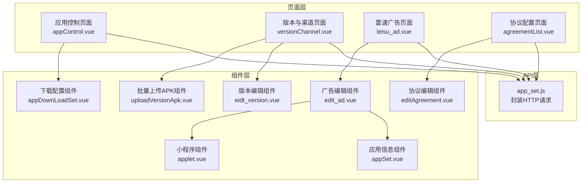
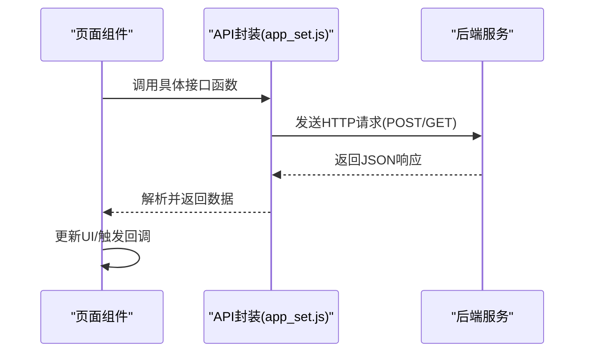
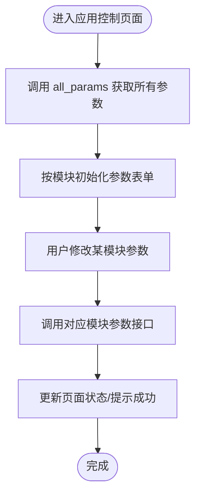
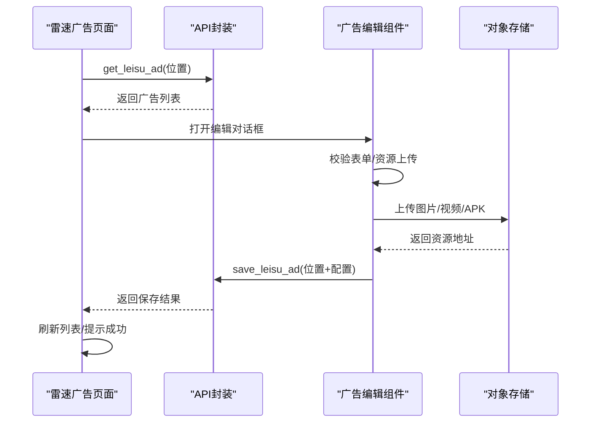
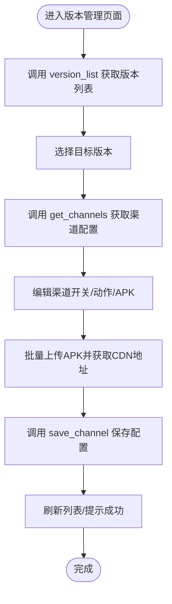
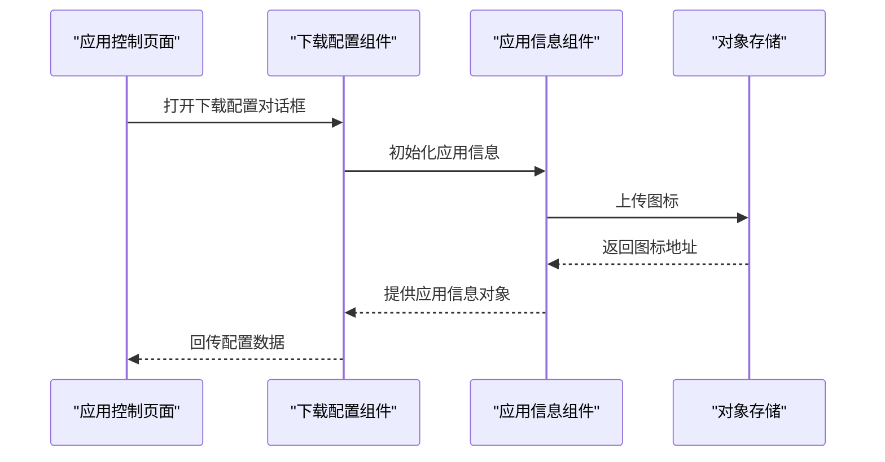
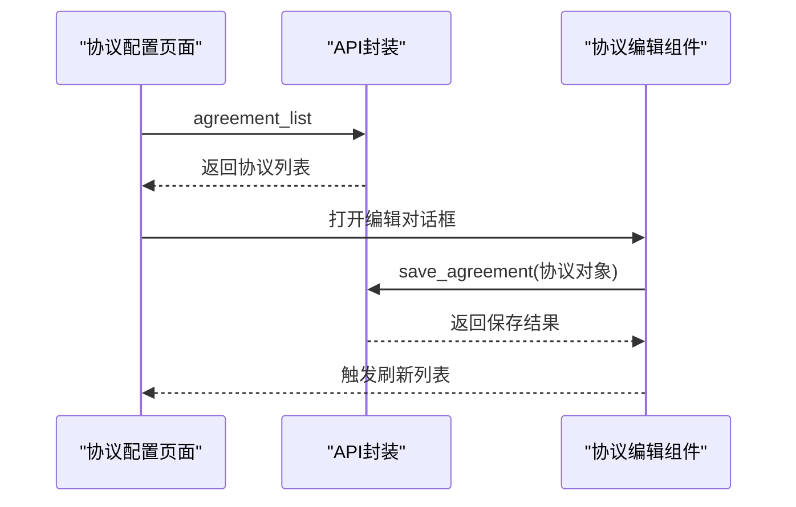
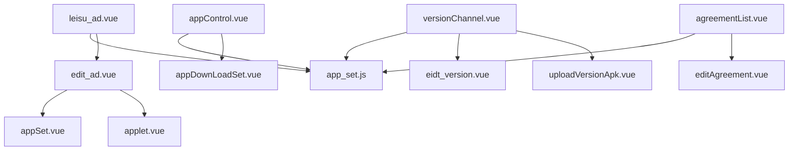

# 应用设置API

<cite>
**本文档引用的文件**
- [app_set.js](file://src/api/app_set.js)
- [app_set路由](file://src/router/children/app_set.js)
- [应用控制页面](file://src/views/app_set/appControl.vue)
- [版本与渠道页面](file://src/views/app_set/versionChannel.vue)
- [雷速广告页面](file://src/views/app_set/leisu_ad.vue)
- [协议配置页面](file://src/views/app_set/agreementList.vue)
- [下载配置组件](file://src/views/app_set/components/appDownLoadSet.vue)
- [广告编辑组件](file://src/views/app_set/components/edit_ad.vue)
- [版本编辑组件](file://src/views/app_set/components/eidt_version.vue)
- [协议编辑组件](file://src/views/app_set/components/editAgreement.vue)
- [应用信息组件](file://src/views/app_set/components/appSet.vue)
- [小程序组件](file://src/views/app_set/components/applet.vue)
- [批量上传APK组件](file://src/views/app_set/components/uploadVersionApk.vue)
</cite>

## 目录
1. [简介](#简介)
2. [项目结构](#项目结构)
3. [核心组件](#核心组件)
4. [架构概览](#架构概览)
5. [详细组件分析](#详细组件分析)
6. [依赖关系分析](#依赖关系分析)
7. [性能考虑](#性能考虑)
8. [故障排除指南](#故障排除指南)
9. [结论](#结论)

## 简介
本文件为应用设置模块的详细API文档，涵盖应用配置、广告管理、版本控制、下载设置等相关接口的API规范。文档面向前端开发人员与运维工程师，提供接口定义、数据结构说明、调用流程与最佳实践建议。

## 项目结构
应用设置模块位于前端工程的特定目录下，包含API封装、路由配置以及多个业务页面组件。主要结构如下：
- API层：统一封装HTTP请求，暴露各业务接口函数
- 页面层：按功能拆分页面组件，负责数据展示与交互
- 组件层：复用性强的子组件，如广告编辑、版本编辑、协议编辑等

**图表来源**
- [app_set.js:1-265](file://src/api/app_set.js#L1-L265)
- [应用控制页面:1-196](file://src/views/app_set/appControl.vue#L1-L196)
- [版本与渠道页面:1-246](file://src/views/app_set/versionChannel.vue#L1-L246)
- [雷速广告页面:1-401](file://src/views/app_set/leisu_ad.vue#L1-L401)
- [协议配置页面:1-119](file://src/views/app_set/agreementList.vue#L1-L119)
- [广告编辑组件:1-708](file://src/views/app_set/components/edit_ad.vue#L1-L708)
- [版本编辑组件:1-442](file://src/views/app_set/components/eidt_version.vue#L1-L442)
- [协议编辑组件:1-123](file://src/views/app_set/components/editAgreement.vue#L1-L123)
- [应用信息组件:1-180](file://src/views/app_set/components/appSet.vue#L1-L180)
- [小程序组件:1-82](file://src/views/app_set/components/applet.vue#L1-L82)
- [批量上传APK组件:1-252](file://src/views/app_set/components/uploadVersionApk.vue#L1-L252)
- [下载配置组件:1-79](file://src/views/app_set/components/appDownLoadSet.vue#L1-L79)

**章节来源**
- [app_set.js:1-265](file://src/api/app_set.js#L1-L265)
- [app_set路由:1-74](file://src/router/children/app_set.js#L1-L74)

## 核心组件
本模块的核心由以下API函数组成，分别对应应用配置、广告管理、版本控制与协议配置等业务领域：

- 应用配置
  - 获取广告比例：get_ad_ratio
  - 保存广告比例：save_ad_ratio
  - 获取Banner列表：get_banner_list
  - 保存Banner详情：save_banner_detail
  - 获取所有App参数：all_params
  - 社区参数设置：group_params
  - 聊天室参数设置：room_params
  - 新闻参数设置：news_params
  - 用户参数设置：user_params
  - 其他参数设置：other_params
  - 比赛参数设置：match_params
  - 版块信息设置：set_catalog_info
  - 版块信息查询：get_catalog_info
  - 个人背景图列表：profile_bg_list
  - 保存个人背景图：save_profile_bg
  - 删除个人背景图：delete_profile_bg
  - 协议配置列表：agreement_list
  - 保存协议配置：save_agreement
  - 友情链接列表：links
  - 保存/编辑友情链接：link_save

- 广告管理
  - 雷速广告保存：save_leisu_ad
  - 雷速广告查询：get_leisu_ad

- 版本控制
  - 版本列表查询：version_list
  - 新增/编辑版本：save_version
  - 删除版本：delete_version
  - 渠道列表查询：get_channels
  - 保存渠道配置：save_channel
  - 渠道列表：get_channel_list

- 下载设置
  - 下载配置组件：appDownLoadSet.vue（用于配置APP下载相关信息）

**章节来源**
- [app_set.js:1-265](file://src/api/app_set.js#L1-L265)

## 架构概览
应用设置模块采用“API封装 + 页面组件 + 复用组件”的分层设计。页面组件通过API层发起HTTP请求，组件层负责复杂交互与数据处理，并通过事件向父级传递结果。

**图表来源**
- [app_set.js:1-265](file://src/api/app_set.js#L1-L265)

## 详细组件分析

### 应用配置接口
应用配置接口用于集中管理应用的各项参数与功能开关，支持多维度分类设置。

- 获取广告比例
  - 方法：GET
  - 路径：/v1/admin/mobile/get_ad_ratio
  - 请求参数：无
  - 响应示例：包含广告比例配置的对象
  - 使用场景：页面初始化时加载广告比例

- 保存广告比例
  - 方法：POST
  - 路径：/v1/admin/mobile/save_ad_ratio
  - 请求体：包含比例配置的对象
  - 响应示例：包含操作结果的状态码与消息
  - 使用场景：用户调整广告比例后提交保存

- 获取Banner列表
  - 方法：POST
  - 路径：/v1/admin/mobile/banner_list
  - 请求体：查询条件对象
  - 响应示例：Banner列表数组
  - 使用场景：展示与管理Banner

- 保存Banner详情
  - 方法：POST
  - 路径：/v1/admin/mobile/update_banner
  - 请求体：Banner详情对象
  - 响应示例：操作结果
  - 使用场景：新增或编辑Banner

- 获取所有App参数
  - 方法：GET
  - 路径：/v1/admin/mobile/all_params
  - 请求参数：无
  - 响应示例：包含多组参数的对象
  - 使用场景：应用控制页面初始化

- 分类参数设置
  - 社区参数：group_params
  - 聊天室参数：room_params
  - 新闻参数：news_params
  - 用户参数：user_params
  - 其他参数：other_params
  - 比赛参数：match_params
  - 方法：POST
  - 路径：/v1/admin/mobile/{module}_params
  - 请求体：对应模块的参数对象
  - 响应示例：操作结果
  - 使用场景：按模块保存配置

- 版块信息设置与查询
  - 设置版块图片与描述：set_catalog_info
  - 查询版块图片与描述：get_catalog_info
  - 方法：POST/GET
  - 路径：/v1/admin/mobile/set_catalog_info, /v1/admin/mobile/get_catalog_info
  - 请求体/响应：包含版块信息的对象
  - 使用场景：社区版块配置

- 个人背景图管理
  - 列表查询：profile_bg_list
  - 保存背景图：save_profile_bg
  - 删除背景图：delete_profile_bg
  - 方法：GET/POST
  - 路径：/v1/admin/mobile/profile_bg_list, /v1/admin/mobile/save_profile_bg, /v1/admin/mobile/delete_profile_bg
  - 请求体/响应：包含背景图信息的对象
  - 使用场景：个人主页背景图管理

- 协议配置
  - 列表查询：agreement_list
  - 保存协议：save_agreement
  - 方法：GET/POST
  - 路径：/v1/admin/mobile/agreement_list, /v1/admin/mobile/save_agreement
  - 请求体：协议配置对象（含名称、地址、平台、场景、版本等）
  - 响应示例：操作结果
  - 使用场景：协议配置与展示控制

- 友情链接
  - 列表查询：links
  - 保存/编辑：link_save
  - 方法：POST
  - 路径：/v1/admin/mobile/links, /v1/admin/mobile/link_save
  - 请求体：链接列表或单条链接对象
  - 响应示例：操作结果
  - 使用场景：维护站点间的链接关系

**图表来源**
- [应用控制页面:161-190](file://src/views/app_set/appControl.vue#L161-L190)
- [app_set.js:84-139](file://src/api/app_set.js#L84-L139)

**章节来源**
- [app_set.js:1-265](file://src/api/app_set.js#L1-L265)
- [应用控制页面:1-196](file://src/views/app_set/appControl.vue#L1-L196)
- [协议配置页面:1-119](file://src/views/app_set/agreementList.vue#L1-L119)

### 广告管理接口
广告管理接口支持对不同广告位进行配置与管理，包括广告内容、投放策略与统计。

- 雷速广告保存
  - 方法：POST
  - 路径：/v1/admin/mobile/save_leisu_ad
  - 请求体：包含位置标识与配置数组的对象
  - 百分比校验：当位置支持比例时，配置数组内百分比之和需为100
  - 响应示例：操作结果
  - 使用场景：保存广告位配置

- 雷速广告查询
  - 方法：GET
  - 路径：/v1/admin/mobile/get_leisu_ad?location={位置标识}
  - 请求参数：位置标识
  - 响应示例：广告列表数组
  - 使用场景：展示与编辑广告

- 广告编辑组件
  - 支持图片/视频资源、可见用户标签、不可见渠道、时间范围等配置
  - iOS/Android平台差异化配置（浏览器类型、URL、Scheme、导航栏等）
  - 小程序参数（电池栏文字、标题栏颜色等）
  - 监测链接（点击/展示）
  - 上传APK（Android下载）
  - 使用场景：在广告页面中进行广告的增删改查与排序/比例调整

**图表来源**
- [雷速广告页面:289-369](file://src/views/app_set/leisu_ad.vue#L289-L369)
- [广告编辑组件:542-667](file://src/views/app_set/components/edit_ad.vue#L542-L667)
- [app_set.js:226-240](file://src/api/app_set.js#L226-L240)

**章节来源**
- [app_set.js:226-240](file://src/api/app_set.js#L226-L240)
- [雷速广告页面:1-401](file://src/views/app_set/leisu_ad.vue#L1-L401)
- [广告编辑组件:1-708](file://src/views/app_set/components/edit_ad.vue#L1-L708)

### 版本控制接口
版本控制接口用于管理应用版本与渠道策略，支持版本增删改、渠道开关与APK上传。

- 版本列表查询
  - 方法：GET
  - 路径：/v1/admin/mobile/version_list
  - 响应示例：版本列表数组
  - 使用场景：展示现有版本

- 新增/编辑版本
  - 方法：POST
  - 路径：/v1/admin/mobile/save_version
  - 请求体：版本对象（版本号、描述等）
  - 响应示例：操作结果
  - 使用场景：添加新版本或修改描述

- 删除版本
  - 方法：POST
  - 路径：/v1/admin/mobile/delete_version
  - 请求体：版本号
  - 响应示例：操作结果
  - 使用场景：清理历史版本

- 渠道列表查询
  - 方法：GET
  - 路径：/v1/admin/mobile/channel_list?version={版本号}
  - 请求参数：版本号
  - 响应示例：渠道配置数组
  - 使用场景：编辑版本下的渠道策略

- 保存渠道配置
  - 方法：POST
  - 路径：/v1/admin/mobile/save_channel
  - 请求体：渠道配置对象（状态、动作、隐藏开关、APK地址等）
  - 响应示例：操作结果
  - 使用场景：保存渠道策略

- 渠道列表
  - 方法：GET
  - 路径：/v1/admin/mobile/get_channel_list
  - 响应示例：渠道列表
  - 使用场景：获取可用渠道

- 批量上传APK
  - 组件：uploadVersionApk.vue
  - 支持串行上传、进度跟踪、取消上传、渠道映射
  - 使用场景：为多个渠道批量上传APK并生成CDN地址

**图表来源**
- [版本与渠道页面:129-242](file://src/views/app_set/versionChannel.vue#L129-L242)
- [版本编辑组件:266-395](file://src/views/app_set/components/eidt_version.vue#L266-L395)
- [批量上传APK组件:139-203](file://src/views/app_set/components/uploadVersionApk.vue#L139-L203)
- [app_set.js:36-75](file://src/api/app_set.js#L36-L75)

**章节来源**
- [app_set.js:36-75](file://src/api/app_set.js#L36-L75)
- [版本与渠道页面:1-246](file://src/views/app_set/versionChannel.vue#L1-L246)
- [版本编辑组件:1-442](file://src/views/app_set/components/eidt_version.vue#L1-L442)
- [批量上传APK组件:1-252](file://src/views/app_set/components/uploadVersionApk.vue#L1-L252)

### 下载设置接口
下载设置接口用于配置应用下载相关信息，包括应用基础信息、图标、权限、隐私协议等。

- 下载配置组件
  - 组件：appDownLoadSet.vue
  - 字段：应用名称、版本、包大小、图标、开发者、权限、隐私协议H5
  - 行为：打开裁剪器上传图标、保存配置并回传数据
  - 使用场景：在应用控制页面中配置下载相关信息

- 应用信息组件
  - 组件：appSet.vue
  - 字段：应用名称、版本、包大小、图标、开发者、权限、功能介绍、隐私协议H5、按钮名称
  - 行为：表单校验、获取配置对象
  - 使用场景：广告编辑组件中配置APP信息

- 小程序组件
  - 组件：applet.vue
  - 字段：电池栏文字、标题栏文字颜色、标题栏背景色
  - 行为：获取小程序参数对象
  - 使用场景：广告编辑组件中配置小程序样式

**图表来源**
- [下载配置组件:62-76](file://src/views/app_set/components/appDownLoadSet.vue#L62-L76)
- [应用信息组件:165-176](file://src/views/app_set/components/appSet.vue#L165-L176)
- [应用控制页面:22-33](file://src/views/app_set/appControl.vue#L22-L33)

**章节来源**
- [下载配置组件:1-79](file://src/views/app_set/components/appDownLoadSet.vue#L1-L79)
- [应用信息组件:1-180](file://src/views/app_set/components/appSet.vue#L1-L180)
- [小程序组件:1-82](file://src/views/app_set/components/applet.vue#L1-L82)
- [应用控制页面:1-196](file://src/views/app_set/appControl.vue#L1-L196)

### 协议配置接口
协议配置接口用于管理不同平台与场景下的协议信息，支持显示/隐藏、版本更新等。

- 协议配置列表
  - 方法：GET
  - 路径：/v1/admin/mobile/agreement_list
  - 响应示例：协议列表数组（含名称、地址、平台、场景、版本、状态等）
  - 使用场景：展示与管理协议

- 保存协议配置
  - 方法：POST
  - 路径：/v1/admin/mobile/save_agreement
  - 请求体：协议对象（名称、地址、平台、场景、版本、状态）
  - 响应示例：操作结果
  - 使用场景：新增或编辑协议

- 协议编辑组件
  - 组件：editAgreement.vue
  - 字段：状态、名称、地址、平台、场景、版本
  - 行为：表单校验、保存并回调成功
  - 使用场景：弹窗编辑协议

**图表来源**
- [协议配置页面:83-116](file://src/views/app_set/agreementList.vue#L83-L116)
- [协议编辑组件:90-106](file://src/views/app_set/components/editAgreement.vue#L90-L106)
- [app_set.js:179-193](file://src/api/app_set.js#L179-L193)

**章节来源**
- [app_set.js:179-193](file://src/api/app_set.js#L179-L193)
- [协议配置页面:1-119](file://src/views/app_set/agreementList.vue#L1-L119)
- [协议编辑组件:1-123](file://src/views/app_set/components/editAgreement.vue#L1-L123)

## 依赖关系分析
应用设置模块的依赖关系清晰，页面组件依赖API封装，组件层依赖通用工具与第三方库。

**图表来源**
- [应用控制页面:38-50](file://src/views/app_set/appControl.vue#L38-L50)
- [版本与渠道页面:92-98](file://src/views/app_set/versionChannel.vue#L92-L98)
- [雷速广告页面:224-232](file://src/views/app_set/leisu_ad.vue#L224-L232)
- [协议配置页面:63-70](file://src/views/app_set/agreementList.vue#L63-L70)
- [app_set.js:1-265](file://src/api/app_set.js#L1-L265)

**章节来源**
- [app_set.js:1-265](file://src/api/app_set.js#L1-L265)
- [app_set路由:1-74](file://src/router/children/app_set.js#L1-L74)

## 性能考虑
- 请求合并与去抖：在频繁切换广告位或版本时，避免重复请求，可通过本地缓存与防抖策略减少网络压力。
- 资源上传优化：批量上传APK采用串行模式，避免并发导致的资源竞争；上传进度实时反馈，提升用户体验。
- 图片/视频压缩：在上传前进行压缩与格式转换，降低带宽占用与服务器压力。
- 分页与懒加载：列表数据较多时，采用分页或虚拟滚动，减少DOM渲染开销。
- 错误重试：对网络异常进行有限次数的重试，提升稳定性。

## 故障排除指南
- 保存失败
  - 检查请求体格式与必填字段是否满足接口要求
  - 查看响应状态码与消息，定位具体错误原因
  - 对于上传类接口，确认对象存储服务可用性与鉴权配置

- 百分比校验失败
  - 当广告位支持比例时，确保配置数组内百分比之和为100
  - 若存在小数，注意四舍五入与精度问题

- 上传中断
  - 批量上传支持取消与恢复，检查上传控制器状态与黑名单
  - 确认网络状况与对象存储服务状态

- 权限不足
  - 确认当前用户角色是否具备相应权限点
  - 检查路由元信息中的角色配置

**章节来源**
- [版本编辑组件:346-360](file://src/views/app_set/components/eidt_version.vue#L346-L360)
- [批量上传APK组件:139-203](file://src/views/app_set/components/uploadVersionApk.vue#L139-L203)
- [app_set路由:55-73](file://src/router/children/app_set.js#L55-L73)

## 结论
应用设置模块通过清晰的API封装与组件化设计，实现了应用配置、广告管理、版本控制与下载设置的统一管理。遵循本文档的接口规范与最佳实践，可有效提升开发效率与系统稳定性。建议在生产环境中结合监控与日志，持续优化性能与用户体验。