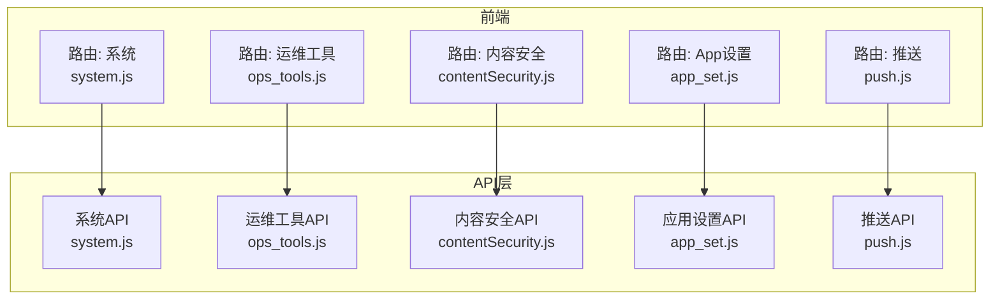
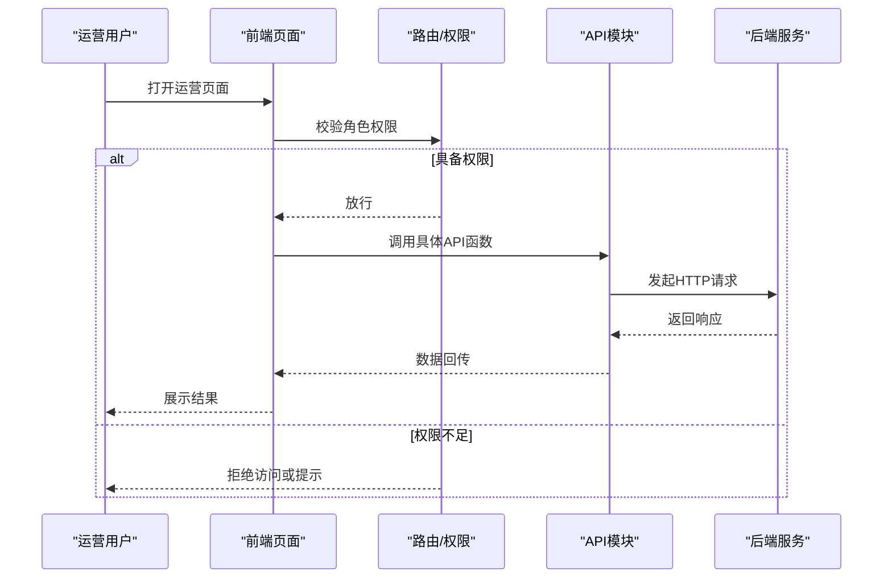
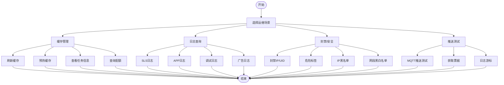
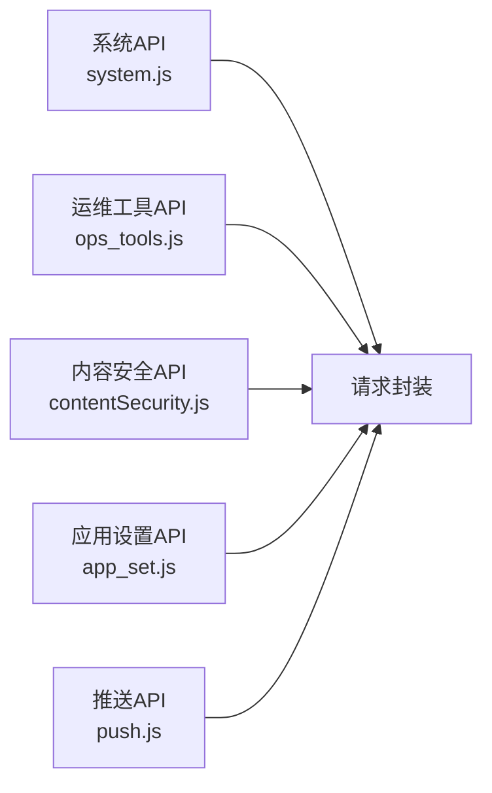

# 系统运营API

<cite>
**本文引用的文件**
- [src/api/system.js](file://src/api/system.js)
- [src/api/ops_tools.js](file://src/api/ops_tools.js)
- [src/api/contentSecurity.js](file://src/api/contentSecurity.js)
- [src/api/app_set.js](file://src/api/app_set.js)
- [src/api/push.js](file://src/api/push.js)
- [src/router/children/ops_tools.js](file://src/router/children/ops_tools.js)
- [src/router/children/system.js](file://src/router/children/system.js)
- [src/router/children/contentSecurity.js](file://src/router/children/contentSecurity.js)
- [src/router/children/app_set.js](file://src/router/children/app_set.js)
- [src/router/children/push.js](file://src/router/children/push.js)
</cite>

## 目录
1. [简介](#简介)
2. [项目结构](#项目结构)
3. [核心组件](#核心组件)
4. [架构总览](#架构总览)
5. [详细组件分析](#详细组件分析)
6. [依赖分析](#依赖分析)
7. [性能考虑](#性能考虑)
8. [故障排查指南](#故障排查指南)
9. [结论](#结论)
10. [附录](#附录)

## 简介
本文件面向系统运营人员与后端对接工程师，系统化梳理“系统运营”相关API，覆盖系统配置、运营工具（日志监控、缓存管理、推送测试）、内容安全、应用设置等模块的接口规范与调用示例，并结合前端路由与权限标识说明运营平台的访问控制与审计要求。

## 项目结构
- 运营相关API集中在 src/api 下按功能域拆分：
  - 系统管理：用户、用户组、权限、操作审计等
  - 运维工具：日志查询、缓存刷新/预热、MQTT推送测试、风险识别、采集等
  - 内容安全：机审/人审队列、敏感词、审核记录
  - 应用设置：Banner、版本渠道、参数开关、协议、广告位、社区版块、链接等
  - 推送：广播/单推、敏感词、报告
- 前端路由在 src/router/children 下以模块划分，每个页面均绑定角色权限标识，用于菜单与按钮级权限控制。

**图表来源**
- [src/router/children/ops_tools.js:1-128](file://src/router/children/ops_tools.js#L1-L128)
- [src/router/children/system.js:1-40](file://src/router/children/system.js#L1-L40)
- [src/router/children/contentSecurity.js:1-44](file://src/router/children/contentSecurity.js#L1-L44)
- [src/router/children/app_set.js:1-74](file://src/router/children/app_set.js#L1-L74)
- [src/router/children/push.js:1-32](file://src/router/children/push.js#L1-L32)
- [src/api/system.js:1-73](file://src/api/system.js#L1-L73)
- [src/api/ops_tools.js:1-174](file://src/api/ops_tools.js#L1-L174)
- [src/api/contentSecurity.js:1-115](file://src/api/contentSecurity.js#L1-L115)
- [src/api/app_set.js:1-265](file://src/api/app_set.js#L1-L265)
- [src/api/push.js:1-94](file://src/api/push.js#L1-L94)

**章节来源**
- [src/router/children/ops_tools.js:1-128](file://src/router/children/ops_tools.js#L1-L128)
- [src/router/children/system.js:1-40](file://src/router/children/system.js#L1-L40)
- [src/router/children/contentSecurity.js:1-44](file://src/router/children/contentSecurity.js#L1-L44)
- [src/router/children/app_set.js:1-74](file://src/router/children/app_set.js#L1-L74)
- [src/router/children/push.js:1-32](file://src/router/children/push.js#L1-L32)

## 核心组件
- 系统管理API：用户详情、用户列表、保存用户、用户组列表、保存/删除用户组、权限列表、删除用户、操作审计、按权限筛选用户组
- 运维工具API：SLS日志、新用户留存、Nami同步时间读取/设置、封禁IP/UID、危险标签、缓存刷新/预热、缓存任务信息、缓存配额、IP/网段黑白名单、MQTT推送测试、获取票据、日志游标
- 内容安全API：机审队列、二审统计、二审列表、忽略/处理二审、误判忽略、敏感词列表、添加/删除敏感词
- 应用设置API：广告比例、Banner列表、版本渠道、参数开关（社区/聊天室/新闻/用户/其他/比赛）、版块信息、个人背景、协议、链接、雷速广告位、渠道列表
- 推送API：广播/单推列表、详情、保存、执行、报告、注册ID查询、推送敏感词、添加/删除推送敏感词

**章节来源**
- [src/api/system.js:1-73](file://src/api/system.js#L1-L73)
- [src/api/ops_tools.js:1-174](file://src/api/ops_tools.js#L1-L174)
- [src/api/contentSecurity.js:1-115](file://src/api/contentSecurity.js#L1-L115)
- [src/api/app_set.js:1-265](file://src/api/app_set.js#L1-L265)
- [src/api/push.js:1-94](file://src/api/push.js#L1-L94)

## 架构总览
前端通过统一请求封装发起HTTP调用，各模块API文件集中暴露函数，路由模块为页面绑定角色权限，形成“权限控制 → 页面 → API调用”的闭环。

**图表来源**
- [src/router/children/ops_tools.js:107-127](file://src/router/children/ops_tools.js#L107-L127)
- [src/router/children/system.js:30-39](file://src/router/children/system.js#L30-L39)
- [src/router/children/contentSecurity.js:32-43](file://src/router/children/contentSecurity.js#L32-L43)
- [src/router/children/app_set.js:55-73](file://src/router/children/app_set.js#L55-L73)
- [src/router/children/push.js:24-31](file://src/router/children/push.js#L24-L31)
- [src/api/system.js:1-73](file://src/api/system.js#L1-L73)
- [src/api/ops_tools.js:1-174](file://src/api/ops_tools.js#L1-L174)
- [src/api/contentSecurity.js:1-115](file://src/api/contentSecurity.js#L1-L115)
- [src/api/app_set.js:1-265](file://src/api/app_set.js#L1-L265)
- [src/api/push.js:1-94](file://src/api/push.js#L1-L94)

## 详细组件分析

### 系统管理API
- 用户与权限
  - 获取账号详情、后台用户列表、保存用户、用户组列表、保存/删除用户组、权限列表、删除用户、按权限筛选用户组
  - 获取后台操作记录（审计）
- 调用要点
  - 用户列表/操作记录等采用POST，携带分页与过滤参数
  - 保存用户/组、删除用户/组、权限列表等为POST
  - 获取详情/列表多为GET
- 实战示例
  - 修改系统用户：调用保存用户接口，提交包含用户信息的JSON对象
  - 查询操作审计：调用获取操作记录接口，传入时间范围与操作类型等条件
  - 删除用户组：调用删除用户组接口，提交包含组ID的对象

**章节来源**
- [src/api/system.js:4-72](file://src/api/system.js#L4-L72)

### 运维工具API
- 日志与监控
  - SLS日志、新用户留存、APP/调试/广告日志、任务记录、用户轨迹、风险识别、采集（虎扑/新闻/直播吧）
- 缓存管理
  - 刷新缓存、预热缓存、缓存任务信息、缓存配额
- 安全与封禁
  - 封禁IP/UID、危险标签、IP黑名单、封禁网段、白名单
- 推送测试
  - MQTT推送测试、获取票据、日志游标
- 调用要点
  - 多数接口为POST，部分为GET；分页参数以page/limit传递
  - 缓存相关接口支持批量与任务状态查询
- 实战示例
  - 清理缓存：调用刷新缓存接口，提交需要清理的键前缀或业务标识
  - 预热缓存：调用预热缓存接口，提交目标键集合或策略
  - 测试MQTT：调用MQTT推送测试接口，提交设备/主题/消息体
  - 查询APP日志：调用对应日志接口，传入时间范围与关键字

**图表来源**
- [src/api/ops_tools.js:3-174](file://src/api/ops_tools.js#L3-L174)

**章节来源**
- [src/api/ops_tools.js:3-174](file://src/api/ops_tools.js#L3-L174)

### 内容安全API
- 机审队列、二审统计、二审列表、忽略/处理二审、误判忽略
- 敏感词管理：列表、添加（支持批量）、删除
- 调用要点
  - 二审相关接口多为POST，支持忽略/处理两种动作
  - 敏感词列表为GET，添加/删除为POST
- 实战示例
  - 审核机审队列：拉取待审内容，进行人工复核并提交处理结果
  - 维护敏感词库：批量导入敏感词，定期清理无效条目

**章节来源**
- [src/api/contentSecurity.js:29-105](file://src/api/contentSecurity.js#L29-L105)

### 应用设置API
- 广告与展示
  - 广告比例、Banner列表、保存Banner、版本渠道、保存版本/渠道、删除版本
- 参数开关
  - 社区/聊天室/新闻/用户/其他/比赛参数开关
- 版块与背景
  - 版块信息设置/获取、个人背景图列表、保存/删除背景
- 协议与链接
  - 协议配置列表、保存协议、友情链接、保存链接
- 雷速广告位
  - 获取/保存指定位置广告位
- 调用要点
  - 多数为GET/POST，参数开关类接口以POST提交变更
- 实战示例
  - 修改比赛参数：调用比赛参数接口，提交包含各项开关与阈值的对象
  - 上架新版本：调用保存版本接口，提交版本号、强制更新标志、渠道映射

**章节来源**
- [src/api/app_set.js:3-265](file://src/api/app_set.js#L3-L265)

### 推送API
- 广播/单推
  - 列表、详情、保存、执行、报告
- 敏感词
  - 列表、添加（批量）、删除
- 注册ID查询
  - 根据用户ID查询设备注册ID
- 调用要点
  - 列表/详情多为POST/GET组合，执行推送为POST
  - 敏感词接口为GET/POST
- 实战示例
  - 执行广播：调用广播执行接口，提交标题、内容、目标人群等
  - 单推测试：调用单推接口，提交目标用户与消息体

**章节来源**
- [src/api/push.js:3-94](file://src/api/push.js#L3-L94)

## 依赖分析
- 模块耦合
  - 各API模块相对独立，仅通过统一请求封装与后端交互
  - 路由模块对权限标识强依赖，确保“最小权限”
- 外部依赖
  - 请求封装：统一的HTTP客户端，便于拦截器、鉴权、错误处理
- 潜在循环依赖
  - 当前结构清晰，无明显循环依赖迹象

**图表来源**
- [src/api/system.js:1](file://src/api/system.js#L1)
- [src/api/ops_tools.js:1](file://src/api/ops_tools.js#L1)
- [src/api/contentSecurity.js:1](file://src/api/contentSecurity.js#L1)
- [src/api/app_set.js:1](file://src/api/app_set.js#L1)
- [src/api/push.js:1](file://src/api/push.js#L1)

**章节来源**
- [src/api/system.js:1](file://src/api/system.js#L1)
- [src/api/ops_tools.js:1](file://src/api/ops_tools.js#L1)
- [src/api/contentSecurity.js:1](file://src/api/contentSecurity.js#L1)
- [src/api/app_set.js:1](file://src/api/app_set.js#L1)
- [src/api/push.js:1](file://src/api/push.js#L1)

## 性能考虑
- 分页与限流
  - 日志与列表接口普遍支持分页参数，建议在前端实现合理的分页与滚动加载，避免一次性请求过多数据
- 缓存策略
  - 对高频只读配置（如参数开关、版本列表）建议前端本地缓存，减少重复请求
- 并发控制
  - 批量操作（如批量添加敏感词、批量预热缓存）应限制并发度，避免触发后端限流
- 错峰维护
  - 缓存刷新/预热尽量安排在低峰时段，避免影响线上性能

## 故障排查指南
- 权限不足
  - 若页面无法打开或按钮不可用，请检查当前登录用户的权限是否包含对应路由meta中的roles
- 日志查询失败
  - 确认时间范围与关键字是否合理；尝试缩小范围重试
- 缓存操作异常
  - 检查输入的键前缀/集合是否正确；确认剩余配额充足
- 推送测试失败
  - 校验设备/主题/消息体格式；确认MQTT服务可用
- 审核流程卡顿
  - 关注二审队列长度与处理耗时；必要时清理误判项

**章节来源**
- [src/router/children/ops_tools.js:107-127](file://src/router/children/ops_tools.js#L107-L127)
- [src/router/children/system.js:30-39](file://src/router/children/system.js#L30-L39)
- [src/router/children/contentSecurity.js:32-43](file://src/router/children/contentSecurity.js#L32-L43)
- [src/router/children/app_set.js:55-73](file://src/router/children/app_set.js#L55-L73)
- [src/router/children/push.js:24-31](file://src/router/children/push.js#L24-L31)

## 结论
本文档从API维度梳理了系统运营所需的配置、监控、安全与推送能力，并结合前端路由与权限标识给出操作与审计要求。建议在日常运营中遵循“最小权限、操作留痕、错峰维护”的原则，配合缓存与日志工具提升效率与稳定性。

## 附录

### API清单与调用示例指引
- 系统管理
  - 获取用户详情：GET /v1/admin/user/get_detail
  - 获取用户列表：POST /v1/admin/user/user_list
  - 保存用户：POST /v1/admin/user/save_user_v2
  - 获取用户组列表：GET /v1/admin/user/group_list
  - 保存/删除用户组：POST /v1/admin/user/save_group, POST /v1/admin/user/delete_group
  - 获取权限列表：GET /v1/admin/user/permissions_list
  - 删除用户：POST /v1/admin/user/delete_user
  - 获取操作记录：POST /v1/admin/user/operate_logs
  - 按权限筛选用户组：POST /v1/admin/user/groups_by_permission
  - 示例：修改系统用户 → 提交包含用户信息的JSON对象到保存用户接口
  - 示例：查询操作审计 → 在获取操作记录接口中传入时间范围与操作类型等条件

- 运维工具
  - SLS日志：POST /v1/admin/report/sls_logs
  - 新用户留存：POST /v1/admin/report/sls_new_user_reamin
  - Nami同步时间：GET /v1/admin/report/get_sync_time, POST /v1/admin/report/set_sync_time
  - 封禁IP/UID：GET /v1/admin/report/forbidden_ips?page=..., &limit=..., GET /v1/admin/report/forbidden_uids?page=..., &limit=...
  - 危险标签：GET /v1/admin/report/dangerous_tags
  - 刷新缓存：POST /v1/admin/report/refresh_cache
  - 预热缓存：POST /v1/admin/report/push_cache
  - 缓存任务信息：POST /v1/admin/report/cache_task_info
  - 缓存配额：GET /v1/admin/report/cache_quota
  - IP黑名单：GET /v1/admin/report/get_ip_black_list, POST /v1/admin/report/rem_ip_black_list
  - 封禁网段：GET /v1/admin/report/get_forbidden_segments, POST /v1/admin/report/delete_forbidden_segment, POST /v1/admin/report/add_forbidden_segment
  - 白名单网段：GET /v1/admin/report/get_white_segments, POST /v1/admin/report/delete_white_segment, POST /v1/admin/report/add_white_segment
  - MQTT推送测试：POST /v1/admin/report/mqtt_push
  - 获取票据：GET /v1/admin/misc/get_ticket
  - 日志游标：GET /v1/admin/misc/get_lognext
  - 示例：清理缓存 → 提交需要清理的键前缀或业务标识到刷新缓存接口
  - 示例：预热缓存 → 提交目标键集合或策略到预热缓存接口
  - 示例：测试MQTT → 提交设备/主题/消息体到MQTT推送测试接口
  - 示例：查询APP日志 → 在对应日志接口中传入时间范围与关键字

- 内容安全
  - 机审队列：POST /v1/admin/moderate/moderation
  - 二审统计：GET /v1/admin/moderate/moderation_second_num
  - 二审列表：POST /v1/admin/moderate/moderation_second
  - 忽略二审：POST /v1/admin/moderate/ignore_moderation_second
  - 处理二审：POST /v1/admin/moderate/handler_moderation_second
  - 误判忽略：POST /v1/admin/moderate/ignore_moderation
  - 敏感词列表：GET /v1/admin/moderate/sensitive_word_list?type=...
  - 添加敏感词：POST /v1/admin/moderate/add_sensitive_word
  - 删除敏感词：POST /v1/admin/moderate/delete_sensitive_word
  - 示例：维护敏感词库 → 批量导入敏感词，定期清理无效条目

- 应用设置
  - 广告比例：GET /v1/admin/mobile/get_ad_ratio, POST /v1/admin/mobile/save_ad_ratio
  - Banner列表：POST /v1/admin/mobile/banner_list
  - 保存Banner：POST /v1/admin/mobile/update_banner
  - 版本列表：GET /v1/admin/mobile/version_list
  - 保存/删除版本：POST /v1/admin/mobile/save_version, POST /v1/admin/mobile/delete_version
  - 渠道列表：GET /v1/admin/mobile/channel_list?version=..., POST /v1/admin/mobile/save_channel
  - 参数开关：GET /v1/admin/mobile/entry_list, GET /v1/admin/mobile/all_params
  - 社区/聊天室/新闻/用户/其他/比赛参数：POST /v1/admin/mobile/group_params, /room_params, /news_params, /user_params, /other_params, /match_params
  - 版块信息：POST /v1/admin/mobile/set_catalog_info, GET /v1/admin/mobile/get_catalog_info
  - 个人背景：GET /v1/admin/mobile/profile_bg_list, POST /v1/admin/mobile/save_profile_bg, POST /v1/admin/mobile/delete_profile_bg
  - 协议配置：GET /v1/admin/mobile/agreement_list, POST /v1/admin/mobile/save_agreement
  - 友情链接：POST /v1/admin/mobile/links, POST /v1/admin/mobile/link_save
  - 雷速广告位：POST /v1/admin/mobile/save_leisu_ad, GET /v1/admin/mobile/get_leisu_ad?location=...
  - 渠道列表：GET /v1/admin/mobile/get_channel_list
  - 示例：修改比赛参数 → 提交包含各项开关与阈值的对象到比赛参数接口

- 推送
  - 广播列表：POST v1/admin/push/push_list
  - 单推列表：POST v1/admin/push/targeted_push_list
  - 广播详情：GET v1/admin/push/push_item/{id}
  - 单推详情：GET v1/admin/push/targeted_push_item/{id}
  - 保存广播/单推：POST v1/admin/push/save_push, POST v1/admin/push/targeted_save_push
  - 执行广播/单推：POST v1/admin/push/push, POST v1/admin/push/targeted_push
  - 推送报告：POST v1/admin/push/push_report
  - 注册ID查询：GET v1/admin/push/get_registration_ids?uid=...
  - 推送敏感词：GET /v1/admin/push/sensitive_word_list
  - 添加/删除推送敏感词：POST /v1/admin/push/add_sensitive_word, POST /v1/admin/push/delete_sensitive_word
  - 示例：执行广播 → 提交标题、内容、目标人群等到广播执行接口
  - 示例：单推测试 → 提交目标用户与消息体到单推接口

**章节来源**
- [src/api/system.js:4-72](file://src/api/system.js#L4-L72)
- [src/api/ops_tools.js:3-174](file://src/api/ops_tools.js#L3-L174)
- [src/api/contentSecurity.js:29-105](file://src/api/contentSecurity.js#L29-L105)
- [src/api/app_set.js:3-265](file://src/api/app_set.js#L3-L265)
- [src/api/push.js:3-94](file://src/api/push.js#L3-L94)