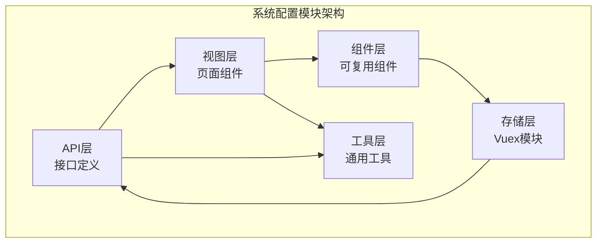
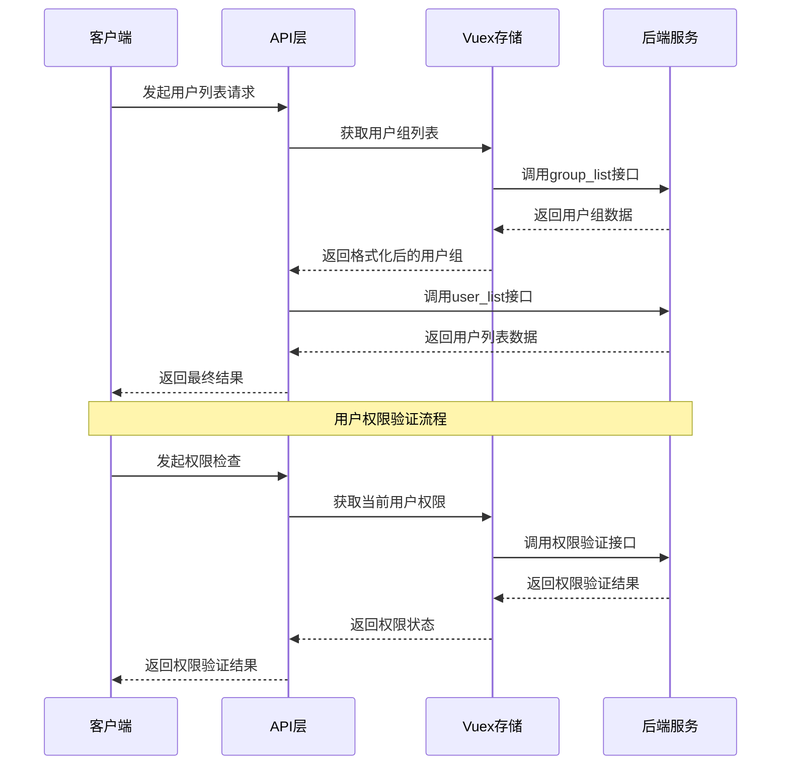
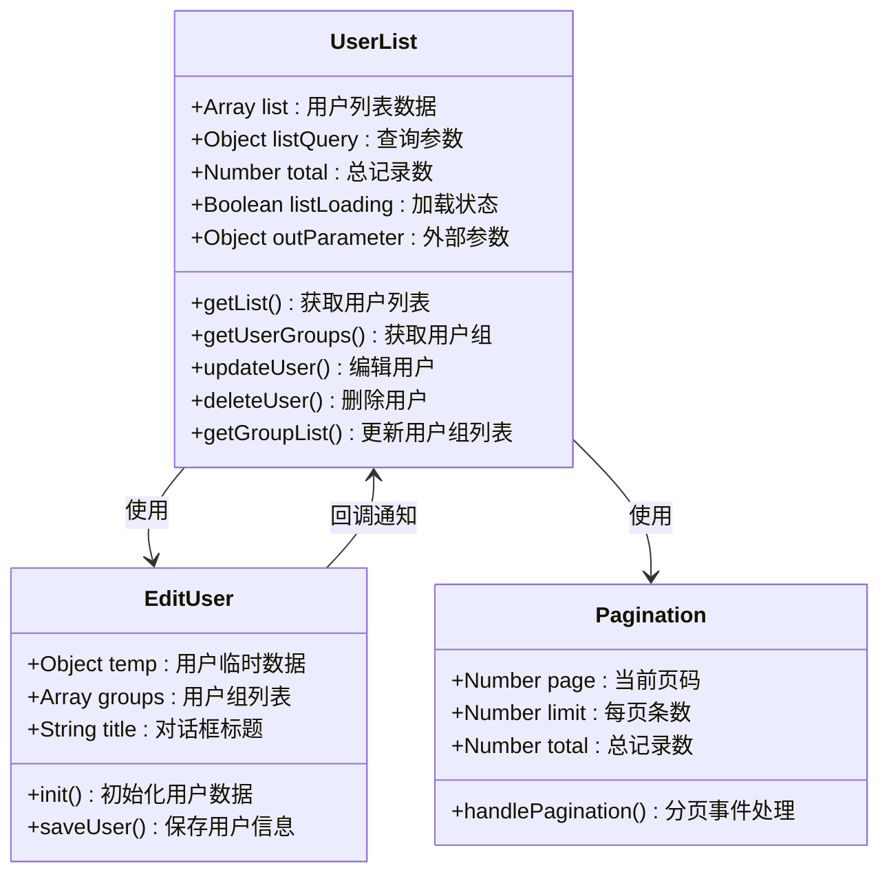
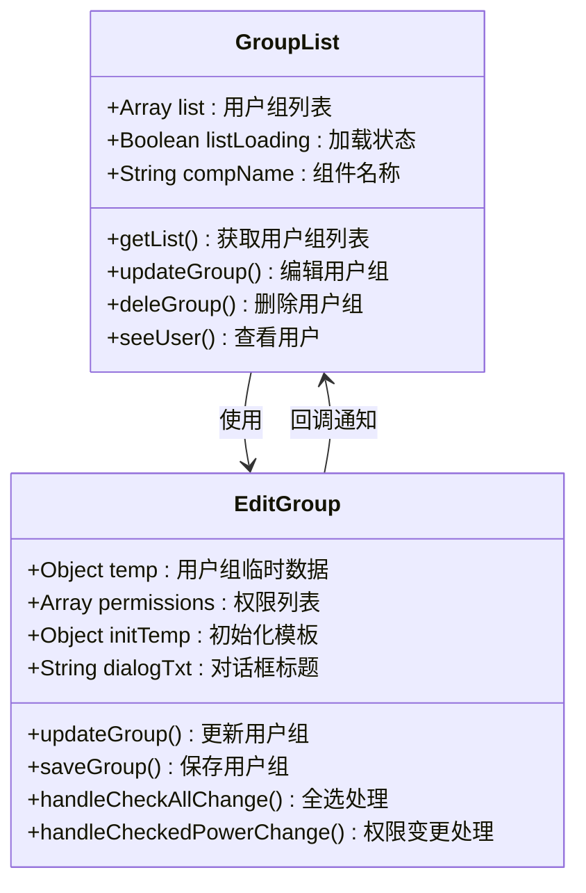
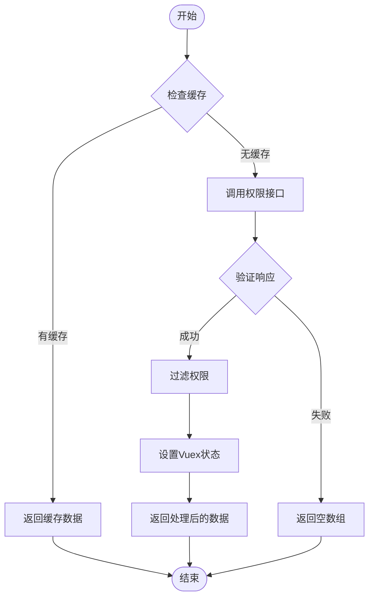
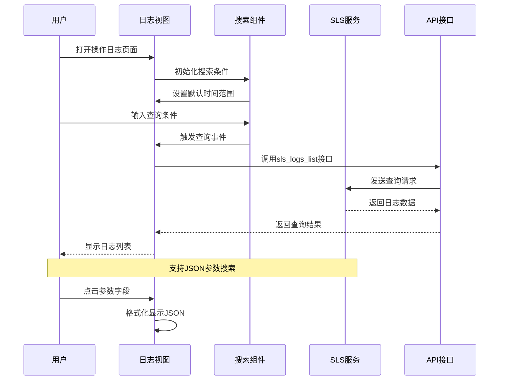
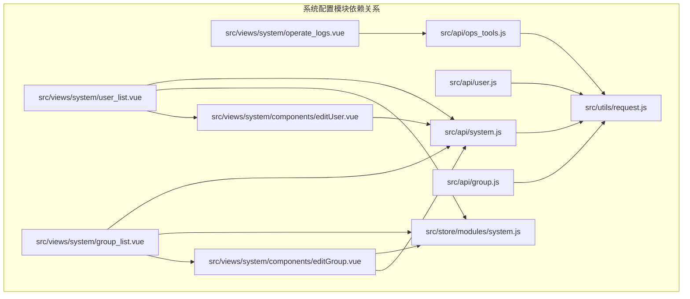

# 系统配置API

<cite>
**本文档引用的文件**
- [src/api/system.js](file://src/api/system.js)
- [src/api/user.js](file://src/api/user.js)
- [src/api/group.js](file://src/api/group.js)
- [src/api/ops_tools.js](file://src/api/ops_tools.js)
- [src/router/children/system.js](file://src/router/children/system.js)
- [src/views/system/user_list.vue](file://src/views/system/user_list.vue)
- [src/views/system/group_list.vue](file://src/views/system/group_list.vue)
- [src/views/system/operate_logs.vue](file://src/views/system/operate_logs.vue)
- [src/views/system/components/editUser.vue](file://src/views/system/components/editUser.vue)
- [src/views/system/components/editGroup.vue](file://src/views/system/components/editGroup.vue)
- [src/store/modules/system.js](file://src/store/modules/system.js)
- [src/utils/request.js](file://src/utils/request.js)
</cite>

## 目录
1. [简介](#简介)
2. [项目结构](#项目结构)
3. [核心组件](#核心组件)
4. [架构概览](#架构概览)
5. [详细组件分析](#详细组件分析)
6. [依赖关系分析](#依赖关系分析)
7. [性能考虑](#性能考虑)
8. [故障排除指南](#故障排除指南)
9. [结论](#结论)

## 简介
本文件为系统配置模块的详细API文档，涵盖用户管理、用户组管理、权限管理、操作日志等相关接口的API规范。文档详细说明了用户信息获取、用户列表查询、用户编辑保存、用户删除等用户管理接口的请求参数、响应格式和使用示例；解释了用户组管理接口，包括用户组列表查询、用户组创建编辑、用户组删除等功能的接口规格；阐述了权限管理接口，包括权限列表查询、权限分配、权限验证等接口的实现细节；提供了操作日志查询接口的完整使用指南，包括日志筛选条件、分页参数、排序规则等。同时包含系统配置的最佳实践，如权限控制策略、操作审计要求、安全配置建议等。

## 项目结构
系统配置模块位于前端项目的src目录下，主要由以下层次组成：
- API层：封装与后端交互的接口方法
- 视图层：负责页面展示和用户交互
- 组件层：可复用的功能组件
- 存储层：Vuex模块管理状态
- 工具层：通用工具函数和HTTP请求封装

**图表来源**
- [src/api/system.js:1-73](file://src/api/system.js#L1-L73)
- [src/views/system/user_list.vue:1-245](file://src/views/system/user_list.vue#L1-L245)
- [src/store/modules/system.js:1-186](file://src/store/modules/system.js#L1-L186)

**章节来源**
- [src/router/children/system.js:1-40](file://src/router/children/system.js#L1-L40)
- [src/api/system.js:1-73](file://src/api/system.js#L1-L73)

## 核心组件

### 用户管理接口
用户管理模块提供完整的后台系统用户生命周期管理功能：

#### 用户信息获取
- **接口路径**: `/v1/admin/user/get_detail`
- **请求方式**: GET
- **功能**: 获取指定用户的详细信息
- **参数**: 通过URL参数传递用户ID
- **响应**: 返回用户基本信息、权限状态等

#### 用户列表查询
- **接口路径**: `/v1/admin/user/user_list`
- **请求方式**: POST
- **功能**: 分页查询后台系统用户列表
- **请求体参数**:
  - page: 页码，默认1
  - limit: 每页条数，默认15
  - search_cond: 查询条件对象
  - orderby_cond: 排序条件数组
- **响应**: 返回用户列表数据和总数

#### 用户编辑保存
- **接口路径**: `/v1/admin/user/save_user_v2`
- **请求方式**: POST
- **功能**: 保存用户信息修改
- **请求体参数**:
  - id: 用户ID
  - name: 用户名
  - email: 邮箱
  - group_id: 用户组ID
  - banned: 是否禁用
  - status: 用户状态

#### 用户删除
- **接口路径**: `/v1/admin/user/delete_user`
- **请求方式**: POST
- **功能**: 删除指定用户
- **请求体参数**: user_id

**章节来源**
- [src/api/system.js:4-58](file://src/api/system.js#L4-L58)
- [src/views/system/user_list.vue:158-241](file://src/views/system/user_list.vue#L158-L241)
- [src/views/system/components/editUser.vue:45-69](file://src/views/system/components/editUser.vue#L45-L69)

### 用户组管理接口
用户组管理模块提供用户组的全生命周期管理：

#### 用户组列表查询
- **接口路径**: `/v1/admin/user/group_list`
- **请求方式**: GET
- **功能**: 获取所有用户组列表
- **响应**: 返回用户组数组，包含ID、名称、描述、状态等

#### 用户组创建编辑
- **接口路径**: `/v1/admin/user/save_group`
- **请求方式**: POST
- **功能**: 创建或更新用户组
- **请求体参数**:
  - id: 用户组ID（新增时可为空）
  - group_name: 用户组名称
  - description: 描述
  - active: 启用状态
  - default_action: 默认权限动作
  - permissions: 权限列表

#### 用户组删除
- **接口路径**: `/v1/admin/user/delete_group`
- **请求方式**: POST
- **功能**: 删除指定用户组
- **请求体参数**: id

**章节来源**
- [src/api/system.js:26-45](file://src/api/system.js#L26-L45)
- [src/views/system/group_list.vue:75-141](file://src/views/system/group_list.vue#L75-L141)
- [src/views/system/components/editGroup.vue:122-170](file://src/views/system/components/editGroup.vue#L122-L170)

### 权限管理接口
权限管理模块提供权限的查询和分配功能：

#### 权限列表查询
- **接口路径**: `/v1/admin/user/permissions_list`
- **请求方式**: GET
- **功能**: 获取所有可用权限列表
- **响应**: 返回权限数组，包含权限标识、名称、分组等信息

#### 按权限查询用户组
- **接口路径**: `/v1/admin/user/groups_by_permission`
- **请求方式**: POST
- **功能**: 查询拥有指定权限的所有用户组
- **请求体参数**: 权限标识

**章节来源**
- [src/api/system.js:46-72](file://src/api/system.js#L46-L72)
- [src/store/modules/system.js:38-61](file://src/store/modules/system.js#L38-L61)

### 操作日志接口
操作日志模块提供后台操作记录的查询功能：

#### 后台操作记录查询
- **接口路径**: `/v1/admin/user/operate_logs`
- **请求方式**: POST
- **功能**: 查询后台系统操作日志
- **请求体参数**:
  - page: 页码
  - limit: 每页条数
  - from_time: 开始时间戳
  - to_time: 结束时间戳
  - query: 查询语句

**章节来源**
- [src/api/system.js:59-64](file://src/api/system.js#L59-L64)
- [src/views/system/operate_logs.vue:148-186](file://src/views/system/operate_logs.vue#L148-L186)

## 架构概览

**图表来源**
- [src/views/system/user_list.vue:158-198](file://src/views/system/user_list.vue#L158-L198)
- [src/store/modules/system.js:142-177](file://src/store/modules/system.js#L142-L177)
- [src/api/system.js:12-18](file://src/api/system.js#L12-L18)

## 详细组件分析

### 用户管理组件分析

#### 用户列表组件
用户列表组件实现了完整的用户管理界面，包含搜索、分页、排序、编辑、删除等功能。

**图表来源**
- [src/views/system/user_list.vue:120-244](file://src/views/system/user_list.vue#L120-L244)
- [src/views/system/components/editUser.vue:34-72](file://src/views/system/components/editUser.vue#L34-L72)

#### 用户组管理组件
用户组管理组件提供了用户组的完整管理功能，包括权限分配、用户查看等。

**图表来源**
- [src/views/system/group_list.vue:46-151](file://src/views/system/group_list.vue#L46-L151)
- [src/views/system/components/editGroup.vue:79-207](file://src/views/system/components/editGroup.vue#L79-L207)

### 权限管理系统分析

#### 权限存储和过滤机制
系统采用Vuex模块管理权限状态，并提供权限过滤功能。

**图表来源**
- [src/store/modules/system.js:38-61](file://src/store/modules/system.js#L38-L61)
- [src/store/modules/system.js:64-133](file://src/store/modules/system.js#L64-L133)

**章节来源**
- [src/store/modules/system.js:1-186](file://src/store/modules/system.js#L1-L186)

### 操作日志查询分析

#### 日志查询组件
操作日志组件提供了强大的日志查询功能，支持多种筛选条件和时间范围。

**图表来源**
- [src/views/system/operate_logs.vue:148-227](file://src/views/system/operate_logs.vue#L148-L227)
- [src/api/ops_tools.js:3-9](file://src/api/ops_tools.js#L3-L9)

**章节来源**
- [src/views/system/operate_logs.vue:1-244](file://src/views/system/operate_logs.vue#L1-L244)

## 依赖关系分析

**图表来源**
- [src/api/system.js:1-73](file://src/api/system.js#L1-L73)
- [src/views/system/user_list.vue:113-124](file://src/views/system/user_list.vue#L113-L124)
- [src/store/modules/system.js:1-186](file://src/store/modules/system.js#L1-L186)

**章节来源**
- [src/utils/request.js:1-130](file://src/utils/request.js#L1-L130)

## 性能考虑
系统配置模块在设计时充分考虑了性能优化：

1. **缓存策略**: Vuex模块提供权限和用户组数据缓存，避免重复请求
2. **懒加载**: 组件按需加载，减少初始包体积
3. **分页查询**: 用户列表和日志查询均支持分页，避免大数据量传输
4. **防抖处理**: 搜索功能具备防抖机制，减少频繁请求
5. **状态管理**: 统一的状态管理减少了组件间的通信开销

## 故障排除指南

### 常见问题及解决方案

#### 登录状态异常
当出现登录状态异常时，系统会自动跳转到登录页面。检查项：
- Token是否过期或无效
- 后端认证服务是否正常
- 浏览器Cookie设置

#### 权限不足
当用户权限不足时，系统会显示相应的错误提示。解决步骤：
- 检查用户所属用户组权限
- 确认权限分配是否正确
- 验证用户组状态是否启用

#### 数据加载失败
如果数据加载失败，检查以下方面：
- 网络连接是否正常
- API接口是否可达
- 请求参数是否正确

**章节来源**
- [src/utils/request.js:46-127](file://src/utils/request.js#L46-L127)

## 结论
系统配置模块提供了完整的后台管理系统所需的核心功能，包括用户管理、用户组管理、权限管理和操作日志查询。模块采用清晰的分层架构设计，具有良好的可维护性和扩展性。通过合理的缓存策略和性能优化，确保了系统的高效运行。建议在实际使用中遵循最佳实践，加强权限控制和安全配置，确保系统的稳定性和安全性。