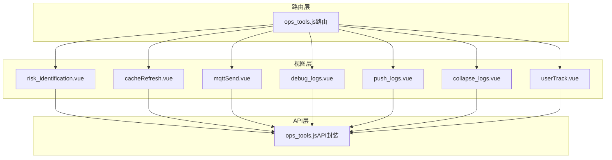
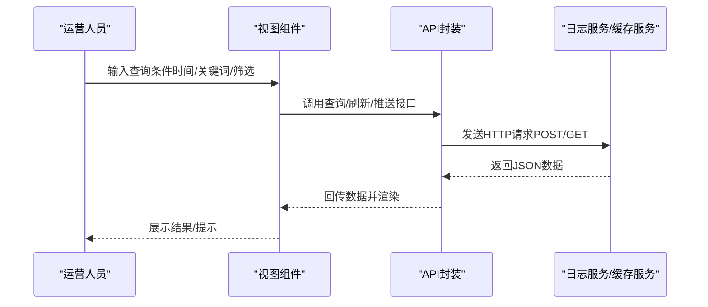
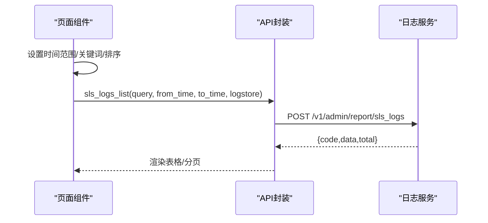
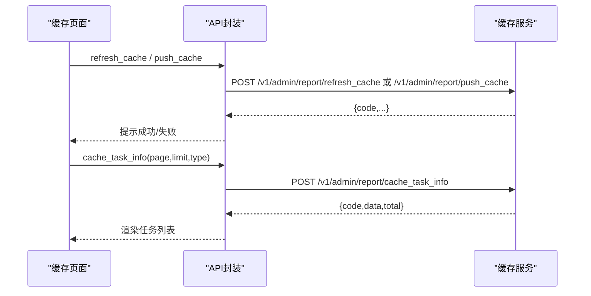
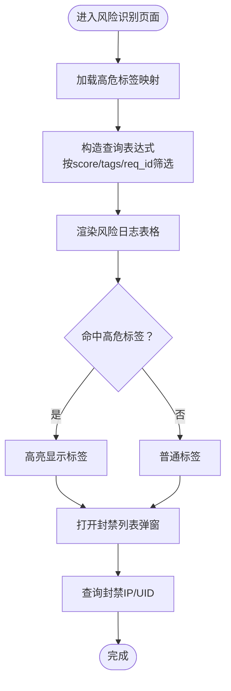
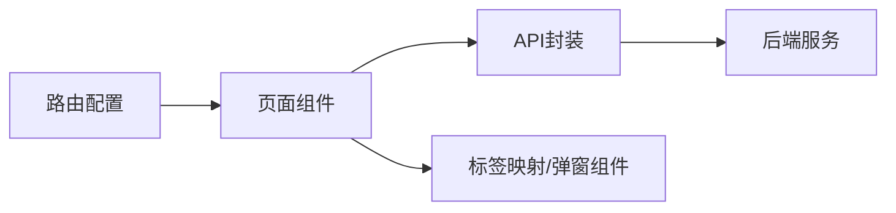

# 运营工具API

<cite>
**本文引用的文件**
- [ops_tools.js](file://src/api/ops_tools.js)
- [ops_tools.js（路由）](file://src/router/children/ops_tools.js)
- [risk_identification.vue](file://src/views/ops_tools/risk_identification.vue)
- [cacheRefresh.vue](file://src/views/ops_tools/cacheRefresh.vue)
- [mqttSend.vue](file://src/views/ops_tools/mqttSend.vue)
- [debug_logs.vue](file://src/views/ops_tools/debug_logs.vue)
- [push_logs.vue](file://src/views/ops_tools/push_logs.vue)
- [collapse_logs.vue](file://src/views/ops_tools/collapse_logs.vue)
- [userTrack.vue](file://src/views/ops_tools/userTrack.vue)
- [mqttMsg.md](file://public/mqttMsg.md)
- [sy.json](file://src/views/ops_tools/sy.json)
</cite>

## 目录
1. [简介](#简介)
2. [项目结构](#项目结构)
3. [核心组件](#核心组件)
4. [架构总览](#架构总览)
5. [详细组件分析](#详细组件分析)
6. [依赖分析](#依赖分析)
7. [性能考量](#性能考量)
8. [故障排查指南](#故障排查指南)
9. [结论](#结论)
10. [附录](#附录)

## 简介
本文件面向运营与平台工程团队，系统化梳理“运营工具”模块的API与前端界面规范，覆盖日志监控、缓存管理、推送测试、风险识别等能力。文档以“接口定义 + 使用指南 + 安全与审计”为主线，帮助快速定位问题、执行日常运营动作并保障操作安全。

## 项目结构
- 运营工具模块由“路由 + API封装 + 页面组件”三层构成：
  - 路由层：定义菜单、权限与页面入口
  - API层：统一封装与后端交互的HTTP调用
  - 视图层：各功能页面（日志查询、缓存刷新、风险识别、推送测试等）

图表来源
- [ops_tools.js（路由）:1-128](file://src/router/children/ops_tools.js#L1-L128)
- [ops_tools.js:1-174](file://src/api/ops_tools.js#L1-L174)
- [risk_identification.vue:1-404](file://src/views/ops_tools/risk_identification.vue#L1-L404)
- [cacheRefresh.vue:1-199](file://src/views/ops_tools/cacheRefresh.vue#L1-L199)
- [mqttSend.vue:1-173](file://src/views/ops_tools/mqttSend.vue#L1-L173)
- [debug_logs.vue:1-183](file://src/views/ops_tools/debug_logs.vue#L1-L183)
- [push_logs.vue:1-301](file://src/views/ops_tools/push_logs.vue#L1-L301)
- [collapse_logs.vue:1-283](file://src/views/ops_tools/collapse_logs.vue#L1-L283)
- [userTrack.vue:1-257](file://src/views/ops_tools/userTrack.vue#L1-L257)

章节来源
- [ops_tools.js（路由）:1-128](file://src/router/children/ops_tools.js#L1-L128)

## 核心组件
- 日志监控
  - APP调试日志、崩溃日志、推送日志、用户轨迹日志
  - 统一通过SLI/SLS查询接口，支持关键词检索、时间范围筛选、排序与分页
- 缓存管理
  - 刷新缓存、预热缓存、查看任务状态与配额
  - 支持CDN/DCDN类型切换与状态过滤
- 推送测试
  - MQTT消息推送、主题与内容编辑、快捷模板
  - 足球/篮球等长连接主题说明与数据格式
- 风险识别
  - 风险标签展示、高危标签标记、封禁IP/UID查询
  - 标签含义映射与趋势分析

章节来源
- [ops_tools.js:1-174](file://src/api/ops_tools.js#L1-L174)
- [debug_logs.vue:1-183](file://src/views/ops_tools/debug_logs.vue#L1-L183)
- [push_logs.vue:1-301](file://src/views/ops_tools/push_logs.vue#L1-L301)
- [collapse_logs.vue:1-283](file://src/views/ops_tools/collapse_logs.vue#L1-L283)
- [userTrack.vue:1-257](file://src/views/ops_tools/userTrack.vue#L1-L257)
- [cacheRefresh.vue:1-199](file://src/views/ops_tools/cacheRefresh.vue#L1-L199)
- [mqttSend.vue:1-173](file://src/views/ops_tools/mqttSend.vue#L1-L173)
- [risk_identification.vue:1-404](file://src/views/ops_tools/risk_identification.vue#L1-L404)

## 架构总览
- 前端通过API封装统一访问后端接口，页面组件负责UI交互、查询条件构造与结果展示
- 日志类组件依赖SLI/SLS查询接口，支持复杂查询语法与聚合统计
- 风险识别组件加载标签映射，用于高危标签可视化与封禁列表联动

图表来源
- [ops_tools.js:1-174](file://src/api/ops_tools.js#L1-L174)
- [debug_logs.vue:130-153](file://src/views/ops_tools/debug_logs.vue#L130-L153)
- [push_logs.vue:177-221](file://src/views/ops_tools/push_logs.vue#L177-L221)
- [collapse_logs.vue:167-205](file://src/views/ops_tools/collapse_logs.vue#L167-L205)
- [userTrack.vue:151-207](file://src/views/ops_tools/userTrack.vue#L151-L207)
- [cacheRefresh.vue:127-143](file://src/views/ops_tools/cacheRefresh.vue#L127-L143)
- [mqttSend.vue:152-165](file://src/views/ops_tools/mqttSend.vue#L152-L165)

## 详细组件分析

### 日志监控API规范
- 统一查询接口
  - 方法：POST
  - 地址：/v1/admin/report/sls_logs
  - 请求体字段
    - logstore: 日志库名（如 app_log、mobile_log、push_log、track_log、saf_log）
    - from_time: 开始时间戳（秒）
    - to_time: 结束时间戳（秒）
    - query: 查询表达式（支持关键词、字段过滤、聚合统计）
  - 响应
    - code: 状态码（0表示成功）
    - data: 查询结果数组
    - total: 当使用聚合统计时返回总数
- 典型使用场景
  - APP调试日志：logstore=app_log，按uid/设备/平台筛选
  - 崩溃日志：logstore=mobile_log，scene=崩溃，按品牌/型号/版本筛选
  - 推送日志：logstore=push_log，按op/scene/alert/audience等字段筛选
  - 用户轨迹：logstore=track_log，按uid/module/action/ip等筛选
  - 风险日志：logstore=saf_log，按score/tags/req_id等筛选

章节来源
- [ops_tools.js:3-9](file://src/api/ops_tools.js#L3-L9)
- [debug_logs.vue:104-153](file://src/views/ops_tools/debug_logs.vue#L104-L153)
- [push_logs.vue:138-221](file://src/views/ops_tools/push_logs.vue#L138-L221)
- [collapse_logs.vue:126-205](file://src/views/ops_tools/collapse_logs.vue#L126-L205)
- [userTrack.vue:112-207](file://src/views/ops_tools/userTrack.vue#L112-L207)
- [risk_identification.vue:235-282](file://src/views/ops_tools/risk_identification.vue#L235-L282)

### 缓存管理API规范
- 刷新缓存
  - 方法：POST
  - 地址：/v1/admin/report/refresh_cache
  - 请求体字段：待刷新对象（路径/正则/目录等），由页面构造
- 预热缓存
  - 方法：POST
  - 地址：/v1/admin/report/push_cache
  - 请求体字段：预热对象
- 任务信息
  - 方法：POST
  - 地址：/v1/admin/report/cache_task_info
  - 请求体字段：page、limit、type（CDN/DCDN）
- 配额查询
  - 方法：GET
  - 地址：/v1/admin/report/cache_quota
- IP封禁管理（扩展）
  - 查询封禁IP/UID：GET /v1/admin/report/forbidden_ips?...&limit=...
  - 查询高危标签：GET /v1/admin/report/dangerous_tags
  - 获取/添加/删除封禁网段：GET/POST /v1/admin/report/get_ip_black_list /add_forbidden_segment /delete_forbidden_segment
  - 白名单管理：GET/POST /v1/admin/report/get_white_segments /add_white_segment /delete_white_segment

章节来源
- [ops_tools.js:51-87](file://src/api/ops_tools.js#L51-L87)
- [ops_tools.js:32-49](file://src/api/ops_tools.js#L32-L49)
- [ops_tools.js:82-87](file://src/api/ops_tools.js#L82-L87)
- [ops_tools.js:106-154](file://src/api/ops_tools.js#L106-L154)
- [cacheRefresh.vue:127-143](file://src/views/ops_tools/cacheRefresh.vue#L127-L143)

### 推送测试API规范
- MQTT推送
  - 方法：POST
  - 地址：/v1/admin/report/mqtt_push
  - 请求体字段：topic、content（去除空白字符）
- 主题与内容
  - 页面内置快捷模板，支持一键填充
  - 主题与payload格式详见资源文件

章节来源
- [ops_tools.js:155-161](file://src/api/ops_tools.js#L155-L161)
- [mqttSend.vue:152-165](file://src/views/ops_tools/mqttSend.vue#L152-L165)
- [mqttMsg.md:1-800](file://public/mqttMsg.md#L1-L800)

### 风险识别API规范
- 风险日志查询
  - 方法：POST
  - 地址：/v1/admin/report/sls_logs
  - logstore=saf_log，按score/tags/req_id等字段筛选
- 高危标签
  - 方法：GET
  - 地址：/v1/admin/report/dangerous_tags
- 封禁列表
  - 查询封禁IP：GET /v1/admin/report/forbidden_ips?page=&limit=
  - 查询封禁UID：GET /v1/admin/report/forbidden_uids?page=&limit=

章节来源
- [ops_tools.js:4-9](file://src/api/ops_tools.js#L4-L9)
- [ops_tools.js:44-49](file://src/api/ops_tools.js#L44-L49)
- [ops_tools.js:32-43](file://src/api/ops_tools.js#L32-L43)
- [risk_identification.vue:235-282](file://src/views/ops_tools/risk_identification.vue#L235-L282)
- [risk_identification.vue:338-365](file://src/views/ops_tools/risk_identification.vue#L338-L365)

### 页面组件与交互流程

#### 日志查询（APP调试/崩溃/推送/轨迹）

图表来源
- [debug_logs.vue:130-153](file://src/views/ops_tools/debug_logs.vue#L130-L153)
- [push_logs.vue:177-221](file://src/views/ops_tools/push_logs.vue#L177-L221)
- [collapse_logs.vue:167-205](file://src/views/ops_tools/collapse_logs.vue#L167-L205)
- [userTrack.vue:151-207](file://src/views/ops_tools/userTrack.vue#L151-L207)

章节来源
- [debug_logs.vue:1-183](file://src/views/ops_tools/debug_logs.vue#L1-L183)
- [push_logs.vue:1-301](file://src/views/ops_tools/push_logs.vue#L1-L301)
- [collapse_logs.vue:1-283](file://src/views/ops_tools/collapse_logs.vue#L1-L283)
- [userTrack.vue:1-257](file://src/views/ops_tools/userTrack.vue#L1-L257)

#### 缓存刷新/预热

图表来源
- [cacheRefresh.vue:127-143](file://src/views/ops_tools/cacheRefresh.vue#L127-L143)
- [ops_tools.js:51-73](file://src/api/ops_tools.js#L51-L73)

章节来源
- [cacheRefresh.vue:1-199](file://src/views/ops_tools/cacheRefresh.vue#L1-L199)
- [ops_tools.js:51-73](file://src/api/ops_tools.js#L51-L73)

#### 风险识别

图表来源
- [risk_identification.vue:225-400](file://src/views/ops_tools/risk_identification.vue#L225-L400)
- [ops_tools.js:44-49](file://src/api/ops_tools.js#L44-L49)
- [ops_tools.js:32-43](file://src/api/ops_tools.js#L32-L43)
- [sy.json:1-123](file://src/views/ops_tools/sy.json#L1-L123)

章节来源
- [risk_identification.vue:1-404](file://src/views/ops_tools/risk_identification.vue#L1-L404)
- [sy.json:1-123](file://src/views/ops_tools/sy.json#L1-L123)

## 依赖分析
- 权限与路由
  - 路由定义了菜单标题、角色权限与页面组件懒加载
  - 各功能页面仅在具备对应角色时可见
- 组件间耦合
  - 页面组件通过API封装统一调用，降低耦合
  - 风险识别页面依赖标签映射与弹窗组件
- 外部依赖
  - 日志查询依赖SLI/SLS服务
  - MQTT推送依赖消息通道

图表来源
- [ops_tools.js（路由）:1-128](file://src/router/children/ops_tools.js#L1-L128)
- [ops_tools.js:1-174](file://src/api/ops_tools.js#L1-L174)
- [risk_identification.vue:150-160](file://src/views/ops_tools/risk_identification.vue#L150-L160)

章节来源
- [ops_tools.js（路由）:1-128](file://src/router/children/ops_tools.js#L1-L128)

## 性能考量
- 分页与排序
  - 使用page/limit与自定义排序，避免一次性拉取大量数据
- 查询优化
  - 合理使用关键词与字段过滤，减少全量扫描
- 批量操作
  - 缓存刷新/预热建议分批执行，关注任务状态与配额
- 前端渲染
  - 对大字段采用折叠展示，避免DOM过载

## 故障排查指南
- 日志查询无结果
  - 检查时间范围是否正确、关键词是否匹配
  - 确认logstore是否与目标日志一致
- 推送失败
  - 校验topic与payload格式，确保非空
  - 检查MQTT通道连通性与权限
- 缓存刷新异常
  - 查看任务状态与错误描述，确认对象路径正确
  - 关注配额限制，避免超限
- 风险识别误判
  - 核对高危标签映射，必要时调整阈值或规则

## 结论
运营工具模块通过统一的API封装与清晰的页面分工，实现了日志查询、缓存管理、推送测试与风险识别的闭环。建议在日常使用中遵循“先查询、再操作”的流程，并结合权限与审计机制保障操作安全。

## 附录

### 常见运营场景操作流程
- 调试日志分析
  - 选择时间范围 → 输入关键词 → 查看调试日志 → 定位设备/UID → 查看上下文
- 错误日志分析
  - 选择崩溃日志库 → 按品牌/型号/版本筛选 → 查看堆栈/上下文
- 缓存刷新
  - 选择CDN/DCDN → 选择刷新对象 → 提交任务 → 查看任务状态
- 推送测试
  - 选择主题模板 → 编辑payload → 确认推送 → 查看推送日志
- 风险识别
  - 查询高风险日志 → 标记高危标签 → 查看封禁IP/UID → 必要时封禁

### 安全与审计最佳实践
- 操作权限控制
  - 严格区分不同角色的菜单与按钮权限
- 日志审计
  - 记录关键操作（刷新/封禁/推送）的时间、操作人、对象与结果
- 数据保护
  - 对敏感字段（UID/IP/设备ID）进行脱敏展示与最小化暴露
- 审计留痕
  - 对高风险操作增加二次确认与审批流程