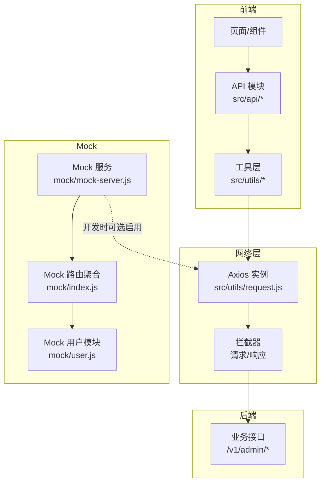
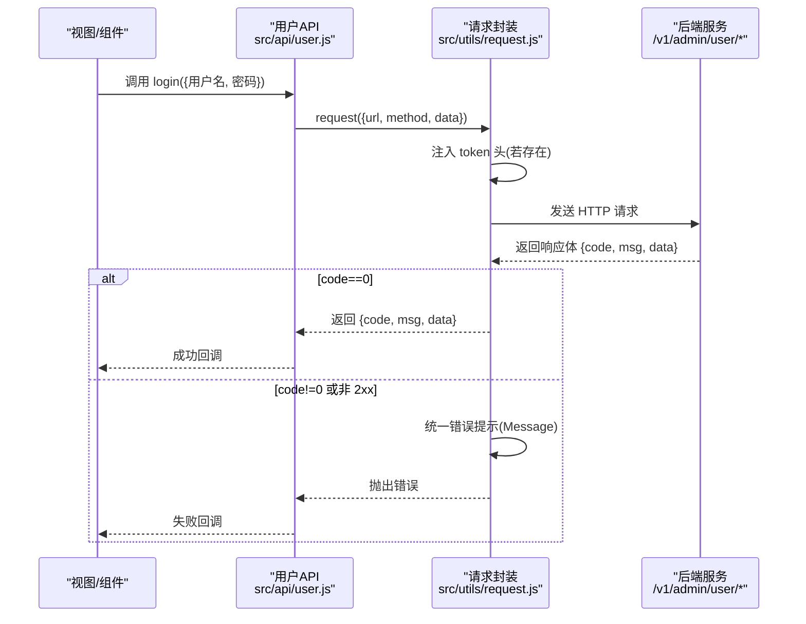
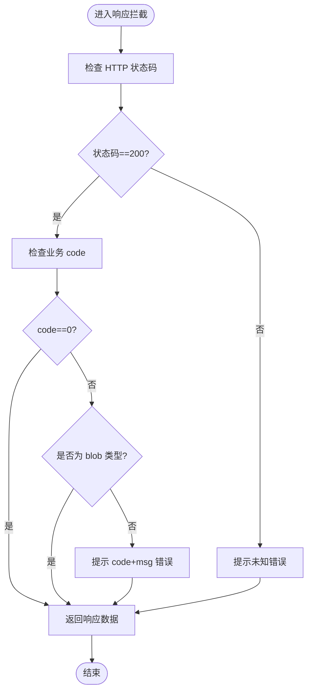
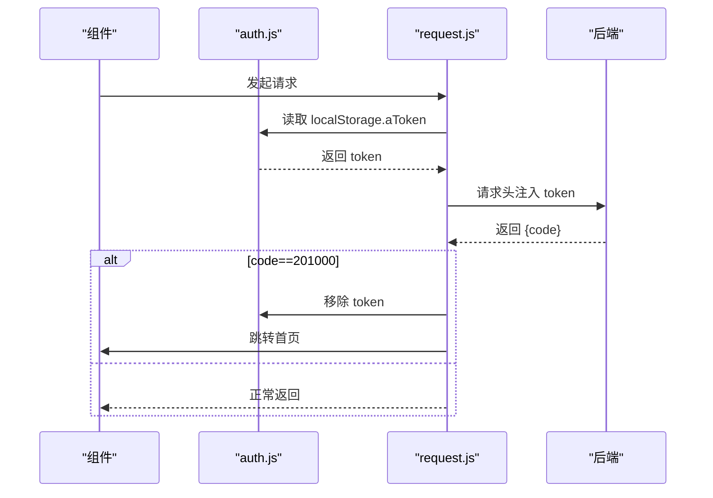
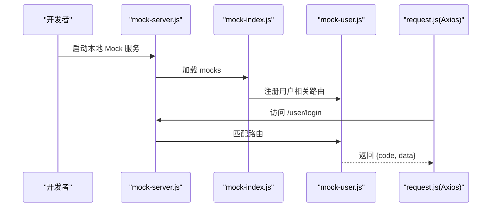
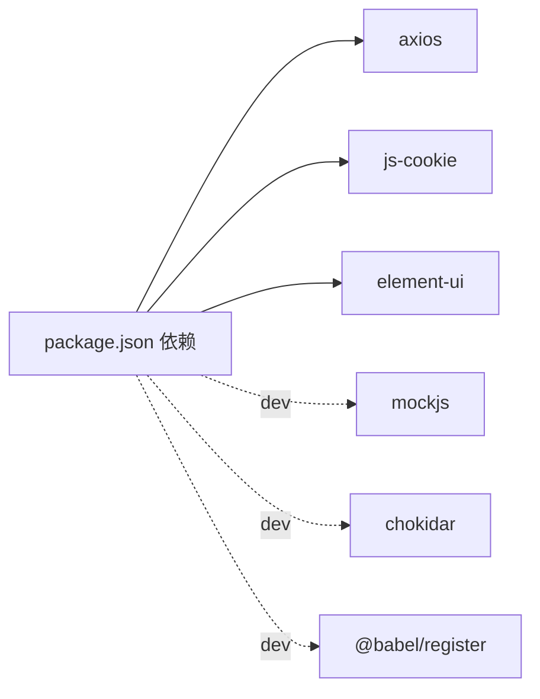

# API接口规范

<cite>
**本文档引用的文件**
- [request.js](file://src/utils/request.js)
- [auth.js](file://src/utils/auth.js)
- [user.js](file://src/api/user.js)
- [match.js](file://src/api/match.js)
- [member.js](file://src/api/member.js)
- [chat.js](file://src/api/chat.js)
- [message.js](file://src/api/message.js)
- [system.js](file://src/api/system.js)
- [football.js](file://src/api/matchapi/ball/football.js)
- [lol.js](file://src/api/matchapi/game/lol.js)
- [mock-server.js](file://mock/mock-server.js)
- [mock-index.js](file://mock/index.js)
- [mock-user.js](file://mock/user.js)
- [package.json](file://package.json)
</cite>

## 目录
1. [引言](#引言)
2. [项目结构](#项目结构)
3. [核心组件](#核心组件)
4. [架构总览](#架构总览)
5. [详细组件分析](#详细组件分析)
6. [依赖分析](#依赖分析)
7. [性能考虑](#性能考虑)
8. [故障排查指南](#故障排查指南)
9. [结论](#结论)
10. [附录](#附录)

## 引言
本规范面向 Leisu Admin 项目的前端 API 开发与维护，系统化定义 RESTful 接口设计原则、请求/响应格式、参数校验、错误处理、鉴权与跨域、Mock 与版本管理策略，并结合项目中现有 API 文件给出可落地的实践建议与流程图示，帮助开发者统一风格、提升一致性与可维护性。

## 项目结构
- API 层：位于 src/api 下，按业务模块拆分，如用户、比赛、成员、聊天、消息、系统等；部分模块进一步细分为体育类型或游戏类型子目录。
- 请求封装层：位于 src/utils/request.js，统一拦截器、超时、鉴权头注入、错误提示与状态码处理。
- 鉴权工具：位于 src/utils/auth.js，负责 token 的读取/写入/移除。
- Mock 服务：位于 mock/，提供本地开发与联调的模拟接口，支持热更新与 Express 风格路由注册。

图表来源
- [request.js:22-68](file://src/utils/request.js#L22-L68)
- [mock-server.js:30-68](file://mock/mock-server.js#L30-L68)
- [mock-index.js:9-71](file://mock/index.js#L9-L71)
- [mock-user.js:26-85](file://mock/user.js#L26-L85)

章节来源
- [request.js:1-130](file://src/utils/request.js#L1-L130)
- [mock-server.js:1-69](file://mock/mock-server.js#L1-L69)
- [mock-index.js:1-71](file://mock/index.js#L1-L71)
- [mock-user.js:1-85](file://mock/user.js#L1-L85)

## 核心组件
- Axios 请求实例与拦截器
  - 统一基础路径、withCredentials、超时时间
  - 请求前自动注入 token 头
  - 响应侧统一错误提示与状态码处理
- 鉴权工具
  - 从 localStorage 读取/写入 token 键值
- API 模块
  - 按业务域划分，统一使用 request 方法发起请求
  - URL 采用 /v1/admin/{domain}/{resource} 的版本化命名空间
  - GET/POST 方法遵循 RESTful 语义，参数通过 params 或 data 传递

章节来源
- [request.js:22-68](file://src/utils/request.js#L22-L68)
- [auth.js:1-17](file://src/utils/auth.js#L1-L17)
- [user.js:1-37](file://src/api/user.js#L1-L37)
- [match.js:1-1142](file://src/api/match.js#L1-L1142)
- [member.js:1-814](file://src/api/member.js#L1-L814)
- [chat.js:1-72](file://src/api/chat.js#L1-L72)
- [message.js:1-96](file://src/api/message.js#L1-L96)
- [system.js:1-73](file://src/api/system.js#L1-L73)

## 架构总览
以下序列图展示一次典型登录请求在前端的调用链路与错误处理：

图表来源
- [user.js:3-9](file://src/api/user.js#L3-L9)
- [request.js:29-68](file://src/utils/request.js#L29-L68)

章节来源
- [user.js:1-37](file://src/api/user.js#L1-L37)
- [request.js:1-130](file://src/utils/request.js#L1-L130)

## 详细组件分析

### 1) 请求封装与拦截器（request.js）
- 基础配置
  - baseURL 动态切换（根据部署域名选择不同环境）
  - withCredentials 启用携带 Cookie
  - 超时 50000ms
- 请求拦截
  - 若存在 token，则在请求头注入 token 字段
- 响应拦截
  - 非 200 状态统一提示“未知错误”
  - code=201000 时触发登出并跳转首页
  - 非 200 且非 blob 类型时弹出错误提示
  - 对常见 HTTP 状态码映射为中文提示
- 错误处理
  - 统一 Message 提示，便于用户感知
  - Promise.reject 透传错误，供调用方捕获

图表来源
- [request.js:46-68](file://src/utils/request.js#L46-L68)

章节来源
- [request.js:1-130](file://src/utils/request.js#L1-L130)

### 2) 鉴权机制（auth.js + request.js）
- token 存储位置：localStorage 中的 aToken 键
- 注入时机：请求拦截器在每次请求前读取并附加到 header
- 登出处理：当后端返回特定 code 时，移除 token 并跳转首页

图表来源
- [auth.js:5-16](file://src/utils/auth.js#L5-L16)
- [request.js:33-35](file://src/utils/request.js#L33-L35)
- [request.js:55-59](file://src/utils/request.js#L55-L59)

章节来源
- [auth.js:1-17](file://src/utils/auth.js#L1-L17)
- [request.js:1-130](file://src/utils/request.js#L1-L130)

### 3) 用户模块 API（user.js）
- 登录、钉钉登录、获取用户信息、验证码、退出登录
- 统一使用 request 方法，URL 以 /v1/admin/user/* 命名
- 参数通过 data 传递 POST 请求体

章节来源
- [user.js:1-37](file://src/api/user.js#L1-L37)

### 4) 比赛模块 API（match.js + matchapi/*）
- 聚合导出：将各体育/游戏子模块的接口统一导出，保持调用方无侵入
- 常见接口：推荐、指数、视频、情报、节目单、评论、模型销售等
- URL 命名：/v1/admin/match/{category}/{action}
- GET/POST 混用，GET 使用 params，POST 使用 data

章节来源
- [match.js:1-1142](file://src/api/match.js#L1-L1142)
- [football.js:1-775](file://src/api/matchapi/ball/football.js#L1-L775)
- [lol.js:1-289](file://src/api/matchapi/game/lol.js#L1-L289)

### 5) 成员模块 API（member.js）
- 用户列表、详情、手机/头像/昵称修改、封禁/解封、实名认证、分组、标签、设备登录日志、申诉、反馈、报表等
- 部分接口在调用前进行权限校验（如存在本地权限判断），不满足则直接 reject

章节来源
- [member.js:1-814](file://src/api/member.js#L1-L814)

### 6) 聊天模块 API（chat.js）
- 聊天室禁言/解禁、比赛黑白名单管理
- 统一 POST 接口，URL 以 /v1/admin/chat/* 命名

章节来源
- [chat.js:1-72](file://src/api/chat.js#L1-L72)

### 7) 消息模块 API（message.js）
- 公共消息、定向消息、站内信、会话清理、点赞/回复列表等
- 部分 GET 接口通过拼接字符串参数

章节来源
- [message.js:1-96](file://src/api/message.js#L1-L96)

### 8) 系统模块 API（system.js）
- 用户/组/权限/操作日志管理
- 统一 POST/GET，URL 以 /v1/admin/user/* 命名

章节来源
- [system.js:1-73](file://src/api/system.js#L1-L73)

### 9) Mock 服务（mock-server.js + mock-index.js + mock-user.js）
- mock-server.js
  - 使用 chokidar 监听 mock 目录变化，热更新路由
  - Express 风格注册路由，支持 GET/POST
- mock-index.js
  - 聚合多个 mock 模块，导出路由数组
  - 提供前端 Mock.XHR 代理与响应包装
- mock-user.js
  - 定义 /user/login、/user/info、/user/logout 的模拟响应
  - 使用 MockJS 生成固定或动态响应

图表来源
- [mock-server.js:30-68](file://mock/mock-server.js#L30-L68)
- [mock-index.js:9-71](file://mock/index.js#L9-L71)
- [mock-user.js:26-85](file://mock/user.js#L26-L85)
- [request.js:22-26](file://src/utils/request.js#L22-L26)

章节来源
- [mock-server.js:1-69](file://mock/mock-server.js#L1-L69)
- [mock-index.js:1-71](file://mock/index.js#L1-L71)
- [mock-user.js:1-85](file://mock/user.js#L1-L85)

## 依赖分析
- 运行时依赖
  - axios：HTTP 客户端
  - js-cookie：Cookie 工具（用于鉴权场景）
  - element-ui：消息提示组件（用于统一错误提示）
- 开发依赖
  - mockjs、chokidar、@babel/register：Mock 服务与热更新
- 环境变量
  - 通过 Vue CLI 的 mode 与环境文件控制 baseURL、MQTT 地址等

图表来源
- [package.json:37-129](file://package.json#L37-L129)

章节来源
- [package.json:1-139](file://package.json#L1-L139)

## 性能考虑
- 请求超时与并发
  - 当前超时 50000ms，建议对长耗时接口单独评估并设置合理超时
  - 对批量请求合并或分批处理，避免阻塞 UI
- 错误提示与用户体验
  - 统一使用 Message 提示，避免重复弹窗
  - 对 401/403 等鉴权类错误，引导用户重新登录或检查权限
- Mock 与生产分流
  - 开发环境启用 mock-server，减少真实后端压力
  - 生产环境确保 baseURL 指向真实服务

## 故障排查指南
- 常见问题定位
  - 401 未授权：检查 token 是否过期或未注入
  - 403 拒绝访问：检查权限与角色
  - 404 接口不存在：核对 URL 与版本号
  - 500/502/504：后端异常或网关问题，查看后端日志
- 日志与调试
  - 在 request.js 的响应拦截器中打印关键字段（如 code、msg、url）便于定位
  - 使用浏览器 Network 面板观察请求头与响应体
- Mock 调试
  - 修改 mock 文件后 chokidar 会自动热更新，无需重启服务
  - 如需前端 Mock，可在入口处调用 mockXHR 并注意第三方库兼容性

章节来源
- [request.js:69-127](file://src/utils/request.js#L69-L127)
- [mock-server.js:45-67](file://mock/mock-server.js#L45-L67)

## 结论
本规范基于项目现有代码总结了 Leisu Admin 的 API 设计与实现要点，明确了请求封装、鉴权、错误处理、Mock 与版本化命名空间等关键实践。建议在后续开发中严格遵循统一的 URL 命名、参数传递与错误提示规范，配合 Mock 与环境配置，持续提升接口质量与开发效率。

## 附录

### A. RESTful 设计原则与规范
- URL 设计
  - 使用名词复数形式，体现资源概念
  - 版本化路径：/v1/admin/{domain}/{resource}
- HTTP 方法
  - GET：获取资源列表或详情
  - POST：创建/提交/更新
  - DELETE：删除
- 状态码
  - 200：成功
  - 400：请求参数错误
  - 401：未授权/登录失效
  - 403：拒绝访问
  - 404：接口不存在
  - 408/504：请求/网关超时
  - 500：服务器内部错误
  - 502/503：网关/服务不可用
- 请求/响应格式
  - 统一返回结构：{code, msg, data}
  - code=0 表示成功，其他值表示业务错误
  - data 为对象或数组，按资源结构返回
- 参数传递
  - GET 使用 params，POST 使用 data
  - 必填参数在接口文档中明确标注
- 鉴权
  - 请求头注入 token 字段
  - 登录成功后持久化 token，请求前自动附加
- 跨域与 Cookie
  - withCredentials=true，确保跨域携带 Cookie
- Mock 与联调
  - 开发环境优先使用 Mock，保证前后端并行开发
  - 生产环境确保 baseURL 指向真实服务

### B. 版本管理与文档规范
- 版本号
  - 采用 /v1 前缀，后续升级时迁移至 /v2
- 文档
  - 接口文档与代码同仓库，按模块维护
  - 每个 API 文件包含简要说明与参数说明
- 变更追踪
  - 通过 Git 提交记录追踪接口变更
  - 重大变更在 README 或变更日志中说明

### C. 接口测试与调试技巧
- 单元测试
  - 使用 Jest 对工具函数与纯逻辑进行测试
- 集成测试
  - Mock 服务联调，覆盖常见分支与边界条件
- 调试技巧
  - 在 request.js 中增加日志输出，定位问题
  - 使用浏览器 Network 面板查看请求头与响应体
  - 对于复杂流程，绘制时序图辅助分析