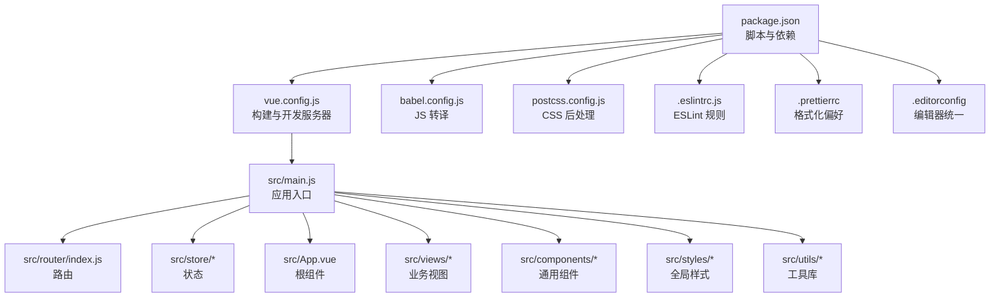
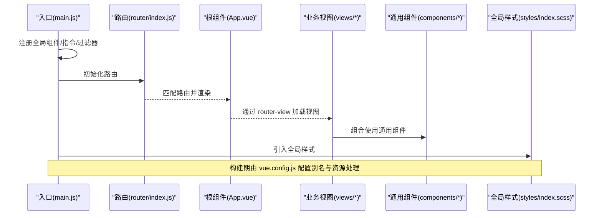
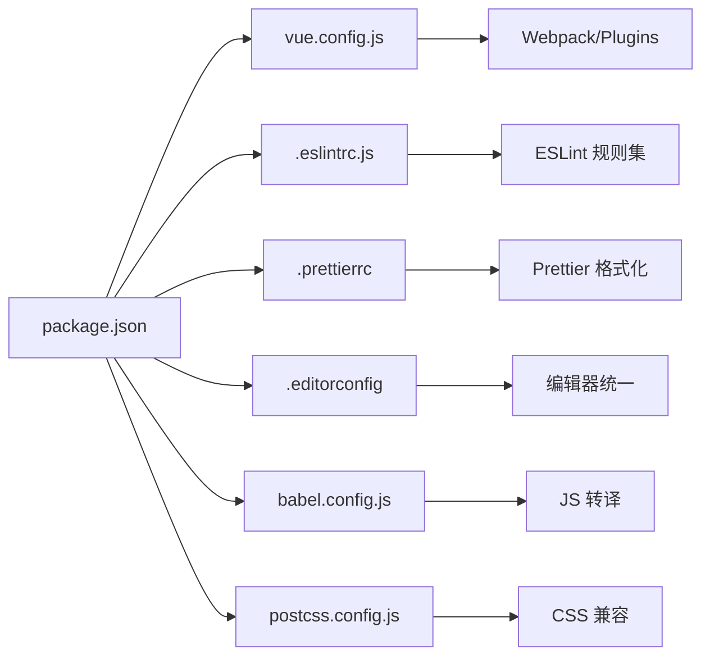

# 代码规范

<cite>
**本文引用的文件**   
- [.eslintrc.js](file://.eslintrc.js)
- [babel.config.js](file://babel.config.js)
- [postcss.config.js](file://postcss.config.js)
- [.prettierrc](file://.prettierrc)
- [.editorconfig](file://.editorconfig)
- [package.json](file://package.json)
- [vue.config.js](file://vue.config.js)
- [src/main.js](file://src/main.js)
- [src/App.vue](file://src/App.vue)
- [src/router/index.js](file://src/router/index.js)
- [src/filters/index.js](file://src/filters/index.js)
- [src/utils/index.js](file://src/utils/index.js)
- [src/styles/index.scss](file://src/styles/index.scss)
- [src/views/dashboard/expert.vue](file://src/views/dashboard/expert.vue)
- [src/components/leisu/peopleInfo/baseInfo.vue](file://src/components/leisu/peopleInfo/baseInfo.vue)
</cite>

## 目录
1. [简介](#简介)
2. [项目结构](#项目结构)
3. [核心组件](#核心组件)
4. [架构总览](#架构总览)
5. [详细组件分析](#详细组件分析)
6. [依赖分析](#依赖分析)
7. [性能考虑](#性能考虑)
8. [故障排查指南](#故障排查指南)
9. [结论](#结论)
10. [附录](#附录)

## 简介
本文件为 Leisu Admin 项目的代码规范与最佳实践指南，覆盖 JavaScript/ES6+ 编码规范、Vue 组件编写规范、CSS/SCSS 样式规范、ESLint 规则、Babel 转译与 PostCSS 处理规则，并提供可执行的代码审查清单与常见问题解决方案，帮助新老开发者快速理解并遵循统一的工程化标准。

## 项目结构
- 构建与工具链
  - 使用 Vue CLI 3.x 生成的项目，通过 vue.config.js 定义开发服务器、别名、SVG Sprite、打包优化与运行时配置。
  - ESLint 与 Prettier 配置文件分别定义代码质量与格式化策略。
  - Babel 与 PostCSS 分别负责 JS 转译与 CSS 后处理。
- 源码组织
  - src 下包含入口、路由、状态、布局、通用组件、业务视图、样式与工具库，采用按功能域分层组织。
- 测试与脚手架
  - Jest 单元测试配置；Plop 用于生成模板化组件/页面。

图表来源
- [package.json:7-20](file://package.json#L7-L20)
- [vue.config.js:18-76](file://vue.config.js#L18-L76)
- [babel.config.js:1-5](file://babel.config.js#L1-L5)
- [postcss.config.js:1-5](file://postcss.config.js#L1-L5)
- [.eslintrc.js:1-268](file://.eslintrc.js#L1-L268)
- [.prettierrc:1-13](file://.prettierrc#L1-L13)
- [.editorconfig:1-15](file://.editorconfig#L1-L15)
- [src/main.js:1-526](file://src/main.js#L1-L526)
- [src/router/index.js:1-177](file://src/router/index.js#L1-L177)
- [src/App.vue:1-18](file://src/App.vue#L1-L18)
- [src/styles/index.scss:1-311](file://src/styles/index.scss#L1-L311)

章节来源
- [package.json:1-139](file://package.json#L1-L139)
- [vue.config.js:1-155](file://vue.config.js#L1-L155)
- [babel.config.js:1-6](file://babel.config.js#L1-L6)
- [postcss.config.js:1-6](file://postcss.config.js#L1-L6)
- [.eslintrc.js:1-268](file://.eslintrc.js#L1-L268)
- [.prettierrc:1-13](file://.prettierrc#L1-L13)
- [.editorconfig:1-15](file://.editorconfig#L1-L15)

## 核心组件
- 应用入口与全局配置
  - 入口文件集中注册全局组件、指令、过滤器、插件与全局样式，统一挂载到 Vue 实例。
  - 通过 ProvidePlugin 注入 jQuery，使用 SVG Sprite 加载图标资源。
- 根组件与路由
  - 根组件以 router-view 承载页面；路由采用按需加载与模块化拆分，支持动态重置。
- 全局样式与工具
  - 全局 SCSS 汇总引入变量、混入、过渡、Element UI 样式与自定义组件样式。
  - 工具库提供时间格式化、参数序列化、防抖、深拷贝等常用方法。

章节来源
- [src/main.js:1-526](file://src/main.js#L1-L526)
- [src/App.vue:1-18](file://src/App.vue#L1-L18)
- [src/router/index.js:1-177](file://src/router/index.js#L1-L177)
- [src/styles/index.scss:1-311](file://src/styles/index.scss#L1-L311)
- [src/utils/index.js:1-339](file://src/utils/index.js#L1-L339)

## 架构总览
下图展示从入口到视图与组件的典型交互流程，体现组件注册、路由加载与样式注入的关键节点。

图表来源
- [src/main.js:1-526](file://src/main.js#L1-L526)
- [src/router/index.js:1-177](file://src/router/index.js#L1-L177)
- [src/App.vue:1-18](file://src/App.vue#L1-L18)
- [src/styles/index.scss:1-311](file://src/styles/index.scss#L1-L311)
- [vue.config.js:64-96](file://vue.config.js#L64-L96)

## 详细组件分析

### JavaScript/ES6+ 编码规范
- 命名约定
  - 变量与函数使用驼峰命名；类与构造函数使用帕斯卡命名；常量全大写并以下划线分隔。
  - 导出模块统一使用命名导出或默认导出，避免混用造成维护成本上升。
- 语法与风格
  - 使用严格模式；禁止使用 var，优先 const/let；箭头函数用于匿名回调；模板字符串替代字符串拼接。
  - 对象与数组字面量使用尾逗号；函数参数与调用处逗号后空格；运算符两侧留空格。
- 控制流与异常
  - if/for/while 使用大括号；switch 明确 break；try/catch 明确捕获范围；避免 debugger 与 console。
- 函数设计
  - 单一职责；短小清晰；必要时拆分为私有辅助函数；避免副作用与全局状态污染。
- 异步与 Promise
  - 优先使用 Promise/async-await；错误处理统一在调用方捕获；避免回调地狱。
- 代码审查要点
  - 是否存在未使用变量/未调用函数？
  - 是否存在魔法数字/字符串？是否应抽取为常量或枚举？
  - 是否存在深层嵌套与复杂条件判断？是否可简化？

章节来源
- [.eslintrc.js:16-266](file://.eslintrc.js#L16-L266)
- [src/utils/index.js:1-339](file://src/utils/index.js#L1-L339)

### Vue 组件编写规范
- 文件结构
  - 单文件组件按顺序组织：<style>、<template>、<script>；scoped 样式与深度作用选择器合理使用。
  - 组件命名采用帕斯卡命名；导出名称与文件名一致；props 类型声明明确；methods/computed/data 结构清晰。
- 模板与数据
  - 属性换行与缩进遵循规则；避免内联样式与复杂表达式；事件与指令分离；v-if 与 v-for 不在同一元素上使用。
- 生命周期与逻辑
  - created/mounted 中仅做轻量初始化；复杂逻辑拆分至方法或混入；避免在模板中直接调用方法。
- 组件通信
  - 父子通信使用 props/emits；兄弟/跨级使用事件总线或 Vuex；避免直接修改父组件传入的引用类型。
- 代码审查要点
  - 是否存在重复逻辑？是否可抽取为混入或工具函数？
  - 是否存在未处理的异步错误？
  - 是否滥用全局样式或深度选择器？

章节来源
- [src/views/dashboard/expert.vue:1-256](file://src/views/dashboard/expert.vue#L1-L256)
- [src/components/leisu/peopleInfo/baseInfo.vue:1-199](file://src/components/leisu/peopleInfo/baseInfo.vue#L1-L199)
- [src/filters/index.js:1-69](file://src/filters/index.js#L1-L69)
- [src/main.js:1-526](file://src/main.js#L1-L526)

### CSS/SCSS 样式编写规范
- 结构与组织
  - 全局样式通过 index.scss 汇总导入；按功能拆分变量、混入、过渡、组件样式；避免全局污染。
  - 组件样式使用 scoped，必要时配合深度选择器；类名语义化，避免过度层级。
- 命名与选择器
  - BEM 或功能化命名；避免使用 id 选择器；减少后代选择器层级；媒体查询置于规则末尾。
- 值与单位
  - 颜色使用变量；字体大小与间距使用相对单位；动画使用缓动曲线与合理时长。
- 代码审查要点
  - 是否存在冗余样式与重复定义？
  - 是否使用了浏览器兼容性问题的选择器或属性？
  - 是否遗漏响应式适配？

章节来源
- [src/styles/index.scss:1-311](file://src/styles/index.scss#L1-L311)

### ESLint 配置与规则
- 解析与环境
  - 解析器使用 babel-eslint；环境启用浏览器、Node 与 ES6+。
  - 扩展 eslint:recommended 与 plugin:vue/recommended。
- 关键规则
  - 组件属性换行：单行最多 10 个，多行每行 1 个且不允许首行换行。
  - 组件名称：PascalCase。
  - 禁止使用 v-html。
  - 代码缩进：2 空格；switchCase 缩进 1。
  - 语句结尾：禁用分号；逗号后空格；逗号换行：never。
  - 字符串：单引号；允许模板字符串；避免转义。
  - 对象与数组：花括号内无空格；方括号内无空格。
  - 注释：块注释首字符空格；markers 包含特定关键字。
  - 空行：最多 1 个连续空行；禁止多余空行。
  - 条件与比较：严格相等；忽略与 null 的比较。
  - 变量与函数：禁止未使用变量；优先 const；禁止未定义；禁止未使用参数。
  - 条件分支：禁止 debugger；生产环境禁用。
- 代码审查要点
  - 是否违反属性换行或命名规则？
  - 是否存在未使用的变量/函数？
  - 是否使用了未定义的全局变量或 API？

章节来源
- [.eslintrc.js:1-268](file://.eslintrc.js#L1-L268)

### Babel 转译配置
- 预设
  - 使用 @vue/app 预设，面向现代浏览器与 Vue 生态的转译目标。
- 最佳实践
  - 保持与项目浏览器列表一致；避免过度 polyfill；按需引入插件以减小包体。

章节来源
- [babel.config.js:1-6](file://babel.config.js#L1-L6)
- [package.json:134-137](file://package.json#L134-L137)

### PostCSS 处理规则
- 插件
  - 自动补全浏览器前缀（autoprefixer），确保兼容性。
- 最佳实践
  - 与浏览器列表配合，避免生成不必要的前缀；结合 CSS Modules/作用域减少冲突。

章节来源
- [postcss.config.js:1-6](file://postcss.config.js#L1-L6)
- [package.json:134-137](file://package.json#L134-L137)

### Prettier 格式化偏好
- 缩进与空格
  - tabWidth 4；useTabs false；缩进 2 空格（EditorConfig）。
- 字符与换行
  - 分号：false；单引号：false；尾逗号：none；换行符：auto；行长：200。
- Vue
  - script/style 缩进开启；括号省略：avoid；对象空格：false。
- 最佳实践
  - 与 ESLint 冲突时以 ESLint 为准；统一团队格式化工具链。

章节来源
- [.prettierrc:1-13](file://.prettierrc#L1-L13)
- [.editorconfig:1-15](file://.editorconfig#L1-L15)

### 代码审查清单
- JavaScript/ES6+
  - 命名是否一致且语义化？
  - 是否存在未使用变量/未调用函数？
  - 是否使用严格相等与合理异常处理？
  - 是否存在深层嵌套与复杂条件？
- Vue 组件
  - 结构是否清晰（style/template/script）？
  - 是否滥用 v-html 与内联样式？
  - 是否正确使用生命周期与异步逻辑？
  - 是否存在重复逻辑或可抽取的混入/工具函数？
- CSS/SCSS
  - 是否使用语义化类名与合理层级？
  - 是否存在冗余样式与重复定义？
  - 是否遗漏响应式适配？
- 工具链
  - ESLint 是否通过？Prettier 是否统一格式？
  - Babel/PostCSS 是否与浏览器列表匹配？

章节来源
- [.eslintrc.js:16-266](file://.eslintrc.js#L16-L266)
- [src/views/dashboard/expert.vue:1-256](file://src/views/dashboard/expert.vue#L1-L256)
- [src/components/leisu/peopleInfo/baseInfo.vue:1-199](file://src/components/leisu/peopleInfo/baseInfo.vue#L1-L199)
- [src/styles/index.scss:1-311](file://src/styles/index.scss#L1-L311)

### 常见违规与解决方案
- 违规：属性换行超过限制
  - 现象：组件属性过多导致一行过长。
  - 解决：拆分为多行，遵守单行最多 10 个、多行每行 1 个且不允许首行换行。
  - 参考规则：vue/max-attributes-per-line
- 违规：组件命名非 PascalCase
  - 现象：组件名称使用小写或横杠分隔。
  - 解决：统一使用帕斯卡命名。
  - 参考规则：vue/name-property-casing
- 违规：使用 v-html
  - 现象：直接渲染富文本 HTML。
  - 解决：改用受控渲染或安全的富文本组件。
  - 参考规则：vue/no-v-html
- 违规：未使用变量/函数
  - 现象：定义后未使用。
  - 解决：删除或在逻辑中使用。
  - 参考规则：no-unused-vars
- 违规：分号与逗号风格不一致
  - 现象：混用分号与逗号位置。
  - 解决：统一为 ESLint 规则要求。
  - 参考规则：semi、comma-dangle、comma-spacing
- 违规：模板中复杂表达式
  - 现象：在模板中直接计算或调用函数。
  - 解决：抽取为计算属性或方法。
  - 参考规则：vue/max-attributes-per-line（间接约束）

章节来源
- [.eslintrc.js:16-266](file://.eslintrc.js#L16-L266)
- [src/views/dashboard/expert.vue:1-256](file://src/views/dashboard/expert.vue#L1-L256)

## 依赖分析
- 构建与运行
  - Vue CLI 服务、Webpack 插件、ProvidePlugin 注入 jQuery、SVG Sprite、SplitChunks 与运行时优化。
- 开发工具
  - ESLint、Prettier、EditorConfig、lint-staged、husky 配合保证提交质量。
- 样式与兼容
  - autoprefixer 与浏览器列表共同保障 CSS 兼容性。
- 代码质量
  - ESLint 规则覆盖 JS/Vue/SCSS；Prettier 统一格式；EditorConfig 保证编辑器一致性。

图表来源
- [package.json:7-20](file://package.json#L7-L20)
- [vue.config.js:18-76](file://vue.config.js#L18-L76)
- [.eslintrc.js:1-268](file://.eslintrc.js#L1-L268)
- [.prettierrc:1-13](file://.prettierrc#L1-L13)
- [.editorconfig:1-15](file://.editorconfig#L1-L15)
- [babel.config.js:1-6](file://babel.config.js#L1-L6)
- [postcss.config.js:1-6](file://postcss.config.js#L1-L6)

章节来源
- [package.json:1-139](file://package.json#L1-L139)
- [vue.config.js:1-155](file://vue.config.js#L1-L155)

## 性能考虑
- 代码分割与懒加载
  - 使用路由懒加载与 SplitChunks 将第三方库、Element UI、公共组件独立打包，提升首屏速度。
- 资源优化
  - SVG Sprite 减少请求；按需引入样式与组件；避免全局样式污染。
- 运行时优化
  - 生产环境关闭 SourceMap；合理使用 v-show/v-if；避免不必要的重渲染。
- 工具链优化
  - ESLint 仅在开发时保存校验；Prettier 与 EditorConfig 降低格式分歧成本。

章节来源
- [vue.config.js:115-152](file://vue.config.js#L115-L152)
- [src/main.js:1-526](file://src/main.js#L1-L526)

## 故障排查指南
- ESLint 报错
  - 现象：本地可通过但 CI 失败。
  - 排查：确认本地与 CI 使用相同 Node 版本与依赖；执行 npm run lint 检查具体规则。
  - 参考：lint 脚本与规则配置。
- 样式冲突
  - 现象：组件样式影响其他区域。
  - 排查：检查 scoped 与深度选择器使用；避免全局样式污染。
- 构建失败
  - 现象：SVG 加载异常或资源缺失。
  - 排查：确认 vue.config.js 中 svg-sprite-loader 配置与别名；检查资源路径。
- 运行时错误
  - 现象：生产环境日志缺失或报错。
  - 排查：确认生产环境未禁用 console；检查 ProvidePlugin 注入的全局变量。

章节来源
- [.eslintrc.js:15-17](file://.eslintrc.js#L15-L17)
- [vue.config.js:81-96](file://vue.config.js#L81-L96)
- [src/main.js:69-75](file://src/main.js#L69-L75)

## 结论
本规范以 ESLint、Prettier、EditorConfig、Babel 与 PostCSS 为核心工具链，结合 Vue 生态的最佳实践，形成从代码风格到构建优化的完整体系。建议新成员在首次接入时先完成本地工具链安装与 IDE 插件配置，再对照审查清单逐项自查，确保代码质量与团队协作效率。

## 附录
- 快速检查清单
  - ESLint 通过；Prettier 统一；EditorConfig 一致。
  - 组件结构清晰；模板简洁；无未使用变量/函数。
  - 样式作用域正确；无全局污染；响应式适配完善。
  - 构建产物体积可控；懒加载与代码分割合理。
- 新人学习路径
  - 安装 Node/NPM；安装 VS Code 插件（ESLint、Prettier、EditorConfig）。
  - 运行 npm install；执行 npm run dev；打开 http://localhost:端口。
  - 修改一个组件与样式，执行 npm run lint 与 git commit，观察 husky/lint-staged 行为。
  - 参考 src/views/dashboard/expert.vue 与 src/components/leisu/peopleInfo/baseInfo.vue 的结构与规范。