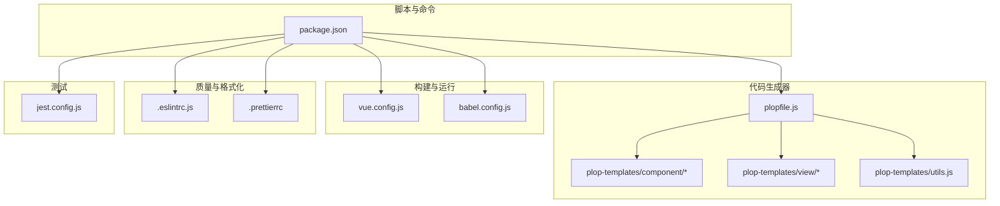
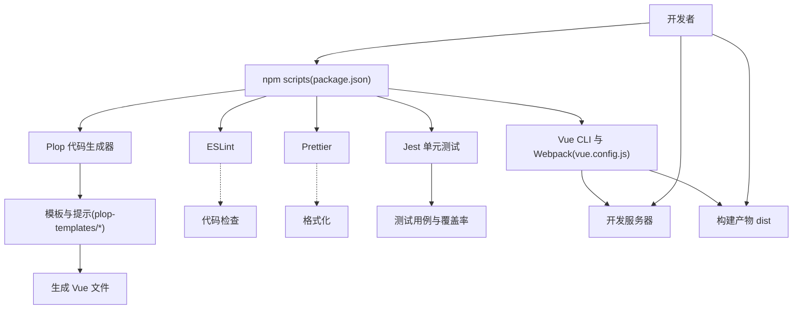
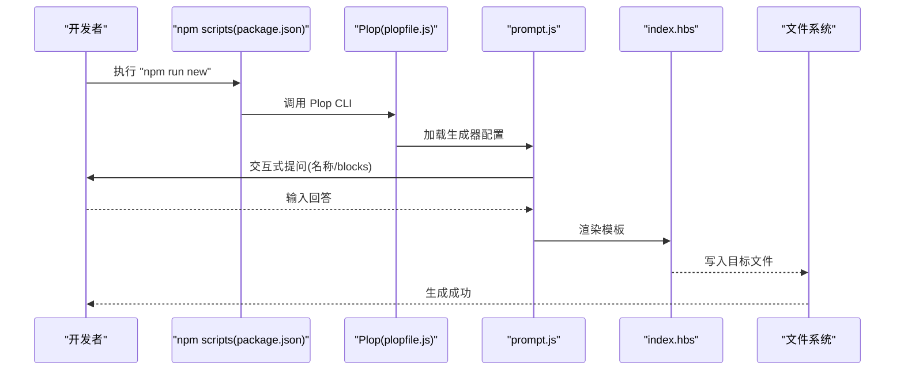
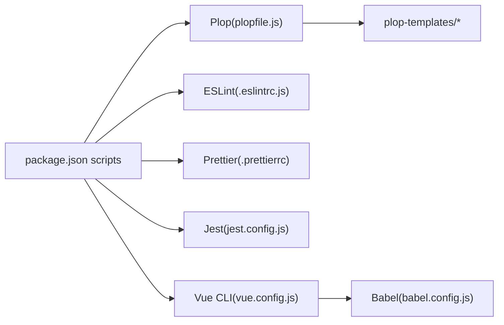

# 开发工具与自动化

<cite>
**本文引用的文件**
- [package.json](file://package.json)
- [plopfile.js](file://plopfile.js)
- [plop-templates/component/prompt.js](file://plop-templates/component/prompt.js)
- [plop-templates/view/prompt.js](file://plop-templates/view/prompt.js)
- [plop-templates/utils.js](file://plop-templates/utils.js)
- [plop-templates/component/index.hbs](file://plop-templates/component/index.hbs)
- [plop-templates/view/index.hbs](file://plop-templates/view/index.hbs)
- [vue.config.js](file://vue.config.js)
- [babel.config.js](file://babel.config.js)
- [.eslintrc.js](file://.eslintrc.js)
- [.prettierrc](file://.prettierrc)
- [jest.config.js](file://jest.config.js)
- [README.md](file://README.md)
</cite>

## 目录
1. [简介](#简介)
2. [项目结构](#项目结构)
3. [核心组件](#核心组件)
4. [架构总览](#架构总览)
5. [详细组件分析](#详细组件分析)
6. [依赖关系分析](#依赖关系分析)
7. [性能考虑](#性能考虑)
8. [故障排查指南](#故障排查指南)
9. [结论](#结论)
10. [附录](#附录)

## 简介
本文件面向 Leisu Admin 项目的开发者，系统性梳理并讲解项目中的开发工具与自动化体系，重点覆盖以下方面：
- Plop 代码生成工具：模板系统、交互式提问、自动化代码生成流程、如何扩展与复用
- 开发工具链：构建工具、代码质量工具（ESLint、Prettier）、单元测试（Jest）与脚本命令
- Git 工作流与版本控制最佳实践：分支策略、提交规范、合并与发布
- IDE 配置建议与插件推荐：提升编码一致性与效率
- 开发环境搭建与工具链配置指南：从安装到一键启动、构建与预览
- 提升团队整体开发效率的实操建议与常见问题排查

## 项目结构
围绕“开发工具与自动化”的主题，项目中与之直接相关的目录与文件主要包括：
- 代码生成器：plopfile.js、plop-templates（component、view、utils）
- 构建与运行：vue.config.js、babel.config.js
- 质量与格式化：.eslintrc.js、.prettierrc
- 测试：jest.config.js
- 脚本与命令：package.json 中 scripts 字段
- 使用说明：README.md

图表来源
- [plopfile.js:1-8](file://plopfile.js#L1-L8)
- [plop-templates/component/prompt.js:1-56](file://plop-templates/component/prompt.js#L1-L56)
- [plop-templates/view/prompt.js:1-56](file://plop-templates/view/prompt.js#L1-L56)
- [plop-templates/utils.js:1-10](file://plop-templates/utils.js#L1-L10)
- [vue.config.js:1-155](file://vue.config.js#L1-L155)
- [babel.config.js:1-6](file://babel.config.js#L1-L6)
- [.eslintrc.js:1-268](file://.eslintrc.js#L1-L268)
- [.prettierrc:1-13](file://.prettierrc#L1-L13)
- [jest.config.js:1-25](file://jest.config.js#L1-L25)
- [package.json:1-139](file://package.json#L1-L139)

章节来源
- [package.json:1-139](file://package.json#L1-L139)
- [README.md:123-151](file://README.md#L123-L151)

## 核心组件
本节聚焦“开发工具与自动化”的核心组成，包括 Plop 代码生成器、构建与运行配置、代码质量与格式化、测试配置以及脚本命令。

- Plop 代码生成器
  - 通过 plopfile.js 注册两个生成器：view 与 component
  - 模板采用 Handlebars（.hbs），配合 prompt.js 的交互式提问与 actions 输出
  - 支持按需选择 blocks（template/script/style），自动生成标准 Vue 文件骨架

- 构建与运行
  - vue.config.js 提供路径别名、SVG Sprite、Vue 编译选项、分包策略、运行时优化等
  - babel.config.js 使用 @vue/app 预设，适配 Vue CLI 生态

- 代码质量与格式化
  - .eslintrc.js 定义 Vue 推荐规则与自定义规则，统一风格与约束
  - .prettierrc 定义缩进、引号、分号、打印宽度等格式化偏好

- 测试
  - jest.config.js 配置 Vue 单文件组件转换、模块映射、覆盖率收集范围与报告器

- 脚本命令
  - package.json scripts 提供本地开发、构建、预览、代码检查、单元测试、CI 等常用命令

章节来源
- [plopfile.js:1-8](file://plopfile.js#L1-L8)
- [plop-templates/component/prompt.js:1-56](file://plop-templates/component/prompt.js#L1-L56)
- [plop-templates/view/prompt.js:1-56](file://plop-templates/view/prompt.js#L1-L56)
- [plop-templates/component/index.hbs:1-27](file://plop-templates/component/index.hbs#L1-L27)
- [plop-templates/view/index.hbs:1-27](file://plop-templates/view/index.hbs#L1-L27)
- [vue.config.js:1-155](file://vue.config.js#L1-L155)
- [babel.config.js:1-6](file://babel.config.js#L1-L6)
- [.eslintrc.js:1-268](file://.eslintrc.js#L1-L268)
- [.prettierrc:1-13](file://.prettierrc#L1-L13)
- [jest.config.js:1-25](file://jest.config.js#L1-L25)
- [package.json:7-20](file://package.json#L7-L20)

## 架构总览
下图展示了“开发工具与自动化”在项目中的整体交互关系：开发者通过 npm scripts 触发构建、测试、代码生成等任务；Plop 读取模板与提示配置，输出标准化的 Vue 组件或视图文件；ESLint 与 Prettier 保障代码风格一致；Jest 提供单元测试能力；Vue CLI 与 Webpack 驱动开发服务器与打包流程。

图表来源
- [package.json:7-20](file://package.json#L7-L20)
- [plopfile.js:1-8](file://plopfile.js#L1-L8)
- [plop-templates/component/prompt.js:1-56](file://plop-templates/component/prompt.js#L1-L56)
- [plop-templates/view/prompt.js:1-56](file://plop-templates/view/prompt.js#L1-L56)
- [vue.config.js:1-155](file://vue.config.js#L1-L155)
- [.eslintrc.js:1-268](file://.eslintrc.js#L1-L268)
- [.prettierrc:1-13](file://.prettierrc#L1-L13)
- [jest.config.js:1-25](file://jest.config.js#L1-L25)

## 详细组件分析

### Plop 代码生成器
Plop 在本项目中用于快速生成 Vue 组件与视图文件，显著提升开发效率并保证代码风格一致。

- 生成器注册
  - plopfile.js 将 view 与 component 两类生成器注册到 Plop
  - 通过 require 对应的 prompt.js 实现交互式提问与动作执行

- 交互式提问
  - 组件与视图均支持选择 blocks：template、script、style
  - 输入校验确保至少包含 template 或 script
  - 组件名称要求非空

- 模板与输出
  - component/index.hbs 与 view/index.hbs 提供统一的 Vue 文件骨架
  - 输出路径分别位于 src/components/<Name>/index.vue 与 src/views/<name>/index.vue
  - 模板中使用 Handlebars 语法与辅助函数（如 properCase）

- 执行流程（序列图）

图表来源
- [package.json:19](file://package.json#L19)
- [plopfile.js:1-8](file://plopfile.js#L1-L8)
- [plop-templates/component/prompt.js:1-56](file://plop-templates/component/prompt.js#L1-L56)
- [plop-templates/view/prompt.js:1-56](file://plop-templates/view/prompt.js#L1-L56)
- [plop-templates/component/index.hbs:1-27](file://plop-templates/component/index.hbs#L1-L27)
- [plop-templates/view/index.hbs:1-27](file://plop-templates/view/index.hbs#L1-L27)

- 关键实现要点
  - 生成器名称与模板路径一一对应，便于扩展更多类型（如路由、store、api）
  - 通过 data 传递渲染变量，实现条件渲染 blocks
  - 输出路径遵循约定，利于后续路由与组件自动注册

章节来源
- [plopfile.js:1-8](file://plopfile.js#L1-L8)
- [plop-templates/component/prompt.js:1-56](file://plop-templates/component/prompt.js#L1-L56)
- [plop-templates/view/prompt.js:1-56](file://plop-templates/view/prompt.js#L1-L56)
- [plop-templates/utils.js:1-10](file://plop-templates/utils.js#L1-L10)
- [plop-templates/component/index.hbs:1-27](file://plop-templates/component/index.hbs#L1-L27)
- [plop-templates/view/index.hbs:1-27](file://plop-templates/view/index.hbs#L1-L27)

### 构建与运行配置
- 路径别名与资源目录
  - publicPath、outputDir、assetsDir 可由环境变量控制
  - @ 别名指向 src，简化导入路径

- 开发服务器
  - 端口可通过环境变量或参数传入
  - 支持覆盖警告与错误展示行为

- Webpack 插件与优化
  - ProvidePlugin 注入全局 jQuery
  - SVG Sprite Loader 配置图标加载
  - Vue 编译选项保留空白字符
  - 生产环境启用分包策略与 runtimeChunk 单独提取

- 外部依赖
  - 通过 externals 将 BMap 暴露为全局变量，减少打包体积

章节来源
- [vue.config.js:18-155](file://vue.config.js#L18-L155)

### 代码质量与格式化
- ESLint
  - 基于 plugin:vue/recommended 与 eslint:recommended
  - 自定义规则覆盖属性换行、命名、缩进、分号、注释等
  - 在生产构建中对 debugger 严格限制

- Prettier
  - 统一缩进、引号、分号、打印宽度、箭头函数括号等
  - 与 Vue 文件的 script/style 缩进策略配合

章节来源
- [.eslintrc.js:1-268](file://.eslintrc.js#L1-L268)
- [.prettierrc:1-13](file://.prettierrc#L1-L13)

### 测试配置
- 转换器
  - Vue 单文件组件使用 vue-jest
  - 静态资源使用 jest-transform-stub
  - JS/JSX 使用 babel-jest

- 模块映射
  - @ 映射到 src，便于相对路径导入

- 覆盖率
  - 收集 src/utils 与 src/components 下的覆盖率数据
  - 输出 lcov 与 text-summary 报告

章节来源
- [jest.config.js:1-25](file://jest.config.js#L1-L25)

### 脚本命令与工作流
- 本地开发
  - npm run local / dev / prod：分别对应不同模式的开发服务器
- 构建与预览
  - npm run build:dev / build:prod / build:localhost：构建不同环境产物
  - npm run preview：本地预览构建结果
- 质量与测试
  - npm run lint：ESLint 检查
  - npm run test:unit：Jest 单元测试并清理缓存
  - npm run test:ci：CI 场景先 lint 再 test
- 其他
  - npm run svgo：SVG 优化
  - npm run new：调用 Plop 生成器

章节来源
- [package.json:7-20](file://package.json#L7-L20)
- [README.md:123-151](file://README.md#L123-L151)

## 依赖关系分析
- Plop 与模板
  - plopfile.js 依赖 plop-templates 下的 prompt.js 与 index.hbs
  - 通过 require 方式组织生成器，便于扩展新类型

- 质量工具与构建
  - ESLint 与 Prettier 作为开发期工具，与 Vue CLI 集成
  - Jest 与 Vue CLI 并行存在，互不冲突

- 脚本与工具链
  - package.json scripts 统一入口，串联各工具
  - vue.config.js 与 babel.config.js 为构建与转译提供基础配置

图表来源
- [package.json:7-20](file://package.json#L7-L20)
- [plopfile.js:1-8](file://plopfile.js#L1-L8)
- [plop-templates/component/prompt.js:1-56](file://plop-templates/component/prompt.js#L1-L56)
- [plop-templates/view/prompt.js:1-56](file://plop-templates/view/prompt.js#L1-L56)
- [.eslintrc.js:1-268](file://.eslintrc.js#L1-L268)
- [.prettierrc:1-13](file://.prettierrc#L1-L13)
- [jest.config.js:1-25](file://jest.config.js#L1-L25)
- [vue.config.js:1-155](file://vue.config.js#L1-L155)
- [babel.config.js:1-6](file://babel.config.js#L1-L6)

## 性能考虑
- 构建性能
  - 生产环境启用 splitChunks 与 runtimeChunk，拆分第三方库、Element UI 与公共组件
  - 删除 preload/prefetch 插件以减少首屏压力（可按需调整）
- 开发体验
  - cheap-source-map 仅在开发环境启用，平衡调试与性能
  - SVG Sprite Loader 减少图标请求次数
- 外部依赖
  - 通过 externals 将大体积外部库（如地图库）排除在打包之外，降低 bundle 体积

章节来源
- [vue.config.js:77-152](file://vue.config.js#L77-L152)

## 故障排查指南
- Plop 无法生成文件
  - 检查 npm run new 是否正确执行
  - 确认 plopfile.js 中生成器已注册且路径正确
  - 查看 prompt.js 的输入校验是否通过（名称非空、至少包含 template 或 script）
- ESLint 报错
  - 按规则逐条修复或在 .eslintrc.js 中调整规则
  - 注意生产构建对 debugger 的限制
- Jest 测试失败
  - 检查测试文件路径与命名是否匹配 testMatch
  - 确认模块映射 @ 指向 src
  - 覆盖率收集范围是否符合预期
- 构建产物异常
  - 检查 publicPath、outputDir、assetsDir 环境变量
  - 生产环境分包策略是否影响资源加载顺序

章节来源
- [plopfile.js:1-8](file://plopfile.js#L1-L8)
- [plop-templates/component/prompt.js:1-56](file://plop-templates/component/prompt.js#L1-L56)
- [plop-templates/view/prompt.js:1-56](file://plop-templates/view/prompt.js#L1-L56)
- [.eslintrc.js:1-268](file://.eslintrc.js#L1-L268)
- [jest.config.js:1-25](file://jest.config.js#L1-L25)
- [vue.config.js:18-155](file://vue.config.js#L18-L155)

## 结论
本项目通过 Plop、ESLint、Prettier、Jest 与 Vue CLI 等工具链，形成了完善的开发工具与自动化体系。借助统一的模板与脚本命令，团队能够高效地生成标准化代码、保持一致的代码风格、稳定地进行测试与构建，并在生产环境中获得良好的性能表现。建议在日常工作中持续完善模板与规则，结合 CI/CD 流程进一步提升交付质量与效率。

## 附录

### Git 工作流与版本控制最佳实践
- 分支策略
  - 主分支：稳定版本，避免直接推送
  - 开发分支：feature/<name>、hotfix/<name>、release/<name>
  - 合并与发布：通过 Pull Request 审查，合并前确保通过 lint 与测试
- 提交规范
  - 类型：feat、fix、docs、style、refactor、perf、test、build、ci、chore、revert
  - 格式：type(scope): subject
  - 示例：feat(api): 新增用户查询接口
- 合并与审查
  - 代码审查：至少一名维护者批准
  - 合并前：确保 CI 通过、无冲突、无 ESLint/Prettier 错误
- 发布与回滚
  - 使用语义化版本号，变更记录写入 CHANGELOG
  - 如遇严重问题，准备回滚方案并及时沟通

### IDE 配置建议与插件推荐
- VS Code
  - 插件：ESLint、Prettier、Vetur/Volar、EditorConfig、GitLens、Bracket Pair Colorizer
  - 设置：启用 EditorConfig、保存时格式化、ESLint 自动修复
- WebStorm/IntelliJ IDEA
  - 插件：Vue.js、ESLint、Prettier、GitToolBox
  - 设置：启用 ESLint、保存时自动格式化、Vue 文件模板

### 开发环境搭建与工具链配置指南
- 安装与启动
  - 安装 Node.js 与 npm（满足 engines 要求）
  - 安装依赖：npm install
  - 启动开发：npm run dev
- 环境变量
  - VUE_APP_BASE_PATH 控制 publicPath
  - port 或 npm_config_port 控制 devServer 端口
- 常用命令
  - 本地开发：npm run dev
  - 构建：npm run build:prod
  - 预览：npm run preview
  - 代码检查：npm run lint
  - 单元测试：npm run test:unit
  - 生成代码：npm run new

章节来源
- [README.md:123-151](file://README.md#L123-L151)
- [package.json:130-138](file://package.json#L130-L138)