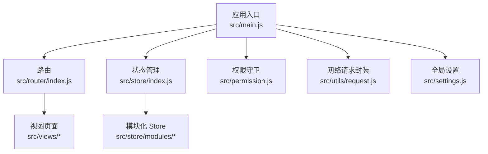
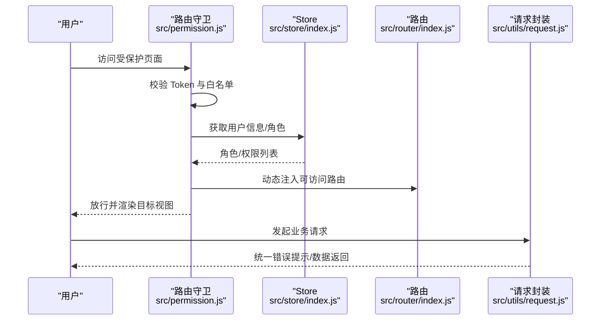
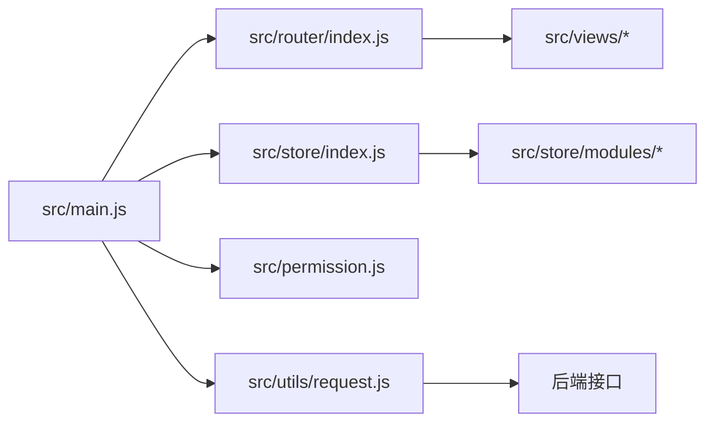

# 开发指南

<cite>
**本文引用的文件**
- [package.json](file://package.json)
- [README.md](file://README.md)
- [.eslintrc.js](file://.eslintrc.js)
- [.prettierrc](file://.prettierrc)
- [vue.config.js](file://vue.config.js)
- [src/main.js](file://src/main.js)
- [src/settings.js](file://src/settings.js)
- [src/router/index.js](file://src/router/index.js)
- [src/store/index.js](file://src/store/index.js)
- [src/utils/request.js](file://src/utils/request.js)
- [src/permission.js](file://src/permission.js)
- [plopfile.js](file://plopfile.js)
- [plop-templates/component/prompt.js](file://plop-templates/component/prompt.js)
- [plop-templates/view/prompt.js](file://plop-templates/view/prompt.js)
- [tests/unit/.eslintrc.js](file://tests/unit/.eslintrc.js)
- [jest.config.js](file://jest.config.js)
- [mock/index.js](file://mock/index.js)
</cite>

## 目录
1. [简介](#简介)
2. [项目结构](#项目结构)
3. [核心组件](#核心组件)
4. [架构总览](#架构总览)
5. [详细组件分析](#详细组件分析)
6. [依赖关系分析](#依赖关系分析)
7. [性能考量](#性能考量)
8. [故障排查指南](#故障排查指南)
9. [结论](#结论)
10. [附录](#附录)

## 简介
本指南面向 Leisu Admin 项目的新老开发者，系统性阐述开发规范与最佳实践，覆盖代码风格、命名约定、文件组织、组件开发规范、API 设计与错误处理、构建与部署流程、代码生成工具 Plop 的使用、调试与测试策略、版本控制与协作规范，并提供从环境准备到上手开发的完整指引。

## 项目结构
项目采用 Vue CLI 3.x + Element-UI 的中后台解决方案，遵循“按功能域划分”的模块化组织方式，核心目录职责如下：
- build：构建产物与打包脚本（由 vue.config.js 配置）
- mock：本地与远端 Mock 服务定义
- plop-templates：Plop 代码生成模板与交互式脚手架
- public：公共资源与静态 HTML
- src：
  - api：按业务域划分的接口层（matchapi、game、user、pay 等）
  - components：通用与业务组件库（含 leisu 扩展组件）
  - layout：布局与导航组件
  - router：路由定义与动态挂载
  - store：Vuex 模块化状态管理
  - utils：工具函数与网络请求封装
  - views：页面视图（按业务域组织）
  - styles、assets：样式与静态资源
  - main.js、permission.js、settings.js：应用入口与全局配置

图表来源
- [src/main.js:1-526](file://src/main.js#L1-L526)
- [src/router/index.js:1-177](file://src/router/index.js#L1-L177)
- [src/store/index.js:1-26](file://src/store/index.js#L1-L26)
- [src/permission.js:1-82](file://src/permission.js#L1-L82)
- [src/utils/request.js:1-130](file://src/utils/request.js#L1-L130)
- [src/settings.js:1-36](file://src/settings.js#L1-L36)

章节来源
- [README.md:123-151](file://README.md#L123-L151)
- [vue.config.js:18-155](file://vue.config.js#L18-L155)

## 核心组件
- 应用入口与全局初始化
  - 注册全局组件、指令、过滤器与插件；注入运行时工具方法；挂载全局事件总线；按环境裁剪日志输出。
- 权限与路由
  - 基于路由守卫实现登录态校验、角色权限动态注入、白名单放行与进度条控制。
- 状态管理
  - 自动加载 modules 下的模块，集中注册 getters，模块内按需拆分 state、mutations、actions、getters。
- 网络请求
  - 基于 axios 封装，自动注入 token、统一错误提示、按响应码处理登出逻辑、支持跨域携带 Cookie 与超时控制。
- 构建与优化
  - Webpack 链式配置：SVG Sprite、preserveWhitespace、开发 sourcemap、生产分包与 runtime 单独提取、HTML 内联 runtime。

章节来源
- [src/main.js:1-526](file://src/main.js#L1-L526)
- [src/permission.js:1-82](file://src/permission.js#L1-L82)
- [src/store/index.js:1-26](file://src/store/index.js#L1-L26)
- [src/utils/request.js:1-130](file://src/utils/request.js#L1-L130)
- [vue.config.js:77-152](file://vue.config.js#L77-L152)

## 架构总览
下图展示从浏览器发起请求到后端接口的整体链路，以及权限拦截与动态路由注入的关键节点。

图表来源
- [src/permission.js:13-76](file://src/permission.js#L13-L76)
- [src/router/index.js:74-160](file://src/router/index.js#L74-L160)
- [src/store/index.js:10-23](file://src/store/index.js#L10-L23)
- [src/utils/request.js:29-68](file://src/utils/request.js#L29-L68)

## 详细组件分析

### 组件开发规范
- 结构与职责
  - 优先使用单文件组件（.vue），按功能域在 components 下拆分；通用组件置于 general、Charts 等子目录；业务组件置于 leisu 或各业务域。
  - 组件命名采用 PascalCase，文件名与组件名一致；避免在组件内做过多业务逻辑，尽量通过 props、events 与父组件通信。
- API 设计
  - 明确 props 类型与默认值；使用 emits 声明对外事件；对复杂输入使用校验与转换（如日期、金额）。
- 生命周期管理
  - 在 beforeDestroy/activated/deactivated 中释放定时器、解绑事件；避免内存泄漏。
- 性能优化
  - 使用 v-show/v-if 合理控制渲染；对长列表使用虚拟滚动；减少不必要的深拷贝；合理拆分异步组件。
- 可维护性
  - 统一样式与主题变量；避免全局样式污染；组件内部样式作用域化；必要时抽离混入（mixins）复用逻辑。

### API 接口开发规范
- 设计原则
  - RESTful 风格，名词化资源；幂等性与一致性；清晰的状态码与错误信息。
- 参数验证
  - 前端对必填字段与类型进行基础校验；后端严格校验并返回明确错误。
- 错误处理
  - 统一在请求封装中处理非 2xx 与业务错误码；对 401 自动跳转登录；对 5xx 展示友好提示。
- 文档编写
  - 接口文档与注释同步维护；参数、返回值、异常场景清晰标注；Mock 数据与真实接口保持一致。

章节来源
- [src/utils/request.js:22-68](file://src/utils/request.js#L22-L68)

### 构建与部署流程
- 开发环境
  - 通过 npm scripts 启动本地服务，支持多环境模式；热更新与错误覆盖显示；可选代理与 Mock 服务。
- 生产构建
  - 关闭 SourceMap 与生产日志；启用分包策略（libs、elementUI、commons）与 runtime 单独提取；HTML 内联 runtime。
- 部署策略
  - 输出 dist/static 资源；通过 CDN 加速；按环境配置 VUE_APP_BASE_API 与静态资源路径。

章节来源
- [package.json:7-19](file://package.json#L7-L19)
- [vue.config.js:26-35](file://vue.config.js#L26-L35)
- [vue.config.js:115-151](file://vue.config.js#L115-L151)

### 代码生成工具 Plop
- 模板系统
  - 通过 plopfile 注册 view 与 component 两类生成器；模板位于 plop-templates 下，包含 index.hbs 与 prompt.js。
- 使用方式
  - 执行 npm run new 后按提示选择 generator 与选项，自动生成页面或组件骨架，减少重复劳动，统一风格。
- 最佳实践
  - 生成后按需补充路由、权限、样式与测试；保持模板简洁可扩展。

章节来源
- [plopfile.js:1-8](file://plopfile.js#L1-L8)
- [plop-templates/view/prompt.js](file://plop-templates/view/prompt.js)
- [plop-templates/component/prompt.js](file://plop-templates/component/prompt.js)

### 调试与测试策略
- 浏览器调试
  - 使用 Vue DevTools 定位组件层级与状态；结合断点与日志定位问题；生产环境日志按需裁剪。
- 单元测试
  - Jest 配置支持 .vue/.js 文件转换；覆盖率收集忽略敏感模块；测试用例聚焦工具函数与纯函数。
- 集成测试
  - Mock 服务模拟后端接口；在 CI 中执行 Lint 与测试，确保质量门禁。

章节来源
- [jest.config.js:1-25](file://jest.config.js#L1-L25)
- [tests/unit/.eslintrc.js:1-6](file://tests/unit/.eslintrc.js#L1-L6)
- [mock/index.js:1-71](file://mock/index.js#L1-L71)

### 版本控制与协作规范
- 分支管理
  - 主分支不支持低版本浏览器；建议使用特性分支开发，合并前通过代码审查。
- 提交规范
  - 使用语义化提交信息；简述变更目的与影响范围；关联 Issue 编号。
- 代码审查
  - 审查要点：可读性、健壮性、性能、安全性与测试覆盖；确保通过 Lint 与测试。

### 新人上手指南
- 环境准备
  - 安装 Node.js（满足 engines 要求）与 npm；安装依赖后启动开发服务。
- 本地开发
  - 通过 npm run dev 启动；按需配置环境变量与代理；使用 Mock 服务进行联调。
- 代码规范
  - 遵循 ESLint 与 Prettier 规则；统一命名与文件组织；新增组件/页面使用 Plop 生成。
- 质量保障
  - 提交前执行 Lint 与单元测试；在 CI 中完成自动化检查。

章节来源
- [README.md:123-151](file://README.md#L123-L151)
- [package.json:130-138](file://package.json#L130-L138)
- [.eslintrc.js:1-268](file://.eslintrc.js#L1-L268)
- [.prettierrc:1-13](file://.prettierrc#L1-L13)

## 依赖关系分析
- 组件耦合
  - main.js 作为根入口，依赖 router、store、permission、utils 等；router 与 store 通过守卫与 actions 协作；request 统一封装网络层。
- 外部依赖
  - Element-UI、Axios、Vuex、Vue Router、NProgress、MockJS 等；构建期通过 ProvidePlugin 注入 jQuery。
- 环境变量
  - 通过 VUE_APP_* 注入 API 地址、MQTT 地址与静态资源路径；不同环境区分 admin-w.leisu.com 与 admin.leisudata.com。

图表来源
- [src/main.js:18-26](file://src/main.js#L18-L26)
- [src/router/index.js:1-10](file://src/router/index.js#L1-L10)
- [src/store/index.js:8-23](file://src/store/index.js#L8-L23)
- [src/permission.js:1-8](file://src/permission.js#L1-L8)
- [src/utils/request.js:1-5](file://src/utils/request.js#L1-L5)

章节来源
- [src/main.js:1-526](file://src/main.js#L1-L526)
- [src/router/index.js:1-177](file://src/router/index.js#L1-L177)
- [src/store/index.js:1-26](file://src/store/index.js#L1-L26)
- [src/utils/request.js:1-130](file://src/utils/request.js#L1-L130)

## 性能考量
- 资源分包与懒加载
  - 生产环境按 libs、elementUI、components 拆分；runtime 单独提取；路由视图按需懒加载。
- 渲染优化
  - 保留空白字符以提升可读性；避免过度 v-html；组件内样式作用域化。
- 请求优化
  - 统一超时时间与错误提示；对 401 自动登出；按 responseType 区分业务错误与二进制数据。
- 构建体积
  - 关闭 SourceMap 与生产日志；删除 preload/prefetch 插件；SVG 使用 sprite-loader。

章节来源
- [vue.config.js:77-152](file://vue.config.js#L77-L152)
- [src/utils/request.js:22-26](file://src/utils/request.js#L22-L26)

## 故障排查指南
- 登录与权限
  - 若出现 401/403，检查 Token 是否存在与有效；确认角色权限是否正确下发；核对白名单与路由守卫逻辑。
- 接口错误
  - 查看统一错误提示与响应码；关注 201000 的登出逻辑；对 404 核对接口路径与环境变量。
- 构建问题
  - 检查环境变量与 publicPath；确认分包配置与 runtime 提取；排查 SVG 与样式加载问题。
- Mock 与联调
  - 确认 Mock 服务已启用；核对 Mock 路由与响应结构；与真实接口保持一致。

章节来源
- [src/permission.js:13-76](file://src/permission.js#L13-L76)
- [src/utils/request.js:46-127](file://src/utils/request.js#L46-L127)
- [mock/index.js:19-71](file://mock/index.js#L19-L71)

## 结论
本指南从规范、架构、组件、API、构建、生成、测试与协作等维度给出了系统性的开发建议。建议团队在日常迭代中持续完善模板与规范，强化自动化质量门禁，确保项目长期可维护与高质量交付。

## 附录
- 常用命令
  - 启动开发：npm run dev
  - 构建测试：npm run build:dev
  - 构建生产：npm run build:prod
  - 代码检查：npm run lint
  - 单测：npm run test:unit
  - 代码生成：npm run new
- 环境变量
  - VUE_APP_BASE_API/VUE_APP_BASE_API_OUT/VUE_APP_BASE_API_DATA
  - VUE_APP_BASE_MQTT/VUE_APP_BASE_MQTT_OUT/VUE_APP_BASE_MQTT_DATA
  - VUE_APP_BASE_PATH

章节来源
- [package.json:7-19](file://package.json#L7-L19)
- [src/utils/request.js:10-20](file://src/utils/request.js#L10-L20)
- [vue.config.js:26-27](file://vue.config.js#L26-L27)