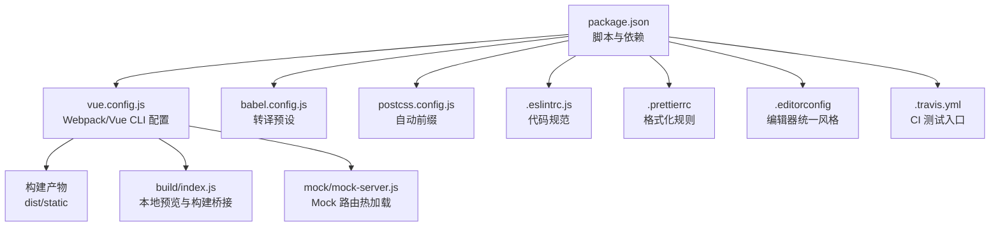
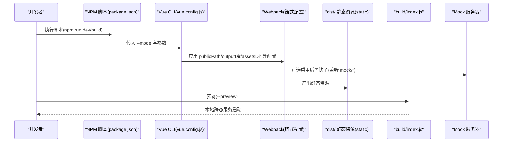
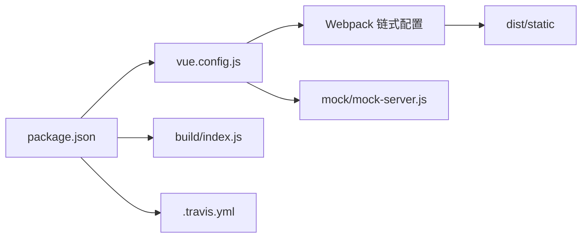

# 构建与部署

<cite>
**本文引用的文件**
- [package.json](file://package.json)
- [vue.config.js](file://vue.config.js)
- [babel.config.js](file://babel.config.js)
- [postcss.config.js](file://postcss.config.js)
- [src/settings.js](file://src/settings.js)
- [build/index.js](file://build/index.js)
- [.eslintrc.js](file://.eslintrc.js)
- [.prettierrc](file://.prettierrc)
- [.editorconfig](file://.editorconfig)
- [.travis.yml](file://.travis.yml)
- [README.md](file://README.md)
- [mock/mock-server.js](file://mock/mock-server.js)
</cite>

## 目录
1. [简介](#简介)
2. [项目结构](#项目结构)
3. [核心组件](#核心组件)
4. [架构总览](#架构总览)
5. [详细组件分析](#详细组件分析)
6. [依赖关系分析](#依赖关系分析)
7. [性能考虑](#性能考虑)
8. [故障排查指南](#故障排查指南)
9. [结论](#结论)
10. [附录](#附录)

## 简介
本文件面向运维与开发者，系统性梳理 Leisu Admin 的构建与部署实践，覆盖 Vue CLI 项目配置、Webpack 构建参数、开发与生产环境差异、资源打包策略、环境变量与静态资源处理、部署与 CI/CD 流程、版本管理与回滚策略、性能优化与监控告警建议等内容。目标是帮助团队在不同环境下稳定、高效地交付应用。

## 项目结构
- 根目录包含构建脚本、CLI 配置、样式与工具链配置、Mock 服务器、以及测试与质量保障配置。
- 构建产物输出至 dist，静态资源置于 static 子目录；通过 publicPath 控制运行时资源前缀。
- 开发服务器支持热重载与代理（注释掉），Mock 路由通过监听文件变更自动注册/卸载。

图表来源
- [package.json:1-139](file://package.json#L1-L139)
- [vue.config.js:1-155](file://vue.config.js#L1-L155)
- [babel.config.js:1-6](file://babel.config.js#L1-L6)
- [postcss.config.js:1-6](file://postcss.config.js#L1-L6)
- [.eslintrc.js:1-268](file://.eslintrc.js#L1-L268)
- [.prettierrc:1-13](file://.prettierrc#L1-L13)
- [.editorconfig:1-15](file://.editorconfig#L1-L15)
- [.travis.yml:1-6](file://.travis.yml#L1-L6)
- [build/index.js:1-36](file://build/index.js#L1-L36)
- [mock/mock-server.js:1-69](file://mock/mock-server.js#L1-L69)

章节来源
- [package.json:1-139](file://package.json#L1-L139)
- [vue.config.js:18-35](file://vue.config.js#L18-L35)
- [build/index.js:7-35](file://build/index.js#L7-L35)
- [mock/mock-server.js:30-68](file://mock/mock-server.js#L30-L68)

## 核心组件
- 构建脚本与模式
  - 通过 npm scripts 定义多模式构建：本地开发、开发环境、生产环境、本地预览等。
  - 使用 --mode 参数传递环境变量，结合 .env.* 文件进行差异化配置。
- Vue CLI 配置
  - publicPath、outputDir、assetsDir 控制部署路径与静态资源目录。
  - devServer 提供端口、覆盖提示、代理占位（注释）与 Mock 后置钩子。
  - configureWebpack 与 chainWebpack 实现别名、externals、插件注入与分包策略。
- 质量与工具链
  - ESLint 规则、Prettier、EditorConfig 保证代码风格一致。
  - Babel 与 PostCSS 配置分别负责语法转换与样式兼容。

章节来源
- [package.json:7-20](file://package.json#L7-L20)
- [vue.config.js:26-76](file://vue.config.js#L26-L76)
- [vue.config.js:77-153](file://vue.config.js#L77-L153)
- [.eslintrc.js:1-268](file://.eslintrc.js#L1-L268)
- [.prettierrc:1-13](file://.prettierrc#L1-L13)
- [.editorconfig:1-15](file://.editorconfig#L1-L15)
- [babel.config.js:1-6](file://babel.config.js#L1-L6)
- [postcss.config.js:1-6](file://postcss.config.js#L1-L6)

## 架构总览
下图展示从开发到生产的整体流程：本地开发、构建打包、产物预览与部署。

图表来源
- [package.json:7-20](file://package.json#L7-L20)
- [vue.config.js:18-76](file://vue.config.js#L18-L76)
- [build/index.js:7-35](file://build/index.js#L7-L35)
- [mock/mock-server.js:30-68](file://mock/mock-server.js#L30-L68)

## 详细组件分析

### 构建脚本与模式
- 开发模式
  - local/dev/prod 对应不同 --mode，用于加载 .env.localhost/.env.development/.env.production。
  - dev 启动开发服务器，开启错误覆盖提示。
- 生产构建
  - build:dev/build:prod 分别构建测试与生产环境。
  - preview 调用构建后在本地以静态服务方式预览。
- 单元测试与质量
  - test:unit、test:ci、lint 串联质量门禁。

章节来源
- [package.json:7-20](file://package.json#L7-L20)
- [README.md:143-151](file://README.md#L143-L151)

### Vue CLI 配置详解
- 基础路径与输出
  - publicPath 由环境变量 VUE_APP_BASE_PATH 决定，便于多域名/子路径部署。
  - outputDir 默认 dist，assetsDir 默认 static，确保静态资源分离。
- 开发服务器
  - 端口优先取进程端口或 npm_config_port，默认 80；关闭 host 校验，开启错误覆盖。
  - 代理与 Mock 后置钩子预留（注释），便于联调。
- Webpack 注入与插件
  - ProvidePlugin 注入全局 jQuery。
  - externals 将外部地图库标识为全局变量，减少打包体积。
- 链式配置与分包
  - 删除 preload/prefetch 插件，避免过度预加载。
  - SVG Sprite Loader 配置图标资源专用加载器。
  - runtimeChunk 单独提取，ScriptExtHtmlWebpackPlugin 内联运行时脚本，提升首屏。
  - splitChunks 按第三方库、Element UI、通用组件拆分缓存块，提升复用率。
- Source Map 与白名单
  - 开发环境使用 cheap-source-map；生产关闭 source map 降低泄露风险。
  - 错误日志组件仅在生产环境显示。

章节来源
- [vue.config.js:18-35](file://vue.config.js#L18-L35)
- [vue.config.js:37-59](file://vue.config.js#L37-L59)
- [vue.config.js:60-76](file://vue.config.js#L60-L76)
- [vue.config.js:77-153](file://vue.config.js#L77-L153)
- [src/settings.js:1-36](file://src/settings.js#L1-L36)

### 资源打包与静态资源处理
- SVG 图标
  - 排除 src/icons 下的 SVG，单独使用 svg-sprite-loader，并以 icon-[name] 作为符号 ID。
- 保留空白符
  - 通过 vue-loader compilerOptions.preserveWhitespace 提升可读性与调试体验。
- 运行时与内联
  - runtimeChunk 单独提取，HTML 插件后置注入 ScriptExtHtmlWebpackPlugin，内联运行时脚本，减少请求次数。

章节来源
- [vue.config.js:81-107](file://vue.config.js#L81-L107)
- [vue.config.js:115-152](file://vue.config.js#L115-L152)

### Mock 服务器与开发联调
- Mock 路由注册
  - 通过 mock/index.js 动态注册路由，支持 body 解析与热重载。
- 热更新机制
  - 监听 mock 目录变化，自动卸载旧路由并重新注册，无需重启服务。
- 与开发服务器集成
  - 可在 devServer.after 中挂载 mock-server，便于本地联调。

章节来源
- [mock/mock-server.js:8-28](file://mock/mock-server.js#L8-L28)
- [mock/mock-server.js:30-68](file://mock/mock-server.js#L30-L68)

### 本地预览与构建桥接
- 预览模式
  - --preview 触发构建并在本地 9526 端口提供静态服务，支持可选报告页面。
  - publicPath 与 dist 目录配合，确保资源路径正确。
- 构建桥接
  - build/index.js 统一调用 vue-cli-service build，便于扩展后续流程。

章节来源
- [build/index.js:7-35](file://build/index.js#L7-L35)

### 代码质量与工具链
- ESLint
  - 基于 eslint-plugin-vue 与 babel-eslint，规则覆盖属性换行、命名、空行、缩进、分号等。
  - 生产环境禁止 debugger，保证线上无调试断点。
- Prettier
  - 统一缩进、引号、尾逗号、箭头函数括号、打印宽度等风格。
- EditorConfig
  - 统一字符集、缩进、换行、结尾换行与尾随空白处理。
- Babel 与 PostCSS
  - Babel 使用 @vue/app 预设；PostCSS 使用 autoprefixer 自动补全厂商前缀。

章节来源
- [.eslintrc.js:1-268](file://.eslintrc.js#L1-L268)
- [.prettierrc:1-13](file://.prettierrc#L1-L13)
- [.editorconfig:1-15](file://.editorconfig#L1-L15)
- [babel.config.js:1-6](file://babel.config.js#L1-L6)
- [postcss.config.js:1-6](file://postcss.config.js#L1-L6)

## 依赖关系分析
- 构建链路
  - package.json -> vue.config.js -> Webpack 链式配置 -> dist 输出。
  - build/index.js 作为本地预览桥接层，调用 CLI 构建。
- 开发与 Mock
  - mock-server.js 与 devServer.after 集成，实现热更新与路由注册。
- 质量门禁
  - .travis.yml 调用 npm run test，串联 lint 与单元测试。

图表来源
- [package.json:7-20](file://package.json#L7-L20)
- [vue.config.js:18-76](file://vue.config.js#L18-L76)
- [build/index.js:7-35](file://build/index.js#L7-L35)
- [mock/mock-server.js:30-68](file://mock/mock-server.js#L30-L68)
- [.travis.yml:1-6](file://.travis.yml#L1-L6)

章节来源
- [package.json:7-20](file://package.json#L7-L20)
- [vue.config.js:18-76](file://vue.config.js#L18-L76)
- [build/index.js:7-35](file://build/index.js#L7-L35)
- [mock/mock-server.js:30-68](file://mock/mock-server.js#L30-L68)
- [.travis.yml:1-6](file://.travis.yml#L1-L6)

## 性能考虑
- 分包与缓存
  - splitChunks 拆分第三方库、Element UI 与通用组件，提升缓存命中率。
  - runtimeChunk 单独提取，配合内联运行时脚本，减少请求与解析成本。
- 资源体积
  - 生产关闭 source map，减少泄露与体积。
  - externals 外部化大体积库（如地图库），降低打包体积。
- 预加载与首屏
  - 删除 preload/prefetch，避免对非关键资源的过早请求；通过内联运行时脚本优化首屏。
- 代码风格与构建稳定性
  - ESLint、Prettier、EditorConfig 降低代码异味与构建失败概率。

章节来源
- [vue.config.js:115-152](file://vue.config.js#L115-L152)
- [vue.config.js:31-35](file://vue.config.js#L31-L35)
- [vue.config.js:29](file://vue.config.js#L29)
- [.eslintrc.js:257](file://.eslintrc.js#L257)
- [.prettierrc:1-13](file://.prettierrc#L1-L13)
- [.editorconfig:1-15](file://.editorconfig#L1-L15)

## 故障排查指南
- 构建失败
  - 检查 NODE_ENV 与 --mode 是否匹配 .env.* 文件；确认 publicPath 与部署路径一致。
  - 若出现 externals 相关报错，检查外部库是否已通过 CDN 或全局变量提供。
- 开发服务器问题
  - 端口占用：修改 port 或使用 kill 命令释放；确认 disableHostCheck 与代理配置。
  - Mock 不生效：检查 mock-server 是否被正确挂载，mock 目录文件是否符合约定。
- 预览异常
  - --preview 模式下 publicPath 与静态资源路径需一致；确认 9526 端口未被占用。
- 代码规范与格式化
  - ESLint 报错：根据规则调整代码；必要时临时关闭规则并补充注释。
  - Prettier 格式化冲突：统一团队编辑器设置，或在提交前执行格式化。

章节来源
- [vue.config.js:18-35](file://vue.config.js#L18-L35)
- [vue.config.js:37-59](file://vue.config.js#L37-L59)
- [build/index.js:7-35](file://build/index.js#L7-L35)
- [mock/mock-server.js:30-68](file://mock/mock-server.js#L30-L68)
- [.eslintrc.js:1-268](file://.eslintrc.js#L1-L268)
- [.prettierrc:1-13](file://.prettierrc#L1-L13)
- [.editorconfig:1-15](file://.editorconfig#L1-L15)

## 结论
本项目以 Vue CLI 为核心，结合链式 Webpack 配置与质量工具链，形成可扩展、可维护的构建体系。通过明确的环境变量、分包策略与本地预览能力，能够支撑多环境部署与持续交付。建议在实际落地中完善 CI/CD 与监控告警，确保构建与发布的稳定性与可观测性。

## 附录

### 环境变量与模式映射
- 本地开发：--mode localhost
- 开发环境：--mode development
- 生产环境：--mode production
- 本地预览：--preview

章节来源
- [package.json:7-20](file://package.json#L7-L20)
- [README.md:143-151](file://README.md#L143-L151)

### 部署策略与 CI/CD 建议
- 部署策略
  - 选择合适 publicPath，确保静态资源与 HTML 正确关联。
  - 将 dist 部署至 Nginx/Apache 或对象存储，开启 Gzip/Brotli 压缩与缓存头。
- CI/CD 流程
  - 触发条件：push 到主分支或打 Tag。
  - 步骤建议：安装依赖 → Lint 与单元测试 → 构建 → 产物归档 → 预览校验 → 上线发布。
  - 回滚机制：保留最近 N 个版本产物，支持一键回滚。
- 监控与告警
  - 前端埋点：首屏时间、资源加载耗时、错误上报。
  - 构建监控：构建时长阈值、产物体积趋势、失败率。
  - 运维告警：部署失败、健康检查异常、流量突增/突降。

章节来源
- [vue.config.js:26](file://vue.config.js#L26)
- [.travis.yml:1-6](file://.travis.yml#L1-L6)