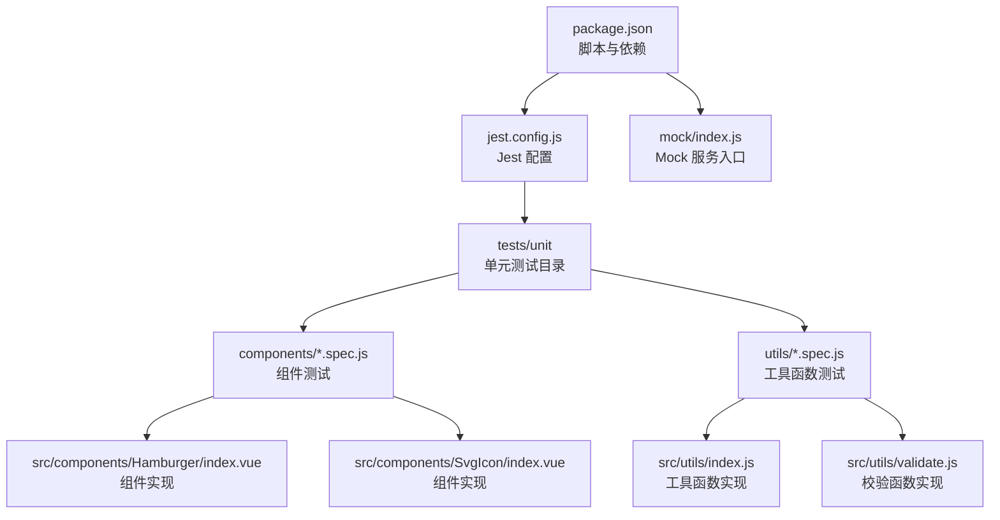
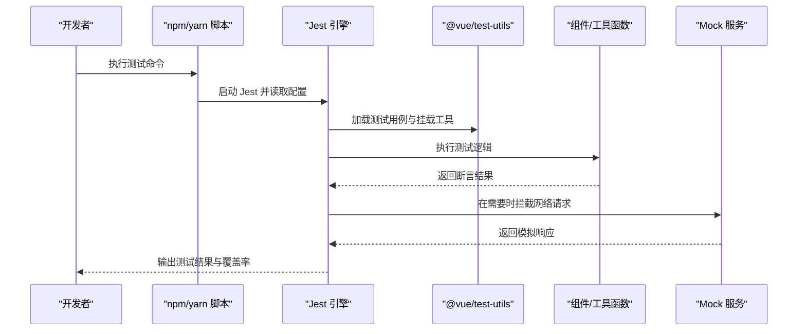
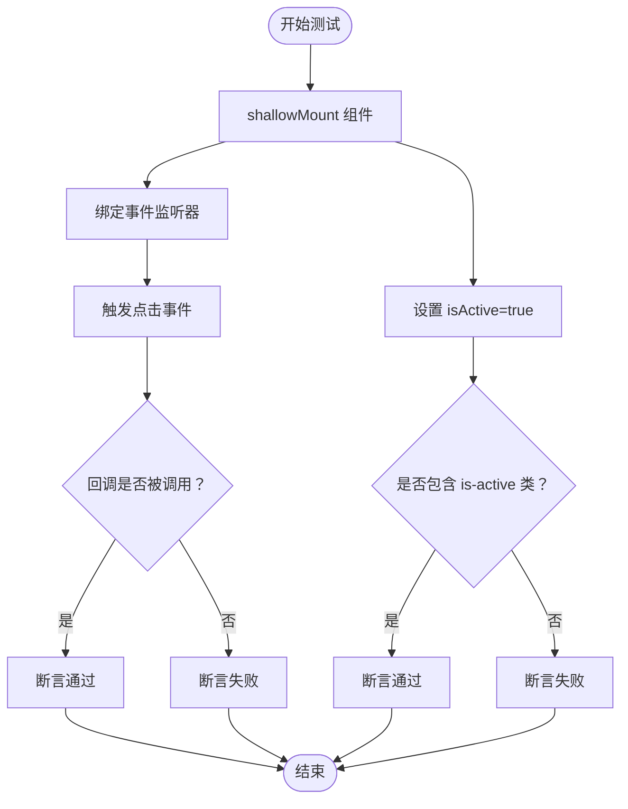
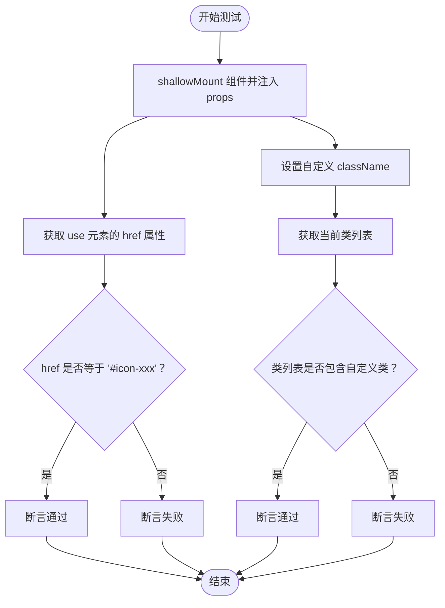
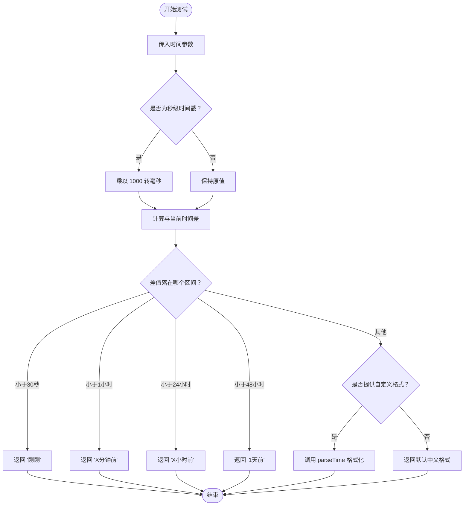
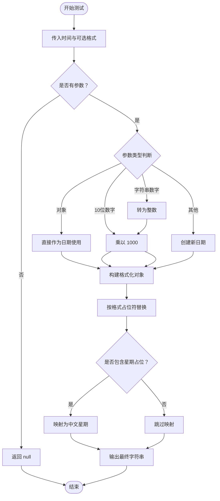
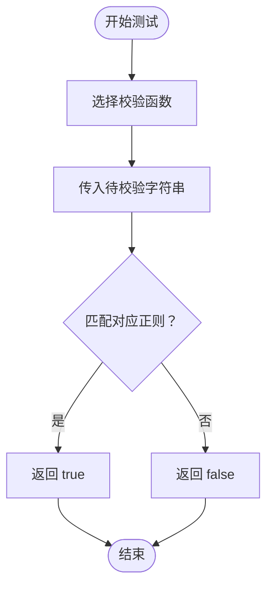
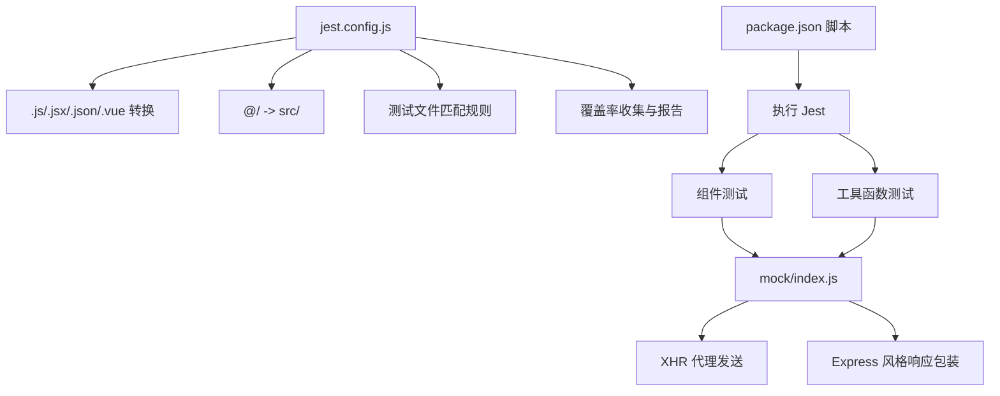

# 测试与调试

<cite>
**本文引用的文件**
- [jest.config.js](file://jest.config.js)
- [package.json](file://package.json)
- [tests/unit/components/Hamburger.spec.js](file://tests/unit/components/Hamburger.spec.js)
- [tests/unit/components/SvgIcon.spec.js](file://tests/unit/components/SvgIcon.spec.js)
- [tests/unit/utils/formatTime.spec.js](file://tests/unit/utils/formatTime.spec.js)
- [tests/unit/utils/parseTime.spec.js](file://tests/unit/utils/parseTime.spec.js)
- [tests/unit/utils/validate.spec.js](file://tests/unit/utils/validate.spec.js)
- [tests/unit/.eslintrc.js](file://tests/unit/.eslintrc.js)
- [src/utils/index.js](file://src/utils/index.js)
- [src/utils/validate.js](file://src/utils/validate.js)
- [src/components/Hamburger/index.vue](file://src/components/Hamburger/index.vue)
- [src/components/SvgIcon/index.vue](file://src/components/SvgIcon/index.vue)
- [mock/index.js](file://mock/index.js)
</cite>

## 目录
1. [简介](#简介)
2. [项目结构](#项目结构)
3. [核心组件](#核心组件)
4. [架构总览](#架构总览)
5. [详细组件分析](#详细组件分析)
6. [依赖分析](#依赖分析)
7. [性能考虑](#性能考虑)
8. [故障排查指南](#故障排查指南)
9. [结论](#结论)
10. [附录](#附录)

## 简介
本文件面向 Leisu Admin 项目，提供系统化的测试与调试指导，涵盖单元测试、集成测试与端到端测试策略，详述 Jest 配置与使用方法（含测试用例编写、Mock 数据处理、覆盖率统计），并给出调试技巧与工具使用建议（浏览器开发者工具、Vue Devtools、错误日志分析）。同时包含性能测试与优化建议以及常见问题排查方案，帮助开发者建立完善的质量保障体系。

## 项目结构
本项目采用 Vue CLI 3.x + Jest 的前端测试体系，测试目录位于 tests/unit，包含组件与工具函数的单元测试；Jest 配置集中于 jest.config.js；测试脚本在 package.json 中定义。Mock 数据通过 mock/index.js 组织，支持对后端接口进行前端拦截模拟。

图表来源
- [package.json:1-139](file://package.json#L1-L139)
- [jest.config.js:1-25](file://jest.config.js#L1-L25)
- [tests/unit/components/Hamburger.spec.js:1-19](file://tests/unit/components/Hamburger.spec.js#L1-L19)
- [tests/unit/components/SvgIcon.spec.js:1-23](file://tests/unit/components/SvgIcon.spec.js#L1-L23)
- [tests/unit/utils/formatTime.spec.js:1-30](file://tests/unit/utils/formatTime.spec.js#L1-L30)
- [tests/unit/utils/parseTime.spec.js:1-28](file://tests/unit/utils/parseTime.spec.js#L1-L28)
- [tests/unit/utils/validate.spec.js:1-29](file://tests/unit/utils/validate.spec.js#L1-L29)
- [src/utils/index.js:1-339](file://src/utils/index.js#L1-L339)
- [src/utils/validate.js:1-88](file://src/utils/validate.js#L1-L88)
- [src/components/Hamburger/index.vue:1-45](file://src/components/Hamburger/index.vue#L1-L45)
- [src/components/SvgIcon/index.vue:1-63](file://src/components/SvgIcon/index.vue#L1-L63)
- [mock/index.js:1-71](file://mock/index.js#L1-L71)

章节来源
- [package.json:1-139](file://package.json#L1-L139)
- [jest.config.js:1-25](file://jest.config.js#L1-L25)

## 核心组件
- 单元测试：覆盖组件行为与工具函数逻辑，使用 @vue/test-utils 进行挂载与断言，Jest 提供断言与测试运行能力。
- Mock 数据：通过 mock/index.js 聚合路由与响应，拦截 XHR 请求，模拟后端接口，便于离线与快速迭代。
- 覆盖率：Jest 配置中指定覆盖率收集范围与报告格式，辅助识别未覆盖路径与潜在风险点。

章节来源
- [tests/unit/components/Hamburger.spec.js:1-19](file://tests/unit/components/Hamburger.spec.js#L1-L19)
- [tests/unit/components/SvgIcon.spec.js:1-23](file://tests/unit/components/SvgIcon.spec.js#L1-L23)
- [tests/unit/utils/formatTime.spec.js:1-30](file://tests/unit/utils/formatTime.spec.js#L1-L30)
- [tests/unit/utils/parseTime.spec.js:1-28](file://tests/unit/utils/parseTime.spec.js#L1-L28)
- [tests/unit/utils/validate.spec.js:1-29](file://tests/unit/utils/validate.spec.js#L1-L29)
- [jest.config.js:16-22](file://jest.config.js#L16-L22)
- [mock/index.js:1-71](file://mock/index.js#L1-L71)

## 架构总览
下图展示测试执行流程与关键交互：Jest 启动后加载配置，扫描 tests/unit 下的 spec 文件，按需转换 .vue/.js 文件，执行测试并生成覆盖率报告；Mock 服务在测试环境中拦截网络请求，返回预设响应。

图表来源
- [package.json:16-17](file://package.json#L16-L17)
- [jest.config.js:1-25](file://jest.config.js#L1-L25)
- [mock/index.js:19-55](file://mock/index.js#L19-L55)

## 详细组件分析

### 组件测试：Hamburger
- 测试目标
  - 触发 toggleClick 事件并验证回调是否被调用。
  - 设置 isActive 属性，断言样式类 is-active 是否存在。
- 关键点
  - 使用 shallowMount 挂载组件，隔离子组件影响。
  - 通过 wrapper.find 定位元素，trigger 触发点击事件。
  - setProps 更新属性，contains 判断类名是否存在。
- 断言示例（路径）
  - [tests/unit/components/Hamburger.spec.js:4-17](file://tests/unit/components/Hamburger.spec.js#L4-L17)
- 实现参考（路径）
  - [src/components/Hamburger/index.vue:16-30](file://src/components/Hamburger/index.vue#L16-L30)

图表来源
- [tests/unit/components/Hamburger.spec.js:1-19](file://tests/unit/components/Hamburger.spec.js#L1-L19)
- [src/components/Hamburger/index.vue:1-45](file://src/components/Hamburger/index.vue#L1-L45)

章节来源
- [tests/unit/components/Hamburger.spec.js:1-19](file://tests/unit/components/Hamburger.spec.js#L1-L19)
- [src/components/Hamburger/index.vue:1-45](file://src/components/Hamburger/index.vue#L1-L45)

### 组件测试：SvgIcon
- 测试目标
  - 校验 iconClass 对应的 use href。
  - 校验 className 动态拼接与类名包含关系。
- 关键点
  - propsData 注入初始属性。
  - computed 值通过 wrapper.find('use').attributes() 获取。
  - classes() 返回类数组，使用 includes 判断。
- 断言示例（路径）
  - [tests/unit/components/SvgIcon.spec.js:4-21](file://tests/unit/components/SvgIcon.spec.js#L4-L21)
- 实现参考（路径）
  - [src/components/SvgIcon/index.vue:8-44](file://src/components/SvgIcon/index.vue#L8-L44)

图表来源
- [tests/unit/components/SvgIcon.spec.js:1-23](file://tests/unit/components/SvgIcon.spec.js#L1-L23)
- [src/components/SvgIcon/index.vue:1-63](file://src/components/SvgIcon/index.vue#L1-L63)

章节来源
- [tests/unit/components/SvgIcon.spec.js:1-23](file://tests/unit/components/SvgIcon.spec.js#L1-L23)
- [src/components/SvgIcon/index.vue:1-63](file://src/components/SvgIcon/index.vue#L1-L63)

### 工具函数测试：formatTime
- 测试目标
  - 时间戳（秒级）格式化输出。
  - “刚刚”“X分钟前”“X小时前”“1天前”等相对时间判断。
  - 自定义格式字符串解析。
- 关键点
  - 使用固定时间点构造输入，保证断言稳定。
  - 覆盖边界值与异常输入。
- 断言示例（路径）
  - [tests/unit/utils/formatTime.spec.js:6-28](file://tests/unit/utils/formatTime.spec.js#L6-L28)
- 实现参考（路径）
  - [src/utils/index.js:53-80](file://src/utils/index.js#L53-L80)

图表来源
- [tests/unit/utils/formatTime.spec.js:1-30](file://tests/unit/utils/formatTime.spec.js#L1-L30)
- [src/utils/index.js:53-80](file://src/utils/index.js#L53-L80)

章节来源
- [tests/unit/utils/formatTime.spec.js:1-30](file://tests/unit/utils/formatTime.spec.js#L1-L30)
- [src/utils/index.js:1-339](file://src/utils/index.js#L1-L339)

### 工具函数测试：parseTime
- 测试目标
  - 支持 Date 对象、毫秒/秒级时间戳、自定义格式。
  - 星期几的格式化输出。
  - 空参数返回 null。
- 关键点
  - 多类型输入兼容处理。
  - 格式占位符替换逻辑验证。
- 断言示例（路径）
  - [tests/unit/utils/parseTime.spec.js:4-26](file://tests/unit/utils/parseTime.spec.js#L4-L26)
- 实现参考（路径）
  - [src/utils/index.js:11-46](file://src/utils/index.js#L11-L46)

图表来源
- [tests/unit/utils/parseTime.spec.js:1-28](file://tests/unit/utils/parseTime.spec.js#L1-L28)
- [src/utils/index.js:11-46](file://src/utils/index.js#L11-L46)

章节来源
- [tests/unit/utils/parseTime.spec.js:1-28](file://tests/unit/utils/parseTime.spec.js#L1-L28)
- [src/utils/index.js:1-339](file://src/utils/index.js#L1-L339)

### 工具函数测试：validate
- 测试目标
  - 外部链接判断。
  - 用户名白名单校验。
  - URL、大小写字母、字母组合等正则校验。
- 关键点
  - 使用真实正则表达式验证边界场景。
  - 覆盖空格、大小写、特殊字符等。
- 断言示例（路径）
  - [tests/unit/utils/validate.spec.js:3-27](file://tests/unit/utils/validate.spec.js#L3-L27)
- 实现参考（路径）
  - [src/utils/validate.js:9-87](file://src/utils/validate.js#L9-L87)

图表来源
- [tests/unit/utils/validate.spec.js:1-29](file://tests/unit/utils/validate.spec.js#L1-L29)
- [src/utils/validate.js:1-88](file://src/utils/validate.js#L1-L88)

章节来源
- [tests/unit/utils/validate.spec.js:1-29](file://tests/unit/utils/validate.spec.js#L1-L29)
- [src/utils/validate.js:1-88](file://src/utils/validate.js#L1-L88)

## 依赖分析
- Jest 配置
  - 转换规则：.vue 使用 vue-jest，静态资源使用 jest-transform-stub，JS 使用 babel-jest。
  - 模块别名：@/ 映射到 src。
  - 测试文件匹配：tests/unit/**/*.spec.(js|jsx|ts|tsx) 与 __tests__/*.(js|jsx|ts|tsx)。
  - 覆盖率：收集 src/utils 与 src/components 下的 JS/Vue 文件，排除认证与请求封装。
  - 报告：lcov 与 text-summary。
- 测试脚本
  - test:unit：清理缓存后执行单元测试。
  - test:ci：先 ESLint 再 Jest。
- Mock 服务
  - 重写 XHR 发送逻辑，统一 withCredentials 与 responseType。
  - 将 Express 风格响应包装为 Mock 响应。

图表来源
- [jest.config.js:1-25](file://jest.config.js#L1-L25)
- [package.json:16-17](file://package.json#L16-L17)
- [mock/index.js:19-71](file://mock/index.js#L19-L71)

章节来源
- [jest.config.js:1-25](file://jest.config.js#L1-L25)
- [package.json:16-17](file://package.json#L16-L17)
- [mock/index.js:1-71](file://mock/index.js#L1-L71)

## 性能考虑
- 单测性能
  - 使用 shallowMount 减少渲染开销，避免深层子组件挂载。
  - 避免在单测中发起真实网络请求，优先使用 Mock 或本地桩。
  - 控制测试数据规模，减少循环与重复断言。
- 覆盖率与质量
  - 结合 Jest 覆盖率报告定位未覆盖分支与路径，补充边界用例。
  - 对高频工具函数（如 parseTime/formatTime）重点覆盖。
- CI/CD 集成
  - 在 CI 中先执行 ESLint 再执行 Jest，保证代码风格与质量门槛。
  - 将覆盖率阈值纳入 CI 检查，防止覆盖率回退。

## 故障排查指南
- 测试无法启动或报错
  - 检查 jest.config.js 转换规则与模块别名是否正确。
  - 确认 @vue/test-utils 与 vue-jest 版本兼容。
- 组件测试失败
  - 确认事件绑定与触发方式一致（如 toggleClick 事件名称）。
  - 对动态类名与属性使用 contains/classes/attributes 断言。
- 工具函数测试失败
  - 对 parseTime/formatTime 的格式化字符串与边界值逐一验证。
  - 对正则校验函数，准备充分的边界输入（空格、大小写、特殊字符）。
- Mock 接口不生效
  - 确认在测试入口引入并调用 mockXHR，且请求 URL 与 mock 定义一致。
  - 检查 withCredentials 与 responseType 是否按预期设置。
- 覆盖率异常
  - 检查 collectCoverageFrom 是否包含目标文件，排除不应统计的文件。
  - 确保测试文件命名符合 testMatch 规则。

章节来源
- [jest.config.js:1-25](file://jest.config.js#L1-L25)
- [tests/unit/components/Hamburger.spec.js:1-19](file://tests/unit/components/Hamburger.spec.js#L1-L19)
- [tests/unit/components/SvgIcon.spec.js:1-23](file://tests/unit/components/SvgIcon.spec.js#L1-L23)
- [tests/unit/utils/formatTime.spec.js:1-30](file://tests/unit/utils/formatTime.spec.js#L1-L30)
- [tests/unit/utils/parseTime.spec.js:1-28](file://tests/unit/utils/parseTime.spec.js#L1-L28)
- [tests/unit/utils/validate.spec.js:1-29](file://tests/unit/utils/validate.spec.js#L1-L29)
- [mock/index.js:19-55](file://mock/index.js#L19-L55)

## 结论
通过 Jest 单元测试与 Mock 服务的结合，Leisu Admin 能够在开发早期发现逻辑缺陷、提升代码质量与可维护性。配合覆盖率与 CI 流程，可有效保障功能稳定性与回归质量。建议持续完善测试用例覆盖面，强化边界与异常场景，并在团队内推广一致的测试规范与调试实践。

## 附录
- 测试命令
  - 运行单元测试：npm run test:unit
  - CI 流程：npm run test:ci（先 ESLint 再 Jest）
- 配置要点
  - 转换器与模块别名已在 jest.config.js 中配置。
  - 测试文件命名与目录结构遵循 tests/unit 下的约定。
- Mock 使用建议
  - 在测试入口引入 mockXHR 并在 beforeAll/全局配置中启用。
  - 为每个接口定义清晰的响应结构，便于断言与维护。