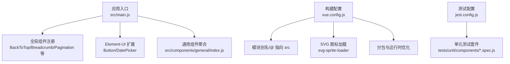
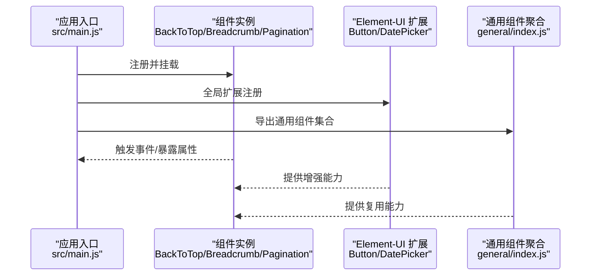
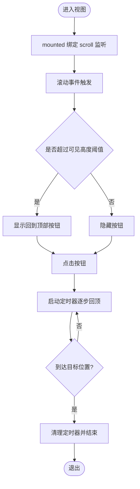
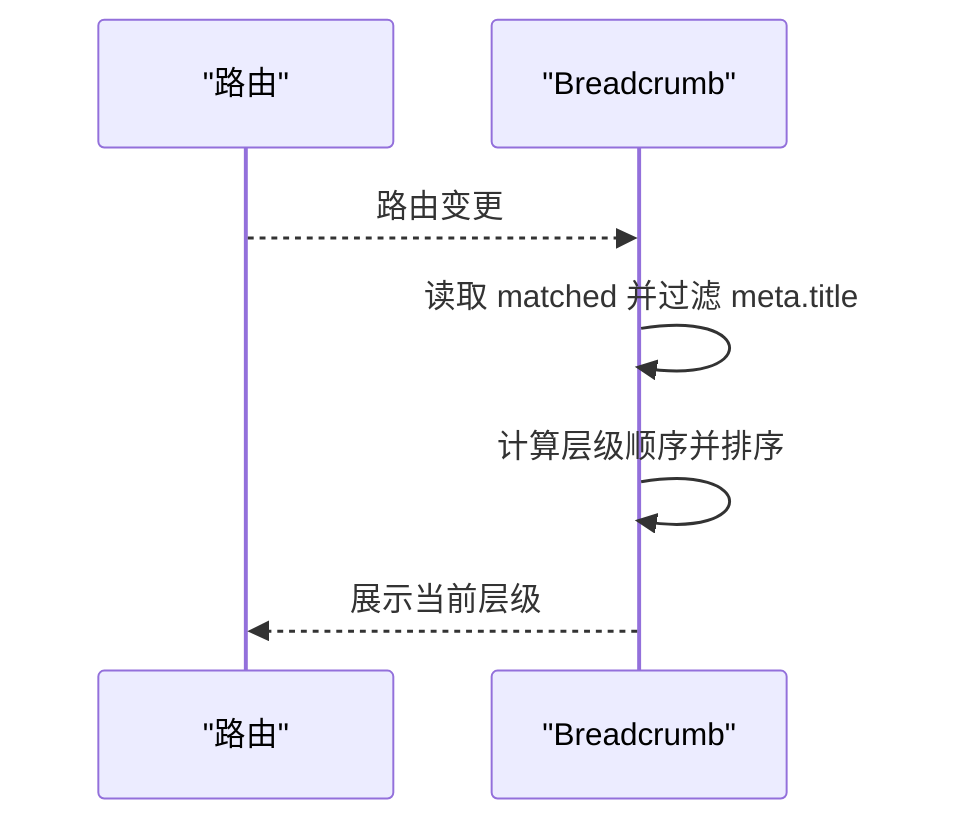
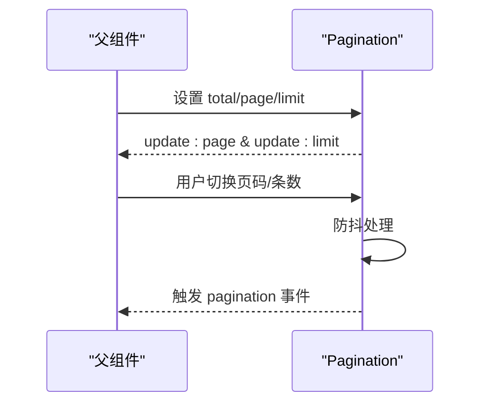
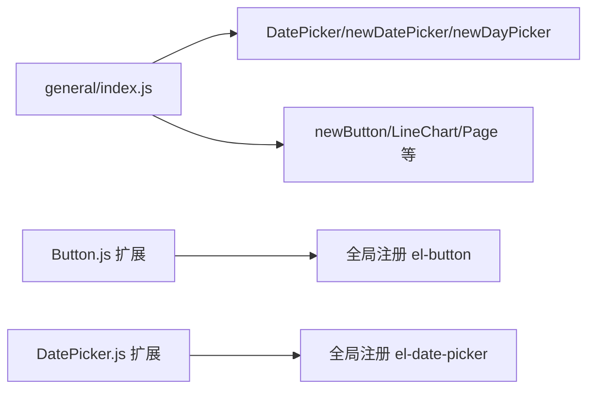
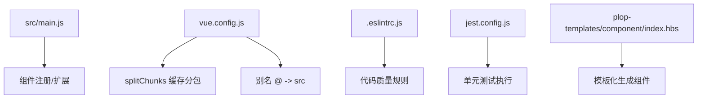

# 组件开发规范

<cite>
**本文引用的文件**
- [src/main.js](file://src/main.js)
- [package.json](file://package.json)
- [vue.config.js](file://vue.config.js)
- [.prettierrc](file://.prettierrc)
- [src/components/BackToTop/index.vue](file://src/components/BackToTop/index.vue)
- [src/components/Breadcrumb/index.vue](file://src/components/Breadcrumb/index.vue)
- [src/components/Pagination/index.vue](file://src/components/Pagination/index.vue)
- [src/components/general/index.js](file://src/components/general/index.js)
- [src/components/leisu/elementUi_extend/Button.js](file://src/components/leisu/elementUi_extend/Button.js)
- [tests/unit/components/Hamburger.spec.js](file://tests/unit/components/Hamburger.spec.js)
- [tests/unit/components/SvgIcon.spec.js](file://tests/unit/components/SvgIcon.spec.js)
- [.eslintrc.js](file://.eslintrc.js)
- [jest.config.js](file://jest.config.js)
- [plop-templates/component/index.hbs](file://plop-templates/component/index.hbs)
</cite>

## 目录
1. [简介](#简介)
2. [项目结构](#项目结构)
3. [核心组件](#核心组件)
4. [架构总览](#架构总览)
5. [详细组件分析](#详细组件分析)
6. [依赖关系分析](#依赖关系分析)
7. [性能考量](#性能考量)
8. [故障排查指南](#故障排查指南)
9. [结论](#结论)
10. [附录](#附录)

## 简介
本规范面向 Leisu Admin 项目，系统性梳理 Vue.js 组件开发标准与最佳实践，覆盖组件结构设计、Props 定义、事件处理、生命周期管理、命名与文件组织、样式编写、可复用组件设计原则、性能优化、测试策略与调试方法，并结合项目现有组件与工具链给出落地建议与参考路径。

## 项目结构
- 项目采用基于功能域的组件组织方式，核心组件集中于 src/components 下，按领域进一步细分（如 Charts、general、leisu 等）。
- 全局注册与扩展通过入口文件集中处理，便于统一管理和版本控制。
- 构建与打包通过 vue.config.js 进行模块别名、SVG 处理、缓存分包等配置；测试通过 Jest + Vue Test Utils 驱动。

图表来源
- [src/main.js:33-100](file://src/main.js#L33-L100)
- [vue.config.js:64-96](file://vue.config.js#L64-L96)
- [vue.config.js:127-151](file://vue.config.js#L127-L151)
- [jest.config.js:1-25](file://jest.config.js#L1-L25)

章节来源
- [src/main.js:1-526](file://src/main.js#L1-L526)
- [vue.config.js:1-155](file://vue.config.js#L1-L155)
- [package.json:1-139](file://package.json#L1-L139)

## 核心组件
- BackToTop：滚动至顶部交互组件，支持可见高度阈值、自定义样式、动画过渡与防抖移动。
- Breadcrumb：路由级面包屑导航，基于路由 matched 结果动态生成层级。
- Pagination：分页组件，封装 Element Pagination 并提供双向绑定与防抖事件。

章节来源
- [src/components/BackToTop/index.vue:1-112](file://src/components/BackToTop/index.vue#L1-L112)
- [src/components/Breadcrumb/index.vue:1-85](file://src/components/Breadcrumb/index.vue#L1-L85)
- [src/components/Pagination/index.vue:1-113](file://src/components/Pagination/index.vue#L1-L113)

## 架构总览
组件层与应用层的交互关系如下：

图表来源
- [src/main.js:33-100](file://src/main.js#L33-L100)
- [src/components/general/index.js:1-41](file://src/components/general/index.js#L1-L41)
- [src/components/leisu/elementUi_extend/Button.js:1-27](file://src/components/leisu/elementUi_extend/Button.js#L1-L27)

## 详细组件分析

### BackToTop 组件
- 设计要点
  - Props：visibilityHeight、backPosition、customStyle、transitionName，均提供默认值，确保开箱即用。
  - 生命周期：mounted 绑定 scroll 事件，beforeDestroy 解绑并清理定时器，避免内存泄漏。
  - 动画与滚动：使用定时器与缓动函数实现平滑回顶，防止多次触发。
- 可复用性
  - 通过 Props 控制行为，样式独立作用域，适合在多页面复用。
- 性能与健壮性
  - 使用定时器与节流/防抖思想（时间步长固定）减少高频滚动带来的性能压力。
  - 清理监听与定时器，避免组件卸载后仍占用资源。

图表来源
- [src/components/BackToTop/index.vue:47-82](file://src/components/BackToTop/index.vue#L47-L82)

章节来源
- [src/components/BackToTop/index.vue:1-112](file://src/components/BackToTop/index.vue#L1-L112)

### Breadcrumb 组件
- 设计要点
  - 基于路由 matched 信息生成层级，过滤无标题 meta 的路由项。
  - 使用 transition-group 实现面包屑切换动画。
  - 通过 watch 监听路由变化，created 初始化一次。
- 可复用性
  - 作为布局级通用组件，可在多页面直接复用。

图表来源
- [src/components/Breadcrumb/index.vue:18-68](file://src/components/Breadcrumb/index.vue#L18-L68)

章节来源
- [src/components/Breadcrumb/index.vue:1-85](file://src/components/Breadcrumb/index.vue#L1-L85)

### Pagination 组件
- 设计要点
  - Props：total、page、limit、pageSizes、layout、background、autoScroll、hidden、pagerCount。
  - 计算属性：通过 update:page 与 update:limit 同步父组件数据。
  - 事件：防抖处理 size-change 与 current-change，降低频繁渲染压力。
- 可复用性
  - 封装 Element Pagination，统一分页交互与样式，便于跨页面复用。

图表来源
- [src/components/Pagination/index.vue:68-100](file://src/components/Pagination/index.vue#L68-L100)

章节来源
- [src/components/Pagination/index.vue:1-113](file://src/components/Pagination/index.vue#L1-L113)

### 通用组件聚合与 Element-UI 扩展
- 通用组件聚合
  - 通过统一导出文件集中管理常用组件，便于按需引入与版本升级。
- Element-UI 扩展
  - 对原生组件进行二次封装或增强，例如按钮点击防重复提交逻辑，提升用户体验与一致性。

图表来源
- [src/components/general/index.js:1-41](file://src/components/general/index.js#L1-L41)
- [src/components/leisu/elementUi_extend/Button.js:1-27](file://src/components/leisu/elementUi_extend/Button.js#L1-L27)

章节来源
- [src/components/general/index.js:1-41](file://src/components/general/index.js#L1-L41)
- [src/components/leisu/elementUi_extend/Button.js:1-27](file://src/components/leisu/elementUi_extend/Button.js#L1-L27)

## 依赖关系分析
- 入口注册
  - 应用入口集中注册全局组件与扩展，保证组件命名唯一与生命周期可控。
- 构建优化
  - 通过 splitChunks 将第三方库、Element UI 与 components 目录下的通用组件拆分，提升缓存命中率与首屏性能。
- 测试与质量
  - ESLint 规则约束代码风格与潜在问题；Jest 单测覆盖关键组件交互；Plop 模板辅助快速生成标准化组件骨架。

图表来源
- [src/main.js:33-100](file://src/main.js#L33-L100)
- [vue.config.js:127-151](file://vue.config.js#L127-L151)
- [vue.config.js:64-76](file://vue.config.js#L64-L76)
- [.eslintrc.js:1-268](file://.eslintrc.js#L1-L268)
- [jest.config.js:1-25](file://jest.config.js#L1-L25)
- [plop-templates/component/index.hbs:1-27](file://plop-templates/component/index.hbs#L1-L27)

章节来源
- [src/main.js:1-526](file://src/main.js#L1-L526)
- [vue.config.js:1-155](file://vue.config.js#L1-L155)
- [.eslintrc.js:1-268](file://.eslintrc.js#L1-L268)
- [jest.config.js:1-25](file://jest.config.js#L1-L25)
- [plop-templates/component/index.hbs:1-27](file://plop-templates/component/index.hbs#L1-L27)

## 性能考量
- 分包与缓存
  - 使用 splitChunks 将第三方库、Element UI 与通用组件拆分为独立 chunk，配合 runtimeChunk 与缓存策略，降低重复加载。
- 构建优化
  - SVG 图标使用 svg-sprite-loader 统一处理，减少请求与体积。
  - 生产环境关闭 source map，减少打包体积与泄露风险。
- 组件层面
  - 高频事件（如滚动、输入）应采用防抖/节流策略，减少重渲染与计算压力。
  - 合理使用 scoped 样式与 CSS Modules，避免全局污染与选择器复杂度上升。

章节来源
- [vue.config.js:127-151](file://vue.config.js#L127-L151)
- [vue.config.js:81-96](file://vue.config.js#L81-L96)
- [vue.config.js:30-31](file://vue.config.js#L30-L31)

## 故障排查指南
- 组件未生效
  - 检查入口是否正确注册组件或扩展；确认组件名称大小写与导入路径一致。
- 样式冲突
  - 使用 scoped 或 CSS Modules；避免深层后代选择器；检查全局样式覆盖范围。
- 性能问题
  - 关注高频事件处理；启用防抖/节流；检查是否存在未清理的监听器与定时器。
- 测试失败
  - 使用 Vue Test Utils 的 shallowMount 快照组件；为事件与 props 编写断言；确保测试环境与模块映射一致。

章节来源
- [src/main.js:33-100](file://src/main.js#L33-L100)
- [tests/unit/components/Hamburger.spec.js:1-19](file://tests/unit/components/Hamburger.spec.js#L1-L19)
- [tests/unit/components/SvgIcon.spec.js:1-23](file://tests/unit/components/SvgIcon.spec.js#L1-L23)
- [jest.config.js:1-25](file://jest.config.js#L1-L25)

## 结论
本规范从结构、命名、Props、事件、生命周期、样式、可复用性、性能与测试等方面总结了 Leisu Admin 的组件开发实践。建议在新组件开发中遵循统一的目录与命名约定，优先使用通用组件与扩展，严格控制副作用与资源释放，并通过 ESLint、Prettier 与 Jest 形成闭环的质量保障体系。

## 附录

### 组件开发规范清单
- 目录与命名
  - 组件目录按功能域划分；组件文件夹内以 index.vue 为主入口；通用组件统一导出。
- Props 设计
  - 明确必填与可选字段；提供合理默认值；类型与校验清晰；避免过度耦合。
- 事件与状态
  - 事件命名语义化；尽量通过 v-model 与 update:xxx 保持双向绑定简洁；避免在组件内维护外部状态。
- 生命周期
  - 在 mounted 中绑定事件，在 beforeDestroy 中解绑；及时清理定时器与订阅。
- 样式
  - 优先使用 scoped；组件样式局部化；避免全局污染；遵循项目 SCSS 规范。
- 可复用性
  - 抽象通用能力为通用组件；通过插槽与 Props 扩展行为；提供清晰文档与示例。
- 性能
  - 高频事件防抖/节流；合理拆分与缓存；避免不必要的重渲染。
- 测试
  - 为交互与边界条件编写单测；使用快照与断言验证行为；持续集成中开启测试。

章节来源
- [src/components/general/index.js:1-41](file://src/components/general/index.js#L1-L41)
- [plop-templates/component/index.hbs:1-27](file://plop-templates/component/index.hbs#L1-L27)
- [.prettierrc:1-13](file://.prettierrc#L1-L13)
- [.eslintrc.js:1-268](file://.eslintrc.js#L1-L268)