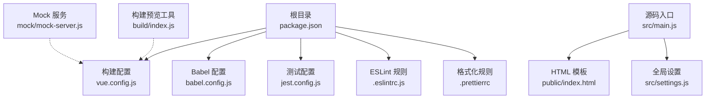
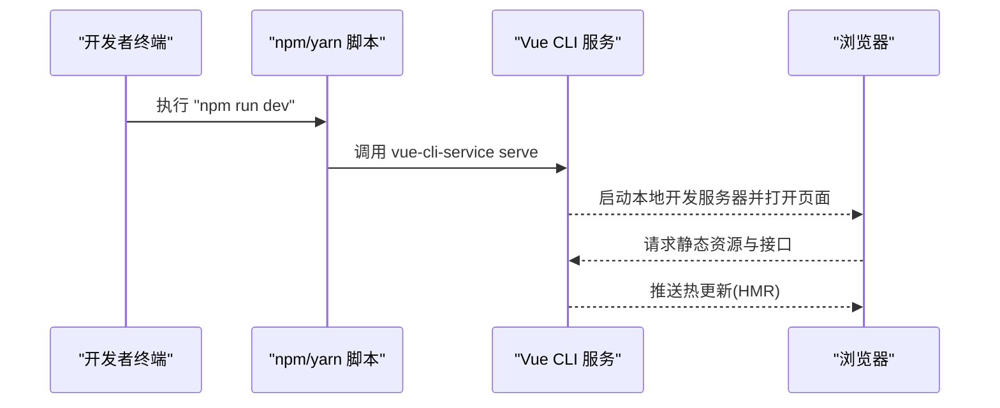
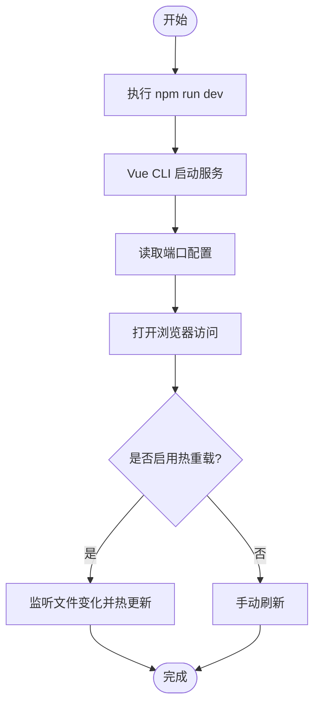
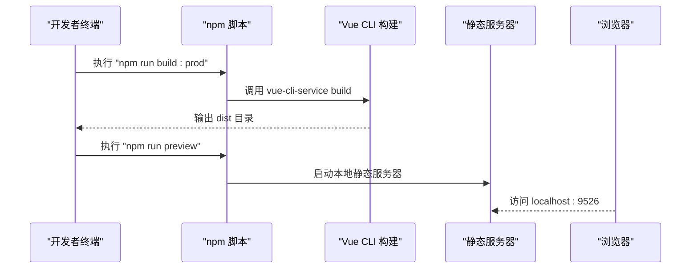
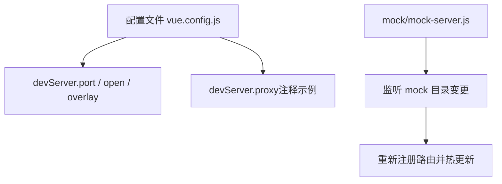
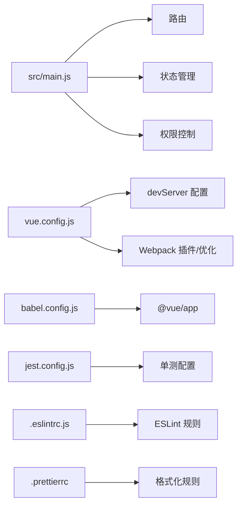

# 快速开始

<cite>
**本文引用的文件**
- [package.json](file://package.json)
- [README.md](file://README.md)
- [vue.config.js](file://vue.config.js)
- [babel.config.js](file://babel.config.js)
- [jest.config.js](file://jest.config.js)
- [.eslintrc.js](file://.eslintrc.js)
- [.prettierrc](file://.prettierrc)
- [src/main.js](file://src/main.js)
- [public/index.html](file://public/index.html)
- [src/settings.js](file://src/settings.js)
- [mock/mock-server.js](file://mock/mock-server.js)
- [build/index.js](file://build/index.js)
</cite>

## 目录
1. [简介](#简介)
2. [项目结构](#项目结构)
3. [核心组件](#核心组件)
4. [架构总览](#架构总览)
5. [详细组件解析](#详细组件解析)
6. [依赖关系分析](#依赖关系分析)
7. [性能与优化建议](#性能与优化建议)
8. [故障排查指南](#故障排查指南)
9. [结论](#结论)
10. [附录](#附录)

## 简介
本指南面向首次接触 Leisu Admin 的开发者，提供从环境准备到首次成功运行的完整流程，覆盖以下内容：
- 环境准备：Node.js 版本要求、npm/yarn 使用建议
- 项目克隆与依赖安装
- 开发环境启动与常用脚本说明
- 开发服务器配置（端口、代理、热重载等）
- 常见问题与解决方案（端口冲突、依赖安装失败等）
- 首次运行验证步骤
- 代码规范检查、单元测试与覆盖率统计
- 不同操作系统下的环境配置要点

## 项目结构
Leisu Admin 基于 Vue 2.x + Element UI 技术栈，采用 vue-cli 3.x 构建，核心目录与职责概览：
- 根目录
  - package.json：定义脚本命令、依赖与引擎版本
  - vue.config.js：开发服务器、打包优化、别名等配置
  - babel.config.js：Babel 预设
  - jest.config.js：单元测试配置
  - .eslintrc.js：ESLint 规则
  - .prettierrc：代码格式化规则
- 源码目录 src
  - main.js：应用入口，注册全局组件、过滤器、指令与插件
  - settings.js：应用标题、标签页、固定头部等全局设置
  - public/index.html：HTML 模板
- mock：本地 Mock 服务与路由
- build：构建产物预览工具

**图表来源**
- [package.json](file://package.json)
- [vue.config.js](file://vue.config.js)
- [babel.config.js](file://babel.config.js)
- [jest.config.js](file://jest.config.js)
- [.eslintrc.js](file://.eslintrc.js)
- [.prettierrc](file://.prettierrc)
- [src/main.js](file://src/main.js)
- [public/index.html](file://public/index.html)
- [src/settings.js](file://src/settings.js)
- [mock/mock-server.js](file://mock/mock-server.js)
- [build/index.js](file://build/index.js)

**章节来源**
- [package.json](file://package.json)
- [vue.config.js](file://vue.config.js)
- [babel.config.js](file://babel.config.js)
- [jest.config.js](file://jest.config.js)
- [.eslintrc.js](file://.eslintrc.js)
- [.prettierrc](file://.prettierrc)
- [src/main.js](file://src/main.js)
- [public/index.html](file://public/index.html)
- [src/settings.js](file://src/settings.js)
- [mock/mock-server.js](file://mock/mock-server.js)
- [build/index.js](file://build/index.js)

## 核心组件
- 应用入口与全局初始化
  - 注册全局组件、过滤器、指令与第三方库（Element UI、Viewer、Clipboard 等）
  - 设置全局方法（如窗口打开、CDN 前缀处理、时间格式化等）
  - 初始化权限控制与错误日志
- 开发服务器与构建配置
  - 端口、热重载、Overlay 错误显示、SVG Sprite、SplitChunks、Runtime Chunk 等
- 测试与规范
  - Jest 单测、ESLint 规则、Prettier 格式化

**章节来源**
- [src/main.js](file://src/main.js)
- [vue.config.js](file://vue.config.js)
- [jest.config.js](file://jest.config.js)
- [.eslintrc.js](file://.eslintrc.js)
- [.prettierrc](file://.prettierrc)

## 架构总览
下图展示从命令行到浏览器的关键交互链路，涵盖开发服务器启动、资源加载与构建预览。

**图表来源**
- [package.json](file://package.json)
- [vue.config.js](file://vue.config.js)

## 详细组件解析

### 环境准备与安装
- Node.js 与 npm 版本要求
  - engines 字段要求 Node >= 8.9，npm >= 3.0
- 包管理器选择
  - 推荐使用 npm；若网络较慢，可参考 README 中的镜像源方式安装
- 克隆与安装
  - 克隆仓库后执行依赖安装命令
- 代理与镜像（可选）
  - 可通过 npm registry 或其他镜像源加速安装

**章节来源**
- [package.json](file://package.json)
- [README.md](file://README.md)

### 开发环境启动
- 启动命令
  - npm run dev：启动开发服务器，默认模式 development
  - npm run local：启动开发服务器，模式 localhost
  - npm run prod：启动开发服务器，模式 production
- 端口与访问
  - 默认端口由配置决定，可通过环境变量或命令行参数指定
  - README 提供了访问地址示例
- 热重载与错误提示
  - devServer 配置开启热重载与错误覆盖显示

**图表来源**
- [package.json](file://package.json)
- [vue.config.js](file://vue.config.js)
- [README.md](file://README.md)

**章节来源**
- [package.json](file://package.json)
- [vue.config.js](file://vue.config.js)
- [README.md](file://README.md)

### 生产构建与预览
- 构建命令
  - npm run build:prod：生产环境构建
  - npm run build:dev：测试环境构建
  - npm run build:localhost：本地环境构建
- 构建产物预览
  - npm run preview：在本地启动静态服务器预览 dist 目录
  - build/index.js 实现了构建后静态服务器的启动逻辑

**图表来源**
- [package.json](file://package.json)
- [build/index.js](file://build/index.js)
- [vue.config.js](file://vue.config.js)

**章节来源**
- [package.json](file://package.json)
- [build/index.js](file://build/index.js)
- [vue.config.js](file://vue.config.js)

### 开发服务器配置
- 端口设置
  - 支持通过环境变量或命令行参数传入端口
- 代理配置
  - devServer.proxy 为注释状态，如需代理后端接口，请参考注释中的示例进行配置
- 热重载与自动打开
  - devServer.disableHostCheck、open、overlay 等选项已配置
- Mock 服务
  - mock/mock-server.js 提供热重载的本地 Mock 服务，监听 mock 目录变更并自动重新注册路由

**图表来源**
- [vue.config.js](file://vue.config.js)
- [mock/mock-server.js](file://mock/mock-server.js)

**章节来源**
- [vue.config.js](file://vue.config.js)
- [mock/mock-server.js](file://mock/mock-server.js)

### 常用 npm 脚本说明
- 本地开发
  - npm run local：本地模式开发
  - npm run dev：开发模式开发
  - npm run prod：生产模式开发
- 生产构建
  - npm run build:dev：测试环境构建
  - npm run build:prod：生产环境构建
  - npm run build:localhost：本地环境构建
- 预览
  - npm run preview：本地预览构建产物
- 代码规范与测试
  - npm run lint：ESLint 检查
  - npm run test:unit：Jest 单元测试
  - npm run test:ci：先 ESLint 再 Jest
- 其他
  - npm run svgo：SVG 优化
  - npm run new：生成新组件/视图（plop）

**章节来源**
- [package.json](file://package.json)
- [jest.config.js](file://jest.config.js)
- [.eslintrc.js](file://.eslintrc.js)

### 代码规范检查与单元测试
- 代码规范
  - ESLint 规则位于 .eslintrc.js，覆盖 Vue 推荐规则与自定义规则
  - Prettier 规则位于 .prettierrc，统一缩进、引号、尾逗号等风格
- 单元测试
  - Jest 配置位于 jest.config.js，支持 .vue/.js 文件转换、模块映射、覆盖率输出
  - 测试目录 tests/unit，可直接运行 npm run test:unit

**章节来源**
- [.eslintrc.js](file://.eslintrc.js)
- [.prettierrc](file://.prettierrc)
- [jest.config.js](file://jest.config.js)

### 首次运行验证步骤
- 安装依赖后执行 npm run dev
- 浏览器访问 README 中提供的示例地址
- 若端口被占用，可在命令行传入端口参数或调整配置
- 如需 Mock 数据，确保 mock 目录存在且 mock-server.js 正常注册

**章节来源**
- [README.md](file://README.md)
- [vue.config.js](file://vue.config.js)
- [mock/mock-server.js](file://mock/mock-server.js)

## 依赖关系分析
- 应用层
  - src/main.js 作为入口，引入路由、状态管理、权限控制与全局样式
- 构建层
  - vue.config.js 控制 devServer、别名、SVG Sprite、SplitChunks、Runtime Chunk 等
  - babel.config.js 使用 @vue/app 预设
  - jest.config.js 配置测试环境与覆盖率
- 工具层
  - package.json 定义脚本与引擎版本
  - .eslintrc.js 与 .prettierrc 统一代码质量与风格

**图表来源**
- [src/main.js](file://src/main.js)
- [vue.config.js](file://vue.config.js)
- [babel.config.js](file://babel.config.js)
- [jest.config.js](file://jest.config.js)
- [.eslintrc.js](file://.eslintrc.js)
- [.prettierrc](file://.prettierrc)

**章节来源**
- [src/main.js](file://src/main.js)
- [vue.config.js](file://vue.config.js)
- [babel.config.js](file://babel.config.js)
- [jest.config.js](file://jest.config.js)
- [.eslintrc.js](file://.eslintrc.js)
- [.prettierrc](file://.prettierrc)

## 性能与优化建议
- 开发阶段
  - devServer.overlay 仅显示错误，避免警告干扰
  - 关闭生产 Source Map 以减少体积
- 构建阶段
  - SplitChunks 将第三方库、Element UI、公共组件拆分为独立 chunk
  - Runtime Chunk 单独提取，提升缓存命中率
- 资源优化
  - SVG Sprite 减少图标请求次数
  - 避免不必要的 preload/prefetch 插件

**章节来源**
- [vue.config.js](file://vue.config.js)

## 故障排查指南
- 端口冲突
  - 通过环境变量或命令行参数指定端口，例如：--port 9527
  - 确认系统中无其他进程占用该端口
- 依赖安装失败
  - 使用推荐的包管理器，避免 cnpm 导致的潜在问题
  - 可尝试使用镜像源安装（参考 README 中的镜像源方式）
- 热重载无效
  - 检查 devServer 配置是否启用 open 与 overlay
  - 确认浏览器未禁用自动刷新
- Mock 服务不生效
  - 确认 mock 目录存在且 mock-server.js 已注册
  - 修改 mock 文件后应自动热更新，若未生效，重启开发服务器

**章节来源**
- [vue.config.js](file://vue.config.js)
- [mock/mock-server.js](file://mock/mock-server.js)
- [README.md](file://README.md)

## 结论
通过本快速开始指南，您已完成环境准备、项目安装与开发服务器启动，并掌握了常用脚本、开发服务器配置、Mock 服务与构建预览等关键能力。建议在开发过程中配合 ESLint、Prettier 与 Jest，持续保证代码质量与可维护性。

## 附录

### 常用命令一览
- 启动开发：npm run dev
- 本地模式：npm run local
- 生产模式：npm run prod
- 构建测试：npm run build:dev
- 构建生产：npm run build:prod
- 构建本地：npm run build:localhost
- 预览构建：npm run preview
- 代码检查：npm run lint
- 单元测试：npm run test:unit
- CI 流水线：npm run test:ci
- SVG 优化：npm run svgo
- 生成模板：npm run new

**章节来源**
- [package.json](file://package.json)