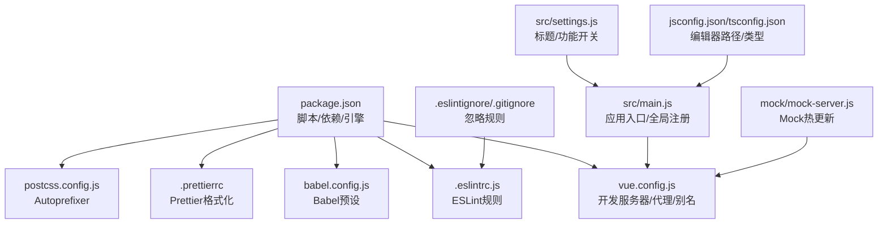
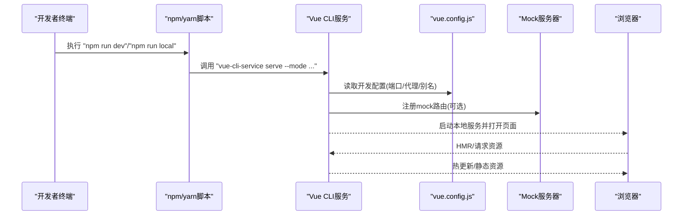
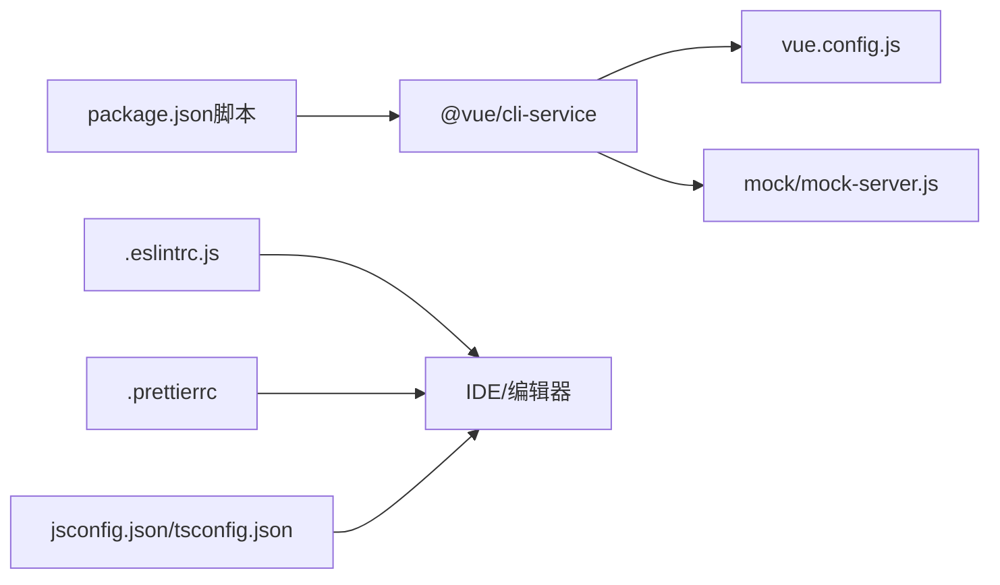

# 开发环境问题

<cite>
**本文引用的文件**
- [package.json](file://package.json)
- [vue.config.js](file://vue.config.js)
- [.eslintrc.js](file://.eslintrc.js)
- [babel.config.js](file://babel.config.js)
- [.prettierrc](file://.prettierrc)
- [postcss.config.js](file://postcss.config.js)
- [src/settings.js](file://src/settings.js)
- [src/main.js](file://src/main.js)
- [jsconfig.json](file://jsconfig.json)
- [tsconfig.json](file://tsconfig.json)
- [.eslintignore](file://.eslintignore)
- [.gitignore](file://.gitignore)
- [mock/mock-server.js](file://mock/mock-server.js)
</cite>

## 目录
1. [简介](#简介)
2. [项目结构](#项目结构)
3. [核心组件](#核心组件)
4. [架构总览](#架构总览)
5. [详细组件分析](#详细组件分析)
6. [依赖关系分析](#依赖关系分析)
7. [性能考虑](#性能考虑)
8. [故障排除指南](#故障排除指南)
9. [结论](#结论)
10. [附录](#附录)

## 简介
本文件面向Leisu Admin项目的开发者，聚焦于开发环境常见问题的系统化排查与修复。内容涵盖：
- Node.js版本兼容性与依赖安装/构建问题
- npm/yarn安装依赖时的网络、权限、版本冲突等
- Vue CLI开发服务器启动失败（端口占用、配置错误、热重载失效等）
- ESLint代码检查报错（规则配置、忽略文件、自动修复）
- 开发环境变量配置（.env读取、环境切换、代理配置）
- IDE配置（VS Code/WebStorm插件与调试）

## 项目结构
该工程采用Vue CLI 3.x脚手架，核心配置集中在根目录与src目录：
- 根配置：package.json（脚本、依赖、引擎）、vue.config.js（开发服务器、打包优化）、.eslintrc.js（代码规范）、babel.config.js（转译）、.prettierrc（格式化）、postcss.config.js（样式后处理器）
- 源码：src（入口main.js、全局设置settings.js、路由/状态/工具等）
- 其他：jsconfig.json/tsconfig.json（编辑器类型支持），.eslintignore/.gitignore（忽略规则），mock/mock-server.js（本地Mock热更新）

图表来源
- [package.json:1-139](file://package.json#L1-L139)
- [vue.config.js:1-155](file://vue.config.js#L1-L155)
- [src/main.js:1-526](file://src/main.js#L1-L526)
- [src/settings.js:1-36](file://src/settings.js#L1-L36)
- [jsconfig.json:1-9](file://jsconfig.json#L1-L9)
- [tsconfig.json:1-67](file://tsconfig.json#L1-L67)
- [.eslintrc.js:1-268](file://.eslintrc.js#L1-L268)
- [.eslintignore:1-5](file://.eslintignore#L1-L5)
- [.gitignore:1-32](file://.gitignore#L1-L32)
- [mock/mock-server.js:1-69](file://mock/mock-server.js#L1-L69)

章节来源
- [package.json:1-139](file://package.json#L1-L139)
- [vue.config.js:1-155](file://vue.config.js#L1-L155)
- [src/main.js:1-526](file://src/main.js#L1-L526)
- [src/settings.js:1-36](file://src/settings.js#L1-L36)
- [jsconfig.json:1-9](file://jsconfig.json#L1-L9)
- [tsconfig.json:1-67](file://tsconfig.json#L1-L67)
- [.eslintrc.js:1-268](file://.eslintrc.js#L1-L268)
- [.eslintignore:1-5](file://.eslintignore#L1-L5)
- [.gitignore:1-32](file://.gitignore#L1-L32)
- [mock/mock-server.js:1-69](file://mock/mock-server.js#L1-L69)

## 核心组件
- 脚本与引擎
  - scripts定义了本地、开发、生产模式的启动与构建命令；engines声明了最低Node与npm版本要求
- 开发服务器配置
  - 端口、代理、热重载覆盖、别名、externals等
- ESLint规则
  - 基于eslint-plugin-vue与eslint:recommended，自定义多项规则
- Babel与Prettier
  - Babel预设与Prettier格式化风格
- Mock热更新
  - chokidar监听mock目录变化并热替换路由

章节来源
- [package.json:7-20](file://package.json#L7-L20)
- [package.json:130-138](file://package.json#L130-L138)
- [vue.config.js:11-59](file://vue.config.js#L11-L59)
- [.eslintrc.js:12-266](file://.eslintrc.js#L12-L266)
- [babel.config.js:1-6](file://babel.config.js#L1-L6)
- [.prettierrc:1-13](file://.prettierrc#L1-L13)
- [mock/mock-server.js:45-67](file://mock/mock-server.js#L45-L67)

## 架构总览
下图展示开发期从命令到浏览器的关键流程：脚本触发CLI服务，读取配置与环境变量，启动devServer，加载Mock与页面资源。

图表来源
- [package.json:7-13](file://package.json#L7-L13)
- [vue.config.js:18-76](file://vue.config.js#L18-L76)
- [mock/mock-server.js:30-67](file://mock/mock-server.js#L30-L67)

## 详细组件分析

### Node.js版本兼容性与依赖安装/构建问题
- 版本要求
  - engines限制Node >= 8.9、npm >= 3.0
- 常见问题
  - Node版本过低导致依赖编译失败（如二进制扩展、某些C++模块）
  - npm/yarn版本差异引发锁文件或解析不一致
  - 依赖版本冲突（peer依赖、嵌套依赖）
- 排查步骤
  - 使用nvm/ndenv固定Node版本至16.x或更高以提升兼容性
  - 清理缓存与重装：删除node_modules与锁文件后重新安装
  - 使用yarn时避免与npm混用，保持一致性
  - 若构建失败，尝试禁用部分可选依赖或降级到稳定版本
- 参考配置
  - 引擎声明与脚本定义

章节来源
- [package.json:130-138](file://package.json#L130-L138)
- [package.json:7-20](file://package.json#L7-L20)

### npm/yarn安装依赖问题
- 网络超时/权限问题
  - 使用国内镜像源（如cnpm/ty/npm）或配置代理
  - 权限不足时避免使用sudo，改用nvm管理用户权限
- 版本冲突
  - 使用yarn resolutions或锁定版本
  - 避免混用npm/yarn，必要时清理缓存与lock文件
- 与构建相关
  - 若@vue/cli-service或babel相关包安装失败，优先升级Node再重试
- 参考配置
  - 依赖与devDependencies清单

章节来源
- [package.json:37-129](file://package.json#L37-L129)

### Vue CLI开发服务器启动失败
- 端口占用
  - 默认端口可通过环境变量或命令行参数覆盖
- 配置错误
  - publicPath未设置导致资源路径异常
  - 代理未启用但需联调后端接口
- 热重载失效
  - 关闭Host校验、确保overlay仅显示错误
  - 检查Mock热更新是否影响HMR
- 参考配置
  - 端口、publicPath、devServer、externals与别名

章节来源
- [vue.config.js:11-59](file://vue.config.js#L11-L59)
- [vue.config.js:26-76](file://vue.config.js#L26-L76)
- [mock/mock-server.js:45-67](file://mock/mock-server.js#L45-L67)

### ESLint代码检查报错
- 规则配置
  - 基于eslint-plugin-vue与eslint:recommended，自定义属性数、换行、缩进、分号等规则
- 忽略文件
  - .eslintignore中已忽略build、src/assets、public、dist与通配文件
- 自动修复
  - 可通过脚本运行ESLint并结合Prettier统一格式
- 参考配置
  - 规则集与忽略规则

章节来源
- [.eslintrc.js:12-266](file://.eslintrc.js#L12-L266)
- [.eslintignore:1-5](file://.eslintignore#L1-L5)

### 开发环境变量配置
- .env读取
  - 项目未内置dotenv，需自行引入或使用Vite/CLI提供的机制
- 环境切换
  - 通过脚本传入--mode（localhost/development/production）
- 代理配置
  - devServer.proxy预留注释，可按需启用
- 参考配置
  - 脚本模式与devServer配置

章节来源
- [package.json:7-13](file://package.json#L7-L13)
- [vue.config.js:18-59](file://vue.config.js#L18-L59)

### IDE配置
- VS Code
  - 安装ESLint、Prettier、Vetur/Volar、EditorConfig等插件
  - 配置工作区settings.json启用保存时格式化与ESLint修复
- WebStorm/IDEA
  - 启用ESLint与Prettier集成，设置默认格式化快捷键
- 路径别名与类型支持
  - jsconfig.json配置@指向src；tsconfig.json开启严格模式与CommonJS互操作

章节来源
- [jsconfig.json:1-9](file://jsconfig.json#L1-L9)
- [tsconfig.json:1-67](file://tsconfig.json#L1-L67)
- [.prettierrc:1-13](file://.prettierrc#L1-L13)
- [.eslintrc.js:12-266](file://.eslintrc.js#L12-L266)

## 依赖关系分析
- 脚本与CLI
  - npm/yarn脚本调用@vue/cli-service，后者读取vue.config.js
- ESLint与格式化
  - ESLint规则由.eslintrc.js定义；Prettier由.prettierrc定义
- Mock与开发服务器
  - mock/mock-server.js在devServer启动后注册路由，支持热更新
- 编辑器与类型
  - jsconfig.json/tsconfig.json为IDE提供路径与类型支持

图表来源
- [package.json:7-20](file://package.json#L7-L20)
- [vue.config.js:18-76](file://vue.config.js#L18-L76)
- [mock/mock-server.js:30-67](file://mock/mock-server.js#L30-L67)
- [.eslintrc.js:12-266](file://.eslintrc.js#L12-L266)
- [.prettierrc:1-13](file://.prettierrc#L1-L13)
- [jsconfig.json:1-9](file://jsconfig.json#L1-L9)
- [tsconfig.json:1-67](file://tsconfig.json#L1-L67)

章节来源
- [package.json:7-20](file://package.json#L7-L20)
- [vue.config.js:18-76](file://vue.config.js#L18-L76)
- [mock/mock-server.js:30-67](file://mock/mock-server.js#L30-L67)
- [.eslintrc.js:12-266](file://.eslintrc.js#L12-L266)
- [.prettierrc:1-13](file://.prettierrc#L1-L13)
- [jsconfig.json:1-9](file://jsconfig.json#L1-L9)
- [tsconfig.json:1-67](file://tsconfig.json#L1-L67)

## 性能考虑
- 开发阶段
  - cheap-source-map提升调试体验
  - 删除preload/prefetch插件减少初始开销
- 生产阶段
  - 分包策略（libs/elementUI/commons）与runtimeChunk抽取
  - ScriptExtHtmlWebpackPlugin内联runtime脚本
- 样式与资源
  - Autoprefixer与svg-sprite-loader优化样式与图标体积

章节来源
- [vue.config.js:77-153](file://vue.config.js#L77-L153)
- [postcss.config.js:1-6](file://postcss.config.js#L1-L6)

## 故障排除指南

### Node.js版本与依赖安装
- 症状
  - 安装阶段报错、构建失败、运行时报模块缺失
- 处理
  - 固定Node版本至16.x以上，清理缓存后重装
  - 使用yarn并锁定版本，避免混用npm/yarn
  - 如遇二进制依赖失败，尝试更换镜像源或使用预编译包

章节来源
- [package.json:130-138](file://package.json#L130-L138)
- [package.json:7-20](file://package.json#L7-L20)

### npm/yarn安装常见问题
- 症状
  - 网络超时、权限不足、版本冲突
- 处理
  - 配置镜像源或代理；避免sudo；统一使用yarn
  - 清理node_modules与锁文件后重装；必要时使用resolutions

章节来源
- [package.json:37-129](file://package.json#L37-L129)

### Vue CLI开发服务器启动失败
- 症状
  - 端口被占用、页面空白、热重载不生效
- 处理
  - 通过环境变量或命令行参数更换端口
  - 检查publicPath与别名配置；按需启用代理
  - 关闭Host校验、仅显示错误覆盖层；排查Mock热更新是否冲突

章节来源
- [vue.config.js:11-59](file://vue.config.js#L11-L59)
- [vue.config.js:26-76](file://vue.config.js#L26-L76)
- [mock/mock-server.js:45-67](file://mock/mock-server.js#L45-L67)

### ESLint报错
- 症状
  - 属性过多、换行/缩进、分号、命名等规则告警
- 处理
  - 使用脚本执行ESLint并结合Prettier自动修复
  - 按需调整.eslintrc.js中的规则；合理利用.ignore文件

章节来源
- [.eslintrc.js:12-266](file://.eslintrc.js#L12-L266)
- [.eslintignore:1-5](file://.eslintignore#L1-L5)

### 环境变量与代理
- 症状
  - 请求地址错误、跨域、资源路径异常
- 处理
  - 通过脚本选择正确模式；设置VUE_APP_*变量
  - 按需启用devServer.proxy；确保publicPath与部署路径一致

章节来源
- [package.json:7-13](file://package.json#L7-L13)
- [vue.config.js:18-59](file://vue.config.js#L18-L59)

### IDE配置问题
- 症状
  - 路径补全异常、格式化不一致、ESLint不生效
- 处理
  - VS Code：安装ESLint/Prettier/Vetur/EditorConfig插件，启用保存时修复
  - WebStorm：启用ESLint与Prettier，设置默认格式化快捷键
  - 确保jsconfig.json/tsconfig.json生效

章节来源
- [jsconfig.json:1-9](file://jsconfig.json#L1-L9)
- [tsconfig.json:1-67](file://tsconfig.json#L1-L67)
- [.prettierrc:1-13](file://.prettierrc#L1-L13)
- [.eslintrc.js:12-266](file://.eslintrc.js#L12-L266)

## 结论
本指南围绕Leisu Admin的开发环境关键配置与常见问题提供了系统化的排查思路与修复策略。建议在团队内统一Node版本、包管理器与IDE插件，规范ESLint与Prettier配置，确保开发与构建的一致性与稳定性。

## 附录

### 常用命令与配置要点
- 启动开发服务器
  - npm run dev / npm run local / npm run prod
- 构建
  - npm run build:dev / npm run build:prod / npm run build:localhost
- 代码检查
  - npm run lint
- Mock热更新
  - 修改mock目录文件后自动重载

章节来源
- [package.json:7-20](file://package.json#L7-L20)
- [mock/mock-server.js:45-67](file://mock/mock-server.js#L45-L67)