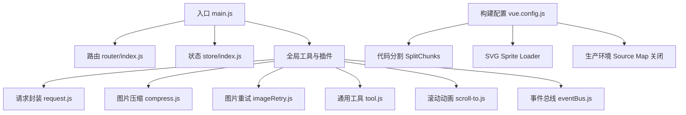
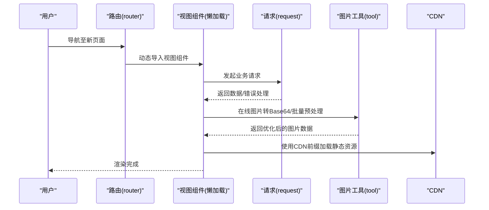
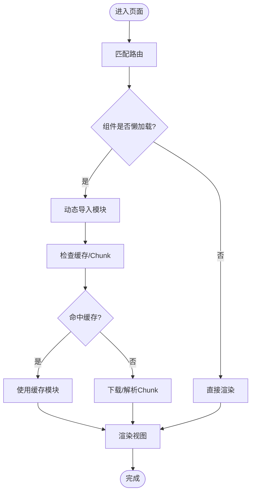
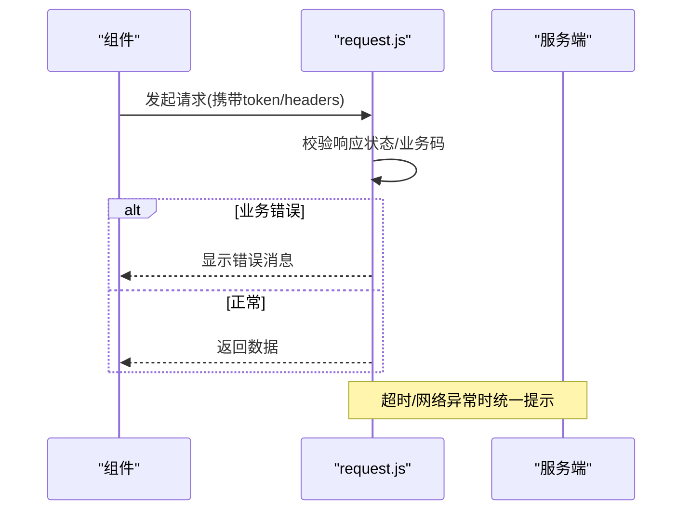
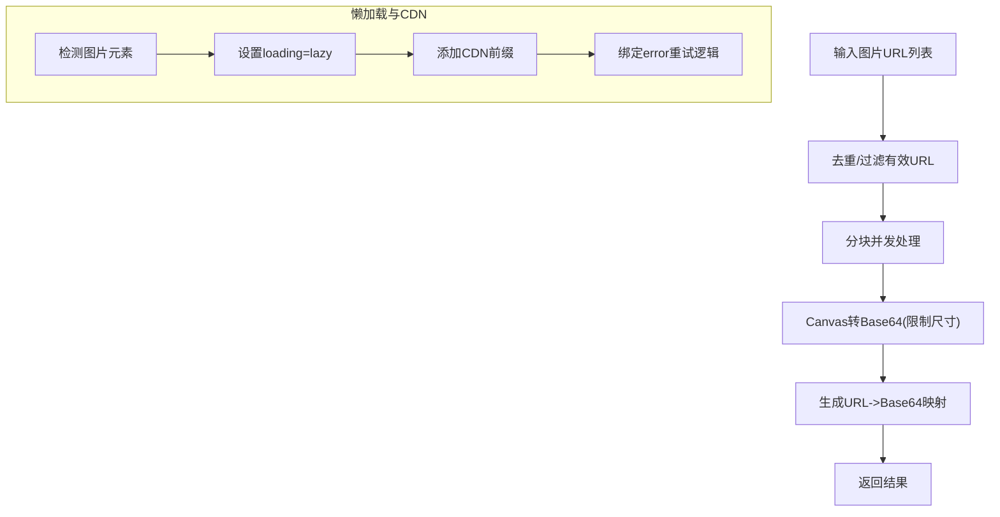
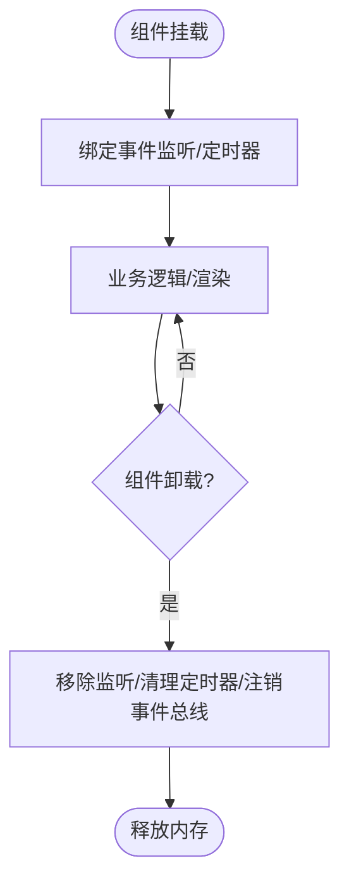
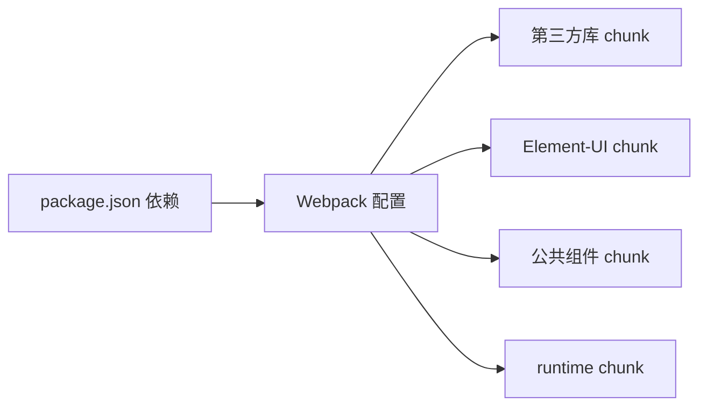

# 性能优化问题

<cite>
**本文档引用的文件**
- [package.json](file://package.json)
- [vue.config.js](file://vue.config.js)
- [src/main.js](file://src/main.js)
- [src/router/index.js](file://src/router/index.js)
- [src/store/index.js](file://src/store/index.js)
- [src/utils/compress.js](file://src/utils/compress.js)
- [src/utils/request.js](file://src/utils/request.js)
- [src/utils/imageRetry.js](file://src/utils/imageRetry.js)
- [src/layout/mixin/ResizeHandler.js](file://src/layout/mixin/ResizeHandler.js)
- [src/components/Charts/mixins/resize.js](file://src/components/Charts/mixins/resize.js)
- [src/utils/tool.js](file://src/utils/tool.js)
- [src/utils/deepClone.js](file://src/utils/deepClone.js)
- [src/utils/scroll-to.js](file://src/utils/scroll-to.js)
- [src/utils/eventBus.js](file://src/utils/eventBus.js)
</cite>

## 目录
1. [简介](#简介)
2. [项目结构](#项目结构)
3. [核心组件](#核心组件)
4. [架构总览](#架构总览)
5. [详细组件分析](#详细组件分析)
6. [依赖关系分析](#依赖关系分析)
7. [性能考量](#性能考量)
8. [故障排除指南](#故障排除指南)
9. [结论](#结论)
10. [附录](#附录)

## 简介
本文件面向 Leisu Admin 项目的性能优化与故障排除，聚焦以下关键问题：
- 页面加载缓慢：首屏加载时间过长、资源文件过大、HTTP 请求过多
- 内存泄漏识别与规避：Vue 组件销毁、事件监听器清理、定时器管理
- 渲染性能瓶颈：大数据量表格渲染、复杂图表绘制、频繁 DOM 操作
- 路由懒加载与组件异步加载：代码分割、预加载策略、缓存机制
- 图片与静态资源优化：压缩、懒加载、CDN、缓存策略
- 浏览器性能分析工具：Chrome DevTools Performance/Memory/Lighthouse 的实战应用

## 项目结构
Leisu Admin 基于 Vue 2 + Vue-Router + Vuex + Element-UI 技术栈，采用 Vue CLI 3.x 构建，具备完善的打包与开发配置。项目通过路由懒加载与 Webpack SplitChunks 实现代码分割，结合 CDN 前缀与图片懒加载策略，旨在降低首屏负载与提升交互流畅度。

**图示来源**
- [src/main.js:1-526](file://src/main.js#L1-L526)
- [src/router/index.js:1-177](file://src/router/index.js#L1-L177)
- [src/store/index.js:1-26](file://src/store/index.js#L1-L26)
- [vue.config.js:1-155](file://vue.config.js#L1-L155)

**章节来源**
- [src/main.js:1-526](file://src/main.js#L1-L526)
- [vue.config.js:1-155](file://vue.config.js#L1-L155)

## 核心组件
- 构建与打包配置：通过 SplitChunks 将第三方库、Element-UI、公共组件拆分为独立 chunk，减少重复依赖，提升缓存命中率。
- 路由懒加载：路由级动态导入视图组件，配合运行时 runtimeChunk，降低首屏 JS 体积。
- 请求拦截与错误处理：统一设置超时、错误提示与 Token 注入，避免重复请求与无意义重试。
- 图片处理：提供在线图片转 Base64、批量预处理、Canvas 压缩与懒加载策略，兼顾清晰度与体积。
- 事件总线与滚动动画：轻量事件总线与平滑滚动，避免全局副作用与过度重绘。

**章节来源**
- [vue.config.js:115-152](file://vue.config.js#L115-L152)
- [src/router/index.js:31-160](file://src/router/index.js#L31-L160)
- [src/utils/request.js:1-130](file://src/utils/request.js#L1-L130)
- [src/utils/compress.js:1-73](file://src/utils/compress.js#L1-L73)
- [src/utils/tool.js:235-319](file://src/utils/tool.js#L235-L319)
- [src/utils/eventBus.js:1-56](file://src/utils/eventBus.js#L1-L56)
- [src/utils/scroll-to.js:1-59](file://src/utils/scroll-to.js#L1-L59)

## 架构总览
下图展示前端性能相关的关键交互链路：路由懒加载、请求拦截、图片处理与渲染优化。

**图示来源**
- [src/router/index.js:31-160](file://src/router/index.js#L31-L160)
- [src/utils/request.js:1-130](file://src/utils/request.js#L1-L130)
- [src/utils/tool.js:235-319](file://src/utils/tool.js#L235-L319)
- [src/main.js:419-441](file://src/main.js#L419-L441)

## 详细组件分析

### 路由懒加载与代码分割
- 路由层：通过动态 import 实现视图组件懒加载，减少首屏 JS 体积。
- 构建层：SplitChunks 将 node_modules、Element-UI、公共组件拆分，runtimeChunk 单独提取，提升缓存复用。
- 预加载策略：当前禁用了 preload/prefetch 插件，建议在关键路由上按需启用 prefetch 或使用自定义预加载策略。

**图示来源**
- [src/router/index.js:31-160](file://src/router/index.js#L31-L160)
- [vue.config.js:127-151](file://vue.config.js#L127-L151)

**章节来源**
- [src/router/index.js:31-160](file://src/router/index.js#L31-L160)
- [vue.config.js:77-152](file://vue.config.js#L77-L152)

### 请求拦截与网络优化
- 超时与 Token：统一设置较长超时时间，自动注入 Token，减少重复鉴权开销。
- 错误分类与提示：对常见 HTTP 状态码进行分类提示，避免无意义的重试风暴。
- 环境区分：根据部署环境选择不同的基础地址，便于灰度与回滚。

**图示来源**
- [src/utils/request.js:22-127](file://src/utils/request.js#L22-L127)

**章节来源**
- [src/utils/request.js:1-130](file://src/utils/request.js#L1-L130)

### 图片与静态资源优化
- CDN 前缀：统一为图片资源添加 CDN 前缀，减少跨域与提升加载速度。
- 在线图片转 Base64：限制最大尺寸、Canvas 转换、防缓存策略，适合小图即时渲染。
- 批量预处理：支持并发控制，避免阻塞主线程。
- 图片重试：全局监听图片 error 事件，带指数退避与最大重试次数，提升弱网稳定性。
- 压缩与懒加载：提供压缩工具与懒加载策略，建议在大数据量场景中结合虚拟滚动。

**图示来源**
- [src/utils/tool.js:235-319](file://src/utils/tool.js#L235-L319)
- [src/utils/tool.js:327-367](file://src/utils/tool.js#L327-L367)
- [src/utils/imageRetry.js:1-56](file://src/utils/imageRetry.js#L1-L56)
- [src/main.js:419-441](file://src/main.js#L419-L441)

**章节来源**
- [src/utils/compress.js:1-73](file://src/utils/compress.js#L1-L73)
- [src/utils/imageRetry.js:1-56](file://src/utils/imageRetry.js#L1-L56)
- [src/utils/tool.js:235-319](file://src/utils/tool.js#L235-L319)
- [src/utils/tool.js:327-367](file://src/utils/tool.js#L327-L367)
- [src/main.js:419-441](file://src/main.js#L419-L441)

### 渲染性能与内存管理
- 图表自适应：图表混入使用防抖 resize 事件，避免频繁 resize 导致的重绘。
- 窗口尺寸监听：ResizeHandler 在组件销毁时移除监听，防止内存泄漏。
- 事件总线：轻量事件总线，注意在组件销毁时及时 $off，避免悬挂回调。
- 滚动动画：使用 requestAnimationFrame 平滑滚动，避免同步布局抖动。
- 深拷贝：提供通用深拷贝工具，避免共享引用导致的意外修改与内存滞留。

**图示来源**
- [src/components/Charts/mixins/resize.js:1-35](file://src/components/Charts/mixins/resize.js#L1-L35)
- [src/layout/mixin/ResizeHandler.js:1-46](file://src/layout/mixin/ResizeHandler.js#L1-L46)
- [src/utils/eventBus.js:1-56](file://src/utils/eventBus.js#L1-L56)
- [src/utils/scroll-to.js:1-59](file://src/utils/scroll-to.js#L1-L59)
- [src/utils/deepClone.js:1-29](file://src/utils/deepClone.js#L1-L29)

**章节来源**
- [src/components/Charts/mixins/resize.js:1-35](file://src/components/Charts/mixins/resize.js#L1-L35)
- [src/layout/mixin/ResizeHandler.js:1-46](file://src/layout/mixin/ResizeHandler.js#L1-L46)
- [src/utils/eventBus.js:1-56](file://src/utils/eventBus.js#L1-L56)
- [src/utils/scroll-to.js:1-59](file://src/utils/scroll-to.js#L1-L59)
- [src/utils/deepClone.js:1-29](file://src/utils/deepClone.js#L1-L29)

## 依赖关系分析
- 第三方库：Element-UI、Axios、ECharts、Lodash、MQTT 等，通过 SplitChunks 单独打包，减少重复依赖。
- 构建工具：Webpack ProvidePlugin 注入 jQuery，SVG Sprite Loader 优化图标体积。
- 生产环境：关闭 Source Map，减少产物体积与调试成本。

**图示来源**
- [package.json:37-96](file://package.json#L37-L96)
- [vue.config.js:127-151](file://vue.config.js#L127-L151)

**章节来源**
- [package.json:1-139](file://package.json#L1-L139)
- [vue.config.js:1-155](file://vue.config.js#L1-L155)

## 性能考量
- 首屏加载时间
  - 通过路由懒加载与 SplitChunks 降低首屏 JS 体积，结合 runtimeChunk 提升缓存命中。
  - 建议对关键路由启用 prefetch，对次要路由启用 lazy。
- 资源文件大小
  - 使用 SVG Sprite Loader 替代大量小图标，减少 HTTP 请求数。
  - 图片转 Base64 仅用于小图即时渲染，大图仍建议走 CDN。
- HTTP 请求数
  - 合理合并请求，避免重复请求；对可缓存接口设置合理缓存头。
  - 使用统一错误处理，避免无意义重试。
- 渲染性能
  - 图表与容器使用防抖 resize，窗口尺寸变化时减少重绘。
  - 大数据量表格建议结合虚拟滚动与分页。
- 内存管理
  - 组件销毁时移除事件监听与定时器，及时 $off 事件总线。
  - Canvas/图片资源使用后及时释放，避免内存泄漏。

[本节为通用指导，无需列出具体文件来源]

## 故障排除指南

### 页面加载缓慢
- 症状
  - 首屏加载时间过长、白屏时间长、资源体积大、HTTP 请求过多。
- 诊断步骤
  - 使用 Chrome DevTools Network 面板查看首屏关键请求与资源体积，定位超大资源与慢请求。
  - 使用 Lighthouse 生成性能报告，关注首屏时间、资源体积与请求数指标。
  - 检查路由懒加载是否生效，确认 SplitChunks 是否正确拆分 chunk。
- 优化建议
  - 对首屏关键路由启用 prefetch，对非关键路由保持懒加载。
  - 启用 Gzip/Brotli 压缩，合理设置缓存头。
  - 使用 CDN 加速静态资源，开启 HTTP/2 多路复用。
  - 合并与拆分 CSS/JS，避免单文件过大。

**章节来源**
- [vue.config.js:127-151](file://vue.config.js#L127-L151)
- [src/router/index.js:31-160](file://src/router/index.js#L31-L160)

### 内存泄漏
- 症状
  - 页面切换后内存持续增长、CPU 占用升高、卡顿。
- 诊断步骤
  - 使用 Chrome DevTools Memory 面板录制快照，对比前后内存差异，定位泄漏对象。
  - 检查组件生命周期：mounted 是否绑定事件/定时器，beforeDestroy 是否移除。
  - 检查事件总线：是否存在未注销的 $on/$off 不匹配。
- 优化建议
  - 在 beforeDestroy 中统一移除事件监听、清理定时器、注销事件总线。
  - 避免在全局对象上持有组件引用，及时释放闭包引用。
  - 对高频回调使用防抖/节流，减少重复计算。

**章节来源**
- [src/layout/mixin/ResizeHandler.js:14-19](file://src/layout/mixin/ResizeHandler.js#L14-L19)
- [src/components/Charts/mixins/resize.js:20-24](file://src/components/Charts/mixins/resize.js#L20-L24)
- [src/utils/eventBus.js:43-52](file://src/utils/eventBus.js#L43-L52)

### 渲染性能问题
- 症状
  - 大表格卡顿、图表绘制缓慢、频繁 DOM 操作导致掉帧。
- 诊断步骤
  - 使用 Chrome DevTools Performance 面板录制，观察主线程长任务与重排重绘。
  - 检查图表 resize 事件频率，确认是否使用防抖。
  - 检查窗口尺寸监听是否在隐藏状态下仍在触发。
- 优化建议
  - 图表使用防抖 resize，容器宽度变化后再触发重绘。
  - 大数据量表格使用虚拟滚动与分页，减少一次性渲染节点数量。
  - 避免在循环中进行复杂样式计算，尽量使用 transform 与 will-change。

**章节来源**
- [src/components/Charts/mixins/resize.js:9-15](file://src/components/Charts/mixins/resize.js#L9-L15)
- [src/layout/mixin/ResizeHandler.js:34-43](file://src/layout/mixin/ResizeHandler.js#L34-L43)

### 路由懒加载与组件异步加载
- 症状
  - 首屏 JS 过大、路由切换卡顿、缓存命中率低。
- 诊断步骤
  - 查看构建产物，确认第三方库、Element-UI、公共组件是否被拆分。
  - 检查路由是否使用动态 import，确认运行时 chunk 是否独立。
- 优化建议
  - 对非关键路由启用懒加载，关键路由启用预加载。
  - 合理设置 SplitChunks 的最小 chunks 与 reuseExistingChunk，避免重复打包。

**章节来源**
- [vue.config.js:127-151](file://vue.config.js#L127-L151)
- [src/router/index.js:31-160](file://src/router/index.js#L31-L160)

### 图片与静态资源优化
- 症状
  - 图片加载慢、白块/闪烁、弱网失败多。
- 诊断步骤
  - 使用 Network 面板查看图片请求与缓存命中情况。
  - 检查是否使用了 CDN 前缀与懒加载策略。
- 优化建议
  - 对小图使用 Base64，大图走 CDN 并开启懒加载。
  - 使用图片重试策略，设置最大重试次数与退避时间。
  - 对热点图片开启浏览器缓存与 CDN 缓存。

**章节来源**
- [src/utils/tool.js:235-319](file://src/utils/tool.js#L235-L319)
- [src/utils/tool.js:327-367](file://src/utils/tool.js#L327-L367)
- [src/utils/imageRetry.js:1-56](file://src/utils/imageRetry.js#L1-L56)
- [src/main.js:419-441](file://src/main.js#L419-L441)

### 浏览器性能分析工具使用
- Chrome DevTools Performance
  - 录制 CPU/网络/内存活动，定位长任务、阻塞渲染的脚本与样式。
- Chrome DevTools Memory
  - 快照对比，发现未释放的对象与闭包引用。
- Lighthouse
  - 生成性能、可访问性、SEO 等综合报告，指导优化方向。

[本节为通用指导，无需列出具体文件来源]

## 结论
通过路由懒加载、SplitChunks 代码分割、CDN 与图片优化、事件与内存管理等手段，Leisu Admin 可显著改善首屏加载与运行时性能。建议在生产环境中启用合理的缓存策略与预加载策略，并持续使用 DevTools 与 Lighthouse 进行回归测试，确保性能指标稳定。

[本节为总结性内容，无需列出具体文件来源]

## 附录
- 构建与运行命令参考
  - 开发：npm run dev
  - 本地：npm run local
  - 生产构建：npm run build:prod
  - 预览：npm run preview
- 关键配置要点
  - publicPath、outputDir、assetsDir、productionSourceMap
  - externals、ProvidePlugin、svg-sprite-loader
  - SplitChunks、runtimeChunk、preload/prefetch

**章节来源**
- [package.json:7-20](file://package.json#L7-L20)
- [vue.config.js:26-35](file://vue.config.js#L26-L35)
- [vue.config.js:60-76](file://vue.config.js#L60-L76)
- [vue.config.js:77-152](file://vue.config.js#L77-L152)