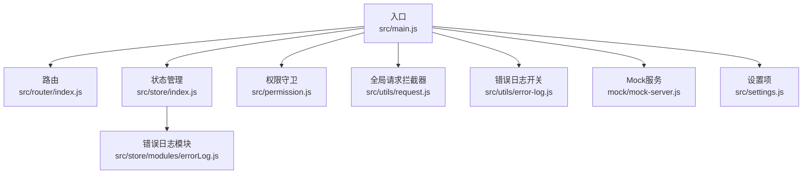
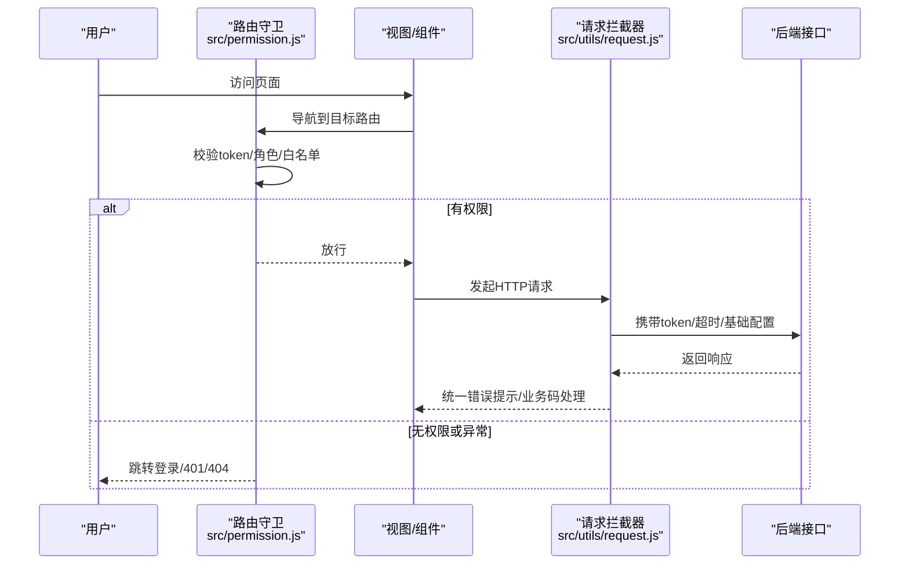
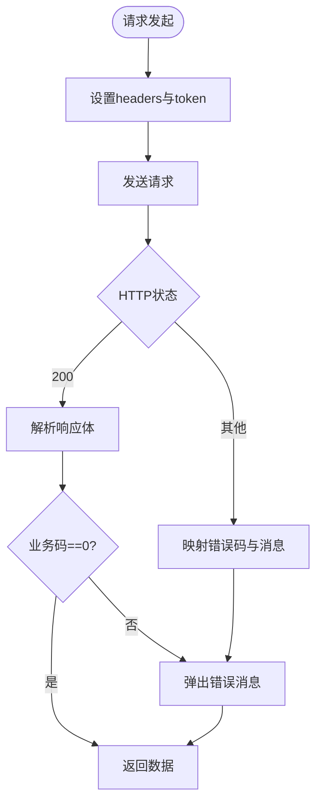
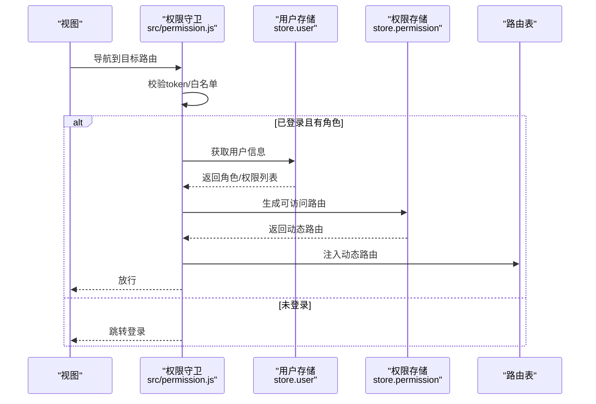
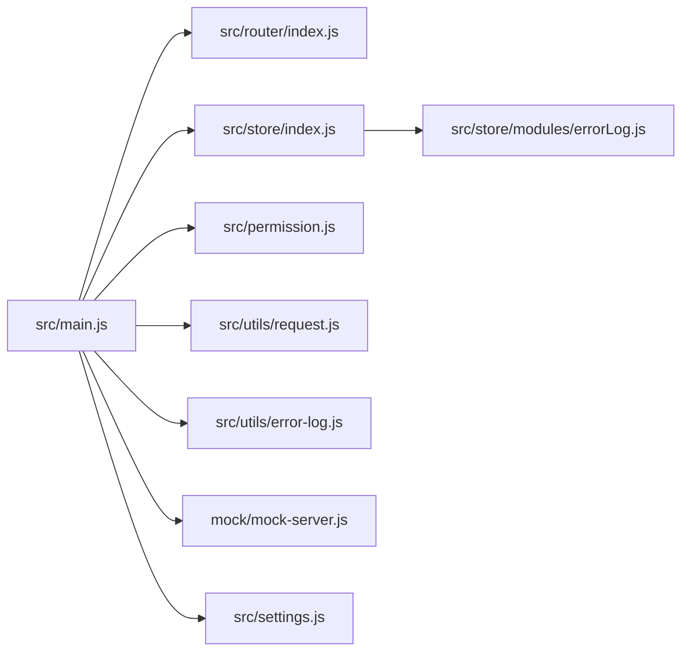

# 故障排除

<cite>
**本文引用的文件**   
- [package.json](file://package.json)
- [vue.config.js](file://vue.config.js)
- [src/main.js](file://src/main.js)
- [src/router/index.js](file://src/router/index.js)
- [src/store/index.js](file://src/store/index.js)
- [src/utils/request.js](file://src/utils/request.js)
- [src/utils/error-log.js](file://src/utils/error-log.js)
- [src/store/modules/errorLog.js](file://src/store/modules/errorLog.js)
- [src/components/ErrorLog/index.vue](file://src/components/ErrorLog/index.vue)
- [src/permission.js](file://src/permission.js)
- [src/settings.js](file://src/settings.js)
- [mock/mock-server.js](file://mock/mock-server.js)
- [src/api/misc.js](file://src/api/misc.js)
- [src/utils/permission.js](file://src/utils/permission.js)
</cite>

## 目录
1. [简介](#简介)
2. [项目结构](#项目结构)
3. [核心组件](#核心组件)
4. [架构总览](#架构总览)
5. [详细组件分析](#详细组件分析)
6. [依赖关系分析](#依赖关系分析)
7. [性能考虑](#性能考虑)
8. [故障排除指南](#故障排除指南)
9. [结论](#结论)
10. [附录](#附录)

## 简介
本文件面向Leisu Admin项目的开发者与运维人员，提供系统化的故障排除指南。内容覆盖环境配置、依赖安装、构建错误、性能瓶颈、网络请求、组件与路由问题、调试技巧、日志与错误监控、常见错误码说明以及生产环境应急处理流程。

## 项目结构
Leisu Admin基于Vue 2与Element UI，采用Vue CLI 3构建，使用Vuex集中状态管理、Vue Router进行路由控制，并通过Axios封装HTTP请求。开发与生产模式通过环境变量区分，支持Mock服务热更新与本地代理配置。

图表来源
- [src/main.js:1-526](file://src/main.js#L1-L526)
- [src/router/index.js:1-177](file://src/router/index.js#L1-L177)
- [src/store/index.js:1-26](file://src/store/index.js#L1-L26)
- [src/permission.js:1-82](file://src/permission.js#L1-L82)
- [src/utils/request.js:1-130](file://src/utils/request.js#L1-L130)
- [src/utils/error-log.js:1-36](file://src/utils/error-log.js#L1-L36)
- [src/store/modules/errorLog.js:1-29](file://src/store/modules/errorLog.js#L1-L29)
- [mock/mock-server.js:1-69](file://mock/mock-server.js#L1-L69)
- [src/settings.js:1-36](file://src/settings.js#L1-L36)

章节来源
- [package.json:1-139](file://package.json#L1-L139)
- [vue.config.js:1-155](file://vue.config.js#L1-L155)
- [src/main.js:1-526](file://src/main.js#L1-L526)

## 核心组件
- 入口与全局配置：初始化Vue实例、注册全局组件与过滤器、挂载权限、错误日志与压缩工具，设置生产环境日志抑制。
- 路由与权限：基于beforeEach守卫实现登录态校验、角色驱动的动态路由注入、白名单放行与进度条控制。
- 请求层：统一设置baseURL、携带token、超时控制、响应错误映射与消息提示。
- 错误日志：按环境开关捕获Vue错误并写入Vuex，提供可视化弹窗查看与清空。
- Mock服务：热更新注册/注销路由，便于联调与离线开发。

章节来源
- [src/main.js:1-526](file://src/main.js#L1-L526)
- [src/router/index.js:1-177](file://src/router/index.js#L1-L177)
- [src/permission.js:1-82](file://src/permission.js#L1-L82)
- [src/utils/request.js:1-130](file://src/utils/request.js#L1-L130)
- [src/utils/error-log.js:1-36](file://src/utils/error-log.js#L1-L36)
- [src/store/modules/errorLog.js:1-29](file://src/store/modules/errorLog.js#L1-L29)
- [mock/mock-server.js:1-69](file://mock/mock-server.js#L1-L69)

## 架构总览
下图展示从用户交互到后端接口的关键链路，以及错误与日志的回传路径。

图表来源
- [src/permission.js:13-76](file://src/permission.js#L13-L76)
- [src/utils/request.js:22-68](file://src/utils/request.js#L22-L68)

## 详细组件分析

### 环境与构建问题
- 端口占用与代理
  - 开发端口默认来自环境变量，可通过命令行参数覆盖；若端口被占用需提升权限或更换端口。
  - devServer中预留了代理配置注释与Mock服务钩子，可按需启用。
- 生产构建产物
  - 输出目录与静态资源目录、关闭SourceMap、分包策略与runtimeChunk配置影响体积与加载性能。
- Node与NPM版本
  - engines字段限制Node与NPM最低版本，低于要求会导致安装或运行失败。

章节来源
- [vue.config.js:11-59](file://vue.config.js#L11-L59)
- [vue.config.js:60-155](file://vue.config.js#L60-L155)
- [package.json:130-138](file://package.json#L130-L138)

### 依赖安装问题
- 版本冲突与安装失败
  - 使用较高版本Node/NPM时，部分老依赖可能出现兼容性问题；建议按engines要求准备环境。
  - 若安装缓慢，可配置镜像源或使用缓存加速。
- 运行时报错
  - 缺少必要环境变量（如VUE_APP_BASE_API）会导致请求层无法正确设置baseURL，表现为接口404或跨域。
  - 依赖缺失（如jQuery、Element UI）会引发组件初始化异常。

章节来源
- [package.json:37-96](file://package.json#L37-L96)
- [src/main.js:14-26](file://src/main.js#L14-L26)
- [src/utils/request.js:10-26](file://src/utils/request.js#L10-L26)

### 构建错误
- Webpack配置
  - 关闭preload/prefetch插件、SVG Sprite Loader、preserveWhitespace等会影响打包体积与首屏表现。
  - 分包策略与runtimeChunk在生产模式下开启，有助于缓存复用与加载性能。
- ESLint与测试
  - lint脚本与单元测试脚本可用于发现潜在问题；CI流程建议先lint再测试。

章节来源
- [vue.config.js:77-155](file://vue.config.js#L77-L155)
- [package.json:7-20](file://package.json#L7-L20)

### 性能相关问题
- 页面加载缓慢
  - 检查是否启用了分包与runtimeChunk；确认第三方库是否被正确抽离。
  - 关闭SourceMap可减少产物体积；合理拆分组件与按需加载。
- 内存泄漏
  - 确认组件销毁时移除了事件监听（如Viewer销毁回调）、定时器与订阅。
  - 避免在原型上挂载过多全局函数，防止作用域污染。
- 渲染性能
  - 大列表使用虚拟滚动组件；避免不必要的深度计算与watch。
  - 合理使用keep-alive与路由级缓存，减少重复渲染。

章节来源
- [src/main.js:120-137](file://src/main.js#L120-L137)
- [vue.config.js:127-151](file://vue.config.js#L127-L151)

### 网络请求问题
- 跨域与Cookie
  - withCredentials为true时，后端需正确设置CORS头；否则会触发凭据丢失错误。
- 接口调用失败
  - 响应状态码映射到明确提示；业务码非0时统一弹出错误消息。
  - 超时时间默认50000ms，可根据接口特性调整。
- 数据格式错误
  - 对于非JSON响应或异常响应体，需在调用侧做好容错与降级。

图表来源
- [src/utils/request.js:22-68](file://src/utils/request.js#L22-L68)
- [src/utils/request.js:69-127](file://src/utils/request.js#L69-L127)

章节来源
- [src/utils/request.js:1-130](file://src/utils/request.js#L1-L130)
- [src/api/misc.js:35-75](file://src/api/misc.js#L35-L75)

### 组件与路由问题
- 组件渲染异常
  - 检查全局组件注册与按需引入；确认组件命名与导入路径一致。
  - 图片加载失败可结合重试机制与CDN前缀处理。
- 路由跳转失败
  - 白名单与登录态校验逻辑决定是否放行；动态路由注入失败需检查角色与权限列表。
  - 三级及以上标签页缓存刷新逻辑需注意匹配层级。
- 权限控制失效
  - v-permission指令与checkPermission方法依赖store中的roles；确保登录后成功写入。

图表来源
- [src/permission.js:13-76](file://src/permission.js#L13-L76)
- [src/router/index.js:74-160](file://src/router/index.js#L74-L160)

章节来源
- [src/router/index.js:1-177](file://src/router/index.js#L1-L177)
- [src/permission.js:1-82](file://src/permission.js#L1-L82)
- [src/utils/permission.js:1-25](file://src/utils/permission.js#L1-L25)

### 调试工具与技巧
- 浏览器开发者工具
  - Network面板观察请求状态、CORS头、响应体；Console查看错误堆栈与警告。
- Vue Devtools
  - 查看组件树、状态变更、事件总线消息；定位渲染与状态问题。
- 错误日志组件
  - 打开“错误日志”徽标弹窗，查看最近错误消息、组件信息与堆栈；支持一键清空。
- Mock服务
  - 修改mock目录文件后自动热更新，便于联调与离线验证。

章节来源
- [src/components/ErrorLog/index.vue:1-79](file://src/components/ErrorLog/index.vue#L1-L79)
- [src/utils/error-log.js:1-36](file://src/utils/error-log.js#L1-L36)
- [mock/mock-server.js:30-68](file://mock/mock-server.js#L30-L68)

### 日志分析与错误监控
- 错误日志收集
  - settings中按环境开关错误日志；Vue.config.errorHandler统一捕获并写入store。
- 错误上报
  - 可在生产环境集成远程上报（如自定义上报接口），将store中的logs导出。
- 问题定位
  - 结合错误消息、组件信息、URL与堆栈快速定位；配合Mock与断点逐步缩小范围。

章节来源
- [src/settings.js:28-35](file://src/settings.js#L28-L35)
- [src/utils/error-log.js:10-35](file://src/utils/error-log.js#L10-L35)
- [src/store/modules/errorLog.js:1-29](file://src/store/modules/errorLog.js#L1-L29)

### 常见错误码与处理方案
- HTTP状态码映射
  - 400/401/403/404/408/500/501/502/503/504/505均有明确提示；结合接口URL定位问题。
- 业务码
  - 当响应中业务码非0时统一弹出错误消息；需在调用侧做好异常分支处理。
- 登录态失效
  - 业务码指向登录态失效时，清除token并跳转登录页。

章节来源
- [src/utils/request.js:69-127](file://src/utils/request.js#L69-L127)
- [src/utils/request.js:45-68](file://src/utils/request.js#L45-L68)

## 依赖关系分析
- 入口依赖路由、状态、权限、全局过滤器与错误日志。
- 路由依赖权限守卫与布局组件。
- 请求层依赖状态与认证工具，统一处理错误。
- 错误日志依赖设置项与store模块。

图表来源
- [src/main.js:1-526](file://src/main.js#L1-L526)
- [src/router/index.js:1-177](file://src/router/index.js#L1-L177)
- [src/store/index.js:1-26](file://src/store/index.js#L1-L26)
- [src/permission.js:1-82](file://src/permission.js#L1-L82)
- [src/utils/request.js:1-130](file://src/utils/request.js#L1-L130)
- [src/utils/error-log.js:1-36](file://src/utils/error-log.js#L1-L36)
- [src/store/modules/errorLog.js:1-29](file://src/store/modules/errorLog.js#L1-L29)
- [mock/mock-server.js:1-69](file://mock/mock-server.js#L1-L69)
- [src/settings.js:1-36](file://src/settings.js#L1-L36)

## 性能考虑
- 构建优化
  - 启用分包与runtimeChunk；禁用preload/prefetch以减少首屏无关资源下载。
- 运行时优化
  - 控制组件数量与层级；避免深层嵌套与重复渲染；合理使用keep-alive。
- 资源优化
  - CDN前缀统一处理图片与静态资源；按需加载第三方库与组件。

章节来源
- [vue.config.js:77-155](file://vue.config.js#L77-L155)
- [src/main.js:420-441](file://src/main.js#L420-L441)

## 故障排除指南

### 环境与依赖类
- 安装失败或报错
  - 确认Node/NPM版本满足engines要求；尝试更换镜像源或升级依赖。
- 无法启动开发服务器
  - 检查端口占用；通过命令行参数指定端口；确认环境变量已正确注入。
- 代理与Mock
  - 如需联调后端，启用devServer.proxy或mock-server钩子；修改mock文件后自动热更新。

章节来源
- [package.json:130-138](file://package.json#L130-L138)
- [vue.config.js:11-59](file://vue.config.js#L11-L59)
- [mock/mock-server.js:30-68](file://mock/mock-server.js#L30-L68)

### 构建与部署类
- 构建体积过大
  - 检查分包策略与第三方库抽取；关闭SourceMap；按需引入组件。
- 预览或线上空白
  - 确认publicPath与部署路径一致；检查静态资源目录映射。

章节来源
- [vue.config.js:26-29](file://vue.config.js#L26-L29)
- [vue.config.js:127-151](file://vue.config.js#L127-L151)

### 网络与接口类
- 跨域失败
  - 确认withCredentials与CORS头设置；核对代理路径重写规则。
- 接口频繁超时
  - 调整请求超时阈值；检查后端接口性能与限流策略。
- 数据格式异常
  - 在调用侧增加try/catch与默认值处理；对非JSON响应做降级。

章节来源
- [src/utils/request.js:22-26](file://src/utils/request.js#L22-L26)
- [src/utils/request.js:69-127](file://src/utils/request.js#L69-L127)
- [src/api/misc.js:35-75](file://src/api/misc.js#L35-L75)

### 权限与路由类
- 登录后仍被重定向至登录页
  - 检查token获取与存储；确认角色信息与权限列表正确下发。
- 动态路由未生效
  - 核查generateRoutes动作是否执行成功；确认路由注入后导航行为。
- 白名单页面无法访问
  - 确认白名单数组包含当前路径；检查路径大小写与参数。

章节来源
- [src/permission.js:13-76](file://src/permission.js#L13-L76)
- [src/router/index.js:74-160](file://src/router/index.js#L74-L160)

### 组件与渲染类
- 组件未注册或找不到
  - 检查全局注册与局部注册；确认组件名称与导入路径一致。
- 图片加载失败或显示异常
  - 使用CDN前缀统一处理；结合重试机制与占位图。
- 内存泄漏
  - 确保组件销毁时移除事件监听与定时器；避免在原型上挂载全局函数。

章节来源
- [src/main.js:30-100](file://src/main.js#L30-L100)
- [src/main.js:120-137](file://src/main.js#L120-L137)
- [src/main.js:420-441](file://src/main.js#L420-L441)

### 错误日志与监控
- 未看到错误日志
  - 检查settings中errorLog开关；确认生产环境已开启。
- 错误日志过多
  - 使用清空功能清理历史；定位高频错误并修复。
- 远程上报
  - 可扩展store中的logs导出逻辑，接入自定义上报接口。

章节来源
- [src/settings.js:28-35](file://src/settings.js#L28-L35)
- [src/utils/error-log.js:10-35](file://src/utils/error-log.js#L10-L35)
- [src/store/modules/errorLog.js:14-21](file://src/store/modules/errorLog.js#L14-L21)

### 常见错误码与处理
- 401/403/404/500等
  - 根据提示定位接口与权限；检查后端返回与CORS配置。
- 业务码非0
  - 统一弹出错误消息；在调用侧增加异常分支处理。
- 登录态失效
  - 清除token并跳转登录页；重新登录后刷新页面。

章节来源
- [src/utils/request.js:69-127](file://src/utils/request.js#L69-L127)
- [src/utils/request.js:45-68](file://src/utils/request.js#L45-L68)

## 结论
通过规范的环境准备、合理的构建配置、完善的权限与路由控制、统一的请求与错误处理，以及可视化的日志监控，可以有效降低Leisu Admin在开发与生产阶段的故障率。建议团队建立标准化的排障流程与应急预案，持续优化性能与稳定性。

## 附录

### 常用命令与环境变量
- 启动开发环境：本地/开发/生产模式分别对应不同环境变量与端口。
- 构建产物：dist目录与static子目录；生产环境关闭SourceMap。
- Mock服务：修改mock目录文件后自动热更新。

章节来源
- [package.json:7-20](file://package.json#L7-L20)
- [vue.config.js:26-29](file://vue.config.js#L26-L29)
- [mock/mock-server.js:45-68](file://mock/mock-server.js#L45-L68)