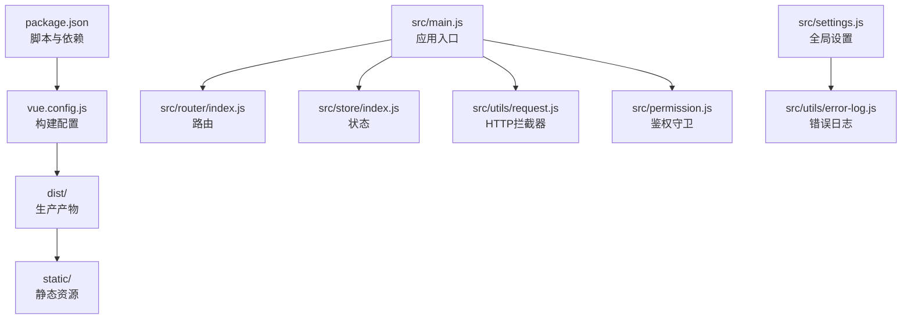
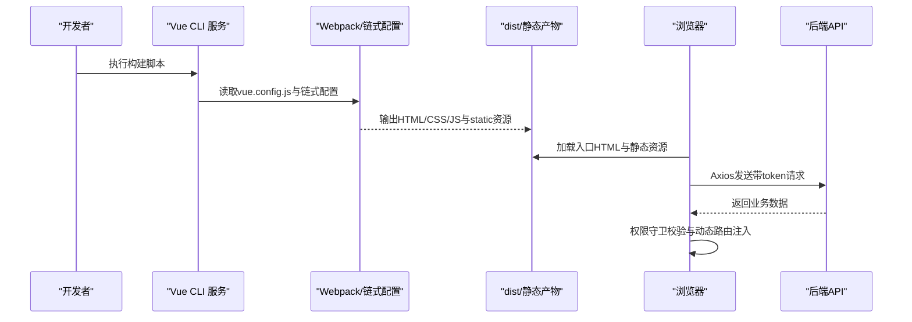
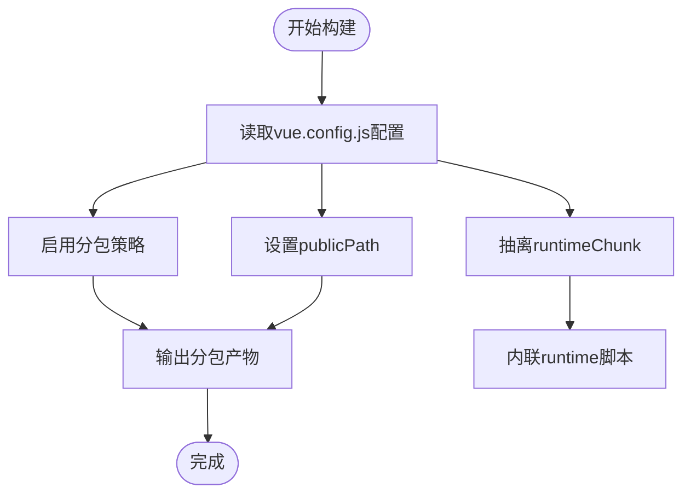
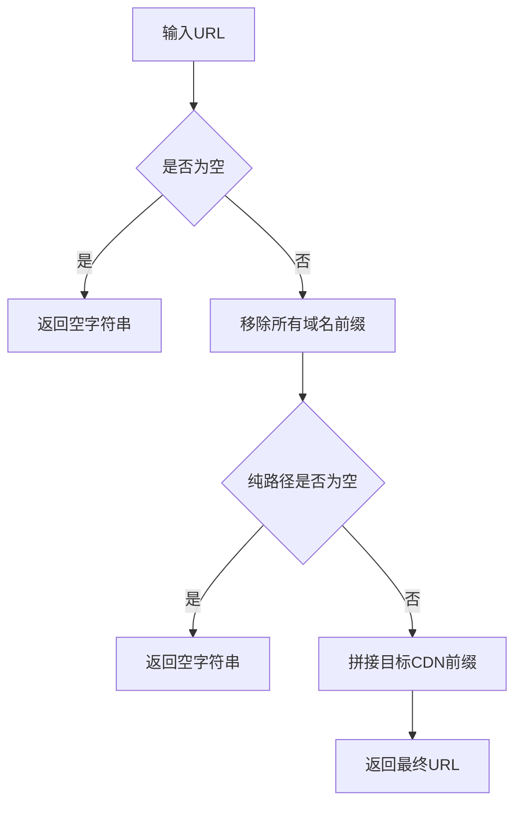
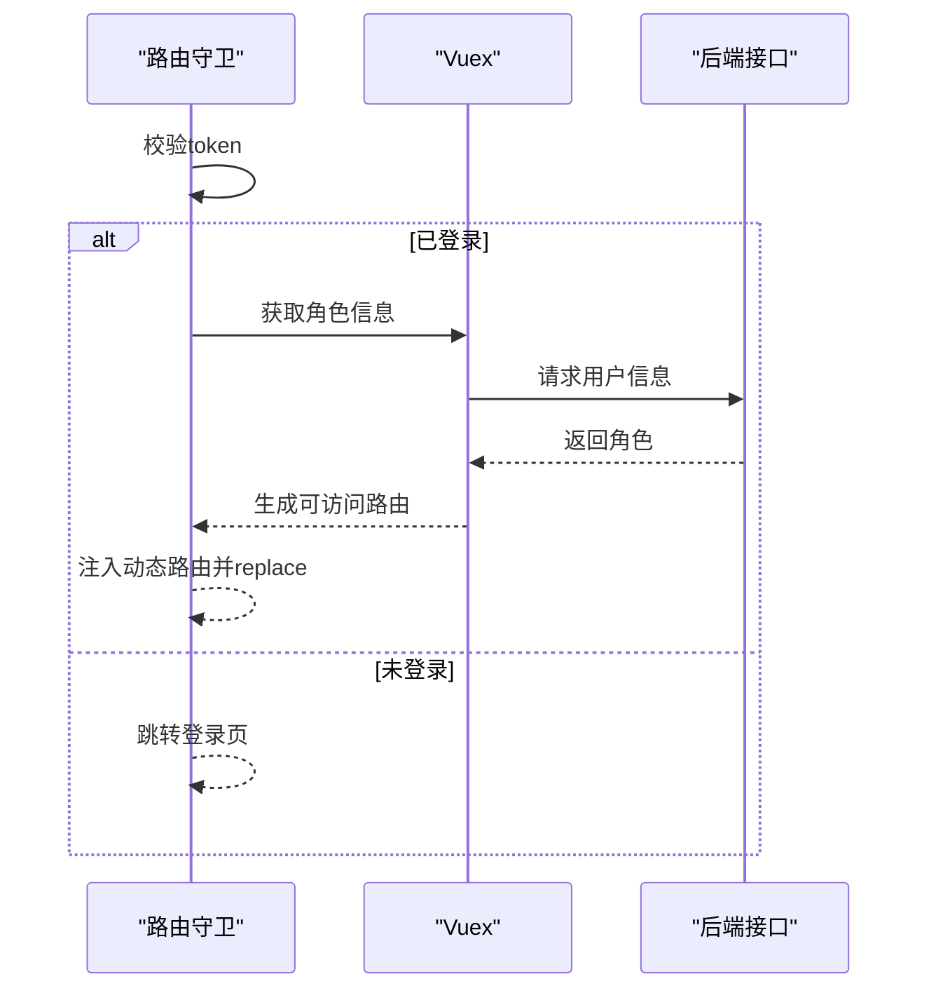
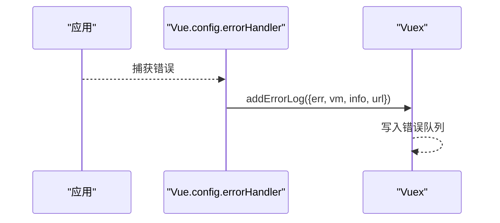
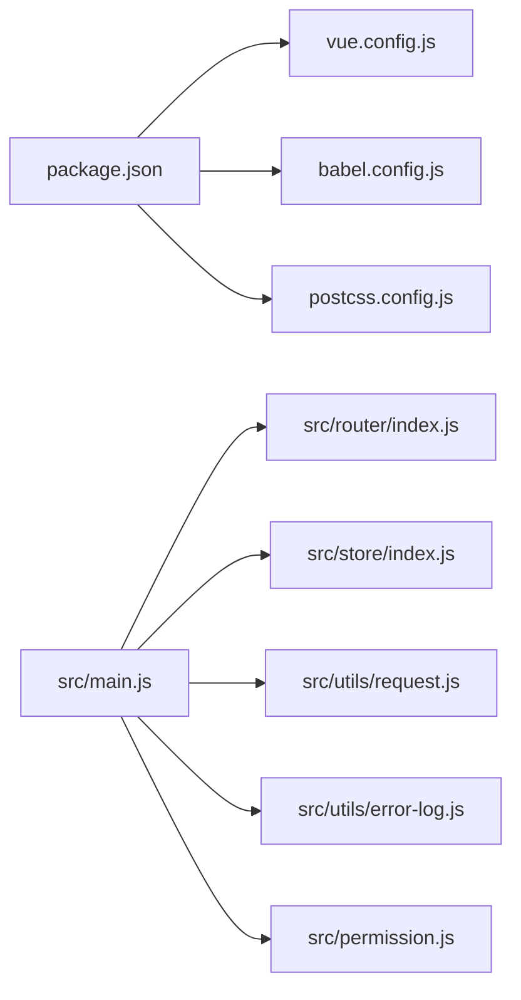

# 生产环境问题

<cite>
**本文引用的文件**   
- [package.json](file://package.json)
- [vue.config.js](file://vue.config.js)
- [babel.config.js](file://babel.config.js)
- [postcss.config.js](file://postcss.config.js)
- [src/settings.js](file://src/settings.js)
- [src/main.js](file://src/main.js)
- [src/utils/request.js](file://src/utils/request.js)
- [src/store/index.js](file://src/store/index.js)
- [src/router/index.js](file://src/router/index.js)
- [src/permission.js](file://src/permission.js)
- [src/utils/error-log.js](file://src/utils/error-log.js)
- [build/index.js](file://build/index.js)
- [README.md](file://README.md)
</cite>

## 目录
1. [简介](#简介)
2. [项目结构](#项目结构)
3. [核心组件](#核心组件)
4. [架构总览](#架构总览)
5. [详细组件分析](#详细组件分析)
6. [依赖关系分析](#依赖关系分析)
7. [性能考虑](#性能考虑)
8. [故障排除指南](#故障排除指南)
9. [结论](#结论)
10. [附录](#附录)

## 简介
本文件面向Leisu Admin项目的生产环境运维与开发团队，聚焦于生产构建失败的诊断与修复、部署相关问题排查（静态资源路径、CDN、缓存、HTTPS）、错误监控与日志收集、性能监控指标设置与分析、安全加固（XSS、CSRF、CSP、HTTPS）以及运维监控与告警体系的建立与维护。文档以仓库中的真实配置与代码为依据，提供可操作的排障步骤与最佳实践。

## 项目结构
Leisu Admin基于Vue CLI 3.x，采用模块化组织方式，前端资源通过webpack链式配置进行打包与优化。生产构建由脚本触发，产物输出至dist目录，静态资源位于static子目录；运行时通过Nginx或CDN对外提供服务。

图表来源
- [package.json:1-139](file://package.json#L1-L139)
- [vue.config.js:18-155](file://vue.config.js#L18-L155)
- [src/main.js:1-526](file://src/main.js#L1-L526)
- [src/router/index.js:1-177](file://src/router/index.js#L1-L177)
- [src/store/index.js:1-26](file://src/store/index.js#L1-L26)
- [src/utils/request.js:1-130](file://src/utils/request.js#L1-L130)
- [src/permission.js:1-82](file://src/permission.js#L1-L82)
- [src/settings.js:1-36](file://src/settings.js#L1-L36)
- [src/utils/error-log.js:1-36](file://src/utils/error-log.js#L1-L36)

章节来源
- [package.json:1-139](file://package.json#L1-L139)
- [vue.config.js:18-155](file://vue.config.js#L18-L155)

## 核心组件
- 构建与打包
  - 使用Vue CLI服务执行构建，支持多模式（开发/生产/本地），构建脚本在package.json中定义。
  - 生产构建默认关闭source map，开启分包与runtime抽离，减少首屏体积。
- 应用入口与运行时
  - 入口文件注册全局组件、过滤器、指令、插件，并注入CDN前缀与域名切换逻辑。
  - 权限守卫控制路由访问，结合Vuex状态与后端接口生成动态路由。
- 网络层与错误处理
  - Axios拦截器统一设置token、超时与错误提示；错误日志在生产环境下上报到store。
- 配置与环境变量
  - publicPath通过环境变量注入，支持子路径部署；settings.js控制错误日志开关。

章节来源
- [package.json:7-20](file://package.json#L7-L20)
- [vue.config.js:26-35](file://vue.config.js#L26-L35)
- [vue.config.js:60-76](file://vue.config.js#L60-L76)
- [vue.config.js:115-152](file://vue.config.js#L115-L152)
- [src/main.js:372-441](file://src/main.js#L372-L441)
- [src/permission.js:13-76](file://src/permission.js#L13-L76)
- [src/utils/request.js:22-26](file://src/utils/request.js#L22-L26)
- [src/utils/error-log.js:21-35](file://src/utils/error-log.js#L21-L35)
- [src/settings.js:28-34](file://src/settings.js#L28-L34)

## 架构总览
下图展示生产构建与运行时的关键交互：构建阶段由CLI驱动，产出静态资源；运行时通过浏览器加载HTML与资源，Axios发起跨域请求，权限守卫与路由动态注入保障访问控制。

图表来源
- [package.json:11-12](file://package.json#L11-L12)
- [vue.config.js:18-155](file://vue.config.js#L18-L155)
- [src/utils/request.js:22-26](file://src/utils/request.js#L22-L26)
- [src/permission.js:13-76](file://src/permission.js#L13-L76)

## 详细组件分析

### 构建配置与分包策略
- 关键点
  - publicPath来自环境变量，用于子路径部署场景。
  - 生产模式启用分包策略，拆分第三方库、Element UI与公共组件，提升缓存命中率。
  - 抽离runtime chunk并行内联，减少首屏解析开销。
  - 关闭预加载与预取插件，避免无效资源提前下载。
- 常见问题
  - 子路径部署时publicPath未正确设置，导致静态资源404。
  - CDN域名变更但未同步更新，导致资源加载失败。
  - 分包策略导致缓存失效频繁，需配合长期缓存策略与文件指纹。

图表来源
- [vue.config.js:26](file://vue.config.js#L26)
- [vue.config.js:127-149](file://vue.config.js#L127-L149)
- [vue.config.js:150](file://vue.config.js#L150)
- [vue.config.js:77-79](file://vue.config.js#L77-L79)

章节来源
- [vue.config.js:18-155](file://vue.config.js#L18-L155)

### 运行时资源路径与CDN
- 关键点
  - 全局注入targetCdn与正则替换逻辑，统一为相对路径或CDN路径。
  - 域名切换逻辑根据NODE_ENV选择移动端/PC端域名。
- 常见问题
  - CDN域名未生效或路径拼接错误，导致图片/静态资源加载失败。
  - 正则未覆盖所有前缀形式，导致部分资源未走CDN。

图表来源
- [src/main.js:423-441](file://src/main.js#L423-L441)

章节来源
- [src/main.js:372-441](file://src/main.js#L372-L441)

### 权限与路由
- 关键点
  - 路由守卫在进入前检查token与角色，动态注入可访问路由。
  - 白名单放行登录页，避免循环跳转。
- 常见问题
  - 角色信息未正确下发或生成路由失败，导致页面空白或无限重定向。
  - 动态路由注入后未replace当前路由，可能产生历史记录异常。

图表来源
- [src/permission.js:13-76](file://src/permission.js#L13-L76)
- [src/router/index.js:162-177](file://src/router/index.js#L162-L177)

章节来源
- [src/permission.js:13-76](file://src/permission.js#L13-L76)
- [src/router/index.js:74-160](file://src/router/index.js#L74-L160)

### 错误监控与日志
- 关键点
  - settings.js控制错误日志组件在生产环境启用。
  - errorHandler捕获Vue错误并上报到store，便于集中收集。
- 常见问题
  - 错误日志未上报或上报失败，导致线上问题无法定位。
  - 上报频率过高影响性能，需结合采样策略。

图表来源
- [src/utils/error-log.js:21-35](file://src/utils/error-log.js#L21-L35)
- [src/settings.js:28-34](file://src/settings.js#L28-L34)

章节来源
- [src/utils/error-log.js:1-36](file://src/utils/error-log.js#L1-L36)
- [src/settings.js:28-34](file://src/settings.js#L28-L34)

### HTTPS与安全
- 关键点
  - 项目未内置HTTPS配置，需在反向代理层（Nginx）启用HTTPS与强制跳转。
  - CSP建议通过响应头配置，限制脚本来源与内联脚本。
  - CSRF可通过同源策略与后端Token机制配合防范。
- 常见问题
  - 混合内容导致HTTPS页面加载非加密资源。
  - 未设置Strict-Transport-Security，存在降级风险。

章节来源
- [src/main.js:419-421](file://src/main.js#L419-L421)

## 依赖关系分析
- 构建期
  - package.json定义了构建脚本与依赖版本，babel与postcss配置分别处理语法转换与样式兼容。
- 运行期
  - main.js引入路由、状态、权限、网络层与错误日志；router与store通过require context自动装载模块。

图表来源
- [package.json:1-139](file://package.json#L1-L139)
- [babel.config.js:1-6](file://babel.config.js#L1-L6)
- [postcss.config.js:1-6](file://postcss.config.js#L1-L6)
- [src/main.js:18-26](file://src/main.js#L18-L26)
- [src/router/index.js:1-10](file://src/router/index.js#L1-L10)
- [src/store/index.js:8-18](file://src/store/index.js#L8-L18)
- [src/utils/request.js:1-5](file://src/utils/request.js#L1-L5)
- [src/utils/error-log.js:1-5](file://src/utils/error-log.js#L1-L5)
- [src/permission.js:1-8](file://src/permission.js#L1-L8)

章节来源
- [package.json:1-139](file://package.json#L1-L139)
- [src/store/index.js:8-18](file://src/store/index.js#L8-L18)

## 性能考虑
- 构建优化
  - 启用分包与runtime抽离，合理设置cacheGroups与最小chunks，平衡缓存命中与请求数量。
  - 关闭生产source map，避免额外体积与泄露风险。
- 运行时优化
  - CDN路径统一与正则替换减少资源加载失败。
  - 控制台日志在生产环境被抑制，降低I/O开销。
- 指标建议
  - 页面加载时间（First Contentful Paint, Largest Contentful Paint）、首屏渲染时间、用户交互延迟（Time to Interactive）。
  - 缓存命中率、分包体积分布、首屏请求数。

章节来源
- [vue.config.js:115-152](file://vue.config.js#L115-L152)
- [vue.config.js:30](file://vue.config.js#L30)
- [src/main.js:504-514](file://src/main.js#L504-L514)
- [src/main.js:423-441](file://src/main.js#L423-L441)

## 故障排除指南

### 构建失败
- 症状
  - 构建过程中出现Webpack配置错误、依赖解析失败或资源缺失。
- 诊断步骤
  - 确认publicPath是否正确设置（子路径部署场景）。
  - 检查externals与ProvidePlugin配置是否与外部资源一致。
  - 核对分包策略与runtimeChunk设置，避免缓存不一致。
  - 关闭生产source map以排除映射文件问题。
- 修复建议
  - 明确部署路径并设置VUE_APP_BASE_PATH，确保publicPath与实际路径一致。
  - 对缺失的外部资源（如地图SDK）在构建配置中正确声明externals。
  - 若使用CDN，确保CDN域名与资源路径匹配，避免正则替换遗漏。

章节来源
- [vue.config.js:26](file://vue.config.js#L26)
- [vue.config.js:31-35](file://vue.config.js#L31-L35)
- [vue.config.js:60-76](file://vue.config.js#L60-L76)
- [vue.config.js:115-152](file://vue.config.js#L115-L152)
- [vue.config.js:30](file://vue.config.js#L30)

### 依赖版本冲突
- 症状
  - 构建时报错或运行时功能异常，疑似依赖版本不兼容。
- 诊断步骤
  - 检查package.json中依赖版本范围与已安装版本是否满足兼容性。
  - 使用锁定文件（如yarn.lock或npm-shrinkwrap.json）核对一致性。
- 修复建议
  - 固定关键依赖版本，避免自动升级带来的破坏性变更。
  - 优先使用官方推荐的依赖组合，必要时回退到已知稳定版本。

章节来源
- [package.json:37-96](file://package.json#L37-L96)

### 静态资源路径与CDN
- 症状
  - 图片或CSS资源404，或加载缓慢。
- 诊断步骤
  - 确认CDN前缀与目标域名一致，检查addPrefix/removePrefix逻辑是否覆盖所有前缀形式。
  - 核对public/static目录结构与引用路径。
- 修复建议
  - 统一使用CDN前缀函数，确保路径拼接正确且无多余斜杠。
  - 将常用静态资源置于CDN，结合长缓存策略与文件指纹。

章节来源
- [src/main.js:419-441](file://src/main.js#L419-L441)
- [vue.config.js:27-28](file://vue.config.js#L27-L28)

### HTTPS与安全
- 症状
  - HTTPS页面加载混合内容，或存在安全策略警告。
- 诊断步骤
  - 检查反向代理层是否启用HTTPS与强制跳转。
  - 审核CSP响应头，限制脚本来源与内联脚本。
- 修复建议
  - 在Nginx层启用TLS并配置HSTS。
  - 通过响应头设置严格的CSP策略，禁用eval与unsafe-inline。

章节来源
- [src/main.js:419-421](file://src/main.js#L419-L421)

### 错误监控与日志
- 症状
  - 生产环境错误无法上报或上报失败。
- 诊断步骤
  - 确认settings.js中errorLog在生产环境启用。
  - 检查errorHandler是否被调用，store中是否有错误队列。
- 修复建议
  - 在生产环境开启错误日志组件，确保上报通道可用。
  - 对高频错误进行采样，避免日志风暴。

章节来源
- [src/settings.js:28-34](file://src/settings.js#L28-L34)
- [src/utils/error-log.js:21-35](file://src/utils/error-log.js#L21-L35)

### 部署与预览
- 症状
  - 预览或上线后页面空白或资源加载失败。
- 诊断步骤
  - 使用build/index.js提供的预览能力，确认publicPath与dist目录结构。
  - 检查Nginx或CDN的index.html与静态资源根路径配置。
- 修复建议
  - 在预览模式下验证publicPath与资源路径，再上线生产。

章节来源
- [build/index.js:7-32](file://build/index.js#L7-L32)
- [vue.config.js:26](file://vue.config.js#L26)

### 路由与权限
- 症状
  - 登录后无法进入页面或无限重定向。
- 诊断步骤
  - 检查白名单与token获取逻辑，确认动态路由生成成功。
  - 核对路由注入后是否replace当前路由。
- 修复建议
  - 确保用户信息接口返回的角色字段完整，动态路由注入成功后再跳转。

章节来源
- [src/permission.js:13-76](file://src/permission.js#L13-L76)
- [src/router/index.js:162-177](file://src/router/index.js#L162-L177)

## 结论
生产环境的稳定性依赖于严谨的构建配置、清晰的部署流程、完善的错误监控与安全策略。通过规范publicPath与CDN路径、启用分包与缓存策略、加强HTTPS与CSP、完善错误日志与性能指标，可显著提升系统可靠性与用户体验。建议在CI/CD流水线中加入构建质量门禁与自动化预览，持续优化发布流程与监控告警体系。

## 附录
- 构建命令参考
  - 测试环境构建：npm run build:dev
  - 生产环境构建：npm run build:prod
- 参考文档
  - 在线发布说明与更多细节请参阅项目自述文件中的“发布”章节。

章节来源
- [README.md:143-151](file://README.md#L143-L151)
- [package.json:11-12](file://package.json#L11-L12)