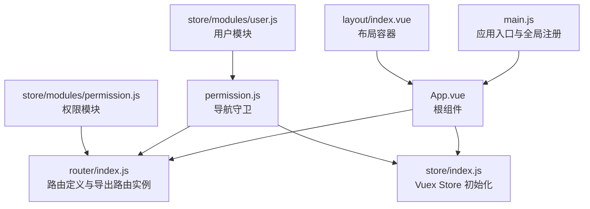
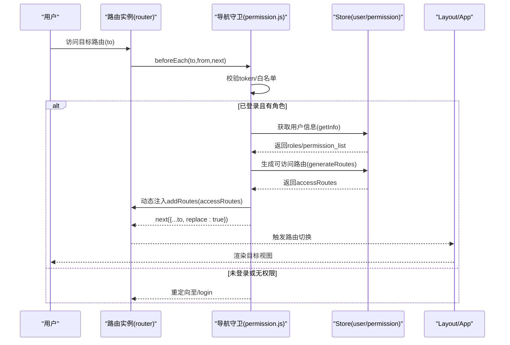
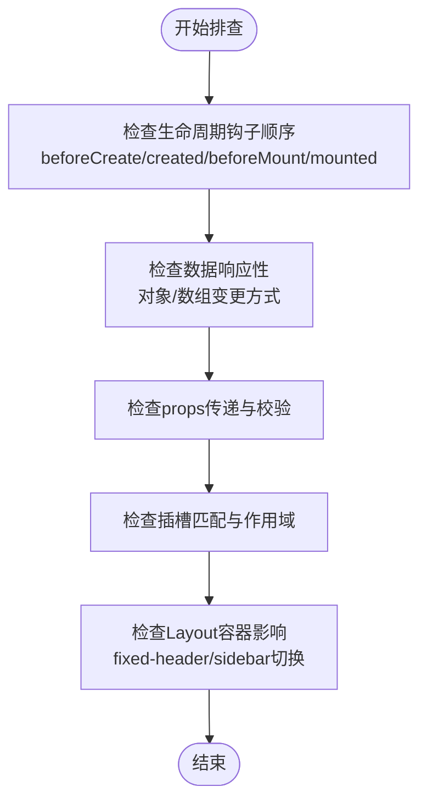
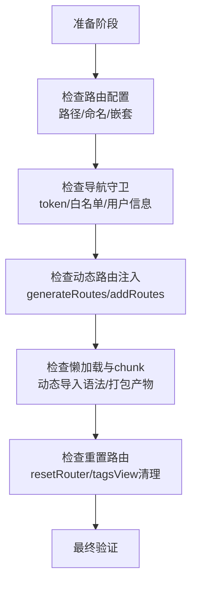
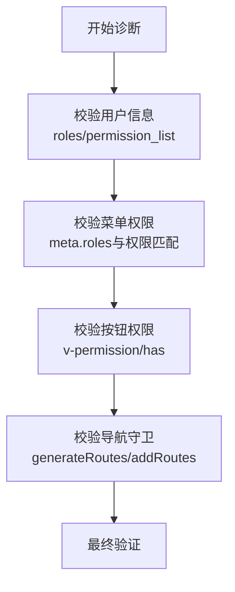
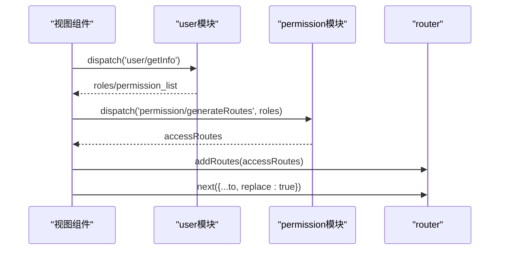
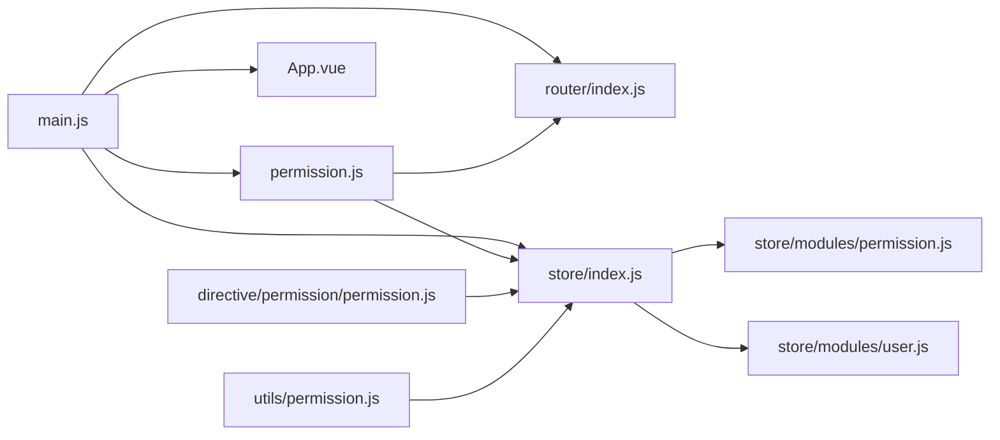

# 组件与路由问题

<cite>
**本文引用的文件**
- [src/main.js](file://src/main.js)
- [src/router/index.js](file://src/router/index.js)
- [src/store/index.js](file://src/store/index.js)
- [src/permission.js](file://src/permission.js)
- [src/utils/permission.js](file://src/utils/permission.js)
- [src/store/modules/permission.js](file://src/store/modules/permission.js)
- [src/store/modules/user.js](file://src/store/modules/user.js)
- [src/store/modules/app.js](file://src/store/modules/app.js)
- [src/layout/index.vue](file://src/layout/index.vue)
- [src/App.vue](file://src/App.vue)
- [src/directive/permission/permission.js](file://src/directive/permission/permission.js)
- [src/router/children/member.js](file://src/router/children/member.js)
- [src/utils/request.js](file://src/utils/request.js)
- [src/utils/auth.js](file://src/utils/auth.js)
</cite>

## 目录
1. [简介](#简介)
2. [项目结构](#项目结构)
3. [核心组件](#核心组件)
4. [架构总览](#架构总览)
5. [详细组件分析](#详细组件分析)
6. [依赖关系分析](#依赖关系分析)
7. [性能考虑](#性能考虑)
8. [故障排除指南](#故障排除指南)
9. [结论](#结论)
10. [附录](#附录)

## 简介
本文件面向 Leisu Admin 项目的前端开发与运维人员，聚焦“组件渲染异常”“路由跳转失败”“权限控制失效”“组件状态管理问题”“路由懒加载与动态导入调试”“组件性能问题”等常见问题，提供系统化的定位思路、排查步骤与可操作的修复建议。内容基于仓库中的实际代码进行分析，确保可追溯与可落地。

## 项目结构
- 应用入口与全局初始化：在应用入口集中注册全局组件、指令、过滤器、第三方库，并挂载根实例。
- 路由体系：采用 vue-router，区分常量路由与异步路由；通过导航守卫在进入路由前完成鉴权与动态注入。
- 状态管理：Vuex 自动扫描 modules 目录，按命名空间组织模块；权限模块负责根据角色过滤异步路由并注入到路由器。
- 权限控制：结合导航守卫与指令/函数两种方式，实现页面级与按钮级权限控制。
- 布局与视图：Layout 组合 Sidebar、Navbar、TagsView、AppMain 等，App.vue 作为根容器承载路由出口。

图表来源
- [src/main.js:1-526](file://src/main.js#L1-L526)
- [src/router/index.js:1-177](file://src/router/index.js#L1-L177)
- [src/store/index.js:1-26](file://src/store/index.js#L1-L26)
- [src/permission.js:1-82](file://src/permission.js#L1-L82)
- [src/store/modules/permission.js:1-66](file://src/store/modules/permission.js#L1-L66)
- [src/store/modules/user.js:1-542](file://src/store/modules/user.js#L1-L542)
- [src/layout/index.vue:1-124](file://src/layout/index.vue#L1-L124)
- [src/App.vue:1-18](file://src/App.vue#L1-L18)

章节来源
- [src/main.js:1-526](file://src/main.js#L1-L526)
- [src/router/index.js:1-177](file://src/router/index.js#L1-L177)
- [src/store/index.js:1-26](file://src/store/index.js#L1-L26)
- [src/permission.js:1-82](file://src/permission.js#L1-L82)
- [src/layout/index.vue:1-124](file://src/layout/index.vue#L1-L124)
- [src/App.vue:1-18](file://src/App.vue#L1-L18)

## 核心组件
- 应用入口与全局能力
  - 注册全局组件、指令、过滤器、第三方库，统一设置 Element 尺寸、全局事件总线、CDN 工具函数等。
  - 定义全局按钮权限指令与按钮权限函数，用于模板与逻辑层的权限控制。
- 路由与导航守卫
  - 定义常量路由与异步路由集合；在导航守卫中判断 token、拉取用户信息、生成可访问路由并注入；处理白名单、错误与回退。
- 权限模块
  - 提供根据角色过滤异步路由的能力；维护已注入路由快照，供后续重置。
- 用户模块
  - 登录、登出、获取用户信息；动态扩展异步路由（如日志页面）；重置路由与标签页缓存。
- 布局与根组件
  - Layout 组织侧边栏、头部、标签页与主内容区域；App.vue 承载路由出口与全局 loading。

章节来源
- [src/main.js:1-526](file://src/main.js#L1-L526)
- [src/router/index.js:1-177](file://src/router/index.js#L1-L177)
- [src/store/modules/permission.js:1-66](file://src/store/modules/permission.js#L1-L66)
- [src/store/modules/user.js:1-542](file://src/store/modules/user.js#L1-L542)
- [src/layout/index.vue:1-124](file://src/layout/index.vue#L1-L124)
- [src/App.vue:1-18](file://src/App.vue#L1-L18)

## 架构总览
下图展示从用户访问到页面渲染的关键链路，包括鉴权、动态路由注入与视图渲染：

图表来源
- [src/permission.js:13-76](file://src/permission.js#L13-L76)
- [src/store/modules/user.js:172-336](file://src/store/modules/user.js#L172-L336)
- [src/store/modules/permission.js:49-57](file://src/store/modules/permission.js#L49-L57)
- [src/router/index.js:162-177](file://src/router/index.js#L162-L177)
- [src/layout/index.vue:1-124](file://src/layout/index.vue#L1-L124)
- [src/App.vue:1-18](file://src/App.vue#L1-L18)

## 详细组件分析

### 组件渲染异常排查
常见症状与定位要点：
- 生命周期钩子未正确执行
  - 检查组件是否在进入路由后才进行数据请求；若请求在 beforeMount 前发起，可能造成渲染闪烁或数据未更新。
  - 关注布局容器与视图容器的嵌套关系，确保父组件状态变化不会意外中断子组件渲染。
- 数据响应性与引用类型
  - 对象/数组深层变更需通过 Vue.set 或替换引用以触发响应式更新；避免直接索引赋值。
  - 在复杂表单/表格场景，注意 v-model 与计算属性/侦听器的配合，避免双向绑定引发的抖动。
- 父子组件通信
  - props 向下传递、events 向上冒泡；尽量减少跨层级通信，必要时使用事件总线或 Vuex。
  - 注意 key 的稳定性，避免相同 key 导致组件被复用而非重新创建。
- 插槽使用
  - 确认具名插槽与作用域插槽的匹配；父组件传入的内容是否被子组件正确接收与渲染。
- 布局与容器
  - Layout 中的 fixed-header、sidebar 展开/收起会影响视图高度与滚动；在图表/表格组件中，需在布局切换后触发尺寸更新。

章节来源
- [src/layout/index.vue:1-124](file://src/layout/index.vue#L1-L124)
- [src/App.vue:1-18](file://src/App.vue#L1-L18)

### 路由跳转失败排查
常见原因与步骤：
- 路由配置错误
  - 检查路径拼写、命名重复、嵌套路由的 parent 是否正确；确认异步路由是否已注入。
- 导航守卫问题
  - 校验白名单、token 获取与存储一致性；确认用户信息拉取成功且 roles 存在。
  - 若使用 replace: true，确认不会产生历史记录回退问题。
- 动态路由生成失败
  - 检查权限模块的过滤逻辑与返回值；确认 generateRoutes 的调用时机与结果。
- 路由懒加载与动态导入
  - 检查路由组件的动态导入语法与 chunk 名；确认打包产物与运行时路径一致。
- 重置路由
  - 登出或角色变更后，需重置路由与标签页缓存，避免残留路由导致跳转异常。

章节来源
- [src/router/index.js:1-177](file://src/router/index.js#L1-L177)
- [src/permission.js:13-76](file://src/permission.js#L13-L76)
- [src/store/modules/permission.js:49-57](file://src/store/modules/permission.js#L49-L57)
- [src/store/modules/user.js:338-392](file://src/store/modules/user.js#L338-L392)

### 权限控制失效诊断
- 角色权限配置
  - 确认用户信息中 roles/permission_list 字段存在且非空；检查权限列表是否包含所需项。
- 菜单权限验证
  - 异步路由的 meta.roles 是否与用户权限匹配；过滤逻辑是否正确返回可访问路由。
- 按钮权限控制
  - v-permission 指令与 has 方法是否正确读取 store.getters.roles；指令插入时是否移除了 DOM 节点。
- 导航守卫执行
  - 确认守卫中 generateRoutes 的调用与 addRoutes 的注入顺序；异常分支是否正确重定向与提示。

章节来源
- [src/store/modules/user.js:172-336](file://src/store/modules/user.js#L172-L336)
- [src/store/modules/permission.js:8-35](file://src/store/modules/permission.js#L8-L35)
- [src/directive/permission/permission.js:1-23](file://src/directive/permission/permission.js#L1-L23)
- [src/utils/permission.js:1-26](file://src/utils/permission.js#L1-L26)
- [src/permission.js:13-76](file://src/permission.js#L13-L76)

### 组件状态管理问题
- Vuex 状态同步
  - 确认模块命名空间使用；在用户模块中通过 dispatch 调用权限模块的 generateRoutes 并注入路由。
- 组件间数据传递
  - 使用 mapState/mapGetters 简化读取；通过事件总线或 Vuex 避免跨层级通信。
- 状态持久化
  - token 使用 localStorage 存储；侧边栏状态使用 Cookie；注意不同存储介质的兼容性与清理策略。
- 登出与重置
  - 登出时清空 token、角色，重置路由与标签页缓存，避免状态残留。

图表来源
- [src/store/modules/user.js:172-336](file://src/store/modules/user.js#L172-L336)
- [src/store/modules/permission.js:49-57](file://src/store/modules/permission.js#L49-L57)
- [src/router/index.js:162-177](file://src/router/index.js#L162-L177)

章节来源
- [src/store/index.js:1-26](file://src/store/index.js#L1-L26)
- [src/store/modules/user.js:172-336](file://src/store/modules/user.js#L172-L336)
- [src/store/modules/permission.js:49-57](file://src/store/modules/permission.js#L49-L57)
- [src/store/modules/app.js:1-65](file://src/store/modules/app.js#L1-L65)
- [src/utils/auth.js:1-17](file://src/utils/auth.js#L1-L17)

### 路由懒加载与动态导入调试
- 动态导入语法
  - 确认路由组件使用箭头函数返回 import(...)；chunk 名可选，但需保证打包产物稳定。
- 路径与打包问题
  - 检查路径别名与相对路径；确认构建后静态资源路径与运行时一致。
- 注入时机
  - 在导航守卫中注入路由，避免在应用启动时一次性加载全部异步模块，提升首屏性能。

章节来源
- [src/router/index.js:1-177](file://src/router/index.js#L1-L177)

### 组件性能问题排查
- 重复渲染
  - 检查 props 是否稳定、key 是否合理；避免在父组件频繁改变子组件的 props 引用。
- 计算属性与缓存
  - 将昂贵计算放入计算属性并依赖稳定数据源；避免在模板中直接进行复杂表达式。
- watcher 优化
  - 对高频 watcher 设置防抖/节流；避免在 watcher 中做重型同步操作。
- 图表/表格尺寸更新
  - 在布局切换（如 sidebar 展开/收起）后，触发 resize 事件或调用组件提供的尺寸更新方法。

章节来源
- [src/layout/index.vue:52-78](file://src/layout/index.vue#L52-L78)

## 依赖关系分析
- 入口依赖
  - main.js 依赖 router、store、permission、App、全局组件与指令；是全局能力的汇聚点。
- 路由依赖
  - router/index.js 导出路由实例，包含常量与异步路由；permission.js 依赖 router 实例进行 addRoutes。
- 状态依赖
  - permission.js 依赖 store 的 getters 与 actions；user.js 依赖 router 重置与动态注入。
- 权限指令
  - directive/permission/permission.js 与 utils/permission.js 均依赖 store.getters.roles。

图表来源
- [src/main.js:1-526](file://src/main.js#L1-L526)
- [src/router/index.js:1-177](file://src/router/index.js#L1-L177)
- [src/store/index.js:1-26](file://src/store/index.js#L1-L26)
- [src/permission.js:1-82](file://src/permission.js#L1-L82)
- [src/store/modules/permission.js:1-66](file://src/store/modules/permission.js#L1-L66)
- [src/store/modules/user.js:1-542](file://src/store/modules/user.js#L1-L542)
- [src/directive/permission/permission.js:1-23](file://src/directive/permission/permission.js#L1-L23)
- [src/utils/permission.js:1-26](file://src/utils/permission.js#L1-L26)

章节来源
- [src/main.js:1-526](file://src/main.js#L1-L526)
- [src/router/index.js:1-177](file://src/router/index.js#L1-L177)
- [src/store/index.js:1-26](file://src/store/index.js#L1-L26)
- [src/permission.js:1-82](file://src/permission.js#L1-L82)
- [src/store/modules/permission.js:1-66](file://src/store/modules/permission.js#L1-L66)
- [src/store/modules/user.js:1-542](file://src/store/modules/user.js#L1-L542)
- [src/directive/permission/permission.js:1-23](file://src/directive/permission/permission.js#L1-L23)
- [src/utils/permission.js:1-26](file://src/utils/permission.js#L1-L26)

## 性能考虑
- 首屏优化
  - 路由懒加载与按需引入组件；避免在入口集中注册过多全局组件。
- 渲染优化
  - 合理使用 key、避免不必要的 v-if/v-show 切换；对长列表使用虚拟滚动。
- 网络与缓存
  - 请求拦截器统一注入 token；对重复请求进行去重或缓存；错误提示统一处理。
- 布局与尺寸
  - 布局切换后主动触发尺寸更新，避免图表/表格渲染异常。

章节来源
- [src/router/index.js:1-177](file://src/router/index.js#L1-L177)
- [src/utils/request.js:1-130](file://src/utils/request.js#L1-L130)
- [src/layout/index.vue:52-78](file://src/layout/index.vue#L52-L78)

## 故障排除指南

### 组件渲染异常
- 症状：组件未渲染、空白、闪烁
  - 检查路由是否正确注入、组件是否使用动态导入；确认生命周期钩子顺序与数据响应性。
  - 关注 Layout 的 fixed-header 与 sidebar 切换对视图的影响。
- 症状：父子通信异常
  - 检查 props 类型与默认值、事件命名与参数传递；避免跨层级通信导致的耦合。
- 症状：插槽内容不显示
  - 确认具名插槽名称与作用域插槽的 slot/slot-scope 使用是否一致。

章节来源
- [src/layout/index.vue:1-124](file://src/layout/index.vue#L1-L124)
- [src/App.vue:1-18](file://src/App.vue#L1-L18)

### 路由跳转失败
- 症状：无法跳转到目标路由
  - 检查路径是否存在、命名是否冲突；确认异步路由已注入。
- 症状：白名单外页面被重定向
  - 核对白名单列表与当前路由 path；确认 token 获取逻辑与存储介质。
- 症状：动态路由注入后仍失败
  - 检查 generateRoutes 的返回值与 addRoutes 的注入时机；确认 replace: true 不会破坏预期行为。

章节来源
- [src/router/index.js:1-177](file://src/router/index.js#L1-L177)
- [src/permission.js:13-76](file://src/permission.js#L13-L76)
- [src/store/modules/permission.js:49-57](file://src/store/modules/permission.js#L49-L57)

### 权限控制失效
- 症状：菜单项不显示或按钮不可见
  - 校验用户信息中的 permission_list；核对 meta.roles 与权限匹配。
- 症状：按钮权限指令无效
  - 检查 v-permission 的值与 store.getters.roles；确认指令插入时的 DOM 操作。
- 症状：导航守卫未生效
  - 确认守卫中 generateRoutes 的调用与 addRoutes 的注入顺序；异常分支的提示与重定向。

章节来源
- [src/store/modules/user.js:172-336](file://src/store/modules/user.js#L172-L336)
- [src/store/modules/permission.js:8-35](file://src/store/modules/permission.js#L8-L35)
- [src/directive/permission/permission.js:1-23](file://src/directive/permission/permission.js#L1-L23)
- [src/utils/permission.js:1-26](file://src/utils/permission.js#L1-L26)
- [src/permission.js:13-76](file://src/permission.js#L13-L76)

### 组件状态管理问题
- 症状：状态不一致或未同步
  - 检查模块命名空间与 getters/actions 的调用；确认事件总线使用是否规范。
- 症状：登出后仍保留状态
  - 确认登出流程中 token、角色清空与路由重置、标签页清理的顺序。

章节来源
- [src/store/modules/user.js:338-392](file://src/store/modules/user.js#L338-L392)
- [src/store/modules/app.js:1-65](file://src/store/modules/app.js#L1-L65)
- [src/utils/auth.js:1-17](file://src/utils/auth.js#L1-L17)

### 路由懒加载与动态导入调试
- 症状：模块加载失败或白屏
  - 检查动态导入语法与 chunk 名；确认打包产物与运行时路径一致。
- 症状：首屏加载过慢
  - 合理拆分路由与组件，避免一次性加载过多模块。

章节来源
- [src/router/index.js:1-177](file://src/router/index.js#L1-L177)

### 组件性能问题
- 症状：卡顿、掉帧
  - 检查计算属性与 watcher 的使用；对高频操作进行防抖/节流；在布局切换后触发尺寸更新。
- 症状：图表/表格渲染异常
  - 在 sidebar 展开/收起后主动触发 resize 事件或调用组件提供的尺寸更新方法。

章节来源
- [src/layout/index.vue:52-78](file://src/layout/index.vue#L52-L78)

## 结论
本指南围绕组件渲染、路由跳转、权限控制、状态管理、懒加载与性能等维度提供了系统化的排查路径。建议在日常开发中：
- 将权限与路由注入流程标准化，确保导航守卫与动态路由注入的顺序与异常处理完备；
- 在入口集中管理全局能力，保持模块职责清晰；
- 对性能敏感场景采用懒加载、计算属性缓存与 watcher 优化；
- 建立完善的日志与错误提示机制，便于快速定位问题。

## 附录
- 常用调试清单
  - 路由：路径、命名、嵌套、动态导入、chunk 名、注入时机
  - 权限：token、白名单、用户信息、roles、meta.roles、指令与函数
  - 状态：模块命名空间、getters/actions、事件总线、存储介质
  - 性能：计算属性、watcher、懒加载、布局切换后的尺寸更新