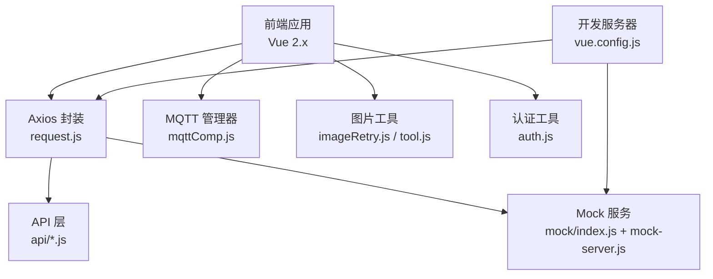
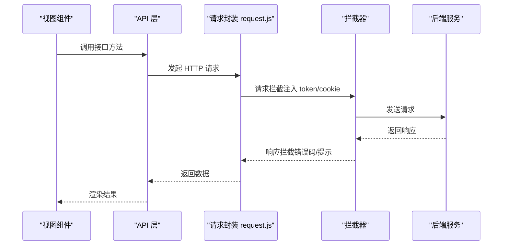
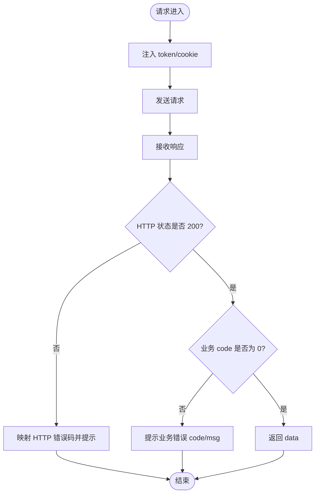
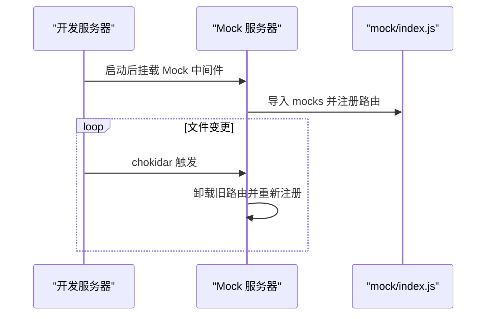
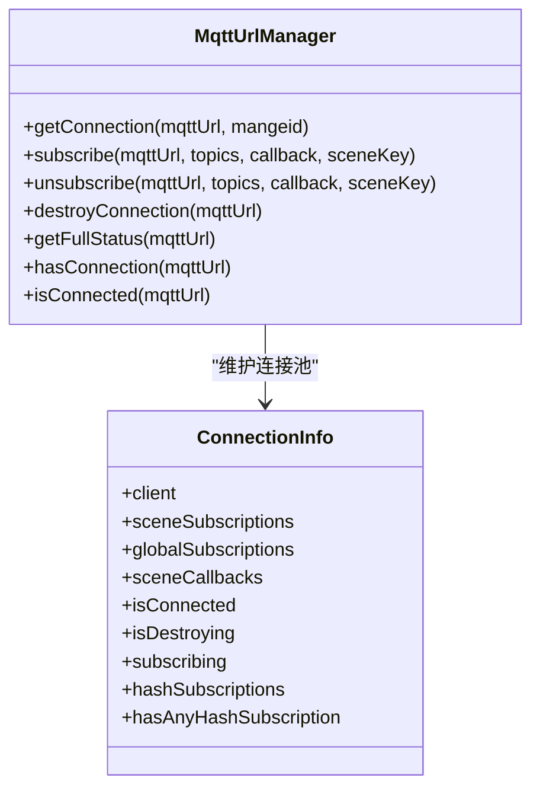
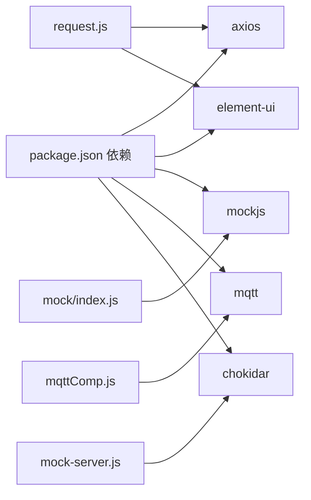

# 网络请求问题

<cite>
**本文引用的文件**
- [src/utils/request.js](file://src/utils/request.js)
- [src/utils/mqttComp.js](file://src/utils/mqttComp.js)
- [src/utils/auth.js](file://src/utils/auth.js)
- [src/utils/imageRetry.js](file://src/utils/imageRetry.js)
- [src/utils/tool.js](file://src/utils/tool.js)
- [src/api/user.js](file://src/api/user.js)
- [src/api/chat.js](file://src/api/chat.js)
- [src/views/chat_room/chatlist.vue](file://src/views/chat_room/chatlist.vue)
- [mock/mock-server.js](file://mock/mock-server.js)
- [mock/index.js](file://mock/index.js)
- [vue.config.js](file://vue.config.js)
- [package.json](file://package.json)
</cite>

## 目录
1. [简介](#简介)
2. [项目结构](#项目结构)
3. [核心组件](#核心组件)
4. [架构总览](#架构总览)
5. [详细组件分析](#详细组件分析)
6. [依赖关系分析](#依赖关系分析)
7. [性能考虑](#性能考虑)
8. [故障排除指南](#故障排除指南)
9. [结论](#结论)
10. [附录](#附录)

## 简介
本文件面向 Leisu Admin 项目的前端网络请求问题，提供系统化的故障排除与优化指南。内容覆盖：
- 跨域问题诊断与解决（CORS、代理、后端支持策略）
- HTTP 请求失败排查（4xx/5xx 错误码、请求头、响应格式）
- Mock 数据服务配置与调试（本地 Mock 服务器、接口模拟、数据伪造）
- WebSocket 与 MQTT 实时通信问题排查（连接、订阅、断线重连、消息丢失）
- API 接口调用失败诊断（参数校验、响应解析、错误处理）
- 网络请求性能优化（合并、缓存、并发、超时）

## 项目结构
与网络请求相关的关键目录与文件：
- 请求封装与拦截器：src/utils/request.js
- MQTT 管理与订阅：src/utils/mqttComp.js
- 认证与 Cookie/Token：src/utils/auth.js
- 图片加载与跨域处理：src/utils/imageRetry.js、src/utils/tool.js
- API 层封装示例：src/api/user.js、src/api/chat.js
- Mock 服务（本地开发）：mock/mock-server.js、mock/index.js
- 开发服务器与代理配置：vue.config.js
- 依赖声明：package.json

图表来源
- [src/utils/request.js:1-130](file://src/utils/request.js#L1-L130)
- [src/utils/mqttComp.js:1-564](file://src/utils/mqttComp.js#L1-L564)
- [src/utils/auth.js:1-17](file://src/utils/auth.js#L1-L17)
- [src/utils/imageRetry.js:1-24](file://src/utils/imageRetry.js#L1-L24)
- [src/utils/tool.js:230-258](file://src/utils/tool.js#L230-L258)
- [src/api/user.js:1-37](file://src/api/user.js#L1-L37)
- [src/api/chat.js:1-72](file://src/api/chat.js#L1-L72)
- [mock/mock-server.js:1-69](file://mock/mock-server.js#L1-L69)
- [mock/index.js:1-71](file://mock/index.js#L1-L71)
- [vue.config.js:1-155](file://vue.config.js#L1-L155)

章节来源
- [src/utils/request.js:1-130](file://src/utils/request.js#L1-L130)
- [src/utils/mqttComp.js:1-564](file://src/utils/mqttComp.js#L1-L564)
- [src/utils/auth.js:1-17](file://src/utils/auth.js#L1-L17)
- [src/utils/imageRetry.js:1-24](file://src/utils/imageRetry.js#L1-L24)
- [src/utils/tool.js:230-258](file://src/utils/tool.js#L230-L258)
- [src/api/user.js:1-37](file://src/api/user.js#L1-L37)
- [src/api/chat.js:1-72](file://src/api/chat.js#L1-L72)
- [mock/mock-server.js:1-69](file://mock/mock-server.js#L1-L69)
- [mock/index.js:1-71](file://mock/index.js#L1-L71)
- [vue.config.js:1-155](file://vue.config.js#L1-L155)

## 核心组件
- Axios 请求封装与拦截器：负责基础 URL、Cookie、超时、统一错误提示与鉴权头注入。
- MQTT 管理器：集中管理连接、订阅、消息分发、通配符匹配、自动销毁。
- Mock 服务：本地热更新 Mock 路由，支持 Express 风格注册与 XHR 代理。
- 认证工具：Token 读取/写入/移除，配合请求拦截器注入 token。
- 图片工具：跨域图片加载、超时控制、Canvas 跨域污染规避。

章节来源
- [src/utils/request.js:1-130](file://src/utils/request.js#L1-L130)
- [src/utils/mqttComp.js:1-564](file://src/utils/mqttComp.js#L1-L564)
- [mock/mock-server.js:1-69](file://mock/mock-server.js#L1-L69)
- [mock/index.js:1-71](file://mock/index.js#L1-L71)
- [src/utils/auth.js:1-17](file://src/utils/auth.js#L1-L17)
- [src/utils/imageRetry.js:1-24](file://src/utils/imageRetry.js#L1-L24)
- [src/utils/tool.js:230-258](file://src/utils/tool.js#L230-L258)

## 架构总览
前端通过 Axios 统一封装 HTTP 请求，API 层以模块化方式组织接口；开发阶段可启用 Mock 服务；MQTT 用于实时消息订阅；图片加载具备跨域与重试能力；认证信息通过本地存储与请求拦截器注入。

图表来源
- [src/api/user.js:1-37](file://src/api/user.js#L1-L37)
- [src/utils/request.js:28-127](file://src/utils/request.js#L28-L127)

## 详细组件分析

### Axios 请求封装与拦截器
- 基础配置
  - 动态 baseURL：根据运行环境选择不同 API 基址。
  - withCredentials：允许跨域携带 Cookie。
  - timeout：默认 50000ms。
- 请求拦截器
  - 注入 token 头部（来自本地存储）。
- 响应拦截器
  - 统一处理业务 code 与 HTTP 状态码。
  - 401 自动跳转登录、201000 清理 token 并刷新页面。
  - 对非 blob 的响应统一弹窗提示错误信息。
  - 404 会包含具体 URL，便于定位接口。

图表来源
- [src/utils/request.js:28-127](file://src/utils/request.js#L28-L127)

章节来源
- [src/utils/request.js:1-130](file://src/utils/request.js#L1-L130)

### Mock 服务（本地开发）
- 本地 Mock 服务器
  - 使用 chokidar 监听 mock 目录变更，热更新路由。
  - 通过 Express 注册路由，支持 GET/POST 等类型。
- Mock 注册
  - mock/index.js 将多个模块路由合并，并导出 Express 风格的响应对象。
  - 提供 mockXHR 以兼容第三方库对 XHR 的使用（含 withCredentials 与 responseType）。

图表来源
- [mock/mock-server.js:30-69](file://mock/mock-server.js#L30-L69)
- [mock/index.js:16-71](file://mock/index.js#L16-L71)

章节来源
- [mock/mock-server.js:1-69](file://mock/mock-server.js#L1-L69)
- [mock/index.js:1-71](file://mock/index.js#L1-L71)

### MQTT 实时通信
- 连接管理
  - 连接池：按 URL 维度复用连接。
  - 自动等待连接就绪，避免重复订阅。
- 订阅模型
  - 场景化订阅：同一 URL 下按场景隔离主题与回调。
  - 全局订阅去重：通配符优先，减少服务器压力。
  - 支持 # 与 + 通配符匹配。
- 消息分发
  - 按场景匹配主题，仅分发给仍在订阅的回调。
  - JSON 解析失败时输出原始数据便于调试。
- 生命周期
  - 无订阅时自动销毁连接，避免资源泄露。

图表来源
- [src/utils/mqttComp.js:3-564](file://src/utils/mqttComp.js#L3-L564)

章节来源
- [src/utils/mqttComp.js:1-564](file://src/utils/mqttComp.js#L1-L564)
- [src/views/chat_room/chatlist.vue:588-606](file://src/views/chat_room/chatlist.vue#L588-L606)

### 认证与 Cookie/Token
- Token 来源：本地存储键值。
- 注入位置：请求拦截器统一添加 token 头。
- 登录失效处理：业务 code 201000 时清除 token 并跳转首页。

章节来源
- [src/utils/auth.js:1-17](file://src/utils/auth.js#L1-L17)
- [src/utils/request.js:29-42](file://src/utils/request.js#L29-L42)
- [src/utils/request.js:55-65](file://src/utils/request.js#L55-L65)

### 图片加载与跨域
- 跨域图片转 Base64：设置 crossOrigin=Anonymous，避免 Canvas 污染。
- 图片错误重试：监听 error 事件，最多重试若干次并延迟重试。
- 超时控制：统一超时时间，避免长时间阻塞。

章节来源
- [src/utils/tool.js:230-258](file://src/utils/tool.js#L230-L258)
- [src/utils/imageRetry.js:1-24](file://src/utils/imageRetry.js#L1-L24)

## 依赖关系分析
- Axios：HTTP 请求库，被 request.js 封装。
- Element-UI：消息提示组件，用于统一错误展示。
- MockJS：本地 Mock 数据与路由模拟。
- MQTT：实时消息协议客户端。
- Chokidar：Mock 文件热更新监听。

图表来源
- [package.json:37-96](file://package.json#L37-L96)
- [src/utils/request.js:1-2](file://src/utils/request.js#L1-L2)
- [mock/mock-server.js:1-69](file://mock/mock-server.js#L1-L69)
- [mock/index.js:1-71](file://mock/index.js#L1-L71)
- [src/utils/mqttComp.js:1](file://src/utils/mqttComp.js#L1)

章节来源
- [package.json:1-139](file://package.json#L1-L139)

## 性能考虑
- 请求合并与并发控制
  - 在业务层对高频小请求进行合并，减少请求数量。
  - 控制并发数量，避免同时过多请求导致拥塞。
- 缓存策略
  - 对静态或低频接口启用浏览器/服务端缓存。
  - 对图片资源采用懒加载与缓存命中策略。
- 超时设置
  - request.js 默认 50000ms；对长耗时接口可在调用侧传入更短超时。
- 图片优化
  - 使用跨域与超时控制，结合错误重试降低失败率。
- 代理与跨域
  - 开发期可通过 vue.config.js 的 devServer.proxy 将 API 前缀转发至后端，避免跨域。
  - 生产环境需确保后端 CORS 配置正确（允许来源、方法、头、凭据）。

章节来源
- [src/utils/request.js:22-26](file://src/utils/request.js#L22-L26)
- [vue.config.js:37-59](file://vue.config.js#L37-L59)

## 故障排除指南

### 跨域问题（CORS）
- 症状
  - 浏览器控制台出现跨域错误，预检失败或凭据缺失。
- 诊断步骤
  - 确认后端是否允许前端域名、方法、头、凭据。
  - 确认请求是否携带 Cookie（withCredentials=true）且后端允许。
  - 确认代理配置是否正确（开发环境）。
- 解决方案
  - 后端 CORS：允许 Origin、Methods、Headers、Credentials。
  - 开发代理：在 vue.config.js 中配置 devServer.proxy，将 /api 前缀转发到后端。
  - Mock：本地 Mock 服务通过 Express 注册路由，避免跨域。

章节来源
- [src/utils/request.js:22-26](file://src/utils/request.js#L22-L26)
- [vue.config.js:37-59](file://vue.config.js#L37-L59)
- [mock/mock-server.js:30-69](file://mock/mock-server.js#L30-L69)

### HTTP 请求失败（4xx/5xx）
- 症状
  - 页面弹窗显示错误码与消息；部分接口 404。
- 诊断步骤
  - 查看响应拦截器映射的错误码文案。
  - 检查请求头是否包含 token（登录态）。
  - 检查 baseURL 与接口路径是否正确。
- 解决方案
  - 401：重新登录；确认 token 有效。
  - 403：检查权限与角色。
  - 404：核对 URL 与后端路由。
  - 5xx：后端监控与日志排查。

章节来源
- [src/utils/request.js:46-127](file://src/utils/request.js#L46-L127)

### Mock 数据服务配置与调试
- 启用方式
  - 在 vue.config.js 中注释掉 after: require('./mock/mock-server.js')，或通过脚本模式开启。
- 调试技巧
  - 修改 mock 目录文件后，Mock 服务器会自动热更新。
  - 使用 mockXHR 保持第三方库对 XHR 的兼容。
- 常见问题
  - 路由未生效：检查 URL 正则与类型（GET/POST）。
  - 响应格式不符合预期：检查返回结构与业务 code。

章节来源
- [vue.config.js:58](file://vue.config.js#L58)
- [mock/mock-server.js:30-69](file://mock/mock-server.js#L30-L69)
- [mock/index.js:16-71](file://mock/index.js#L16-L71)

### WebSocket 与 MQTT 实时通信
- 连接建立
  - 通过 MqttUrlManager.getConnection 获取或创建连接。
  - 确认 URL 与协议（wss/ws）、用户名密码、协议版本。
- 订阅与消息
  - 使用 subscribe 按场景订阅主题，支持 # 与 + 通配符。
  - 消息到达后按场景分发，JSON 解析失败会打印原始数据。
- 断线与重连
  - 当前实现未显式配置自动重连参数；如需可扩展。
- 消息丢失
  - 检查订阅去重与通配符策略，避免重复订阅造成压力。
  - 使用 getFullStatus 输出连接与订阅状态辅助排查。

章节来源
- [src/utils/mqttComp.js:14-97](file://src/utils/mqttComp.js#L14-L97)
- [src/utils/mqttComp.js:115-166](file://src/utils/mqttComp.js#L115-L166)
- [src/utils/mqttComp.js:417-468](file://src/utils/mqttComp.js#L417-L468)
- [src/views/chat_room/chatlist.vue:588-606](file://src/views/chat_room/chatlist.vue#L588-L606)

### API 接口调用失败
- 症状
  - 接口报错、无响应、数据格式异常。
- 诊断步骤
  - 核对接口定义（src/api/*）与实际后端一致。
  - 检查请求参数是否完整、类型是否正确。
  - 检查响应数据结构与字段命名。
- 解决方案
  - 在调用侧增加参数校验与默认值。
  - 对响应做健壮性处理，避免空字段导致渲染异常。

章节来源
- [src/api/user.js:1-37](file://src/api/user.js#L1-L37)
- [src/api/chat.js:1-72](file://src/api/chat.js#L1-L72)
- [src/utils/request.js:46-67](file://src/utils/request.js#L46-L67)

### 网络请求性能优化
- 请求合并
  - 将多次小请求合并为一次，减少 RTT。
- 并发控制
  - 限制并发数，避免资源争用。
- 缓存
  - 对静态资源与低频接口启用缓存。
- 超时
  - 为长耗时接口设置合理超时，防止阻塞。
- 图片优化
  - 跨域与超时控制、错误重试，提升成功率。

章节来源
- [src/utils/request.js:22-26](file://src/utils/request.js#L22-L26)
- [src/utils/tool.js:230-258](file://src/utils/tool.js#L230-L258)
- [src/utils/imageRetry.js:1-24](file://src/utils/imageRetry.js#L1-L24)

## 结论
本指南围绕 Leisu Admin 的网络请求体系，提供了从请求封装、Mock 服务、MQTT 实时通信到性能优化的全链路故障排除方法。建议在开发与生产环境中分别关注代理/CORS、鉴权头、响应格式与实时订阅状态，并结合缓存与并发控制提升整体稳定性与性能。

## 附录
- 常用命令
  - 本地开发：npm run local 或 npm run dev
  - 构建：npm run build:dev 或 npm run build:prod
- 关键配置
  - baseURL 与代理：vue.config.js
  - Mock 服务器：mock/mock-server.js
  - 请求封装：src/utils/request.js
  - MQTT 管理：src/utils/mqttComp.js
  - 认证：src/utils/auth.js
  - 图片工具：src/utils/imageRetry.js、src/utils/tool.js