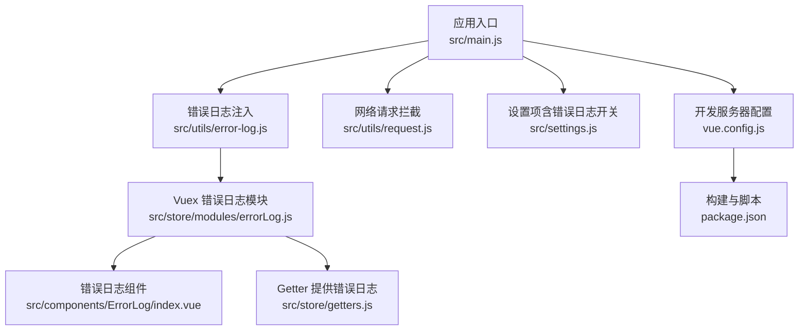
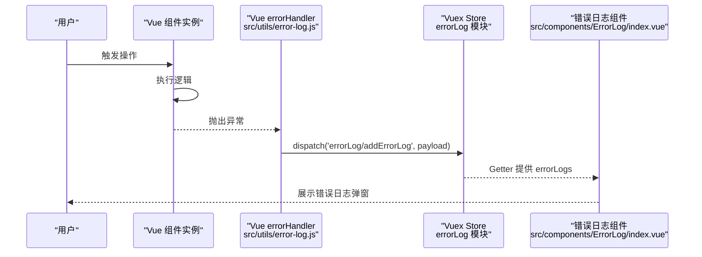
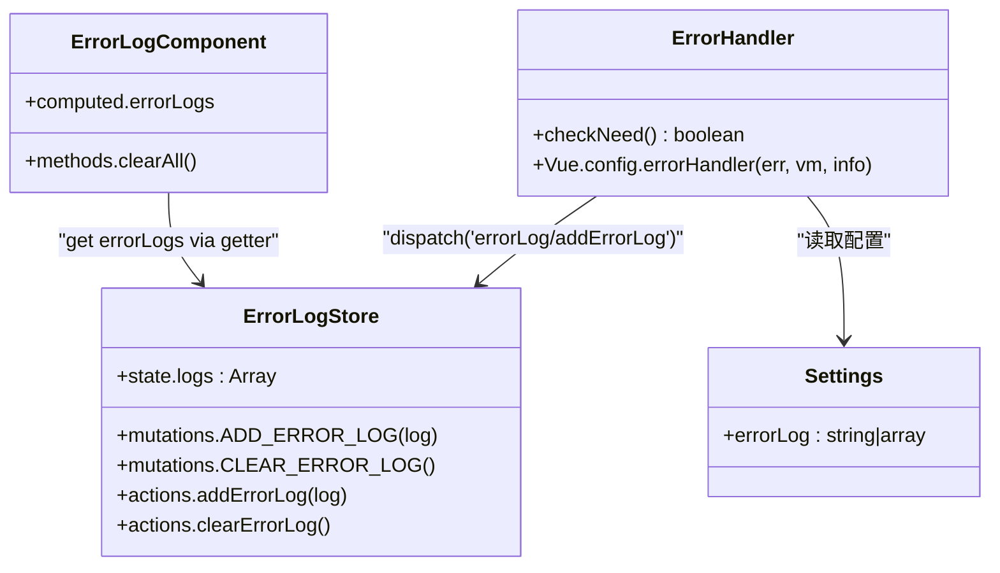
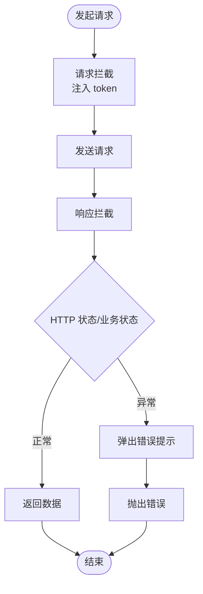
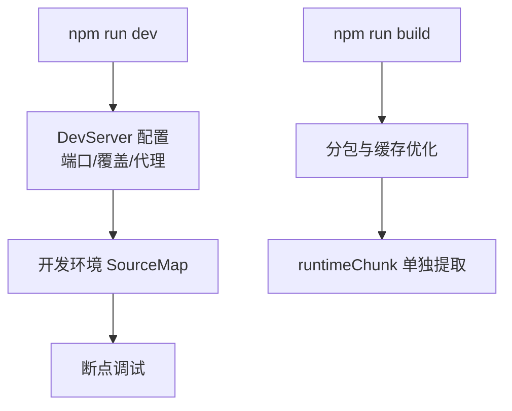
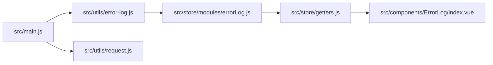
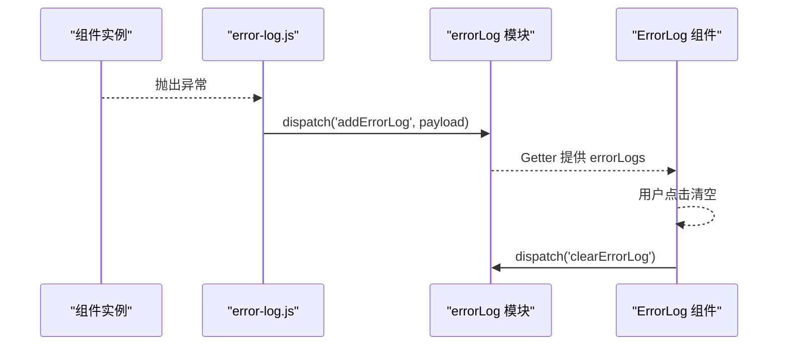

# 调试工具与技巧

<cite>
**本文引用的文件**
- [main.js](file://src/main.js)
- [error-log.js](file://src/utils/error-log.js)
- [errorLog.js](file://src/store/modules/errorLog.js)
- [index.vue](file://src/components/ErrorLog/index.vue)
- [getters.js](file://src/store/getters.js)
- [settings.js](file://src/settings.js)
- [request.js](file://src/utils/request.js)
- [vue.config.js](file://vue.config.js)
- [package.json](file://package.json)
- [README.md](file://README.md)
</cite>

## 目录
1. [简介](#简介)
2. [项目结构](#项目结构)
3. [核心组件](#核心组件)
4. [架构总览](#架构总览)
5. [详细组件分析](#详细组件分析)
6. [依赖关系分析](#依赖关系分析)
7. [性能考虑](#性能考虑)
8. [故障排除指南](#故障排除指南)
9. [结论](#结论)
10. [附录](#附录)

## 简介
本文件面向 Leisu Admin 项目的前端开发与运维人员，系统性梳理项目中的调试工具与技巧，覆盖以下主题：
- 浏览器开发者工具的高级用法：Elements、Console、Sources、Network、Performance 面板
- Vue Devtools 的安装与实战技巧：组件树、状态检查、事件追踪、性能分析
- 错误日志收集与分析系统：全局错误捕获、错误上报、错误分类、问题定位
- 断点调试与条件断点：JavaScript 断点、XHR 断点、DOM 断点、事件侦听器断点
- 移动端调试：Chrome DevTools 移动设备模式、真机调试、远程调试
- 性能分析工具：Lighthouse、Web Vitals、Bundle Analyzer 的使用与结果解读

本指南在每个环节均结合项目源码进行说明，并提供“章节来源”以便进一步查阅。

## 项目结构
Leisu Admin 基于 Vue 2 + Element UI 技术栈，采用模块化组织方式，关键调试相关模块分布如下：
- 应用入口与全局初始化：src/main.js
- 错误日志系统：src/utils/error-log.js、src/store/modules/errorLog.js、src/components/ErrorLog/index.vue、src/store/getters.js、src/settings.js
- 网络请求拦截与错误处理：src/utils/request.js
- 构建与开发服务器配置：vue.config.js
- 依赖与脚本：package.json
- 开发与运行说明：README.md

**图表来源**
- [main.js:24-24](file://src/main.js#L24-L24)
- [error-log.js:21-35](file://src/utils/error-log.js#L21-L35)
- [errorLog.js:1-29](file://src/store/modules/errorLog.js#L1-L29)
- [index.vue:1-79](file://src/components/ErrorLog/index.vue#L1-L79)
- [getters.js:14-14](file://src/store/getters.js#L14-L14)
- [settings.js:28-35](file://src/settings.js#L28-L35)
- [request.js:1-130](file://src/utils/request.js#L1-L130)
- [vue.config.js:18-155](file://vue.config.js#L18-L155)
- [package.json:7-20](file://package.json#L7-L20)

**章节来源**
- [main.js:1-526](file://src/main.js#L1-L526)
- [vue.config.js:18-155](file://vue.config.js#L18-L155)
- [package.json:1-139](file://package.json#L1-L139)
- [README.md:123-151](file://README.md#L123-L151)

## 核心组件
本节聚焦与调试密切相关的三个核心组件与机制：
- 全局错误捕获与上报：通过 Vue errorHandler 注入，结合 Vuex 模块与组件展示
- 错误日志存储与查询：Vuex 状态管理与 Getter 提供
- 请求拦截与错误提示：Axios 拦截器统一处理响应错误并提示

要点：
- 错误日志开关由 settings.js 控制，默认仅生产环境启用
- 错误被捕获后通过 store.dispatch 上报至 errorLog 模块
- 错误日志组件以弹窗表格形式展示，支持一键清空

**章节来源**
- [error-log.js:1-36](file://src/utils/error-log.js#L1-L36)
- [errorLog.js:1-29](file://src/store/modules/errorLog.js#L1-L29)
- [index.vue:1-79](file://src/components/ErrorLog/index.vue#L1-L79)
- [getters.js:14-14](file://src/store/getters.js#L14-L14)
- [settings.js:28-35](file://src/settings.js#L28-L35)
- [request.js:45-127](file://src/utils/request.js#L45-L127)

## 架构总览
下图展示了从用户交互到错误上报与展示的整体流程，以及网络请求的拦截与错误提示路径。

**图表来源**
- [error-log.js:21-35](file://src/utils/error-log.js#L21-L35)
- [errorLog.js:14-21](file://src/store/modules/errorLog.js#L14-L21)
- [index.vue:57-67](file://src/components/ErrorLog/index.vue#L57-L67)
- [getters.js:14-14](file://src/store/getters.js#L14-L14)

## 详细组件分析

### 错误日志系统（全局错误捕获与展示）
- 全局错误捕获：在 src/utils/error-log.js 中，根据 settings.js 的 errorLog 配置决定是否启用 errorHandler。当启用时，使用 Vue.nextTick 将错误异步上报至 store
- Vuex 模块：src/store/modules/errorLog.js 提供 ADD_ERROR_LOG/CLEAR_ERROR_LOG 两个 mutation 与对应 action
- Getter：src/store/getters.js 暴露 errorLogs，供组件计算属性读取
- 组件展示：src/components/ErrorLog/index.vue 以表格形式展示错误消息、信息来源、URL 与堆栈；支持一键清空

**图表来源**
- [error-log.js:10-35](file://src/utils/error-log.js#L10-L35)
- [errorLog.js:1-29](file://src/store/modules/errorLog.js#L1-L29)
- [index.vue:57-67](file://src/components/ErrorLog/index.vue#L57-L67)
- [getters.js:14-14](file://src/store/getters.js#L14-L14)
- [settings.js:28-35](file://src/settings.js#L28-L35)

**章节来源**
- [error-log.js:1-36](file://src/utils/error-log.js#L1-L36)
- [errorLog.js:1-29](file://src/store/modules/errorLog.js#L1-L29)
- [index.vue:1-79](file://src/components/ErrorLog/index.vue#L1-L79)
- [getters.js:14-14](file://src/store/getters.js#L14-L14)
- [settings.js:28-35](file://src/settings.js#L28-L35)

### 网络请求拦截与错误提示
- Axios 实例：src/utils/request.js 创建带 baseURL、withCredentials、timeout 的实例
- 请求拦截：自动注入 token（若存在）
- 响应拦截：统一处理状态码与业务 code，错误时弹出 Element UI 消息提示，并抛出错误供上层处理

**图表来源**
- [request.js:22-127](file://src/utils/request.js#L22-L127)

**章节来源**
- [request.js:1-130](file://src/utils/request.js#L1-L130)

### 构建与开发服务器配置
- 开发服务器：vue.config.js 配置端口、热重载、覆盖警告与错误显示
- 源码映射：开发环境启用 cheap-source-map，便于断点调试
- 生产优化：拆分 chunk、提取 runtime、HTML 内联 runtime

**图表来源**
- [vue.config.js:37-152](file://vue.config.js#L37-L152)
- [package.json:7-20](file://package.json#L7-L20)

**章节来源**
- [vue.config.js:18-155](file://vue.config.js#L18-L155)
- [package.json:7-20](file://package.json#L7-L20)

## 依赖关系分析
- 入口文件 main.js 引入并挂载错误日志模块，确保全局错误捕获生效
- 错误日志组件通过 Getter 读取 store 中的日志数组，形成“捕获—存储—展示”的闭环
- 网络层通过 Axios 拦截器统一处理错误，避免分散处理带来的遗漏

**图表来源**
- [main.js:24-24](file://src/main.js#L24-L24)
- [error-log.js:21-35](file://src/utils/error-log.js#L21-L35)
- [errorLog.js:14-21](file://src/store/modules/errorLog.js#L14-L21)
- [getters.js:14-14](file://src/store/getters.js#L14-L14)
- [index.vue:57-67](file://src/components/ErrorLog/index.vue#L57-L67)
- [request.js:22-127](file://src/utils/request.js#L22-L127)

**章节来源**
- [main.js:24-24](file://src/main.js#L24-L24)
- [error-log.js:21-35](file://src/utils/error-log.js#L21-L35)
- [errorLog.js:14-21](file://src/store/modules/errorLog.js#L14-L21)
- [getters.js:14-14](file://src/store/getters.js#L14-L14)
- [index.vue:57-67](file://src/components/ErrorLog/index.vue#L57-L67)
- [request.js:22-127](file://src/utils/request.js#L22-L127)

## 性能考虑
- 开发环境启用 SourceMap 便于断点调试与堆栈定位
- 生产环境开启分包策略与 runtime 单独提取，减少首屏体积与缓存命中
- Axios 设置合理超时时间，避免长时间阻塞影响用户体验
- 建议结合 Lighthouse 与 Web Vitals 对关键页面进行持续监控

[本节为通用指导，无需“章节来源”]

## 故障排除指南

### 浏览器开发者工具高级用法
- Elements 面板
  - 使用选择器与层级结构快速定位 DOM，配合“Break on”在元素变更时中断
  - 结合“Copy unique selector”快速复现问题
- Console 面板
  - 使用断点触发后在 Console 输入变量名查看上下文
  - 使用 $0/$1 等快捷方式访问最近选中的 DOM 或元素
- Sources 面板
  - 设置条件断点：右键断点选择“Edit breakpoint”，输入表达式
  - 使用“Async call stack”查看异步调用链
- Network 面板
  - 过滤 XHR/Fetch，查看请求头与响应体，结合“Preserve log”排查跨域与鉴权问题
  - 使用“Timing”卡顿分析定位慢请求
- Performance 面板
  - 录制页面交互，观察主线程占用、布局与绘制开销
  - 关注长任务与频繁重排，结合源码定位热点函数

[本节为通用指导，无需“章节来源”]

### Vue Devtools 安装与使用
- 安装
  - Chrome 扩展或浏览器内嵌 Vue Devtools
  - 确保在开发环境加载，生产环境可通过设置关闭
- 组件树查看
  - 查看组件层级、props、data、生命周期钩子
- 状态检查
  - 在 Vuex 面板查看 state、mutations、actions 的执行轨迹
- 事件追踪
  - 在 Event 面板查看组件事件流，定位事件冒泡与重复绑定
- 性能分析
  - 使用“Profiling”录制组件渲染，识别不必要的重渲染

[本节为通用指导，无需“章节来源”]

### 错误日志收集与分析系统
- 全局错误捕获
  - 在 src/utils/error-log.js 中，根据 settings.js 的 errorLog 配置决定是否启用 errorHandler
  - 使用 Vue.nextTick 将错误异步上报，避免同步抛错导致的二次异常
- 错误上报
  - 通过 store.dispatch('errorLog/addErrorLog', payload) 将错误写入 store
  - payload 包含 err、vm、info、url 等字段，便于定位
- 错误分类与定位
  - 在 src/components/ErrorLog/index.vue 中，按消息、来源、URL、堆栈分类展示
  - 结合 Network 面板核对 URL 与接口返回
- 清理与复盘
  - 支持一键清空，便于区分新旧问题
  - 建议将错误日志导出到后端或日志平台，进行趋势分析

**图表来源**
- [error-log.js:21-35](file://src/utils/error-log.js#L21-L35)
- [errorLog.js:14-21](file://src/store/modules/errorLog.js#L14-L21)
- [index.vue:57-67](file://src/components/ErrorLog/index.vue#L57-L67)

**章节来源**
- [error-log.js:1-36](file://src/utils/error-log.js#L1-L36)
- [errorLog.js:1-29](file://src/store/modules/errorLog.js#L1-L29)
- [index.vue:1-79](file://src/components/ErrorLog/index.vue#L1-L79)
- [getters.js:14-14](file://src/store/getters.js#L14-L14)
- [settings.js:28-35](file://src/settings.js#L28-L35)

### 断点调试与条件断点
- JavaScript 断点
  - 在 Sources 面板设置行断点，或在代码中使用 debugger
- XHR 断点
  - 在 Event Listener Breakpoints 中勾选 XMLHttpRequest，拦截特定请求
- DOM 断点
  - 右键元素选择“Break on”： subtree modifications / attributes modifications / node removal
- 事件侦听器断点
  - 在 Event Listener Breakpoints 中勾选对应的事件类型，如 click、change 等

[本节为通用指导，无需“章节来源”]

### 移动端调试
- Chrome DevTools 移动设备模式
  - 打开 Elements 面板，点击“Toggle device toolbar”，选择目标机型
  - 使用 Touch 样式与触摸事件模拟
- 真机调试
  - 启用手机开发者选项与 USB 调试，连接电脑后使用 Chrome DevTools 的“Remote Devices”
- 远程调试
  - 通过内网 IP 访问开发服务器，使用同一局域网内的设备进行联调

[本节为通用指导，无需“章节来源”]

### 性能分析工具
- Lighthouse
  - 在 Chrome 扩展或命令行中运行，生成性能、可访问性、最佳实践报告
  - 关注首次内容绘制（FCP）、最大内容绘制（LCP）、累积布局偏移（CLS）等指标
- Web Vitals
  - 在 Chrome DevTools Performance 面板与 Navigation Timing 中查看核心指标
  - 结合构建配置优化首屏资源与关键渲染路径
- Bundle Analyzer
  - 通过 vue.config.js 的 splitChunks 与 runtime 提取，结合分析工具定位大体积模块
  - 优化第三方库按需引入与缓存策略

[本节为通用指导，无需“章节来源”]

## 结论
通过将全局错误捕获、Vuex 日志管理与可视化组件相结合，Leisu Admin 已具备完善的前端错误诊断能力。配合浏览器开发者工具、Vue Devtools 与性能分析工具，可高效完成断点调试、移动端联调与性能优化。建议团队在日常开发中：
- 明确错误日志开关策略，确保问题可追溯
- 使用条件断点与事件侦听器断点快速定位交互问题
- 定期运行 Lighthouse 与 Web Vitals，建立性能基线
- 在移动端模式与真机环境下进行回归测试

[本节为总结性内容，无需“章节来源”]

## 附录
- 开发与构建脚本：见 package.json scripts
- 开发服务器端口与覆盖行为：见 vue.config.js devServer
- 项目启动与访问：见 README.md

**章节来源**
- [package.json:7-20](file://package.json#L7-L20)
- [vue.config.js:37-59](file://vue.config.js#L37-L59)
- [README.md:123-151](file://README.md#L123-L151)