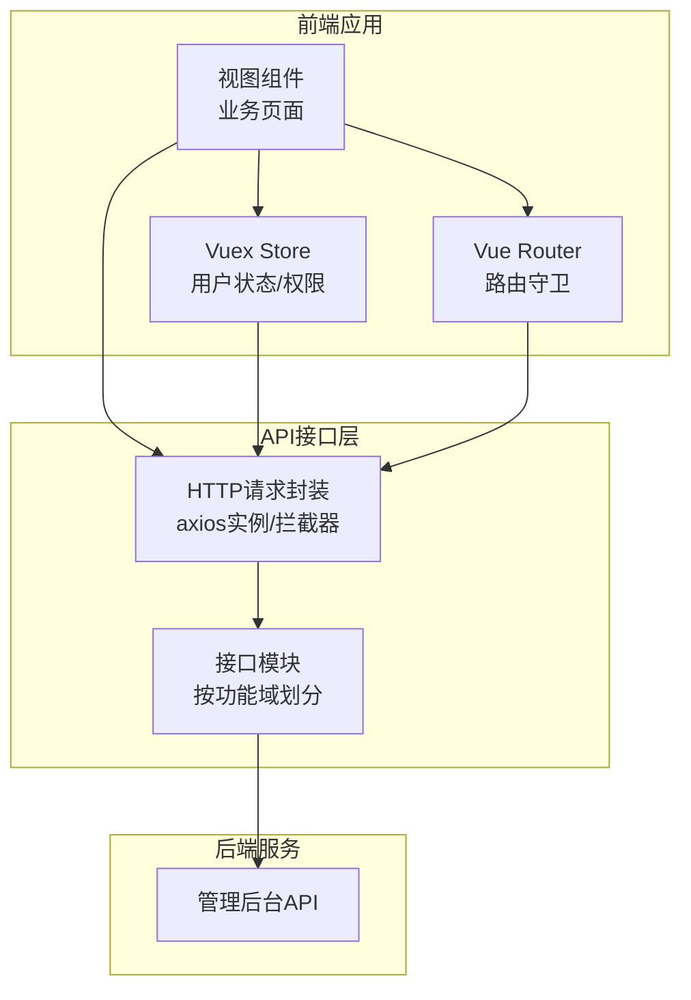
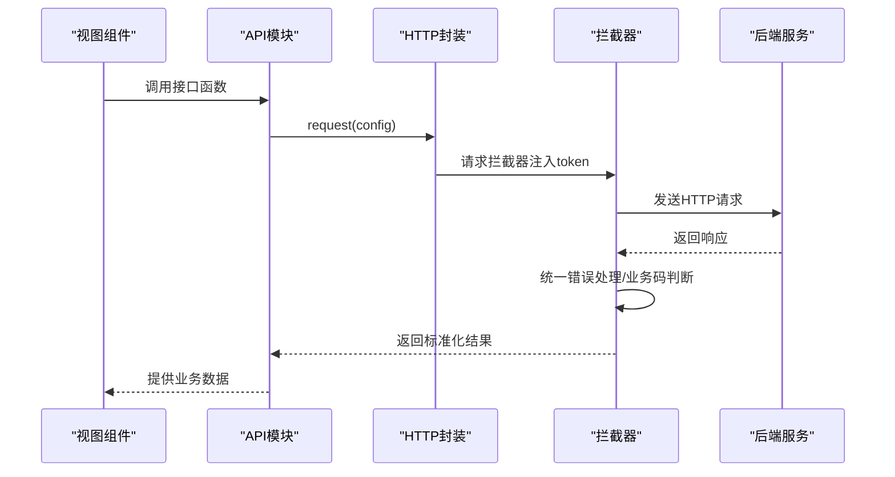
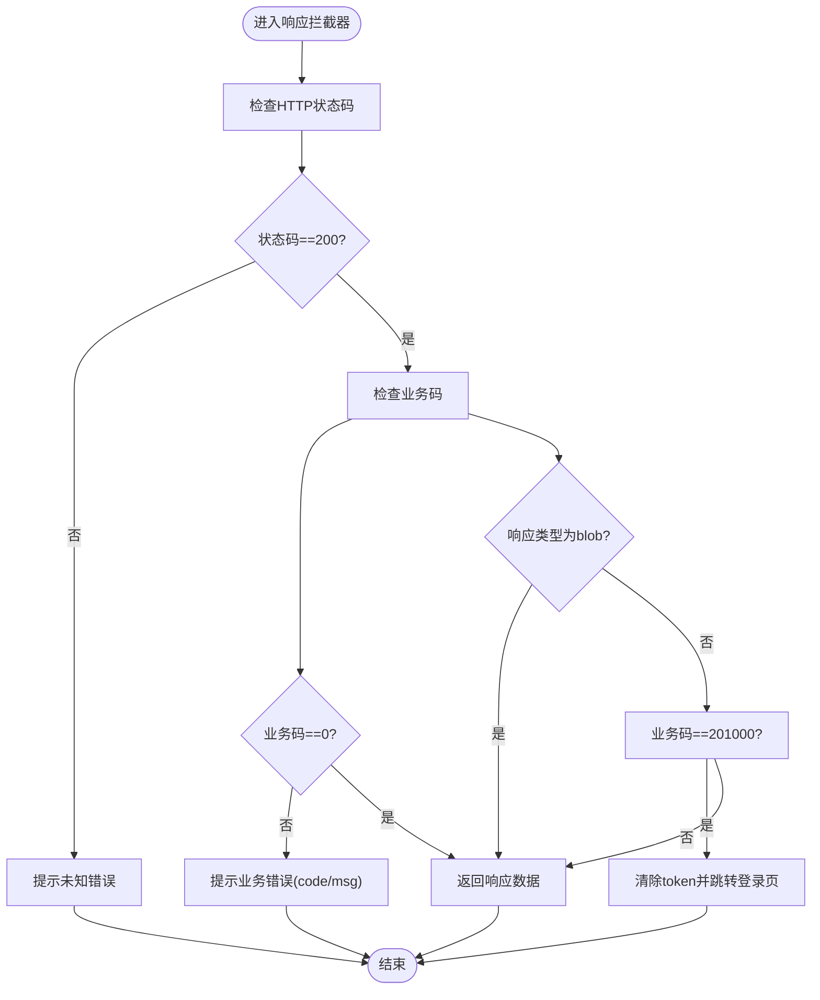
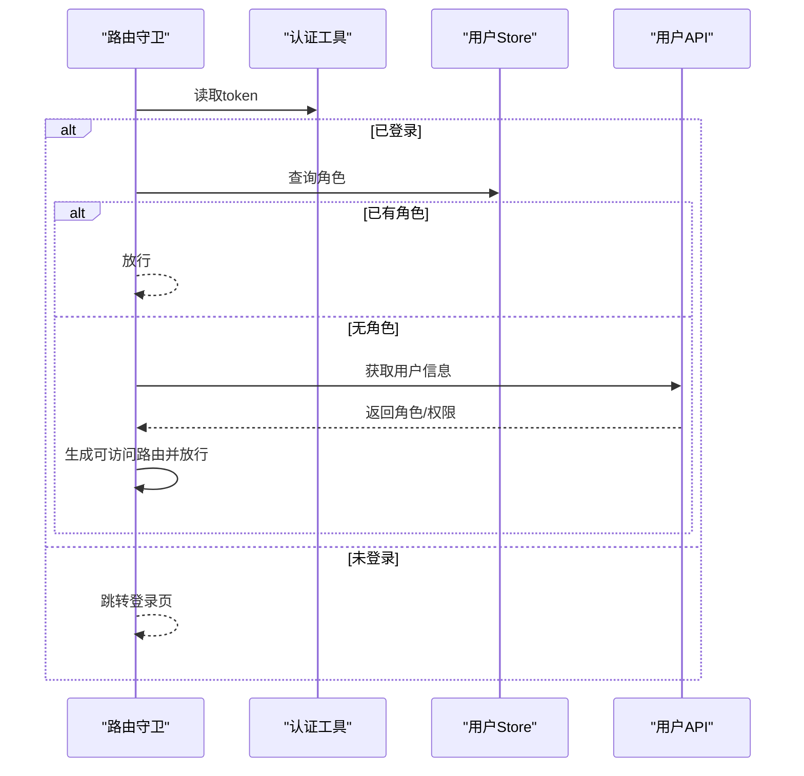
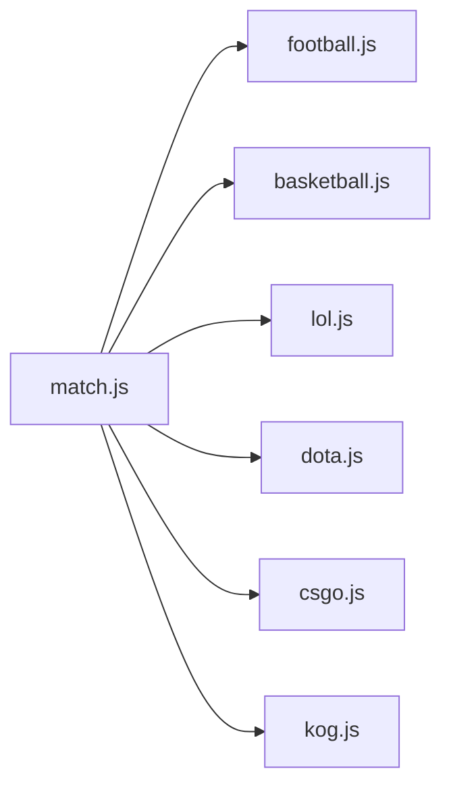
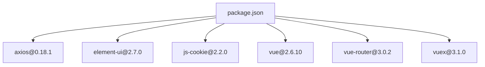

# API接口层

<cite>
**本文档引用的文件**
- [request.js](file://src/utils/request.js)
- [auth.js](file://src/utils/auth.js)
- [user.js](file://src/api/user.js)
- [member.js](file://src/api/member.js)
- [match.js](file://src/api/match.js)
- [football.js](file://src/api/matchapi/ball/football.js)
- [lol.js](file://src/api/matchapi/game/lol.js)
- [mock-server.js](file://mock/mock-server.js)
- [main.js](file://src/main.js)
- [permission.js](file://src/permission.js)
- [user.js](file://src/store/modules/user.js)
- [package.json](file://package.json)
- [vue.config.js](file://vue.config.js)
</cite>

## 目录
1. [简介](#简介)
2. [项目结构](#项目结构)
3. [核心组件](#核心组件)
4. [架构总览](#架构总览)
5. [详细组件分析](#详细组件分析)
6. [依赖关系分析](#依赖关系分析)
7. [性能考量](#性能考量)
8. [故障排查指南](#故障排查指南)
9. [结论](#结论)
10. [附录](#附录)

## 简介
本文件系统性梳理 Leisu Admin 项目的 API 接口层设计与实现，覆盖以下主题：
- HTTP 请求封装与拦截器机制
- 接口模块化组织与命名规范
- 认证与权限控制流程
- 错误处理与重试策略
- 并发请求、请求取消与缓存建议
- 接口测试与调试方法
- 与后端 API 的对接规范

## 项目结构
API 接口层主要由三部分构成：
- HTTP 请求封装层：基于 axios 的实例化与拦截器
- 接口模块层：按功能域划分的 API 文件，遵循“领域/子域/具体接口”的目录结构
- 认证与权限层：token 管理、路由守卫与用户信息获取

图表来源
- [request.js:22-129](file://src/utils/request.js#L22-L129)
- [user.js:1-37](file://src/api/user.js#L1-L37)
- [member.js:1-20](file://src/api/member.js#L1-L20)
- [match.js:1-18](file://src/api/match.js#L1-L18)
- [permission.js:13-75](file://src/permission.js#L13-L75)

章节来源
- [request.js:1-130](file://src/utils/request.js#L1-L130)
- [user.js:1-37](file://src/api/user.js#L1-L37)
- [member.js:1-20](file://src/api/member.js#L1-L20)
- [match.js:1-18](file://src/api/match.js#L1-L18)
- [permission.js:1-82](file://src/permission.js#L1-L82)

## 核心组件
- axios 实例与拦截器
  - 基础配置：baseURL 动态切换、withCredentials、timeout
  - 请求拦截器：自动注入 token
  - 响应拦截器：统一错误提示、业务状态码处理、401 登录态失效处理
- 认证与权限
  - token 存取：localStorage
  - 路由守卫：登录态校验、角色加载、白名单放行
  - 用户信息：登录后拉取用户权限并生成可访问路由
- 接口模块化
  - 通用接口：用户、成员、消息等
  - 功能域接口：match 下按球类/游戏细分
  - 导出聚合：match.js 统一导出各子模块接口

章节来源
- [request.js:10-26](file://src/utils/request.js#L10-L26)
- [request.js:28-43](file://src/utils/request.js#L28-L43)
- [request.js:45-127](file://src/utils/request.js#L45-L127)
- [auth.js:1-17](file://src/utils/auth.js#L1-L17)
- [permission.js:13-75](file://src/permission.js#L13-L75)
- [user.js:139-336](file://src/store/modules/user.js#L139-L336)
- [match.js:1-18](file://src/api/match.js#L1-L18)

## 架构总览
从调用链路看，前端组件通过 API 模块发起请求，经由 axios 实例与拦截器处理，再由后端返回统一结构的数据。

图表来源
- [user.js:3-8](file://src/api/user.js#L3-L8)
- [request.js:28-68](file://src/utils/request.js#L28-L68)
- [request.js:69-127](file://src/utils/request.js#L69-L127)

## 详细组件分析

### HTTP 请求封装与拦截器
- 实例化与基础配置
  - baseURL 根据部署环境动态选择，支持 admin-w.leisu.com 与 admin.leisudata.com 场景
  - withCredentials 允许跨域携带 Cookie
  - timeout 设置为 50000ms
- 请求拦截器
  - 若存在 token，则在请求头注入 token 字段
- 响应拦截器
  - 状态码非 200 统一提示
  - 业务码 201000 触发登出并跳转首页
  - 非 blob 类型响应且 code 非 0 时弹出错误提示
  - 对常见 HTTP 错误码映射为用户可读提示

图表来源
- [request.js:45-127](file://src/utils/request.js#L45-L127)

章节来源
- [request.js:10-26](file://src/utils/request.js#L10-L26)
- [request.js:28-43](file://src/utils/request.js#L28-L43)
- [request.js:45-127](file://src/utils/request.js#L45-L127)

### 认证与权限控制
- token 管理
  - 采用 localStorage 存储 token，键名为 aToken
  - 登录成功写入 token，退出登录或异常时清除
- 路由守卫
  - 白名单放行：/login、/auth-redirect
  - 无 token 时跳转登录页并携带 redirect 参数
  - 有 token 但未获取角色时，调用用户信息接口拉取权限并生成可访问路由
- 用户信息与权限扩展
  - 登录成功后调用用户信息接口，解析角色与权限列表
  - 根据权限动态注入特定路由（如日志页面、报表权限等）

图表来源
- [permission.js:13-75](file://src/permission.js#L13-L75)
- [auth.js:1-17](file://src/utils/auth.js#L1-L17)
- [user.js:139-336](file://src/store/modules/user.js#L139-L336)

章节来源
- [auth.js:1-17](file://src/utils/auth.js#L1-L17)
- [permission.js:13-75](file://src/permission.js#L13-L75)
- [user.js:139-336](file://src/store/modules/user.js#L139-L336)

### 接口模块化组织与命名规范
- 通用模块
  - 用户：登录、钉钉登录、获取用户信息、验证码、退出登录
  - 成员：用户列表、详情、封禁/解封、设备/地址、标签、报表等
- 功能域模块
  - match：统一导出各球类与游戏接口
  - 球类：football、basketball、volleyball 等
  - 游戏：lol、dota、csgo、kog 等
- 命名规范
  - 函数命名以领域/子域/动作形式呈现，如 football_match_list、lol_match_list
  - GET/POST 明确指定 method
  - 路径统一以 /v1/admin/{domain}/{endpoint} 形式

图表来源
- [match.js:1-18](file://src/api/match.js#L1-L18)
- [football.js:1-20](file://src/api/matchapi/ball/football.js#L1-L20)
- [lol.js:1-20](file://src/api/matchapi/game/lol.js#L1-L20)

章节来源
- [user.js:1-37](file://src/api/user.js#L1-L37)
- [member.js:1-20](file://src/api/member.js#L1-L20)
- [match.js:1-18](file://src/api/match.js#L1-L18)
- [football.js:1-20](file://src/api/matchapi/ball/football.js#L1-L20)
- [lol.js:1-20](file://src/api/matchapi/game/lol.js#L1-L20)

### 错误处理与重试机制
- 错误处理
  - HTTP 状态码映射为用户可读提示
  - 业务码 201000 触发登出与跳转
  - 非 blob 类型响应统一弹窗提示
- 重试机制
  - 当前未实现自动重试；可在业务层结合业务场景增加指数退避重试

章节来源
- [request.js:69-127](file://src/utils/request.js#L69-L127)

### 并发请求、请求取消与缓存策略
- 并发请求
  - 使用 Promise.all 或 Promise.allSettled 并行调用多个接口
- 请求取消
  - 可通过 AbortController 在组件卸载或路由切换时取消未完成请求
- 缓存策略
  - 无内置缓存；建议对只读列表与静态字典类接口增加内存缓存与失效时间

章节来源
- [request.js:22-26](file://src/utils/request.js#L22-L26)

### 接口测试与调试
- Mock 服务
  - mock-server.js 监听 mock 目录变化热更新路由
  - 支持开发环境启用代理或热加载 mock
- 调试建议
  - 开启浏览器 Network 面板观察请求头 token 注入
  - 在响应拦截器中打印关键字段用于定位问题
  - 使用 Vue Devtools 观察 store 中 token 与用户信息状态

章节来源
- [mock-server.js:1-69](file://mock/mock-server.js#L1-L69)
- [vue.config.js:37-59](file://vue.config.js#L37-L59)

## 依赖关系分析
- axios 版本：0.18.1
- Element-UI：2.7.0，用于消息提示与 UI 组件
- js-cookie：2.2.0，用于 token 存取
- 运行时依赖：vue、vuex、vue-router 等

图表来源
- [package.json:37-96](file://package.json#L37-L96)

章节来源
- [package.json:37-96](file://package.json#L37-L96)

## 性能考量
- 请求超时：50000ms，适合长耗时任务；短接口可适当下调
- 跨域携带 Cookie：确保后端正确配置 CORS
- 路由懒加载：配合路由守卫与权限生成，减少初始包体
- 图片与资源：全局 CDN 前缀与组件级前缀处理，降低带宽与延迟

章节来源
- [request.js:10-26](file://src/utils/request.js#L10-L26)
- [main.js:375-441](file://src/main.js#L375-L441)

## 故障排查指南
- 登录后仍提示未授权
  - 检查 token 是否写入 localStorage
  - 确认请求拦截器已注入 token
  - 核对后端返回业务码是否为 0
- 401 未授权频繁跳转登录页
  - 检查响应拦截器对 201000 的处理逻辑
  - 确认后端会话有效期与刷新策略
- 接口报错提示不明确
  - 检查响应拦截器对非 blob 类型的错误提示
  - 在开发环境开启详细日志输出

章节来源
- [auth.js:1-17](file://src/utils/auth.js#L1-L17)
- [request.js:45-127](file://src/utils/request.js#L45-L127)
- [permission.js:13-75](file://src/permission.js#L13-L75)

## 结论
Leisu Admin 的 API 接口层以 axios 为核心，通过统一的请求/响应拦截器实现了跨域、认证、错误处理与业务码治理。接口模块按功能域清晰划分，便于维护与扩展。建议在现有基础上补充自动重试、请求取消与缓存策略，并完善接口测试与 Mock 流程，以进一步提升稳定性与开发效率。

## 附录
- 环境变量与代理
  - publicPath 由 VUE_APP_BASE_PATH 控制
  - devServer 支持代理配置与 mock 热加载（当前注释）
- 域名与跳转
  - 提供移动端与 PC 端域名映射，支持开发/生产环境切换

章节来源
- [vue.config.js:26-59](file://vue.config.js#L26-L59)
- [main.js:375-417](file://src/main.js#L375-L417)