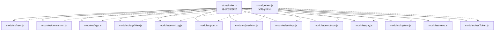
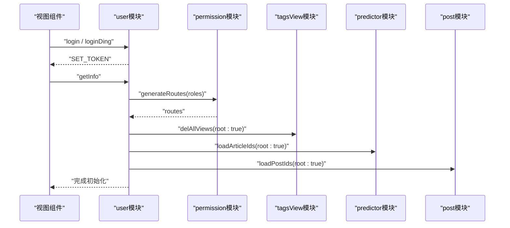
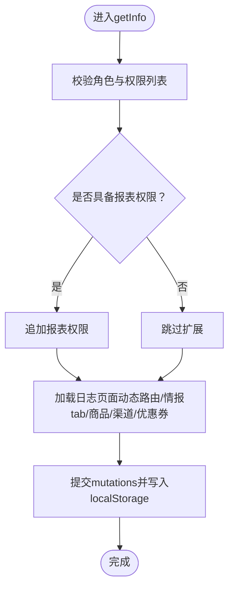
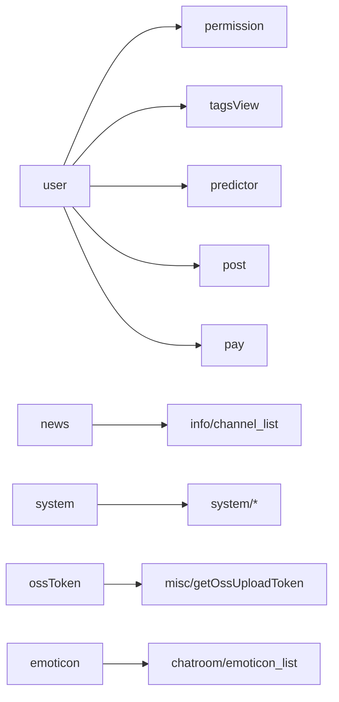

# Vuex状态管理

<cite>
**本文引用的文件**
- [src/store/index.js](file://src/store/index.js)
- [src/store/getters.js](file://src/store/getters.js)
- [src/store/modules/user.js](file://src/store/modules/user.js)
- [src/store/modules/permission.js](file://src/store/modules/permission.js)
- [src/store/modules/app.js](file://src/store/modules/app.js)
- [src/store/modules/tagsView.js](file://src/store/modules/tagsView.js)
- [src/store/modules/errorLog.js](file://src/store/modules/errorLog.js)
- [src/store/modules/post.js](file://src/store/modules/post.js)
- [src/store/modules/predictor.js](file://src/store/modules/predictor.js)
- [src/store/modules/settings.js](file://src/store/modules/settings.js)
- [src/store/modules/emoticon.js](file://src/store/modules/emoticon.js)
- [src/store/modules/pay.js](file://src/store/modules/pay.js)
- [src/store/modules/system.js](file://src/store/modules/system.js)
- [src/store/modules/news.js](file://src/store/modules/news.js)
- [src/store/modules/ossToken.js](file://src/store/modules/ossToken.js)
</cite>

## 目录
1. [简介](#简介)
2. [项目结构](#项目结构)
3. [核心组件](#核心组件)
4. [架构总览](#架构总览)
5. [详细组件分析](#详细组件分析)
6. [依赖分析](#依赖分析)
7. [性能考量](#性能考量)
8. [故障排查指南](#故障排查指南)
9. [结论](#结论)
10. [附录](#附录)

## 简介
本文件面向Leisu Admin项目的前端工程团队与维护者，系统性梳理并解读基于Vuex的状态管理方案。内容涵盖：
- 自动加载模块系统与命名空间管理
- 模块间通信机制与跨模块调用
- 核心模块职责与边界：用户状态、权限控制、应用配置、消息通知、预测文章高亮、帖子浏览记录、表情包、支付优惠券、系统权限与资讯频道、OSS上传令牌等
- 状态持久化策略：localStorage/sessionStorage的使用、状态恢复与数据同步
- getter计算属性设计模式：派生状态、复杂筛选与性能优化
- 最佳实践：mutation规范、action异步处理、模块化设计原则
- 常见问题与调试技巧

## 项目结构
本项目采用“自动加载 + 命名空间”的模块化组织方式：
- store入口通过Webpack的require.context自动扫描modules目录下的所有模块，并以模块名为键注入Store
- 所有模块均启用namespaced，避免命名冲突
- 全局getters集中导出，便于在组件中按命名空间访问

图表来源
- [src/store/index.js:1-26](file://src/store/index.js#L1-L26)
- [src/store/getters.js:1-33](file://src/store/getters.js#L1-L33)

章节来源
- [src/store/index.js:1-26](file://src/store/index.js#L1-L26)
- [src/store/getters.js:1-33](file://src/store/getters.js#L1-L33)

## 核心组件
- 自动加载模块系统
  - 使用require.context遍历modules目录，动态注册模块，减少手动import开销
  - 通过模块名作为命名空间键，确保模块隔离
- 命名空间管理
  - 所有模块均设置namespaced: true，组件通过$store.dispatch/commit时需携带{root: true}访问根模块或明确模块路径
- 全局getters
  - 提供对常用状态的统一访问入口，如sidebar、device、visitedViews、cachedViews、token、roles、permission_routes等

章节来源
- [src/store/index.js:7-23](file://src/store/index.js#L7-L23)
- [src/store/getters.js:1-33](file://src/store/getters.js#L1-L33)

## 架构总览
下图展示了模块间的典型交互：用户登录后拉取信息、生成路由、清理标签页、持久化商品与渠道等；预测模块与帖子模块分别负责文章高亮与浏览记录的本地持久化。

图表来源
- [src/store/modules/user.js:141-358](file://src/store/modules/user.js#L141-L358)
- [src/store/modules/permission.js:50-57](file://src/store/modules/permission.js#L50-L57)
- [src/store/modules/tagsView.js:91-173](file://src/store/modules/tagsView.js#L91-L173)
- [src/store/modules/predictor.js:44-80](file://src/store/modules/predictor.js#L44-L80)
- [src/store/modules/post.js:74-104](file://src/store/modules/post.js#L74-L104)

## 详细组件分析

### 用户状态模块（user）
- 职责
  - 登录/登出/切换角色
  - 拉取用户信息并派生权限列表
  - 初始化商品列表、交易商品列表、渠道信息、智能体标签等
  - 马甲号池管理（随机与社区）
- 关键点
  - token持久化至localStorage，退出时清除并重置路由
  - 权限列表扩展：媒体报表、专家报表、社区流水等
  - 异步加载：日志页面动态路由、情报tab、商品列表、渠道、优惠券等
  - 跨模块调用：调用pay与predictor模块的本地缓存初始化

图表来源
- [src/store/modules/user.js:173-336](file://src/store/modules/user.js#L173-L336)

章节来源
- [src/store/modules/user.js:13-542](file://src/store/modules/user.js#L13-L542)

### 权限控制模块（permission）
- 职责
  - 基于角色递归过滤异步路由
  - 将过滤后的路由合并至常量路由，形成最终可用路由表
- 关键点
  - generateRoutes返回Promise，供用户模块在切换角色后重新生成并注入路由

章节来源
- [src/store/modules/permission.js:16-66](file://src/store/modules/permission.js#L16-L66)

### 应用配置模块（app）
- 职责
  - 控制侧边栏开关、设备类型、主题尺寸、全局loading状态
  - 侧边栏与尺寸变更写入Cookie，实现轻量持久化
- 关键点
  - TOGGLE_SIDEBAR/CLOSE_SIDEBAR会同步Cookie状态

章节来源
- [src/store/modules/app.js:1-65](file://src/store/modules/app.js#L1-L65)

### 标签页模块（tagsView）
- 职责
  - 维护已访问视图与缓存视图集合
  - 支持params路由去重、机器人相关路由隔离、固定标签页保留
- 关键点
  - params_main元信息用于同一params主键的路由覆盖
  - 支持清空、删除其他、删除全部等操作

章节来源
- [src/store/modules/tagsView.js:1-182](file://src/store/modules/tagsView.js#L1-L182)

### 错误日志模块（errorLog）
- 职责
  - 记录运行时错误日志，支持清空
- 关键点
  - 与ErrorLog组件配合，统一收集组件抛出的错误

章节来源
- [src/store/modules/errorLog.js:1-29](file://src/store/modules/errorLog.js#L1-L29)

### 预测文章高亮模块（predictor）
- 职责
  - 单关/串关/足彩文章ID高亮本地持久化
  - 支持批量加载与增量写入，上限500条，超出时淘汰最早项
- 关键点
  - 本地键区分三类文章类型，写入时统一try/catch保护

章节来源
- [src/store/modules/predictor.js:1-88](file://src/store/modules/predictor.js#L1-L88)

### 帖子浏览记录模块（post）
- 职责
  - 记录窗口内帖子ID列表，上限500条
  - 从localStorage恢复历史ID列表，兼容旧字段
- 关键点
  - 增量添加时自动淘汰最旧项，保证内存占用可控

章节来源
- [src/store/modules/post.js:1-113](file://src/store/modules/post.js#L1-L113)

### 设置模块（settings）
- 职责
  - 主题、标签页、固定头部、侧边栏Logo等UI设置
- 关键点
  - 通过CHANGE_SETTING统一修改

章节来源
- [src/store/modules/settings.js:1-35](file://src/store/modules/settings.js#L1-L35)

### 表情包模块（emoticon）
- 职责
  - 拉取表情列表并缓存，提供编辑器与富文本回显两种格式化输出
  - 支持按tab type隐藏特定分组
- 关键点
  - 深拷贝避免组件直接修改缓存
  - getList/setEmoticonMap按场景选择缓存或强制刷新

章节来源
- [src/store/modules/emoticon.js:1-156](file://src/store/modules/emoticon.js#L1-L156)

### 支付模块（pay）
- 职责
  - 优惠券类型映射本地缓存与同步
- 关键点
  - 本地键存储优惠券类型映射，减少重复请求

章节来源
- [src/store/modules/pay.js:1-33](file://src/store/modules/pay.js#L1-L33)

### 系统模块（system）
- 职责
  - 权限列表与用户组列表的拉取与过滤
  - 基于当前用户角色过滤可分配权限组与用户组
- 关键点
  - 过滤逻辑区分超级管理员与普通管理员，返回可配置的权限组与用户组

章节来源
- [src/store/modules/system.js:1-186](file://src/store/modules/system.js#L1-L186)

### 资讯频道模块（news）
- 职责
  - 资讯频道列表的去重、格式化、并发请求复用与缓存
- 关键点
  - 基于name去重，isLoading与pendingPromise避免并发重复请求

章节来源
- [src/store/modules/news.js:1-112](file://src/store/modules/news.js#L1-L112)

### OSS上传令牌模块（ossToken）
- 职责
  - 获取/刷新STS Token，解析过期时间，提供并发防抖
- 关键点
  - isTokenValidForAWhile与bufferMs保障刷新时机；isRefreshingToken避免并发刷新

章节来源
- [src/store/modules/ossToken.js:1-124](file://src/store/modules/ossToken.js#L1-L124)

## 依赖分析
- 模块耦合
  - user模块对permission、tagsView、pay、predictor、post存在跨模块调用，体现“用户初始化”阶段的协同
  - news、system、ossToken、pay等模块相对独立，主要依赖外部API
- 命名空间与导入
  - 所有模块namespaced: true，组件通过模块路径或{root: true}访问
- 外部依赖
  - js-cookie用于app模块的轻量持久化
  - localStorage用于predictor、post、pay、user等模块的数据持久化

图表来源
- [src/store/modules/user.js:324-328](file://src/store/modules/user.js#L324-L328)
- [src/store/modules/news.js:62-88](file://src/store/modules/news.js#L62-L88)
- [src/store/modules/system.js:44-55](file://src/store/modules/system.js#L44-L55)
- [src/store/modules/ossToken.js:93-101](file://src/store/modules/ossToken.js#L93-L101)
- [src/store/modules/emoticon.js:104-107](file://src/store/modules/emoticon.js#L104-L107)

章节来源
- [src/store/modules/user.js:324-328](file://src/store/modules/user.js#L324-L328)
- [src/store/modules/news.js:47-103](file://src/store/modules/news.js#L47-L103)
- [src/store/modules/system.js:22-177](file://src/store/modules/system.js#L22-L177)
- [src/store/modules/ossToken.js:79-109](file://src/store/modules/ossToken.js#L79-L109)
- [src/store/modules/emoticon.js:103-148](file://src/store/modules/emoticon.js#L103-L148)

## 性能考量
- 计算属性与派生状态
  - getters.js提供对常用状态的统一访问，避免组件重复拼装
  - 对复杂筛选建议在actions中进行，避免在模板中直接执行昂贵计算
- 本地缓存与上限控制
  - predictor与post模块对本地列表设置上限并淘汰最旧项，避免内存膨胀
- 并发请求复用
  - news模块通过pendingPromise与isLoading避免并发重复请求
- Cookie与LocalStorage的选择
  - app模块使用Cookie做轻量持久化（侧边栏、尺寸），其他模块使用localStorage做业务数据持久化
- 渲染与更新粒度
  - tagsView对params路由进行覆盖而非重复push，减少渲染负担

[本节为通用指导，不直接分析具体文件]

## 故障排查指南
- 登录后无路由
  - 检查user模块是否正确调用permission.generateRoutes并注入路由
  - 确认角色列表包含有效权限
- 侧边栏/尺寸不生效
  - 检查Cookie写入与读取逻辑
- 文章高亮/浏览记录丢失
  - 检查localStorage键是否存在与格式是否正确
  - predictor与post模块的上限与淘汰逻辑
- 表情包不显示
  - 检查emoticon模块是否成功缓存列表，或强制刷新（type=-1）
- OSS上传失败
  - 检查ossToken是否过期或刷新并发冲突，必要时forceRefresh=true
- 错误日志未收集
  - 确认ErrorLog组件是否正确调用addErrorLog

章节来源
- [src/store/modules/user.js:370-392](file://src/store/modules/user.js#L370-L392)
- [src/store/modules/app.js:13-38](file://src/store/modules/app.js#L13-L38)
- [src/store/modules/predictor.js:67-79](file://src/store/modules/predictor.js#L67-L79)
- [src/store/modules/post.js:74-104](file://src/store/modules/post.js#L74-L104)
- [src/store/modules/emoticon.js:124-148](file://src/store/modules/emoticon.js#L124-L148)
- [src/store/modules/ossToken.js:79-109](file://src/store/modules/ossToken.js#L79-L109)
- [src/store/modules/errorLog.js:15-21](file://src/store/modules/errorLog.js#L15-L21)

## 结论
本项目通过自动加载模块与命名空间实现了清晰的模块边界与可维护性；通过localStorage与Cookie实现关键状态的持久化；通过getters统一派生状态，降低组件复杂度。建议在后续迭代中：
- 对复杂筛选逻辑进一步下沉至actions或工具函数
- 对高频读取的派生状态考虑memoization
- 对跨模块调用增加统一的事件总线或集中调度器，降低隐式耦合

[本节为总结性内容，不直接分析具体文件]

## 附录

### 状态持久化策略
- localStorage
  - predictor：单关/串关/足彩文章ID列表
  - post：帖子ID列表
  - pay：优惠券类型映射
  - user：商品列表、渠道数据、情报tab列表等
- sessionStorage/Cookie
  - app：侧边栏开关、尺寸
- 策略要点
  - 写入前统一try/catch，失败时降级处理
  - 读取时提供默认值与兼容逻辑（如post模块对旧键的兼容）

章节来源
- [src/store/modules/predictor.js:67-79](file://src/store/modules/predictor.js#L67-L79)
- [src/store/modules/post.js:74-104](file://src/store/modules/post.js#L74-L104)
- [src/store/modules/pay.js:14-25](file://src/store/modules/pay.js#L14-L25)
- [src/store/modules/user.js:298-319](file://src/store/modules/user.js#L298-L319)
- [src/store/modules/app.js:13-38](file://src/store/modules/app.js#L13-L38)

### Getter设计模式
- 设计原则
  - 保持无副作用，仅做状态投影与简单组合
  - 对复杂筛选在actions中完成，getters仅做轻量聚合
  - 对大数组的筛选建议在actions中完成，避免模板中频繁计算

章节来源
- [src/store/getters.js:1-33](file://src/store/getters.js#L1-L33)

### 最佳实践清单
- Mutation
  - 保持同步、幂等、小而专一
  - 对数组/对象使用浅拷贝或深拷贝，避免组件直接修改缓存
- Action
  - 统一返回Promise，错误向上抛出
  - 对外部API调用进行try/catch与降级
- 模块化
  - namespaced: true，严格边界
  - 跨模块调用使用{root: true}或明确模块路径
- 调试
  - 使用Vue DevTools查看state与mutations调用链
  - 对关键流程（登录、权限生成、路由注入）打点日志

[本节为通用指导，不直接分析具体文件]