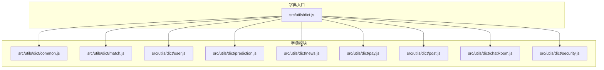
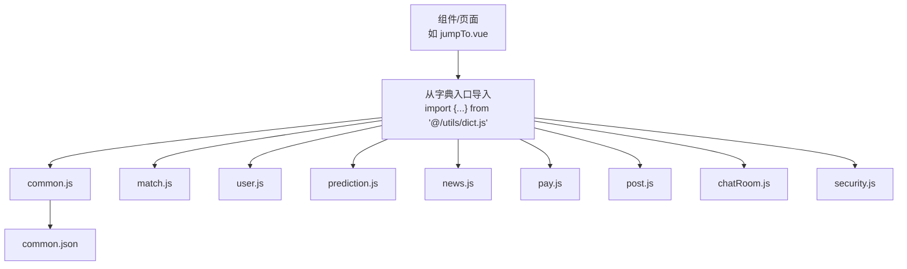
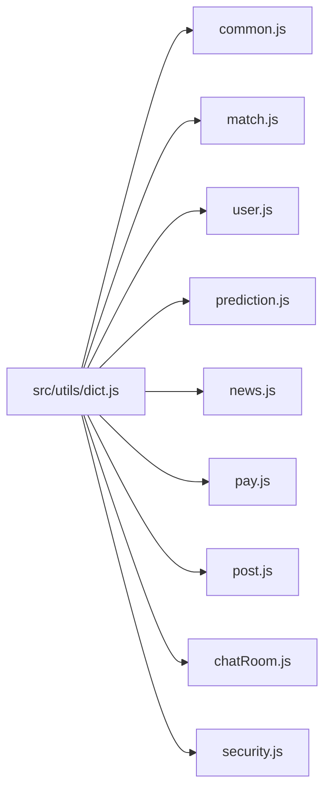

# 数据字典系统

<cite>
**本文引用的文件**
- [dict.js](file://src/utils/dict.js)
- [common.js](file://src/utils/dict/common.js)
- [common.json](file://src/utils/dict/common.json)
- [match.js](file://src/utils/dict/match.js)
- [user.js](file://src/utils/dict/user.js)
- [prediction.js](file://src/utils/dict/prediction.js)
- [news.js](file://src/utils/dict/news.js)
- [pay.js](file://src/utils/dict/pay.js)
- [post.js](file://src/utils/dict/post.js)
- [chatRoom.js](file://src/utils/dict/chatRoom.js)
- [security.js](file://src/utils/dict/security.js)
- [jumpTo.vue](file://src/components/jumpTo/jumpTo.vue)
</cite>

## 目录
1. [引言](#引言)
2. [项目结构](#项目结构)
3. [核心组件](#核心组件)
4. [架构概览](#架构概览)
5. [详细组件分析](#详细组件分析)
6. [依赖分析](#依赖分析)
7. [性能考虑](#性能考虑)
8. [故障排除指南](#故障排除指南)
9. [结论](#结论)
10. [附录](#附录)

## 引言
本文件系统性梳理 Leisu Admin 项目的静态数据字典体系，涵盖数据字典的组织结构、分类管理、动态加载机制与扩展策略。通过对通用字典(common)、赛事数据字典(match)、用户数据字典(user)、预测数据字典(prediction)等模块的深入解析，阐明枚举值定义、状态码映射、业务规则转换的设计思路，并提供使用示例、最佳实践与性能优化建议，帮助开发者高效、一致地维护与扩展数据字典。

## 项目结构
数据字典采用“按领域分模块”的组织方式，每个模块独立维护一组业务相关的键值映射与状态定义，统一通过入口文件集中导出，便于在组件与服务层按需引入。

**图表来源**
- [dict.js:1-11](file://src/utils/dict.js#L1-L11)
- [common.js:1-712](file://src/utils/dict/common.js#L1-L712)
- [match.js:1-635](file://src/utils/dict/match.js#L1-L635)
- [user.js:1-245](file://src/utils/dict/user.js#L1-L245)
- [prediction.js:1-526](file://src/utils/dict/prediction.js#L1-L526)
- [news.js:1-99](file://src/utils/dict/news.js#L1-L99)
- [pay.js:1-114](file://src/utils/dict/pay.js#L1-L114)
- [post.js:1-204](file://src/utils/dict/post.js#L1-L204)
- [chatRoom.js:1-22](file://src/utils/dict/chatRoom.js#L1-L22)
- [security.js:1-23](file://src/utils/dict/security.js#L1-L23)

**章节来源**
- [dict.js:1-11](file://src/utils/dict.js#L1-L11)

## 核心组件
- 字典入口导出：统一聚合各模块导出项，简化组件导入与维护成本。
- 通用字典(common)：包含平台通用枚举、图标SVG、跳转映射、敏感词场景、IP测试列表等。
- 赛事字典(match)：涵盖运动类型、比赛状态、事件类型、教练类型、播放类型等。
- 用户字典(user)：用户分组、认证状态、封禁状态、举报与反馈处理等。
- 预测字典(prediction)：专家号分组、违规原因、操作类型、玩法与结果映射等。
- 新闻字典(news)：资讯类型、标签、稿费分类、状态与作者等级等。
- 支付字典(pay)：苹果内购通知类型、支付方式、卡券类型、提现状态等。
- 社区字典(post)：周卡购买方式、帖子类型、板块与权限、举报与投票等。
- 聊天室字典(chatRoom)：举报类型、礼物卡使用场景与样式等。
- 安全字典(security)：内容安全审核类型与二审权限映射。

**章节来源**
- [common.js:1-712](file://src/utils/dict/common.js#L1-L712)
- [match.js:1-635](file://src/utils/dict/match.js#L1-L635)
- [user.js:1-245](file://src/utils/dict/user.js#L1-L245)
- [prediction.js:1-526](file://src/utils/dict/prediction.js#L1-L526)
- [news.js:1-99](file://src/utils/dict/news.js#L1-L99)
- [pay.js:1-114](file://src/utils/dict/pay.js#L1-L114)
- [post.js:1-204](file://src/utils/dict/post.js#L1-L204)
- [chatRoom.js:1-22](file://src/utils/dict/chatRoom.js#L1-L22)
- [security.js:1-23](file://src/utils/dict/security.js#L1-L23)

## 架构概览
数据字典系统遵循“模块化定义 + 统一入口导出 + 组件按需使用”的架构模式。组件通过字典入口一次性引入所需映射，避免重复导入与命名冲突；同时，字典内部采用清晰的命名空间与层级结构，便于维护与扩展。

**图表来源**
- [jumpTo.vue:609-610](file://src/components/jumpTo/jumpTo.vue#L609-L610)
- [dict.js:1-11](file://src/utils/dict.js#L1-L11)
- [common.js:16-20](file://src/utils/dict/common.js#L16-L20)
- [common.json:1-800](file://src/utils/dict/common.json#L1-L800)

## 详细组件分析

### 通用字典(common)
- 功能定位：平台通用映射与资源路径定义，包含图标SVG、跳转映射、审核状态、平台来源、敏感词场景等。
- 关键特性：
  - 资源路径映射：dir_list 将业务实体与 OSS/CDN 路径关联，支持图片、视频、附件等资源的统一管理。
  - 跳转映射：type2jump/type1jump/type1jump/type2jump/type1jump/type2jump/type1jump/type2jump/type1jump/type2jump/type1jump/type2jump/type1jump/type2jump/type1jump/type2jump/type1jump/type2jump/type1jump/type2jump/type1jump/type2jump/type1jump/type2jump/type1jump/type2jump/type1jump/type2jump/type1jump/type2jump/type1jump/type2jump/type1jump/type2jump/type1jump/type2jump/type1jump/type2jump/type1jump/type2jump/type1jump/type2jump/type1jump/type2jump/type1jump/type2jump/type1jump/type2jump/type1jump/type2jump/type1jump/type2jump/type1jump/type2jump/type1jump/type2jump/type1jump/type2jump/type1jump/type2jump/type1jump/type2jump/type1jump/type2jump/type1jump/type2jump/type1jump/type2jump/type1jump/type2jump/type1jump/type2jump/type1jump/type2jump/type1jump/type2jump/type1jump/type2jump/type1jump/type2jump/type1jump/type2jump/type1jump/type2jump/type1jump/type2jump/type1jump/type2jump/type1jump/type2jump/type1jump/type2jump/type1jump/type2jump/type1jump/type2jump/type1jump/type2jump/type1jump/type2jump/type1jump/type2jump/type1jump/type2jump/type1jump/type2jump/type1jump/type2jump/type1jump/type2jump/type1jump/type2jump/type1jump/type2jump/type1jump/type2jump/type1jump/type2jump/type1jump/type2jump/type1jump/type2jump/type1jump/type2jump/type1jump/type2jump/type1jump/type2jump/type1jump/type2jump/type1jump/type2jump/type1jump/type2jump/type1jump/type2jump/type1jump/type2jump/type1jump/type2jump/type1jump/type2jump/type1jump/type2jump/type1jump/type2jump/type1jump/type2jump/type1jump/type2jump/type1jump/type2jump/type1jump/type2jump/type1jump/type2jump/type1jump/type2jump/type1jump/type2jump/type1jump/type2jump/type1jump/type2jump/type1jump/type2jump/type1jump/type2jump/type1jump/type2jump/type1jump/type2......
  - 审核与状态：auditStatusObj、processStatusTypeCommom、auditStatusObj1、auditStatusObj2 等，统一审核与处理状态的标签与样式。
  - 平台与来源：ParsePlatformObj、loginMethodObj、userBanStatusSuccessType 等，统一平台来源与登录方式的展示。
  - 敏感词场景：sensitiveWordTips/sensitiveWordTipsTab，明确不同业务场景下的敏感词使用策略。
  - IP测试列表：testIpList，用于测试与演示。
- 使用示例：组件通过 import { type2jump, dir_list, auditStatusObj } from '@/utils/dict.js' 导入所需映射。

**章节来源**
- [common.js:1-712](file://src/utils/dict/common.js#L1-L712)
- [common.json:1-800](file://src/utils/dict/common.json#L1-L800)

### 赛事字典(match)
- 功能定位：围绕赛事与比赛的业务字典，覆盖运动类型、比赛状态、事件类型、教练类型、播放类型等。
- 关键特性：
  - 运动类型与子游戏：sportTypeName/sportGameTypeName，支持足球、篮球、网球、电竞等运动及其子游戏的分类与字符串映射。
  - 比赛状态：matchTypeStatusName/parseAbnormalStatus，统一不同运动的比赛状态与结算状态。
  - 重要事件与图标：MatchIncidentTypeList/iconEventImportant，定义比赛中的关键事件与对应图标。
  - 教练类型：coachTypeDict/basketballCoachType，区分不同运动的教练类型。
  - 视频播放类型：playType2text，统一视频播放样式与来源。
  - 跳转M站：jumpMobileDict，按运动与游戏生成移动端跳转链接。
- 使用示例：组件通过 import { sportTypeName, matchTypeStatusName, MatchIncidentTypeList } from '@/utils/dict.js' 获取映射。

**章节来源**
- [match.js:1-635](file://src/utils/dict/match.js#L1-L635)

### 用户字典(user)
- 功能定位：用户生命周期与治理相关的字典，覆盖用户分组、认证状态、封禁状态、举报与反馈处理等。
- 关键特性：
  - 用户分组与原因：userGroupObj/userGroupObjReason，定义用户分组与变更原因的快捷项。
  - 认证状态：authenticationStatus/faceAuthenticationStatus，统一实名与人脸认证状态。
  - 封禁状态与操作人：userBanStatusType/customize_user_ban_operate，定义封禁类型与操作来源。
  - 高风险记录来源与反馈处理：membersRiskSource/opinionResultType，统一风险来源与处理状态。
  - 举报类型与加急处理：complainTypeNameList/expeditedResultType，支持举报分类与加急标记。
  - 快捷封禁时长：banTimeLongs，提供常用封禁时长选项。
  - 调研位置与样式：surveyPlaceMenuObj/surveyStyleObj，定义调研的展示位置与样式。
  - 证件类型：userAuthenticationObj，统一用户认证证件类型。
  - 挂件分类：userHonorCataType，定义用户荣誉挂件的分类。
- 使用示例：组件通过 import { userGroupObj, authenticationStatus, userBanStatusType } from '@/utils/dict.js' 获取映射。

**章节来源**
- [user.js:1-245](file://src/utils/dict/user.js#L1-L245)

### 预测字典(prediction)
- 功能定位：专家号与预测方案相关的字典，覆盖专家号分组、违规原因、操作类型、玩法与结果映射等。
- 关键特性：
  - 专家号分组：PredictionGroup，定义专家号的等级与样式。
  - 违规原因与操作：predictorReasonList/predictorUpReasonList/operateAction2text，统一专家号违规与操作原因。
  - 专家号操作备注：predictorOperateTips，定义不同操作对专家号的影响。
  - 方案玩法与结果：PlayTypeToText/PredictionResult，统一玩法与结果映射。
  - 方案类型：predictType/predictType1，定义单关、串关、足彩等类型。
  - 申诉与封禁：predictorAppealResult/PredictorBanType，统一申诉结果与封禁类型。
  - 榜单类型：PERLT，定义专家榜单类型。
  - 文章价格与标签：articlePriceOption/predictorBadgesObj，定义文章定价与标签归属。
  - 对比报表类型：predictorDiffPayType/predictorDiffPayTypeSort，定义消费与收益的对比维度。
  - 文章购买方式：articleBuyerSourceType，统一购买渠道。
- 使用示例：组件通过 import { PredictionGroup, PlayTypeToText, predictType } from '@/utils/dict.js' 获取映射。

**章节来源**
- [prediction.js:1-526](file://src/utils/dict/prediction.js#L1-L526)

### 新闻字典(news)
- 功能定位：资讯内容相关的字典，覆盖资讯类型、标签、稿费分类、状态与作者等级等。
- 关键特性：
  - 资讯类型与标签：newTypeObj/labelList，统一资讯内容形式与标签分类。
  - 稿费分类：classifyTypeObj，定义稿费类别与计费方式。
  - 篮球与电竞阶段：newBasketballStage/newGameStage，定义不同运动的阶段划分。
  - 状态与作者等级：newsStatusType/manuscriptStatusType/manuscriptcAuthorLevelType，统一状态与等级。
  - 操作记录：manuscriptChargebacksType，定义稿费结算与扣费记录类型。
  - 频道置顶：newsToChannelType，定义支持置顶的频道。
- 使用示例：组件通过 import { newTypeObj, labelList, newsStatusType } from '@/utils/dict.js' 获取映射。

**章节来源**
- [news.js:1-99](file://src/utils/dict/news.js#L1-L99)

### 支付字典(pay)
- 功能定位：支付与财务相关的字典，覆盖苹果内购通知类型、支付方式、卡券类型、提现状态等。
- 关键特性：
  - 苹果内购通知类型：notificationTypeObj/subtypeMapObj，统一内购事件类型与子类型。
  - 支付方式：payTypesObj，定义支付渠道与展示名称。
  - 卡券类型与门槛：payLeisuCouponType/payLeisuCouponThresholdlist，定义卡券类别与使用门槛。
  - 银行卡渠道：bankParseTaxes，定义银行支付渠道。
  - 提现状态：withdrawStatusList，统一提现流程状态。
  - 雷速内购与来源：payTradeStatus/leisuCouponSourceList，定义内购状态与来源。
- 使用示例：组件通过 import { payTypesObj, payLeisuCouponType, withdrawStatusList } from '@/utils/dict.js' 获取映射。

**章节来源**
- [pay.js:1-114](file://src/utils/dict/pay.js#L1-L114)

### 社区字典(post)
- 功能定位：社区与内容生态相关的字典，覆盖周卡、帖子类型、板块与权限、举报与投票等。
- 关键特性：
  - 周卡购买方式与状态：weekPurMethod/weekStatusType，定义周卡购买与状态。
  - 周卡来源与消费类型：weekPurSceneMethod/week_card_purchase_type，定义周卡来源与消费场景。
  - 帖子类型：POST_TYPE_NAME/POST_TYPE_NAME_TREE，定义帖子类型与兼容组件。
  - 板块与权限：getCatalogs/groupApplyOperateType/groupApplyClassify，定义板块与权限申请流程。
  - 价格与分成：groupPriceObj/weekChargeRatio，定义付费与分成比例。
  - 举报与投票：groupReportType/groupVoteChoiceType/groupVotePubType，定义举报类型与投票设置。
  - 圈子类型与置顶：groupCircleType/groupCircleTopType，定义圈子分类与置顶类型。
- 使用示例：组件通过 import { weekPurMethod, POST_TYPE_NAME, getCatalogs } from '@/utils/dict.js' 获取映射。

**章节来源**
- [post.js:1-204](file://src/utils/dict/post.js#L1-L204)

### 聊天室字典(chatRoom)
- 功能定位：聊天室相关的字典，覆盖举报类型、礼物卡使用场景与样式等。
- 关键特性：
  - 举报类型：chatRoomReportType，定义聊天室举报场景。
  - 礼物卡使用场景与样式：chatRoomGiftCardScene/chatRoomGiftCardStyle，定义礼物卡的使用场景与展示样式。
- 使用示例：组件通过 import { chatRoomReportType, chatRoomGiftCardScene } from '@/utils/dict.js' 获取映射。

**章节来源**
- [chatRoom.js:1-22](file://src/utils/dict/chatRoom.js#L1-L22)

### 安全文档(security)
- 功能定位：内容安全相关的字典，覆盖审核类型与二审权限映射。
- 关键特性：
  - 审核类型：securityReviewType，定义不同内容类型的审核范围。
  - 二审权限映射：machineSecondTypePwer1，定义不同审核类型对应的删除/隐藏权限。
- 使用示例：组件通过 import { securityReviewType, machineSecondTypePwer1 } from '@/utils/dict.js' 获取映射。

**章节来源**
- [security.js:1-23](file://src/utils/dict/security.js#L1-L23)

### 字典使用示例与最佳实践
- 在组件中按需导入：以 jumpTo.vue 为例，通过 import { type2jump, resourceTextJump, PERLT, predictTypeStr, matchJumpMoudelType, jumpListDefault } from '@/utils/dict.js' 导入所需映射，避免全局污染。
- 统一状态与枚举：优先使用字典中的枚举值与状态，确保界面展示与业务逻辑一致。
- 性能优化建议：
  - 避免在渲染路径中进行复杂计算，将映射缓存于组件 data/computed 中。
  - 对于大型映射（如 dir_list），按需拆分或延迟加载，减少初始包体积。
  - 使用本地存储（如 localStorage）缓存板块与目录等动态数据，减少重复请求。
- 数据一致性保证：
  - 所有状态与枚举统一来源于字典模块，避免硬编码。
  - 对外暴露的接口参数与字典保持一一对应，防止类型不匹配。

**章节来源**
- [jumpTo.vue:609-610](file://src/components/jumpTo/jumpTo.vue#L609-L610)

## 依赖分析
字典入口文件统一导出各模块的导出项，形成松耦合的依赖关系。组件通过入口文件按需引入，降低模块间的直接依赖，提升可维护性。

**图表来源**
- [dict.js:1-11](file://src/utils/dict.js#L1-L11)

**章节来源**
- [dict.js:1-11](file://src/utils/dict.js#L1-L11)

## 性能考虑
- 模块化与按需加载：通过字典入口统一导出，组件仅导入所需映射，避免不必要的代码进入打包产物。
- 缓存策略：对频繁访问的映射（如 dir_list、getCatalogs）进行内存缓存，减少重复计算与DOM渲染。
- 动态数据本地化：将板块、目录等动态数据存储于 localStorage，减少网络请求与二次解析。
- 映射规模控制：对于超大映射，建议拆分为多个子映射并按需加载，避免阻塞主线程。

## 故障排除指南
- 映射缺失或类型不匹配：检查组件导入的字典项是否正确，确认枚举值与业务期望一致。
- 跳转链接错误：核对 type2jump 与 jumpMobileDict 的键值，确保 sport_id 与 game_id 的组合正确。
- 状态显示异常：确认使用的是统一的状态映射（如 auditStatusObj、newsStatusType），避免混用不同模块的状态定义。
- 社区板块不显示：检查 localStorage 中 catalogs 的存储与解析逻辑，确保 getCatalogs 返回正确的对象。

**章节来源**
- [post.js:55-73](file://src/utils/dict/post.js#L55-L73)
- [common.js:16-20](file://src/utils/dict/common.js#L16-L20)

## 结论
Leisu Admin 的数据字典系统通过模块化定义与统一入口导出，实现了跨业务域的一致性与可维护性。通用字典提供平台级的通用映射，各领域字典聚焦具体业务场景，配合组件按需导入与缓存策略，既能满足快速开发需求，又能保证数据一致性与性能表现。建议在后续迭代中持续完善字典的扩展机制与国际化支持，进一步提升系统的可演进性与可维护性。

## 附录
- 扩展机制建议：
  - 新增字典：在对应模块新增映射，通过字典入口导出，组件按需导入。
  - 国际化支持：为展示文案提供国际化键值，结合 i18n 库实现多语言切换。
  - 运行时更新：通过远程配置或热更新机制，动态下发字典变更，确保线上一致性。
- 维护规范：
  - 统一枚举命名与层级结构，避免重复与歧义。
  - 对外接口参数与字典保持一一对应，建立变更审查机制。
  - 定期清理废弃映射，保持字典的简洁与高效。