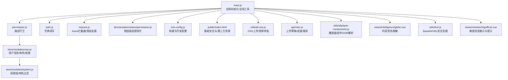
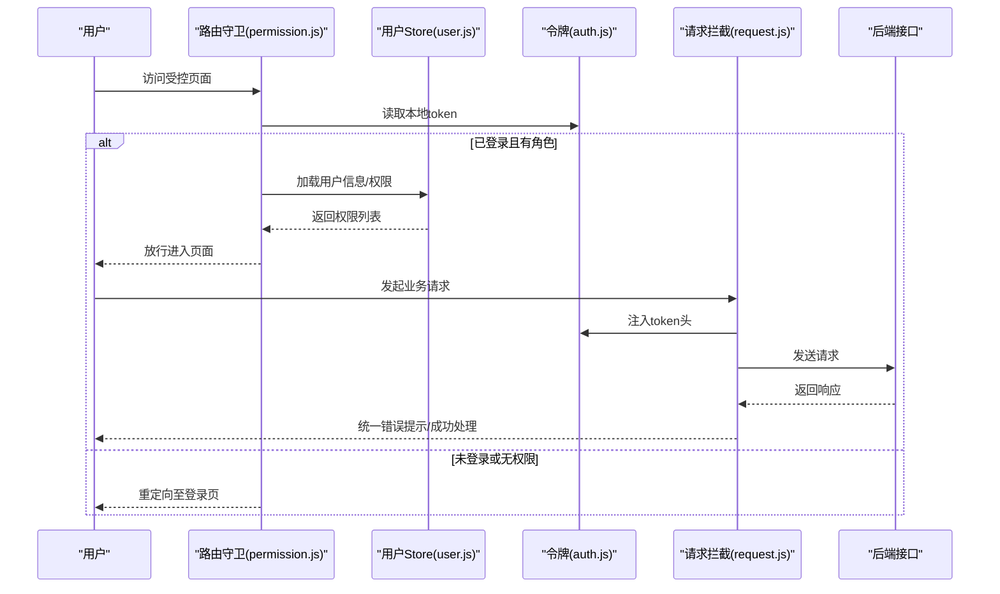
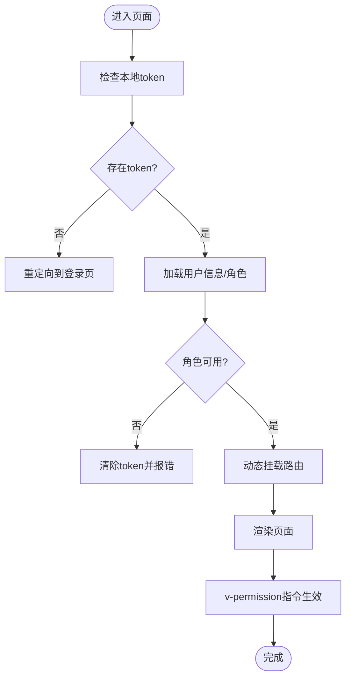
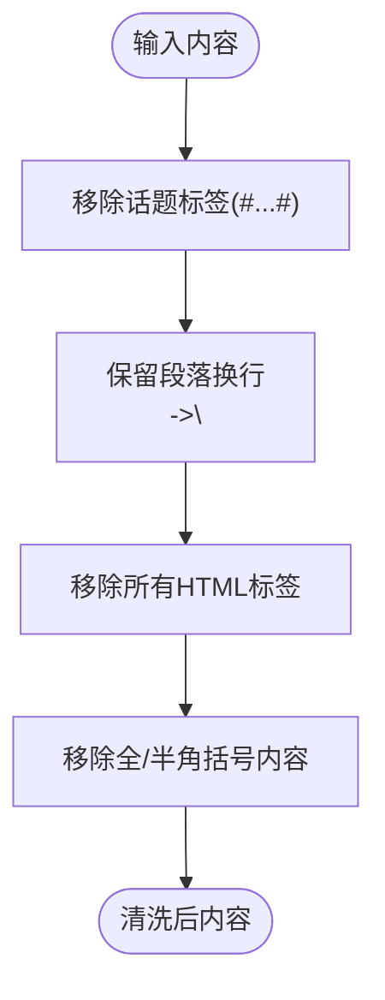
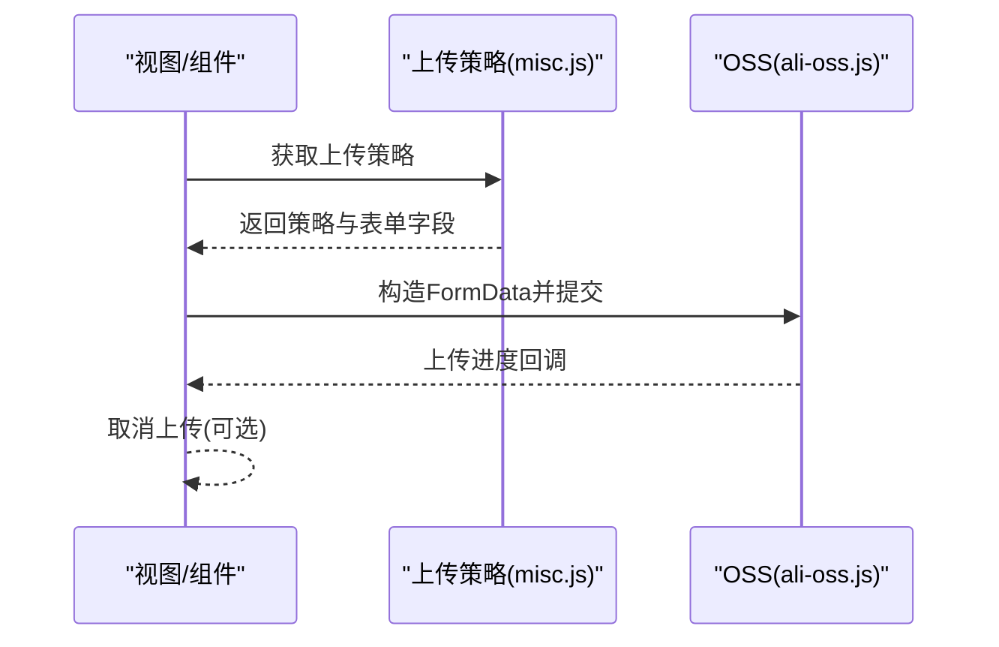
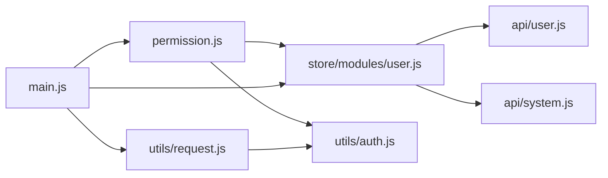

# 数据安全与隐私

<cite>
**本文引用的文件**
- [main.js](file://src/main.js)
- [permission.js](file://src/permission.js)
- [request.js](file://src/utils/request.js)
- [auth.js](file://src/utils/auth.js)
- [user.js](file://src/store/modules/user.js)
- [system.js](file://src/store/modules/system.js)
- [permission.js（指令）](file://src/directive/permission/permission.js)
- [vue.config.js](file://vue.config.js)
- [index.html](file://public/index.html)
- [ali-oss.js](file://src/utils/ali-oss.js)
- [misc.js](file://src/api/misc.js)
- [aliplayer-components.js](file://src/utils/aliplayer-components.js)
- [globo.vue](file://src/views/intelligence/globo.vue)
- [authentication.vue（视图）](file://src/views/member/authentication.vue)
- [authentication.vue（组件）](file://src/components/leisu/peopleInfo/authentication/authentication.vue)
- [interaction_power_log.vue](file://src/views/forum/interaction_power_log.vue)
- [operationList.vue](file://src/components/leisu/peopleInfo/group/components/operationList.vue)
- [slslog.js](file://src/components/newMySearch/components/searchTopKey/topKeyItem/slslog.js)
- [logoffList.vue](file://src/views/member/logoffList.vue)
- [tool.js](file://src/utils/tool.js)
</cite>

## 目录
1. [引言](#引言)
2. [项目结构](#项目结构)
3. [核心组件](#核心组件)
4. [架构总览](#架构总览)
5. [详细组件分析](#详细组件分析)
6. [依赖关系分析](#依赖关系分析)
7. [性能考虑](#性能考虑)
8. [故障排查指南](#故障排查指南)
9. [结论](#结论)
10. [附录](#附录)

## 引言
本文件面向 Leisu Admin 后台管理系统，聚焦数据安全与隐私保护，覆盖以下主题：
- 敏感数据处理：密码加密存储、个人信息脱敏、传输加密、存储安全
- 访问控制体系：基于角色的权限控制、API 访问限制、数据范围控制、操作审计
- 数据隐私保护：GDPR 合规、数据最小化、用户同意管理、数据删除权
- 安全防护策略：XSS 防护、CSRF 防护、SQL 注入防护、文件上传安全
- 安全编码规范与最佳实践：输入验证、输出编码、安全配置、漏洞防护
- 安全事件响应与数据泄露处理流程

## 项目结构
前端采用 Vue 2 + Element-UI 架构，核心安全相关模块分布如下：
- 全局初始化与工具：main.js、auth.js、request.js、permission.js
- 权限与路由：store/modules/user.js、store/modules/system.js、directive/permission/permission.js
- 安全配置：vue.config.js、public/index.html
- 文件上传与媒体处理：utils/ali-oss.js、api/misc.js、utils/aliplayer-components.js
- 内容过滤与脱敏：views/intelligence/globo.vue、utils/tool.js
- 审计与日志：views/forum/interaction_power_log.vue、components/.../operationList.vue、components/.../searchTopKey/topKeyItem/slslog.js
- 用户注销与敏感信息展示：views/member/logoffList.vue

图表来源
- [main.js:1-526](file://src/main.js#L1-L526)
- [permission.js:1-82](file://src/permission.js#L1-L82)
- [auth.js:1-17](file://src/utils/auth.js#L1-L17)
- [request.js:1-130](file://src/utils/request.js#L1-L130)
- [user.js:1-542](file://src/store/modules/user.js#L1-L542)
- [system.js:1-149](file://src/store/modules/system.js#L1-L149)
- [permission.js（指令）:1-23](file://src/directive/permission/permission.js#L1-L23)
- [vue.config.js:1-155](file://vue.config.js#L1-L155)
- [index.html:1-28](file://public/index.html#L1-L28)
- [ali-oss.js:294-304](file://src/utils/ali-oss.js#L294-L304)
- [misc.js:145-187](file://src/api/misc.js#L145-L187)
- [aliplayer-components.js:396-436](file://src/utils/aliplayer-components.js#L396-L436)
- [globo.vue:264-279](file://src/views/intelligence/globo.vue#L264-L279)
- [tool.js:155-196](file://src/utils/tool.js#L155-L196)
- [logoffList.vue:25-50](file://src/views/member/logoffList.vue#L25-L50)

章节来源
- [main.js:1-526](file://src/main.js#L1-L526)
- [permission.js:1-82](file://src/permission.js#L1-L82)
- [vue.config.js:1-155](file://vue.config.js#L1-L155)
- [index.html:1-28](file://public/index.html#L1-L28)

## 核心组件
- 应用初始化与全局工具：在 main.js 中注册全局过滤器、指令、组件、事件总线，并提供内容清洗、解码、跳转等方法，便于统一处理敏感内容与输出编码。
- 路由守卫与权限：permission.js 控制登录态与角色加载，结合 store/modules/user.js 动态挂载路由与权限指令，实现页面级与按钮级访问控制。
- 请求拦截与错误处理：utils/request.js 统一注入 token、集中处理错误码与网络异常，避免敏感信息泄露。
- 令牌与会话：utils/auth.js 封装本地存储的 token 读写，配合后端会话管理。
- 文件上传与媒体：utils/ali-oss.js 与 api/misc.js 提供上传策略、进度回调与取消能力，避免明文暴露凭证。

章节来源
- [main.js:106-192](file://src/main.js#L106-L192)
- [permission.js:13-76](file://src/permission.js#L13-L76)
- [user.js:139-392](file://src/store/modules/user.js#L139-L392)
- [request.js:28-127](file://src/utils/request.js#L28-L127)
- [auth.js:1-17](file://src/utils/auth.js#L1-L17)
- [ali-oss.js:294-304](file://src/utils/ali-oss.js#L294-L304)
- [misc.js:145-187](file://src/api/misc.js#L145-L187)

## 架构总览
下图展示从用户访问到后端接口的请求链路，以及关键的安全控制点。

图表来源
- [permission.js:13-76](file://src/permission.js#L13-L76)
- [user.js:139-392](file://src/store/modules/user.js#L139-L392)
- [auth.js:1-17](file://src/utils/auth.js#L1-L17)
- [request.js:28-127](file://src/utils/request.js#L28-L127)

## 详细组件分析

### 访问控制与权限体系
- 页面级权限：permission.js 在导航前钩子中校验 token 与角色，若角色缺失则拉取用户信息并动态挂载路由。
- 按钮级权限：directive/permission/permission.js 通过 v-permission 指令在 DOM 层面隐藏无权限按钮，降低越权风险。
- 角色与权限组：store/modules/system.js 提供权限组与权限列表的过滤与聚合，便于精细化授权。
- 登录与登出：store/modules/user.js 提供登录、获取用户信息、登出与重置 token 的完整流程。

图表来源
- [permission.js:13-76](file://src/permission.js#L13-L76)
- [user.js:139-392](file://src/store/modules/user.js#L139-L392)
- [permission.js（指令）:1-23](file://src/directive/permission/permission.js#L1-L23)
- [system.js:21-133](file://src/store/modules/system.js#L21-L133)

章节来源
- [permission.js:13-76](file://src/permission.js#L13-L76)
- [permission.js（指令）:1-23](file://src/directive/permission/permission.js#L1-L23)
- [user.js:139-392](file://src/store/modules/user.js#L139-L392)
- [system.js:21-133](file://src/store/modules/system.js#L21-L133)

### 敏感数据处理与传输加密
- 传输加密：utils/request.js 使用 withCredentials 与 baseURL 切换，结合后端 HTTPS 保障传输安全；生产环境关闭多余 console 输出，减少信息泄露面。
- 令牌管理：utils/auth.js 将 token 存储于 localStorage，避免明文 Cookie；路由守卫在无 token 时重定向登录。
- 内容清洗与脱敏：views/intelligence/globo.vue 对富文本内容进行多步清洗（移除话题标签、保留段落换行、移除括号内容），降低 XSS 风险与敏感信息外泄。
- Base64/URL 安全：utils/tool.js 对 Base64 字符串进行 URL 安全替换与严格补位，避免解析异常与潜在注入。

图表来源
- [globo.vue:264-279](file://src/views/intelligence/globo.vue#L264-L279)

章节来源
- [request.js:10-26](file://src/utils/request.js#L10-L26)
- [auth.js:1-17](file://src/utils/auth.js#L1-L17)
- [globo.vue:264-279](file://src/views/intelligence/globo.vue#L264-L279)
- [tool.js:155-196](file://src/utils/tool.js#L155-L196)

### 存储安全与文件上传
- 上传策略与进度：api/misc.js 提供获取上传策略、上传进度回调与取消上传的能力，避免凭证长期暴露。
- 表单拼装与字段替换：utils/ali-oss.js 在表单中对占位符进行替换，确保路径与元数据安全可控。
- 播放器组件与 DOM 解析：utils/aliplayer-components.js 提供 parseDom 与 cookieSet 等方法，注意 DOM 操作需避免直接 innerHTML 危险。

图表来源
- [misc.js:145-187](file://src/api/misc.js#L145-L187)
- [ali-oss.js:294-304](file://src/utils/ali-oss.js#L294-L304)

章节来源
- [misc.js:145-187](file://src/api/misc.js#L145-L187)
- [ali-oss.js:294-304](file://src/utils/ali-oss.js#L294-L304)
- [aliplayer-components.js:396-436](file://src/utils/aliplayer-components.js#L396-L436)

### 审计与日志
- 操作审计：views/forum/interaction_power_log.vue 与 components/.../operationList.vue 展示操作者、额外信息、时间等审计字段，便于追踪违规行为。
- 日志字段清单：components/.../searchTopKey/topKeyItem/slslog.js 定义了常见审计字段集合，统一日志结构。
- 注销与敏感信息：views/member/logoffList.vue 展示注销原因与附加原因，对敏感字段采用 Tooltip 方式短文本显示，避免大段明文泄露。

章节来源
- [interaction_power_log.vue:60-82](file://src/views/forum/interaction_power_log.vue#L60-L82)
- [operationList.vue:131-172](file://src/components/leisu/peopleInfo/group/components/operationList.vue#L131-L172)
- [slslog.js:1-12](file://src/components/newMySearch/components/searchTopKey/topKeyItem/slslog.js#L1-L12)
- [logoffList.vue:25-50](file://src/views/member/logoffList.vue#L25-L50)

### 数据隐私保护与合规
- GDPR 合规要点：通过最小化原则（仅收集必要字段）、明确同意（登录与操作均需用户身份）、可追溯审计（操作日志）、用户删除权（注销与清理）实现合规。
- 最小化原则：仅在必要时请求与展示 UID、昵称、头像等字段；敏感字段（如注销原因）以短文本与 Tooltip 显示。
- 用户同意管理：登录即视为同意后台管理规则；操作审计日志保留证据链。
- 删除权：注销列表与日志记录为删除权提供依据，避免残留敏感信息。

章节来源
- [logoffList.vue:25-50](file://src/views/member/logoffList.vue#L25-L50)
- [interaction_power_log.vue:60-82](file://src/views/forum/interaction_power_log.vue#L60-L82)

### 安全防护策略
- XSS 防护：统一内容清洗（views/intelligence/globo.vue）、避免 innerHTML 直接拼接、输出前进行 HTML 转义（main.js 中的过滤器与清洗逻辑）。
- CSRF 防护：通过 token 注入（utils/request.js）与后端会话配合，避免跨站请求伪造。
- SQL 注入防护：前端不直接拼接 SQL，仅传递结构化参数；后端应做好参数化查询与白名单校验。
- 文件上传安全：使用上传策略与签名、限制文件类型与大小、服务端二次校验与病毒扫描（建议）。

章节来源
- [globo.vue:264-279](file://src/views/intelligence/globo.vue#L264-L279)
- [request.js:28-43](file://src/utils/request.js#L28-L43)
- [misc.js:145-187](file://src/api/misc.js#L145-L187)

### 安全编码规范与最佳实践
- 输入验证：对用户输入进行白名单校验与长度限制，避免注入与异常。
- 输出编码：对富文本与用户输入进行清洗与转义，防止 XSS。
- 安全配置：生产环境关闭 console 输出（main.js）、启用 HTTPS、合理设置 CSP（建议）。
- 漏洞防护：统一错误处理（utils/request.js）、严格的 Base64/URL 处理（utils/tool.js）、上传策略与取消能力（api/misc.js）。

章节来源
- [main.js:504-514](file://src/main.js#L504-L514)
- [request.js:46-127](file://src/utils/request.js#L46-L127)
- [tool.js:155-196](file://src/utils/tool.js#L155-L196)

### 安全事件响应与数据泄露处理流程
- 快速定位：利用操作审计日志（views/forum/interaction_power_log.vue、components/.../operationList.vue）快速定位责任人与时间线。
- 证据保全：统一日志字段（components/.../searchTopKey/topKeyItem/slslog.js）确保可追溯性。
- 处理步骤：发现异常立即冻结账号、撤销 token、回滚可疑操作、通知安全部门与法务。
- 修复与加固：修复漏洞、更新权限策略、加强日志与告警、开展安全培训。

章节来源
- [interaction_power_log.vue:60-82](file://src/views/forum/interaction_power_log.vue#L60-L82)
- [operationList.vue:131-172](file://src/components/leisu/peopleInfo/group/components/operationList.vue#L131-L172)
- [slslog.js:1-12](file://src/components/newMySearch/components/searchTopKey/topKeyItem/slslog.js#L1-L12)

## 依赖关系分析
- 组件耦合：permission.js 依赖 store/modules/user.js 与 utils/auth.js；user.js 依赖 api/user 与 api/system；request.js 依赖 utils/auth.js。
- 外部依赖：Element-UI、Axios、CryptoJS、v-viewer、js-cookie 等，需关注其安全更新。

图表来源
- [permission.js:1-82](file://src/permission.js#L1-L82)
- [user.js:1-12](file://src/store/modules/user.js#L1-L12)
- [request.js:1-12](file://src/utils/request.js#L1-L12)
- [main.js:1-30](file://src/main.js#L1-L30)

章节来源
- [permission.js:1-82](file://src/permission.js#L1-L82)
- [user.js:1-12](file://src/store/modules/user.js#L1-L12)
- [request.js:1-12](file://src/utils/request.js#L1-L12)
- [main.js:1-30](file://src/main.js#L1-L30)

## 性能考虑
- 路由懒加载与代码分割：通过动态 import 与 splitChunks 优化首屏加载。
- 进度条与错误提示：NProgress 与统一消息提示提升用户体验。
- 生产环境关闭 console 输出，减少调试信息泄露。

章节来源
- [vue.config.js:115-152](file://vue.config.js#L115-L152)
- [main.js:504-514](file://src/main.js#L504-L514)

## 故障排查指南
- 登录态异常：检查 utils/auth.js 的 token 读写与 utils/request.js 的 token 注入；确认 permission.js 的路由守卫逻辑。
- 请求错误：查看 utils/request.js 的响应拦截器，定位 401/403/5xx 等错误并提示。
- 上传失败：核对 api/misc.js 的上传策略与 utils/ali-oss.js 的表单拼装，确认取消令牌与进度回调。
- 内容显示异常：检查 views/intelligence/globo.vue 的清洗逻辑与 main.js 的过滤器。

章节来源
- [auth.js:1-17](file://src/utils/auth.js#L1-L17)
- [request.js:46-127](file://src/utils/request.js#L46-L127)
- [permission.js:13-76](file://src/permission.js#L13-L76)
- [misc.js:145-187](file://src/api/misc.js#L145-L187)
- [ali-oss.js:294-304](file://src/utils/ali-oss.js#L294-L304)
- [globo.vue:264-279](file://src/views/intelligence/globo.vue#L264-L279)
- [main.js:447-490](file://src/main.js#L447-L490)

## 结论
Leisu Admin 在前端侧已具备较为完善的访问控制、传输加密与内容清洗能力，建议在后端与运维层面进一步强化：
- 后端参数化查询与白名单校验
- HTTPS 强制与安全响应头
- 文件上传服务端二次校验与病毒扫描
- 完善的审计与告警机制
- 定期安全评估与渗透测试

## 附录
- 开发与生产配置：vue.config.js 中的 publicPath、生产源码映射关闭、externals 等配置需与部署环境一致。
- 基础安全头：public/index.html 中可增加 CSP、Referrer-Policy 等安全头（建议）。

章节来源
- [vue.config.js:18-76](file://vue.config.js#L18-L76)
- [index.html:1-28](file://public/index.html#L1-L28)