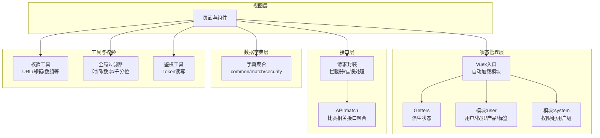
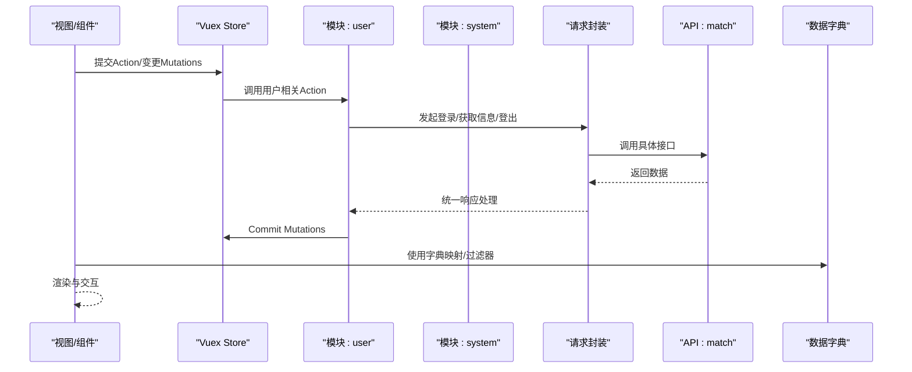
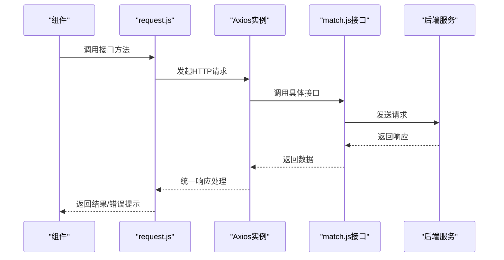
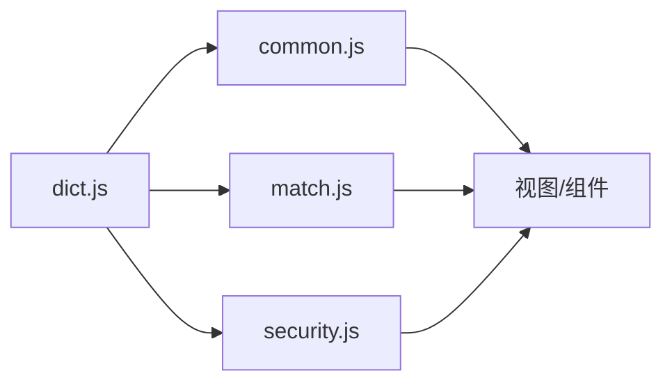
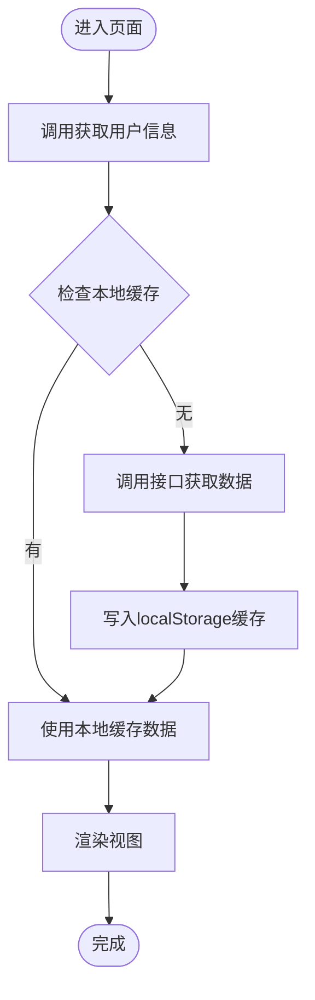
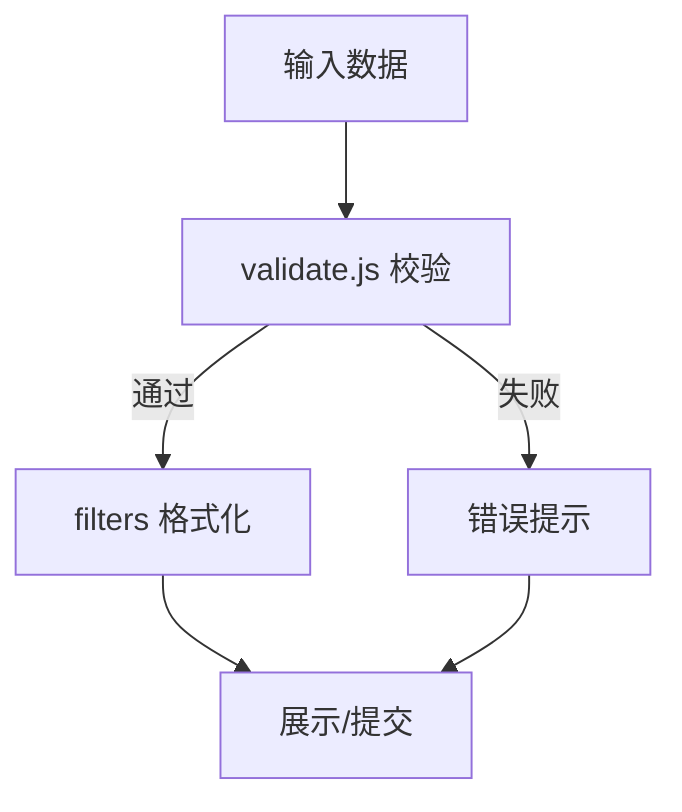
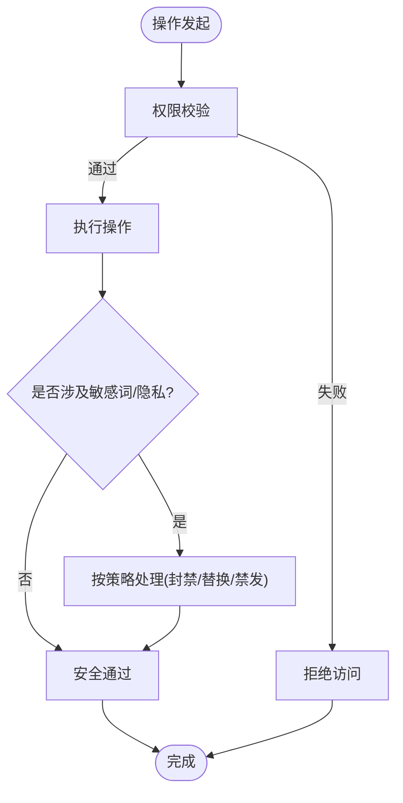
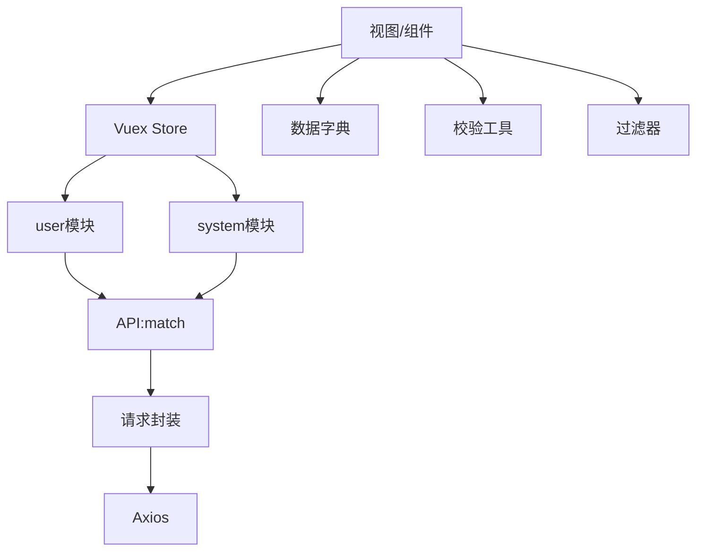

# 数据管理

<cite>
**本文引用的文件**
- [src/store/index.js](file://src/store/index.js)
- [src/store/getters.js](file://src/store/getters.js)
- [src/store/modules/user.js](file://src/store/modules/user.js)
- [src/store/modules/system.js](file://src/store/modules/system.js)
- [src/utils/request.js](file://src/utils/request.js)
- [src/utils/auth.js](file://src/utils/auth.js)
- [src/utils/dict.js](file://src/utils/dict.js)
- [src/utils/dict/common.js](file://src/utils/dict/common.js)
- [src/utils/dict/match.js](file://src/utils/dict/match.js)
- [src/utils/dict/security.js](file://src/utils/dict/security.js)
- [src/utils/validate.js](file://src/utils/validate.js)
- [src/filters/index.js](file://src/filters/index.js)
- [src/main.js](file://src/main.js)
- [src/api/match.js](file://src/api/match.js)
</cite>

## 目录
1. [简介](#简介)
2. [项目结构](#项目结构)
3. [核心组件](#核心组件)
4. [架构总览](#架构总览)
5. [详细组件分析](#详细组件分析)
6. [依赖分析](#依赖分析)
7. [性能考虑](#性能考虑)
8. [故障排查指南](#故障排查指南)
9. [结论](#结论)
10. [附录](#附录)

## 简介
本文件面向 Leisu Admin 项目的前端数据管理，围绕 Vuex 状态管理、API 接口层、数据字典系统、数据缓存与持久化、数据验证与格式化、数据安全与隐私保护、数据迁移与版本管理等方面进行系统化说明。旨在帮助开发者快速理解并高效维护数据相关功能。

## 项目结构
Leisu Admin 的数据管理由以下层次构成：
- 状态管理层：基于 Vuex 的模块化状态设计，自动加载模块，集中管理 token、用户信息、权限、标签、预测号缓存等。
- 接口层：基于 Axios 的请求封装，统一拦截器、错误处理、环境切换与基础 URL 管理。
- 数据字典层：集中管理静态枚举、映射关系、跳转规则、平台与状态等。
- 缓存与持久化：结合 Vuex、localStorage、Element UI 消息提示与全局过滤器，实现轻量数据持久化与展示格式化。
- 校验与格式化：提供表单校验方法与全局过滤器，统一数据格式化输出。
- 安全与隐私：统一鉴权令牌、错误提示、敏感词场景与二审对照，保障数据安全。



图表来源
- [src/store/index.js:1-26](file://src/store/index.js#L1-L26)
- [src/store/getters.js:1-33](file://src/store/getters.js#L1-L33)
- [src/store/modules/user.js:1-542](file://src/store/modules/user.js#L1-L542)
- [src/store/modules/system.js:1-186](file://src/store/modules/system.js#L1-L186)
- [src/utils/request.js:1-130](file://src/utils/request.js#L1-L130)
- [src/api/match.js:1-1142](file://src/api/match.js#L1-L1142)
- [src/utils/dict.js:1-11](file://src/utils/dict.js#L1-L11)
- [src/utils/validate.js:1-88](file://src/utils/validate.js#L1-L88)
- [src/filters/index.js:1-69](file://src/filters/index.js#L1-L69)
- [src/utils/auth.js:1-17](file://src/utils/auth.js#L1-L17)

章节来源
- [src/store/index.js:1-26](file://src/store/index.js#L1-L26)
- [src/store/getters.js:1-33](file://src/store/getters.js#L1-L33)
- [src/store/modules/user.js:1-542](file://src/store/modules/user.js#L1-L542)
- [src/store/modules/system.js:1-186](file://src/store/modules/system.js#L1-L186)
- [src/utils/request.js:1-130](file://src/utils/request.js#L1-L130)
- [src/api/match.js:1-1142](file://src/api/match.js#L1-L1142)
- [src/utils/dict.js:1-11](file://src/utils/dict.js#L1-L11)
- [src/utils/validate.js:1-88](file://src/utils/validate.js#L1-L88)
- [src/filters/index.js:1-69](file://src/filters/index.js#L1-L69)
- [src/utils/auth.js:1-17](file://src/utils/auth.js#L1-L17)

## 核心组件
- Vuex 状态管理
  - 自动模块加载：通过 require.context 动态导入 modules 下的所有模块，减少手动引入成本。
  - Getters：集中派生 token、用户信息、权限、标签、预测号本地缓存 ID 等。
  - 模块化设计：user、system 等模块职责清晰，分别负责用户态、权限与用户组管理。
- 请求与拦截
  - Axios 实例：统一设置 baseURL（按部署环境切换）、withCredentials、timeout。
  - 请求拦截：自动注入 token。
  - 响应拦截：统一错误提示、登出逻辑、状态码映射。
- 数据字典
  - 字典聚合：common、match、security 等模块导出枚举与映射，供全局使用。
  - 跳转与平台：提供跳转类型、平台类型、比赛状态等映射。
- 校验与格式化
  - 校验工具：URL、邮箱、大小写、数组等常用校验。
  - 全局过滤器：时间、数字、千分位、首字母大写等格式化。
- 鉴权与持久化
  - Token：localStorage 存储，支持读取、设置、移除。
  - 本地缓存：用户信息、产品列表、渠道数据等通过 localStorage 缓存，减少重复请求。

章节来源
- [src/store/index.js:1-26](file://src/store/index.js#L1-L26)
- [src/store/getters.js:1-33](file://src/store/getters.js#L1-L33)
- [src/store/modules/user.js:1-542](file://src/store/modules/user.js#L1-L542)
- [src/store/modules/system.js:1-186](file://src/store/modules/system.js#L1-L186)
- [src/utils/request.js:1-130](file://src/utils/request.js#L1-L130)
- [src/utils/dict.js:1-11](file://src/utils/dict.js#L1-L11)
- [src/utils/dict/common.js:1-712](file://src/utils/dict/common.js#L1-L712)
- [src/utils/dict/match.js:1-635](file://src/utils/dict/match.js#L1-L635)
- [src/utils/dict/security.js:1-23](file://src/utils/dict/security.js#L1-L23)
- [src/utils/validate.js:1-88](file://src/utils/validate.js#L1-L88)
- [src/filters/index.js:1-69](file://src/filters/index.js#L1-L69)
- [src/utils/auth.js:1-17](file://src/utils/auth.js#L1-L17)

## 架构总览
下图展示了从视图到状态、接口与字典的整体数据流：



图表来源
- [src/store/modules/user.js:139-336](file://src/store/modules/user.js#L139-L336)
- [src/store/modules/system.js:21-61](file://src/store/modules/system.js#L21-L61)
- [src/utils/request.js:28-68](file://src/utils/request.js#L28-L68)
- [src/api/match.js:1-1142](file://src/api/match.js#L1-L1142)
- [src/utils/dict.js:1-11](file://src/utils/dict.js#L1-L11)

## 详细组件分析

### Vuex 状态管理
- 自动模块加载
  - 通过 require.context 扫描 modules 目录，按文件名注册模块，避免手动维护模块清单。
- Getters 设计
  - 聚合 token、用户信息、权限、标签、预测号本地缓存 ID 等，便于组件以只读方式访问。
- 模块职责
  - user：登录、获取信息、登出、权限扩展、产品与渠道缓存、用户标签、马甲号等。
  - system：权限列表、用户组列表、过滤可分配权限与用户组。

```mermaid
classDiagram
class StoreIndex {
+自动加载模块
+导出store实例
}
class Getters {
+派生token/用户/权限/标签
}
class UserModule {
+state : token/name/avatar/roles
+mutations : SET_TOKEN/SET_ROLES...
+actions : login/getInfo/logout/changeRoles
}
class SystemModule {
+state : initPermissionsAll/havingPermissionGroups
+mutations : SET_ALL_PERMISSIONS/SET_ALLHAVING_PERMISSIONS
+actions : getAllPermissions/getAllUserGroups
}
StoreIndex --> Getters : "导出"
StoreIndex --> UserModule : "命名空间 : user"
StoreIndex --> SystemModule : "命名空间 : system"
```

图表来源
- [src/store/index.js:1-26](file://src/store/index.js#L1-L26)
- [src/store/getters.js:1-33](file://src/store/getters.js#L1-L33)
- [src/store/modules/user.js:1-542](file://src/store/modules/user.js#L1-L542)
- [src/store/modules/system.js:1-186](file://src/store/modules/system.js#L1-L186)

章节来源
- [src/store/index.js:1-26](file://src/store/index.js#L1-L26)
- [src/store/getters.js:1-33](file://src/store/getters.js#L1-L33)
- [src/store/modules/user.js:1-542](file://src/store/modules/user.js#L1-L542)
- [src/store/modules/system.js:1-186](file://src/store/modules/system.js#L1-L186)

### API 接口层
- 请求封装
  - 环境切换：根据当前域名选择不同 baseURL（admin-w.leisu.com、admin.leisudata.com 或默认）。
  - 请求拦截：自动注入 token。
  - 响应拦截：统一错误提示、登出逻辑、状态码映射。
- 接口聚合
  - match.js 聚合各运动/游戏的接口，便于按需引入，保持现有引用逻辑不变。



图表来源
- [src/utils/request.js:1-130](file://src/utils/request.js#L1-L130)
- [src/api/match.js:1-1142](file://src/api/match.js#L1-L1142)

章节来源
- [src/utils/request.js:1-130](file://src/utils/request.js#L1-L130)
- [src/api/match.js:1-1142](file://src/api/match.js#L1-L1142)

### 数据字典系统
- 字典聚合
  - common：平台、审核状态、跳转类型、敏感词场景、用户标签分类等。
  - match：运动类型、比赛状态、视频类型、教练类型、跳转 M 站等。
  - security：内容安全审核类型、二审对照等。
- 使用方式
  - 通过 src/utils/dict.js 导出统一入口，组件按需引入。



图表来源
- [src/utils/dict.js:1-11](file://src/utils/dict.js#L1-L11)
- [src/utils/dict/common.js:1-712](file://src/utils/dict/common.js#L1-L712)
- [src/utils/dict/match.js:1-635](file://src/utils/dict/match.js#L1-L635)
- [src/utils/dict/security.js:1-23](file://src/utils/dict/security.js#L1-L23)

章节来源
- [src/utils/dict.js:1-11](file://src/utils/dict.js#L1-L11)
- [src/utils/dict/common.js:1-712](file://src/utils/dict/common.js#L1-L712)
- [src/utils/dict/match.js:1-635](file://src/utils/dict/match.js#L1-L635)
- [src/utils/dict/security.js:1-23](file://src/utils/dict/security.js#L1-L23)

### 数据缓存与持久化
- Vuex 持久化
  - user 模块在获取用户信息后，将部分数据写入 localStorage（如 catalogs、intelligenceTabList、productList、localChannelData），用于减少重复请求与提升体验。
- 会话管理
  - auth.js 提供 token 的读取、设置与移除；request.js 在请求头注入 token。
- 展示层格式化
  - filters 提供时间、数字、千分位等格式化能力；main.js 中的全局过滤器与工具函数也参与数据展示。



图表来源
- [src/store/modules/user.js:259-329](file://src/store/modules/user.js#L259-L329)
- [src/utils/auth.js:1-17](file://src/utils/auth.js#L1-L17)
- [src/utils/request.js:28-43](file://src/utils/request.js#L28-L43)
- [src/filters/index.js:1-69](file://src/filters/index.js#L1-L69)
- [src/main.js:447-490](file://src/main.js#L447-L490)

章节来源
- [src/store/modules/user.js:1-542](file://src/store/modules/user.js#L1-L542)
- [src/utils/auth.js:1-17](file://src/utils/auth.js#L1-L17)
- [src/utils/request.js:1-130](file://src/utils/request.js#L1-L130)
- [src/filters/index.js:1-69](file://src/filters/index.js#L1-L69)
- [src/main.js:1-526](file://src/main.js#L1-L526)

### 数据验证与格式化
- 表单验证
  - validate.js 提供 URL、邮箱、大小写、字母、数组等校验方法，便于在表单校验中复用。
- 数据格式化
  - filters 提供时间、数字、千分位、首字母大写等格式化方法。
  - main.js 注册全局过滤器与工具函数，统一时间格式化等。



图表来源
- [src/utils/validate.js:1-88](file://src/utils/validate.js#L1-L88)
- [src/filters/index.js:1-69](file://src/filters/index.js#L1-L69)
- [src/main.js:447-490](file://src/main.js#L447-L490)

章节来源
- [src/utils/validate.js:1-88](file://src/utils/validate.js#L1-L88)
- [src/filters/index.js:1-69](file://src/filters/index.js#L1-L69)
- [src/main.js:1-526](file://src/main.js#L1-L526)

### 数据安全与隐私保护
- 敏感数据处理
  - 字典中提供敏感词使用场景与二审对照，明确不同模块的处理策略（封禁、替换、标题禁发等）。
- 访问控制
  - user 模块在获取信息时扩展权限列表，system 模块过滤可分配权限组与用户组，确保最小权限原则。
- 数据脱敏与提示
  - request.js 对错误进行统一提示，避免泄露内部错误细节；对 201000 码触发登出，保证会话安全。



图表来源
- [src/store/modules/user.js:232-250](file://src/store/modules/user.js#L232-L250)
- [src/store/modules/system.js:64-133](file://src/store/modules/system.js#L64-L133)
- [src/utils/dict/security.js:1-23](file://src/utils/dict/security.js#L1-L23)
- [src/utils/request.js:46-68](file://src/utils/request.js#L46-L68)

章节来源
- [src/store/modules/user.js:1-542](file://src/store/modules/user.js#L1-L542)
- [src/store/modules/system.js:1-186](file://src/store/modules/system.js#L1-L186)
- [src/utils/dict/security.js:1-23](file://src/utils/dict/security.js#L1-L23)
- [src/utils/request.js:1-130](file://src/utils/request.js#L1-L130)

### 数据迁移与版本管理
- 版本与环境
  - request.js 根据当前域名选择不同 baseURL，支持 admin-w.leisu.com 与 admin.leisudata.com 环境切换。
- 本地数据迁移
  - user 模块在获取信息时将 catalogs、intelligenceTabList、productList、localChannelData 写入 localStorage，作为本地缓存的“迁移”与“版本化”依据。
- 建议
  - 对于新增字段，建议在模块初始化时做兼容性判断与默认值处理，避免破坏既有缓存。

章节来源
- [src/utils/request.js:1-26](file://src/utils/request.js#L1-L26)
- [src/store/modules/user.js:259-329](file://src/store/modules/user.js#L259-L329)

## 依赖分析
- 组件耦合
  - 视图层通过 Vuex 与 API 间接耦合，降低直接依赖。
  - 字典模块被多处引用，形成稳定的映射中心。
- 外部依赖
  - Axios、Element UI、js-cookie、CryptoJS 等。
- 循环依赖
  - 通过模块化与集中导出避免循环依赖风险。



图表来源
- [src/main.js:1-526](file://src/main.js#L1-L526)
- [src/store/index.js:1-26](file://src/store/index.js#L1-L26)
- [src/utils/request.js:1-130](file://src/utils/request.js#L1-L130)
- [src/api/match.js:1-1142](file://src/api/match.js#L1-L1142)
- [src/utils/dict.js:1-11](file://src/utils/dict.js#L1-L11)
- [src/utils/validate.js:1-88](file://src/utils/validate.js#L1-L88)
- [src/filters/index.js:1-69](file://src/filters/index.js#L1-L69)

章节来源
- [src/main.js:1-526](file://src/main.js#L1-L526)
- [src/store/index.js:1-26](file://src/store/index.js#L1-L26)
- [src/utils/request.js:1-130](file://src/utils/request.js#L1-L130)
- [src/api/match.js:1-1142](file://src/api/match.js#L1-L1142)
- [src/utils/dict.js:1-11](file://src/utils/dict.js#L1-L11)
- [src/utils/validate.js:1-88](file://src/utils/validate.js#L1-L88)
- [src/filters/index.js:1-69](file://src/filters/index.js#L1-L69)

## 性能考虑
- 减少重复请求
  - 通过 user 模块将关键数据写入 localStorage，避免频繁请求。
- 统一错误提示
  - request.js 的响应拦截统一处理错误，减少重复逻辑。
- 模块懒加载
  - 路由与部分组件采用懒加载，配合 Vuex 按需加载模块，优化首屏性能。

## 故障排查指南
- 登录失效
  - 现象：出现 201000 码或提示未授权。
  - 处理：清除 token 并跳转登录页。
- 网络错误
  - 现象：400/401/403/404/408/500/502/503/504/505 等状态码。
  - 处理：查看响应拦截器映射，确认接口是否存在、权限是否足够。
- 数据不一致
  - 现象：本地缓存与后端不一致。
  - 处理：在用户信息刷新时重新写入 localStorage；必要时清理缓存后重试。
- 校验失败
  - 现象：表单校验不通过。
  - 处理：使用 validate.js 的校验方法逐项排查。

章节来源
- [src/utils/request.js:46-127](file://src/utils/request.js#L46-L127)
- [src/store/modules/user.js:259-329](file://src/store/modules/user.js#L259-L329)
- [src/utils/validate.js:1-88](file://src/utils/validate.js#L1-L88)

## 结论
Leisu Admin 的数据管理以 Vuex 为核心，结合统一的请求封装、完善的字典系统、轻量缓存与严格的错误处理，形成了稳定、可维护的数据通道。通过模块化与集中导出，降低了组件间的耦合度；通过字典与过滤器，提升了数据表达一致性与可读性。建议在新增字段与接口时遵循现有模式，确保缓存与错误处理的一致性。

## 附录
- 最佳实践
  - 在模块初始化时做兼容性判断与默认值处理。
  - 对外部接口调用进行统一拦截与错误提示。
  - 对敏感数据与权限进行严格控制与最小暴露。
- 常见问题
  - token 丢失：检查 auth.js 与 request.js 的集成。
  - 字典缺失：确认 dict.js 是否正确导出对应模块。
  - 缓存不生效：确认 localStorage 写入与读取时机。