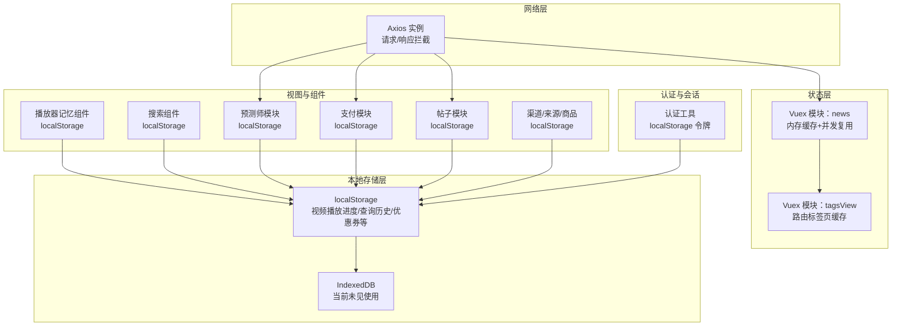
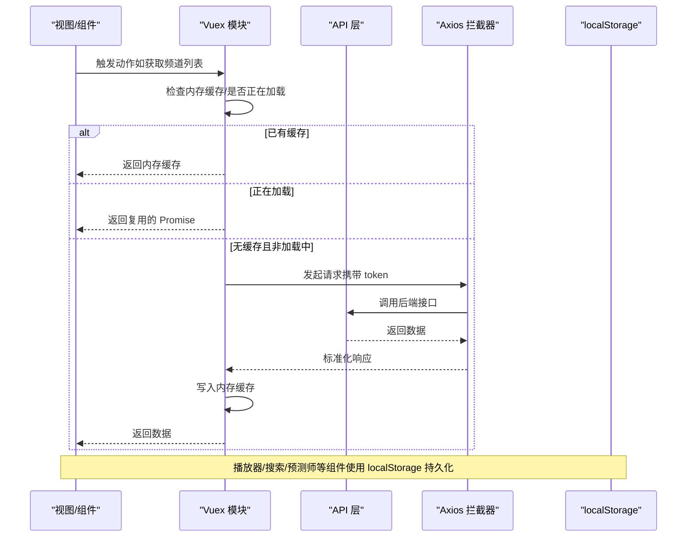
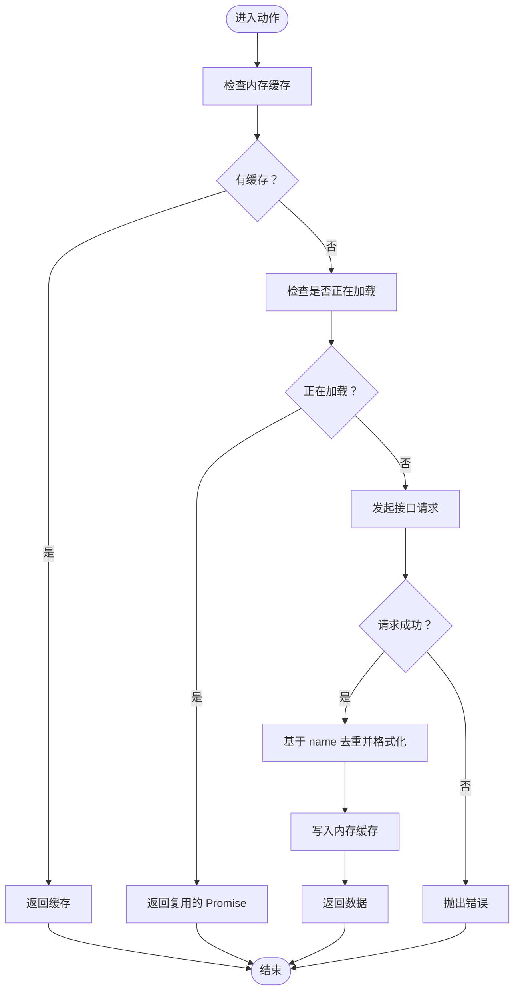
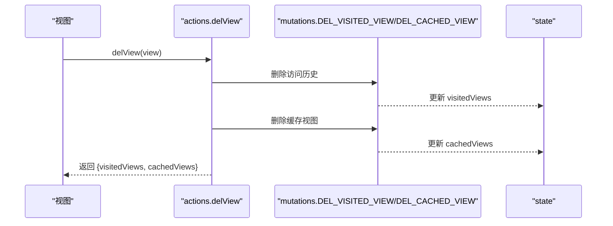
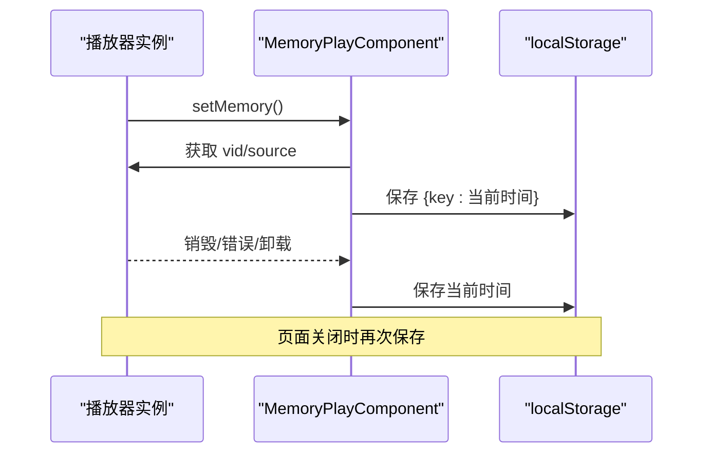
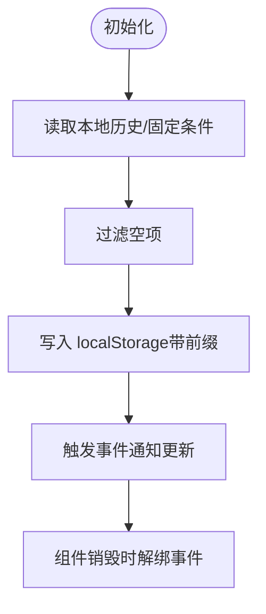
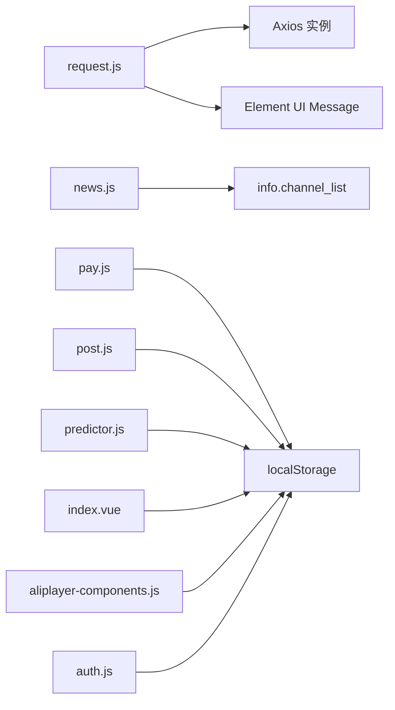

# 数据缓存策略

<cite>
**本文引用的文件**   
- [request.js](file://src/utils/request.js)
- [news.js](file://src/store/modules/news.js)
- [tagsView.js](file://src/store/modules/tagsView.js)
- [aliplayer-components.js](file://src/utils/aliplayer-components.js)
- [index.vue](file://src/components/newMySearch/index.vue)
- [pay.js](file://src/store/modules/pay.js)
- [post.js](file://src/store/modules/post.js)
- [predictor.js](file://src/store/modules/predictor.js)
- [comp.js](file://src/components/newMySearch/components/searchKey/compKey/comp.js)
- [auth.js](file://src/utils/auth.js)
- [machineAudit.vue](file://src/views/forum/machineAudit.vue)
</cite>

## 目录
1. [引言](#引言)
2. [项目结构](#项目结构)
3. [核心组件](#核心组件)
4. [架构总览](#架构总览)
5. [详细组件分析](#详细组件分析)
6. [依赖分析](#依赖分析)
7. [性能考虑](#性能考虑)
8. [故障排查指南](#故障排查指南)
9. [结论](#结论)
10. [附录](#附录)

## 引言
本文件面向 Leisu Admin 项目的前端数据缓存策略，系统性梳理多层级缓存架构（内存缓存、localStorage 缓存、IndexedDB 缓存的现状与建议）、缓存失效策略（时间戳管理、版本控制、手动清理）、性能优化（预加载、懒加载、命中率优化）、一致性保障（数据同步、冲突解决、分布式协调），以及监控与调试方法与最佳实践。由于仓库中未发现 IndexedDB 的直接使用，本文在“架构总览”和“详细组件分析”中明确标注现有实现范围，并给出基于现有能力的扩展建议。

## 项目结构
围绕缓存策略的关键位置如下：
- 网络层拦截与通用请求封装：src/utils/request.js
- 应用状态与缓存复用：src/store/modules/news.js、src/store/modules/tagsView.js
- 本地持久化与播放器记忆：src/utils/aliplayer-components.js、src/components/newMySearch/index.vue、src/store/modules/pay.js、src/store/modules/post.js、src/store/modules/predictor.js、src/components/newMySearch/components/searchKey/compKey/comp.js
- 认证令牌与会话：src/utils/auth.js
- 定时刷新与轮询：src/views/forum/machineAudit.vue

图表来源
- [request.js:1-130](file://src/utils/request.js#L1-L130)
- [news.js:1-112](file://src/store/modules/news.js#L1-L112)
- [tagsView.js:90-181](file://src/store/modules/tagsView.js#L90-L181)
- [aliplayer-components.js:3570-3639](file://src/utils/aliplayer-components.js#L3570-L3639)
- [index.vue:1240-1292](file://src/components/newMySearch/index.vue#L1240-L1292)
- [pay.js:1-33](file://src/store/modules/pay.js#L1-L33)
- [post.js:1-113](file://src/store/modules/post.js#L1-L113)
- [predictor.js:1-88](file://src/store/modules/predictor.js#L1-L88)
- [comp.js:45-141](file://src/components/newMySearch/components/searchKey/compKey/comp.js#L45-L141)
- [auth.js:1-16](file://src/utils/auth.js#L1-L16)

章节来源
- [request.js:1-130](file://src/utils/request.js#L1-L130)
- [news.js:1-112](file://src/store/modules/news.js#L1-L112)
- [tagsView.js:90-181](file://src/store/modules/tagsView.js#L90-L181)
- [aliplayer-components.js:3570-3639](file://src/utils/aliplayer-components.js#L3570-L3639)
- [index.vue:1240-1292](file://src/components/newMySearch/index.vue#L1240-L1292)
- [pay.js:1-33](file://src/store/modules/pay.js#L1-L33)
- [post.js:1-113](file://src/store/modules/post.js#L1-L113)
- [predictor.js:1-88](file://src/store/modules/predictor.js#L1-L88)
- [comp.js:45-141](file://src/components/newMySearch/components/searchKey/compKey/comp.js#L45-L141)
- [auth.js:1-16](file://src/utils/auth.js#L1-L16)

## 核心组件
- 网络请求与拦截：统一设置基础路径、超时、鉴权头；响应层做错误提示与登出处理，为上层缓存策略提供稳定数据源。
- 新闻频道列表缓存：内存缓存 + 并发请求复用，避免重复请求与竞态。
- 标签页缓存：记录已访问页面与缓存的视图，支持清理与全量清空。
- 播放器记忆：基于 localStorage 记录视频播放进度，离开前保存。
- 搜索历史与固定条件：localStorage 存储查询历史、顶部固定条件，组件销毁时解绑事件。
- 支付优惠券映射：接口返回后写入 localStorage，减少重复拉取。
- 帖子点击 ID 列表：localStorage 维护最近浏览的帖子 ID，限制长度并滚动移除。
- 预测师文章高亮 ID：按类型分类存储，限制容量并持久化。
- 渠道/来源/商品：从 localStorage 读取，兼容旧数据结构。
- 认证令牌：localStorage 存储 token，随登出清空。

章节来源
- [request.js:1-130](file://src/utils/request.js#L1-L130)
- [news.js:39-103](file://src/store/modules/news.js#L39-L103)
- [tagsView.js:90-181](file://src/store/modules/tagsView.js#L90-L181)
- [aliplayer-components.js:3570-3639](file://src/utils/aliplayer-components.js#L3570-L3639)
- [index.vue:1240-1292](file://src/components/newMySearch/index.vue#L1240-L1292)
- [pay.js:10-25](file://src/store/modules/pay.js#L10-L25)
- [post.js:74-85](file://src/store/modules/post.js#L74-L85)
- [predictor.js:44-79](file://src/store/modules/predictor.js#L44-L79)
- [comp.js:45-141](file://src/components/newMySearch/components/searchKey/compKey/comp.js#L45-L141)
- [auth.js:1-16](file://src/utils/auth.js#L1-L16)

## 架构总览
当前实现以“内存缓存 + localStorage 持久化”为主，未发现 IndexedDB 使用。整体流程如下：

图表来源
- [news.js:39-103](file://src/store/modules/news.js#L39-L103)
- [request.js:28-43](file://src/utils/request.js#L28-L43)
- [request.js:45-127](file://src/utils/request.js#L45-L127)

## 详细组件分析

### 组件一：新闻频道列表缓存（内存 + 并发复用）
- 内存缓存：state 中维护列表与加载状态，首次加载后直接返回。
- 并发复用：isLoading 与 pendingPromise 控制，避免同时发起多个相同请求。
- 去重逻辑：基于 name 去重，保留首个出现项。
- 失效策略：无显式过期，依赖业务刷新或手动清空。

图表来源
- [news.js:39-103](file://src/store/modules/news.js#L39-L103)

章节来源
- [news.js:3-37](file://src/store/modules/news.js#L3-L37)
- [news.js:39-103](file://src/store/modules/news.js#L39-L103)

### 组件二：标签页缓存（内存 + 手动清理）
- 访问历史与缓存视图分别维护，支持删除其他、删除全部等操作。
- 删除时返回当前状态快照，便于 UI 同步。

图表来源
- [tagsView.js:90-181](file://src/store/modules/tagsView.js#L90-L181)

章节来源
- [tagsView.js:90-181](file://src/store/modules/tagsView.js#L90-L181)

### 组件三：播放器记忆（localStorage）
- 在 beforeunload/error/dispose 事件中保存当前播放进度到 localStorage。
- 读取时根据 vid 或 source 截断参数作为 key。

图表来源
- [aliplayer-components.js:3570-3639](file://src/utils/aliplayer-components.js#L3570-L3639)

章节来源
- [aliplayer-components.js:3570-3639](file://src/utils/aliplayer-components.js#L3570-L3639)

### 组件四：搜索历史与顶部固定条件（localStorage）
- 历史数据：按 source 前缀存储 JSON 字符串，过滤空项后写入。
- 顶部固定条件：按 source 前缀存储 JSON 数组，兼容字段存在性。

图表来源
- [index.vue:1240-1292](file://src/components/newMySearch/index.vue#L1240-L1292)

章节来源
- [index.vue:1240-1292](file://src/components/newMySearch/index.vue#L1240-L1292)

### 组件五：支付优惠券映射（localStorage）
- 首次请求后写入 localStorage，后续可直接读取，减少重复请求。

章节来源
- [pay.js:10-25](file://src/store/modules/pay.js#L10-L25)

### 组件六：帖子点击 ID 列表（localStorage）
- 维护最近浏览的帖子 ID，超过阈值时移除最早项，保持容量可控。

章节来源
- [post.js:74-85](file://src/store/modules/post.js#L74-L85)

### 组件七：预测师文章高亮 ID（localStorage）
- 按类型（单关/串关/足彩）分别存储，限制长度并持久化。

章节来源
- [predictor.js:44-79](file://src/store/modules/predictor.js#L44-L79)

### 组件八：渠道/来源/商品（localStorage）
- 从 localStorage 读取并兼容旧数据结构，提供下拉选项。

章节来源
- [comp.js:45-141](file://src/components/newMySearch/components/searchKey/compKey/comp.js#L45-L141)

### 组件九：认证令牌（localStorage）
- 读取/设置/移除 token，配合登出清理。

章节来源
- [auth.js:1-16](file://src/utils/auth.js#L1-L16)

## 依赖分析
- 网络层依赖：Axios 实例、Element UI 消息提示、Vuex getter 获取 token。
- 状态层依赖：各模块内部依赖自身 state/mutations/actions，彼此低耦合。
- 本地存储依赖：localStorage 作为跨组件共享的持久化介质，键名具前缀区分作用域。
- 认证依赖：auth 工具与 request 拦截器协作，确保请求头携带 token。

图表来源
- [request.js:1-130](file://src/utils/request.js#L1-L130)
- [news.js:1-112](file://src/store/modules/news.js#L1-L112)
- [pay.js:1-33](file://src/store/modules/pay.js#L1-L33)
- [post.js:1-113](file://src/store/modules/post.js#L1-L113)
- [predictor.js:1-88](file://src/store/modules/predictor.js#L1-L88)
- [index.vue:1240-1292](file://src/components/newMySearch/index.vue#L1240-L1292)
- [aliplayer-components.js:3570-3639](file://src/utils/aliplayer-components.js#L3570-L3639)
- [auth.js:1-16](file://src/utils/auth.js#L1-L16)

章节来源
- [request.js:1-130](file://src/utils/request.js#L1-L130)
- [news.js:1-112](file://src/store/modules/news.js#L1-L112)
- [pay.js:1-33](file://src/store/modules/pay.js#L1-L33)
- [post.js:1-113](file://src/store/modules/post.js#L1-L113)
- [predictor.js:1-88](file://src/store/modules/predictor.js#L1-L88)
- [index.vue:1240-1292](file://src/components/newMySearch/index.vue#L1240-L1292)
- [aliplayer-components.js:3570-3639](file://src/utils/aliplayer-components.js#L3570-L3639)
- [auth.js:1-16](file://src/utils/auth.js#L1-L16)

## 性能考虑
- 缓存预加载：对高频入口（如新闻频道列表）在进入页面前触发动作，减少首屏等待。
- 懒加载策略：仅在需要时发起请求，结合内存缓存避免重复请求；并发场景通过 pendingPromise 复用。
- 命中率优化：合理设置 localStorage 键名前缀，避免冲突；对大对象进行分段存储或拆分键。
- 超时与重试：request.js 已设置较长超时，建议在业务层增加指数退避重试与取消策略。
- 内存占用控制：对 localStorage 写入进行容量上限与 TTL 管理，防止异常增长。

## 故障排查指南
- 登录态失效：响应拦截器在特定业务码时清除 token 并跳转登录，检查该分支是否被触发。
- 请求错误提示：响应拦截器根据状态码统一提示，定位接口错误时查看消息内容。
- 播放进度丢失：确认 beforeunload/error/dispose 事件是否正确触发保存逻辑。
- 搜索历史异常：检查 localStorage 键名前缀与 JSON 结构，确保过滤空项逻辑生效。
- 优惠券映射不更新：确认接口返回后是否执行了写入 localStorage 的分支。
- 帖子/预测师 ID 列表溢出：确认容量阈值与移除逻辑是否正常工作。
- 定时刷新：确认定时器是否在组件销毁时清理，避免内存泄漏。

章节来源
- [request.js:45-127](file://src/utils/request.js#L45-L127)
- [aliplayer-components.js:3570-3639](file://src/utils/aliplayer-components.js#L3570-L3639)
- [index.vue:1240-1292](file://src/components/newMySearch/index.vue#L1240-L1292)
- [pay.js:10-25](file://src/store/modules/pay.js#L10-L25)
- [post.js:74-85](file://src/store/modules/post.js#L74-L85)
- [predictor.js:44-79](file://src/store/modules/predictor.js#L44-L79)
- [machineAudit.vue:99-124](file://src/views/forum/machineAudit.vue#L99-L124)

## 结论
当前 Leisu Admin 的缓存体系以“内存缓存 + localStorage 持久化”为核心，覆盖了高频数据的快速访问与用户行为的跨会话延续。建议在现有基础上引入 IndexedDB 以承载更大体量或更复杂结构的数据，完善 TTL 与版本控制机制，并建立统一的缓存监控与清理策略，持续提升稳定性与性能。

## 附录
- 最佳实践清单
  - 为 localStorage 键名添加命名空间前缀，避免冲突。
  - 对大对象进行序列化与分片存储，降低单键体积。
  - 为关键数据引入版本号或校验和，支持灰度升级与回滚。
  - 建立缓存清理任务（定时/阈值触发），定期回收无效数据。
  - 在组件销毁时主动清理定时器与事件监听，防止内存泄漏。
  - 对外链与第三方库的缓存行为进行白名单管理，避免污染。
- 常见问题
  - 缓存未更新：检查内存缓存与 localStorage 写入分支，确认业务码与错误处理。
  - 数据错乱：核对键名与 JSON 结构，确保兼容旧数据格式。
  - 性能抖动：排查是否存在大量小对象频繁写入，考虑合并或延迟写入。