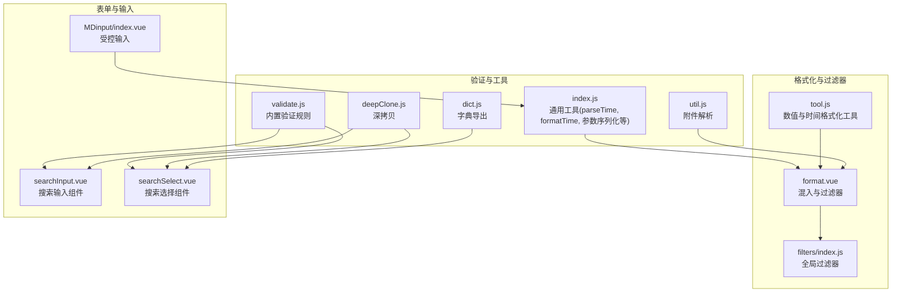
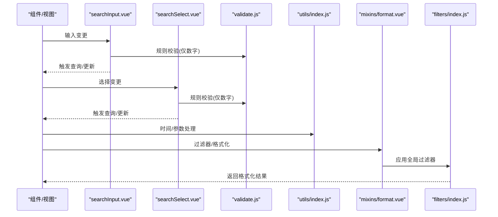
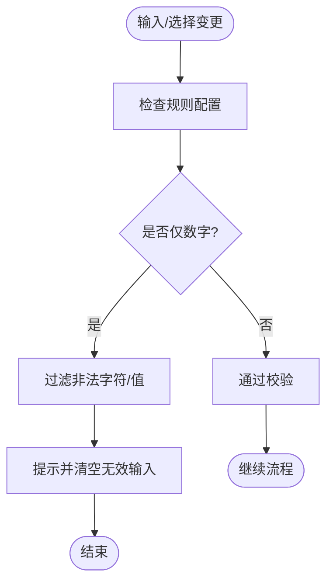
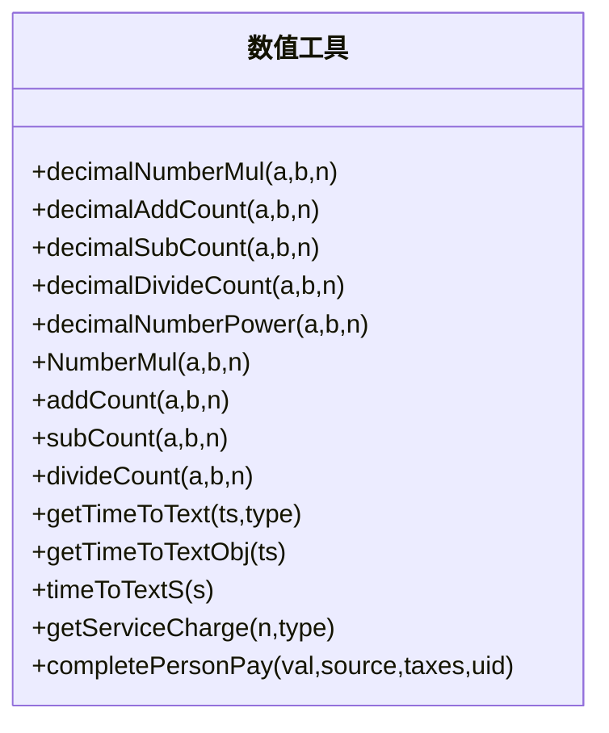
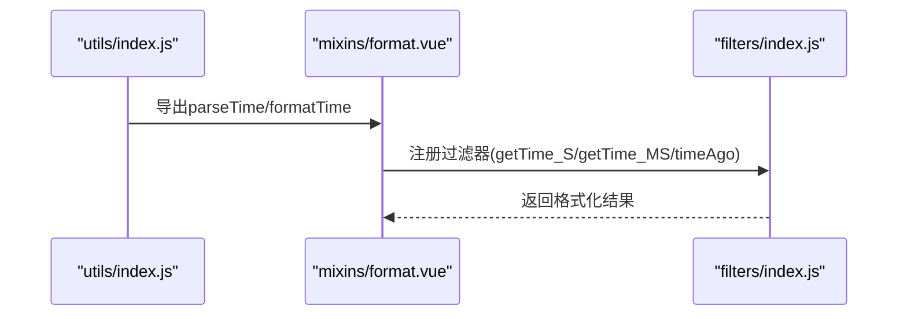
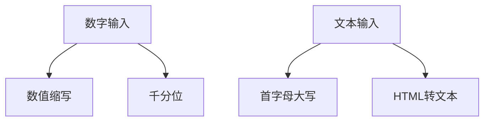
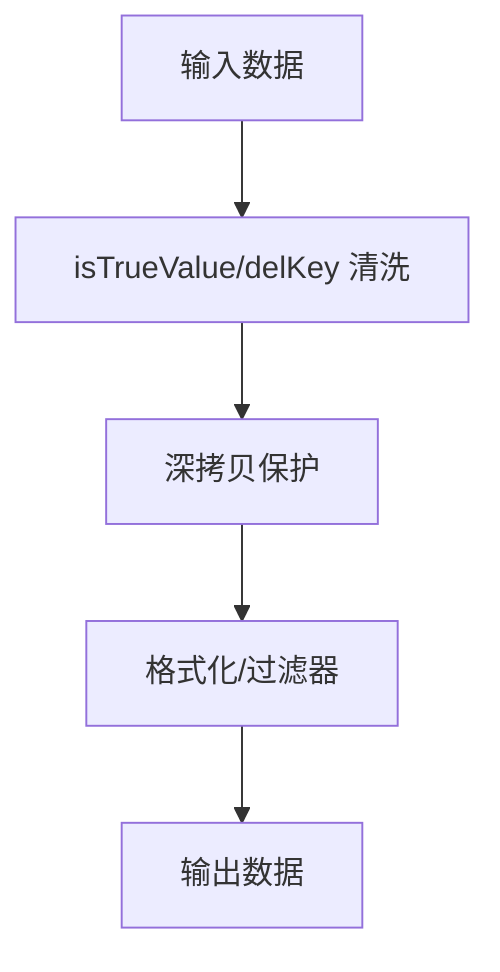
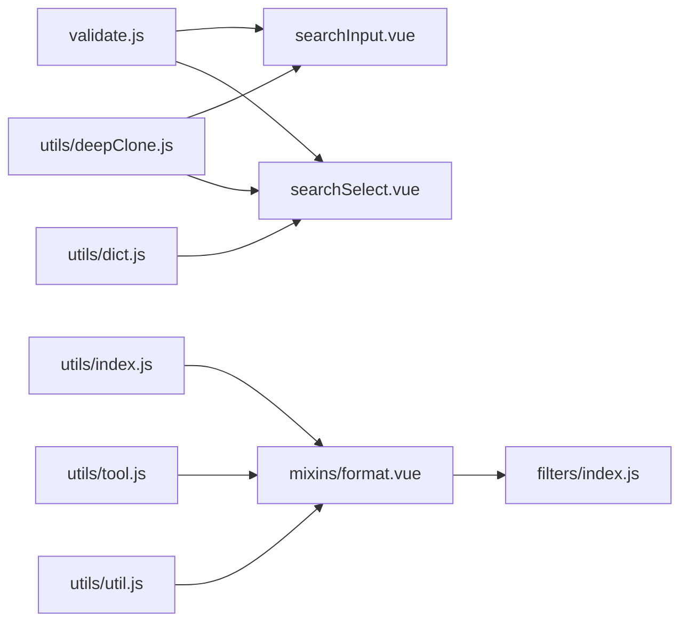

# 数据验证与格式化

<cite>
**本文引用的文件**   
- [validate.js](file://src/utils/validate.js)
- [index.js（filters）](file://src/filters/index.js)
- [index.js（utils）](file://src/utils/index.js)
- [format.vue](file://src/mixins/format.vue)
- [tool.js](file://src/utils/tool.js)
- [deepClone.js](file://src/utils/deepClone.js)
- [dict.js](file://src/utils/dict.js)
- [util.js](file://src/utils/util.js)
- [searchInput.vue](file://src/components/newMySearch/components/searchInput.vue)
- [searchSelect.vue](file://src/components/newMySearch/components/searchSelect.vue)
- [MDinput/index.vue](file://src/components/MDinput/index.vue)
- [validate.spec.js](file://tests/unit/utils/validate.spec.js)
- [formatTime.spec.js](file://tests/unit/utils/formatTime.spec.js)
</cite>

## 目录
1. [简介](#简介)
2. [项目结构](#项目结构)
3. [核心组件](#核心组件)
4. [架构总览](#架构总览)
5. [详细组件分析](#详细组件分析)
6. [依赖关系分析](#依赖关系分析)
7. [性能考量](#性能考量)
8. [故障排查指南](#故障排查指南)
9. [结论](#结论)
10. [附录](#附录)

## 简介
本文件面向 Leisu Admin 项目的前端工程，系统化梳理数据验证与格式化体系，覆盖以下主题：
- 表单验证体系：内置规则、自定义规则、异步校验思路与错误管理
- 数据格式化工具：日期、数字、货币、文本处理
- 过滤器系统：全局过滤器设计、管道操作符、链式格式化
- 数据清洗与转换策略：空值处理、特殊字符过滤、数据标准化
- 最佳实践：用户体验、性能与可维护性
- 常见场景与解决方案：表单输入、搜索筛选、展示格式化

## 项目结构
围绕验证与格式化的关键目录与文件：
- 验证规则与通用工具：src/utils/validate.js、src/utils/index.js、src/utils/deepClone.js、src/utils/dict.js、src/utils/util.js
- 展示与格式化：src/mixins/format.vue、src/filters/index.js、src/utils/tool.js
- 表单与输入组件：src/components/MDinput/index.vue、src/components/newMySearch/components/searchInput.vue、src/components/newMySearch/components/searchSelect.vue
- 单元测试：tests/unit/utils/validate.spec.js、tests/unit/utils/formatTime.spec.js

图表来源
- [validate.js:1-88](file://src/utils/validate.js#L1-L88)
- [index.js（utils）:1-339](file://src/utils/index.js#L1-L339)
- [format.vue:1-800](file://src/mixins/format.vue#L1-L800)
- [index.js（filters）:1-69](file://src/filters/index.js#L1-L69)
- [tool.js:1-1216](file://src/utils/tool.js#L1-L1216)
- [deepClone.js:1-29](file://src/utils/deepClone.js#L1-L29)
- [dict.js:1-11](file://src/utils/dict.js#L1-L11)
- [util.js:1-8](file://src/utils/util.js#L1-L8)
- [searchInput.vue:1-255](file://src/components/newMySearch/components/searchInput.vue#L1-L255)
- [searchSelect.vue:1-342](file://src/components/newMySearch/components/searchSelect.vue#L1-L342)
- [MDinput/index.vue:1-179](file://src/components/MDinput/index.vue#L1-L179)

章节来源
- [validate.js:1-88](file://src/utils/validate.js#L1-L88)
- [index.js（utils）:1-339](file://src/utils/index.js#L1-L339)
- [format.vue:1-800](file://src/mixins/format.vue#L1-L800)
- [index.js（filters）:1-69](file://src/filters/index.js#L1-L69)
- [tool.js:1-1216](file://src/utils/tool.js#L1-L1216)
- [deepClone.js:1-29](file://src/utils/deepClone.js#L1-L29)
- [dict.js:1-11](file://src/utils/dict.js#L1-L11)
- [util.js:1-8](file://src/utils/util.js#L1-L8)
- [searchInput.vue:1-255](file://src/components/newMySearch/components/searchInput.vue#L1-L255)
- [searchSelect.vue:1-342](file://src/components/newMySearch/components/searchSelect.vue#L1-L342)
- [MDinput/index.vue:1-179](file://src/components/MDinput/index.vue#L1-L179)

## 核心组件
- 内置验证规则：邮箱、URL、字母、大小写、字符串、数组等基础校验
- 通用工具：时间解析与相对时间格式化、URL参数序列化、深拷贝、去重、类名切换等
- 展示与过滤器：时间戳格式化、相对时间、数字千分位、数量级缩写、首字母大写
- 数值与货币：基于 decimal.js 与 bigdecimal 的高精度四则运算
- 搜索与输入组件：输入限制（仅数字）、精确/模糊、多选/单选、组合筛选逻辑
- 数据清洗：空值剔除、布尔判定、对象比较、附件解析

章节来源
- [validate.js:1-88](file://src/utils/validate.js#L1-L88)
- [index.js（utils）:1-339](file://src/utils/index.js#L1-L339)
- [index.js（filters）:1-69](file://src/filters/index.js#L1-L69)
- [tool.js:370-510](file://src/utils/tool.js#L370-L510)
- [searchInput.vue:23-40](file://src/components/newMySearch/components/searchInput.vue#L23-L40)
- [searchSelect.vue:71-94](file://src/components/newMySearch/components/searchSelect.vue#L71-L94)
- [util.js:1-8](file://src/utils/util.js#L1-L8)

## 架构总览
验证与格式化在项目中的位置与交互如下：

图表来源
- [searchInput.vue:23-40](file://src/components/newMySearch/components/searchInput.vue#L23-L40)
- [searchSelect.vue:71-94](file://src/components/newMySearch/components/searchSelect.vue#L71-L94)
- [validate.js:1-88](file://src/utils/validate.js#L1-L88)
- [index.js（utils）:1-339](file://src/utils/index.js#L1-L339)
- [format.vue:511-800](file://src/mixins/format.vue#L511-L800)
- [index.js（filters）:1-69](file://src/filters/index.js#L1-L69)

## 详细组件分析

### 验证规则与自定义校验
- 内置规则
  - 外链检测、用户名白名单、URL/邮箱/字母/大小写/字符串/数组等
- 自定义校验
  - 搜索输入组件对“仅数字”规则的即时拦截与提示
  - 搜索选择组件对多选/单选的整数过滤与消息提示
- 异步校验建议
  - 基于 Element UI 表单项的校验事件机制，结合防抖与服务端校验，避免频繁请求
  - 错误管理：统一收集错误、按字段回显、提供重试与清空入口

图表来源
- [searchInput.vue:23-40](file://src/components/newMySearch/components/searchInput.vue#L23-L40)
- [searchSelect.vue:71-94](file://src/components/newMySearch/components/searchSelect.vue#L71-L94)

章节来源
- [validate.js:1-88](file://src/utils/validate.js#L1-L88)
- [searchInput.vue:23-40](file://src/components/newMySearch/components/searchInput.vue#L23-L40)
- [searchSelect.vue:71-94](file://src/components/newMySearch/components/searchSelect.vue#L71-L94)

### 数值与货币格式化（高精度）
- decimal.js 与 bigdecimal 双方案
  - 乘、加、减、除、幂运算，支持保留小数位与四舍五入
  - 除零保护与异常兜底
- 实战应用
  - 服务费/个税计算、时间戳转文本、相对时间、秒数转易读格式

图表来源
- [tool.js:370-510](file://src/utils/tool.js#L370-L510)
- [tool.js:583-739](file://src/utils/tool.js#L583-L739)

章节来源
- [tool.js:370-510](file://src/utils/tool.js#L370-L510)
- [tool.js:583-739](file://src/utils/tool.js#L583-L739)

### 日期与时间格式化
- 工具函数
  - parseTime：支持秒/毫秒/字符串时间，自定义模板输出
  - formatTime：相对时间（刚刚/分钟前/小时前/月日时分）
- 混入与过滤器
  - 时间戳转“年-月-日 时:分:秒”、“年-月-日”、“时:分:秒”
  - 相对时间（短周期/跨月/跨年）

图表来源
- [index.js（utils）:11-80](file://src/utils/index.js#L11-L80)
- [format.vue:696-723](file://src/mixins/format.vue#L696-L723)
- [index.js（filters）:20-29](file://src/filters/index.js#L20-L29)

章节来源
- [index.js（utils）:11-80](file://src/utils/index.js#L11-L80)
- [format.vue:696-723](file://src/mixins/format.vue#L696-L723)
- [index.js（filters）:20-29](file://src/filters/index.js#L20-L29)

### 数字与文本格式化
- 数字格式化
  - 数值缩写（E/P/T/G/M/k）
  - 千分位逗号
- 文本处理
  - 首字母大写
  - HTML 转纯文本

图表来源
- [index.js（filters）:37-68](file://src/filters/index.js#L37-L68)
- [index.js（utils）:169-173](file://src/utils/index.js#L169-L173)

章节来源
- [index.js（filters）:37-68](file://src/filters/index.js#L37-L68)
- [index.js（utils）:169-173](file://src/utils/index.js#L169-L173)

### 过滤器系统与链式格式化
- 全局过滤器
  - 时间相关：timeAgo、numberFormatter、toThousandFilter、uppercaseFirst
  - 混入过滤器：状态码映射、平台/认证/消息类型、体育类型等
- 链式格式化
  - 在模板中通过管道符串联多个过滤器，先做数值缩写再做千分位
  - 注意：混入过滤器需在组件中注册后使用

章节来源
- [index.js（filters）:1-69](file://src/filters/index.js#L1-L69)
- [format.vue:511-800](file://src/mixins/format.vue#L511-L800)

### 数据清洗与转换策略
- 空值处理
  - isTrueValue：统一判定各类值是否有效（支持是否将0视为有效）
  - delKey：删除无效键（含特定占位值）
- 特殊字符过滤
  - 搜索输入/选择组件对非整数输入进行过滤与提示
- 数据标准化
  - 深拷贝：保证原始配置不被意外修改
  - URL 参数序列化与反序列化
  - 附件解析：CDN 前缀拼接、缩略图生成

图表来源
- [tool.js:748-783](file://src/utils/tool.js#L748-L783)
- [deepClone.js:1-29](file://src/utils/deepClone.js#L1-L29)
- [index.js（utils）:135-163](file://src/utils/index.js#L135-L163)
- [util.js:1-8](file://src/utils/util.js#L1-L8)

章节来源
- [tool.js:748-783](file://src/utils/tool.js#L748-L783)
- [deepClone.js:1-29](file://src/utils/deepClone.js#L1-L29)
- [index.js（utils）:135-163](file://src/utils/index.js#L135-L163)
- [util.js:1-8](file://src/utils/util.js#L1-L8)

### 表单与输入组件的验证集成
- MDinput
  - 类型化输入（email/url/number/password/tel/text）
  - 与 Element FormItem 事件联动，支持实时校验
- 搜索输入/选择
  - 通过规则配置（如 int）进行即时拦截
  - 多选/单选场景下的整数过滤与提示

章节来源
- [MDinput/index.vue:1-179](file://src/components/MDinput/index.vue#L1-L179)
- [searchInput.vue:23-40](file://src/components/newMySearch/components/searchInput.vue#L23-L40)
- [searchSelect.vue:71-94](file://src/components/newMySearch/components/searchSelect.vue#L71-L94)

## 依赖关系分析

图表来源
- [validate.js:1-88](file://src/utils/validate.js#L1-L88)
- [searchInput.vue:1-255](file://src/components/newMySearch/components/searchInput.vue#L1-L255)
- [searchSelect.vue:1-342](file://src/components/newMySearch/components/searchSelect.vue#L1-L342)
- [index.js（utils）:1-339](file://src/utils/index.js#L1-L339)
- [format.vue:1-800](file://src/mixins/format.vue#L1-L800)
- [index.js（filters）:1-69](file://src/filters/index.js#L1-L69)
- [tool.js:1-1216](file://src/utils/tool.js#L1-L1216)
- [dict.js:1-11](file://src/utils/dict.js#L1-L11)
- [deepClone.js:1-29](file://src/utils/deepClone.js#L1-L29)
- [util.js:1-8](file://src/utils/util.js#L1-L8)

章节来源
- [validate.js:1-88](file://src/utils/validate.js#L1-L88)
- [index.js（utils）:1-339](file://src/utils/index.js#L1-L339)
- [format.vue:1-800](file://src/mixins/format.vue#L1-L800)
- [index.js（filters）:1-69](file://src/filters/index.js#L1-L69)
- [tool.js:1-1216](file://src/utils/tool.js#L1-L1216)
- [deepClone.js:1-29](file://src/utils/deepClone.js#L1-L29)
- [dict.js:1-11](file://src/utils/dict.js#L1-L11)
- [util.js:1-8](file://src/utils/util.js#L1-L8)
- [searchInput.vue:1-255](file://src/components/newMySearch/components/searchInput.vue#L1-L255)
- [searchSelect.vue:1-342](file://src/components/newMySearch/components/searchSelect.vue#L1-L342)

## 性能考量
- 防抖与节流
  - 搜索输入建议使用防抖，减少无效请求与渲染压力
- 计算复杂度
  - 数值运算采用 decimal.js，避免浮点误差；注意保留位数与四舍五入策略
- DOM 与事件
  - 输入组件的即时校验与提示需避免频繁弹窗，影响交互流畅性
- 过滤器链路
  - 链式过滤器应避免重复计算，必要时缓存中间结果

## 故障排查指南
- 常见问题
  - 输入非整数导致查询异常：检查规则配置与过滤逻辑
  - 时间格式不一致：确认秒/毫秒输入与 parseTime 模板匹配
  - 数值精度丢失：优先使用 decimal.js 或 bigdecimal 方法
  - 空值误判：核对 isTrueValue 的 isZero 参数设置
- 排查步骤
  - 打印中间值：在组件方法中输出当前配置与过滤结果
  - 单元测试：参考 validate.spec.js 与 formatTime.spec.js 的断言思路
  - 日志与错误提示：统一收集并上报，便于定位

章节来源
- [validate.spec.js:1-200](file://tests/unit/utils/validate.spec.js#L1-L200)
- [formatTime.spec.js:1-200](file://tests/unit/utils/formatTime.spec.js#L1-L200)

## 结论
Leisu Admin 的验证与格式化体系以“内置规则 + 组件集成 + 工具函数 + 过滤器”的方式实现，具备良好的扩展性与可维护性。建议在实际业务中：
- 明确规则边界，统一错误提示与反馈
- 优先使用高精度数值工具，避免浮点误差
- 通过防抖与链式过滤器提升性能与体验
- 以单元测试保障关键路径的正确性

## 附录
- 常见验证场景
  - 仅数字输入：searchInput/searchSelect 的规则配置
  - 邮箱/URL 校验：validate.js 中的内置规则
  - 精确/模糊查询：searchSelect 的 precise/more 控制
- 常见格式化需求
  - 时间：parseTime/formatTime 与混入过滤器
  - 数字：numberFormatter/toThousandFilter
  - 文本：uppercaseFirst、html2Text
- 最佳实践清单
  - 输入即校验，即时反馈
  - 保持数据不可变，深拷贝保护
  - 统一错误管理与日志埋点
  - 用例驱动开发，补充单元测试