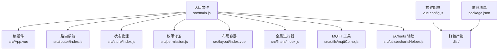
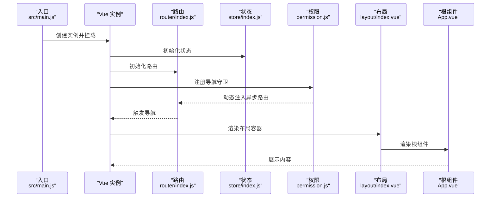
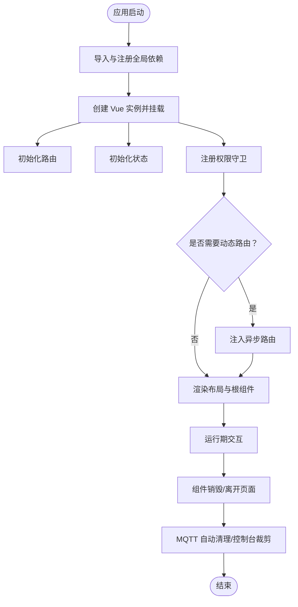
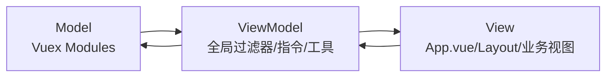
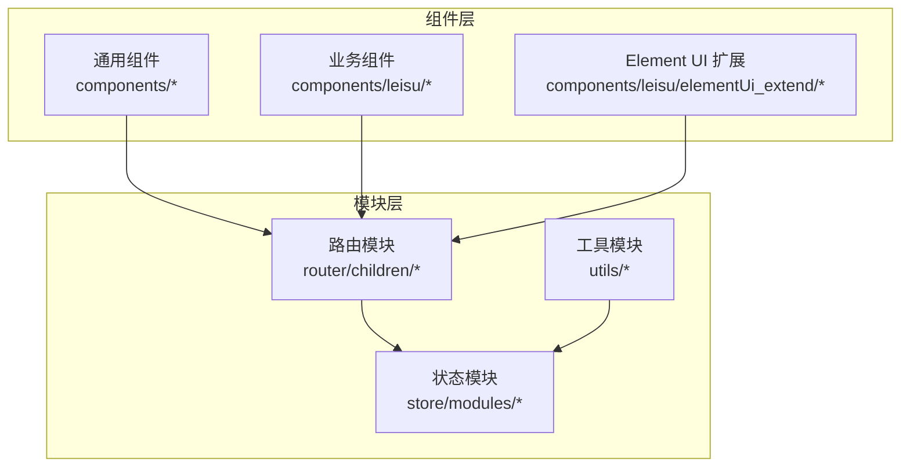
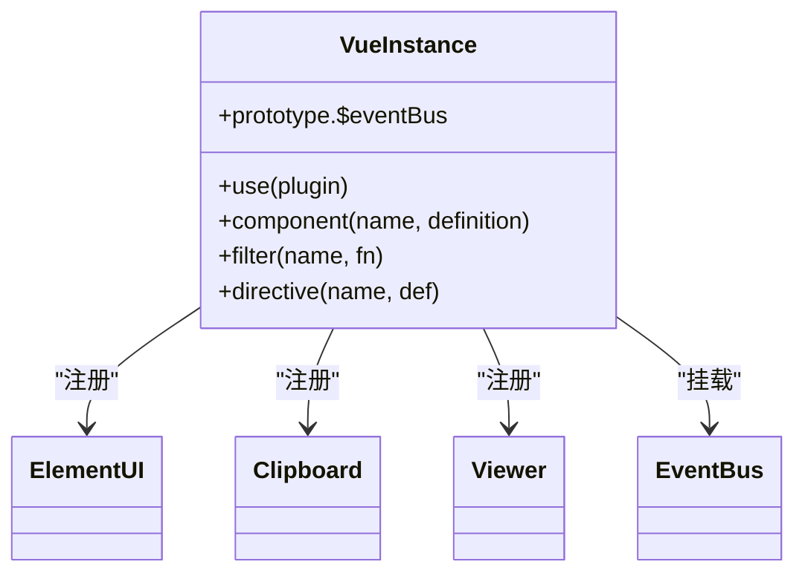
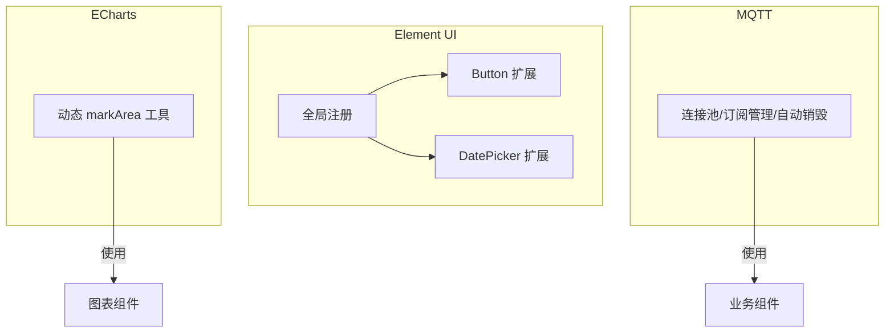
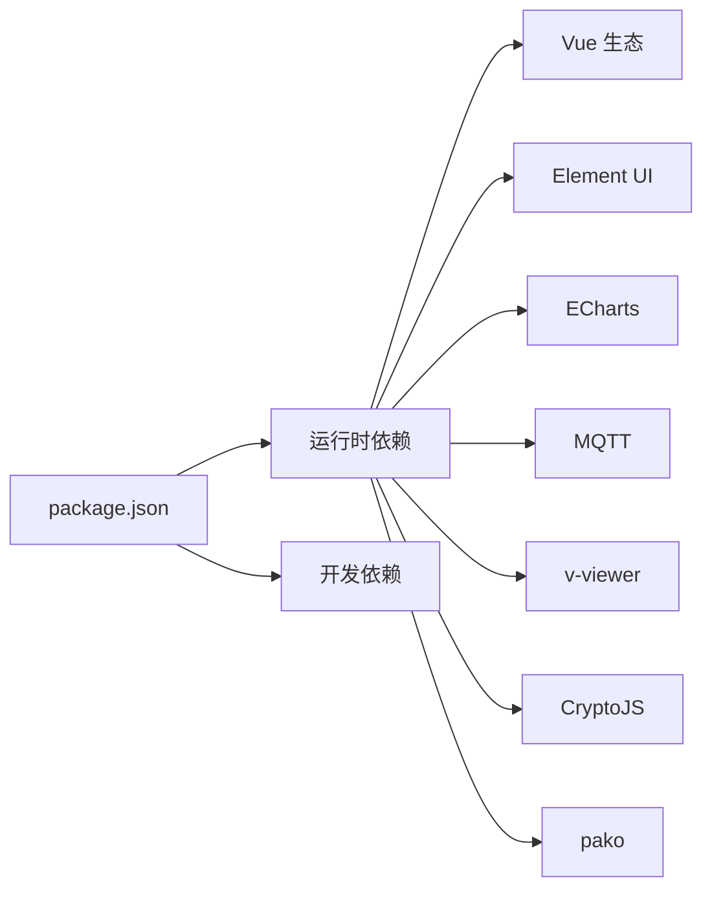

# 应用架构

<cite>
**本文引用的文件**   
- [main.js](file://src/main.js)
- [App.vue](file://src/App.vue)
- [package.json](file://package.json)
- [vue.config.js](file://vue.config.js)
- [settings.js](file://src/settings.js)
- [store/index.js](file://src/store/index.js)
- [router/index.js](file://src/router/index.js)
- [permission.js](file://src/permission.js)
- [layout/index.vue](file://src/layout/index.vue)
- [filters/index.js](file://src/filters/index.js)
- [utils/mqttComp.js](file://src/utils/mqttComp.js)
- [utils/echartsHelper.js](file://src/utils/echartsHelper.js)
- [components/leisu/elementUi_extend/Button.js](file://src/components/leisu/elementUi_extend/Button.js)
- [components/leisu/elementUi_extend/DatePicker.js](file://src/components/leisu/elementUi_extend/DatePicker.js)
- [babel.config.js](file://babel.config.js)
- [postcss.config.js](file://postcss.config.js)
</cite>

## 目录
1. [引言](#引言)
2. [项目结构](#项目结构)
3. [核心组件](#核心组件)
4. [架构总览](#架构总览)
5. [详细组件分析](#详细组件分析)
6. [依赖分析](#依赖分析)
7. [性能考虑](#性能考虑)
8. [故障排查指南](#故障排查指南)
9. [结论](#结论)
10. [附录](#附录)

## 引言
本文件面向 Leisu Admin 项目，系统性梳理基于 Vue.js 2.6.10 的前端应用架构。重点覆盖 MVVM 设计模式在项目中的落地、组件化与模块化组织方式、应用启动流程、Vue 实例配置（插件、全局组件、指令、过滤器）、生命周期管理、构建配置与优化策略，以及第三方库（Element UI、ECharts、MQTT 等）的集成实践。文末提供多幅架构与关系图，帮助开发者快速把握整体设计。

## 项目结构
Leisu Admin 采用典型的 Vue CLI 项目结构，围绕“入口文件 → 根组件 → 路由/状态 → 权限 → 组件体系”的主干展开，并通过构建配置实现开发与生产的差异化能力。

- 入口与根组件
  - 入口文件负责全局依赖注入、插件注册、全局组件/指令/过滤器挂载、实例创建与挂载。
  - 根组件负责页面骨架与全局状态联动。
- 路由与权限
  - 路由定义常量与异步路由，结合权限守卫实现登录态与角色驱动的动态路由注入。
- 状态管理
  - 使用 Vuex 模块化组织，通过上下文扫描自动聚合各模块。
- 构建与样式
  - Vue CLI 默认配置外，定制别名、SVG Sprite、分包策略、运行时优化与生产资源优化。
- 第三方集成
  - Element UI、ECharts、MQTT 等通过封装与工具化提升可维护性与复用性。

**图表来源**
- [main.js:1-526](file://src/main.js#L1-L526)
- [App.vue:1-18](file://src/App.vue#L1-L18)
- [router/index.js:1-177](file://src/router/index.js#L1-L177)
- [store/index.js:1-26](file://src/store/index.js#L1-L26)
- [permission.js:1-82](file://src/permission.js#L1-L82)
- [layout/index.vue:1-124](file://src/layout/index.vue#L1-L124)
- [filters/index.js:1-69](file://src/filters/index.js#L1-L69)
- [utils/mqttComp.js:1-564](file://src/utils/mqttComp.js#L1-L564)
- [utils/echartsHelper.js:1-138](file://src/utils/echartsHelper.js#L1-L138)
- [vue.config.js:1-155](file://vue.config.js#L1-L155)
- [package.json:1-139](file://package.json#L1-L139)

**章节来源**
- [main.js:1-526](file://src/main.js#L1-L526)
- [App.vue:1-18](file://src/App.vue#L1-L18)
- [router/index.js:1-177](file://src/router/index.js#L1-L177)
- [store/index.js:1-26](file://src/store/index.js#L1-L26)
- [permission.js:1-82](file://src/permission.js#L1-L82)
- [layout/index.vue:1-124](file://src/layout/index.vue#L1-L124)
- [filters/index.js:1-69](file://src/filters/index.js#L1-L69)
- [utils/mqttComp.js:1-564](file://src/utils/mqttComp.js#L1-L564)
- [utils/echartsHelper.js:1-138](file://src/utils/echartsHelper.js#L1-L138)
- [vue.config.js:1-155](file://vue.config.js#L1-L155)
- [package.json:1-139](file://package.json#L1-L139)

## 核心组件
- 入口与实例配置
  - 注册 Element UI、全局样式、图标、权限、错误日志、压缩工具等。
  - 注册大量全局组件（自定义业务组件、Element UI 扩展组件）。
  - 注册全局过滤器与指令；挂载事件总线；按环境裁剪控制台输出。
  - 创建 Vue 实例并挂载至 #app。
- 根组件
  - 以 router-view 作为内容占位，配合全局 loading 状态。
- 路由系统
  - 定义常量路由（登录、404/401 等）与异步路由（按模块划分），支持 reset 与动态注入。
- 状态管理
  - 通过 require.context 自动扫描 modules 目录，聚合命名空间模块与 getters。
- 权限守卫
  - 基于 Token 与角色信息动态生成可访问路由并注入，处理白名单与重定向。
- 布局容器
  - 组合侧边栏、顶部导航、标签页、右侧设置面板与主内容区，响应式适配。
- 全局过滤器
  - 时间格式化、数字单位、千分位、首字母大写等常用过滤器。
- 第三方集成
  - Element UI 扩展（按钮禁用防抖、日期选择快捷项）。
  - ECharts 辅助（markArea 边框宽度随缩放动态调整）。
  - MQTT 工具（连接池、场景化订阅/取消、通配符匹配、回调去重与自动销毁）。

**章节来源**
- [main.js:1-526](file://src/main.js#L1-L526)
- [App.vue:1-18](file://src/App.vue#L1-L18)
- [router/index.js:1-177](file://src/router/index.js#L1-L177)
- [store/index.js:1-26](file://src/store/index.js#L1-L26)
- [permission.js:1-82](file://src/permission.js#L1-L82)
- [layout/index.vue:1-124](file://src/layout/index.vue#L1-L124)
- [filters/index.js:1-69](file://src/filters/index.js#L1-L69)
- [components/leisu/elementUi_extend/Button.js:1-27](file://src/components/leisu/elementUi_extend/Button.js#L1-L27)
- [components/leisu/elementUi_extend/DatePicker.js:1-55](file://src/components/leisu/elementUi_extend/DatePicker.js#L1-L55)
- [utils/echartsHelper.js:1-138](file://src/utils/echartsHelper.js#L1-L138)
- [utils/mqttComp.js:1-564](file://src/utils/mqttComp.js#L1-L564)

## 架构总览
下图展示从入口到渲染的关键链路与关键模块交互：

**图表来源**
- [main.js:520-526](file://src/main.js#L520-L526)
- [router/index.js:162-177](file://src/router/index.js#L162-L177)
- [store/index.js:20-26](file://src/store/index.js#L20-L26)
- [permission.js:13-76](file://src/permission.js#L13-L76)
- [layout/index.vue:1-124](file://src/layout/index.vue#L1-L124)
- [App.vue:1-18](file://src/App.vue#L1-L18)

## 详细组件分析

### 启动流程与生命周期
- 启动阶段
  - main.js 中导入全局依赖、注册 Element UI、全局组件、指令、过滤器与事件总线。
  - 创建 Vue 实例并挂载到 #app。
- 运行阶段
  - 路由守卫在导航前检查 Token 与角色，动态注入异步路由。
  - 布局组件根据设备与设置切换固定头部、标签页与侧边栏。
- 销毁阶段
  - 组件销毁时，MQTT 工具会自动清理订阅与连接（无场景且无全局订阅时）。
  - 全局控制台输出在生产环境被裁剪，降低冗余日志。

**图表来源**
- [main.js:1-526](file://src/main.js#L1-L526)
- [permission.js:1-82](file://src/permission.js#L1-L82)
- [utils/mqttComp.js:496-507](file://src/utils/mqttComp.js#L496-L507)

**章节来源**
- [main.js:1-526](file://src/main.js#L1-L526)
- [permission.js:1-82](file://src/permission.js#L1-L82)
- [utils/mqttComp.js:496-507](file://src/utils/mqttComp.js#L496-L507)

### MVVM 设计模式实现
- Model（模型）
  - Vuex 模块化状态（用户、权限、标签页、系统设置等），通过 actions/mutations/getters 管理数据流。
- View（视图）
  - App.vue 作为根视图，layout/index.vue 作为页面骨架，各业务视图与通用组件构成 UI 层。
- ViewModel（视图模型）
  - main.js 中的全局过滤器、指令与工具方法承担视图层逻辑抽象，简化模板复杂度。
- 双向绑定与响应式
  - 通过 Vue 2.x 的响应式系统与 Vuex 状态驱动视图更新。

**图表来源**
- [store/index.js:1-26](file://src/store/index.js#L1-L26)
- [filters/index.js:1-69](file://src/filters/index.js#L1-L69)
- [main.js:447-497](file://src/main.js#L447-L497)
- [App.vue:1-18](file://src/App.vue#L1-L18)
- [layout/index.vue:1-124](file://src/layout/index.vue#L1-L124)

**章节来源**
- [store/index.js:1-26](file://src/store/index.js#L1-L26)
- [filters/index.js:1-69](file://src/filters/index.js#L1-L69)
- [main.js:447-497](file://src/main.js#L447-L497)
- [App.vue:1-18](file://src/App.vue#L1-L18)
- [layout/index.vue:1-124](file://src/layout/index.vue#L1-L124)

### 组件化与模块化组织
- 组件化
  - 通用组件集中于 components 目录，按功能域拆分（如 leisu 业务组件、图表、上传、编辑器等）。
  - Element UI 扩展组件（Button、DatePicker）通过局部扩展增强默认行为。
- 模块化
  - 路由按业务模块拆分子路由文件，统一在 index.js 中聚合。
  - Vuex 模块通过 require.context 自动扫描与聚合，降低手动引入成本。
  - 工具函数（mqtt、echartsHelper）独立封装，便于跨组件复用。

**图表来源**
- [router/index.js:11-30](file://src/router/index.js#L11-L30)
- [store/index.js:7-18](file://src/store/index.js#L7-L18)
- [components/leisu/elementUi_extend/Button.js:1-27](file://src/components/leisu/elementUi_extend/Button.js#L1-L27)
- [components/leisu/elementUi_extend/DatePicker.js:1-55](file://src/components/leisu/elementUi_extend/DatePicker.js#L1-L55)
- [utils/mqttComp.js:1-564](file://src/utils/mqttComp.js#L1-L564)
- [utils/echartsHelper.js:1-138](file://src/utils/echartsHelper.js#L1-L138)

**章节来源**
- [router/index.js:11-30](file://src/router/index.js#L11-L30)
- [store/index.js:7-18](file://src/store/index.js#L7-L18)
- [components/leisu/elementUi_extend/Button.js:1-27](file://src/components/leisu/elementUi_extend/Button.js#L1-L27)
- [components/leisu/elementUi_extend/DatePicker.js:1-55](file://src/components/leisu/elementUi_extend/DatePicker.js#L1-L55)
- [utils/mqttComp.js:1-564](file://src/utils/mqttComp.js#L1-L564)
- [utils/echartsHelper.js:1-138](file://src/utils/echartsHelper.js#L1-L138)

### Vue 实例配置要点
- 插件注册
  - Element UI：按 Cookie 设置默认尺寸。
  - v-viewer：图片画廊全局可用。
  - VueClipboard：复制粘贴能力。
- 全局组件注册
  - 大量业务组件与 Element UI 扩展组件通过 Vue.component 注册，统一命名与使用。
- 指令与过滤器
  - 注册全局过滤器（时间、数字、格式化等）。
  - 注册权限指令（v-has）与 CDN 前缀指令占位。
- 事件总线
  - 通过 EventBus 创建全局事件总线，挂载到 Vue.prototype。

**图表来源**
- [main.js:7-14](file://src/main.js#L7-L14)
- [main.js:30-91](file://src/main.js#L30-L91)
- [main.js:447-497](file://src/main.js#L447-L497)
- [main.js:516-518](file://src/main.js#L516-L518)

**章节来源**
- [main.js:7-14](file://src/main.js#L7-L14)
- [main.js:30-91](file://src/main.js#L30-L91)
- [main.js:447-497](file://src/main.js#L447-L497)
- [main.js:516-518](file://src/main.js#L516-L518)

### 第三方库集成架构
- Element UI
  - 全局注册并按 Cookie 设置默认尺寸；扩展 Button（点击防抖禁用）与 DatePicker（快捷项）。
- ECharts
  - 封装 markArea 边框宽度随 dataZoom 动态调整的工具函数，提升可视化体验。
- MQTT
  - 连接池 + 场景化订阅/取消 + 通配符匹配 + 回调去重 + 自动销毁，保证多场景下的稳定与高效。

**图表来源**
- [main.js:65-72](file://src/main.js#L65-L72)
- [components/leisu/elementUi_extend/Button.js:1-27](file://src/components/leisu/elementUi_extend/Button.js#L1-L27)
- [components/leisu/elementUi_extend/DatePicker.js:1-55](file://src/components/leisu/elementUi_extend/DatePicker.js#L1-L55)
- [utils/echartsHelper.js:71-103](file://src/utils/echartsHelper.js#L71-L103)
- [utils/mqttComp.js:14-97](file://src/utils/mqttComp.js#L14-L97)

**章节来源**
- [main.js:65-72](file://src/main.js#L65-L72)
- [components/leisu/elementUi_extend/Button.js:1-27](file://src/components/leisu/elementUi_extend/Button.js#L1-L27)
- [components/leisu/elementUi_extend/DatePicker.js:1-55](file://src/components/leisu/elementUi_extend/DatePicker.js#L1-L55)
- [utils/echartsHelper.js:71-103](file://src/utils/echartsHelper.js#L71-L103)
- [utils/mqttComp.js:14-97](file://src/utils/mqttComp.js#L14-L97)

## 依赖分析
- 运行时依赖
  - Vue 2.6.10、Vue Router、Vuex、Element UI、Axios、CryptoJS、ECharts、MQTT、v-viewer、pako 等。
- 开发时依赖
  - @vue/cli-service、babel、eslint、jest、svg-sprite-loader 等。
- 依赖关系特征
  - 业务组件与工具函数对第三方库存在直接依赖；路由与状态模块对 Vue 生态依赖稳定。
  - 构建配置对外部库（如百度地图）进行 externals 处理，减少打包体积。

**图表来源**
- [package.json:37-96](file://package.json#L37-L96)
- [vue.config.js:32-35](file://vue.config.js#L32-L35)

**章节来源**
- [package.json:37-96](file://package.json#L37-L96)
- [vue.config.js:32-35](file://vue.config.js#L32-L35)

## 性能考虑
- 分包与缓存
  - 通过 splitChunks 将第三方库、Element UI、通用组件分别拆分为独立 chunk，提升缓存命中率。
  - runtimeChunk 单独提取，优化长列表渲染与热更新。
- 资源优化
  - 生产环境关闭 source map，关闭 ESLint 校验，减少构建开销。
  - SVG 使用 sprite-loader，减少请求与体积。
- 运行时优化
  - 生产环境裁剪控制台输出，降低日志开销。
  - Element UI 默认尺寸按 Cookie 设置，避免重复计算。
- 图表与网络
  - ECharts 动态调整 markArea 边框宽度，兼顾可读性与性能。
  - MQTT 工具通过连接池与场景化订阅，避免重复订阅与内存泄漏。

**章节来源**
- [vue.config.js:127-152](file://vue.config.js#L127-L152)
- [main.js:504-514](file://src/main.js#L504-L514)
- [utils/echartsHelper.js:71-103](file://src/utils/echartsHelper.js#L71-L103)
- [utils/mqttComp.js:14-97](file://src/utils/mqttComp.js#L14-L97)

## 故障排查指南
- 登录与权限
  - 若进入白名单页面后未跳转，检查白名单数组与守卫逻辑。
  - 若动态路由注入失败，检查角色信息与 generateRoutes 分发结果。
- 路由与标签页
  - 三级及以上路由缓存异常，检查 keep-alive 与 matched 数组处理。
- 图表与可视化
  - ECharts markArea 边框不生效，检查 dataZoom 事件与 totalDataPoints 输入。
- MQTT
  - 订阅无回调或消息丢失，检查场景键、主题匹配与回调去重逻辑。
  - 连接频繁断开，检查连接池状态与自动销毁条件。

**章节来源**
- [permission.js:13-76](file://src/permission.js#L13-L76)
- [utils/echartsHelper.js:88-103](file://src/utils/echartsHelper.js#L88-L103)
- [utils/mqttComp.js:115-166](file://src/utils/mqttComp.js#L115-L166)
- [utils/mqttComp.js:417-468](file://src/utils/mqttComp.js#L417-L468)

## 结论
Leisu Admin 以 Vue 2.6.10 为核心，采用 MVVM 与组件化/模块化架构，结合完善的路由与状态管理、权限守卫与构建优化，形成稳定可扩展的管理后台前端框架。通过 Element UI 扩展、ECharts 辅助与 MQTT 工具的工程化封装，显著提升了开发效率与运行性能。建议在后续迭代中持续关注第三方库升级、构建性能与可观测性建设。

## 附录
- 构建与脚本
  - 本地开发、生产构建、预览与测试脚本在 package.json scripts 中定义。
  - Babel 与 PostCSS 配置保持默认生态兼容。
- 设置项
  - 页面标题、标签页、固定头部、侧边栏 Logo 等可通过 settings.js 控制。

**章节来源**
- [package.json:7-20](file://package.json#L7-L20)
- [babel.config.js:1-6](file://babel.config.js#L1-L6)
- [postcss.config.js:1-6](file://postcss.config.js#L1-L6)
- [settings.js:1-36](file://src/settings.js#L1-L36)