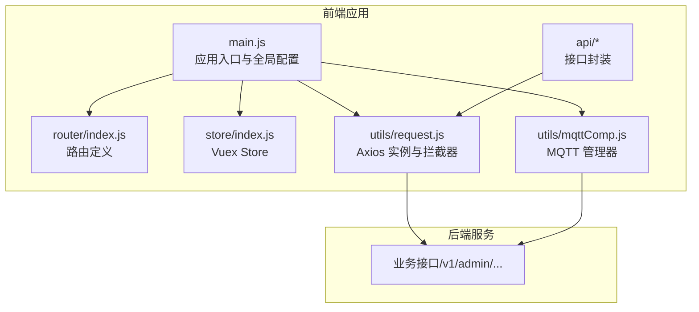
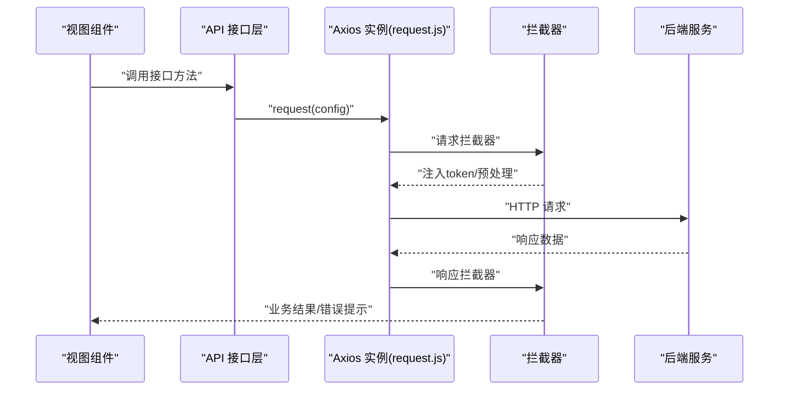
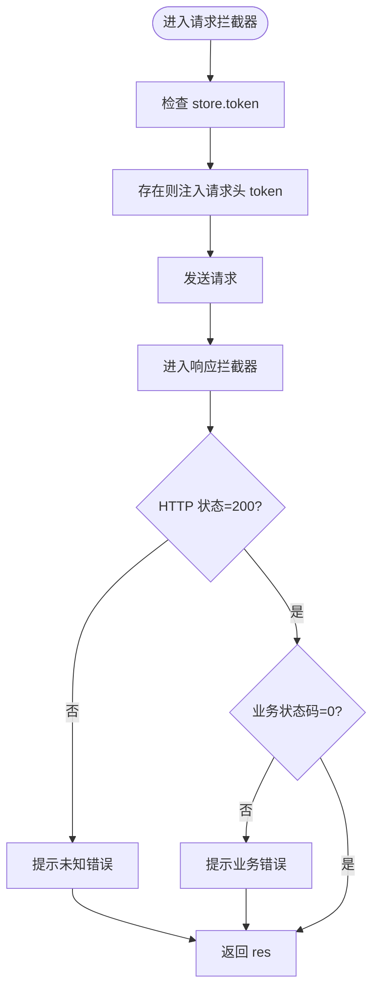
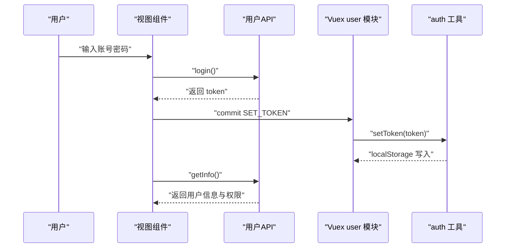
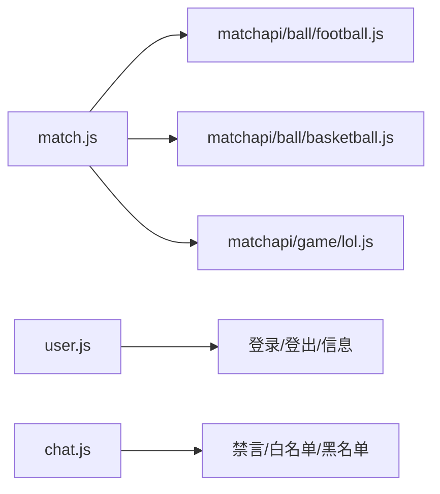
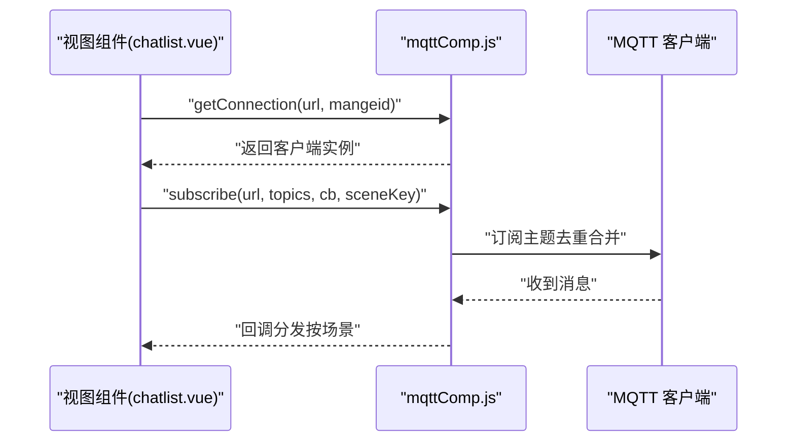
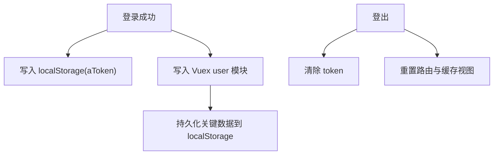
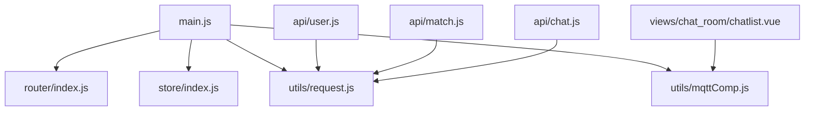

# 数据流架构

<cite>
**本文引用的文件**
- [src/utils/request.js](file://src/utils/request.js)
- [src/utils/auth.js](file://src/utils/auth.js)
- [src/main.js](file://src/main.js)
- [src/store/index.js](file://src/store/index.js)
- [src/store/modules/user.js](file://src/store/modules/user.js)
- [src/store/modules/app.js](file://src/store/modules/app.js)
- [src/store/modules/tagsView.js](file://src/store/modules/tagsView.js)
- [src/router/index.js](file://src/router/index.js)
- [src/utils/mqttComp.js](file://src/utils/mqttComp.js)
- [src/api/user.js](file://src/api/user.js)
- [src/api/match.js](file://src/api/match.js)
- [src/api/matchapi/ball/football.js](file://src/api/matchapi/ball/football.js)
- [src/api/chat.js](file://src/api/chat.js)
- [src/views/chat_room/chatlist.vue](file://src/views/chat_room/chatlist.vue)
</cite>

## 目录
1. [引言](#引言)
2. [项目结构](#项目结构)
3. [核心组件](#核心组件)
4. [架构总览](#架构总览)
5. [详细组件分析](#详细组件分析)
6. [依赖关系分析](#依赖关系分析)
7. [性能考量](#性能考量)
8. [故障排查指南](#故障排查指南)
9. [结论](#结论)
10. [附录](#附录)

## 引言
本文件面向 Leisu Admin 项目的前端与后端数据流，聚焦以下目标：
- 前端到后端的 HTTP 请求处理链路与拦截器设计
- API 接口层的分类、封装与调用规范
- 响应拦截器与错误处理机制
- 数据缓存策略（内存缓存、本地存储、缓存失效）
- 实时数据更新（MQTT 消息订阅与场景化管理）
- 数据流图与 API 调用流程图，帮助开发者快速理解数据在系统中的流转

## 项目结构
Leisu Admin 采用 Vue 2 + Vue-Router + Vuex 架构，结合 Axios 作为 HTTP 客户端，配合自定义请求拦截器与 MQTT 客户端实现前后端数据交互与实时消息订阅。

图表来源
- [src/main.js:1-526](file://src/main.js#L1-L526)
- [src/router/index.js:1-177](file://src/router/index.js#L1-L177)
- [src/store/index.js:1-26](file://src/store/index.js#L1-L26)
- [src/utils/request.js:1-130](file://src/utils/request.js#L1-L130)
- [src/utils/mqttComp.js:1-564](file://src/utils/mqttComp.js#L1-L564)
- [src/api/user.js:1-37](file://src/api/user.js#L1-L37)

章节来源
- [src/main.js:1-526](file://src/main.js#L1-L526)
- [src/router/index.js:1-177](file://src/router/index.js#L1-L177)
- [src/store/index.js:1-26](file://src/store/index.js#L1-L26)

## 核心组件
- 请求拦截器与响应拦截器：统一注入 token、错误提示与状态码处理
- 认证与会话：基于 localStorage 的 token 管理
- 接口封装：按领域拆分 API 文件，集中导出与复用
- 实时订阅：MQTT 场景化订阅与全局去重合并
- 状态与缓存：Vuex 模块与本地存储联动

章节来源
- [src/utils/request.js:1-130](file://src/utils/request.js#L1-L130)
- [src/utils/auth.js:1-17](file://src/utils/auth.js#L1-L17)
- [src/utils/mqttComp.js:1-564](file://src/utils/mqttComp.js#L1-L564)
- [src/store/modules/user.js:1-542](file://src/store/modules/user.js#L1-L542)

## 架构总览
从前端到后端的数据流分为三段：
1) HTTP 请求阶段：请求拦截器注入 token，统一超时与跨域配置
2) 业务调用阶段：API 层封装具体接口，调用 Axios 实例
3) 响应处理阶段：响应拦截器统一处理业务状态码与错误提示

实时数据阶段：
- 通过 MQTT 管理器建立连接，按场景订阅主题，消息到达后按场景分发回调

图表来源
- [src/utils/request.js:28-127](file://src/utils/request.js#L28-L127)
- [src/api/user.js:1-37](file://src/api/user.js#L1-L37)

## 详细组件分析

### 请求拦截器与响应拦截器
- 请求拦截器
  - 注入 token：从 store 的 token 字段读取并写入请求头
  - 环境适配：根据当前域名选择不同基础 URL（生产/测试/数据环境）
  - 跨域携带：withCredentials 保证 Cookie 跨域传递
  - 超时控制：统一 50s 超时
- 响应拦截器
  - 状态码校验：非 200 统一提示
  - 业务状态码：res.code=201000 触发登出流程；非 0 且非 blob 类型弹出错误
  - HTTP 错误映射：4xx/5xx 映射为可读错误消息并提示
  - 返回标准化：始终返回 res，便于上层统一处理

图表来源
- [src/utils/request.js:28-127](file://src/utils/request.js#L28-L127)

章节来源
- [src/utils/request.js:1-130](file://src/utils/request.js#L1-L130)

### 认证与会话管理
- token 存储：localStorage 中以 aToken 为键
- 登录流程：调用用户接口获取 token，提交至 Vuex user 模块并持久化
- 登出流程：清除 token、重置路由、清理缓存视图
- 权限加载：登录后拉取用户信息、角色与权限，动态生成路由

图表来源
- [src/api/user.js:1-37](file://src/api/user.js#L1-L37)
- [src/store/modules/user.js:139-336](file://src/store/modules/user.js#L139-L336)
- [src/utils/auth.js:1-17](file://src/utils/auth.js#L1-L17)

章节来源
- [src/store/modules/user.js:1-542](file://src/store/modules/user.js#L1-L542)
- [src/utils/auth.js:1-17](file://src/utils/auth.js#L1-L17)

### API 接口层架构
- 分类组织：按业务域拆分 API 文件（如 match、user、chat 等）
- 继承聚合：match.js 导出各运动/游戏的子模块接口，便于统一引用
- 统一封装：每个接口方法返回 request(config)，由拦截器统一处理
- 文档规范：接口命名清晰、路径遵循 /v1/admin/{domain}/{action} 规范

图表来源
- [src/api/match.js:1-18](file://src/api/match.js#L1-L18)
- [src/api/matchapi/ball/football.js:1-200](file://src/api/matchapi/ball/football.js#L1-L200)
- [src/api/user.js:1-37](file://src/api/user.js#L1-L37)
- [src/api/chat.js:1-72](file://src/api/chat.js#L1-L72)

章节来源
- [src/api/match.js:1-800](file://src/api/match.js#L1-L800)
- [src/api/matchapi/ball/football.js:1-200](file://src/api/matchapi/ball/football.js#L1-L200)
- [src/api/user.js:1-37](file://src/api/user.js#L1-L37)
- [src/api/chat.js:1-72](file://src/api/chat.js#L1-L72)

### 实时数据更新（MQTT）
- 连接池管理：按 mqttUrl 维护连接实例，避免重复连接
- 场景化订阅：同一 URL 下按场景（如 chat_room）维护订阅集合，支持 # 通配符与 + 单层通配
- 全局去重合并：仅对新增主题发起订阅，对移除主题发起取消订阅
- 消息分发：按主题匹配规则分发到对应场景回调，JSON 解析与异常捕获
- 生命周期：无订阅时自动销毁连接，避免资源泄露

图表来源
- [src/views/chat_room/chatlist.vue:588-606](file://src/views/chat_room/chatlist.vue#L588-L606)
- [src/utils/mqttComp.js:1-564](file://src/utils/mqttComp.js#L1-L564)

章节来源
- [src/utils/mqttComp.js:1-564](file://src/utils/mqttComp.js#L1-L564)
- [src/views/chat_room/chatlist.vue:588-606](file://src/views/chat_room/chatlist.vue#L588-L606)

### 数据缓存策略
- 内存缓存（Vuex）
  - 用户信息与权限：登录后写入 user 模块，动态生成路由与菜单
  - 商品列表、渠道信息等：写入 state 并通过本地存储持久化
- 本地存储（localStorage）
  - token：aToken 键
  - 标签与目录：catalogs、intelligenceTabList、productList、localChannelData 等
- 缓存失效
  - 登出时清除 token 与路由缓存
  - 动态权限变更时重置路由并重新生成

图表来源
- [src/store/modules/user.js:172-336](file://src/store/modules/user.js#L172-L336)
- [src/utils/auth.js:1-17](file://src/utils/auth.js#L1-L17)

章节来源
- [src/store/modules/user.js:1-542](file://src/store/modules/user.js#L1-L542)
- [src/store/modules/app.js:1-65](file://src/store/modules/app.js#L1-L65)
- [src/store/modules/tagsView.js:1-181](file://src/store/modules/tagsView.js#L1-L181)
- [src/utils/auth.js:1-17](file://src/utils/auth.js#L1-L17)

## 依赖关系分析
- main.js 引入 Element UI、路由、Vuex、权限与全局过滤器，初始化应用
- store/index.js 动态加载 modules 目录下的所有模块
- router/index.js 定义常量路由与异步路由，支持动态添加
- utils/request.js 作为全局 Axios 实例，被所有 API 文件依赖
- utils/mqttComp.js 为全局 MQTT 管理器，被视图组件按需使用

图表来源
- [src/main.js:1-526](file://src/main.js#L1-L526)
- [src/router/index.js:1-177](file://src/router/index.js#L1-L177)
- [src/store/index.js:1-26](file://src/store/index.js#L1-L26)
- [src/utils/request.js:1-130](file://src/utils/request.js#L1-L130)
- [src/utils/mqttComp.js:1-564](file://src/utils/mqttComp.js#L1-L564)
- [src/api/user.js:1-37](file://src/api/user.js#L1-L37)
- [src/api/match.js:1-18](file://src/api/match.js#L1-L18)
- [src/api/chat.js:1-72](file://src/api/chat.js#L1-L72)
- [src/views/chat_room/chatlist.vue:588-606](file://src/views/chat_room/chatlist.vue#L588-L606)

章节来源
- [src/main.js:1-526](file://src/main.js#L1-L526)
- [src/store/index.js:1-26](file://src/store/index.js#L1-L26)
- [src/router/index.js:1-177](file://src/router/index.js#L1-L177)

## 性能考量
- 请求拦截器统一超时与跨域配置，避免重复设置
- Axios 实例复用，减少连接开销
- MQTT 场景化订阅与全局去重合并，降低服务器压力
- Vuex 与 localStorage 双通道缓存，缩短二次进入的加载时间
- 建议
  - 对高频接口增加本地缓存 TTL 控制
  - 对大体积数据采用懒加载与分页
  - 对 MQTT 主题进行合理分层，避免过度通配符订阅

## 故障排查指南
- 登录后 401 或跳转首页
  - 检查响应拦截器对业务状态码 201000 的处理与 token 清理
  - 确认 localStorage 中 aToken 是否正确写入
- 接口报错提示
  - 查看响应拦截器对 HTTP 状态码与业务状态码的映射
  - 确认请求头 token 是否注入成功
- MQTT 无法接收消息
  - 检查 getConnection 是否成功，subscribe 是否传入正确 sceneKey
  - 使用 getFullStatus 输出连接状态，核对全局订阅与场景订阅集合

章节来源
- [src/utils/request.js:45-127](file://src/utils/request.js#L45-L127)
- [src/utils/auth.js:1-17](file://src/utils/auth.js#L1-L17)
- [src/utils/mqttComp.js:512-561](file://src/utils/mqttComp.js#L512-L561)

## 结论
Leisu Admin 的数据流以 Axios 拦截器为核心，统一处理认证、错误与响应格式；API 层按领域拆分，便于扩展与维护；MQTT 管理器提供场景化订阅能力，满足实时消息需求；结合 Vuex 与 localStorage 的缓存策略，提升用户体验与性能。建议在现有基础上进一步完善缓存 TTL、接口幂等与异常链路埋点，持续优化数据流稳定性与可观测性。

## 附录
- 环境变量与基础 URL 选择逻辑
  - 根据当前域名判断部署环境，动态设置 VUE_APP_BASE_API 与 MQTT 地址
- 路由与权限
  - 登录后根据角色动态生成路由，支持权限按钮级控制

章节来源
- [src/utils/request.js:10-26](file://src/utils/request.js#L10-L26)
- [src/store/modules/user.js:172-336](file://src/store/modules/user.js#L172-L336)