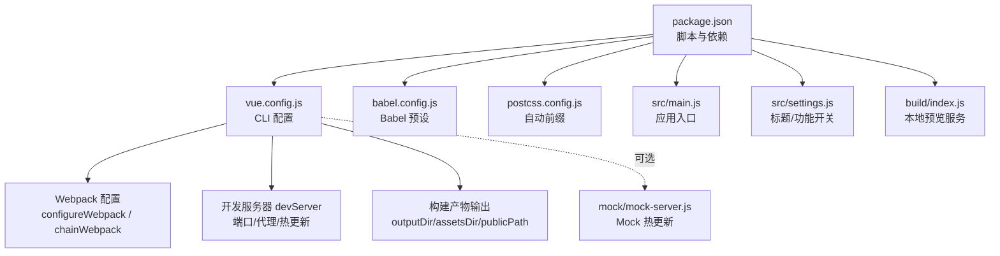
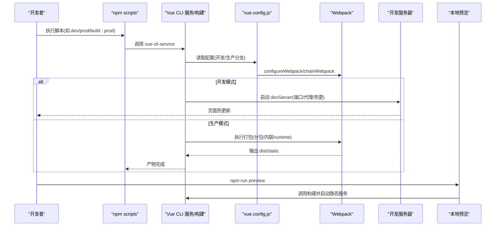
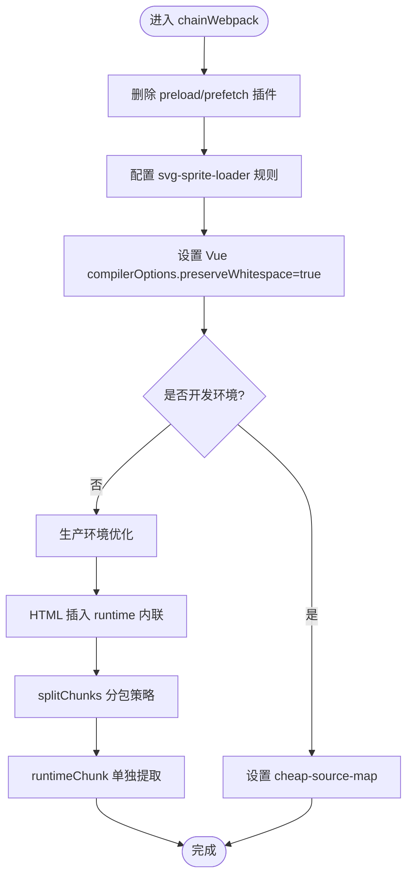
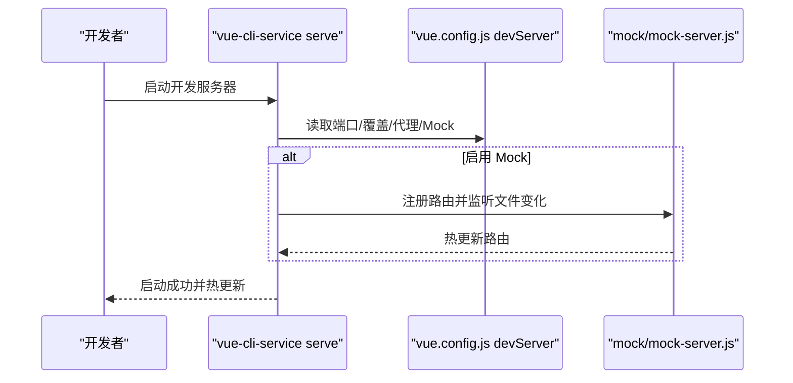
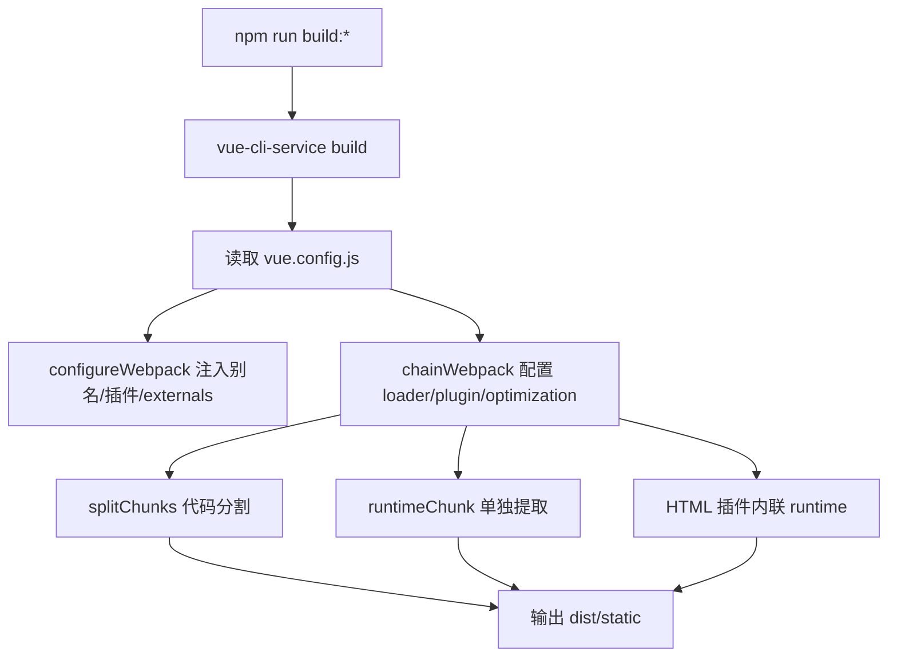
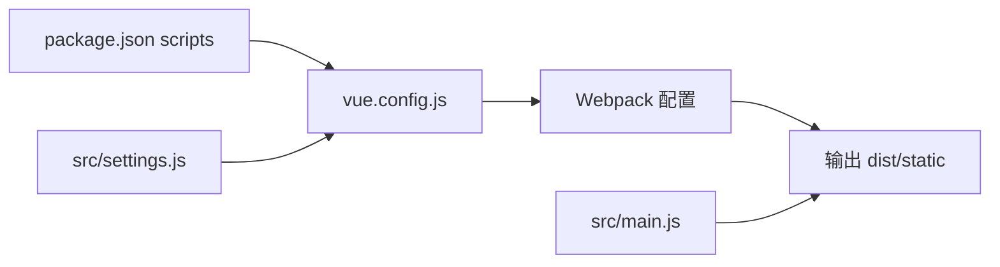

# 构建架构

<cite>
**本文引用的文件**
- [package.json](file://package.json)
- [vue.config.js](file://vue.config.js)
- [babel.config.js](file://babel.config.js)
- [postcss.config.js](file://postcss.config.js)
- [src/main.js](file://src/main.js)
- [src/settings.js](file://src/settings.js)
- [build/index.js](file://build/index.js)
- [mock/mock-server.js](file://mock/mock-server.js)
- [mock/index.js](file://mock/index.js)
</cite>

## 目录
1. [简介](#简介)
2. [项目结构](#项目结构)
3. [核心组件](#核心组件)
4. [架构总览](#架构总览)
5. [详细组件分析](#详细组件分析)
6. [依赖关系分析](#依赖关系分析)
7. [性能考量](#性能考量)
8. [故障排查指南](#故障排查指南)
9. [结论](#结论)
10. [附录](#附录)

## 简介
本文件面向 Leisu Admin 项目的前端工程团队与运维人员，系统性梳理基于 Vue CLI 的构建架构与流程，覆盖开发环境配置、生产环境优化、构建脚本组织、Webpack 配置、开发服务器、样式处理、CDN 与缓存策略等关键主题，并通过流程图与架构图帮助读者快速理解整体设计。

## 项目结构
Leisu Admin 采用 Vue CLI 3.x 生成的工程骨架，核心目录与文件如下：
- 根级配置与脚本：package.json、vue.config.js、babel.config.js、postcss.config.js
- 应用入口与设置：src/main.js、src/settings.js
- 构建辅助：build/index.js（用于本地预览）
- Mock 服务：mock/mock-server.js、mock/index.js
- 开发与生产模式：通过 npm scripts 与 --mode 参数切换

图表来源
- [package.json:1-139](file://package.json#L1-L139)
- [vue.config.js:18-154](file://vue.config.js#L18-L154)
- [babel.config.js:1-6](file://babel.config.js#L1-L6)
- [postcss.config.js:1-6](file://postcss.config.js#L1-L6)
- [src/main.js:1-526](file://src/main.js#L1-L526)
- [src/settings.js:1-36](file://src/settings.js#L1-L36)
- [build/index.js:1-36](file://build/index.js#L1-L36)
- [mock/mock-server.js:1-69](file://mock/mock-server.js#L1-L69)

章节来源
- [package.json:1-139](file://package.json#L1-L139)
- [vue.config.js:18-154](file://vue.config.js#L18-L154)
- [babel.config.js:1-6](file://babel.config.js#L1-L6)
- [postcss.config.js:1-6](file://postcss.config.js#L1-L6)
- [src/main.js:1-526](file://src/main.js#L1-L526)
- [src/settings.js:1-36](file://src/settings.js#L1-L36)
- [build/index.js:1-36](file://build/index.js#L1-L36)
- [mock/mock-server.js:1-69](file://mock/mock-server.js#L1-L69)

## 核心组件
- 构建脚本与模式
  - 通过 npm scripts 组织开发与生产构建，支持 --mode 切换开发/生产/localhost 环境。
  - 提供本地预览脚本，结合 build/index.js 启动静态服务。
- Webpack 配置
  - configureWebpack 定义别名、全局外部化、插件注入与名称注入。
  - chainWebpack 实现 SVG Sprite、Vue whitespace 保留、开发 sourcemap、生产分包与 runtime 单独提取。
- 开发服务器
  - 端口读取优先级：process.env.port > process.env.npm_config_port > 默认值。
  - 支持热更新与可选代理与 Mock 服务集成。
- 样式处理
  - PostCSS 自动前缀；SCSS 加载器在依赖中声明；Babel 预设统一。
- CDN 与缓存
  - 运行时提供 CDN 前缀工具函数，便于统一资源路径与缓存命中。

章节来源
- [package.json:7-20](file://package.json#L7-L20)
- [vue.config.js:18-154](file://vue.config.js#L18-L154)
- [src/main.js:419-441](file://src/main.js#L419-L441)

## 架构总览
下图展示从 npm 脚本到最终构建产物与开发服务器的整体流程：

图表来源
- [package.json:7-20](file://package.json#L7-L20)
- [vue.config.js:18-154](file://vue.config.js#L18-L154)
- [build/index.js:7-35](file://build/index.js#L7-L35)

## 详细组件分析

### 构建脚本与模式
- 开发与生产模式
  - scripts 中包含 local/dev/prod、build:dev/build:prod/build:localhost 以及 preview、lint、test 等常用命令。
  - 通过 --mode 传入不同环境变量，影响 devServer、publicPath、资源加载等行为。
- 本地预览
  - build/index.js 在检测到 --preview 或 npm_config_preview 时，先执行构建，再以静态服务方式在 9526 端口提供 dist 预览。

章节来源
- [package.json:7-20](file://package.json#L7-L20)
- [build/index.js:7-35](file://build/index.js#L7-L35)

### Webpack 配置架构
- 入口与输出
  - 入口由 Vue CLI 默认解析 src/main.js；输出目录 outputDir 与静态资源目录 assetsDir 由配置定义。
  - publicPath 由环境变量 VUE_APP_BASE_PATH 控制，支持子路径部署场景。
- Loader 配置
  - SVG Sprite：排除默认 svg 处理，专门匹配 src/icons 并使用 svg-sprite-loader。
  - Vue whitespace：保留空白字符，提升模板可读性。
- Plugin 配置
  - ProvidePlugin 注入 jQuery 全局。
  - ScriptExtHtmlWebpackPlugin 在生产环境下将 runtime.*.js 内联至 HTML，减少请求。
- 代码分割与运行时
  - 生产环境启用 splitChunks，拆分第三方库、Element UI、通用组件等，提升缓存命中率。
  - runtimeChunk 单独提取，配合 HTML 插件实现稳定缓存。

图表来源
- [vue.config.js:77-152](file://vue.config.js#L77-L152)

章节来源
- [vue.config.js:18-154](file://vue.config.js#L18-L154)

### 开发服务器架构
- 端口与覆盖
  - 优先读取环境变量 port 或 npm_config_port，否则使用默认值。
  - overlay 关闭警告，仅显示错误，便于开发时聚焦问题。
- 代理与 Mock
  - 代理配置被注释，但保留示例，可通过 VUE_APP_BASE_API 动态指向后端网关。
  - after 钩子可挂载 mock/mock-server.js，实现热更新与路由注册。
- 热重载与调试
  - CLI 默认开启热更新；overlay 错误提示增强调试体验。

图表来源
- [vue.config.js:37-59](file://vue.config.js#L37-L59)
- [mock/mock-server.js:30-68](file://mock/mock-server.js#L30-L68)

章节来源
- [vue.config.js:11-16](file://vue.config.js#L11-L16)
- [vue.config.js:37-59](file://vue.config.js#L37-L59)
- [mock/mock-server.js:30-68](file://mock/mock-server.js#L30-L68)

### 样式处理架构
- CSS 预处理器
  - 项目声明了 node-sass 与 sass-loader，用于编译 SCSS/SASS。
- 自动前缀
  - PostCSS 使用 autoprefixer，确保兼容性。
- 主题与全局样式
  - 引入 Element UI 变量样式与全局样式文件，支持主题定制与组件样式统一。

章节来源
- [package.json:118-128](file://package.json#L118-L128)
- [postcss.config.js:1-6](file://postcss.config.js#L1-L6)
- [src/main.js:10-16](file://src/main.js#L10-L16)

### CDN 与缓存策略
- 运行时 CDN 工具
  - 提供 addPrefix/removePrefix 方法，统一资源路径，便于接入 CDN 并避免重复域名。
- 缓存与分发
  - 生产环境通过 splitChunks 将第三方库与公共组件独立打包，结合浏览器缓存策略提升复用率。
  - runtimeChunk 单独提取，降低主包变更带来的缓存失效。

章节来源
- [src/main.js:419-441](file://src/main.js#L419-L441)
- [vue.config.js:127-151](file://vue.config.js#L127-L151)

### 构建流程图

图表来源
- [package.json:11-13](file://package.json#L11-L13)
- [vue.config.js:31-76](file://vue.config.js#L31-L76)
- [vue.config.js:77-152](file://vue.config.js#L77-L152)

## 依赖关系分析
- 脚本到配置
  - npm scripts 通过 vue-cli-service 调用，读取 vue.config.js 的开发/生产分支逻辑。
- 配置到构建
  - configureWebpack/chainWebpack 决定别名、插件、Loader、优化策略与输出结构。
- 运行时与构建
  - src/main.js 作为入口，引入全局样式、指令、组件与工具函数；CDN 工具在运行时生效。

图表来源
- [package.json:7-20](file://package.json#L7-L20)
- [vue.config.js:18-154](file://vue.config.js#L18-L154)
- [src/main.js:1-526](file://src/main.js#L1-L526)
- [src/settings.js:1-36](file://src/settings.js#L1-L36)

章节来源
- [package.json:7-20](file://package.json#L7-L20)
- [vue.config.js:18-154](file://vue.config.js#L18-L154)
- [src/main.js:1-526](file://src/main.js#L1-L526)
- [src/settings.js:1-36](file://src/settings.js#L1-L36)

## 性能考量
- 代码分割
  - 第三方库、Element UI、通用组件分别打包，提升缓存命中与并行加载效率。
- 运行时优化
  - runtimeChunk 单独提取，避免频繁更新主包导致缓存失效。
- 开发体验
  - 开发环境使用 cheap-source-map，平衡调试质量与构建速度。
- 资源体积
  - 通过 externals 将大体积库（如百度地图）外部化，减少打包体积。

章节来源
- [vue.config.js:127-151](file://vue.config.js#L127-L151)
- [vue.config.js:109-113](file://vue.config.js#L109-L113)
- [vue.config.js:32-34](file://vue.config.js#L32-L34)

## 故障排查指南
- 端口占用
  - 若默认端口被占用，可通过环境变量或命令行参数指定端口。
- 代理未生效
  - 代理配置当前被注释，需取消注释并正确设置目标地址与路径重写规则。
- Mock 热更新失败
  - 确认已启用 after 钩子并正确监听 mock 目录；检查控制台输出的热更新日志。
- 生产构建体积过大
  - 检查 splitChunks 配置与 externals 设置；确认未将大资源打包进主包。
- 预览页面空白
  - 确认 publicPath 与部署路径一致；检查本地预览服务是否正确映射 dist 目录。

章节来源
- [vue.config.js:11-16](file://vue.config.js#L11-L16)
- [vue.config.js:45-58](file://vue.config.js#L45-L58)
- [mock/mock-server.js:45-67](file://mock/mock-server.js#L45-L67)
- [build/index.js:12-24](file://build/index.js#L12-L24)

## 结论
Leisu Admin 的构建体系以 Vue CLI 为核心，通过 vue.config.js 精细控制 Webpack 行为，结合 npm scripts 实现多环境构建与本地预览。生产环境重点在于代码分割与运行时优化，开发环境强调热更新与调试体验。建议在后续迭代中完善代理与 Mock 配置、持续监控构建体积与缓存命中率，并保持依赖与工具链的版本一致性。

## 附录
- 环境变量建议
  - NODE_ENV：区分开发/生产
  - VUE_APP_BASE_PATH：子路径部署时设置
  - VUE_APP_BASE_API：后端网关前缀（配合代理）
- 常用命令
  - 开发：npm run dev / npm run local
  - 生产：npm run build:prod
  - 预览：npm run preview